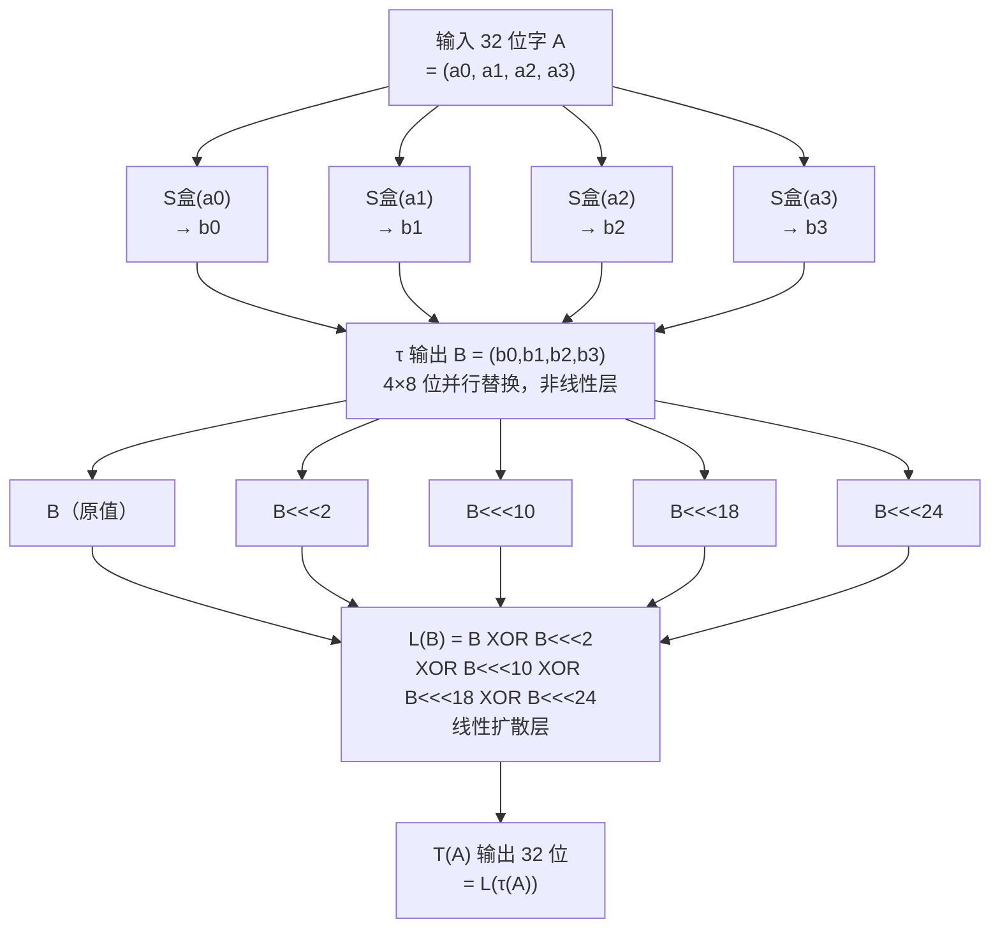

# 密码学（45）· SM4分组密码

> [!abstract] TL;DR
> - **SM4**（GM/T 0002-2012，原称 SMS4）：中国国家商用密码局于 2006 年公开（随 WAPI 无线局域网标准发布），2012 年正式成为国密标准，2021 年纳入 ISO/IEC 18033-3。
> - **参数**：分组固定 **128 位**，密钥 **128 位**，共 **32 轮**（比 AES-128 的 10 轮多 3 倍以上轮数）。
> - **结构**：**广义 Feistel（非平衡变体）**：每轮仅对一个 32 位字施加轮函数，其余三个字整体右移，32 轮后反序输出。
> - **轮函数 T**：合成置换 T = L ∘ τ，其中 τ 是 4 个并行 8→8 S 盒（非线性层），L 是线性扩散层（5 个循环左移 XOR）。
> - **加解密对称**：解密仅需将 32 个轮密钥**逆序**使用，结构完全相同，无须单独实现逆变换电路。
> - **工作模式与 AES 完全相同**：ECB/CBC/CTR/GCM 等模式均适用（见 [[10.分组密码工作模式总论]]）；推荐 SM4-GCM 提供 AEAD。
> - **应用**：国密 TLS/TLCP、WAPI 无线加密、金融报文（人行、银联）、电子政务合规场景。

本篇深入讲解 SM4 的广义 Feistel 结构、S 盒设计、合成置换 T 的数学原理与密钥扩展，并与 [[04.AES详解]] 做完整对比。工作模式见 [[10.分组密码工作模式总论]]，国密体系全景见 [[44.国密SM体系概览]]。

---

## 概述与定位

### 从 WAPI 到国家标准

SM4 的历史始于 2003 年无线局域网国家强制标准 WLAN Authentication and Privacy Infrastructure（WAPI，GB 15629.11）。WAPI 将 WEP 替换为专有无线加密，底层分组密码即后来的 SM4（当时代号 SMS4）。2006 年国家密码局公开 SMS4 算法全文，2012 年正式以 GM/T 0002-2012 标准化更名为 SM4，2021 年成为 ISO/IEC 18033-3 国际标准。

与同家族的 [[44.国密SM体系概览]] 其他算法相比，SM4 承担的是**对称加密**核心角色：

| 算法 | 角色 | 类比西方算法 |
|---|---|---|
| SM4 | 分组密码（加密） | AES |
| SM3 | 哈希函数 | SHA-256 |
| SM2 | 公钥密码/签名 | ECDSA/ECDH（基于国密曲线） |
| ZUC | 流密码 | ChaCha20 |

### 参数速查

| 参数 | SM4 | AES-128 |
|---|---|---|
| 分组大小 | **128 位** | 128 位 |
| 密钥长度 | **128 位** | 128 位 |
| 轮数 | **32** | 10 |
| 每轮处理单元 | 32 位字（4 字节） | 128 位全块 |
| 结构 | 广义 Feistel | 替换-置换网络（SPN） |
| 加解密结构 | 相同（轮密钥逆序） | 不同（需逆 S 盒/逆 MixColumns） |
| S 盒 | 4 个 8→8（并行） | 1 个 8→8（全块 16 次） |

> [!note] 32 轮的必要性
> AES 用 SPN 结构每轮处理全部 128 位，混淆与扩散效率极高，10 轮即可达到充分的雪崩效应。SM4 的广义 Feistel 每轮只处理 1/4 数据（32 位），扩散速度较慢，因此需要 32 轮才能使每个输出位充分依赖所有输入位，达到相近的安全裕量。

---

## 数据表示与记号

SM4 将 128 位明文 P 表示为 4 个 32 位字，按大端（big-endian）排列：

```
P = (X0, X1, X2, X3)     每个 Xi 为 32 位无符号整数

32 位字内部：高位字节在前（大端），如：
  字节序 b0 b1 b2 b3 → Xi = b0<<24 | b1<<16 | b2<<8 | b3
```

密钥 K、密文 C 同样表示为 (K0, K1, K2, K3) 和 (Y0, Y1, Y2, Y3)。

轮函数产生的中间状态序列记为 (X0, X1, ..., X35)，其中 X0–X3 为明文输入，X4–X35 由 32 轮迭代产生，最终密文 C = (X35, X34, X33, X32)（注意**反序**输出）。

---

## 原理与机制

### 广义 Feistel 结构

经典 Feistel（如 DES）将 64 位块对半分为两个 32 位半块，每轮交换并对一个半块施加轮函数。SM4 将 128 位块分为 **四个 32 位字**，每轮只更新最左侧一个字，其余三个字整体右移一位：

```
第 i 轮（i = 0, 1, ..., 31）：
  Xi+4 = Xi  XOR  F(Xi+1, Xi+2, Xi+3, rki)
  
  其中 rki 为第 i 个轮密钥，F 为轮函数
  状态更新：
    (Xi+1, Xi+2, Xi+3, Xi+4) 作为下一轮的 (X_, X_, X_, _)
```

32 轮结束后，最终四个字 (X35, X34, X33, X32) **反序排列**输出为密文 (Y0, Y1, Y2, Y3)。反序输出是 SM4 结构设计的对称性保证——它使得解密只需将轮密钥逆序，结构不变。

### 轮函数 F

轮函数 F 接受三个 32 位字和一个 32 位轮密钥，输出一个 32 位字：

```
F(A, B, C, rk) = A  XOR  T(B XOR C XOR rk)
```

其中 T 为**合成置换（Compound Transformation）**，也是 SM4 算法的核心设计。

### 合成置换 T = L(τ(·))

T 由两层组成：

**第一层：非线性变换 τ（S 盒层）**

将 32 位字 A = (a0, a1, a2, a3)（四个字节）分别查 SM4 的 8→8 S 盒：

```
τ(A) = (Sbox(a0), Sbox(a1), Sbox(a2), Sbox(a3))
```

四个 S 盒完全相同，并行独立执行，输出仍是 32 位字 B = (b0, b1, b2, b3)。

**第二层：线性扩散 L（循环移位 XOR 网络）**

对非线性变换的输出 B 施加线性变换 L：

```
L(B) = B XOR (B<<<2) XOR (B<<<10) XOR (B<<<18) XOR (B<<<24)
```

其中 `B<<<n` 表示 B 按位循环左移 n 位（32 位范围内）。五个移位量 {0, 2, 10, 18, 24} 使得 L 的输出中每一位均依赖输入 B 的多个位，实现列内扩散——每轮 32 位字内部的完全混合。

合成置换完整写法：

```
T(A) = L(τ(A))
     = τ(A)  XOR  (τ(A)<<<2)  XOR  (τ(A)<<<10)
             XOR  (τ(A)<<<18) XOR  (τ(A)<<<24)
```

> [!note] 为何选这五个移位量
> {0, 2, 10, 18, 24} 满足一个关键性质：对于 32 位字的任意连续 8 位区段，L 的输出中对应位置均被至少两个不同移位的输入覆盖。这保证了单字节差异经 L 后在 32 位输出中至少影响 3 个字节，与 S 盒的扩散效果相乘，形成足够的雪崩基础。

### Mermaid：SM4 一轮的合成置换 T



---

## SM4 S 盒

SM4 使用单张 8→8 的 S 盒（与 AES 不同，AES S 盒基于 GF(2⁸) 乘法逆；SM4 S 盒基于复合域构造）。

### SM4 S 盒（完整 16×16 表，行=高 4 位，列=低 4 位）

```
       _0   _1   _2   _3   _4   _5   _6   _7   _8   _9   _A   _B   _C   _D   _E   _F
0x_  D6   90   E9   FE   CC   E1   3D   B7   16   B6   14   C2   28   FB   2C   05
1x_  2B   67   9A   76   2A   BE   04   C3   AA   44   13   26   49   86   06   99
2x_  9C   42   50   F4   91   EF   98   7A   33   54   0B   43   ED   CF   AC   62
3x_  E4   B3   1C   A9   C9   08   E8   95   80   DF   94   FA   75   8F   3F   A6
4x_  47   07   A7   FC   F3   73   17   BA   83   59   3C   19   E6   85   4F   A8
5x_  68   6B   81   B2   71   64   DA   8B   F8   EB   0F   4B   70   56   9D   35
6x_  1E   24   0E   5E   63   58   D1   A2   25   22   7C   3B   01   21   78   87
7x_  D4   00   46   57   9F   D3   27   52   4C   36   02   E7   A0   C4   C8   9E
8x_  EA   BF   8A   D2   40   C7   38   B5   A3   F7   F2   CE   F9   61   15   A1
9x_  E0   AE   5D   A4   9B   34   1A   55   AD   93   32   30   F5   8C   B1   E3
Ax_  1D   F6   E2   2E   82   66   CA   60   C0   29   23   AB   0D   53   4E   6F
Bx_  D5   DB   37   45   DE   FD   8E   2F   03   FF   6A   72   6D   6C   5B   51
Cx_  8D   1B   AF   92   BB   DD   BC   7F   11   D9   5C   41   1F   10   5A   D8
Dx_  0A   C1   31   88   A5   CD   7B   BD   2D   74   D0   12   B8   E5   B4   B0
Ex_  89   69   97   4A   0C   96   77   7E   65   B9   F1   09   C5   6E   C6   84
Fx_  18   F0   7D   EC   3A   DC   4D   20   79   EE   5F   3E   D7   CB   39   48
```

查表示例：输入 `0x53` → 行 5（高位 5），列 3（低位 3）→ S 盒值 = `0x35`。

### S 盒的代数构造

SM4 S 盒通过**复合域**（Composite Field，GF(((2²)²)²)）构造，而非直接在 GF(2⁸) 上求逆。构造步骤为：

1. 将输入字节映射到 GF(2⁸) 的子域复合结构
2. 在复合域 GF(((2²)²)²) 中求逆（可分解为若干小规模求逆，有利于硬件优化）
3. 施加 GF(2) 上的 8×8 仿射变换和常数加法
4. 映射回标准域

复合域构造的主要优势是：硬件电路面积可比直接 GF(2⁸) 求逆减少约 20–30%，这也是 SM4 在嵌入式/FPGA 场景的实现优势之一。

---

## 算法流程与伪代码

### 加密流程

```
SM4 加密：输入明文 P = (X0, X1, X2, X3)，轮密钥序列 (rk0, rk1, ..., rk31)

for i = 0 to 31:
    Xi+4 = Xi  XOR  T(Xi+1 XOR Xi+2 XOR Xi+3 XOR rki)

密文 C = (X35, X34, X33, X32)   // 注意：反序输出
```

其中 T(·) = L(τ(·))，L 和 τ 的定义见上节。

### 解密流程

```
SM4 解密：与加密结构完全相同，仅轮密钥逆序

for i = 0 to 31:
    Xi+4 = Xi  XOR  T(Xi+1 XOR Xi+2 XOR Xi+3 XOR rk(31-i))   // 轮密钥下标逆序
```

验证：若以 (X35, X34, X33, X32) 为输入（即密文反序后当作"明文"），用逆序轮密钥经 32 轮后输出 (X3, X2, X1, X0) 反序即恢复原始明文 (X0, X1, X2, X3)。这种对称性来自广义 Feistel 结构的内在性质。

> [!note] 对比 AES 解密
> AES 由于使用 SPN 结构，解密需要逆 S 盒（InvSubBytes）、逆行移位（InvShiftRows）、逆列混合（InvMixColumns）三个专用逆变换，实现复杂度更高（但 AES-NI 在硬件层面将此差异消除）。SM4 加解密共用同一套电路，仅轮密钥表顺序不同，对嵌入式硬件友好。

### 数值示例（部分轮）

以下示例使用全零明文和全零密钥（仅为结构说明，非完整正式向量）：

```
明文 P  = 00000000 00000000 00000000 00000000
密钥 K  = 00000000 00000000 00000000 00000000（示例）

第 0 轮：
  A = X1 XOR X2 XOR X3 XOR rk0
  τ(A)：对 A 的每个字节查 S 盒
  L(τ(A))：对结果做 5 次移位 XOR
  X4 = X0 XOR L(τ(A))
  ...（共 32 轮）
密文（标准测试向量见 GM/T 0002-2012 附录 A）
```

> [!warning] 示例输出为示意
> 完整正式测试向量请以 GM/T 0002-2012 标准文本或 openssl enc -sm4-cbc 实际运行结果为准。

---

## 密钥扩展

SM4 密钥扩展使用的常量与结构类似轮函数，但引入**系统参数 FK** 和**固定参数 CK**。

### 系统参数 FK

四个 32 位常量，直接与原始密钥 XOR 后初始化扩展过程：

```
FK0 = A3B1BAC6    FK1 = 56AA3350
FK2 = 677D9197    FK3 = B27022DC
```

### 固定参数 CK

32 个 32 位常量，第 i 个 CK 的第 j 字节（0≤j≤3）由以下规则生成：

```
CKi,j = (4i + j) × 7  (mod 256)

CK0  = 00070E15  CK1  = 1C232A31  CK2  = 383F464D  CK3  = 545B6269
CK4  = 70777E85  CK5  = 8C939AA1  CK6  = A8AFB6BD  CK7  = C4CBD2D9
...（共 32 个，完整值见 GM/T 0002-2012 标准）
```

### 扩展过程

```
密钥扩展：输入 K = (MK0, MK1, MK2, MK3)

初始化：
  K0 = MK0 XOR FK0
  K1 = MK1 XOR FK1
  K2 = MK2 XOR FK2
  K3 = MK3 XOR FK3

生成轮密钥（i = 0, 1, ..., 31）：
  rki = Ki  XOR  T'(Ki+1 XOR Ki+2 XOR Ki+3 XOR CKi)
  Ki+4 = rki     // 更新内部状态
```

其中 T'(·) 是**密钥扩展专用合成置换**：

```
T'(B) = L'(τ(B))

L'(B) = B XOR (B<<<13) XOR (B<<<23)
```

注意：L' 与轮函数中的 L 不同，仅使用两个移位量 {13, 23}（不含 0 位，即原值）。这避免了轮密钥与数据路径共用完全相同的线性层，增加密钥扩展的独立性。

> [!note] 与 AES 密钥扩展对比
> AES 密钥扩展使用 RotWord + SubWord（借用数据路径的 S 盒）+ Rcon（GF(2⁸) 幂次常量）。SM4 密钥扩展引入了独立的固定常量 FK/CK 和不同的线性层 L'，使密钥扩展与数据加密路径的代数关联更弱，增强对相关密钥攻击的抵抗力。

---

## 与 AES 的详细对比

### 结构对比

| 维度 | SM4 | AES-128 |
|---|---|---|
| 结构类型 | 广义 Feistel（每轮处理 1 个 32 位字） | SPN（每轮处理全部 128 位） |
| 非线性来源 | 4 个并行 8→8 S 盒（复合域构造） | 1 个 8→8 S 盒（GF(2⁸) 逆+仿射，调用 16 次） |
| 扩散机制 | L 层（5 次循环移位 XOR） | ShiftRows（行移位）+ MixColumns（MDS 矩阵） |
| 密钥注入 | XOR（在轮函数输入混合） | AddRoundKey（单独步骤，每轮末尾） |
| 加解密对称 | 是（仅逆序轮密钥） | 否（需逆 S 盒、逆 MixColumns） |
| 轮数 | 32 | 10 |
| 密钥扩展 | FK/CK 常量 + L'（专用线性层） | RotWord/SubWord/Rcon + S 盒复用 |

### 性能对比（软件）

| 平台 | SM4 吞吐量（估计） | AES-128-NI 吞吐量（参考） |
|---|---|---|
| x86-64 纯软件 | ~500 MB/s（查表实现） | ~300–500 MB/s（查表，有 cache 侧信道风险） |
| x86-64 + SM4-NI（GFNI） | ~4–10 GB/s | ~10 GB/s（AES-NI） |
| ARM Cortex-A（ARMv8 CE） | ~1–2 GB/s（SM4 指令） | ~2–5 GB/s（AES 指令） |
| 嵌入式（无硬件加速） | SM4 因结构简单，面积占优 | AES 逆运算需额外逻辑 |

> [!note] SM4-NI / GFNI 加速
> Intel 从 Ice Lake 架构起，AVX-512 的 GFNI（Galois Field New Instructions，`GF2P8AFFINEINVQB` 等）可用于加速 SM4 的 S 盒计算。部分 CPU（如龙芯 3A5000、申威 1621）在 ISA 层面直接提供 SM4 专用指令（`vsm4rnds4` 等）。ARMv8.4-A 的 SM4 扩展（`sm4e`/`sm4ekey`）同样提供单指令轮计算。

### 安全性横向对比

| 指标 | SM4 | AES-128 |
|---|---|---|
| 分支数（线性层） | L 层分支数 = 5（与 AES MixColumns 相同） | MixColumns 分支数 = 5 |
| S 盒差分均匀性 | 最大差分特征概率 2⁻⁶ | 同为 2⁻⁶ |
| S 盒线性偏置 | 最大 2⁻⁴ | 2⁻³ （SM4 略优） |
| 代数次数 | S 盒代数次数 = 7（最大） | S 盒代数次数 = 7 |
| 最优差分攻击 | 可覆盖约 22–24 轮，32 轮有安全裕量 | 可覆盖约 6 轮，10 轮有安全裕量 |
| 已知实用攻击 | 无（针对完整 32 轮） | 无（针对完整 10 轮） |
| 相关密钥攻击 | 无已知实用攻击 | AES-256 有理论结果（实用场景无威胁） |

---

## 工作模式

SM4 作为分组密码，与 AES 共享全套工作模式体系（详见 [[10.分组密码工作模式总论]]）：

| 模式 | 推荐程度 | 关键注意事项 |
|---|---|---|
| SM4-ECB | 禁用（除教学） | 相同明文块产生相同密文块，泄露数据模式 |
| SM4-CBC | 过渡可用 | IV 必须随机且不可预测；无认证，需配 HMAC-SM3 |
| SM4-CTR | 可用（无认证） | 计数器+Nonce 绝不在同密钥下重复 |
| SM4-GCM | **推荐（AEAD）** | 提供加密+完整性；Nonce 绝不重用 |
| SM4-CCM | 可用（受限环境） | 报文长度须预知，适合 IoT/低内存设备 |
| SM4-XTS | 磁盘加密 | 与 AES-XTS 同语义 |

> [!warning] 国密 TLS（TLCP）工作模式要求
> GB/T 38636-2020 TLCP（Transport Layer Cryptography Protocol）和 RFC 8998（TLS 1.3 with SM Cipher Suites）均要求 SM4-GCM 或 SM4-CCM 作为记录层加密，禁止 ECB/CBC 单独使用。

---

## 应用场景

### 国密 TLS / TLCP

GB/T 38636-2020 定义的 TLCP 协议（有时也称 GMSSL），密码套件形如：

```
ECC_SM4_CBC_SM3      — SM4-CBC 加密，SM3-HMAC 完整性
ECC_SM4_GCM_SM3      — SM4-GCM AEAD（推荐）
```

RFC 8998 则将 SM 密码套件引入标准 TLS 1.3，使跨境互联互通成为可能。

### WAPI 无线加密

WAPI（GB 15629.11）的 WAI 认证协议和 WPI 数据加密均使用 SM4，是 SM4 最早的公开商业部署。

### 金融与电子政务

- 中国人民银行《金融行业密码应用指导规范》（JR/T 0171）要求金融报文使用国密算法，SM4 是首选对称加密。
- 电子政务合规：凡涉及国家秘密或跨政务系统的数据传输，须使用经国家密码局认证的国密算法，SM4 在此场景下是 AES 的合规替代。

### 使用 OpenSSL（GmSSL）示例

```bash
# GmSSL 3.x 中使用 SM4-GCM 加密文件
gmssl sm4-gcm -encrypt -in plaintext.bin -out ciphertext.bin \
  -key <hex_key_128bit> -iv <hex_nonce_96bit>

# OpenSSL 3.x 支持 SM4（需要 -provider legacy 或编译时启用）
openssl enc -sm4-gcm -encrypt -in plaintext.bin -out ciphertext.bin \
  -K <hex_key> -iv <hex_nonce>
```

> [!warning] 示例输出为示意
> 实际密钥/IV 长度和参数格式因工具版本而异，请以各工具文档和 GM/T 0002-2012 标准附录为准。

---

## 安全性与正确使用

### SM4 的安全现状

| 攻击类型 | 针对完整 32 轮 SM4 的状态 |
|---|---|
| 暴力枚举 | 密钥空间 2¹²⁸，不可行 |
| 差分密码分析 | 最优差分路径可覆盖约 22–24 轮，32 轮有约 8 轮安全裕量 |
| 线性密码分析 | 同上，32 轮充分 |
| 代数攻击 | S 盒代数次数最高，无实用攻击 |
| 相关密钥攻击 | 无已知实用攻击 |
| 积分攻击 | 最优覆盖约 14 轮；32 轮有充裕裕量 |
| 不可能差分 | 最优约 18 轮；32 轮安全 |
| 实用攻击 | 无（针对完整 32 轮） |

SM4 与 AES-128 的安全现状相近，在正确使用条件下均无实用威胁。已知的实际风险同样来自**模式误用、密钥管理缺陷和侧信道**，而非算法本身。

### 必须配合安全工作模式（AEAD）

> [!warning] 单独使用 SM4-ECB 或裸 SM4-CBC 是危险的
> 与 AES 完全相同的警告：SM4 作为分组密码只保证单块的伪随机置换，不保护多块数据的语义安全，也不提供完整性。必须通过工作模式补全这两个性质。

推荐的安全组合：

```
加密 + 认证（AEAD）  →  SM4-GCM 或 SM4-CCM（国密 TLS 要求）
加密 + 外部 MAC      →  SM4-CBC + HMAC-SM3（先加密后 MAC）
随机访问存储加密     →  SM4-XTS（磁盘/存储合规场景）
```

### Nonce/IV 安全管理

| 模式 | Nonce/IV 要求 | 重用后果 |
|---|---|---|
| SM4-GCM | 96 位（12 字节），**同密钥下唯一** | 立即泄露认证密钥，可伪造任意消息 |
| SM4-CBC | 128 位（16 字节），**必须真随机** | 选择明文攻击下恢复明文（BEAST 类） |
| SM4-CTR | 96 位 Nonce + 32 位计数器，**Nonce 同密钥唯一** | 两段密文 XOR 可消除密钥流 |

### 侧信道防护

SM4 的纯软件 S 盒查表实现与 AES 软件实现一样存在 cache 时序侧信道（通过 Flush+Reload 等技术可恢复密钥）。防护措施：

1. **优先使用硬件指令**：SM4-NI（龙芯/ARMv8.4-A）或 GFNI（x86 Ice Lake+），与 AES-NI 同理，硬件电路不走 cache。
2. **Bitslice 实现**：将 8 个 SM4 块并行处理，S 盒用布尔电路（而非查表）实现，消除数据依赖访存。GmSSL 中的 `sm4_avx2_encrypt_blocks` 采用此策略。
3. **常数时间 S 盒**：使用按位选择（`cmov`/`vmovmask` 等）替代查表跳转，避免 cache line 访问模式泄漏。

### 合规场景下的选型

| 场景 | 推荐算法 | 备注 |
|---|---|---|
| 中国境内等保/商密合规 | **SM4**（首选） | 满足国密局认证要求 |
| 国际互操作（跨境 TLS） | SM4（RFC 8998）或 AES-GCM | 两者可协商 |
| 量子计算威胁（长期数据） | SM4-256 暂无标准，考虑 AES-256 或混合加密 | SM4 密钥空间 128 位，后量子下 Grover 降至 ~64 位等效 |
| 嵌入式/IoT（无硬件加速） | SM4 | 加解密共用电路，面积小于 AES |

> [!note] SM4 与后量子
> SM4 的 128 位密钥在 Grover 算法下等效安全强度降至约 64 位，与 AES-128 面临同样的量子威胁。目前国密体系尚无 256 位密钥版本的 SM4 标准；对于量子场景，应考虑数据混合加密（对称密钥由后量子 KEM 协商，如 Kyber/ML-KEM，见 [[51.Kyber-ML-KEM]]）。

---

## 小结

| 特性 | SM4 |
|---|---|
| 标准 | GM/T 0002-2012 / ISO/IEC 18033-3 |
| 分组 | 128 位 |
| 密钥 | 128 位 |
| 轮数 | 32 |
| 结构 | 广义 Feistel（每轮更新 1 个 32 位字） |
| 非线性 | 4 个并行 8→8 S 盒（复合域构造） |
| 线性扩散 | L = B XOR B<<<2 XOR B<<<10 XOR B<<<18 XOR B<<<24 |
| 密钥扩展 | FK/CK 常量 + T'（专用 L' 层，移位 {13,23}） |
| 加解密对称 | 是（仅轮密钥逆序，无逆变换） |
| 硬件加速 | SM4-NI（龙芯/ARMv8.4-A）、GFNI（x86）|
| 安全现状 | 无已知实用攻击（完整 32 轮） |
| 推荐使用 | SM4-GCM（AEAD）；正确管理 Nonce；优先硬件指令 |
| 主要应用 | 国密 TLS/TLCP、WAPI、金融报文、电子政务 |

SM4 是中国商用密码体系的对称加密基石，与 AES 在分组大小和密钥长度上完全对齐，但采用了更保守的 32 轮广义 Feistel 结构，实现了加解密对称这一工程优势。其安全性在学术层面已经充分分析，无已知实用攻击威胁。在国密合规场景下，以 SM4-GCM 配合 SM3 和 SM2 构成完整的"三驾马车"，是当前国内金融、政务、通信领域的主流密码技术栈。

---

## 相关阅读

- [[04.AES详解]] — SPN 结构、GF(2⁸)、AES-NI，与 SM4 广义 Feistel 的深度对比参照
- [[44.国密SM体系概览]] — 国密标准全景、SM2/SM3/SM4/ZUC 定位与合规要求
- [[10.分组密码工作模式总论]] — SM4 与 AES 共用的工作模式体系（ECB/CBC/CTR/GCM/XTS）
- [[46.SM3哈希]] — 国密哈希，与 SM4 配合用于 SM4-CBC + HMAC-SM3 组合
- [[51.Kyber-ML-KEM]] — 后量子 KEM，与 SM4 混合加密以对抗量子威胁

---

⬅️ 上一篇 [[44.国密SM体系概览]] ｜ 🏠 [[00.密码学总览]] ｜ 下一篇 [[46.SM3哈希]] ➡️
