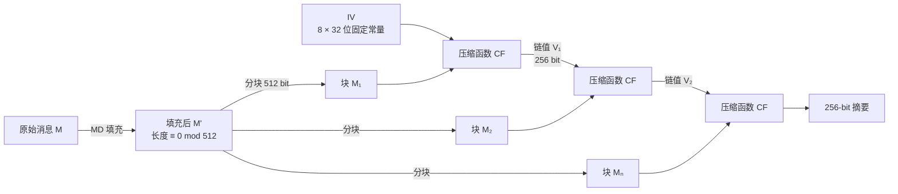
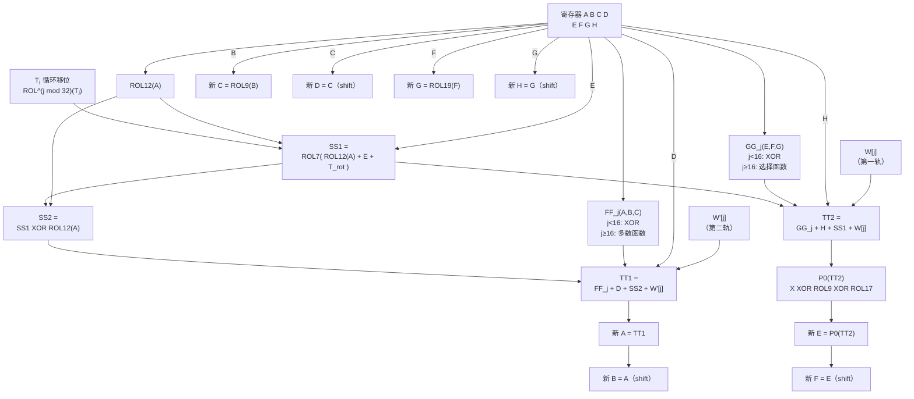

# 密码学（46）· SM3哈希

> [!abstract] TL;DR
> - **SM3** 是中国国家密码管理局于 2010 年发布（GB/T 32905 / GM/T 0004）的密码哈希函数，输出 **256 位**，512 位分组，基于 **Merkle-Damgård** 结构，共 **64 轮**压缩。
> - 与 SHA-256 同安全级别（128 位碰撞安全），但结构上有独立改进：**双轨消息扩展**（W₀..W₆₇ 与 W'₀..W'₆₃）、分前 16 步与后 48 步的 **FF/GG 布尔函数**、置换函数 **P0/P1**、循环移位的轮常量 **Tⱼ**，设计更加复杂。
> - **长度扩展攻击同样适用**（MD 结构固有弱点）；MAC 场景必须使用 **HMAC-SM3**（见 [[36.HMAC]]），禁止裸 `SM3(key ‖ msg)`。
> - **SM2 签名**内部使用 SM3 进行用户标识杂凑（ZA 值）和消息摘要；国密 TLS 和数字证书体系以 SM3 为标准哈希。
> - 截至 2026 年，SM3 无已知实际碰撞，是中国合规场景的法定哈希选择。

---

## 概述与定位

### 历史背景

SM3 于 2010 年由中国国家密码管理局（OSCCA）首次公开，以 GM/T 0004-2012 发布，2016 年纳入国标 GB/T 32905-2016，2018 年进入 ISO/IEC 10118-3:2018 附录。算法设计参考了 SHA-2 的框架，但在消息扩展、布尔函数和常量选取上做了大量改动，确保结构独立性。

SM3 在国密 SM 体系（见 [[44.国密SM体系概览]]）中扮演核心哈希角色：

- **SM2 签名**：签名前先用 SM3 计算用户可辨别标识符的杂凑值 ZA，再对 ZA ‖ 消息摘要。
- **SM9 签名**：同样依赖 SM3 生成消息摘要。
- **国密 TLS（GB/T 38636）**：PRF 和记录完整性均使用 HMAC-SM3。
- **数字证书**：签名算法字段标注 `SM3WithSM2`。

### 与 SHA-256 定位对比

| 维度 | SM3 | SHA-256 |
|------|-----|---------|
| 标准 | GM/T 0004 / GB/T 32905 | FIPS 180-4 |
| 设计机构 | 中国 OSCCA | 美国 NSA / NIST |
| 发布年份 | 2010（公开） | 2001 |
| 输出长度 | 256 bit | 256 bit |
| 分组大小 | 512 bit | 512 bit |
| 内部状态 | 8 × 32 bit（256 bit） | 8 × 32 bit（256 bit） |
| 轮数 | 64 | 64 |
| 消息扩展 | 双轨（W₀..W₆₇ + W'）| 单轨（W₀..W₆₃） |
| 布尔函数 | FF/GG 分段不同 | Ch/Maj 全程不变 |
| 置换函数 | P0/P1（包含异或+旋转）| 无（仅旋转混合 Σ） |
| 碰撞安全 | 2¹²⁸（理论） | 2¹²⁸（理论） |
| 长度扩展攻击 | 受影响 | 受影响 |
| 硬件加速 | 部分芯片支持（龙芯/飞腾） | x86 SHA-NI 广泛支持 |

> [!note] SM3 比 SHA-256 结构更复杂
> SHA-256 消息扩展只生成 64 个字（W₀..W₆₃）；SM3 生成 68 个字（W₀..W₆₇）再派生 64 个混合字（W'ⱼ = Wⱼ XOR Wⱼ₊₄），共 132 次字生成操作（vs SHA-256 的 64 次），且布尔函数在轮次切换处不同。代价是性能略低于 SHA-256（在相同硬件无专用加速时约慢 10–20%）。

---

## 原理与机制

### Merkle-Damgård 结构

SM3 沿用 [[29.哈希函数原理]] 中介绍的经典 Merkle-Damgård（MD）迭代框架——与 [[32.SHA-2]] 在宏观结构上完全对等：

```
消息 M  ──填充──►  M₁ ‖ M₂ ‖ … ‖ Mₙ   （每块 512 bit）
                        │    │         │
         IV ──►  CF(IV, M₁) ─► CF(·, M₂) ─► … ──► CF(·, Mₙ) ──► 256-bit 哈希
```

- **IV**：8 个固定 32 位常量（见下文）。
- **CF**（Compression Function）：SM3 压缩函数，接收 256 位链值和 512 位消息块，输出新的 256 位链值。
- **MD 填充（同 SHA-256）**：末尾追加 `1` bit，填 `0` 至 `|M| + 1 ≡ 448 (mod 512)`，最后附 64 位大端消息长度（bit 计数）。



### 初始值 IV

SM3 的 8 个 32 位初始链值（大端）为：

```
IV₀ = 0x7380166F    IV₁ = 0x4914B2B9
IV₂ = 0x172442D7    IV₃ = 0xDA8A0600
IV₄ = 0xA96F30BC    IV₅ = 0x163138AA
IV₆ = 0xE38DEE4D    IV₇ = 0xB0FB0E4E
```

与 SHA-256 的 IV（取平方根小数部分，"nothing up my sleeve"）不同，SM3 的 IV 是直接给定的常量，标准未公开生成方法。

### MD 填充细节

与 SHA-256 完全相同的填充方案：

```
输入：消息 M，|M| = L bit

1. 追加 1 bit "1"
2. 追加 k 个 "0" bit，使 L + 1 + k ≡ 448 (mod 512)
3. 追加 64 位大端整数 = L
```

填充后总长度为 512 的整数倍。

---

## 算法流程与结构详解

### 消息扩展：双轨展开

SM3 最显著的结构特征是**双轨消息扩展**。每个 512 位消息块（16 个 32 位字 B₀..B₁₅）被扩展为两组字：

**第一轨：W₀..W₆₇（68 个字）**

```
W[j] = B[j]                                        对 j = 0..15

W[j] = P1(W[j-16] XOR W[j-9] XOR ROL15(W[j-3]))
       XOR ROL7(W[j-13]) XOR W[j-6]                对 j = 16..67
```

**第二轨：W'₀..W'₆₃（64 个混合字）**

```
W'[j] = W[j] XOR W[j+4]                            对 j = 0..63
```

其中 `P1`（置换函数 P1）定义为：

```
P1(X) = X XOR ROL15(X) XOR ROL23(X)
```

`ROLⁿ(x)` 表示循环左移 n 位。

> [!note] 双轨设计的意义
> SHA-256 消息扩展生成 64 个字（W₀..W₆₃），每个字直接用于一轮压缩。SM3 生成 68 个 W 字用于混入（含 XOR 与置换），再用 W XOR W[j+4] 得到 W' 才真正参与压缩，提高了扩展的非线性复杂度。第一轨中 P1 置换包含两个循环左移（15 和 23 位），与 SHA-256 的 σ 函数（旋转 + 移位）相比，全程无逻辑右移，差分路径构造更困难。

### 轮常量 Tⱼ

SM3 使用随轮次 j 循环移位的常量，而非 SHA-256 的固定常量表：

```
Tⱼ = 0x79CC4519      对 j = 0..15
Tⱼ = 0x7A879D8A      对 j = 16..63

实际使用时以循环左移代入：
Tⱼ_rotated = ROL^(j mod 32)(Tⱼ)
```

即两个基础常量分别在各自范围内随轮次旋转，避免了常量表的冗余存储，同时使每轮注入的常量位模式不同。

### 布尔函数 FF 与 GG

SM3 的布尔函数在前 16 步（j < 16）与后 48 步（j ≥ 16）分别不同：

```
         ┌ A XOR B XOR C                    j = 0..15
FF_j(A,B,C) = ┤
         └ (A AND B) OR (A AND C) OR (B AND C)   j = 16..63

         ┌ A XOR B XOR C                    j = 0..15
GG_j(A,B,C) = ┤
         └ (A AND B) OR (NOT A AND C)            j = 16..63
```

前 16 步 FF/GG 均为纯异或（线性）；后 48 步 FF 变为多数函数（与 SHA-256 的 Maj 同形），GG 变为选择函数（与 SHA-256 的 Ch 同形）。

> [!note] 分段策略的设计意图
> 前 16 步使用线性函数便于实现快速扩散（消息各位分布到链值各位）；后 48 步引入非线性函数（AND/OR）提供抗差分性。SHA-256 的 Ch/Maj 全程相同，SM3 这种分段增加了差分路径搜索的复杂度。

### 置换函数 P0

压缩函数中还用到另一个置换函数 P0，作用于中间结果 SS1/SS2 之后：

```
P0(X) = X XOR ROL9(X) XOR ROL17(X)
```

与 P1（用于消息扩展）相比，P0 旋转量不同（9 和 17 vs 15 和 23）。

### 压缩函数：64 步主循环

**初始化工作寄存器**（首块取 IV，后续块取前一块输出）：

```
A, B, C, D, E, F, G, H = V₀, V₁, V₂, V₃, V₄, V₅, V₆, V₇
```

**执行 64 步（j = 0..63）**：

```
SS1 = ROL7( ROL12(A) + E + ROL^(j mod 32)(Tⱼ) )
SS2 = SS1 XOR ROL12(A)
TT1 = FF_j(A, B, C) + D + SS2 + W'[j]
TT2 = GG_j(E, F, G) + H + SS1 + W[j]
D   = C
C   = ROL9(B)
B   = A
A   = TT1
H   = G
G   = ROL19(F)
F   = E
E   = P0(TT2)
```

（所有加法为 mod 2³² 无符号加法）

**64 步结束后，Davies-Meyer 式 feed-forward**：

```
V₀ ^= A,  V₁ ^= B,  V₂ ^= C,  V₃ ^= D
V₄ ^= E,  V₅ ^= F,  V₆ ^= G,  V₇ ^= H
```

最终 V₀ ‖ V₁ ‖ … ‖ V₇（共 256 bit）即为该消息块处理后的链值；末块处理完成后即为最终哈希值。

### SM3 压缩函数轮结构



### 与 SHA-256 压缩函数逐点对比

| 特征 | SM3 | SHA-256 |
|------|-----|---------|
| 工作寄存器 | A B C D E F G H（8 × 32 bit） | a b c d e f g h（8 × 32 bit） |
| 消息输入 | W[j] + W'[j] 双字（每步 2 字） | W[i] 单字（每步 1 字） |
| 布尔函数 | FF/GG 分前 16/后 48 步 | Ch/Maj 全程固定 |
| 置换函数 | P0（压缩函数中）、P1（消息扩展中） | 无显式置换（仅 Σ 旋转异或） |
| 轮常量 | 2 个基础值循环移位 | 64 个预计算固定常量 |
| 旋转量（轮函数） | ROL12(A)、ROL7(·)、ROL9(B)、ROL19(F) | ROTR 系列（右移） |
| feed-forward | V_i ^= 工作变量（同 Davies-Meyer） | H_i += 工作变量（同 Davies-Meyer） |
| 步骤开销 | 每步约 11 次运算 | 每步约 8 次运算 |

> [!note] 左移 vs 右移
> SHA-256 全程使用循环**右**移（ROTR），SM3 全程使用循环**左**移（ROL）。两者等价（ROLⁿ = ROTR^(32-n)），但设计上的独立选择体现了 SM3 非 SHA-256 衍生品的立场。

---

## 代码与示例

### 伪代码总览

```
SM3(M):
    M' = Pad(M)                             // MD 填充，长度 ≡ 0 mod 512
    将 M' 分为 n 个 512-bit 块 B[0..n-1]
    V = IV                                  // 初始 8 × 32 bit 链值

    for i = 0 to n-1:
        // 消息扩展
        W[0..15] = B[i] 的 16 个 32-bit 大端字
        for j = 16 to 67:
            W[j] = P1(W[j-16] XOR W[j-9] XOR ROL15(W[j-3]))
                   XOR ROL7(W[j-13]) XOR W[j-6]
        for j = 0 to 63:
            W'[j] = W[j] XOR W[j+4]

        // 压缩
        A,B,C,D,E,F,G,H = V[0..7]
        for j = 0 to 63:
            Tj = (j < 16) ? 0x79CC4519 : 0x7A879D8A
            SS1 = ROL7( ROL12(A) + E + ROL^(j%32)(Tj) )
            SS2 = SS1 XOR ROL12(A)
            TT1 = FF_j(A,B,C) + D + SS2 + W'[j]
            TT2 = GG_j(E,F,G) + H + SS1 + W[j]
            D=C; C=ROL9(B); B=A; A=TT1
            H=G; G=ROL19(F); F=E; E=P0(TT2)
        
        // feed-forward
        V[0]^=A; V[1]^=B; V[2]^=C; V[3]^=D
        V[4]^=E; V[5]^=F; V[6]^=G; V[7]^=H

    return V[0] ‖ V[1] ‖ … ‖ V[7]          // 256-bit 大端输出
```

### 使用 OpenSSL 计算 SM3

```bash
# 需要 OpenSSL ≥ 1.1.1（含国密支持）
echo -n "abc" | openssl dgst -sm3
# 或
openssl sm3 filename.bin
```

> [!warning] 示例输出为示意
> 实际输出因 OpenSSL 版本和编译选项而异；请在支持 GM 算法的构建（如 GmSSL、OpenSSL 含国密补丁）上验证。

已知测试向量（标准附录）：

| 消息 | SM3 摘要（256 bit，十六进制） |
|------|---------------------------|
| `"abc"`（ASCII，3 字节） | `66c7f0f4 62eeedd9 d1f2d46b dc10e4e2 4167c487 5cf2f7a2 297da02b 8f4ba8e0` |
| `"abcdabcdabcdabcdabcdabcdabcdabcdabcdabcdabcdabcdabcdabcdabcdabcd"` | `debe9ff9 2275b8a1 38604889 c18e5a4d 6fdb70e5 387e5765 293dcba3 9c0c5732` |

---

## 应用场景

### SM2 签名中的 SM3

[[47.SM2公钥密码]] 签名算法对消息直接签名前，先计算用户可辨别标识符的 ZA 杂凑值：

```
ZA = SM3(ENTLA ‖ IDA ‖ a ‖ b ‖ xG ‖ yG ‖ xA ‖ yA)
```

其中 ENTLA 是 IDA 的字节长度（2 字节），IDA 是用户标识符（默认 `"1234567812345678"`），后跟曲线参数和公钥坐标。

实际被签名摘要为：

```
M̄ = SM3(ZA ‖ M)
```

SM3 在 SM2 中扮演双重角色：绑定用户身份（ZA）和消息摘要，比 ECDSA 直接哈希消息更严格。

### 国密 TLS（GB/T 38636）

国密 TLS 1.1（TLCP）协议中：

- **握手 PRF**：HMAC-SM3 作为伪随机函数基础。
- **记录层 MAC**：HMAC-SM3 保护数据完整性。
- **证书签名**：算法标识 `sm2-with-SM3`（OID 1.2.156.10197.1.501）。

### 数字证书与时间戳

符合 GM/T 0015 的 X.509 证书，`signatureAlgorithm` 字段值为 `SM3WithSM2`，签名值为对证书 TBSCertificate SM3 摘要的 SM2 签名。

---

## 安全性与正确使用

### 碰撞安全性

| 攻击类型 | 理论安全性 | 当前状态 |
|---------|-----------|---------|
| 碰撞攻击 | 2¹²⁸（生日界） | 无已知实际碰撞 |
| 原像攻击 | 2²⁵⁶ | 安全 |
| 第二原像 | 2²⁵⁶ | 安全 |

学术研究仅达到简化轮 SM3（如 24 步内的区分器），完整 64 步 SM3 与 SHA-256 同等安全状态：无实际攻击，仅有理论分析。

SM3 消息扩展中 P1 置换的非线性混合以及 FF/GG 分段策略，被认为对已知的 MD 结构差分路径搜索技术（如用于攻击 SHA-1 的 Wang 方法）有额外抵抗力，使得差分特征构造更困难。

### 长度扩展攻击——与 SHA-256 完全相同的弱点

SM3 基于 MD 结构，最终哈希值即为内部完整 256 位链值，因此**与 SHA-256 一样受长度扩展攻击影响**（见 [[32.SHA-2]] 中对该攻击的完整描述，以及 [[29.哈希函数原理]] 的 MD 结构分析）：

```
已知：SM3(K ‖ M) = h，|K| 已知
攻击者可计算：SM3(K ‖ M ‖ Pad(K ‖ M) ‖ ext) = h'
              不需要知道 K
```

> [!danger] 禁止用裸 SM3 做 MAC
> `SM3(key ‖ msg)` 或 `SM3(msg ‖ key)` 均不安全。MAC 场景必须使用 **HMAC-SM3**（[[36.HMAC]] 的构造原理完全适用）：
>
> ```
> HMAC-SM3(K, M) = SM3((K ⊕ opad) ‖ SM3((K ⊕ ipad) ‖ M))
> ```
>
> 双层嵌套将外层 SM3 的输入依赖内层 SM3 的完整输出，切断长度扩展路径，同时内外层均混入密钥，提供密钥绑定。

### SM3 与 SM4/SM2 的配合

在国密体系中，三个算法通常联合使用：

```
SM2（非对称加密/签名） ──依赖──► SM3（消息摘要）
SM4（对称加密）        ──配合──► HMAC-SM3（消息认证）
```

单独使用 SM3 作数据完整性校验时，若无密钥，仅提供**完整性**（检测意外损坏），不提供**认证性**（无法防篡改）。需要认证性必须引入 HMAC-SM3 或 SM2 签名。

### 正确使用建议

| 场景 | 推荐做法 |
|------|---------|
| 国密合规数据指纹 | SM3（256 bit 输出） |
| 国密合规 MAC | **HMAC-SM3**，密钥 ≥ 256 bit 随机数据，恒定时间比较 |
| SM2 签名 | 算法内部已规范，使用 SM3 无需额外配置 |
| 国密 TLS | 选 `ECDHE-SM2-WITH-SM4-SM3` 套件，HMAC-SM3 自动生效 |
| 密码哈希 | **禁止使用 SM3**——同 SHA-256 一样速度太快，密码存储用 bcrypt/Argon2id |
| 非合规场景 | SHA-256 或 SHA-3，生态更广；SM3 无性能优势且软件库覆盖差 |

> [!warning] SM3 不是密码哈希函数
> SM3 设计目标是高速通用哈希，现代 CPU 软件实现可达约 500 MB/s（无硬件加速），暴力破解效率极高。密码存储严禁使用 SM3。

### 量子计算影响

Grover 算法对 SM3 的原像攻击将安全性从 2²⁵⁶ 降至 2¹²⁸，碰撞安全性（2¹²⁸）在量子模型下降至 2⁸⁵（BHT 算法）。与 SHA-256 面临完全相同的量子威胁等级。后量子哈希建议使用更长输出（SHA-384/SHA-3-384 或 SM3 输出再拼接），但当前（2026 年）量子计算机尚无实际威胁。

---

## 小结

SM3 是中国国密体系中唯一法定哈希算法，与 SHA-256 在结构骨架上相同（MD + 64 步 + 256 位输出），但在三个关键细节上独立改进：

1. **双轨消息扩展**（W₀..W₆₇ + W'₀..W'₆₃）——每步同时注入两个字，P1 置换增加非线性。
2. **分段布尔函数 FF/GG**——前 16 步线性（快速扩散），后 48 步非线性（抗差分），与 SHA-256 全程固定的 Ch/Maj 不同。
3. **P0 置换与循环左移寄存器更新**——ROL9(B)、ROL19(F) 作为寄存器移位，P0 嵌入 E 路更新，结构上与 SHA-256 的纯移位赋值有明显差别。

核心使用原则：

1. **合规场景用 SM3**——国密 TLS、SM2 签名、数字证书，SM3 是法规要求。
2. **MAC 必须用 HMAC-SM3**——裸 `SM3(key ‖ msg)` 被长度扩展攻击击穿（[[36.HMAC]] 给出构造原理）。
3. **密码哈希禁用 SM3**——速度特性与密码存储需求相悖。

---

## 相关阅读

- [[29.哈希函数原理]] — Merkle-Damgård 结构、生日攻击、长度扩展攻击原理基础
- [[32.SHA-2]] — SM3 最直接的对标算法，SHA-256 结构与 SM3 差异的参照系
- [[44.国密SM体系概览]] — SM2/SM3/SM4/SM9 整体架构，SM3 的定位与调用关系
- [[36.HMAC]] — HMAC 构造原理，HMAC-SM3 的正确使用方式
- [[47.SM2公钥密码]] — SM2 签名内部如何使用 SM3 计算 ZA 和消息摘要
- GM/T 0004-2012 — SM3 密码杂凑算法标准原文
- GB/T 32905-2016 — SM3 国家标准
- ISO/IEC 10118-3:2018 — SM3 国际标准化文本

---

⬅️ 上一篇 [[45.SM4分组密码]] ｜ 🏠 [[00.密码学总览]] ｜ 下一篇 [[47.SM2公钥密码]] ➡️
