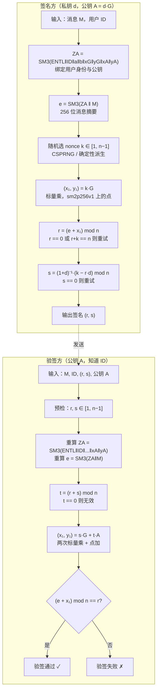

# 密码学（47）· SM2公钥密码

> [!abstract] TL;DR
> - **SM2** 是中国国家标准（GM/T 0003）的公钥密码体系，基于**椭圆曲线**，承载三项功能：**数字签名、公钥加密、密钥交换**。
> - 推荐曲线 **sm2p256v1**：256 位素域，安全强度约 128 位，与 NIST P-256 同级。
> - **SM2 签名与 ECDSA 的核心差异**：引入用户标识哈希 `ZA`（绑定 ID + 曲线参数 + 公钥），消息预处理 `e = SM3(ZA ‖ M)`，签名方程 `r = (e + x₁) mod n`、`s = (1+d)⁻¹(k − r·d) mod n`——结构上比 ECDSA 更紧凑，但同样致命于 nonce k 的安全性。
> - **SM2 加密**：基于 ECC 的非对称加密，密文格式 C1‖C3‖C2，以 SM3 构造 KDF 与完整性校验。
> - **SM2 密钥交换**：双向认证的密钥协商协议，比纯 ECDH 多一个双方身份绑定层。
> - 安全基础与 [[27.ECDSA签名]] 相同——**ECDLP 困难性**，nonce k 重用同样可直接恢复私钥，见 [[54.ECDSA-nonce攻击]]。

本篇是「密码学」国密篇的核心，承接 [[44.国密SM体系概览]] 的体系概述和 [[25.椭圆曲线密码学基础]] 的数学基础，对标 [[27.ECDSA签名]] 进行横向对比，并呼应 [[46.SM3哈希]] 在签名与加密中的内嵌使用。

---

## 概述与定位

### SM2 的来历与定位

**SM2**（ShāngMì 2，商密 2）由国家密码管理局于 2010 年发布，全称见于 GM/T 0003 系列标准（共五部分：总则、数字签名、密钥交换、公钥加密、参数定义）。2012 年上升为国家推荐标准 GB/T 32918，并于 2021 年成为 ISO/IEC 14888-3（数字签名附录）的国际标准方案。

SM2 属于 ECC 体系，用途完整：

| 功能 | SM2 机制 | 类比 IETF 标准 |
|---|---|---|
| 数字签名 | SM2 签名（GM/T 0003.2） | ECDSA（RFC 6979） |
| 公钥加密 | SM2 加密（GM/T 0003.4） | ECIES |
| 密钥交换 | SM2 密钥交换（GM/T 0003.3） | ECDH |

与 ECDSA/ECDH 最显著的差异在于：

1. **内嵌 SM3**：签名和加密均强制使用 [[46.SM3哈希]] 作为哈希/KDF，不允许替换为 SHA-256。
2. **用户标识 ZA**：签名前把用户 ID、曲线参数、公钥一起哈希为 ZA，绑定身份与公钥，ECDSA 没有这层。
3. **签名方程不同**：SM2 签名方程是 `r = (e + x₁) mod n` 和 `s = (1+d)⁻¹(k − r·d) mod n`，与 ECDSA 的 `r = R.x mod n`、`s = k⁻¹(z + rd) mod n` 形式不同，参见后文对比。

### sm2p256v1 曲线参数

SM2 推荐使用 256 位素域椭圆曲线，业界通称 **sm2p256v1**（OID `1.2.156.10197.1.301`）。

曲线方程：`y² ≡ x³ + ax + b (mod p)`

```
p  = FFFFFFFEFFFFFFFFFFFFFFFFFFFFFFFFFFFFFFFF00000000FFFFFFFFFFFFFFFF
     （256 位大素数，形如 2²⁵⁶ − 2²²⁴ − 2⁹⁶ + 2⁶⁴ − 1 的近似，实际为十六进制值）

a  = FFFFFFFEFFFFFFFFFFFFFFFFFFFFFFFFFFFFFFFF00000000FFFFFFFFFFFFFFFC
     （即 p − 3，曲线上点加公式可适度优化）

b  = 28E9FA9E9D9F5E344D5A9E4BCF6509A7F39789F515AB8F92DDBCBD414D940E93

Gx = 32C4AE2C1F1981195F9904466A39C9948FE30BBFF2660BE1715A4589334C74C7
Gy = BC3736A2F4F6779C59BDCEE36B692153D0A9877CC62A474002DF32E52139F0A0

n  = FFFFFFFEFFFFFFFFFFFFFFFFFFFFFFFF7203DF6B21C6052B53BBF40939D54123
     （基点 G 的阶，256 位大素数）

h  = 1  （余因子，即曲线上点的总数 = n × h = n）
```

> [!note] 与 NIST P-256 对比
> sm2p256v1 和 P-256 都是 256 位素域 Weierstrass 曲线，安全强度均约 128 位经典安全。两者最大区别是曲线系数不同（P-256 的 b 参数来自 "nothing-up-my-sleeve" 哈希种子；sm2p256v1 的 b 由国密局公布）。曲线点加、标量乘运算结构一致，详见 [[25.椭圆曲线密码学基础]]。

---

## 原理与机制——SM2 数字签名

### 用户标识哈希 ZA：SM2 签名的独特前置

ECDSA 直接对消息哈希签名。SM2 在签名前增加了一步**用户身份绑定**，将签名者的标识符（ID）、曲线系数和公钥一起哈希为一个 256 位的"用户身份参数 ZA"，再与消息拼接后哈希，得到实际被签名的 e。

ZA 的计算方式（GM/T 0003.2 第 5.5 节）：

```
ZA = SM3( ENTL ‖ ID ‖ a ‖ b ‖ xG ‖ yG ‖ xA ‖ yA )
```

各字段说明：

| 字段 | 含义 | 长度 |
|---|---|---|
| ENTL | ID 长度（比特数），大端 16 位整数 | 2 字节 |
| ID | 签名者标识符（字节串） | 可变（默认"1234567812345678"，共 16 字节） |
| a, b | 曲线系数（256 位，大端字节串） | 各 32 字节 |
| xG, yG | 基点 G 的坐标（256 位，大端字节串） | 各 32 字节 |
| xA, yA | 签名者公钥 A 的坐标（256 位，大端字节串） | 各 32 字节 |

计算后的 ZA 是 256 位（32 字节）的 SM3 哈希值。

**设计意图**：ZA 把签名者的公钥和曲线参数"烙印"进消息摘要，即使攻击者更换了曲线参数（曲线替换攻击），或同一消息在不同公钥持有者之间被重放，都会因 ZA 不同导致验签失败。这是 SM2 对 ECDSA 的一个额外防护层。

### SM2 签名生成——数学推导

**参数**：
- 曲线参数 `(p, a, b, G, n)`（sm2p256v1）
- 私钥：随机整数 `d ∈ [1, n−2]`
- 公钥：`A = d·G`（曲线上的点 `(xA, yA)`）

**签名步骤**：

```
SM2_Sign(d, M, ID):
  # 步骤 1：计算用户身份哈希
  ZA = SM3(ENTL ‖ ID ‖ a ‖ b ‖ xG ‖ yG ‖ xA ‖ yA)

  # 步骤 2：计算待签消息摘要
  e = SM3(ZA ‖ M)
  将 e 解释为大整数

  # 步骤 3：签名循环
  重复:
    1. 随机选 k ← [1, n−1]（CSPRNG 或确定性派生）
    2. (x₁, y₁) = k·G           # 标量乘，得点坐标
    3. r = (e + x₁) mod n        # SM2 签名第一分量
    4. 若 r == 0 或 r + k == n，回步骤 1 重试
    5. s = (1 + d)⁻¹ · (k − r·d) mod n   # SM2 签名第二分量
    6. 若 s == 0，回步骤 1 重试
  返回签名 (r, s)
```

> [!note] 与 ECDSA 签名方程的核心差异
> - **ECDSA**：`r = R.x mod n`，`s = k⁻¹(z + r·d) mod n`
> - **SM2**：`r = (e + x₁) mod n`，`s = (1+d)⁻¹(k − r·d) mod n`
>
> SM2 把私钥 d 以 `(1+d)⁻¹` 的形式参与运算（而非直接乘），理论上增加了一层代数防护；r 的计算把 e（消息摘要）和 x₁（随机点 x 坐标）相加，使消息和 nonce 在第一分量就已耦合。

### SM2 签名验证

```
SM2_Verify(A, M, ID, r, s):
  预检查:
    r, s ∈ [1, n−1]，否则签名无效

  # 步骤 1：重算 ZA 和 e
  ZA = SM3(ENTL ‖ ID ‖ a ‖ b ‖ xG ‖ yG ‖ xA ‖ yA)
  e  = SM3(ZA ‖ M)

  # 步骤 2：计算辅助值
  t = (r + s) mod n
  若 t == 0，签名无效

  # 步骤 3：计算曲线点
  (x₁, y₁) = s·G + t·A

  # 步骤 4：验证
  R = (e + x₁) mod n
  若 R == r，验证通过；否则失败
```

**正确性验证**（为何 `R == r`）：

```
t = (r + s) mod n

s·G + t·A
= s·G + (r+s)·(d·G)
= s·G + r·d·G + s·d·G
= s(1+d)·G + r·d·G

因为 s = (1+d)⁻¹(k − r·d)
=> s(1+d) = k − r·d

代入：
= (k − r·d)·G + r·d·G
= k·G − r·d·G + r·d·G
= k·G
= (x₁, y₁)  （即签名时用的那个随机点）

故 (e + x₁) mod n = (e + R.x) mod n = r  ✓
```

### Mermaid：SM2 签名完整流程



---

## SM2 公钥加密

### 总体结构

SM2 公钥加密基于 ECIES（椭圆曲线集成加密方案）的思路，使用接收方公钥 PB 派生对称密钥，再对消息加密。密文由三段拼接：

```
密文 = C1 ‖ C3 ‖ C2
```

| 段 | 内容 | 长度 |
|---|---|---|
| C1 | 临时公钥点（未压缩：04 ‖ x1 ‖ y1） | 65 字节（256 位曲线） |
| C3 | 消息完整性校验（SM3 哈希） | 32 字节 |
| C2 | 密文（明文与密钥流异或） | 与明文等长 |

> [!note] C1‖C3‖C2 顺序
> 早期 GM/T 0003.4-2012 标准使用 C1‖C2‖C3 顺序（先密文后校验），2017 年修订版改为 C1‖C3‖C2（先校验后密文），便于流式处理时先验完整性。实际部署时需与对端确认顺序。

### 加密算法

```
SM2_Encrypt(PB, M):
  # PB = (xB, yB) 为接收方公钥

  重复:
    1. 随机选 k ← [1, n−1]

    2. C1 = k·G            # 临时公钥（点 (x1, y1)），编码为 04‖x1‖y1

    3. (x2, y2) = k·PB     # 共享秘密点

    4. t = KDF(x2 ‖ y2, klen)   # 用 SM3 的 MGF 风格 KDF 派生密钥流
       # KDF 实现（X9.63 风格，SM3 为底层哈希）：
       #   对 i = 1,2,... 累积 SM3(x2‖y2‖Counter_i) 直到长度 ≥ klen
       若 t 全为 0，重试

    5. C2 = M XOR t[0..len(M)-1]   # 明文与密钥流异或

    6. C3 = SM3(x2 ‖ M ‖ y2)       # 完整性校验（注意字段顺序：x2,M,y2）

  返回 C1 ‖ C3 ‖ C2
```

### 解密算法

```
SM2_Decrypt(dB, C):
  # dB 为接收方私钥，C = C1‖C3‖C2

  1. 解析 C1 为点 (x1, y1)，验证 C1 在曲线上且非无穷远点

  2. (x2, y2) = dB · C1    # 私钥与临时公钥做标量乘，还原共享秘密
     # 正确性：dB · C1 = dB · k · G = k · (dB · G) = k · PB ——共享秘密与加密端相同

  3. t = KDF(x2 ‖ y2, len(C2))    # 同加密端派生密钥流

  4. M = C2 XOR t                   # 还原明文

  5. 计算 u = SM3(x2 ‖ M ‖ y2)
     若 u ≠ C3，解密失败（完整性校验不通过）

  返回 M
```

**安全性分析**：KDF 和完整性校验均内嵌 SM3，不允许替换为 SHA-2。C3 中包含共享秘密点的 x2 和 y2 坐标，绑定了这次加密使用的临时公钥，防止密文被重组或替换攻击。

---

## SM2 密钥交换

### 协议概述

SM2 密钥交换协议（GM/T 0003.3）比普通 ECDH 多了双向身份绑定和确认步骤，适用于需要双方相互认证的场景（如 TLCP 握手）。

协议双方：**用户 A**（发起方）和**用户 B**（响应方），各自拥有长期密钥对和各自的用户 ID。

```
SM2_KeyExchange(A, B, klen):
  A 持有：私钥 dA、公钥 PA = dA·G、用户 ID_A
  B 持有：私钥 dB、公钥 PB = dB·G、用户 ID_B

  # 步骤 1：A 生成临时密钥对
  rA = rand [1, n−1]
  RA = rA·G              # A 的临时公钥，发给 B

  # 步骤 2：B 生成临时密钥对
  rB = rand [1, n−1]
  RB = rB·G              # B 的临时公钥，发给 A

  # 步骤 3：A 和 B 各自计算共享秘密点
  # （以 A 侧为例，B 侧对称）
  x_RA = 2¹²⁸ + (RA.x mod 2¹²⁸)    # 截断+标记，防止小子群攻击
  x_RB = 2¹²⁸ + (RB.x mod 2¹²⁸)

  tA = (dA + x_RA · rA) mod n        # A 的组合私钥
  V  = h · tA · (PB + x_RB · RB)     # 共享秘密点（h 为余因子，此处 h=1）

  # B 侧对称：tB = (dB + x_RB · rB) mod n
  #            U  = h · tB · (PA + x_RA · RA)  （与 V 相同）

  # 步骤 4：派生会话密钥
  ZA = SM3(ENTL_A ‖ ID_A ‖ a ‖ b ‖ xG ‖ yG ‖ xA ‖ yA)
  ZB = SM3(ENTL_B ‖ ID_B ‖ a ‖ b ‖ xG ‖ yG ‖ xB ‖ yB)
  K  = KDF(V.x ‖ V.y ‖ ZA ‖ ZB, klen)   # 用 SM3-KDF 派生会话密钥

  # 步骤 5（可选）：密钥确认
  # A 发送 S1 = SM3(0x02 ‖ V.y ‖ SM3(V.x‖ZA‖ZB‖RA.x‖RA.y‖RB.x‖RB.y)) 给 B 确认
  # B 验证 S1 后回送 SA 确认，双方互证
```

密钥交换的安全性依赖：长期密钥的 ECDLP 困难性 + 临时密钥的随机性。`x_RA` 的截断标记操作是 SM2 协议对抗小子群攻击（invalid curve attack）的标准手段。

---

## SM2 与 ECDSA / ECDH 横向对比

### 签名方案对比

| 维度 | SM2 签名（GM/T 0003.2） | ECDSA（RFC 6979） |
|---|---|---|
| 推荐曲线 | sm2p256v1（国密指定） | P-256、secp256k1 等 |
| 哈希函数 | 内嵌 SM3（不可替换） | 可选 SHA-256/384/512 |
| 用户身份绑定 | ZA = SM3(ID ‖ 曲线参数 ‖ 公钥) | 无 |
| 消息预处理 | e = SM3(ZA ‖ M) | z = H(M) 截断 |
| 签名第一分量 | r = (e + x₁) mod n | r = x₁ mod n |
| 签名第二分量 | s = (1+d)⁻¹(k − r·d) mod n | s = k⁻¹(z + r·d) mod n |
| nonce k 的致命性 | k 重用 → 私钥泄露（同 ECDSA） | k 重用 → 私钥泄露 |
| 签名长度（256 位曲线） | 64 字节（r‖s，各 32 字节） | 约 64–72 字节（DER 编码） |
| 标准出处 | GM/T 0003.2 / GB/T 32918.2 | RFC 6979 / FIPS 186 |

### 加密方案对比

| 维度 | SM2 加密 | ECIES（标准） |
|---|---|---|
| 底层曲线 | sm2p256v1 | P-256、X25519 等 |
| KDF | SM3-based KDF（X9.63 风格） | SHA-256/HKDF 等 |
| 完整性 | C3 = SM3(x2‖M‖y2) | HMAC-SHA256 等 |
| 密文格式 | C1‖C3‖C2（04‖x1‖y1 + 校验 + 密文） | 类似，格式略有差异 |
| 流加密层 | XOR 密钥流（无独立对称加密算法） | 通常配 AES-CTR/GCM |

> [!tip] SM2 加密 vs. SM4 加密
> SM2 加密用于**非对称场景**（加密会话密钥或小块数据），不适合大文件。大数据加密应使用 SM4（见 [[45.SM4分组密码]]），SM2 负责安全交换 SM4 密钥——正如 RSA/ECDH + AES 的组合模式。

### 密钥交换对比

| 维度 | SM2 密钥交换 | ECDH |
|---|---|---|
| 双向认证 | 是（内置密钥确认步骤） | 否（裸 ECDH 无身份认证） |
| 临时密钥 | 双方各生成一对 | 双方各生成一对 |
| 身份绑定 | ZA、ZB 混入 KDF | 无（需上层协议提供） |
| 防重放 | 依赖上层（密钥确认可选） | 依赖上层 |

---

## 算法流程详解——伪代码汇总

### 密钥生成

```
SM2_KeyGen():
  d  = random_int([1, n−2])    # 私钥，注意上界是 n−2（而非 n−1）
  PA = d · G                    # 公钥
  return (d, PA)
```

> [!note] 私钥范围
> SM2 要求私钥 `d ∈ [1, n−2]`，而 ECDSA 通常要求 `[1, n−1]`。差一是因为 SM2 签名分母包含 `(1+d)`：若 d = n−1，则 `1+d ≡ 0 (mod n)`，分母为零，签名无法计算。

### SM2 签名完整伪代码

```
SM2_Sign(d, M, ID):
  # 预处理
  ZA = SM3(encode_uint16(bitlen(ID)) ‖ ID ‖ a ‖ b ‖ Gx ‖ Gy ‖ xA ‖ yA)
  e  = bytes_to_int(SM3(ZA ‖ M))

  loop:
    k  = CSPRNG([1, n−1])          # 或确定性派生
    (x₁, y₁) = scalar_mul(k, G)
    x₁ = point_to_int(x₁)
    r  = (e + x₁) mod n
    if r == 0 or r + k == n:
      continue
    d_inv_1 = mod_inv(1 + d, n)    # (1+d)⁻¹ mod n
    s = d_inv_1 * (k - r * d) mod n
    if s == 0:
      continue
    return (int_to_bytes(r, 32), int_to_bytes(s, 32))
```

### SM2 验签完整伪代码

```
SM2_Verify(PA, M, ID, r, s):
  # 格式检查
  r_int = bytes_to_int(r)
  s_int = bytes_to_int(s)
  if not (1 <= r_int <= n-1 and 1 <= s_int <= n-1):
    return INVALID

  # 重建摘要
  ZA = SM3(encode_uint16(bitlen(ID)) ‖ ID ‖ a ‖ b ‖ Gx ‖ Gy ‖ xA ‖ yA)
  e  = bytes_to_int(SM3(ZA ‖ M))

  # 验证
  t  = (r_int + s_int) mod n
  if t == 0:
    return INVALID
  (x₁, y₁) = point_add(scalar_mul(s_int, G), scalar_mul(t, PA))
  R  = (e + point_to_int(x₁)) mod n
  return R == r_int
```

---

## 安全性与正确使用

### nonce k 的命门（与 ECDSA 相同）

> [!danger] SM2 的 nonce k 与 ECDSA 同样致命
> SM2 签名中 nonce k 的安全要求与 ECDSA 完全相同：k 重用可以直接恢复私钥 d，k 有偏置则可能被格攻击恢复。详细数学分析见 [[54.ECDSA-nonce攻击]]——SM2 的签名方程不同，但利用方法类似（重用 k 导致两等式联立消去 k，可解出 d）。

**SM2 k 重用攻击推导**（概要）：

```
若两次签名共享同一 k，则 x₁ 相同，r₁ 和 r₂ 中 e 不同所以 r₁ ≠ r₂，
但可构造：

s₁ = (1+d)⁻¹(k − r₁·d) mod n
s₂ = (1+d)⁻¹(k − r₂·d) mod n

两式相减：
s₁ − s₂ = (1+d)⁻¹(r₂ − r₁)·d mod n

可解出 d（需要再利用其中一个等式），同样可完全恢复私钥。
```

| 风险 | 后果 | 缓解措施 |
|---|---|---|
| k 重用 | 私钥完全恢复 | 每次签名全新随机 k，或确定性派生 |
| k 有偏置 | 格攻击恢复私钥 | 使用合规 CSPRNG |
| k 泄露 | 私钥直接可求 | k 绝不落盘、不日志 |

### 合规实现建议

> [!tip] 用合规库，不要自己实现
> 国密 SM2 算法在细节上有若干与 ECDSA 不同的边界条件（私钥范围 [1, n−2]、ZA 计算字段顺序、C1‖C3‖C2 顺序约定、密钥确认步骤），手写实现极易出错。推荐使用：
> - **BouncyCastle**（Java/C#）：完整 SM2/SM3/SM4 支持，符合 GM/T 标准
> - **GmSSL**（开源 C 库，国密参考实现，https://github.com/guanzhi/GmSSL）
> - **OpenSSL 1.1.1+**：内置 `sm2p256v1` 曲线和 SM2 签名方案（`-sigopt sm2_id:...`）
> - **go-gmsm**：Go 语言国密实现

### ZA 计算注意事项

ZA 必须严格按标准字段顺序和编码计算（ENTL 为 2 字节大端，各坐标为 32 字节大端）。任何字段缺失、顺序错误或编码问题都会导致签名与验证结果不一致，且错误极难通过肉眼排查。

**默认 ID**：若通信双方未协商用户 ID，GM/T 0003 规定默认 ID 为 ASCII 字符串 `"1234567812345678"`（16 字节），ENTL = 0x0080（128 比特）。

### 密文格式版本对齐

SM2 加密存在 C1‖C2‖C3（旧格式）和 C1‖C3‖C2（新格式，2017 修订版）两种顺序，国密证书和 TLCP 等协议栈均已要求新格式，但遗留系统可能使用旧格式。互操作时务必确认格式版本。

### 与后量子安全的关系

SM2 的安全性基于椭圆曲线离散对数问题（ECDLP），与 P-256/secp256k1 一样，**对量子计算机（Shor 算法）不安全**。量子计算机可在多项式时间内解 ECDLP，破解 SM2 的经典安全性。后量子过渡方案参见 [[49.后量子密码概览]]、[[51.Kyber-ML-KEM]]、[[52.Dilithium-ML-DSA]]。国密系统的后量子迁移路线目前仍在研究制定中（国密局已启动相关预研）。

---

## 应用场景

### 国密证书与 TLCP

**TLCP**（Transport Layer Cryptography Protocol，传输层密码协议，GM/T 0024 / GB/T 38636）是中国国家标准的 TLS 替代协议，强制使用 SM2/SM3/SM4 组合：

| TLS 1.3 | TLCP |
|---|---|
| ECDHE（P-256）握手 | SM2 密钥交换 |
| 服务端证书：ECDSA（P-256） | 服务端双证书：SM2 签名证书 + SM2 加密证书 |
| 对称：AES-GCM | 对称：SM4-GCM 或 SM4-CBC |
| 哈希：SHA-256 | 哈希：SM3 |

TLCP 要求服务端同时持有**两张国密证书**：一张用于身份认证（SM2 签名密钥对），一张用于密钥交换（SM2 加密密钥对），分工明确、互不兼用。

### 国密 PKI 与数字证书

中国的电子政务、金融行业 CA 系统已广泛签发 SM2 证书（OID `1.2.156.10197.1.501`），用于代码签名、电子签章、用户身份认证。各省级 CA、银行 CA、商密 CA 均已支持。

与标准 X.509 证书格式兼容，区别仅在于签名算法字段指定 SM2withSM3，公钥使用 sm2p256v1 曲线。

---

## 小结

SM2 是国密体系中最复杂的算法，承载了签名、加密、密钥交换三项功能：

| 功能 | 核心特点 | 与国际标准的差异 |
|---|---|---|
| SM2 签名 | ZA 用户身份绑定；签名方程 `r=(e+x₁) mod n`，`s=(1+d)⁻¹(k−rd) mod n` | ECDSA：无 ZA；`r=x₁ mod n`，`s=k⁻¹(z+rd) mod n` |
| SM2 加密 | C1‖C3‖C2，SM3-KDF，C3 完整性校验 | ECIES：格式类似但底层哈希和顺序不同 |
| SM2 密钥交换 | 内置双向确认，ZA/ZB 绑定身份 | ECDH：无身份绑定，无确认 |

**核心安全要点**：
- **ECDLP 是基石**：SM2 与 ECDSA 共享相同的安全假设，量子计算机可破，经典场景 256 位曲线约 128 位安全
- **nonce k 同样命门**：k 重用可恢复私钥，务必使用合规 CSPRNG
- **ZA 不是额外开销而是安全特性**：正确实现时它绑定了身份和公钥，防曲线替换攻击
- **用合规库**：BouncyCastle、GmSSL、OpenSSL 1.1.1+，不要手写

---

## 相关阅读

- [[44.国密SM体系概览]] — 国密标准全景：SM1/2/3/4/7/9 及合规要求
- [[25.椭圆曲线密码学基础]] — 椭圆曲线方程、点加、标量乘、常用曲线
- [[27.ECDSA签名]] — ECDSA 签名算法，与 SM2 签名的对比参照
- [[26.ECDH密钥交换]] — 椭圆曲线密钥交换，与 SM2 密钥交换对比
- [[46.SM3哈希]] — SM3 哈希算法，SM2 签名和加密的底层哈希
- [[45.SM4分组密码]] — SM4 对称加密，SM2 通常与 SM4 配套使用
- [[54.ECDSA-nonce攻击]] — nonce 重用与格攻击，适用于 SM2 的 nonce 安全分析
- [[49.后量子密码概览]] — SM2 的量子威胁与后量子迁移方向
- [[71.详解网络协议/15.TLS协议.md|TLS 协议]] — 与 SM2 的 TLCP 对比

---

⬅️ 上一篇 [[46.SM3哈希]] ｜ 🏠 [[00.密码学总览]] ｜ 下一篇 [[48.ZUC流密码]] ➡️
