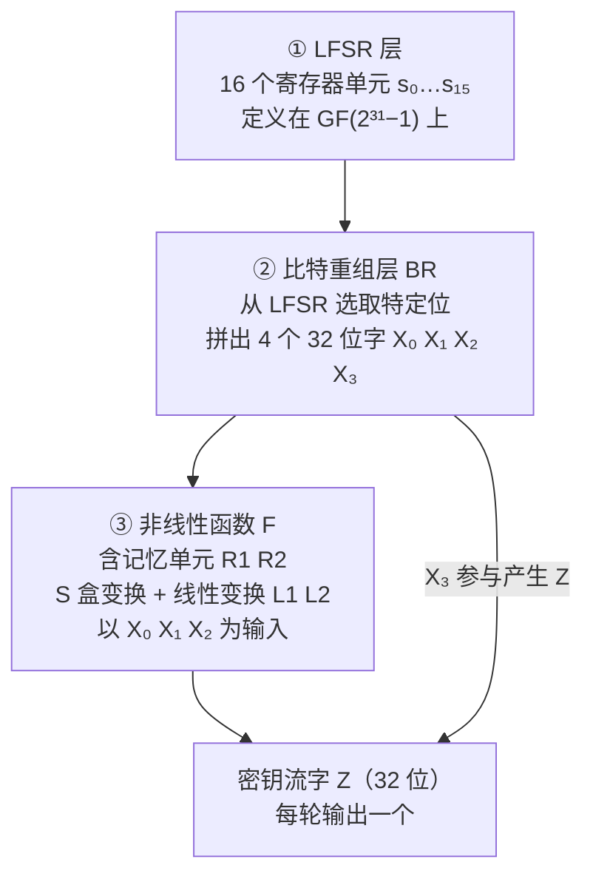
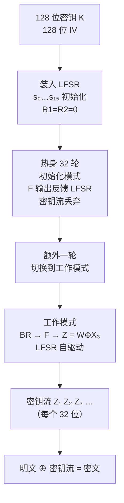
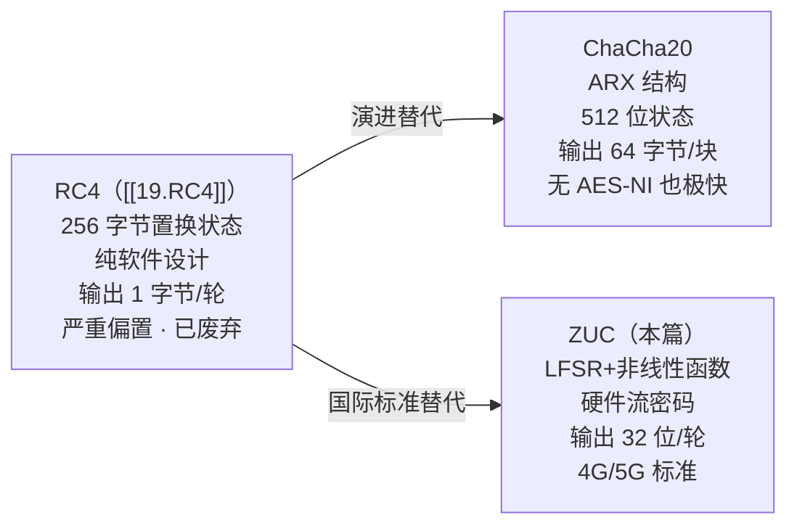

# 密码学（48）· ZUC流密码

> [!abstract] TL;DR
> - ZUC（祖冲之算法，GM/T 0001）是中国自主设计、获 3GPP 国际标准采纳的流密码，服务于 **4G LTE / 5G 移动通信空口加密与完整性保护**。
> - 三层结构：**LFSR 层**（16 级，定义在素域 GF(2³¹−1) 上）→ **比特重组层 BR**（从 LFSR 选位拼出 4 个 32 位字）→ **非线性函数 F**（含记忆单元 R1/R2、S 盒、模加）→ 每轮输出 1 个 32 位密钥流字。
> - 密钥与 IV 均为 128 位；初始化阶段运行 32 轮（输出反馈 LFSR），之后切换工作模式逐轮输出密钥流。
> - 基于 ZUC 的两条应用算法：**128-EEA3**（加密）和 **128-EIA3**（完整性 MAC），是 3GPP 空口安全规范的第三套算法套件。
> - **ZUC-256** 为 5G 增强安全场景设计，密钥与 IV 均扩展到 256 位。
> - 与 RC4 相比：ZUC 有更严格的数学设计和公开分析；与 ChaCha20 相比：ZUC 走 LFSR+非线性函数路线，ChaCha20 走 ARX 全软件路线；ZUC 面向硬件实现的移动基站场景。

本篇属于「国密 SM」专题的第五篇（流密码部分）。前置：流密码总论 [[18.流密码总论]]、国密体系全景 [[44.国密SM体系概览]]、老式流密码对比 [[19.RC4]]。

---

## 概述与定位

### ZUC 的来历

**ZUC（祖冲之算法）** 由中国科学院数据与通信保护研究教育中心（DACAS）设计，以我国南北朝数学家**祖冲之**命名——他以推算圆周率闻名于世，"祖冲之"三字兼含民族自信与数学传承。

ZUC 的里程碑：

| 时间 | 事件 |
|---|---|
| 2009 | 初版向国际社会公开，接受安全性评估 |
| 2011 | **3GPP SA3 正式采纳**，成为 LTE 第三套空口算法（EEA3/EIA3）|
| 2012 | GM/T 0001 国密标准发布 |
| 2019 | **ZUC-256** 规范发布，服务于 5G 更高安全级别 |

在 3GPP 体系中，移动通信空口安全支持三套算法套件：

| 套件 | 加密 | 完整性 | 基础算法 |
|---|---|---|---|
| 第一套（128-EEA1/EIA1） | SNOW 3G | SNOW 3G | 欧洲设计 |
| 第二套（128-EEA2/EIA2） | AES-CTR | AES-CMAC | 美国设计 |
| **第三套（128-EEA3/EIA3）** | **ZUC** | **ZUC** | **中国设计** |

ZUC 是国际电信标准中使用的**唯一中国设计流密码**，也是[[44.国密SM体系概览]]中流密码方向的核心。

### ZUC 在系列中的位置

| 对比维度 | RC4（[[19.RC4]]） | ChaCha20（[[20.ChaCha20与Salsa20]]） | ZUC |
|---|---|---|---|
| 设计年代 | 1987 | 2008 | 2009 |
| 输出单元 | 1 字节/轮 | 64 字节/块 | 4 字节（32 位字）/轮 |
| 内部结构 | 置换状态机 | ARX（全加法/旋转/异或） | LFSR + 非线性函数 |
| 场景 | 软件通用（已废弃） | 软件通用 | 移动通信硬件 |
| 现状 | RFC 7465 禁用 | TLS 1.3 推荐 | 4G/5G 标准 |

---

## 原理与机制

### 整体三层架构

ZUC 的密钥流生成器由三个垂直层叠的功能层组成：



三层职责分工：
- **LFSR 层**：长周期线性序列生成，提供统计均匀性；
- **BR 层**：从 LFSR 16 个单元中选位拼字，是两层之间的桥梁；
- **非线性函数 F**：引入非线性，抵抗 Berlekamp-Massey 等线性攻击（与 [[18.流密码总论]] 中"单纯 LFSR 不安全"的解法一致）。

### 第一层：LFSR（GF(2³¹−1) 上的 16 级线性移位寄存器）

ZUC 的 LFSR 不工作在 GF(2) 上，而是工作在**素域 GF(p)，p = 2³¹−1**（梅森素数）上。这是 ZUC 最有特色的设计之一：

```
素域 GF(2³¹−1) = {0, 1, 2, …, 2³¹−2}
加法：模 (2³¹−1) 的整数加法
乘法：模 (2³¹−1) 的整数乘法
```

选择梅森素数 2³¹−1 的工程好处：
- 模 2³¹−1 的约减可用位运算高效实现：对于 32 位中间结果 `v`，`v mod (2³¹−1) = (v >> 31) + (v & (2³¹−1))`，再处理一次溢出即可，无需完整除法；
- 2³¹−1 是质数，GF(2³¹−1) 上可定义乘法逆元，使 LFSR 特征多项式的设计空间与本原性证明更清晰。

**LFSR 结构**：16 个单元 s₀, s₁, …, s₁₅，每个单元 31 位（取值范围 1…2³¹−2，排除 0）。

LFSR 状态更新分两种模式：

**初始化模式（LoadM，用于密钥/IV 装入后的 32 轮热身）**：
```
v = 2¹⁵·s₁₅ + 2¹⁷·s₁₃ + 2²¹·s₁₀ + 2²⁰·s₄ + (1 + 2⁸)·s₀  (mod 2³¹−1)
s₁₆ = (v + u) mod (2³¹−1)   # u 为 F 层输出的 31 位量
LFSR 左移一位：s₀←s₁, s₁←s₂, …, s₁₄←s₁₅, s₁₅←s₁₆
```

**工作模式（WorkM，正常密钥流输出）**：
```
s₁₆ = 2¹⁵·s₁₅ + 2¹⁷·s₁₃ + 2²¹·s₁₀ + 2²⁰·s₄ + (1 + 2⁸)·s₀  (mod 2³¹−1)
LFSR 左移一位
```
工作模式中不再注入 F 的输出，LFSR 完全自驱动，F 独立运行。

> [!note] 为何用 GF(2³¹−1) 而不是 GF(2)
> 在 GF(2) 上的传统 LFSR（如 A5/1、E0）输出 1 位/轮，状态空间是 2ⁿ-1；而 ZUC 在素域上的 LFSR 每个单元有 31 位信息量，状态空间接近 (2³¹−1)¹⁶ ≈ 2⁴⁹⁶，理论分析更强。相关设计思路也见于 SNOW 系列流密码。

### 第二层：比特重组（Bit Reorganization，BR）

BR 层从当前 LFSR 状态的特定单元中抽取高半字（H = 高 16 位）和低半字（L = 低 16 位），拼接为 4 个 32 位字：

```
X₀ = s₁₅_H || s₁₄_L      # s₁₅ 高 16 位 拼 s₁₄ 低 16 位
X₁ = s₁₁_L || s₉_H       # s₁₁ 低 16 位 拼 s₉  高 16 位
X₂ = s₇_L  || s₅_H       # s₇  低 16 位 拼 s₅  高 16 位
X₃ = s₂_L  || s₀_H       # s₂  低 16 位 拼 s₀  高 16 位
```

其中 `||` 表示比特拼接。X₀、X₁、X₂ 送入 F 层；X₃ 直接参与最终密钥流字的生成（与 F 的输出异或）。

BR 层是纯确定性位变换，没有引入非线性，其作用是**将素域 GF(2³¹−1) 上的 31 位量映射回 GF(2) 上的 32 位字**，方便后续 S 盒（天然面向字节/字操作）处理。

### 第三层：非线性函数 F

F 是 ZUC 引入非线性的核心，包含两个 32 位**记忆单元（内部状态）** R1 和 R2：

```
初始值：R1 = R2 = 0

每轮计算（输入 X₀, X₁, X₂）：
  W  = (X₀ ⊕ R1) ⊞ R2        # ⊞ 表示模 2³² 加法
  W₁ = R1 ⊞ X₁
  W₂ = R2 ⊕ X₂

  R1' = S(L1(W₁_L || W₂_H))   # W₁ 低半字 || W₂ 高半字 → L1 线性变换 → S 盒
  R2' = S(L2(W₂_L || W₁_H))   # W₂ 低半字 || W₁ 高半字 → L2 线性变换 → S 盒

  R1 ← R1'；R2 ← R2'

F 的 32 位输出值：W（上式 W 的高 16 位用于初始化模式的 LFSR 注入）
```

**S 盒**：ZUC 使用两种 8 位→8 位 S 盒（S₀ 和 S₁），各自 256 条目。32 位字经过 S 盒处理时，按字节拆分，每字节独立查表，再重组为 32 位字。S 盒设计保证了高非线性度和差分/线性指标。

**线性变换 L1、L2**：对 32 位字做循环移位异或，增强混淆扩散：

```
L1(X) = X ⊕ (X <<< 2) ⊕ (X <<< 10) ⊕ (X <<< 18) ⊕ (X <<< 24)
L2(X) = X ⊕ (X <<< 8) ⊕ (X <<< 14) ⊕ (X <<< 22) ⊕ (X <<< 30)
```

`<<<` 为 32 位循环左移。L1、L2 结构类似于 SM4 的线性变换（[[45.SM4分组密码]]），这是国密算法在设计哲学上的一致性体现。

**密钥流字输出**：

工作模式每轮输出：

```
Z = W ⊕ X₃      # F 层输出 W 与 BR 层 X₃ 异或
```

Z 为 32 位密钥流字；连续输出的 Z₁, Z₂, Z₃, … 拼接后与明文逐位（或逐字节）XOR 完成加密。

---

## 算法流程：初始化与密钥流生成

### 密钥与 IV 装入

ZUC 接受 128 位密钥 `k = k₀k₁…k₁₅`（字节序列）和 128 位初始向量 `iv = iv₀iv₁…iv₁₅`，按以下规则将 16 个 LFSR 单元初始化为 31 位值：

```
# d[i] 为预定义常量（5 位），共 16 个，硬编码于标准
# 初始化每个寄存器（i = 0..15）：
s_i = k_i || d_i || iv_i

# 其中 k_i（8位）|| d_i（5位，常量）|| iv_i（8位）共 21 位
# 但 LFSR 单元 31 位；完整表达为：
s_i = k_i·2²³ + d_i·2¹⁸ + iv_i·2¹⁰ + k_{i+16 mod 16}·2² + iv_{i+8 mod 16}>>6
```

（具体位拼接规则见 GM/T 0001 §4.2；上式为示意，标准值以规范为准。）

同时令 `R1 = R2 = 0`。

### 初始化阶段：32 轮热身

```
for i in 1..32:
    # 1. BR：从当前 LFSR 状态计算 X₀ X₁ X₂ X₃
    X₀, X₁, X₂, X₃ = BitReorganization(s₀..s₁₅)
    # 2. F：计算 W，更新 R1 R2
    W = F(X₀, X₁, X₂)           # 同时 R1 R2 被更新
    # 3. LFSR 初始化模式：注入 W 的高 16 位 u = W >> 16
    u = W >> 16
    LFSR_InitMode(u)              # 推进 LFSR，将 u 注入反馈
    # （注：热身阶段的 W ⊕ X₃ 不输出，丢弃）
```

热身阶段确保：
- 密钥/IV 的每个比特都充分扩散到 LFSR 所有 16 个单元；
- R1、R2 从全零充分混入了密钥材料；
- LFSR 进入稳定的工作区域。

### 工作阶段：密钥流生成

```
# 先执行一次"不输出"的工作轮（让 LFSR 推进一次，丢弃 W ⊕ X₃）
X₀, X₁, X₂, X₃ = BitReorganization(s₀..s₁₅)
W = F(X₀, X₁, X₂)
LFSR_WorkMode()

# 之后逐轮输出密钥流字：
while need_keystream:
    X₀, X₁, X₂, X₃ = BitReorganization(s₀..s₁₅)
    W = F(X₀, X₁, X₂)
    Z = W ⊕ X₃                   # 32 位密钥流字
    LFSR_WorkMode()
    yield Z
```

每调用一次生成循环，输出 32 位（4 字节）密钥流。加密时将密钥流字与 32 位明文块 XOR。

### 整体流程图



---

## 基于 ZUC 的应用算法

### 128-EEA3：LTE 空口加密

**128-EEA3**（128-bit EPS Encryption Algorithm 3）基于 ZUC 实现**机密性保护**，逻辑等价于同步流密码的 `密文 = 明文 ⊕ 密钥流`。

输入参数（3GPP 规定的"计数器"式参数化）：

| 参数 | 长度 | 说明 |
|---|---|---|
| COUNT | 32 位 | 帧/包计数器（防重放） |
| BEARER | 5 位 | 无线承载标识（0–31） |
| DIRECTION | 1 位 | 上行=0，下行=1 |
| LENGTH | 整数 | 明文比特长度 |
| IK（密钥） | 128 位 | 从 AKA 协议派生 |

IV 的构造：将 COUNT、BEARER、DIRECTION 按规定位置填入 128 位 IV；剩余部分填 0。这种参数化保证**不同的（COUNT, BEARER, DIRECTION）三元组对应唯一 IV**，从协议层避免 nonce 复用。

加密：

```
# 用 IK 与构造的 IV 初始化 ZUC，生成 ⌈LENGTH/32⌉ 个 32 位密钥流字
keystream = ZUC_Generate(IK, IV, ⌈LENGTH/32⌉)
# 明文比特流 ⊕ 密钥流比特流（取前 LENGTH 位）
CIPHERTEXT = PLAINTEXT ⊕ keystream_bits[0..LENGTH-1]
```

与 [[13.CTR模式]] 对比：128-EEA3 的本质就是 ZUC 作为密钥流生成器的 CTR 模式加密，只是 ZUC 替代了 AES-CTR 中的 AES。

### 128-EIA3：LTE 空口完整性保护（MAC）

**128-EIA3**（128-bit EPS Integrity Algorithm 3）基于 ZUC 实现**消息完整性认证**，生成 32 位 MAC-I（消息认证码）。

其工作方式类似于 CTR-based MAC（与 [[37.Poly1305与GMAC]] 的通用哈希 MAC 不同，EIA3 是基于流密码的 MAC）：

```
# 步骤 1：生成比明文更长的密钥流（多出 64 位用于 MAC 运算）
keystream = ZUC_Generate(IK, IV_integrity, ⌈(LENGTH+64)/32⌉ 个字)

# 步骤 2：将密钥流分为两部分
#   ks_message = keystream 前 ⌈LENGTH/32⌉ 个字（覆盖消息长度）
#   ks_mac = keystream 最后 2 个字（64 位）

# 步骤 3：MAC 计算
#   T = 对消息每 1 位，若该位为 1，则 ACC ⊕= 对应的密钥流字；
#       将 ACC（32 位累加器，初始 0）与 ks_mac 低 32 位 XOR
#   MAC-I = T ⊕ ks_mac[最后一个字]
```

（更精确的比特级逐位 XOR 积分过程见 3GPP TS 35.222 规范；上为简化示意。）

> [!note] 为何不用 HMAC-ZUC
> EIA3 采用"密钥流积分 + 末尾掩码"模式，而非 HMAC 结构，原因是在硬件流水线上实现效率更高：ZUC 只运行一次，密钥流兼作加密密钥流和 MAC 密钥材料，无需额外运行哈希函数。与 [[16.ChaCha20-Poly1305]] 的"流密码加密 + Poly1305 MAC"分立架构不同，EIA3 把两个功能压缩在一次 ZUC 调用里。

### ZUC-256（5G 增强安全）

ZUC-256 于 2019 年由设计者团队发布，面向 5G 的更高安全需求（尤其是 256 位量子后安全级别目标）：

| 特性 | ZUC（原版） | ZUC-256 |
|---|---|---|
| 密钥长度 | 128 位 | **256 位** |
| IV 长度 | 128 位 | **184 位** |
| LFSR 规模 | 16×31 位 | 16×32 位（字长变化） |
| 输出 | 32 位/轮 | 32 位/轮 |
| MAC 输出 | 32 位（EIA3） | 32 / 64 / 128 位可选 |
| 目标场景 | 4G LTE | **5G NR 增强安全** |

ZUC-256 的 MAC 算法（ZUC-256-MAC）提供三种输出长度，对应不同场景的安全强度要求：32 位用于低开销场景，64/128 位用于高价值信令保护。

---

## 与 RC4 / ChaCha20 的对比



**ZUC vs RC4（[[19.RC4]]）**：
- RC4 内部状态是 256 字节置换表 + 两个字节指针，无数学结构约束；其 KSA 阶段存在弱密钥，PRGA 输出有已知统计偏置（Fluhrer-Mantin-Shamir 等）；
- ZUC 基于严格数学定义的 GF(2³¹−1) 素域 LFSR + 非线性函数，公开发布后经过国际密码学界系统性分析，迄今未发现实际利用的弱点；
- 两者速度相近（均面向逐字/逐字节操作），但 ZUC 的安全分析基础远优于 RC4。

**ZUC vs ChaCha20（[[20.ChaCha20与Salsa20]]）**：
- ChaCha20 是纯 ARX（Add-Rotate-XOR）设计，无 LFSR，面向通用软件实现，无需 AES-NI 也能达到极高吞吐；
- ZUC 面向通信基站/终端硬件实现，LFSR 便于专用电路（ASIC/FPGA），非线性函数 S 盒与 SM4 同源，便于国密统一实现；
- 两者均属同步流密码（密钥流只由 Key+Nonce 决定，见 [[18.流密码总论]]），nonce 唯一性同等重要；
- ChaCha20 通过 Poly1305 组合为 AEAD（[[16.ChaCha20-Poly1305]]）；ZUC 通过 EIA3 提供完整性，但两者分别独立运行 ZUC 而非封装为 AEAD——这是 ZUC 工程使用的注意点。

---

## 安全性与正确使用

### 已知密码分析结果

ZUC 自 2009 年公开至今，受到国际密码学界广泛分析：

| 分析类型 | 最佳已知结果 | 实际威胁 |
|---|---|---|
| 相关密钥攻击 | 理论分析存在相关密钥区分器（需 2¹⁰⁰+ 计算）| 无实际威胁 |
| 区分攻击 | 2¹¹² 以上复杂度 | 低于密钥枚举，无实际威胁 |
| 代数攻击 | 针对简化轮数有结果 | 全轮无实际可行攻击 |
| 猜测决定攻击 | 复杂度接近 2¹²⁸ | 不优于穷举 |

总体结论：**ZUC-128（原版）在标准参数下迄今无实际可用攻击**，密码分析界对其安全边际给出正面评价。这与 3GPP 采纳前要求的独立安全评估一致。

### 正确使用规范

> [!warning] IV/Nonce 绝对不可重用
> ZUC 是同步流密码，与 ChaCha20、AES-CTR 一样，(密钥 K, IV) 对确定了整个密钥流。若同一 (K, IV) 加密两段不同明文：
> ```
> C₁ = P₁ ⊕ Z
> C₂ = P₂ ⊕ Z
> C₁ ⊕ C₂ = P₁ ⊕ P₂
> ```
> 两段密文异或消去密钥流，攻击者直接得到 P₁⊕P₂，之后利用自然语言冗余恢复原文（两次一密攻击，见 [[18.流密码总论]]）。
>
> 3GPP 通过协议层的 (COUNT, BEARER, DIRECTION) 三元组构造唯一 IV，**正是在协议层强制保证这一前提**。

| 使用场景 | 推荐做法 |
|---|---|
| 4G LTE 空口 | 严格按 3GPP TS 33.401 使用 EEA3/EIA3，勿自行构造 IV |
| 5G NR 高安全 | 使用 ZUC-256，IV 长度为 184 位 |
| 国密合规实现 | 参考 GM/T 0001，使用经过认证的密码模块（OSCCA 认证） |
| 通用软件场景 | 不建议独立使用 ZUC——应首选 ChaCha20-Poly1305 或 AES-GCM 等成熟 AEAD |

> [!danger] ZUC 不含内置认证
> 原始 ZUC 密钥流生成器本身不提供完整性保护。4G/5G 中加密（EEA3）和完整性（EIA3）是**两个独立调用**（使用不同的 IK 和 IV），缺一不可。若仅用 ZUC 加密而不运行 EIA3，攻击者可对密文做比特翻转攻击（XOR 线性性，参见 [[18.流密码总论]] "裸流密码无认证"）。

### 参数选择

| 参数 | ZUC-128 | ZUC-256 |
|---|---|---|
| 密钥长度 | 128 位 | 256 位 |
| IV 长度 | 128 位 | 184 位 |
| MAC 长度 | 32 位（EIA3）| 32/64/128 位可选 |
| 安全强度 | 128 位（传统） | 256 位（量子后候选）|
| 适用协议版本 | 4G LTE / 早期 5G | 5G NR SA 增强安全 |

---

## 小结

ZUC 是"LFSR + 非线性变换"路线的现代典范——在 [[18.流密码总论]] 介绍的"单纯 LFSR 线性可被 Berlekamp-Massey 破解"问题上，ZUC 给出了工程化的解答：

1. **LFSR 工作在 GF(2³¹−1) 素域**，而非 GF(2)，天然打破 GF(2) 线性分析路径；
2. **比特重组层**将素域量映射回 GF(2) 的字节/字，衔接 LFSR 与 S 盒；
3. **非线性函数 F**（S 盒 + 线性变换 + 记忆单元 R1/R2）提供类 AES 的混淆与扩散，使密钥流在统计上与均匀随机不可区分。

作为国际电信联盟和 3GPP 采纳的唯一中国设计流密码，ZUC 连接了国密体系（[[44.国密SM体系概览]]）与全球移动通信标准，也构成了 5G 安全架构的重要基础。ZUC-256 向后量子安全方向延伸，与 [[49.后量子密码概览]] 中讨论的长期安全趋势方向一致。

| 维度 | 核心结论 |
|---|---|
| 结构 | LFSR（GF(2³¹−1)）+ BR + 非线性 F，三层协同 |
| 密钥/IV | 均为 128 位（ZUC-256 扩展至 256/184 位）|
| 标准应用 | 3GPP EEA3（加密）+ EIA3（MAC）|
| 安全性 | 公开分析无实际可用攻击，安全边际充足 |
| 使用要点 | IV 唯一性、加密+完整性配对使用、国密合规场景优先 |

---

## 相关阅读

- [[18.流密码总论]] — 流密码基础：LFSR、同步/自同步、Berlekamp-Massey、两次一密
- [[19.RC4]] — 软件流密码历史：置换状态机、偏置弱点与废弃历程
- [[20.ChaCha20与Salsa20]] — 现代 ARX 流密码，ZUC 的同类对比参照
- [[44.国密SM体系概览]] — SM2/SM3/SM4/ZUC 的国密全景与合规要点
- [[45.SM4分组密码]] — 国密分组密码，与 ZUC 的 S 盒/线性变换设计同源
- [[37.Poly1305与GMAC]] — 通用哈希 MAC，与 EIA3 的 MAC 构造机理对比
- [[16.ChaCha20-Poly1305]] — 流密码封装为 AEAD 的典型方案
- [[13.CTR模式]] — 分组密码 CTR 化与同步流密码的等价视角
- [[49.后量子密码概览]] — ZUC-256 面向的长期安全目标背景

---

⬅️ 上一篇 [[47.SM2公钥密码]] ｜ 🏠 [[00.密码学总览]] ｜ 下一篇 [[49.后量子密码概览]] ➡️
