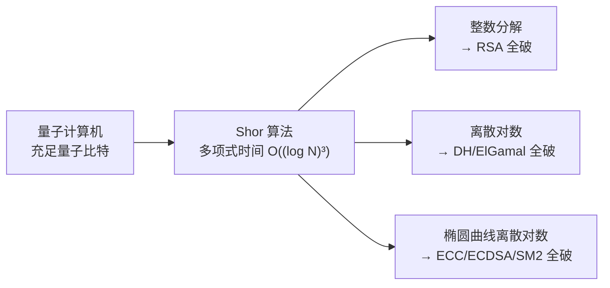
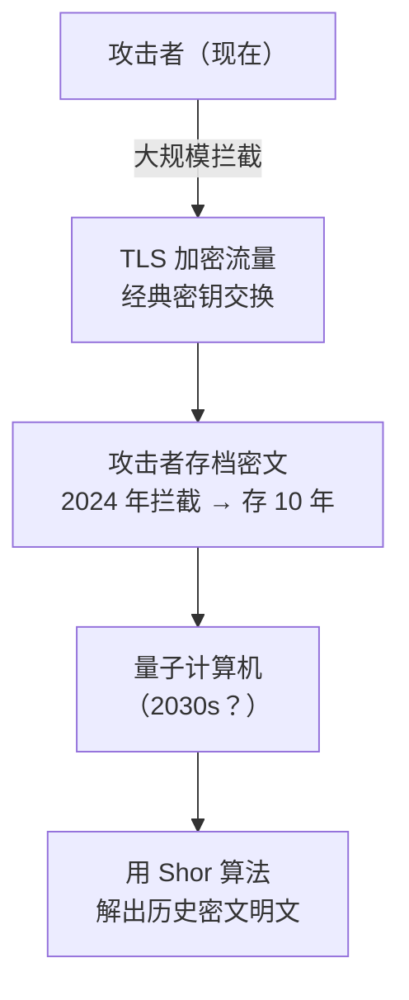
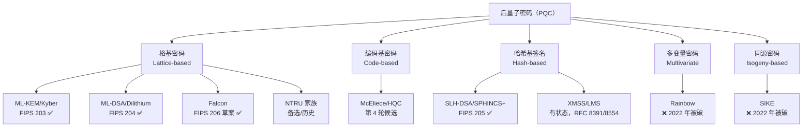
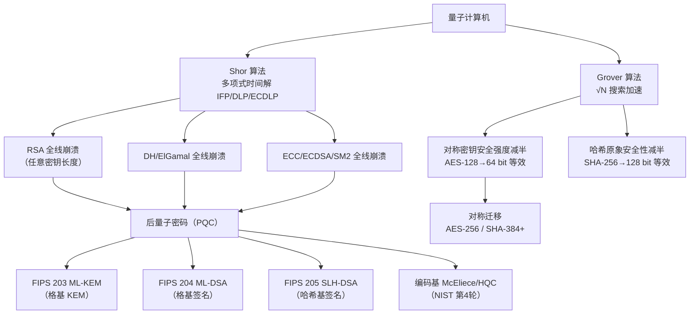

# 密码学（49）· 后量子密码概览

> [!abstract] TL;DR
> - **量子计算机上的 Shor 算法**在多项式时间内解整数分解和离散对数问题，直接破解 RSA、DH、ECC、ECDSA——即当前几乎全部公钥基础设施。
> - **Grover 算法**对对称密钥/哈希做平方根加速搜索，将安全强度减半（AES-128 → 64 位等效），迁移到 AES-256 和更长哈希可对冲。
> - **"先收割后解密"（Harvest Now, Decrypt Later，HNDL）**：攻击者现在拦截密文存档，等量子计算机就绪再解，使迁移刻不容缓。
> - **NIST PQC 标准化**已于 2024 年发布三项正式联邦信息处理标准：FIPS 203 ML-KEM（Kyber）/ FIPS 204 ML-DSA（Dilithium）/ FIPS 205 SLH-DSA（SPHINCS+）。
> - **五大方向**：格基（最受青睐）、编码基（McEliece）、哈希基签名（SPHINCS+/XMSS）、多变量（Rainbow 已破）、同源（SIKE 已破）。
> - **迁移策略**：混合/Hybrid（经典 + PQC 并用）+ 密码敏捷性；对称算法迁至 AES-256 / SHA-384 以上。

---

## 概述与定位

本篇是"后量子密码"子系列的入口概览，纵观量子威胁的来源、NIST 标准化进程和五大密码方向；各具体算法在后续篇章展开：格密码数学基础见 [[50.格密码基础]]，ML-KEM(Kyber) 见 [[51.Kyber-ML-KEM]]。本篇同时也是对 [[22.RSA详解]]、[[25.椭圆曲线密码学基础]] 所述经典算法的"警示回顾"——它们在量子世界中将全线失效。

---

## 原理与机制

### 经典公钥密码的安全基础

现有公钥密码体系的安全性根植于三类"难题"：

| 难题 | 依赖算法 |
|---|---|
| 大整数分解（IFP） | RSA（[[22.RSA详解]]） |
| 离散对数（DLP，有限域） | DH（[[23.Diffie-Hellman密钥交换]]）、ElGamal（[[24.ElGamal加密与签名]]） |
| 椭圆曲线离散对数（ECDLP） | ECC、ECDH（[[26.ECDH密钥交换]]）、ECDSA（[[27.ECDSA签名]]）、SM2（[[47.SM2公钥密码]]） |

这三类难题在经典计算机上已知最优算法（亚指数级）足以让密钥长度可控，但在**充分大的量子计算机**上全部归约为多项式时间可解——根源在于 Shor 算法。

---

### Shor 算法：公钥密码的量子威胁

Peter Shor 于 1994 年提出的量子算法，核心由**量子傅里叶变换（QFT）**驱动阶查找：

1. **整数分解**：寻找 `f(x) = a^x mod N` 的周期 `r`，利用 `r` 构造 `N` 的非平凡因子。
2. **离散对数**：类似地在椭圆曲线群或有限域乘法群上确定离散对数。

```
Shor 算法（整数分解，概念流程）
─────────────────────────────────
输入: N（待分解合数）
1. 随机选取 a ∈ [2, N-1]，若 gcd(a,N)>1 直接输出因子
2. 量子线路寻找 f(x) = a^x mod N 的周期 r（量子叠加 + QFT）
3. 若 r 为奇数或 a^(r/2) ≡ -1 (mod N)，重试
4. 输出 gcd(a^(r/2)±1, N)
复杂度: O((log N)^3) — 多项式时间（经典最优: 亚指数 GNFS）
```

**直接后果**：任意长度的 RSA 密钥（包括 4096 位）和 ECC（包括 521 位）在足够多量子比特的机器面前均可在多项式时间内破解，安全性**归零**，无法通过"加长密钥"来应对。



---

### Grover 算法：对称密码的量子威胁

Lov Grover 于 1996 年提出的**无序数据库量子搜索**算法：

- 对大小为 N 的搜索空间，经典穷举需 O(N) 次，Grover 可在 O(√N) 次内找到解——将**安全强度减半**（即 k 位密钥等效降为 k/2 位）。

| 算法 | 经典安全位 | 量子等效安全位 | 应对措施 |
|---|---|---|---|
| AES-128 | 128 | ~64（不安全） | 迁移至 AES-256 |
| AES-256 | 256 | ~128（仍安全） | 继续使用 |
| SHA-256（原象） | 256 | ~128 | 迁移至 SHA-384/512 |
| SHA-384 | 384 | ~192（安全） | 继续使用 |

**关键区别**：Grover 加速是平方根级，对称算法只需**密钥翻倍**即可对抗；而 Shor 算法的加速是指数→多项式，经典公钥算法无论密钥多长都无法幸免。

---

### HNDL（Harvest Now, Decrypt Later）——迁移紧迫性的核心



HNDL 威胁意味着：**今天**传输的机密数据（医疗记录、政府机密、金融合同）若以 RSA/ECDH 加密，**当下就面临未来解密风险**，与量子计算机何时出现无关。这使 PQC 迁移不只是"未来的事"，而是**当前安全决策**的一部分。

> [!warning] 对称加密与签名的迁移优先级不同
> HNDL 主要威胁**密钥协商/加密**（机密性），对**数字签名**的紧迫性略低（签名只需在验签时安全，无需保护历史数据）。但签名基础设施（PKI、代码签名、TLS 证书链）生命周期长，同样应尽早规划。

---

## NIST PQC 标准化历程

```
2016 ── NIST 征集后量子密码算法
2017 ── 第 1 轮：69 个候选提交
2019 ── 第 2 轮：26 个算法入围
2020 ── 第 3 轮：7 个候选 + 8 个备选
2022 ── 宣布选定：Kyber / Dilithium / Falcon / SPHINCS+
2024 ── 正式发布 FIPS 203/204/205（第 4 轮继续评估 HQC 等）
```

### 2024 年正式标准

| FIPS 编号 | 算法名称 | 原名 | 用途 | 数学基础 |
|---|---|---|---|---|
| FIPS 203 | **ML-KEM** | Kyber | 密钥封装（KEM） | Module-LWE / 格密码 |
| FIPS 204 | **ML-DSA** | Dilithium | 数字签名 | Module-LWE + Module-SIS / 格密码 |
| FIPS 205 | **SLH-DSA** | SPHINCS+ | 数字签名 | 哈希函数（无需数论假设） |

另有 **FIPS 206**（Falcon，格基签名，更紧凑但实现复杂）在 2024 年末发布草案。Falcon 基于 NTRU 格和快速傅里叶采样。

> [!note] 命名规则
> "ML-"前缀表示 Module 格结构（比 Ring 更灵活、比普通格更高效）；"KEM"= Key Encapsulation Mechanism（密钥封装机制，与 DH 功能对应但机制不同）。

---

## 五大后量子密码方向



### 1. 格基密码（Lattice-based）

**最主流方向**，NIST 三项正式标准全部或部分基于格密码。

核心困难问题：
- **LWE（Learning With Errors）**：给定一组带噪声的线性方程 `b = As + e (mod q)`，恢复秘密向量 `s` 是 NP 困难的（量子难）。
- **Ring-LWE / Module-LWE**：将 LWE 搬到多项式环上，大幅提升效率，是 Kyber/Dilithium 的数学核心。
- **SVP/CVP**（最短/最近向量问题）：格上的几何难题，量子算法目前无多项式时间解法。

详见 [[50.格密码基础]]，Kyber 具体构造见 [[51.Kyber-ML-KEM]]。

### 2. 编码基密码（Code-based）

**McEliece 密码系统**（1978）是最古老的后量子方案之一：

- 基于**解码随机线性纠错码**的困难性（通用解码问题是 NP 完全）。
- 优点：量子安全历史最长、解密速度快。
- 缺点：**公钥体积极大**（MB 级），实际部署困难。
- 现代变体：**HQC**（Hamming Quasi-Cyclic）通过循环码结构大幅减小密钥尺寸，是 NIST 第 4 轮候选。

```
McEliece KEM（简化）
─────────────────────────────────
密钥生成:
  选取 [n,k,t] 二进制 Goppa 码 C，生成矩阵 G
  随机置换矩阵 P，随机可逆矩阵 S
  公钥 Gpub = S·G·P，私钥 (S, G, P)
加密:
  m → 编码 c = m·Gpub + e（随机 t 位错误向量 e）
解密:
  用 Goppa 解码器（知道 G 的结构）纠错 → 还原 m
```

### 3. 哈希基签名（Hash-based Signature）

**完全基于哈希函数安全性**，无需数论假设，安全性最为保守。

两大类：

**有状态签名（Stateful）**：
- **XMSS**（RFC 8391）、**LMS**（RFC 8554）：Merkle 树 + 一次性签名（WOTS+），状态为"下一个未用叶子节点索引"，**状态管理复杂，不能重复使用同一状态**。
- 适合固件签名、部分嵌入式场景。

**无状态签名（Stateless）**：
- **SPHINCS+（SLH-DSA，FIPS 205）**：通过超树（hypertree）结合 FORS（Few-Time Signatures）避免状态管理问题。
- 代价是签名体积较大（约 8 KB–50 KB 视参数），但实现最简洁、最安全。

```
SPHINCS+ 签名结构（概念）
─────────────────────────────────
FORS 树（Few-Time Signature 森林）
  ↓ 叶子哈希 → FORS 根
超树（HT）多层 XMSS 树
  第 d 层 → 第 d-1 层 → ... → 顶层 XMSS
顶层公钥 = 顶层 Merkle 根（哈希值）
签名 = FORS签名 + d 层 XMSS 签名 + d 层认证路径
```

### 4. 多变量密码（Multivariate）

基于**求解多变量二次方程组（MQ 问题）**的困难性：

- Rainbow（方案之一）：2022 年 Ward Beullens 利用 rank 攻击在**一台笔记本上数分钟**内破解，已出局。
- 多变量方案总体签名短、验证快，但设计空间安全性评估困难，NIST 暂未选入正式标准。

> [!danger] Rainbow 被破的教训
> Rainbow 被破展示了 PQC 评估的艰难：方案在多年审查后仍可能有结构性弱点。这是 NIST 坚持长周期、多轮评估的原因，也是从业者优先选用 NIST 已选定算法的理由。

### 5. 同源密码（Isogeny-based）

基于**椭圆曲线同源问题**——寻找两条超奇异椭圆曲线之间的同源映射：

- **SIKE**（SIDH 的 KEM 变体）：密钥极短（不足 200 字节），曾是 NIST 备选。2022 年 Castryck-Decru 攻击利用辅助点信息，完全破解，已出局。
- **CSIDH**（交换 SIDH）：仍在研究中，但效率低，尚未进入标准化。

> [!danger] SIKE 被破的教训
> 破解攻击只需 62 分钟（单核 CPU），且利用的是 SIDH **协议层设计**（而非底层数学难题本身）的致命漏洞。提醒：量子安全的数学困难问题与协议层安全是两个层面。

---

## 量子威胁全景 Mermaid



---

## 算法流程 / 结构详解

### KEM vs 传统公钥加密

经典公钥加密（如 RSA-OAEP）可直接加密任意消息；而 PQC 体系普遍采用 **KEM + 对称加密** 的混合结构——这也是 TLS 1.3 的实际模式：

```
混合加密（KEM + AEAD）流程
─────────────────────────────────
发送方:
  1. (ct, K) ← KEM.Encaps(pk_Bob)   // 封装：生成密文 ct 和共享密钥 K
  2. 用 K 派生对称密钥 k = KDF(K)
  3. c = AEAD.Encrypt(k, plaintext)
  4. 发送 (ct, c)

接收方:
  1. K ← KEM.Decaps(sk_Bob, ct)     // 解封装：恢复共享密钥 K
  2. k = KDF(K)
  3. plaintext = AEAD.Decrypt(k, c)
```

ML-KEM（Kyber）正是实现此 KEM 接口的格基算法，具体见 [[51.Kyber-ML-KEM]]。

### ML-KEM 参数一览（FIPS 203）

| 参数集 | 格维度 k | 公钥 | 私钥 | 密文 | 安全等级 |
|---|---|---|---|---|---|
| ML-KEM-512 | 2 | 800 B | 1632 B | 768 B | Level 1（AES-128 等效） |
| ML-KEM-768 | 3 | 1184 B | 2400 B | 1088 B | Level 3（AES-192 等效） |
| ML-KEM-1024 | 4 | 1568 B | 3168 B | 1568 B | Level 5（AES-256 等效） |

> [!note] 推荐
> TLS 迁移通常选 **ML-KEM-768**（X25519 + ML-KEM-768 混合）；高安全场景选 ML-KEM-1024。

### ML-DSA 与 SLH-DSA 参数对比（FIPS 204/205）

| 算法 | 参数集 | 公钥 | 私钥 | 签名 | 安全级别 |
|---|---|---|---|---|---|
| ML-DSA | ML-DSA-44 | 1312 B | 2528 B | 2420 B | Level 2 |
| ML-DSA | ML-DSA-65 | 1952 B | 4032 B | 3293 B | Level 3 |
| ML-DSA | ML-DSA-87 | 2592 B | 4896 B | 4595 B | Level 5 |
| SLH-DSA | SLH-DSA-SHA2-128s | 32 B | 64 B | 7856 B | Level 1 |
| SLH-DSA | SLH-DSA-SHA2-256s | 64 B | 128 B | 29792 B | Level 5 |

SLH-DSA 公私钥极小，但签名体积大；ML-DSA 密钥和签名均为中等体积，是通用签名的首选。

---

## 迁移策略

### 混合/Hybrid 方案

在量子计算机真正到来之前，**两种密码学方案并用**：即使 PQC 方案被意外破解，经典方案仍提供保护；即使经典方案被量子机器破解，PQC 方案仍提供保护。

```
TLS 1.3 混合密钥交换（示例）
─────────────────────────────────
经典部分: X25519（ECDH）
PQC 部分: ML-KEM-768

组合: kem_output = KDF(X25519_shared_secret || ML-KEM-768_shared_secret)

RFC 9420（MLS）/ IETF 草案 draft-ietf-tls-hybrid-design
```

Chrome 已于 2024 年默认启用 `X25519Kyber768` 混合；OpenSSL 3.x 和 AWS、Cloudflare 均已提供混合 TLS 支持。

### 密码敏捷性（Crypto Agility）

```
密码敏捷性原则:
─────────────────────────────────
1. 算法标识符与密钥材料一起存储（不硬编码算法）
2. 协议层协商算法（如 TLS cipher suite 扩展）
3. 接口层抽象：应用调用 KEM/Sign 接口，不直接调 Kyber 函数
4. 可替换底层实现而不改上层代码
```

密码敏捷性是应对"算法被破解"最有效的工程手段：既适用于从经典到 PQC 的过渡，也适用于将来某个 PQC 算法被破解时快速切换。

### 各类资产迁移优先级

| 资产类型 | 威胁 | 迁移优先级 |
|---|---|---|
| 长期机密通信（今天传输、长期存档） | HNDL 立即威胁 | 极高 |
| PKI/CA 根证书（生命周期 10–20 年） | 量子机器出现前需完成轮换 | 高 |
| 代码签名、软件更新 | 中期威胁 | 高 |
| 对称加密（AES-256） | Grover 平方根加速，双倍密钥已对冲 | 中（迁 256 位即可） |
| 哈希（SHA-384+） | Grover 加速，加长已对冲 | 中 |
| 本地存储（短生命周期数据） | 低（量子机不到，威胁小） | 低 |

---

## 安全性与正确使用

### 参数选择

1. **KEM**：通用场景选 **ML-KEM-768**；高安全场景选 ML-KEM-1024；资源极受限设备可用 ML-KEM-512（需评估实际威胁期限）。
2. **签名**：通用场景选 **ML-DSA-65**；对签名体积敏感（嵌入式/IoT）可考虑 Falcon-512；需最保守安全假设选 SLH-DSA。
3. **对称迁移**：使用 **AES-256**（不再接受 AES-128 作为新系统设计目标）；哈希选 SHA-384 或 SHA-512。
4. **KDF**：PQC 共享密钥建议再经 HKDF（见 [[38.HKDF]]）派生，避免直接用 KEM 输出。

### 已知弱点与注意事项

| 注意事项 | 说明 |
|---|---|
| 侧信道攻击 | 格基算法采样（高斯/CBD）若实现不当仍有侧信道；使用经过侧信道审计的库（liboqs/PQClean） |
| 错误参数重用 | ML-KEM 不得重复使用相同随机数（类似 ECDSA nonce 要求）；标准库实现会内部处理 |
| 有状态哈希签名 | XMSS/LMS 状态重用（同一叶子签两次）**可完全恢复私钥**，切勿在多设备/进程间共享状态 |
| 降级攻击 | 混合方案必须使组合安全性不低于任一分量；避免单方面降级到纯经典 |
| 密钥体积 | McEliece 公钥 MB 级，不适合证书系统；按场景选算法族 |
| 量子随机数 | PRNG 的安全性在量子时代不变（Grover 对 PRNG 内部状态无直接攻击），但仍推荐充足熵源（见 [[43.随机数与熵]]） |

### 推荐做法总结

```
✔ 新系统：直接上 FIPS 203/204/205 + 混合过渡期策略
✔ 密钥交换：X25519 + ML-KEM-768（TLS 混合），过渡期后纯 ML-KEM
✔ 签名：ML-DSA-65 通用；SLH-DSA 最保守
✔ 对称：AES-256-GCM；哈希 SHA-384+
✔ 使用经审计库：liboqs（Open Quantum Safe）/ BoringSSL / AWS-LC
✔ 密码敏捷性架构：算法与协议解耦，接口标准化
✗ 不要使用 Rainbow、SIKE（已破）
✗ 不要裸用 KEM 输出作对称密钥（需经 KDF）
✗ 不要在有状态签名（XMSS）中共享或回退状态
```

---

## 小结

后量子密码概览的核心脉络：

1. **量子威胁的本质**：Shor 算法彻底破解整数分解与离散对数（RSA/DH/ECC 全线失效），Grover 算法将对称/哈希安全性减半（可通过密钥翻倍对冲）。
2. **HNDL 使迁移现在就要开始**：敌手正在存档今天的密文等待量子计算机。
3. **NIST 2024 三项标准**：ML-KEM（格基 KEM）、ML-DSA（格基签名）、SLH-DSA（哈希基签名）是当前唯一经过充分多轮评估的选择。
4. **五大方向**：格基最成熟、编码基历史最久（密钥大）、哈希基最保守（签名大）、多变量/同源均已出现致命破解。
5. **迁移路径**：混合方案（经典 + PQC 并用） + 密码敏捷性架构 + 对称迁 AES-256 / SHA-384+。

---

## 相关阅读

- [[50.格密码基础]] — LWE/Ring-LWE/Module-LWE 数学原理，格上 SVP/CVP 困难性
- [[51.Kyber-ML-KEM]] — FIPS 203 ML-KEM 完整构造与参数
- [[52.Dilithium-ML-DSA]] — FIPS 204 ML-DSA 签名方案
- [[22.RSA详解]] — RSA 在量子时代将被 Shor 算法破解的原始目标
- [[25.椭圆曲线密码学基础]] — ECC/ECDLP 量子威胁根源
- [[27.ECDSA签名]] — ECDSA 量子失效背景
- [[38.HKDF]] — PQC KEM 输出的 KDF 派生
- [[43.随机数与熵]] — 量子时代 CSPRNG 的角色

---

⬅️ 上一篇 [[48.ZUC流密码]] ｜ 🏠 [[00.密码学总览]] ｜ 下一篇 [[50.格密码基础]] ➡️
