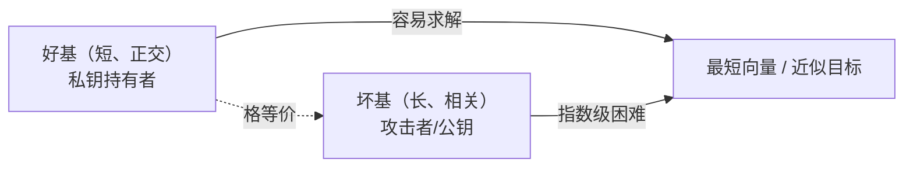
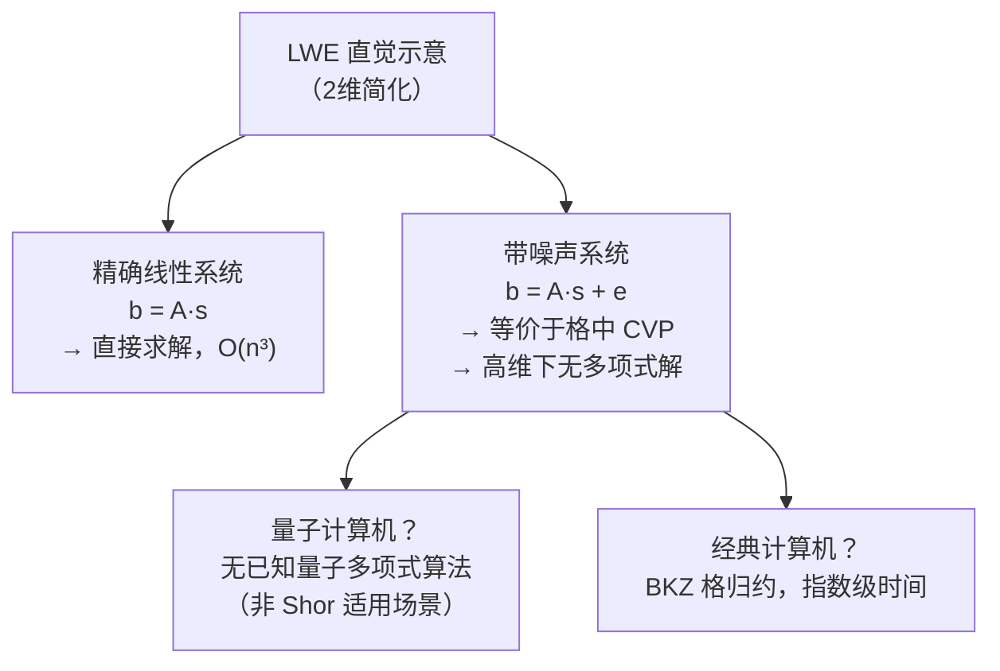
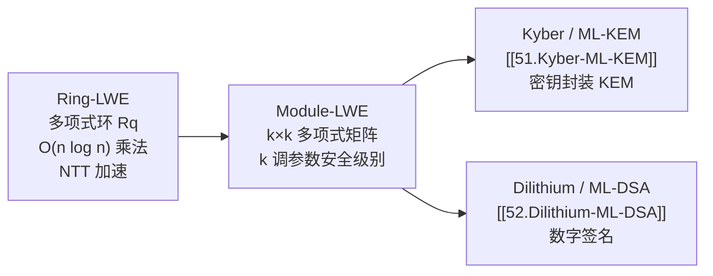

# 密码学（50）· 格密码基础

> [!abstract] TL;DR
> - **格（Lattice）** 是欧氏空间中由基向量的整数线性组合张成的离散点集——可以把它想象成斜的无限网格。
> - **格上困难问题**：SVP（找最短格向量）与 CVP（找最近格点）在高维下对经典和量子计算机都没有已知多项式算法，是格密码安全性的根基。
> - **SIS** 与 **LWE** 是两类主流困难问题。LWE 的直觉：`b = As + e`，矩阵 A 公开、秘密 s 加小噪声 e 后得到 b，从 (A, b) 还原 s 在高维下无解——无量子加速。
> - **Ring-LWE / Module-LWE** 把 LWE 搬到多项式环上，用 NTT 大幅加速，是 Kyber（[[51.Kyber-ML-KEM]]）与 Dilithium（[[52.Dilithium-ML-DSA]]）的直接数学基础。
> - **格归约算法**（LLL/BKZ）是攻击者工具；选安全参数的本质是：让 BKZ 代价超越密钥穷举。

---

## 概述与定位

[[49.后量子密码概览]] 指出：Shor 算法对 RSA/ECC/DH 构成指数级量子加速，但格问题目前没有有效量子算法——格密码因此成为 NIST 后量子标准化的核心方向（ML-KEM、ML-DSA 均基于格）。

本篇是格密码的**数学入门层**，不预设读者有格论背景：先给几何直觉，再讲困难假设，最后从应用视角串联到 [[51.Kyber-ML-KEM]] 与 [[52.Dilithium-ML-DSA]]。同时本篇也与 [[21.非对称加密总论]] 形成对照——非对称加密中 RSA 依赖整数分解、ECC 依赖离散对数，格密码则换了一套全新的数学"难题底座"。

---

## 原理与机制

### 格的定义

**格（Lattice）** 是 n 维欧氏空间 R^n 中的一种离散加法子群。给定 n 个线性无关的向量

```
b1, b2, ..., bn  ∈  R^n        （基向量，basis）
```

由它们张成的格定义为所有整数线性组合的集合：

```
L(b1,...,bn) = { z1·b1 + z2·b2 + ... + zn·bn  |  z1,...,zn ∈ Z }
```

**几何直觉**：把 b1, b2 想成两把"尺子"，沿任意整数步走，落脚点就是格点——二维格看起来像一张被拉斜的方格网。高维格（n = 256、1024、2048）则是极其复杂的高维网格，肉眼和电脑都无法直观感受。

**基的好坏**：同一个格可以有无穷多组基。

```
短的、近乎正交的基（"好基"）→ 容易找到格中的短向量、做近似计算
长的、高度线性相关的基（"坏基"）→ 看不出格的结构，计算困难
```

这一非对称性正是格密码的核心：**陷门持有者拥有好基（私钥），攻击者只有坏基（公钥）。**



### 格上的核心困难问题

#### SVP —— 最短向量问题（Shortest Vector Problem）

```
给定格 L 的一组（坏）基，找 L 中的非零最短向量 v*，使 ||v*|| 最小。
```

**为什么难**：在低维可以枚举，但维度每提升 1，搜索空间以指数量级增长。已知最好的经典算法（BKZ-β）在 n 维格上需要 `2^O(n/log n)` 时间；最好的量子算法（QSIEVE）也仅能把底数略微压缩，无法在多项式时间内求解。

**NP 难度直觉**：判断"格中是否存在长度 ≤ d 的非零向量"（称 GapSVP-d）已被证明在某些近似因子下是 NP 难甚至 coNP 难的（Ajtai 1996）。精确 SVP 是 NP 难的（在随机归约下）。

#### CVP —— 最近向量问题（Closest Vector Problem）

```
给定格 L 的一组坏基以及目标点 t ∈ R^n（不在格中），
找格中距离 t 最近的格点 v ∈ L，使 ||v - t|| 最小。
```

**关系**：CVP 比 SVP 更难（存在从 SVP 到 CVP 的归约）。CVP 也被证明是 NP 难的（Micciancio 2001）。

#### GapSVP —— 间隙最短向量问题

```
给定格 L 和参数 γ，区分两种情况：
  YES：存在格向量长度 ≤ 1
  NO ：所有非零格向量长度 > γ
```

**重要性**：SIS 和 LWE 的安全性可以归约到 **GapSVP** 的困难性——即使只要求近似解，也难不可破。这为格密码提供了**最坏情况到平均情况的困难性归约**，比 RSA 的安全假设更坚实（RSA 只有平均情况困难性假设，没有最坏情况归约）。

---

## 主流格困难假设：SIS 与 LWE

### SIS —— 短整数解问题（Short Integer Solution）

**问题**：给定随机矩阵 `A ∈ Z_q^{m×n}`（模 q 的整数矩阵），找一个**短的**非零整数向量 `z ∈ Z^m`，使得

```
A^T · z ≡ 0  (mod q)      且      ||z|| ≤ β
```

其中 β 远小于 q。"短"是关键字——模 q 意义下有很多解，但在欧几里德意义下很短的解极难找到。

**用途**：构造哈希函数、承诺方案、签名方案（Dilithium 的签名安全性即归约到 SIS）。

**格归约**：SIS 困难性已被证明可以归约到格上的 GapSVP/SIVP 最坏情况——如果 SIS 能被有效求解，则格上最坏情况困难问题也能求解，后者已知极难。

---

### LWE —— 带误差学习（Learning With Errors）

LWE 是格密码最重要的假设，由 Regev 于 2005 年提出。

#### 问题定义

**参数**：

```
n   维度（安全参数，典型 256–1024）
q   模数（典型 12–15 bit 素数）
χ   误差分布（离散高斯，标准差 σ << q）
```

**搜索-LWE（s-LWE）**：秘密 `s ∈ Z_q^n`，噪声 `e ∈ Z_q^m` 按分布 χ 采样，给定

```
(A, b)  其中  b = A·s + e  (mod q)

A ∈ Z_q^{m×n} 随机矩阵（公开）
b ∈ Z_q^m     （公开）
e             小误差向量（秘密，丢弃）
```

目标：从 (A, b) 恢复 s。

**判定-LWE（d-LWE）**：区分 (A, b = As+e) 与 (A, u)（u 均匀随机）是计算不可区分的。

#### 为何加小噪声 e 就让求解变难

不加噪声时 `b = As` 是线性方程组，高斯消元 O(n^3) 即可求解。加了噪声 e 后：

```
b = A·s + e
```

变成了一个近似线性系统——每个方程"差一点点"，但在高维下，这"一点点"的误差会在格意义上等价于"把答案点推离了正确的格点"，从 b 中还原 s 就等价于在高维格中解 CVP，没有多项式算法。



#### 为何 LWE 抗量子

Shor 算法攻击的是**周期查找**问题（整数分解可化为寻找阶，离散对数可化为周期），LWE 的困难性来自**高维格中的几何结构**，与周期毫无关系。当前没有量子多项式算法能解 LWE、SVP、CVP——格问题是目前已知极少数同时抵御经典与量子攻击的困难问题之一。

量子计算对格的最好已知加速是 Grover 搜索，把搜索代价从 2^k 降到 2^(k/2)——即需要把安全参数翻倍（例如由 n=512 提升到 n=1024）来维持等效安全级别，标准化参数已考虑此因素。

---

### Ring-LWE 与 Module-LWE

#### Ring-LWE

将 LWE 的向量/矩阵操作移到多项式环上：

```
Rq = Z_q[x] / (x^n + 1)       （n 为 2 的幂次，例如 256）
```

秘密 s、误差 e、公钥分量均为 Rq 中的多项式，乘法为多项式乘法（模 x^n+1 和 q）。

**两大优势**：

1. **空间压缩**：一个 n 次多项式承载 n 个系数，等效于 LWE 的 n×n 矩阵，但仅需 O(n) 存储而非 O(n^2)。
2. **NTT 加速**：多项式乘法借助**数论变换（Number Theoretic Transform）** 从 O(n^2) 降至 O(n log n)——这是 Kyber/Dilithium 能在嵌入式设备上高效运行的关键。

**安全性**：Ring-LWE 困难性可归约到 Ideal Lattice（理想格）上的最坏情况困难问题，略弱于标准 LWE（有结构可能引入额外攻击面），但迄今无已知有效攻击。

#### Module-LWE

Module-LWE 是 Ring-LWE 的泛化：秘密和误差是多项式向量（长度 k），矩阵 A 是 k×k 的多项式矩阵。Kyber 和 Dilithium 实际使用 Module-LWE/Module-SIS：

```
k=2（Kyber-512，安全级 128 bit）
k=3（Kyber-768，安全级 192 bit；Dilithium3）
k=4（Kyber-1024，安全级 256 bit；Dilithium5）
```

通过调整 k 可在效率与安全级别之间平滑权衡，同时保持 Ring-LWE 的 NTT 加速。



---

## 格归约算法：攻击者视角

格密码的安全参数选择直接由攻击者能用的最强格归约算法决定。理解攻击工具，才能理解为什么参数表长那样。

### LLL 算法（Lenstra–Lenstra–Lovász，1982）

LLL 算法在多项式时间（`O(n^4 log B)` 复杂度，B 为基向量范数上界）内找到一组**近似最短**的格基——近似因子为 `(2/√3)^n`，随维度指数增长。

**实用影响**：对低维格（n < 40）LLL 可以直接找到最短向量；对中维格（n = 100~200）LLL 给出的向量仍远长于真正最短向量，不构成威胁；对后量子参数（n ≥ 512），LLL 几乎无用。

**典型应用**：RSA 小指数攻击（Coppersmith 方法，见 [[59.RSA-Coppersmith攻击]]）、ECDSA nonce 偏置攻击（见 [[54.ECDSA-nonce攻击]]）——这些都是在低维格上利用 LLL 的例子。

### BKZ 算法（Block Korkine-Zolotarev）

BKZ 是目前求解高维 SVP/CVP 的最强已知算法，也是标准化参数设计的主要攻击模型。

**核心思想**：将 n 维格分解为大量 β 维子块，对每个子块调用 SVP oracle（用枚举/筛法求解），逐块优化整个基。

```
BKZ-β 复杂度近似：  2^(0.292·β + o(β))  次操作
```

**参数 β 的含义**：β 越大，找到的向量越短、越接近真正最短向量，但代价呈指数增长。设计参数时需确保：

```
攻击者需要的 β  →  2^(0.292·β) > 目标安全位数的计算量
（例如 β ≈ 450 对应约 128 bit 安全级别的经典攻击代价）
```

**量子 BKZ**：最优量子版本（用 Grover 加速 SVP oracle）可以把 BKZ 的安全损耗近似减半：`2^(0.265·β)` 量子计算，因此 NIST 标准化参数均针对量子 BKZ 做了额外安全余量。

---

## 格密码的优势与挑战

### 优势

| 方面 | 格密码 | 对比 RSA/ECC |
|---|---|---|
| 抗量子 | 无已知量子多项式算法 | Shor 算法可完全破解 |
| 可证明安全 | 归约到最坏情况格问题（GapSVP），假设更强 | RSA 仅有平均情况困难性假设 |
| 运算速度 | 以 NTT 多项式乘法为核心，适合硬件并行 | 模幂/点乘较慢 |
| 简洁性 | 核心操作就是矩阵-向量乘法（模运算） | 相对复杂的数论/椭圆曲线运算 |
| 功能多样 | 支持 FHE（全同态加密）、ABE、IBE 等高级功能 | 传统密码难支持 FHE |

### 挑战

| 挑战 | 说明 |
|---|---|
| 密钥与密文体积偏大 | ML-KEM-768 公钥 1184 B、密文 1088 B；对比 P-256 公钥 64 B |
| 参数选择复杂 | n、q、σ、β 需同时满足正确性（解密误差概率极低）与安全性（格归约攻击代价）的精细平衡 |
| 实现侧信道 | 高斯噪声采样易受时序/功耗攻击；NIST 标准化时已要求常时间实现 |
| 环结构风险 | Ring/Ideal lattice 比标准 LWE 有更多代数结构，理论上潜在利用面更广（迄今未被实际攻破） |

---

## 安全性与正确使用

> [!warning] 安全要点
> 格密码的安全性对参数选择极为敏感——参数偏小会被格归约直接破解，参数偏大导致性能不可接受；**勿自行选参，必须使用标准化参数集。**

### 使用标准化参数（ML-KEM / ML-DSA）

NIST 已完成标准化（2024 年发布 FIPS 203/204/205），使用方应使用标准参数集，不要自定义 n、q、σ：

| 标准 | 前身 | 安全级别 | 用途 |
|---|---|---|---|
| FIPS 203 ML-KEM-512/768/1024 | Kyber | L1/L3/L5（128/192/256 bit） | 密钥封装 KEM |
| FIPS 204 ML-DSA-44/65/87 | Dilithium | L2/L3/L5 | 数字签名 |
| FIPS 205 SLH-DSA | SPHINCS+ | L1/L3/L5 | 无状态哈希签名（备选） |

### 噪声采样必须常时间

高斯采样（或 NIST 指定的中心二项式分布采样）如果采用条件分支或查表，可能泄露采样值，从而泄露私钥。标准库（如 liboqs、BouncyCastle 格密码模块）已提供常时间实现，勿自行编写噪声采样。

### LWE 参数中的"失败概率"

解密失败概率（decryption failure probability）必须控制在极低水平（通常 2^{-128} 以下）。如果自选参数使 σ 过大或 q 过小，可能产生可观测的解密失败，从而被统计攻击利用（参见 FO 变换如何将 CPA 安全提升到 CCA 安全）。

### 混合密钥交换（过渡期推荐）

在量子计算机尚未大规模可用的过渡期，推荐使用**混合模式**：同时运行 ECDH（X25519）与 ML-KEM，密钥通过 HKDF 混合。只要两者中有一个未被攻破，整体安全性就得到保障。

---

## 小结

| 概念 | 核心要点 |
|---|---|
| 格 | 基向量整数线性组合的离散点集；基有好坏之别 |
| SVP/CVP | 找最短/最近格向量；高维下经典+量子均无多项式算法 |
| GapSVP | SIS/LWE 安全性可归约于此；最坏情况困难性归约 |
| SIS | 找短整数解满足 Az≡0；签名（Dilithium）的基础 |
| LWE | b=As+e，加小噪声使线性系统变为 CVP；KEM（Kyber）的基础 |
| Ring/Module-LWE | LWE 搬到多项式环，NTT 加速，密钥缩小 |
| LLL/BKZ | 攻击者格归约工具；BKZ-β 决定参数安全界 |
| 抗量子原因 | 无已知量子周期查找利用；量子 BKZ 仅削减约 12% 指数，已在参数中预留余量 |
| 最佳实践 | 使用 FIPS 203/204 标准参数；常时间噪声采样；过渡期用混合模式 |

格密码是目前已知**唯一同时拥有"最坏情况困难性归约"与"抗量子"双重保障**的主流密码体系，已从理论走向工程落地。下一篇 [[51.Kyber-ML-KEM]] 将在本篇数学基础上展开 ML-KEM 的密钥生成、封装、解封装全流程。

---

## 相关阅读

- [[49.后量子密码概览]] —— 量子威胁全景与 NIST 标准化路径
- [[51.Kyber-ML-KEM]] —— 基于 Module-LWE 的 KEM（FIPS 203）
- [[52.Dilithium-ML-DSA]] —— 基于 Module-LWE/SIS 的数字签名（FIPS 204）
- [[21.非对称加密总论]] —— RSA/ECC 单向陷门对比参照
- [[54.ECDSA-nonce攻击]] —— LLL 在低维格攻击中的应用（CVP 视角）
- [[59.RSA-Coppersmith攻击]] —— Coppersmith 方法：LLL 用于 RSA 偏置已知位攻击

---

⬅️ 上一篇 [[49.后量子密码概览]] ｜ 🏠 [[00.密码学总览]] ｜ 下一篇 [[51.Kyber-ML-KEM]] ➡️
