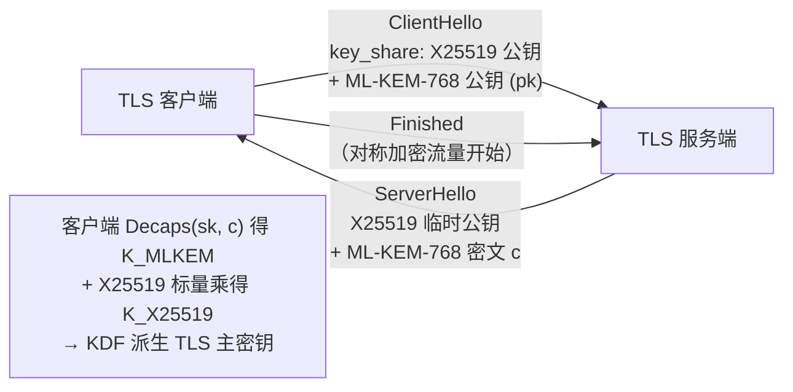

# 密码学（51）· Kyber-ML-KEM

> [!abstract] TL;DR
> - **ML-KEM**（FIPS 203，前身 CRYSTALS-Kyber）是 NIST 2024 年正式发布的**后量子密钥封装机制（KEM）**。
> - 安全基础：**Module-LWE（MLWE）**，即使量子计算机面前也无已知有效攻击。
> - **KEM 三步**：KeyGen 生成公私钥；Encaps 用公钥产出「共享密钥 K + 密文 c」；Decaps 用私钥从 c 恢复 K——替代 ECDH 做后量子密钥建立。
> - 三档参数集：ML-KEM-512（安全 L1）/ 768（L3）/ 1024（L5），密文约 768 / 1088 / 1568 字节。
> - 当前主流实践：**TLS 1.3 混合组 X25519MLKEM768**（同时抵御经典与量子攻击）。

---

## 概述与定位

### 从 ECDH 到 KEM：为什么后量子时代需要 KEM

在经典世界，两方建立共享密钥最常见的方式是 [[26.ECDH密钥交换]]：Alice 和 Bob 各持一对椭圆曲线密钥对，通过交换公钥、双方各自做一次标量乘法，得到同一个共享点——其安全性依赖椭圆曲线离散对数问题（ECDLP）。

然而量子计算机上的 **Shor 算法**能在多项式时间内破解 ECDLP，彻底瓦解 ECDH（及 RSA、传统 DH）的安全基础（详见 [[49.后量子密码概览]]）。

**KEM（Key Encapsulation Mechanism，密钥封装机制）** 是替代 ECDH 的后量子密钥建立范式。与 ECDH"双方互推"的对称模型不同，KEM 是**非对称的一轮协议**：

```
KeyGen()  →  (pk, sk)               # 接收方生成公私钥对
Encaps(pk) →  (K, c)                # 发送方用公钥产出：共享密钥 K + 密文（封装体）c
Decaps(sk, c) → K                   # 接收方用私钥从 c 中恢复 K
```

- 发送方（如 TLS 客户端）执行 `Encaps`，得到 K 并把 c 发给接收方；接收方执行 `Decaps(sk, c)` 还原同一个 K。
- 双方共享同一个 K，可用作后续对称加密（AES-GCM、ChaCha20 等）的会话密钥，或输入 HKDF 进一步派生多条密钥。
- 整个过程仅一轮通信（发送方 → 接收方），比 ECDH 的"两次握手+标量乘"更简洁。

> [!info] KEM vs 直接加密
> KEM 不直接加密消息，而是封装一个随机生成的共享密钥 K。消息加密用的是 K 驱动的对称算法——这正是"混合加密"（KEM + DEM）的结构。ML-KEM 就是后量子混合加密体系中的 KEM 层。

### ML-KEM 在后量子格局中的位置

| 标准 | 功能 | 安全假设 |
|---|---|---|
| ML-KEM（FIPS 203） | **密钥封装 / 密钥建立** | Module-LWE |
| ML-DSA（FIPS 204） | 数字签名 | Module-LWE |
| SLH-DSA（FIPS 205） | 数字签名 | 哈希函数 |

ML-KEM 对应的是 [[49.后量子密码概览]] 中"格密码 KEM"这一栏，其数学地基（格、MLWE）详见 [[50.格密码基础]]。

---

## 原理与机制

### MLWE 的 Regev 规约：从平均情况到最坏情况格问题

#### LWE 的 Regev 规约（基础回顾）

Regev（2005）证明了 **LWE（Learning With Errors）** 问题的困难性不仅在随机选取实例时成立，更能**规约到格问题的最坏情况**（worst-case lattice problems）：

```
定理（Regev 2005，直觉版本）：
  若能以多项式时间以不可忽略概率求解"平均情况 LWE(n, q, χ)"
  则能以量子多项式时间（BQP）解决以下问题的最坏情况版本：
    - GapSVP_{Õ(n/α)}（Gap 最短向量问题，近似因子 Õ(n/α)）
    - SIVP_{Õ(n/α)}（最短独立向量问题，Shortest Independent Vectors Problem）
  其中 α 是噪声参数（χ 是以 αq 为标准差的高斯分布）
```

**规约方向**（关键！与通常认知相反）：

```
最坏情况格问题（困难）
     ↓  量子归约（Regev 2005）/ 经典归约（Peikert 2009，加强版）
平均情况 LWE（困难）
     ↓  平凡规约
搜索 LWE（从 (A, b=As+e) 恢复 s）（困难）
     ↓  Goldreich-Levin 式规约
判定 LWE（区分 (A, As+e) 与 (A, uniform)）（困难）
     ↓  直接构造
K-PKE（IND-CPA 安全）→ ML-KEM（IND-CCA2 安全）
```

"从平均到最坏"意味着：若 **存在任何** LWE 的有效算法（即使只对随机生成的实例有效），也能解决最坏情况格问题。而最坏情况格问题是几十年来的公开难题，无有效算法（量子或经典），这为 LWE 的困难性提供了极强的安全根基。

#### MLWE 的规约（向量/模块推广）

MLWE（Module-LWE）是 LWE 的**多项式环上的模块（向量）形式**，由 Langlois & Stehlé（2012）引入：

```
MLWE(k, R_q, χ) 问题：
  给定矩阵 A ∈ R_q^{k×k} 和向量 b = A·s + e ∈ R_q^k
  其中 s, e ← χ^k（小系数分布）
  求 s

规约链（Langlois-Stehlé 2012）：
  最坏情况 SIVP/GapSVP（在理想格/模格上）
  ←  Module-LWE（平均情况）
  ←  Ring-LWE（当 k=1 时的特例）
```

MLWE 比 LWE 更高效（矩阵 A 是 k×k 个多项式，而非标量矩阵，公钥紧凑），比 Ring-LWE 更保守（k>1 避免了纯环结构可能带来的代数攻击）。

#### GapSVP 与 SIVP 的定义

```
GapSVP_γ（Gap Shortest Vector Problem，近似因子 γ）：
  给定格基 B 和长度 d：
    YES 实例：最短非零向量长度 λ_1(L) ≤ d
    NO 实例：λ_1(L) > γ·d
  问题：区分两类实例

SIVP_γ（Shortest Independent Vectors Problem）：
  给定格基 B（n 维格）：
  找出 n 个线性无关的格向量，使其范数均 ≤ γ·λ_n(L)
  （λ_n(L) = n 个线性无关向量所能达到的最小最大范数）
```

这两个问题：
- 对 γ = poly(n) 的近似因子无已知有效算法（经典或量子）。
- 对 γ = 2^{O(n/log n)} 的超指数近似因子有（经典）多项式时间算法（LLL）。
- ML-KEM 的安全参数对应需要 γ ≈ 2^{100+}，远超任何已知算法能达到的近似比。

#### 规约的安全意义

```
实际意义分析：

1. "无条件安全根基"：
   ML-KEM 的安全性不依赖"某个特定哈希函数难以逆转"
   而是依赖"格问题的最坏情况困难性"——一个纯粹的数学困难性。
   即使所有哈希函数都被破解，只要 SIVP 困难，ML-KEM 仍安全。

2. "量子安全的来源"：
   Shor 算法攻击的是离散对数和分解问题（群同态结构）。
   格问题缺乏这种代数群结构，Shor 算法无法应用。
   目前最好的量子格攻击（量子 BKZ）仅有次指数加速（~√指数），
   这就是 ML-KEM 抗量子的数学本质。

3. "平均到最坏"规约的工程含义：
   密码系统的安全不仅在"随机密钥"时成立，而是"任何密钥都安全"。
   即使攻击者能选择公钥（CCA 模型），也无法找到私钥的结构弱点。
```

#### 规约参数与 ML-KEM 安全裕量

```
ML-KEM-768 参数下的近似规约因子：
  n_eff = k × n = 3 × 256 = 768（有效格维度）
  q = 3329，η = 2（噪声参数）
  α = η/q ≈ 2/3329 ≈ 0.0006

规约给出的最坏情况安全级别（近似）：
  GapSVP_{Õ(n/α)} = GapSVP_{Õ(768/0.0006)} = GapSVP_{Õ(1.28×10^6)}
  → 需要攻击一个近似因子超过百万量级的 SVP，无已知有效算法

BKZ 攻击实际安全裕量（经具体参数估算）：
  经典安全：~180 比特
  量子安全：~166 比特
  NIST L3 目标：128 比特
  裕量：~38–52 比特，足以应对算法的适度进步
```

> [!note] 规约是"单向安全论证"
> Regev 规约是从"格问题困难 → LWE/MLWE 困难"的推论，不是"LWE 困难 ↔ 格问题困难"的等价。这意味着若将来发现 SIVP/GapSVP 的有效算法，ML-KEM 即告破解；但目前没有迹象表明这会发生。规约链的每一步都经过密码学界严格验证，这是 NIST 选择基于格的方案的核心理由。

### 数学地基：Module-LWE

```
环 R_q = Z_q[x] / (x^256 + 1)
模数 q = 3329
```

- `x^256 + 1` 是 NTT（数论变换）友好的分圆多项式——256 次多项式的环。
- `q = 3329`（素数，满足 `q ≡ 1 mod 256`，NTT 加速所需条件）。

**MLWE 困难假设（直觉）**：给定矩阵 `A`（元素是 R_q 中的多项式）和向量 `b = A·s + e`（`s` 是秘密向量，`e` 是小误差），无法有效恢复 `s`。量子和经典计算机对此问题都无已知有效算法——这是 ML-KEM 抗量子的根本（见 [[50.格密码基础]] 中的 LWE/MLWE 介绍）。

#### 参数 k 决定模块维度

| 参数集 | k（模块秩） | q | 安全级 |
|---|---|---|---|
| ML-KEM-512 | 2 | 3329 | NIST L1（AES-128 等效） |
| ML-KEM-768 | 3 | 3329 | NIST L3（AES-192 等效） |
| ML-KEM-1024 | 4 | 3329 | NIST L5（AES-256 等效） |

k 越大，多项式矩阵维度越高，安全性越强，密钥和密文也越大。

### NTT 加速与参数选择：q=3329 与 n=256 的数学理由

#### 为什么选 n=256

多项式环 `R_q = Z_q[x] / (x^n + 1)` 的参数 n 决定：

1. **安全性**：n 越大，格维度越高，LWE/MLWE 问题越难（BKZ 攻击复杂度指数增长）。
2. **效率**：NTT 复杂度 O(n log n)；n=256 是常见的平衡点。
3. **NTT 友好性**：NTT 要求 2n 次单位根在 Z_q 中存在，即 `q ≡ 1 (mod 2n)`。

n=256 的具体约束：需要 `q ≡ 1 (mod 512)`，等价于 512 | (q-1)。

验证 q=3329：

```
3329 - 1 = 3328 = 512 × 6 + 256 ← 不对！
实际约束更精确：

ML-KEM 使用的是"长度 256 的 NTT"但在分圆多项式 x^256+1 上。
x^256+1 的 NTT 分解是在包含 512 次原始根的域中进行的：
  需要 ω 是 Z_q 中的 512 次本原根，等价于 512 | (q-1)

验证：q = 3329
  q - 1 = 3328 = 2^8 × 13 = 256 × 13

256 | 3328？  3328 / 256 = 13  ← 是的
512 | 3328？  3328 / 512 = 6.5 ← 不是整除！
```

等等——需要更仔细的分析：

```
实际上 ML-KEM 的 NTT 使用"不完全 NTT"（negacyclic NTT）：
  分圆多项式 Φ_{512}(x) = x^256 + 1 的零点是 512 次本原单位根 ζ^(2i+1)（i=0..255）
  这些根满足 ζ^512 = 1 且 ζ^256 = -1（负循环 NTT）
  
  所需条件：ζ（256 次本原根）在 Z_q 中存在
  等价条件：ord(Z_q^*) = q-1 被 256 整除，即 256 | (q-1)

q = 3329：q - 1 = 3328 = 256 × 13
  256 | 3328 ✓  （13 是奇数，2^8 恰好整除）
  
  额外检验：需要 512 次本原根（因为 NTT 蝶形需要 ζ 的奇次幂）
  3328 / 512 = 6.5 → 512 不整除，但 2^8 整除
  
  FIPS 203 实际用 zeta = 17（验证：17^256 mod 3329 = -1 mod 3329 = 3328 ✓）
  即 17 是 Z_{3329} 中 512 次本原根（17^512 ≡ 1，17^256 ≡ -1）
```

#### q=3329 的具体选取理由

q=3329 同时满足以下工程约束：

```
约束 1（NTT 友好）：256 | (q-1)
  3329 - 1 = 3328 = 2^8 × 13  ✓

约束 2（素数）：q 必须是素数，确保 Z_q 是域
  3329 是素数  ✓

约束 3（安全边界）：系数压缩误差在 q/4 以内不影响解密
  中心二项分布 CBD_η（η=2）的最大误差 ≤ 2η = 4
  解密阈值：误差 < q/4 ≈ 832
  4 << 832  ✓  （误差极小，解密总能正确舍入）

约束 4（位宽效率）：q < 2^12 = 4096
  系数可用 12 位存储（log2(3329) ≈ 11.7），压缩损耗最小
  模约简可用 Barrett/Montgomery 快速算法  ✓

约束 5（乘法不溢出）：两个系数乘积 < 2^32
  (q-1)^2 = 3328^2 ≈ 11×10^6 < 2^32 = 4×10^9  ✓
  可用 32 位整数存中间值，无需 64 位
```

为何不选更大的素数（如 12289，用于 NewHope）？更大的 q 意味着每个系数占更多字节，密文和密钥更大；q=3329 在安全性、密文大小、计算效率三者间取最优平衡。

#### NTT 蝶形运算详解

ML-KEM 使用 Cooley-Tukey 蝶形（正向 NTT）和 Gentleman-Sande 蝶形（逆向 INTT）：

```
正向 NTT（Cooley-Tukey）：
  for len = 128, 64, 32, ..., 1:    # 8 轮（log2(256) = 8）
    for start = 0; start < 256; start += 2*len:
      zeta = ω^{bitrev(k)}           # k 从 1 开始，bitrev 是位翻转置换
      for j = start; j < start+len; j++:
        t = zeta * f[j+len] mod q
        f[j+len] = (f[j] - t) mod q
        f[j]     = (f[j] + t) mod q
```

NTT 后，多项式乘法变为 256 次逐点乘（pointwise multiplication）：

```
(a · b) in NTT domain:
  ĉ[i] = â[i] × b̂[i] mod q     for i = 0..255
逆 NTT 后得到乘积 c = a · b in R_q
```

总操作数：2 × NTT（2 × 256 × 8 = 4096 次蝶形）+ 256 次逐点乘 ≈ 8448 次模乘，远少于朴素乘法的 256² = 65536 次。

#### 安全直觉：n 与 q 对 MLWE 难度的影响

```
MLWE(k, n, q, η) 问题难度粗略依赖：
  √n × log(q/η)    ← 格的"有效维度"与"信噪比"

n=256, q=3329, η=2（ML-KEM-768）：
  √256 × log(3329/2) ≈ 16 × 10.7 ≈ 171
  → BKZ-171 量级的格攻击，经典安全 ~180+ 位
```

n 加倍会使格维度加倍、安全边际指数增长；q 越小（噪声 η 相对越大），信噪比越低，LWE 越难。q=3329 在"够小以保证高安全性"和"够大以保证正确解密"之间取得精确平衡。

### NTT 加速：多项式乘法的效率核心

```
NTT 变换：时域多项式 → 频域系数（长度 256 的向量）
点乘：频域系数对位相乘 O(256)
INTT：逆变换回时域
```

`q=3329` 选取即保证了 256 阶主根在 `Z_3329` 中存在，使 NTT 无精度损失，全部运算在整数模运算下完成。

### Fujisaki-Okamoto（FO）变换：从 IND-CPA 到 IND-CCA2 的升级路径

#### 为什么 CPA-PKE 不够

K-PKE（Kyber.PKE 即底层 CPA 加密层）提供 **IND-CPA** 安全性：在"攻击者只能被动观察密文"的模型下，密文不泄露明文信息。但在现实中攻击者可以：

1. 提交任意密文让解密方（或设备）解密，观察是否成功/输出（Chosen-Ciphertext Attack，CCA）。
2. 通过时序、功耗、错误消息区分解密成功与失败（oracle 攻击）。

对 K-PKE 的 CCA 攻击示例（直觉）：

```
攻击者截获密文 c = (u, v)
修改 v → v' = v ⊕ Δ（翻转 encode(m) 某位）
让解密方解密 c'，观察输出 m' 的相应位是否翻转
→ 逐位恢复 m（选择密文攻击恢复明文）
```

K-PKE 对此毫无防御——解密算法不验证密文的合法性。

#### FO 变换的三步改造

Fujisaki-Okamoto（1999 年，后经 Hofheinz-Hövelmanns-Kiltz 2017 年量子安全变体重新证明）通过以下三步将 CPA-PKE 提升为 CCA-KEM：

**步骤 1：确定性加密（随机硬币绑定）**

```
传统 CPA-PKE：Encrypt(pk, m; r)，r 是独立随机数
FO 改造后：r = H(m ‖ H(pk))          # r 由 m 和公钥的哈希确定性派生
→ 对同一消息 m 和公钥 pk，加密结果唯一确定
```

这意味着：给定 (pk, m)，密文 c 是唯一的——可验证！

**步骤 2：re-encryption 比对（decapsulation 的核心）**

```
Decaps(sk, c)：
  m' = K-PKE.Decrypt(sk, c)         # 尝试解密
  r' = H(m' ‖ H(pk))               # 重新推导随机硬币
  c' = K-PKE.Encrypt(pk, m', r')    # 重新加密
  if ct_eq(c', c):                  # 常数时间比较
    return KDF(H(m') ‖ H(c))        # 解封成功
  else:
    return KDF(z ‖ H(c))            # 隐式拒绝（见下节）
```

re-encryption 将"解密输出是否正确"转换为"密文是否一致"——**把解密正确性检查转化为公钥加密操作**，攻击者无法通过篡改密文让解密方返回有用信息（篡改后 c' ≠ c，触发拒绝分支）。

**步骤 3：共享密钥隔离**

```
K = KDF(H(m') ‖ H(c))     # 共享密钥不直接是 m，而是 m 与密文哈希的组合
```

将密文哈希 H(c) 纳入 KDF，确保共享密钥**绑定到特定密文**：对相同 m 但不同密文 c 的两次封装，派生出不同 K，防止密文替换攻击（Meleability）。

#### CCA2 的安全归约（直觉）

在随机预言机模型（ROM）下，FO 变换的 IND-CCA2 安全性归约到底层 PKE 的 OW-CPA（单向 CPA）安全性：

```
归约链：
  IND-CCA2（ML-KEM）
  ← IND-CPA 安全 + FO 变换正确应用
  ← OW-CPA（K-PKE）+ MLWE 困难性假设
```

量子安全版本（QROM 量子随机预言机模型）由 Saito-Xagawa-Yamakita（2018）和 Hofheinz 等人证明，ML-KEM 的 FIPS 203 安全证明基于此框架。

#### KEM 比裸 PKE 更安全的工程理由

| 维度 | 裸 K-PKE | ML-KEM（FO 后 KEM） |
|------|---------|-------------------|
| 安全模型 | IND-CPA | IND-CCA2 |
| 篡改密文的效果 | 可能得到有用解密输出 | 隐式拒绝，返回伪随机 K |
| 重用密文 c | 每次 Decaps 返回相同输出（可区分）| 绑定 H(c)，同一 c 相同但不可推断明文 |
| 直接暴露封装值 m | 是（Decrypt 直接返回 m） | 否（K = KDF(m,c)，m 不出现在接口上） |
| 前向安全 | 泄露 sk 可解密历史 c | 同上（KEM 天然一次性） |

### 从 CPA-PKE 到 CCA-KEM：FO 变换

```
第一层：IND-CPA 安全的公钥加密方案 K-PKE（Kyber-PKE）
第二层：通过 Fujisaki-Okamoto (FO) 变换升级为 IND-CCA2 安全的 KEM
```

**K-PKE 核心操作**（模 q 多项式运算）：

```
KeyGen:
  A ← seed（用 XOF 扩展，均匀随机矩阵）
  (s, e) ← 小误差分布 CBD_η
  t = A·s + e          # 公钥（t, seed_A）
  sk = s               # 私钥

Encrypt(pk, m, r):     # m 是消息比特，r 是随机硬币
  (r₁, e₁, e₂) ← CBD_η(r)
  u = Aᵀ·r₁ + e₁
  v = tᵀ·r₁ + e₂ + encode(m)·⌊q/2⌋
  密文 c = (u, v)

Decrypt(sk, c):
  w = v - sᵀ·u        # 消去加密噪声
  m = decode(round(w)) # 四舍五入到 0 或 ⌊q/2⌋
```

**FO 变换**将 CPA-PKE 提升为 CCA-KEM：

- 随机硬币 `r` 由 PRF（基于消息 m 和 hash(pk)）确定性派生，不再独立随机。
- Decaps 重新加密并比对密文，防止适应性选择密文攻击（CCA）。
- 共享密钥 K 由 `H(m, c)` 派生，不直接暴露 m。

---

## 算法流程详解

### 密钥与密文尺寸

| 参数集 | 公钥 | 私钥 | 密文 | 共享密钥 |
|---|---|---|---|---|
| ML-KEM-512 | 800 字节 | 1632 字节 | 768 字节 | 32 字节 |
| ML-KEM-768 | 1184 字节 | 2400 字节 | 1088 字节 | 32 字节 |
| ML-KEM-1024 | 1568 字节 | 3168 字节 | 1568 字节 | 32 字节 |

对比 ECDH（X25519 公钥 32 字节，无密文概念），ML-KEM 密文和密钥显著更大——这是为抗量子付出的带宽代价。

### 隐式拒绝（Implicit Rejection）：防 decapsulation oracle 攻击

#### 问题：显式拒绝创造 oracle

如果 Decaps 在 c' ≠ c 时返回"解封失败"（错误码、异常、null），攻击者获得了一个 **decapsulation oracle**：

```
攻击者提交恶意密文 c̃：
  如果 Decaps 返回错误   → 密文被拒绝（c̃ 不合法）
  如果 Decaps 返回密钥 K̃ → 密文被接受（提取 K̃ 的信息）
```

即使不知道 K̃ 的具体值，仅凭"接受 vs 拒绝"的二元信号，攻击者可以：

1. **自适应选择密文攻击（CCA2）**：构造一系列 c̃，通过 oracle 响应逐步恢复私钥 s 的分量（类似 RSA PKCS#1 v1.5 的 Bleichenbacher 攻击）。
2. **时序侧信道**：即使错误码相同，Decaps 在"解密成功但 c' ≠ c"与"解密直接出错"时的执行路径不同，可能存在时序差异，暴露 m' 的部分信息。

#### 隐式拒绝的机制

ML-KEM 的解决方案（FO 变换的隐式拒绝分支）：

```
Decaps(sk, c)：
  m'         = K-PKE.Decrypt(s, c)      # 无论成功与否，总能输出某个 m'
  r'         = H(m' ‖ H(pk))
  c'         = K-PKE.Encrypt(pk, m', r')
  b          = ct_eq(c', c)             # b ∈ {0,1}，常数时间比较
  K_good     = KDF(H(m') ‖ H(c))
  K_bad      = KDF(z ‖ H(c))           # z 是 sk 中存储的随机种子（KeyGen 时生成）
  return     b * K_good + (1-b) * K_bad # 常数时间选择（cmov，非 if-else）
```

关键点：

1. **总是返回某个 K**，攻击者无法通过"得到密钥 vs 得到错误"区分合法/非法密文。
2. **K_bad = KDF(z ‖ H(c))** 中的 z 是每个私钥独有的随机值（sk 的一部分），对相同 c，同一私钥始终返回相同的 K_bad——**确定性但不可预测**，防止攻击者通过重放同一 c 检测随机性。
3. 攻击者提交非法 c，收到 K_bad；下次再提交同样的 c，收到相同的 K_bad——行为与合法 Decaps 在统计上不可区分。

#### 为什么需要常数时间比较

Decaps 中有两处必须常数时间：

```
危险操作 1：ct_eq(c', c)
  普通 memcmp 在发现第一个不同字节时即返回（短路）
  → 攻击者构造仅最后一字节不同的密文序列，测量时间
  → 恢复"最长公共前缀"，逐字节推断 c' 的内容
  → 进而推断 m' 或 s 的信息

危险操作 2：常数时间选择（b * K_good + (1-b) * K_bad）
  普通 if(b) return K_good; else return K_bad 产生可观测分支
  → 编译器可能用条件跳转（cmov 之外的指令）
  → 缓存行时序差异暴露 b 的值（即密文是否合法）
```

正确实现应使用 `crypto_memcmp`（或 OpenSSL 的 `CRYPTO_memcmp`）和汇编级 `cmov`，参见 [[61.侧信道攻击]] 中的常数时间实现模式。

#### 隐式拒绝与 decapsulation oracle 防护总结

```
攻击者的视角（无法区分以下两种情况）：
  情况 A：密文合法，Decaps 输出 KDF(H(m') ‖ H(c))
  情况 B：密文非法，Decaps 输出 KDF(z ‖ H(c))

→ "合法" vs "非法"在输出分布上不可区分
→ 攻击者无法使用 Decaps 作为有用的 oracle
→ IND-CCA2 安全性成立
```

> [!note] 关联：TLS 握手中的应用
> 在 TLS 1.3 + ML-KEM 握手中，客户端 Decaps 失败后继续使用 K_bad 推进握手（握手最终因 MAC 验证失败而中止），而不是立刻断连。这防止了攻击者通过"握手是否成功"推断密文有效性。

### ML-KEM 完整流程（Mermaid）
    G1["生成随机种子 d（32 字节）"]
    G2["SHAKE 扩展 → 矩阵 A（k×k 个多项式）<br/>+ 向量 s, e（小系数）"]
    G3["t = NTT(A) · NTT(s) + e<br/>（模 q=3329 运算）"]
    G4["pk = (t, seed_A)<br/>sk = (s, pk, H(pk), z)"]
    G1 --> G2 --> G3 --> G4
  end

  subgraph Encaps["ML-KEM.Encaps(pk)"]
    E1["随机消息 m ← {0,1}^256"]
    E2["(K̃, r) = G(m ∥ H(pk))<br/>（哈希派生随机硬币 r 和预密钥 K̃）"]
    E3["用 r 调用 K-PKE.Encrypt(pk, m, r)<br/>得密文 c = (u, v)"]
    E4["共享密钥 K = KDF(K̃ ∥ H(c))"]
    E5["输出 (K, c)"]
    E1 --> E2 --> E3 --> E4 --> E5
  end

  subgraph Decaps["ML-KEM.Decaps(sk, c)"]
    D1["m' = K-PKE.Decrypt(s, c)"]
    D2["(K̃', r') = G(m' ∥ H(pk))"]
    D3["c' = K-PKE.Encrypt(pk, m', r')"]
    D4{"c' == c ?"}
    D5_yes["K = KDF(K̃' ∥ H(c))"]
    D5_no["K = KDF(z ∥ H(c))<br/>（随机噪声，防侧信道）"]
    D4 -->|"是"| D5_yes
    D4 -->|"否（解封失败）"| D5_no
    D1 --> D2 --> D3 --> D4
  end

  G4 -->|"pk 发给 Encaps 方<br/>sk 保留"| E1
  E5 -->|"密文 c 发送给 Decaps 方"| D1
```

> [!note] 重加密比对（CCA 防护）
> Decaps 中 `c' == c` 的比对必须是**常数时间**（constant-time）比较，否则时序差异泄露中间值，构成侧信道攻击。失败分支输出 `KDF(z ∥ H(c))`（z 为私钥中存储的随机值），让攻击者无法区分"解封失败"与"解封成功"，防止 CCA 询问。

### 关键子过程

**压缩与解压（Compress/Decompress）**：系数在传输前从 `Z_q`（0..3328）压缩到更少比特（如 d=10 bit），节省带宽，引入可控舍入误差，但不影响正确解密（误差在解码阈值内）。

**中心二项分布 CBD_η**：生成小系数的误差向量（`η=2` 或 `η=3`），系数分布在 {-η, ..., η}，保证 LWE 噪声够小以便正确解密，又足够随机以保障安全。

**扩展输出函数（XOF）**：SHAKE-128/256 用于从种子扩展出矩阵 A，保证 A 的均匀随机性，同时节省传输带宽（只传 seed 而非整个矩阵）。

---

## 与 ECDH 的对比

| 维度 | ECDH（X25519） | ML-KEM-768 |
|---|---|---|
| 安全基础 | ECDLP（量子可破） | Module-LWE（抗量子） |
| 公钥大小 | **32 字节** | 1184 字节 |
| 密文/交换值 | **32 字节** | 1088 字节 |
| 共享密钥 | 32 字节 | 32 字节 |
| 通信模型 | 双向（双方各出公钥） | 单向（发送方 Encaps） |
| 前向安全性 | 需显式临时密钥（ephemeral ECDH） | Encaps 天然是一次性的 |
| 性能（软件） | 非常快（微秒级） | 快（比 RSA 快，比 ECDH 略慢） |
| 标准化 | RFC 7748 | FIPS 203（2024） |

> [!info] 前向安全
> ML-KEM 的 Encaps 每次使用新随机 `m`，密文 c 是一次性的，天然提供前向安全（泄露长期私钥 sk 也无法恢复历史会话的 K）——这与 ECDH 在 TLS 中使用临时密钥的效果等价。

---

## TLS 混合部署

当前最重要的实践场景是 **TLS 1.3 后量子迁移**（呼应 [[49.后量子密码概览]] 第三阶段）。

### X25519MLKEM768

IETF 标准化中的混合密钥交换组 `X25519MLKEM768`（以及 `SecP256r1MLKEM768` 等）同时运行两套 KEM：

```
经典：X25519 ECDH 密钥交换
后量子：ML-KEM-768 封装
共享密钥 K = KDF(K_X25519 ∥ K_MLKEM768)
```

- **同时抵御**：对经典攻击（只破 ML-KEM）或量子攻击（只破 X25519）都无效，必须同时破解两者。
- **混合设计原则**：如果任一组件是安全的，整体就是安全的。
- Chrome/Firefox、Cloudflare、Google 等已在生产流量中大规模部署 X25519MLKEM768。



---

## 性能数据参考

以下为软件实现的量级参考（x86-64，AVX2 优化，数量级示意）：

| 操作 | ML-KEM-512 | ML-KEM-768 | ML-KEM-1024 |
|---|---|---|---|
| KeyGen | ~20 μs | ~30 μs | ~45 μs |
| Encaps | ~25 μs | ~35 μs | ~55 μs |
| Decaps | ~28 μs | ~40 μs | ~60 μs |

> [!warning] 性能数值为示意
> 实际性能受 CPU 型号、指令集（AVX2/AVX-512/ARM NEON）、内存带宽和编译器影响。参考 NIST 提交文档与 pq-crystals.org 基准数据。

- ML-KEM 性能显著优于 RSA-2048 的密钥生成和加密。
- 与 X25519 相比：每次 Encaps 约多出 ~30 μs（1 GHz 量级主机），对 TLS 握手性能影响极小。
- 主要开销来自**NTT 多项式乘法**和**SHA-3/SHAKE**。

---

## 安全性与正确使用

### 安全模型

ML-KEM 提供 **IND-CCA2**（适应性选择密文攻击不可区分）安全性，在 QROM（量子随机预言机模型）下可证明。其安全归约到 MLWE 问题。

当前最强格攻击（BKZ 算法等）对 ML-KEM-768 的经典安全裕量约 **181 比特**，量子安全裕量约 **166 比特**——远超 128 比特目标，有足够余量应对未来攻击进步。

### 参数集选择

| 场景 | 推荐参数集 | 理由 |
|---|---|---|
| 通用 TLS / VPN | **ML-KEM-768** | L3 安全，带宽合理（1088 字节密文） |
| 超高安全要求（机密通信/长期数据）| ML-KEM-1024 | L5，最高安全裕量 |
| 严格资源受限（IoT/嵌入式）| ML-KEM-512 | L1，密文最小（768 字节） |
| 过渡期混合部署 | X25519MLKEM768 | 兼顾经典与量子威胁 |

> [!warning] 不要使用非标准参数
> ML-KEM 只有 512/768/1024 三档官方参数集。自定义 q、k、η 参数不在 FIPS 203 覆盖范围内，可能引入未知安全弱点。

### 实现安全要点

**1. 常数时间实现（constant-time）**

- Decaps 中的 `c' == c` 比对必须用常数时间函数（如 `crypto_memcmp`），普通 `memcmp` 可能因短路返回泄露信息。
- 多项式运算中的条件分支（如模约简）也需常数时间，否则缓存时序侧信道可恢复私钥（类似 Flush+Reload 攻击，参见 [[61.侧信道攻击]]）。

**2. 随机数质量**

- KeyGen 和 Encaps 均依赖高质量随机数（`d` 和 `m`）。CSPRNG 不足会直接导致私钥或封装消息可预测。
- 参见 [[43.随机数与熵]]：必须使用操作系统级 CSPRNG（`getrandom()`/`BCryptGenRandom` 等），不得使用用户空间 PRNG 自行播种。

**3. 密钥存储与销毁**

- 私钥 sk 长达 1600~3200 字节，必须在安全内存中存储（防换出到 swap），使用后立即清零（`explicit_memset`/`SecureZeroMemory`）。
- 共享密钥 K 用后即销毁，不长期保存。

**4. 混合部署过渡期**

- 在经典密码淘汰前，优先采用混合组（X25519MLKEM768）而非纯 ML-KEM——这样即使 ML-KEM 实现存在零日漏洞，经典密钥交换仍提供保护；反之量子攻击也被 ML-KEM 覆盖。

**5. 侧信道与故障注入**

- 硬件实现需考虑功耗侧信道（功率分析 SPA/DPA）和故障注入，NTT 蝶形运算可能泄露中间状态。嵌入式部署建议使用已通过 NIST/BSI 侧信道评估的库（如 liboqs、CIRCL、kyber-ref）。

**6. 库选型建议**

| 场景 | 推荐库 |
|---|---|
| 通用（C/Go/Rust） | liboqs（OQS）、CIRCL（Cloudflare）、kyberslash |
| TLS 集成 | BoringSSL（Google）、wolfSSL、mbedTLS 已含 ML-KEM |
| Python | `pqcrypto` 包装 liboqs |

> [!caution] 不要自行实现
> ML-KEM 的 NTT、常数时间约简、FO 变换细节极易在实现中引入侧信道或功能性漏洞。始终使用经过审计的参考实现或知名库，不要在生产环境中自行从规范实现。

---

## 小结

ML-KEM（FIPS 203）是后量子时代替代 ECDH 的官方标准，其核心在于：

1. **KEM 范式**：发送方 Encaps 产出密文和共享密钥，接收方 Decaps 还原密钥，一轮完成密钥建立。
2. **数学基础**：Module-LWE + 多项式环 `Z_3329[x]/(x^256+1)`，NTT 加速多项式乘法；CPA-PKE 经 FO 变换提升为 CCA-KEM。
3. **参数三档**：512/768/1024 对应 NIST L1/L3/L5，密文 768~1568 字节——比 ECDH 大但对网络性能影响可接受。
4. **部署现状**：X25519MLKEM768 混合组已进入 TLS 1.3 主流浏览器和 CDN，是过渡期推荐方案。
5. **正确使用**：用标准参数集、混合部署、依赖知名库、常数时间实现、保障随机数质量。

后续 [[52.Dilithium-ML-DSA]] 将在同样的 Module-LWE/Module-SIS 数学框架上，解决签名问题。

---

## 相关阅读

- [[50.格密码基础]] —— ML-KEM 的数学地基（格、LWE、MLWE、NTT）
- [[49.后量子密码概览]] —— 量子威胁全景与 NIST 标准化进程
- [[26.ECDH密钥交换]] —— ML-KEM 替代的经典方案
- [[52.Dilithium-ML-DSA]] —— 同族格密码，解决数字签名
- [[43.随机数与熵]] —— KeyGen/Encaps 的随机数依赖
- [[61.侧信道攻击]] —— 常数时间实现所防御的攻击类型
- [[62.协议误用与密码工程]] —— 密码库选型与生产部署

---

⬅️ 上一篇 [[50.格密码基础]] ｜ 🏠 [[00.密码学总览]] ｜ 下一篇 [[52.Dilithium-ML-DSA]] ➡️
