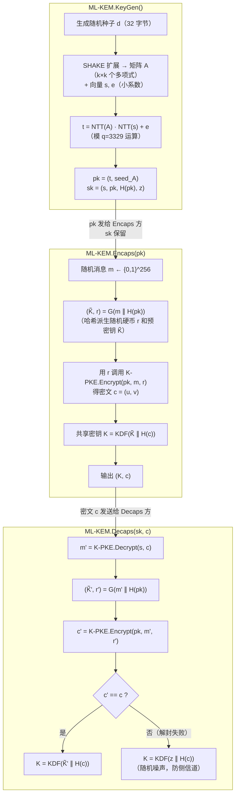
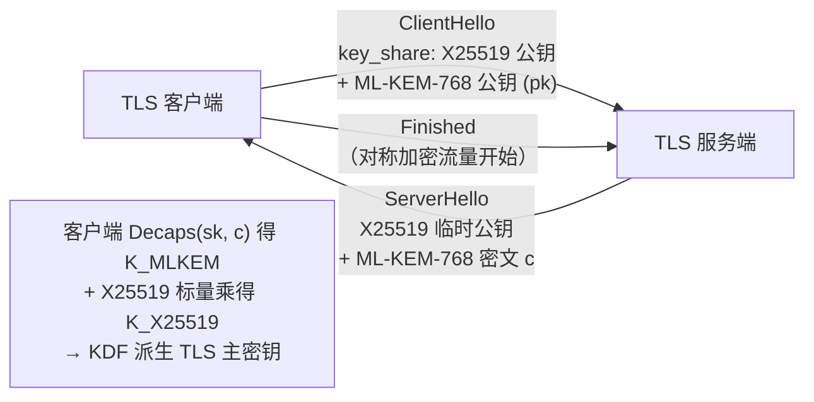

# 密码学（51）· Kyber-ML-KEM

> [!abstract] TL;DR
> - **ML-KEM**（FIPS 203，前身 CRYSTALS-Kyber）是 NIST 2024 年正式发布的**后量子密钥封装机制（KEM）**。
> - 安全基础：**Module-LWE（MLWE）**，即使量子计算机面前也无已知有效攻击。
> - **KEM 三步**：KeyGen 生成公私钥；Encaps 用公钥产出「共享密钥 K + 密文 c」；Decaps 用私钥从 c 恢复 K——替代 ECDH 做后量子密钥建立。
> - 三档参数集：ML-KEM-512（安全 L1）/ 768（L3）/ 1024（L5），密文约 768 / 1088 / 1568 字节。
> - 当前主流实践：**TLS 1.3 混合组 X25519MLKEM768**（同时抵御经典与量子攻击）。

---

## 概述与定位

### 从 ECDH 到 KEM：为什么后量子时代需要 KEM

在经典世界，两方建立共享密钥最常见的方式是 [[26.ECDH密钥交换]]：Alice 和 Bob 各持一对椭圆曲线密钥对，通过交换公钥、双方各自做一次标量乘法，得到同一个共享点——其安全性依赖椭圆曲线离散对数问题（ECDLP）。

然而量子计算机上的 **Shor 算法**能在多项式时间内破解 ECDLP，彻底瓦解 ECDH（及 RSA、传统 DH）的安全基础（详见 [[49.后量子密码概览]]）。

**KEM（Key Encapsulation Mechanism，密钥封装机制）** 是替代 ECDH 的后量子密钥建立范式。与 ECDH"双方互推"的对称模型不同，KEM 是**非对称的一轮协议**：

```
KeyGen()  →  (pk, sk)               # 接收方生成公私钥对
Encaps(pk) →  (K, c)                # 发送方用公钥产出：共享密钥 K + 密文（封装体）c
Decaps(sk, c) → K                   # 接收方用私钥从 c 中恢复 K
```

- 发送方（如 TLS 客户端）执行 `Encaps`，得到 K 并把 c 发给接收方；接收方执行 `Decaps(sk, c)` 还原同一个 K。
- 双方共享同一个 K，可用作后续对称加密（AES-GCM、ChaCha20 等）的会话密钥，或输入 HKDF 进一步派生多条密钥。
- 整个过程仅一轮通信（发送方 → 接收方），比 ECDH 的"两次握手+标量乘"更简洁。

> [!info] KEM vs 直接加密
> KEM 不直接加密消息，而是封装一个随机生成的共享密钥 K。消息加密用的是 K 驱动的对称算法——这正是"混合加密"（KEM + DEM）的结构。ML-KEM 就是后量子混合加密体系中的 KEM 层。

### ML-KEM 在后量子格局中的位置

| 标准 | 功能 | 安全假设 |
|---|---|---|
| ML-KEM（FIPS 203） | **密钥封装 / 密钥建立** | Module-LWE |
| ML-DSA（FIPS 204） | 数字签名 | Module-LWE |
| SLH-DSA（FIPS 205） | 数字签名 | 哈希函数 |

ML-KEM 对应的是 [[49.后量子密码概览]] 中"格密码 KEM"这一栏，其数学地基（格、MLWE）详见 [[50.格密码基础]]。

---

## 原理与机制

### 数学地基：Module-LWE

ML-KEM 的安全性建立在 **Module-LWE（MLWE）** 问题上。MLWE 是 LWE（Learning With Errors）的模块（向量）形式，在多项式环上运作：

```
环 R_q = Z_q[x] / (x^256 + 1)
模数 q = 3329
```

- `x^256 + 1` 是 NTT（数论变换）友好的分圆多项式——256 次多项式的环。
- `q = 3329`（素数，满足 `q ≡ 1 mod 256`，NTT 加速所需条件）。

**MLWE 困难假设（直觉）**：给定矩阵 `A`（元素是 R_q 中的多项式）和向量 `b = A·s + e`（`s` 是秘密向量，`e` 是小误差），无法有效恢复 `s`。量子和经典计算机对此问题都无已知有效算法——这是 ML-KEM 抗量子的根本（见 [[50.格密码基础]] 中的 LWE/MLWE 介绍）。

#### 参数 k 决定模块维度

| 参数集 | k（模块秩） | q | 安全级 |
|---|---|---|---|
| ML-KEM-512 | 2 | 3329 | NIST L1（AES-128 等效） |
| ML-KEM-768 | 3 | 3329 | NIST L3（AES-192 等效） |
| ML-KEM-1024 | 4 | 3329 | NIST L5（AES-256 等效） |

k 越大，多项式矩阵维度越高，安全性越强，密钥和密文也越大。

### NTT 加速：多项式乘法的效率核心

ML-KEM 内部最频繁的操作是 R_q 中的**多项式乘法**。朴素 256 次多项式乘法需 `O(n²)` = 65536 次操作；NTT（Number Theoretic Transform，数论变换，有限域上的 FFT）将其降至 `O(n log n)`。

```
NTT 变换：时域多项式 → 频域系数（长度 256 的向量）
点乘：频域系数对位相乘 O(256)
INTT：逆变换回时域
```

`q=3329` 选取即保证了 256 阶主根在 `Z_3329` 中存在，使 NTT 无精度损失，全部运算在整数模运算下完成。

### 从 CPA-PKE 到 CCA-KEM：FO 变换

ML-KEM 的构造分两层：

```
第一层：IND-CPA 安全的公钥加密方案 K-PKE（Kyber-PKE）
第二层：通过 Fujisaki-Okamoto (FO) 变换升级为 IND-CCA2 安全的 KEM
```

**K-PKE 核心操作**（模 q 多项式运算）：

```
KeyGen:
  A ← seed（用 XOF 扩展，均匀随机矩阵）
  (s, e) ← 小误差分布 CBD_η
  t = A·s + e          # 公钥（t, seed_A）
  sk = s               # 私钥

Encrypt(pk, m, r):     # m 是消息比特，r 是随机硬币
  (r₁, e₁, e₂) ← CBD_η(r)
  u = Aᵀ·r₁ + e₁
  v = tᵀ·r₁ + e₂ + encode(m)·⌊q/2⌋
  密文 c = (u, v)

Decrypt(sk, c):
  w = v - sᵀ·u        # 消去加密噪声
  m = decode(round(w)) # 四舍五入到 0 或 ⌊q/2⌋
```

**FO 变换**将 CPA-PKE 提升为 CCA-KEM：

- 随机硬币 `r` 由 PRF（基于消息 m 和 hash(pk)）确定性派生，不再独立随机。
- Decaps 重新加密并比对密文，防止适应性选择密文攻击（CCA）。
- 共享密钥 K 由 `H(m, c)` 派生，不直接暴露 m。

---

## 算法流程详解

### 密钥与密文尺寸

| 参数集 | 公钥 | 私钥 | 密文 | 共享密钥 |
|---|---|---|---|---|
| ML-KEM-512 | 800 字节 | 1632 字节 | 768 字节 | 32 字节 |
| ML-KEM-768 | 1184 字节 | 2400 字节 | 1088 字节 | 32 字节 |
| ML-KEM-1024 | 1568 字节 | 3168 字节 | 1568 字节 | 32 字节 |

对比 ECDH（X25519 公钥 32 字节，无密文概念），ML-KEM 密文和密钥显著更大——这是为抗量子付出的带宽代价。

### ML-KEM 完整流程（Mermaid）



> [!note] 重加密比对（CCA 防护）
> Decaps 中 `c' == c` 的比对必须是**常数时间**（constant-time）比较，否则时序差异泄露中间值，构成侧信道攻击。失败分支输出 `KDF(z ∥ H(c))`（z 为私钥中存储的随机值），让攻击者无法区分"解封失败"与"解封成功"，防止 CCA 询问。

### 关键子过程

**压缩与解压（Compress/Decompress）**：系数在传输前从 `Z_q`（0..3328）压缩到更少比特（如 d=10 bit），节省带宽，引入可控舍入误差，但不影响正确解密（误差在解码阈值内）。

**中心二项分布 CBD_η**：生成小系数的误差向量（`η=2` 或 `η=3`），系数分布在 {-η, ..., η}，保证 LWE 噪声够小以便正确解密，又足够随机以保障安全。

**扩展输出函数（XOF）**：SHAKE-128/256 用于从种子扩展出矩阵 A，保证 A 的均匀随机性，同时节省传输带宽（只传 seed 而非整个矩阵）。

---

## 与 ECDH 的对比

| 维度 | ECDH（X25519） | ML-KEM-768 |
|---|---|---|
| 安全基础 | ECDLP（量子可破） | Module-LWE（抗量子） |
| 公钥大小 | **32 字节** | 1184 字节 |
| 密文/交换值 | **32 字节** | 1088 字节 |
| 共享密钥 | 32 字节 | 32 字节 |
| 通信模型 | 双向（双方各出公钥） | 单向（发送方 Encaps） |
| 前向安全性 | 需显式临时密钥（ephemeral ECDH） | Encaps 天然是一次性的 |
| 性能（软件） | 非常快（微秒级） | 快（比 RSA 快，比 ECDH 略慢） |
| 标准化 | RFC 7748 | FIPS 203（2024） |

> [!info] 前向安全
> ML-KEM 的 Encaps 每次使用新随机 `m`，密文 c 是一次性的，天然提供前向安全（泄露长期私钥 sk 也无法恢复历史会话的 K）——这与 ECDH 在 TLS 中使用临时密钥的效果等价。

---

## TLS 混合部署

当前最重要的实践场景是 **TLS 1.3 后量子迁移**（呼应 [[49.后量子密码概览]] 第三阶段）。

### X25519MLKEM768

IETF 标准化中的混合密钥交换组 `X25519MLKEM768`（以及 `SecP256r1MLKEM768` 等）同时运行两套 KEM：

```
经典：X25519 ECDH 密钥交换
后量子：ML-KEM-768 封装
共享密钥 K = KDF(K_X25519 ∥ K_MLKEM768)
```

- **同时抵御**：对经典攻击（只破 ML-KEM）或量子攻击（只破 X25519）都无效，必须同时破解两者。
- **混合设计原则**：如果任一组件是安全的，整体就是安全的。
- Chrome/Firefox、Cloudflare、Google 等已在生产流量中大规模部署 X25519MLKEM768。



---

## 性能数据参考

以下为软件实现的量级参考（x86-64，AVX2 优化，数量级示意）：

| 操作 | ML-KEM-512 | ML-KEM-768 | ML-KEM-1024 |
|---|---|---|---|
| KeyGen | ~20 μs | ~30 μs | ~45 μs |
| Encaps | ~25 μs | ~35 μs | ~55 μs |
| Decaps | ~28 μs | ~40 μs | ~60 μs |

> [!warning] 性能数值为示意
> 实际性能受 CPU 型号、指令集（AVX2/AVX-512/ARM NEON）、内存带宽和编译器影响。参考 NIST 提交文档与 pq-crystals.org 基准数据。

- ML-KEM 性能显著优于 RSA-2048 的密钥生成和加密。
- 与 X25519 相比：每次 Encaps 约多出 ~30 μs（1 GHz 量级主机），对 TLS 握手性能影响极小。
- 主要开销来自**NTT 多项式乘法**和**SHA-3/SHAKE**。

---

## 安全性与正确使用

### 安全模型

ML-KEM 提供 **IND-CCA2**（适应性选择密文攻击不可区分）安全性，在 QROM（量子随机预言机模型）下可证明。其安全归约到 MLWE 问题。

当前最强格攻击（BKZ 算法等）对 ML-KEM-768 的经典安全裕量约 **181 比特**，量子安全裕量约 **166 比特**——远超 128 比特目标，有足够余量应对未来攻击进步。

### 参数集选择

| 场景 | 推荐参数集 | 理由 |
|---|---|---|
| 通用 TLS / VPN | **ML-KEM-768** | L3 安全，带宽合理（1088 字节密文） |
| 超高安全要求（机密通信/长期数据）| ML-KEM-1024 | L5，最高安全裕量 |
| 严格资源受限（IoT/嵌入式）| ML-KEM-512 | L1，密文最小（768 字节） |
| 过渡期混合部署 | X25519MLKEM768 | 兼顾经典与量子威胁 |

> [!warning] 不要使用非标准参数
> ML-KEM 只有 512/768/1024 三档官方参数集。自定义 q、k、η 参数不在 FIPS 203 覆盖范围内，可能引入未知安全弱点。

### 实现安全要点

**1. 常数时间实现（constant-time）**

- Decaps 中的 `c' == c` 比对必须用常数时间函数（如 `crypto_memcmp`），普通 `memcmp` 可能因短路返回泄露信息。
- 多项式运算中的条件分支（如模约简）也需常数时间，否则缓存时序侧信道可恢复私钥（类似 Flush+Reload 攻击，参见 [[61.侧信道攻击]]）。

**2. 随机数质量**

- KeyGen 和 Encaps 均依赖高质量随机数（`d` 和 `m`）。CSPRNG 不足会直接导致私钥或封装消息可预测。
- 参见 [[43.随机数与熵]]：必须使用操作系统级 CSPRNG（`getrandom()`/`BCryptGenRandom` 等），不得使用用户空间 PRNG 自行播种。

**3. 密钥存储与销毁**

- 私钥 sk 长达 1600~3200 字节，必须在安全内存中存储（防换出到 swap），使用后立即清零（`explicit_memset`/`SecureZeroMemory`）。
- 共享密钥 K 用后即销毁，不长期保存。

**4. 混合部署过渡期**

- 在经典密码淘汰前，优先采用混合组（X25519MLKEM768）而非纯 ML-KEM——这样即使 ML-KEM 实现存在零日漏洞，经典密钥交换仍提供保护；反之量子攻击也被 ML-KEM 覆盖。

**5. 侧信道与故障注入**

- 硬件实现需考虑功耗侧信道（功率分析 SPA/DPA）和故障注入，NTT 蝶形运算可能泄露中间状态。嵌入式部署建议使用已通过 NIST/BSI 侧信道评估的库（如 liboqs、CIRCL、kyber-ref）。

**6. 库选型建议**

| 场景 | 推荐库 |
|---|---|
| 通用（C/Go/Rust） | liboqs（OQS）、CIRCL（Cloudflare）、kyberslash |
| TLS 集成 | BoringSSL（Google）、wolfSSL、mbedTLS 已含 ML-KEM |
| Python | `pqcrypto` 包装 liboqs |

> [!caution] 不要自行实现
> ML-KEM 的 NTT、常数时间约简、FO 变换细节极易在实现中引入侧信道或功能性漏洞。始终使用经过审计的参考实现或知名库，不要在生产环境中自行从规范实现。

---

## 小结

ML-KEM（FIPS 203）是后量子时代替代 ECDH 的官方标准，其核心在于：

1. **KEM 范式**：发送方 Encaps 产出密文和共享密钥，接收方 Decaps 还原密钥，一轮完成密钥建立。
2. **数学基础**：Module-LWE + 多项式环 `Z_3329[x]/(x^256+1)`，NTT 加速多项式乘法；CPA-PKE 经 FO 变换提升为 CCA-KEM。
3. **参数三档**：512/768/1024 对应 NIST L1/L3/L5，密文 768~1568 字节——比 ECDH 大但对网络性能影响可接受。
4. **部署现状**：X25519MLKEM768 混合组已进入 TLS 1.3 主流浏览器和 CDN，是过渡期推荐方案。
5. **正确使用**：用标准参数集、混合部署、依赖知名库、常数时间实现、保障随机数质量。

后续 [[52.Dilithium-ML-DSA]] 将在同样的 Module-LWE/Module-SIS 数学框架上，解决签名问题。

---

## 相关阅读

- [[50.格密码基础]] —— ML-KEM 的数学地基（格、LWE、MLWE、NTT）
- [[49.后量子密码概览]] —— 量子威胁全景与 NIST 标准化进程
- [[26.ECDH密钥交换]] —— ML-KEM 替代的经典方案
- [[52.Dilithium-ML-DSA]] —— 同族格密码，解决数字签名
- [[43.随机数与熵]] —— KeyGen/Encaps 的随机数依赖
- [[61.侧信道攻击]] —— 常数时间实现所防御的攻击类型
- [[62.协议误用与密码工程]] —— 密码库选型与生产部署

---

⬅️ 上一篇 [[50.格密码基础]] ｜ 🏠 [[00.密码学总览]] ｜ 下一篇 [[52.Dilithium-ML-DSA]] ➡️
