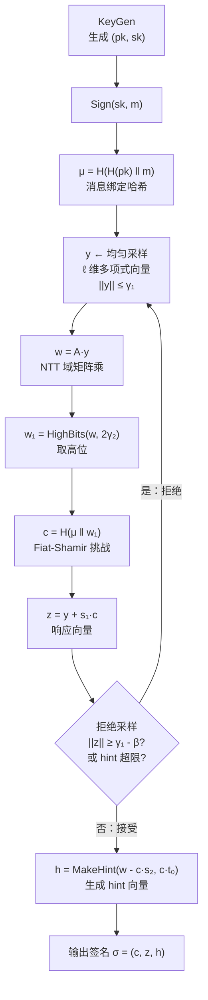
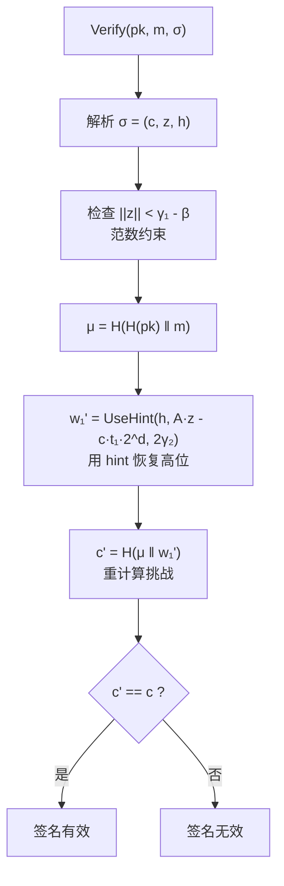
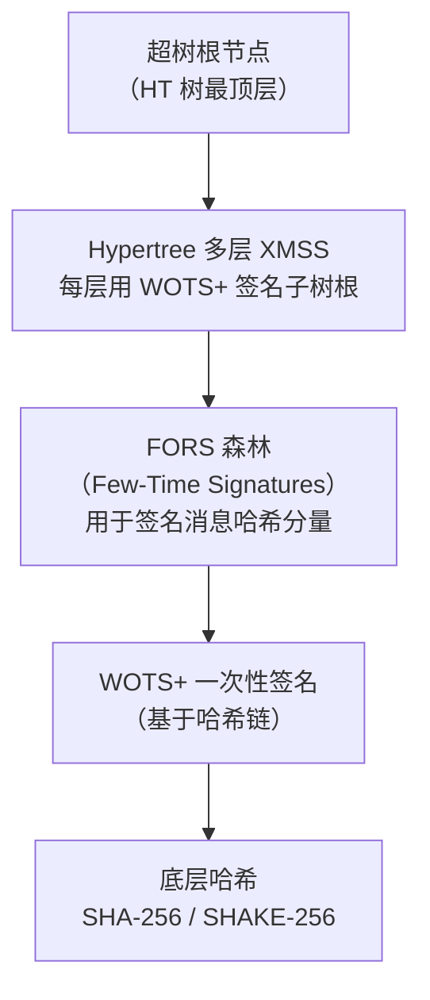

# 密码学（52）· Dilithium-ML-DSA

> [!abstract] TL;DR
> - **ML-DSA**（FIPS 204，源自 CRYSTALS-Dilithium）是 NIST 后量子签名标准，安全基础为 **Module-LWE + Module-SIS**，抵抗量子计算机上的 Shor 算法。
> - **三档参数**：ML-DSA-44（安全级 2，公钥 1312 B，签名 2420 B）、ML-DSA-65（安全级 3，公钥 1952 B，签名 3293 B）、ML-DSA-87（安全级 5，公钥 2592 B，签名 4595 B）——签名体积比 ECDSA（64 B）大 40–70 倍。
> - **核心范式**：Fiat-Shamir with Aborts——签名时带拒绝采样，确保签名分布与私钥无关，彻底规避 ECDSA nonce 泄露私钥的风险根源。
> - **验证高效**：NTT（数论变换）加速多项式乘法，验证比签名更快，适合验证密集型场景。
> - **哈希基签名替代**：SLH-DSA（FIPS 205，SPHINCS+）仅依赖哈希安全，保守方案；签名更大（8–50 KB），但假设最简单。
> - **过渡策略**：混合签名（ML-DSA + ECDSA 同时存在），为量子机成熟前的兼容期提供双重保障。

本篇是「密码学」系列后量子分支的签名核心篇，承接 [[50.格密码基础]] 的 LWE/SIS 数学框架与 [[51.Kyber-ML-KEM]] 的模格结构，详解 ML-DSA 的签名设计哲学、内部构造与工程部署。与 [[27.ECDSA签名]] 对比量子前/后签名体制的本质差异；后量子背景与 NIST 选型全景见 [[49.后量子密码概览]]。

---

## 概述与定位

### 签名面临的量子威胁

ECDSA（[[27.ECDSA签名]]）和 EdDSA（[[28.EdDSA与Ed25519]]）的安全性建立在**椭圆曲线离散对数问题（ECDLP）**的困难性上——经典计算机需指数时间，但 Shor 算法在量子计算机上可在多项式时间内求解 ECDLP。RSA 签名同样如此，面临因式分解攻击。一旦量子计算机规模化，现有签名体系全面崩溃：

- 数字证书（TLS、代码签名）被伪造
- 区块链交易签名被破解
- 固件签名失效

[[49.后量子密码概览]] 中 NIST PQC 标准化进程于 2022–2024 年完成，最终定型三类：

| FIPS 标准 | 算法 | 用途 |
|---|---|---|
| FIPS 203 | ML-KEM（Kyber） | 密钥封装（见 [[51.Kyber-ML-KEM]]） |
| **FIPS 204** | **ML-DSA（Dilithium）** | **数字签名** |
| FIPS 205 | SLH-DSA（SPHINCS+） | 数字签名（哈希基，保守） |

本篇聚焦 FIPS 204 ML-DSA，兼介绍 FIPS 205 SLH-DSA。

### 安全假设：Module-LWE 与 Module-SIS

ML-DSA 的安全性建立在两个格问题上（详细数学见 [[50.格密码基础]]）：

**Module-LWE（Module Learning With Errors）**：在模格上构造公钥，保证公钥不泄露私钥信息。

```
已知 A（均匀随机矩阵） 和 t = A·s1 + s2（mod q）
其中 s1, s2 是小系数"噪声"向量（私钥）
从 (A, t) 中恢复 s1, s2 计算上不可行
```

**Module-SIS（Module Short Integer Solution）**：保证伪造签名的困难性——攻击者无法找到满足验证方程的短向量。

```
已知 A，找到短向量 z 满足 A·z ≡ 0 (mod q)
困难性等价于近似 SVP（最短向量问题），见 [[50.格密码基础]]
```

两者结合：ML-LWE 保证私钥安全，Module-SIS 保证签名不可伪造。经典计算机与量子计算机在已知最优算法（BKZ）下的求解时间均为指数级，Shor 算法对格问题无效。

---

## 原理与机制

### Fiat-Shamir with Aborts 范式

ML-DSA 的核心签名构造来自 **Fiat-Shamir 变换** 的格密码变体，加入关键的"**拒绝采样（Rejection Sampling）**"机制。

**回顾 ECDSA 的 nonce 问题**（[[27.ECDSA签名]]）：ECDSA 中签名 `s = k⁻¹(z + r·d) mod n`，若 nonce k 泄露或重用，私钥 d 立即可解。根本原因是签名与私钥之间存在**代数关联**，私钥信息"渗漏"进签名。

**ML-DSA 的解法**：用拒绝采样让签名分布独立于私钥：

```
1. 采样随机向量 y（类比 ECDSA 的 nonce k，但是向量）
2. 计算 w = A·y（高位），
3. c = H(μ, w) —— 挑战哈希（c 是低汉明重的多项式向量）
4. z = y + s1·c
5. 检查 z 的范数：若 ||z|| 过大 → 丢弃本次 z，重新采样 y
6. 检查提示 hint 的合法性
7. 输出签名 (z, h, c)
```

**拒绝采样的直觉**：只有当 `z = y + s1·c` 的分布"看起来像纯随机 y 的分布"时才接受，否则 z 的统计特性会暴露 `s1`。条件被满足时，签名中的 z 与私钥 s1 的关联在统计上消失——即使攻击者拿到许多签名，也无法通过分析 z 的分布恢复 s1。

> [!important] 与 ECDSA 的本质区别
> ECDSA：nonce k 重用 → 线性方程组解出私钥，属于确定性代数漏洞；
> ML-DSA：拒绝采样确保签名向量分布独立于私钥，即使"nonce"（y）重用或泄露，也不直接暴露私钥（当然实现上 y 应来自 DRBG，不应重用）。
> 这是范式层面的安全提升，而非"修补 nonce 问题"。

### 公钥与私钥结构

**密钥生成**（KeyGen）：

```
ρ, ρ'  ←  H(seed)           // 扩展种子，ρ 生成 A，ρ' 生成私钥噪声
A      ←  ExpandA(ρ)         // k×ℓ 矩阵（多项式环 R_q 上），公开
s1     ←  SampleInBall(ρ')   // ℓ 维短向量，私钥部分一
s2     ←  SampleInBall(ρ')   // k 维短向量，私钥部分二
t      =  A·s1 + s2          // 公钥核心
t1, t0 =  Power2Round(t, d)  // 高低位分解：t1 公开，t0 私藏
公钥 pk  =  (ρ, t1)
私钥 sk  =  (ρ, K, tr, s1, s2, t0)
```

**高低位分解（Power2Round）**是 ML-DSA 的独特设计，把向量 t 分解为：

```
t  =  t1 · 2^d  +  t0
其中 |t0| ≤ 2^(d-1)
```

公钥只含 `t1`（粗粒度高位），`t0` 留在私钥里用于验证内部检查——这样公钥更小，同时在验证时通过 hint 向量补充信息。

### Hint 向量与高低位分解

签名中的 **hint 向量 h** 是 ML-DSA 区别于简单格签名的精巧设计：

```
验证方程：w = A·z - c·t
由于公钥只含 t1（没有 t0），验证方需要"猜"出舍弃 t0 后的误差
hint h 告诉验证方：哪些系数的进位关系，让 t1 也能凑出正确的 w 高位
```

**HighBits / LowBits** 分解（UseHint 操作）：

```
HighBits(r, α)：r 的高位，步长为 α
LowBits(r, α) ：r 的低位
MakeHint(z, r, α)：生成修正 hint，使 HighBits(r+z, α) = HighBits(r, α) + hint·α
UseHint(h, r, α)：用 hint 恢复正确的高位值
```

这套机制让验证时只需公钥 t1 + hint h 就能重建验证所需的 `w` 高位，而不需要 t0。

### NTT 加速多项式乘法

与 [[51.Kyber-ML-KEM]] 共享相同的数论基础：模 q 的多项式环 `R_q = Z_q[X]/(X^n + 1)` 上的乘法通过 **NTT（Number Theoretic Transform）** 加速：

```
参数：n = 256，q = 8380417（≈ 2^23，满足 NTT 友好条件：q ≡ 1 mod 2n）
多项式乘法时间：O(n log n)，而非朴素 O(n²)
矩阵-向量乘 A·y：k·ℓ 次多项式乘法，均在 NTT 域完成
```

---

## 算法流程与参数详解

### ML-DSA 参数集

FIPS 204 定义三档参数，对应 NIST 后量子安全级别 2、3、5：

| 参数集 | 安全级 | 对应经典安全 | 矩阵 k×ℓ | 公钥大小 | 签名大小 |
|---|---|---|---|---|---|
| ML-DSA-44 | Level 2 | ≈ AES-128 | 4×4 | 1312 字节 | 2420 字节 |
| ML-DSA-65 | Level 3 | ≈ AES-192 | 6×5 | 1952 字节 | 3293 字节 |
| ML-DSA-87 | Level 5 | ≈ AES-256 | 8×7 | 2592 字节 | 4595 字节 |

对比经典签名方案：

| 方案 | 量子安全 | 公钥大小 | 签名大小 | 安全基础 |
|---|---|---|---|---|
| ECDSA P-256 | 否 | 64 B | 64 B | ECDLP |
| Ed25519 | 否 | 32 B | 64 B | Edwards ECDLP |
| RSA-2048 | 否 | 256 B | 256 B | 整数分解 |
| **ML-DSA-44** | **是** | **1312 B** | **2420 B** | Module-LWE/SIS |
| **ML-DSA-65** | **是** | **1952 B** | **3293 B** | Module-LWE/SIS |
| **ML-DSA-87** | **是** | **2592 B** | **4595 B** | Module-LWE/SIS |

> [!warning] 签名体积影响
> ML-DSA 签名体积是 ECDSA 的 40–70 倍。在 TLS 握手、JWT、区块链交易等场景中，这会增加带宽和存储压力，需要提前评估协议兼容性。

### 完整签名流程





### 签名核心伪代码

```
Sign(sk, m):
  (ρ, K, tr, s1, s2, t0) ← decode(sk)
  A ← ExpandA(ρ)
  μ ← H(tr ‖ m, 512)           // tr = H(pk)，消息上下文绑定
  κ ← 0
  loop:
    y ← ExpandMask(K, μ, κ)    // 确定性采样 y，κ 是计数器（类 EdDSA 风格）
    w ← A·y                     // NTT 域
    w1 ← HighBits(w, 2γ2)
    c~ ← H(μ ‖ w1, 256)
    c ← SampleInBall(c~)        // 挑战多项式，汉明重 τ
    z ← y + s1·c
    r0 ← LowBits(w - s2·c, 2γ2)
    if ||z||∞ ≥ γ1 - β  or  ||r0||∞ ≥ γ2 - β:
      κ ← κ + ℓ
      continue                   // 拒绝采样，重试
    h ← MakeHint(-(c·s2), w - c·s2 + c·t0, 2γ2)
    if ||c·t0||∞ ≥ γ2  or  #{1 in h} > ω:
      κ ← κ + ℓ
      continue
    return (c~, z, h)

Verify(pk, m, σ):
  (ρ, t1) ← decode(pk)
  (c~, z, h) ← decode(σ)
  A ← ExpandA(ρ)
  μ ← H(H(pk) ‖ m, 512)
  c ← SampleInBall(c~)
  w1' ← UseHint(h, A·z - c·t1·2^d, 2γ2)
  return  c~ == H(μ ‖ w1', 256)  and  ||z||∞ < γ1 - β  and  #{1 in h} ≤ ω
```

> [!note] 确定性签名
> ML-DSA 的 `ExpandMask(K, μ, κ)` 用私钥 K 和消息 μ 确定性派生 y（FIPS 204 支持确定性模式和随机化模式）。确定性模式类似 Ed25519 的做法，彻底消除外部随机数依赖，避免随机数质量问题。

---

## 内部结构详解

### 多项式环与参数选择

ML-DSA 工作在：

```
R = Z[X] / (X^256 + 1)
R_q = Z_q[X] / (X^256 + 1)，q = 8380417
```

关键参数含义：

| 参数 | ML-DSA-44 | ML-DSA-65 | ML-DSA-87 | 含义 |
|---|---|---|---|---|
| q | 8380417 | 8380417 | 8380417 | 模数（NTT 友好素数） |
| n | 256 | 256 | 256 | 多项式次数 |
| d | 13 | 13 | 13 | t 高低位分解的位数 |
| τ | 39 | 49 | 60 | 挑战多项式 c 的汉明重 |
| γ₁ | 2^17 | 2^19 | 2^19 | y 的范数上界 |
| γ₂ | (q-1)/88 | (q-1)/32 | (q-1)/32 | 高位步长 |
| β | τ·η | τ·η | τ·η | 范数拒绝阈值 |
| ω | 80 | 55 | 75 | hint 最大权重 |

### 拒绝采样的安全与效率权衡

拒绝采样的平均重试次数约 3–7 次（依参数不同），每次重试需重新做一次矩阵-向量乘（代价最高的操作）。参数设计要在两个目标间权衡：

- **安全**：拒绝概率太低 → 签名的 z 分布可能泄露私钥 s1 信息
- **效率**：拒绝概率太高 → 签名速度慢（重试次数多）

FIPS 204 的参数使平均签名耗时约 0.1–1 ms（普通服务器），验证更快（无拒绝采样环节）。

---

## 与 ECDSA/EdDSA 对比

### 安全模型对比

| 维度 | ECDSA（[[27.ECDSA签名]]） | EdDSA/Ed25519 | ML-DSA |
|---|---|---|---|
| 安全基础 | ECDLP | Edwards ECDLP | Module-LWE + SIS |
| 量子安全 | 否（Shor 可破） | 否（Shor 可破） | 是 |
| nonce/随机数 | 关键（泄露即私钥暴露） | 确定性，无 nonce 风险 | 拒绝采样保护，确定性模式可选 |
| 签名大小 | 64 B | 64 B | 2420–4595 B |
| 公钥大小 | 64 B | 32 B | 1312–2592 B |
| 签名速度 | 快 | 很快 | 中等（含拒绝采样重试） |
| 验证速度 | 快 | 快 | 快（NTT 加速，无重试） |
| 实现难度 | 中（nonce 管理是陷阱） | 低（确定性） | 中（复杂内部结构，但用库即可） |

### nonce 问题的根本解决

ECDSA 的 nonce 问题（[[27.ECDSA签名]] §安全性与正确使用）本质是：签名算法的数学结构使私钥与 nonce **代数关联**，nonce 任何泄露（重用、偏置、计时侧信道）都能被利用。

ML-DSA 的 Fiat-Shamir with Aborts 从设计层面解决了这一问题：

```
ECDSA：s = k⁻¹(z + r·d) mod n
   ↳ d = (s·k - z) · r⁻¹ mod n  ← k 泄露立即解出 d

ML-DSA：z = y + s1·c
   ↳ 即使知道 y 和 c，s1 = (z - y)·c⁻¹ 在多项式环上本身容易解
      但拒绝采样确保：只有当 z 的统计分布"遮蔽"s1 时才输出签名
      ↳ 多个签名也无法积累足够信息恢复 s1（Module-SIS 的困难性）
```

---

## SLH-DSA：哈希基签名的保守选择

### FIPS 205（SPHINCS+）简介

**SLH-DSA**（Stateless Hash-based Digital Signature Algorithm，源自 SPHINCS+）是 NIST 与 ML-DSA 并列的后量子签名标准，定位不同：

| 维度 | ML-DSA | SLH-DSA |
|---|---|---|
| 安全基础 | Module-LWE + SIS（格困难问题） | 仅依赖哈希函数单向性 |
| 假设保守性 | 中（格假设相对新） | 极高（哈希安全是密码学最基础假设，见 [[29.哈希函数原理]]） |
| 签名大小 | 2.4–4.6 KB | 8–50 KB |
| 签名速度 | 中等 | 较慢 |
| 验证速度 | 快 | 较慢 |
| 状态管理 | 无状态 | 无状态（SPHINCS+ 创新点） |
| 适用场景 | 通用签名替代 | 对格假设存疑时的保守选择 |

**SLH-DSA 的核心结构**（超树 + WOTS+）：



SPHINCS+ 的创新是"**无状态**"：传统哈希基签名（XMSS、LMS）需要追踪已用叶节点，重用会破坏安全性；SPHINCS+ 用随机选取 FORS 树来避免状态，代价是签名更大。

**SLH-DSA 参数集**（部分）：

| 参数集 | 哈希函数 | 安全级 | 签名大小 |
|---|---|---|---|
| SLH-DSA-SHA2-128s | SHA-256 | Level 1 | 7856 B |
| SLH-DSA-SHA2-256s | SHA-256 | Level 5 | 29792 B |
| SLH-DSA-SHAKE-128f | SHAKE-128 | Level 1 | 17088 B（快速变体） |

> [!tip] 何时选 SLH-DSA
> 若你对格密码的假设持保守态度（格研究历史比哈希短），或所在领域（如军事、高安全级别 PKI）要求假设最简单，SLH-DSA 是合适选择。代价是签名体积更大，需要带宽和存储余量。

---

## 安全性与正确使用

### 参数选择

**优先顺序**：

```
ML-DSA-44  →  通用场景（安全级 2，对标 AES-128 抗量子强度，签名 2420 B）
ML-DSA-65  →  需要更高安全裕量（安全级 3，对标 AES-192，签名 3293 B）
ML-DSA-87  →  长期高价值签名（安全级 5，对标 AES-256，签名 4595 B）
```

不要试图自行调整内部参数（γ₁、γ₂、τ 等），FIPS 204 参数是经过严格安全分析的整体，局部改动可能破坏拒绝采样的安全证明。

### 已知安全注意事项

**1. 确定性模式 vs 随机化模式**

FIPS 204 支持两种模式：
- **随机化签名**（hedged）：加入额外随机性 `rnd ← rand(32)`，抵抗侧信道。
- **确定性签名**：`rnd = 0^32`，完全确定性，便于测试但对侧信道更敏感。

推荐生产环境使用随机化模式（或 hedged 模式），类似 [[27.ECDSA签名]] 中 RFC 6979 的思路但更进一步。

**2. 侧信道攻击**

格密码实现同样面临侧信道风险：
- 拒绝采样的分支行为（重试次数）可能泄露私钥相关信息
- NTT 的乘法操作可能被功耗/时序分析

**缓解**：使用经过 side-channel 审计的库（如 liboqs、mbed TLS PQ 模块）；不要自行实现。

**3. 签名体积的协议影响**

ML-DSA 签名（2–4.6 KB）在以下场景需要特别设计：

| 场景 | 影响 | 应对 |
|---|---|---|
| TLS 握手（X.509 证书链） | 握手消息增大，RTT 延迟上升 | QUIC/HTTP3 的 0-RTT 可缓解；KEMTLS 减少握手签名次数 |
| JWT/JWS | token 膨胀，HTTP Header 增大 | 压缩编码；考虑 ML-DSA-44 |
| 区块链交易 | 每笔交易体积大幅增加 | 需要协议层升级，交易吞吐量下降 |
| 代码签名 | 签名文件更大 | 影响有限，应用场景可接受 |
| 嵌入式设备 | RAM/ROM 受限 | SLH-DSA-128s（RAM 更省），或等待硬件加速 |

### 混合签名过渡策略

量子计算机尚未实用化，但"存储现在、解密未来"（harvest now, decrypt later）的威胁已存在于签名存储场景。**混合签名**（Hybrid Signature）是过渡期最稳健的方案：

```
混合签名 = sign_ECDSA(m) ‖ sign_ML-DSA(m)
混合验证 = verify_ECDSA(sig1, m) AND verify_ML-DSA(sig2, m)
```

- **经典安全**由 ECDSA 保证（量子机出现前）
- **后量子安全**由 ML-DSA 保证（量子机出现后）
- 两者均通过才接受——避免其中一方被攻破时整体失效

IETF 已有多个混合签名草案（hybrid PQ signatures in TLS、X.509 复合证书）。实际部署时优先查阅 [[71.详解网络协议/15.TLS协议]] 对应的 PQ 扩展支持情况。

### 推荐实践

```
✓ 使用 FIPS 204 标准参数集（ML-DSA-44/65/87），不要裁剪参数
✓ 用经审计的库：liboqs、BoringSSL PQ 分支、OpenSSL 3.3+（含 ML-DSA）
✓ 过渡期使用混合签名（ML-DSA + ECDSA），覆盖经典和后量子威胁
✓ 提前评估协议的签名体积预算，必要时升级 MTU / 分片策略
✓ 对保守场景（格假设存疑），考虑 SLH-DSA（FIPS 205）
✓ 随机化签名模式（hedged），提升侧信道抵抗
✓ 密钥对应与 ML-KEM（[[51.Kyber-ML-KEM]]）配套，构成完整 PQ 方案
```

```
✗ 不要自行修改内部参数（γ₁、γ₂、τ、β）
✗ 不要假设"量子机还远，可以不管"——长效签名（证书、固件）现在就需要 PQ
✗ 不要在资源受限嵌入式设备上用未优化的纯软件实现
✗ 不要混淆 ML-DSA（签名）与 ML-KEM（密钥封装）的用途
```

---

## 小结

ML-DSA（FIPS 204，CRYSTALS-Dilithium）是当前最成熟的后量子数字签名标准：

1. **安全基础**：Module-LWE（公钥安全）+ Module-SIS（不可伪造性），基于格困难问题，Shor 算法无效（[[50.格密码基础]]）。

2. **核心范式**：Fiat-Shamir with Aborts——拒绝采样让签名分布与私钥统计独立，从设计层面消解了 ECDSA（[[27.ECDSA签名]]）的 nonce 泄露风险。

3. **参数与规模**：三档参数（ML-DSA-44/65/87），签名 2.4–4.6 KB，公钥 1.3–2.6 KB——比 ECDSA 大 40–70 倍，是工程部署的主要挑战。

4. **内部加速**：NTT 多项式乘法使矩阵-向量运算高效，验证速度接近经典方案。

5. **配套方案**：SLH-DSA（FIPS 205，SPHINCS+）提供仅依赖哈希安全的保守替代，签名更大但假设更简单（[[29.哈希函数原理]]）；ML-KEM（[[51.Kyber-ML-KEM]]）承担密钥封装，两者合力构成完整后量子密码体系。

6. **过渡路径**：混合签名（ML-DSA ‖ ECDSA）是当前最实用的部署策略，兼顾经典与后量子安全。

后量子密码学的攻击面不限于算法本身——实现层面的侧信道、协议层面的降级攻击、密钥管理等工程问题，见 [[53.密码学攻击概览]]。

---

## 相关阅读

- [[49.后量子密码概览]] — NIST PQC 标准化历程、量子威胁模型
- [[50.格密码基础]] — LWE/SIS/SVP 数学基础，ML-DSA 的理论根基
- [[51.Kyber-ML-KEM]] — FIPS 203，与 ML-DSA 配套的格基 KEM
- [[27.ECDSA签名]] — 经典签名方案，ML-DSA 的量子前对照
- [[28.EdDSA与Ed25519]] — 确定性签名，理解 nonce 问题的演进
- [[29.哈希函数原理]] — SLH-DSA 的安全假设基础
- [[53.密码学攻击概览]] — 后量子实现的攻击面

---

⬅️ 上一篇 [[51.Kyber-ML-KEM]] ｜ 🏠 [[00.密码学总览]] ｜ 下一篇 [[53.密码学攻击概览]] ➡️
