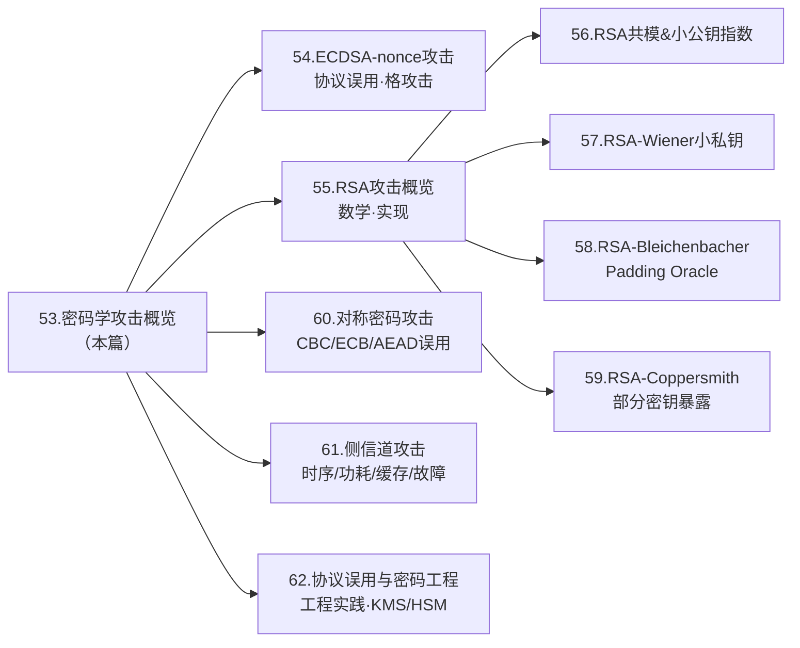

# 密码学（53）· 密码学攻击概览

> [!abstract] TL;DR
> - 现代密码算法本身（AES/RSA/ECDSA…）在正确参数下极难被数学攻破；**绝大多数现实破口来自实现缺陷与协议误用**。
> - 密码攻击可按四条轴分类：**①数学/密码分析**（针对算法）、**②实现/侧信道**（针对运行环境）、**③协议/误用**（针对错误组合方式）、**④密钥管理/人为**。
> - 攻击者永远假定**已知算法**（Kerckhoffs 原则），秘密只是密钥。
> - 防御核心一句话：**用已审计的标准库、标准参数、CSPRNG、AEAD，不自造密码，常量时间实现，严格密钥管理。**

---

## 概述与定位

密码学的每一章都在介绍"如何建造"——AES、RSA、ECDSA、HKDF……但任何工程系统中，"建造得再好，用错了也等于零"。本篇（第 53 篇）是攻击章（54–62）的**入口**，目标有三：

1. 提供**分类框架**，让后续每篇攻击都有归宿。
2. 复习**攻击模型**（COA/KPA/CPA/CCA），呼应 [[01.密码学全景与基本概念]] 中的基础定义。
3. 明确**核心洞见**：现代密码体系的软肋在"实现与误用"，而非"算法被数学攻破"。

本篇不深入任何单一攻击的数学细节（那留给各专篇），而是给出全局地图，帮助读者在阅读后续章节时快速定位"这个攻击属于哪类、防御思路是什么"。

---

## 原理与机制

### 攻击者的基本假设：Kerckhoffs 原则

19 世纪密码学家奥古斯特·柯克霍夫（Auguste Kerckhoffs）提出了至今仍是现代密码学基础的原则：

> **一个密码系统应当在除密钥以外的一切都被公开的情况下仍然是安全的。**

等价表述：安全性依赖密钥，不依赖算法保密。这有两层含义：

| 含义 | 推论 |
|---|---|
| 攻击者知道算法（AES、RSA、ECDSA…） | 算法必须能经受公开审查而不被破解 |
| 唯一需要保密的是密钥 | 密钥管理的质量决定了整体安全上限 |

"安全靠隐匿"（Security through Obscurity）是反模式——历史上所有依赖算法保密的系统（如早期 WEP、DVD CSS 加密）最终都因算法泄露或逆向而崩溃。

### 攻击模型回顾（COA/KPA/CPA/CCA）

攻击模型描述攻击者拥有什么资源、能做什么查询。理解它是分析任何攻击的前提（详见 [[01.密码学全景与基本概念]]）：

| 模型 | 全称 | 攻击者拥有 | 典型场景 |
|---|---|---|---|
| COA | Ciphertext-Only Attack | 只有密文 | 截获的加密通信、硬盘密文 |
| KPA | Known-Plaintext Attack | 明文-密文对（已知） | 已知文件格式头、协议固定字段 |
| CPA | Chosen-Plaintext Attack | 可让加密机加密任意明文 | 密文预言机、ECB 企鹅图攻击前提 |
| CCA | Chosen-Ciphertext Attack | 可选择密文并获得解密结果 | Padding Oracle、Bleichenbacher 攻击前提 |

**CCA 安全**是现代 AEAD 方案（GCM、ChaCha20-Poly1305）追求的最高目标。未达 CCA 安全的方案（如 CBC 无认证）在实际部署中极易被 Padding Oracle 利用。

### 密码攻击分类树

```mermaid
graph TD
  ROOT["密码攻击"] --> MATH["① 数学/密码分析攻击<br/>针对算法本身"]
  ROOT --> IMPL["② 实现/侧信道攻击<br/>针对运行环境"]
  ROOT --> PROTO["③ 协议/误用攻击<br/>最常见现实破口"]
  ROOT --> KEY["④ 密钥管理/人为攻击"]

  MATH --> M1["因式分解<br/>（RSA 大数分解）"]
  MATH --> M2["离散对数 DLP<br/>（DH/DSA/ECDSA）"]
  MATH --> M3["差分密码分析<br/>（针对分组密码）"]
  MATH --> M4["线性密码分析<br/>（已知明文统计）"]
  MATH --> M5["碰撞/原像攻击<br/>（MD5/SHA-1 已破）"]
  MATH --> M6["量子攻击<br/>（Shor→RSA/ECC<br/>Grover→对称密钥）"]

  IMPL --> I1["时序攻击<br/>（执行时间泄露密钥位）"]
  IMPL --> I2["功耗分析 SPA/DPA<br/>（硬件功耗曲线）"]
  IMPL --> I3["缓存侧信道<br/>（Flush+Reload/Prime+Probe）"]
  IMPL --> I4["电磁辐射 EM<br/>（设备电磁泄露）"]
  IMPL --> I5["故障注入<br/>（电压/激光/时钟毛刺）"]

  PROTO --> P1["nonce 重用<br/>（ECDSA 私钥泄露）"]
  PROTO --> P2["弱随机数<br/>（CSPRNG 缺失）"]
  PROTO --> P3["Padding Oracle<br/>（CBC 解密时序）"]
  PROTO --> P4["降级攻击<br/>（POODLE/DROWN）"]
  PROTO --> P5["密钥/算法复用<br/>（不同场景共用同一密钥）"]
  PROTO --> P6["证书校验缺失<br/>（跳过 TLS 证书链）"]
  PROTO --> P7["长度扩展<br/>（MD-结构 MAC 伪造）"]

  KEY --> K1["密钥硬编码<br/>（代码中写死密钥）"]
  KEY --> K2["密钥分发不安全<br/>（明文传输/弱存储）"]
  KEY --> K3["密钥不轮换<br/>（长期暴露风险）"]
  KEY --> K4["社会工程学<br/>（钓鱼/内部人员）"]
```



---

## 攻击类别详解

### ① 数学/密码分析攻击

这一类攻击直接针对算法的数学结构，试图在不知道密钥的情况下从密文推导出明文或密钥。

**大整数因式分解**：RSA 的安全性依赖"将 `n = p × q` 分解回 `p` 和 `q` 在计算上不可行"。当前最优算法（数域筛法 NFS）对 2048 位 RSA 的现实时间成本仍不可接受，但 512 位 RSA 已可在数天内分解。量子计算机的 Shor 算法可在多项式时间内分解——这是后量子密码（[[49.后量子密码概览]]）被推动的根本原因。详细攻击面见 [[55.RSA攻击概览]]。

**离散对数问题（DLP）**：DH、DSA、ECDSA 的安全基础。在椭圆曲线上称 ECDLP，已知点 `Q = k·G`，反求标量 `k` 在当前算法下不可行。Shor 算法同样可破。

**差分密码分析**（Differential Cryptanalysis）：通过分析两条明文差值与相应密文差值之间的统计规律来恢复密钥，由 Biham 和 Shamir 于 1990 年发表。现代分组密码（AES、Camellia）在设计阶段已显式抗差分分析。

**线性密码分析**（Linear Cryptanalysis）：利用明文位、密文位与密钥位之间的线性近似关系，通过大量已知明文-密文对进行统计攻击。由 Matsui 于 1993 年提出，同样被现代密码的 S 盒设计所对抗。

**碰撞攻击**：找到两个不同消息 `M1 ≠ M2` 使得 `Hash(M1) = Hash(M2)`。MD5 在 2004 年被完全攻破（Wang 等），SHA-1 的 SHAttered 碰撞于 2017 年公开演示。这直接影响数字签名——签名哈希碰撞意味着伪造。详见 [[30.MD5]] 与 [[31.SHA-1]]。

**量子威胁层面**：Shor 算法多项式时间破解 RSA/ECC/DH；Grover 算法对对称密钥暴力搜索加速至 `O(√N)`，使有效安全位数减半（AES-128 → 64 位安全，AES-256 → 128 位安全）。后量子方案（ML-KEM/ML-DSA）正是针对这两点的系统替换。

> [!note] 核心洞见 1
> **现代算法（AES-256/RSA-2048/P-256/SHA-256 等）在参数正确时，数学攻破在当前经典计算下不现实。** 密码分析类攻击成功的案例，几乎都是针对弱参数（512 位 RSA、40 位 DES）或已破算法（MD5、SHA-1、RC4）。

---

### ② 实现/侧信道攻击

侧信道攻击不攻击算法数学，而是利用算法**物理实现**在执行过程中泄露的辅助信息——时间、功耗、电磁辐射、声音，甚至故障行为。本类攻击是嵌入式设备、智能卡、HSM 的主要威胁，详细内容指向 [[61.侧信道攻击]]。

**时序攻击（Timing Attack）**：如果密码操作的执行时间依赖密钥或数据（例如 RSA 中 `if bit_i == 1: multiply` 导致时间不同），通过高精度计时可统计推断密钥位。著名案例：Brumley-Boneh 2003 年通过网络时序恢复 RSA 私钥。防御：恒定时间（constant-time）实现。

**功耗分析 SPA/DPA**：
- 简单功耗分析（SPA）：单次功耗曲线直接读出密钥操作轨迹。
- 差分功耗分析（DPA）：对多条曲线做统计，分离出与密钥相关的信号。Kocher 等 1999 年提出，至今是智能卡攻击的经典手段。

**缓存侧信道**：CPU 缓存命中/缺失时间差异可泄露内存访问模式，进而泄露密钥。Flush+Reload、Prime+Probe 是两种代表性技术路线。AES 的 T-table 实现（基于查表的快速实现）尤其脆弱；AES-NI 硬件指令可消除这一风险。

**电磁分析（EM）**：测量芯片辐射的电磁场，原理类似功耗分析但无需物理接触——在某些场景（如非接触式智能卡）甚至可远程实施。

**故障注入（Fault Injection）**：主动干扰设备运行（电压毛刺、激光脉冲、时钟干扰），令密码算法在异常状态下产生输出，再利用正常/错误输出对反推密钥。针对 RSA CRT 实现的 Bellcore 攻击（1997 年）是经典案例：RSA-CRT 一次故障注入即可泄露其中一个素因子。

> [!note] 核心洞见 2
> **侧信道攻击绕过了数学安全，直击物理实现。** AES 数学不可破，但 AES 的一个非恒定时间实现可能在几千次查询后被时序统计攻破。

---

### ③ 协议/误用攻击

这是**现实中最常见的破口**。算法本身完好，但被错误地组合、参数化或使用，导致安全性崩溃。

**nonce 重用**：ECDSA、GCM 等依赖 nonce（一次性数）的方案，若两次签名/加密使用相同 nonce，私钥或密钥流立即可恢复。
- ECDSA：两次使用同一 `k`，则 `k = (s1 - s2)^{-1} × (z1 - z2) mod n`，私钥随即暴露。索尼 PlayStation 3 2010 年事件即此因。
- GCM：nonce 重用下，keystream 相同，异或两条密文即得明文差，且认证 tag 可伪造。
详细分析见 [[54.ECDSA-nonce攻击]]。

**弱随机数**：CSPRNG 缺失或初始化熵不足，导致生成的 nonce/密钥可被预测。2012 年 Debian OpenSSL 漏洞（2006-2008）因 PID 仅作为熵源，使所有生成密钥空间缩减为约 32767 个，RSA 密钥可在数秒内暴力恢复。

**Padding Oracle 攻击**：CBC 模式在解密后通常需要去除 PKCS#7 填充，若系统对"填充是否正确"给出可区分响应（不同错误码或不同时延），攻击者可逐字节恢复明文，无需密钥。2002 年 Vaudenay 提出，后在 POODLE、BEAST 等攻击中反复出现。详见 [[60.对称密码攻击]]。

**降级攻击**：通过干扰协议握手，迫使双方协商使用较弱的算法版本或密钥长度。POODLE（强制降级至 SSL 3.0 + CBC）、DROWN（利用 SSLv2 弱密码暴露 TLS 密钥）、LOGJAM（512 位 DH 导出级）是典型案例。

**密钥/算法复用**：
- 签名密钥用于加密（用途混淆，不同安全假设下可能相互削弱）。
- 相同密钥在不同协议版本/上下文中重用，导致跨协议攻击。
- ECB 模式下重复明文块产生重复密文块，泄露数据结构（企鹅图）。

**证书校验缺失**：TLS 客户端跳过服务端证书链校验（`verify_peer = false`、自签名随意信任），退化为不认证的加密通道，MITM 可完全透明解密。

**长度扩展攻击**：Merkle-Damgård 结构的哈希（MD5/SHA-1/SHA-256）存在长度扩展性质：已知 `HMAC = Hash(secret || message)`，无需知道 `secret` 即可构造 `Hash(secret || message || padding || extension)` 的合法 MAC。防御：用 HMAC（双层嵌套）而非裸 Hash 做 MAC，或使用 SHA-3/BLAKE3（无此性质）。

> [!note] 核心洞见 3
> **协议/误用攻击是现实中最高频的密码破口**，因为它们不依赖突破数学难题，只需找到实现者或协议设计者的一个决策错误。开发者"自己实现 CBC + HMAC 组合"远比"AES 数学被破解"更危险。

---

### ④ 密钥管理/人为攻击

即使密码算法完美、实现正确，密钥管理的失误也可以让一切努力归零。

| 攻击形式 | 描述 | 案例/后果 |
|---|---|---|
| 密钥硬编码 | 密钥写死在代码或配置文件中 | GitHub 上泄露的 AWS 密钥、固件硬编码 SSH 私钥 |
| 密钥明文存储/传输 | 密钥未加保护存于文件系统或通过不安全信道传输 | 数据库明文存储 API key |
| 密钥不轮换 | 同一密钥长期使用，泄露后影响范围无限大 | 历史数据全部可解密 |
| 密钥备份不当 | 备份介质未加密或访问权限过宽 | 备份磁带泄露等同泄露所有加密数据 |
| 社会工程学 | 钓鱼、内部人员、供应链攻击 | RSA SecurID 2011 年事件（矛式钓鱼获取种子） |

密钥管理的工程实践（KMS、HSM、密钥派生分离、轮换策略）将在 [[62.协议误用与密码工程]] 详细展开。

---

## 本攻击章路线导览



各篇对应关系：

| 篇 | 主攻击类别 | 重点算法/场景 |
|---|---|---|
| [[54.ECDSA-nonce攻击]] | 协议/误用 | nonce 重用 → 私钥泄露；偏置 nonce → 格攻击 |
| [[55.RSA攻击概览]] | 数学 + 实现 | 因式分解、参数选取失误 |
| 56–59（RSA 专项） | 数学 | 共模、小指数、Wiener、Bleichenbacher、Coppersmith |
| [[60.对称密码攻击]] | 协议/误用 | Padding Oracle、IV 重用、ECB、长度扩展 |
| [[61.侧信道攻击]] | 实现 | 时序、DPA、缓存、故障注入 |
| [[62.协议误用与密码工程]] | 密钥管理 + 协议 | 弱随机、降级、KMS/HSM、库选型 |

---

## 安全性与正确使用

### 通用防御原则

密码攻击分类树指向四类威胁，防御也沿同样四轴展开：

**对抗数学/密码分析攻击**

- 使用经过充分公开审查、参数在安全范围内的标准算法（AES-256/GCM、RSA-2048+、P-256/X25519、SHA-256+）。
- 废弃已破算法：不使用 MD5（签名）、SHA-1（签名/TLS）、RC4、DES、3DES-2key、512/768 位 RSA/DH。
- 规划后量子迁移（TLS 1.3 + ML-KEM 混合，[[51.Kyber-ML-KEM]]、[[52.Dilithium-ML-DSA]]）。

**对抗实现/侧信道攻击**

- 使用平台/语言提供的**常量时间**比较函数（`CRYPTO_memcmp`、`hmac.compare_digest`），不用 `==` 或 `memcmp` 比较 MAC/密码。
- 优先使用 AES-NI 硬件加速（消除 T-table 缓存侧信道）。
- 嵌入式/智能卡场景：引入功耗随机化掩码（masking）、故障检测（结果双重计算对比）。
- 不在生产代码中使用"自实现"的密码原语——几乎没有开发者有能力写出无侧信道的 AES 实现。

**对抗协议/误用攻击**

- **永远不自造密码协议**：使用 TLS 1.3、Signal Protocol、Noise Protocol Framework 等已审计方案。
- **用 AEAD**（AES-GCM/ChaCha20-Poly1305），放弃裸 CBC/CFB + 手工 MAC。AEAD 提供加密与认证一体，且抗 CCA。
- **nonce 严格管理**：ECDSA 使用确定性 nonce（RFC 6979）；GCM nonce 使用计数器而非随机（96 位随机 nonce 在 `2^{32}` 次加密后有碰撞概率）。
- **CSPRNG**：所有密钥、IV、nonce 均来自操作系统 CSPRNG（`/dev/urandom`、`CryptGenRandom`、`SecRandomCopyBytes`），不使用 `rand()`/`Math.random()`/`time()` 播种的 PRNG。
- 验证 TLS 证书链，禁用 `verify_peer = false`，固定证书（Certificate Pinning）用于高安全场景。
- 禁止旧协议版本：强制 TLS 1.2+（推荐 TLS 1.3），禁用 SSLv3/TLS 1.0/1.1、弱密码套件（RC4/3DES/NULL）。

**对抗密钥管理/人为攻击**

- 密钥与代码分离：通过 KMS（AWS KMS、Azure Key Vault、HashiCorp Vault）或 HSM 管理主密钥。
- 密钥分层：根密钥→数据加密密钥（DEK）→用途分离（签名密钥≠加密密钥）。
- 定期轮换：短生命周期密钥限制泄露影响半径。
- 最小权限原则：密钥访问日志审计，服务账号不拥有超过需要的密钥权限。

### 防御融入设计的思路

攻击知识最大的价值不是"学会如何攻击"，而是**让防御成为设计时的一等公民**：

```
设计阶段 → 选择合适的威胁模型（攻击者能做什么？COA/CCA？）
         → 选择满足该威胁模型的密码原语（AEAD 而非裸加密）
         → 确认 nonce/IV/密钥生成来自 CSPRNG

实现阶段 → 调用标准库（OpenSSL、libsodium、BouncyCastle），不自实现
         → 恒定时间比较 MAC/密码
         → 代码审查：是否有 nonce 复用风险？密钥是否会被 log？

部署阶段 → TLS 1.3，禁用弱套件
         → 密钥存入 KMS/HSM
         → 监控：异常加解密量、证书到期告警

运维阶段 → 密钥轮换计划
         → 漏洞跟踪（OpenSSL CVE 订阅）
         → 事件响应：密钥泄露后快速吊销与重签
```

---

## 小结

| 攻击类别 | 核心机制 | 现实频率 | 防御要点 |
|---|---|---|---|
| 数学/密码分析 | 攻破算法数学结构 | 极低（现代算法） | 用标准参数，废弃弱算法，规划后量子 |
| 实现/侧信道 | 利用物理泄露（时间/功耗/缓存） | 中（硬件/嵌入式场景） | 恒定时间实现，AES-NI，masking |
| 协议/误用 | 错误组合或参数化密码原语 | **高（最常见）** | AEAD、CSPRNG、nonce 管理、TLS 1.3、不自造 |
| 密钥管理/人为 | 密钥生命周期管理失误 | 高 | KMS/HSM、分层、轮换、最小权限 |

**密码学的真正护城河，不是算法有多强，而是整个系统有多少个地方被正确地使用了密码学。** 后续篇章（54–62）将把以上分类中的每个高频攻击拆开讲透，并给出对应防御的具体实现建议。

---

## 相关阅读

- [[01.密码学全景与基本概念]] — 攻击模型（COA/KPA/CPA/CCA）与 Kerckhoffs 原则基础
- [[54.ECDSA-nonce攻击]] — nonce 重用/偏置如何导致 ECDSA 私钥泄露（协议/误用类代表）
- [[60.对称密码攻击]] — Padding Oracle、IV 重用、ECB 弱点、长度扩展（对称密码误用全景）
- [[61.侧信道攻击]] — 时序/功耗/缓存/故障注入详解（实现类攻击全景）
- [[62.协议误用与密码工程]] — 弱随机数、降级攻击、KMS/HSM 工程实践
- [[49.后量子密码概览]] — Shor/Grover 量子威胁与 NIST 后量子标准化
- [[15.AEAD原理与GCM]] — 为何 AEAD 是协议/误用攻击的核心防线
- [[43.随机数与熵]] — CSPRNG 设计与弱随机数危害

---

⬅️ 上一篇 [[52.Dilithium-ML-DSA]] ｜ 🏠 [[00.密码学总览]] ｜ 下一篇 [[54.ECDSA-nonce攻击]] ➡️
