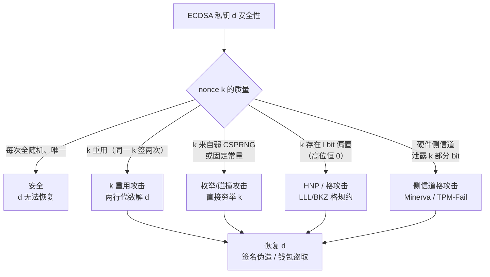
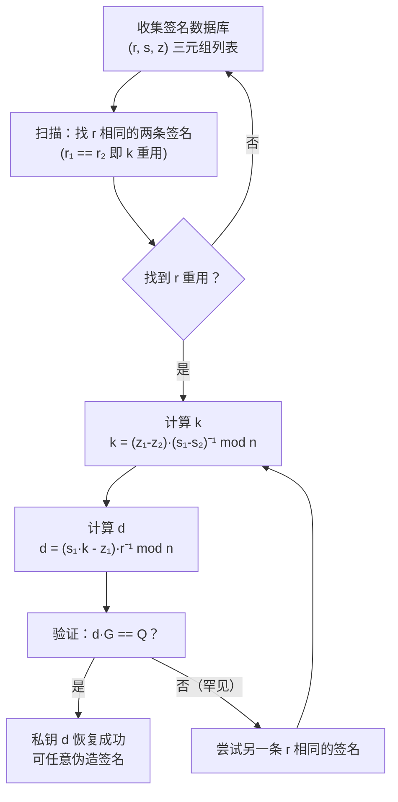

# 密码学（54）· ECDSA-nonce攻击

> [!abstract] TL;DR
> - **nonce k 是 ECDSA 的命门**：签名公式 `s = k⁻¹(z + r·d) mod n` 把私钥 d 与 k 绑定在一起——k 出任何问题，d 立刻可解。
> - **① k 重用**：同一 k 签两条消息 → `k = (z₁-z₂)·(s₁-s₂)⁻¹ mod n`，再 `d = (s₁·k - z₁)·r⁻¹ mod n`，两行代数即恢复私钥，零计算难度。
> - **② 弱随机/可预测 k**：CSPRNG 缺陷、固定常量、计数器均等价于"提供了一个约束" → 直接解出 d。
> - **③ 偏置 k（HNP/格攻击）**：k 的若干最高/最低位恒为 0 → 建立**隐藏数问题（HNP）**，用 **LLL/BKZ 格规约**（Nguyen-Shparlinski 2002）从 ~n/l 条签名恢复 d，偏置仅需 1 bit。
> - **④ 侧信道泄露 nonce**：时序/功耗分析（Minerva、TPM-Fail）从硬件泄露 k 的部分比特，构成格攻击输入。
> - **真实案例**：Sony PS3 固定 k（2010）、Android 比特币钱包弱随机（2013）、多起区块链私钥被盗。
> - **防御**：RFC 6979 确定性 nonce（首选）、换用 [[28.EdDSA与Ed25519]]（内置确定性）、高质量 CSPRNG、恒定时间实现。

本篇是「密码学」系列攻击篇的核心实例，紧接 [[53.密码学攻击概览]]，深入展开 [[27.ECDSA签名]] 中点到为止的 nonce 数学漏洞。读者应先掌握 [[27.ECDSA签名]] 的签名公式与验证流程；随机数安全基础见 [[43.随机数与熵]]；SM2 的同源风险见 [[47.SM2公钥密码]]；防御性替代方案见 [[28.EdDSA与Ed25519]]。

---

## 概述与定位

### 为何 nonce k 是 ECDSA 的命门

回顾 [[27.ECDSA签名]] 的签名公式：

```
给定私钥 d、消息哈希 z、一次性 nonce k：
  R = k·G           （椭圆曲线标量乘）
  r = R.x mod n
  s = k⁻¹·(z + r·d) mod n

签名 = (r, s)
```

从这个等式可以看出：**s 是 k 和 d 的线性组合（在模 n 意义下）**。验证方之所以无法从 (r, s) 推出 d，唯一依赖的是"不知道 k"——一旦 k 已知或可约束，d 的求解就是纯线性代数。

这种结构有两个工程后果：

1. **k 必须完全随机**：任何规律性（重用、偏置、可预测）都把"不知道 k"这一假设打破，安全性立刻崩塌。
2. **k 必须严格保密**：k 的直接泄露（侧信道）等价于"告知攻击者 k"，问题退化到上一条。

与 RSA-PSS 相比，RSA 签名中随机盐仅影响填充层，即使盐泄露也不直接危及私钥；而 ECDSA 中 k 与私钥 d 在代数意义上完全耦合，这是根本性的结构差异。

### 攻击分类

| 攻击类型 | 条件 | 难度 | 代表案例 |
|---|---|---|---|
| k 重用 | 两条签名 r 值相同（同一 k） | 零难度，纯代数 | Sony PS3、Android 比特币 |
| k 可预测 / 弱随机 | k 来自可猜测的生成器 | 取决于 CSPRNG 弱点 | Android `SecureRandom` 缺陷 |
| k 偏置（HNP） | k 的若干位恒为 0 | 格规约，需多条签名 | Minerva、TPM-Fail、理论攻击 |
| 侧信道泄露部分 k | 时序/功耗分析 | 需要物理访问或精密测量 | Minerva（ECDSA over NIST 曲线） |

---

## 原理与机制

### 签名公式的代数结构

在模 n 整数环 `Z/nZ` 上，ECDSA 签名公式是关于 k 和 d 的**双线性方程**：

```
s = k⁻¹ · (z + r·d)  (mod n)

变形为：
  k·s ≡ z + r·d      (mod n)
```

这个方程有两个未知数 k 和 d。在只有一条签名时，这是一个有无穷多解的不定方程——安全性成立。但一旦出现额外约束（第二条签名、部分 bit 信息、k 的范围偏置），方程组的约束数量增加，d 即可被恢复。

### Mermaid：nonce 安全性树



---

## 攻击一：k 重用——完整数学推导

### 场景

攻击者收集到两条签名：

```
消息 m₁，哈希 z₁，签名 (r, s₁)
消息 m₂，哈希 z₂，签名 (r, s₂)    ← 注意：r 相同，说明 R = k·G 相同，即 k 相同
```

> [!tip] 如何发现 k 重用
> 攻击者只需检查公开签名中的 `r` 分量。若两条签名 `r` 值相同，则必然使用了同一个 k（因为 `r = (k·G).x mod n`，同一 k 产生同一 R，同一 r）。这是完全被动的观察，无需任何主动探测。

### 步骤一：解出 k

由签名公式：

```
s₁ ≡ k⁻¹·(z₁ + r·d)  (mod n)
s₂ ≡ k⁻¹·(z₂ + r·d)  (mod n)

两式相减（消去 r·d 项）：
s₁ - s₂ ≡ k⁻¹·(z₁ - z₂)  (mod n)

两边同乘 k，再同乘 (s₁ - s₂)⁻¹：
k ≡ (z₁ - z₂) · (s₁ - s₂)⁻¹  (mod n)
```

至此，k 被完全解出——仅需两个公开的签名分量 s₁、s₂ 和两个消息哈希 z₁、z₂。

### 步骤二：解出私钥 d

拿到 k 后，代回任意一条签名的公式：

```
s₁ ≡ k⁻¹·(z₁ + r·d)  (mod n)

两边同乘 k：
k·s₁ ≡ z₁ + r·d  (mod n)

解出 d：
r·d ≡ k·s₁ - z₁  (mod n)
d ≡ (k·s₁ - z₁) · r⁻¹  (mod n)
```

### 完整攻击流程（伪代码）

```
# 输入：两条签名，r 值相同
given: (r, s1, z1), (r, s2, z2), 曲线阶 n

# 第一步：解 k
delta_s = (s1 - s2) mod n
delta_z = (z1 - z2) mod n
k = delta_z * mod_inv(delta_s, n) mod n

# 第二步：解私钥 d
d = (s1 * k - z1) mod n * mod_inv(r, n) mod n

# 验证（可选）：检查 d·G 是否等于已知公钥 Q
assert d * G == Q      # 若等则攻击成功
```

### 为何攻击零难度

整个推导只用到：
- 模 n 加减法（多项式时间）
- 模逆（扩展欧几里得，`O(log² n)` 时间）
- 没有任何密码学困难假设被使用

k 重用完全绕开了 ECDLP 的困难性，是一个**纯代数攻击**。

### Mermaid：k 重用私钥恢复流程



---

## 攻击二：k 可预测 / 弱随机

### 弱 CSPRNG

若系统的伪随机数生成器（PRNG）存在缺陷——如内部状态空间过小、种子可猜测、初始化不足——攻击者可以在远小于 2²⁵⁶ 的搜索空间内枚举可能的 k，对每个候选 k 计算 `R = k·G`，检验 `R.x mod n == r` 是否与已知签名匹配。一旦命中，即获取 k，进而解 d。

```
暴力枚举攻击（弱随机 k）：
  for k_candidate in possible_k_values:    # 搜索空间远小于 2^256
      R = k_candidate * G                  # 椭圆曲线标量乘
      if R.x mod n == r:                   # 命中目标签名的 r
          k = k_candidate
          d = (s * k - z) * mod_inv(r, n) mod n
          break
```

安全性的前提是"随机搜索空间为 2¹²⁸ 以上"（128-bit 安全目标），弱 PRNG 把这个前提打破。

更多 CSPRNG 原理与失效场景见 [[43.随机数与熵]]。

### 固定 k（常量 nonce）

最极端的情形：k 是编码进固件的常量，每次签名产生完全相同的 r，仅收集一条签名即可：

```
# 仅需一条签名（r, s, z）+ 公知的固定 k
d = (s * k - z) * mod_inv(r, n) mod n
```

这不是理论情形——Sony PS3 案例（见"真实案例"节）正是此场景。

### 计数器 / 时间戳作为 k

若 k 来自单调计数器或系统时间（毫秒级时间戳），攻击者结合签名时间戳即可大幅缩小搜索空间：

```
时间窗口内的候选 k 数量 = 时间精度（ms）× 每秒签名数
例如：时间精度 1ms，每秒 100 条签名 → 候选 k ≈ 100（可直接枚举）
```

---

## 攻击三：nonce 偏置与格攻击（HNP）

### 什么是 nonce 偏置

"偏置"（bias）是指 k 的生成并不在 `[1, n-1]` 上均匀分布，而是有**结构性约束**：最常见的形式是 k 的最高 l 位恒为 0（即 k < 2^(bitlen(n) - l)）。

例如，对 secp256k1（256-bit 曲线），若生成器只返回 248-bit 范围内的 k（高 8 位恒为 0），则每条签名携带了"k < 2^248"的信息——这看起来无害，但足以支撑格攻击。

### 隐藏数问题（HNP）

**HNP（Hidden Number Problem）** 由 Boneh 和 Venkatesan（1996）引入：

```
HNP 定义：
  已知整数 n 和 m 对 (t_i, u_i)（i = 1..m），
  满足 |u_i - α·t_i mod n| < n / 2^l，
  求隐藏数 α。
```

ECDSA 偏置场景正好符合这个框架。将签名公式 `s_i·k_i ≡ z_i + r_i·d (mod n)` 变形：

```
k_i = s_i⁻¹·z_i + s_i⁻¹·r_i·d  (mod n)
    = A_i + B_i · d               (mod n)

其中 A_i = s_i⁻¹·z_i mod n（已知），B_i = s_i⁻¹·r_i mod n（已知），d 未知。
```

若 k_i 的高 l 位恒为 0，则 `k_i < 2^(bitlen(n) - l)`，即：

```
|k_i - 0| < n / 2^l

代入 k_i = A_i + B_i·d (mod n)：
|A_i + B_i·d - 0| < n / 2^l   (mod n)

令 t_i = B_i，u_i = -A_i，则：
|u_i - (-d)·t_i mod n| < n / 2^l

这正是 HNP 的形式，隐藏数 α = -d mod n（即私钥取反）。
```

### 格构造与 LLL/BKZ

Nguyen 和 Shparlinski（2002）证明：给定 m 条偏置 l bit 的签名，可以将 HNP 规约为**最近向量问题（CVP）**，进而用 **LLL 算法**（或更强的 BKZ）在多项式时间内求解。

构造的格矩阵（m 条签名，m × m 维）：

```
格 L = 如下 (m+2) × (m+2) 矩阵（一种典型构造）：

     [  n   0   0  ...  0   0   0  ]
     [  0   n   0  ...  0   0   0  ]
     [      ...               ...  ]   ← m 个 n 对角项（处理模运算）
     [  0   0   0  ...  n   0   0  ]
     [ t₁  t₂  t₃ ... t_m  1/n  0  ]   ← t_i = s_i⁻¹·r_i mod n
     [ u₁  u₂  u₃ ... u_m   0  1/2^l] ← u_i = s_i⁻¹·z_i mod n

目标向量 w ≈ (k₁, k₂, ..., k_m, d/n, 1/2^l)
若 LLL 找到 w，即恢复 d。
```

**所需签名数量**（Nguyen-Shparlinski 2002）：

| 偏置位数 l | 所需签名数 m（近似） | 安全曲线 |
|---|---|---|
| 1 bit（最高位恒 0） | ~300 条 | secp256k1（256-bit） |
| 4 bit | ~70 条 | P-256 |
| 8 bit | ~40 条 | P-256 |
| 16 bit | ~20 条 | P-256 |
| 32 bit | ~10 条 | P-256 |

偏置越大，所需签名越少；实践中 4–8 bit 的偏置已有演示性攻击。

### 为何格攻击有效

直觉上：每条签名给出一个约束 `k_i ≈ A_i + B_i·d (mod n)`，若 k_i 在一个较小的范围内（因偏置），则 d 满足的是一组"模线性不等式"——这在高维格的语言里等价于寻找一个短向量。LLL/BKZ 在多项式时间内找到"足够短"的格向量，概率性地恢复 d。

> [!note] 关于 Nguyen-Shparlinski 的结论
> 原论文 "The Insecurity of the Elliptic Curve Digital Signature Algorithm with Partially Known Nonces"（2002）严格证明了：对 160-bit 曲线，若 l ≥ 1 且签名数 m ≥ O(log n / l)，则以不可忽略的概率恢复 d。后续工作（如 Benger、Heninger 等）将理论推向实践，构造了针对 secp256k1 的具体格攻击。

---

## 攻击四：侧信道泄露 nonce

### 原理

即使 k 由"安全"的随机源生成，**标量乘 `k·G` 的实现**也可能通过时序、功耗、电磁辐射泄露 k 的部分信息（即 k 的某些比特为 0 时，`double-and-add` 算法跳过加法步骤，产生可测量的时序差异）。

这些泄露的部分 bit 构成了 k 的偏置（本质与攻击三相同），因此可以拼装成格攻击的输入。

### Minerva 与 TPM-Fail

**Minerva（2019）**：研究团队（Jancar 等）对多种密码库（包括 Bouncy Castle、libgcrypt）的 ECDSA 实现进行时序分析，发现 k 的标量乘时间与 k 中最高有效非零位的位置强相关，从而泄露 k 的上界（即有效位数）。结合格攻击，在实验室条件下恢复了 P-256 私钥。

**TPM-Fail（2019）**：STMicroelectronics（ST33）和 Infineon 的 TPM 芯片在执行 ECDSA-P256 时，签名时间泄露了 nonce k 的最低有效位数量，提供约 5-bit 偏置信息。攻击团队（Moghimi 等）在 4 分钟内通过网络时序分析采集约 40,000 条签名，用格攻击成功恢复私钥。

**对使用者的含义**：即使实现中使用了 RFC 6979（确定性 nonce），若标量乘不是恒定时间（constant-time），攻击者仍可从时序中提取 k 的信息，构成格攻击。防御必须同时涵盖"生成健壮 nonce"和"恒定时间标量乘"。

侧信道防护的深入探讨将在系列后续篇（第 61 篇）展开。

---

## 真实案例（教育视角）

### Sony PlayStation 3（2010）

**背景**：PS3 固件使用 ECDSA（160-bit 曲线）对固件镜像签名，防止未授权代码运行。

**漏洞**：索尼的签名实现中，k 是一个**硬编码常量**——每次签名 k 值完全相同。

**攻击**（fail0verflow 团队，2010 年 Chaos Communication Congress）：
- 收集两份不同固件的签名 `(r, s₁, z₁)` 和 `(r, s₂, z₂)`（r 值相同，直接暴露 k 重用）。
- 一行公式解出 k，再解出私钥 d。
- 拥有私钥后，可为任意代码（包括自制系统软件）生成合法签名，彻底绕过固件验证。

**影响**：PS3 代码签名体系完全失效，索尼被迫通过固件更新换用新密钥——但本质漏洞（k 固定）必须重新设计签名实现才能根治。

### 2013 年 Android 比特币钱包（弱随机）

**背景**：Bitcoin 交易使用 ECDSA（secp256k1）签名，私钥泄露 = 钱包资金完全丢失。

**漏洞**：Android 2.x/4.x 中的 `java.security.SecureRandom` 在部分设备上，OpenSSL 的随机数池（`/dev/urandom` 种子）在某些条件下初始化不足，导致多个不同应用（不同用户、不同时间）生成了**相同的 nonce k**，从而签名 r 值碰撞。

**攻击**：
- 区块链是公开账本，所有签名均可公开下载。
- 攻击者扫描全部 UTXO（未花费交易输出）的签名集合，寻找 r 值相同的签名对。
- 一旦找到重复 r，即恢复 k，进而恢复私钥 d，转走对应地址的比特币。
- 实际损失：数百个 BTC 地址被盗，总计约数万美元（按当时价格）。

**后续**：Google 于 2013 年 8 月发布紧急安全更新修复 `SecureRandom` 实现；比特币社区建议受影响用户立即将资金转移到新地址（由安全实现生成的密钥）。

### 其他区块链案例

| 案例 | 时间 | 根因 | 结果 |
|---|---|---|---|
| Blockchain.info 随机数缺陷 | 2012 | 浏览器 `Math.random()` 用于 nonce | 多个钱包地址被盗空 |
| RNG 格攻击（学术） | 2016+ | 多个硬件钱包 nonce 偏置 | 实验室条件下恢复私钥 |
| Ledger nonce 审计 | 2019 | 内部审计发现边缘情形偏置 | 固件更新修复，未有损失 |

> [!warning] 教育用途
> 以上案例均用于理解攻击原理和防御必要性，不构成对任何现有系统的攻击指导。

---

## SM2 签名的同源风险

[[47.SM2公钥密码]] 中的 SM2 签名算法与 ECDSA 在结构上高度相似（SM2 标准 GM/T 0003.2-2012）：

```
SM2 签名核心（简化）：
  e = H(Z || M)               # Z 是用户标识杂凑值
  k 随机 ∈ [1, n-1]
  (x₁, y₁) = k·G
  r = (e + x₁) mod n          # 注意：r 包含消息哈希，略异于 ECDSA
  s = ((1 + d)⁻¹ · (k - r·d)) mod n

签名 = (r, s)
```

虽然 SM2 签名公式与 ECDSA 略有不同（r 的定义和 s 的分母），但**nonce k 的角色完全相同**：

- **k 重用**：类似地，两条使用相同 k 的 SM2 签名可联立方程解出 d，只是具体推导略有差异。
- **k 偏置**：格攻击同样适用，因为签名方程仍是关于 k 和 d 的模线性关系。
- **侧信道**：标量乘 `k·G` 的侧信道风险与 ECDSA 完全一致。

SM2 的防御建议与 ECDSA 完全对称：使用 SM2 国家标准配套的确定性 nonce 方案（GB/T 32918 中有相应规范），或遵循类 RFC 6979 的确定性派生。

---

## 防御：正确使用 nonce

### RFC 6979：确定性 nonce 派生

**RFC 6979**（T. Pornin，2013）定义了从私钥 d 和消息 m 确定性派生 nonce k 的标准方法，彻底消除对外部随机源的依赖：

```
RFC6979_k(d, m, H, n):
  # 使用 HMAC-DRBG（NIST SP 800-90A）
  h₁ = H(m)                      # 消息哈希
  V  = 0x01…01  (hashlen 字节)
  K  = 0x00…00  (hashlen 字节)
  x  = int2octets(d)              # 私钥字节串
  h₁ = bits2octets(h₁)           # 哈希截断至曲线大小

  K = HMAC_H(K, V || 0x00 || x || h₁)
  V = HMAC_H(K, V)
  K = HMAC_H(K, V || 0x01 || x || h₁)
  V = HMAC_H(K, V)

  重复:
    T = ""
    while |T| < |n|:
      V = HMAC_H(K, V)
      T = T || V
    k = bits2int(T)
    if 1 ≤ k ≤ n-1: return k
    K = HMAC_H(K, V || 0x00)
    V = HMAC_H(K, V)
```

RFC 6979 的安全保证：

| 属性 | 分析 |
|---|---|
| **k 不可重用** | 不同 m → 不同 h₁ → 不同 HMAC-DRBG 状态 → 不同 k |
| **k 不可预测** | 需知道 d 才能计算 k，d 保密则 k 不可预测 |
| **k 均匀分布** | HMAC-DRBG 输出在 [1, n-1] 上均匀（伪随机） |
| **k 无偏置** | HMAC-DRBG 无结构性偏置，不满足 HNP 的偏置条件 |

> [!tip] 主流库的支持
> OpenSSL（≥1.1.0）、libsecp256k1（Bitcoin 官方库）、Go `crypto/ecdsa`、BouncyCastle、Cryptography.io（Python）均默认实现 RFC 6979。直接使用这些库，不要手动实现 nonce 生成。

### 换用 EdDSA / Ed25519

[[28.EdDSA与Ed25519]] 从**签名方案设计层面**消除了 nonce 问题：

```
Ed25519 签名 nonce 派生（内置）：
  r = SHA-512(b || M)     # b 是私钥的后半段（64字节私钥的后32字节）
  R = r·B                 # 基点标量乘
  S = (r + H(R || A || M) · a) mod l    # a 是私钥整数，A 是公钥
签名 = (R, S)（固定 64 字节）
```

Ed25519 的 r（等价于 ECDSA 的 k）由哈希函数从私钥材料确定性派生，**不依赖任何外部随机数**，从根本上消除了：
- 随机数质量问题
- k 重用可能性（不同消息的 SHA-512 输入不同）
- 偏置可能性（SHA-512 输出均匀）

除非有严格兼容性要求（Bitcoin/Ethereum、现有 TLS 证书生态），新项目应优先选用 Ed25519。

### 高质量 CSPRNG

若仍需使用传统随机 nonce ECDSA（如兼容场景），nonce k 必须来自**操作系统提供的 CSPRNG**：

| 平台 | 推荐 API |
|---|---|
| Linux | `getrandom(2)`（内核 3.17+）或 `/dev/urandom` |
| Windows | `BCryptGenRandom`（`CNG`）或 `CryptGenRandom` |
| macOS | `SecRandomCopyBytes` |
| C 语言（跨平台） | OpenSSL `RAND_bytes` |
| Python | `secrets.token_bytes` / `os.urandom` |

**绝不使用**：`rand()`、`Math.random()`、`System.currentTimeMillis()`、自实现的线性同余生成器。

更多随机数安全见 [[43.随机数与熵]]。

### 恒定时间标量乘

防御 Minerva / TPM-Fail 类侧信道攻击，要求标量乘 `k·G` 的执行时间不依赖 k 的内容：

```
不安全（时序依赖）：
  double_and_add(k, G):
    R = O
    for bit in bits(k):
      R = 2·R
      if bit == 1:
        R = R + G      ← 0 位跳过加法，1 位执行加法，时序不同！

恒定时间（Montgomery ladder）：
  montgomery_ladder(k, G):
    R0 = O, R1 = G
    for bit in bits(k) from MSB:
      if bit == 0:
        R1 = R0 + R1
        R0 = 2·R0
      else:
        R0 = R0 + R1
        R1 = 2·R1      ← 两分支操作数量相同，时序一致
    return R0
```

恒定时间实现要求：
1. 不使用依赖秘密数据的条件分支（`if k_bit`）；
2. 不使用依赖秘密数据的内存访问模式（避免 cache-timing）；
3. 使用 Montgomery ladder 或 co-Z 坐标等常数时间算法；
4. 额外防护：对 k 进行随机化 blinding（`k' = k + r·n`，r 随机）。

---

## 安全性与正确使用

### 防御清单

| 级别 | 措施 | 备注 |
|---|---|---|
| **首选** | 使用 EdDSA / Ed25519 | 从方案层面消除 nonce 问题 |
| **ECDSA 必须** | 使用实现了 RFC 6979 的成熟库 | 不要手写 nonce 生成 |
| **ECDSA 备选** | CSPRNG（OS 级别）生成 k | `getrandom`/`BCryptGenRandom` |
| **实现层** | 恒定时间标量乘（Montgomery ladder） | 防 Minerva / TPM-Fail |
| **实现层** | nonce blinding（k' = k + r·n） | 增加侧信道攻击难度 |
| **运维层** | 审计签名库版本（避免已知弱实现） | TPM 固件、旧版 BouncyCastle |
| **监控层** | 检测签名 r 值重复（区块链/日志场景） | 及时发现 k 重用事件 |
| **SM2 场景** | 参照 GB/T 32918 确定性派生，或等效 RFC 6979 | 同源结构，同等风险 |

### 已知弱实现案例小结

| 库/系统 | 版本/时期 | 漏洞 | 修复 |
|---|---|---|---|
| Android `java.security.SecureRandom` | Android 2.x–4.0 | 随机数池初始化不足，nonce 碰撞 | 2013 年 Google 紧急更新 |
| OpenSSL `RAND_bytes` | < 0.9.8 某些分支 | 部分平台 `/dev/urandom` fallback 问题 | 升级至 ≥ 1.0.1 |
| Infineon TPM（STMicroelectronics ST33） | 固件 < 修复版 | 标量乘时序泄露 5-bit nonce 信息 | 固件更新（2019 TPM-Fail CVE） |
| libgcrypt | < 1.8.4 | Minerva：时序侧信道泄露 nonce 位数 | 1.8.4 修复（2019） |
| PS3 固件签名 | 全系（修复前） | k 硬编码为常量 | 更换密钥+重新实现（2010） |

### 何时必须换用 EdDSA

满足以下任一条件，应评估换用 [[28.EdDSA与Ed25519]]：

- 不受比特币/以太坊链格式约束；
- 不需要与现有 TLS/X.509 证书生态直接兼容；
- 实现环境的 CSPRNG 质量不确定（嵌入式、IoT 设备）；
- 对侧信道攻击有较高防护要求且无法保证恒定时间标量乘；
- 签名方案需要可审计性（Ed25519 签名可重现，便于测试向量）。

---

## 小结

ECDSA 的安全性完全依赖 nonce k 的随机性与保密性，这是其结构性弱点。

| 攻击 | 前提 | 数学工具 | 防御 |
|---|---|---|---|
| k 重用 | 两条签名 r 值相同 | 模线性方程（两行代数） | RFC 6979 / EdDSA |
| k 可预测 | 弱 CSPRNG 或固定 k | 枚举/碰撞 | OS 级 CSPRNG / RFC 6979 |
| k 偏置（HNP） | k 若干最高位恒 0 | 格规约（LLL/BKZ）+ 隐藏数问题 | RFC 6979（无偏置） |
| 侧信道泄露 k | 标量乘时序可测量 | 格攻击（偏置来自时序） | 恒定时间标量乘 + blinding |

核心原则：**不要手写 nonce 生成，使用实现了 RFC 6979 的成熟库；若无兼容性约束，优先选用 Ed25519。**

SM2 签名与 ECDSA 同源，面临完全等价的 nonce 风险（[[47.SM2公钥密码]]），应采用对应国家标准中的确定性 nonce 规范。

---

## 相关阅读

- [[27.ECDSA签名]] — ECDSA 签名完整数学流程与 RFC 6979 原理（本篇前置）
- [[28.EdDSA与Ed25519]] — 内置确定性 nonce 的现代签名方案，ECDSA 的安全替代
- [[43.随机数与熵]] — CSPRNG 原理、熵源质量与弱随机数根因
- [[47.SM2公钥密码]] — SM2 签名与 ECDSA 的同源结构与同等 nonce 风险
- [[53.密码学攻击概览]] — 上一篇，密码攻击体系全景
- [[55.RSA攻击概览]] — 下一篇，RSA 的攻击面（对比 ECDSA nonce 问题）
- Nguyen & Shparlinski, "The Insecurity of the ECDSA with Partially Known Nonces"（2002）— HNP/格攻击理论基础
- Minerva（2019）— [Jancar et al.] 针对多密码库的时序侧信道 ECDSA 攻击
- TPM-Fail（2019）— [Moghimi et al.] 针对 Infineon/ST TPM 的 ECDSA 侧信道攻击

---

⬅️ 上一篇 [[53.密码学攻击概览]] ｜ 🏠 [[00.密码学总览]] ｜ 下一篇 [[55.RSA攻击概览]] ➡️
