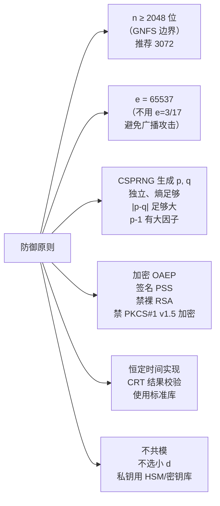

# 密码学（55）· RSA攻击概览

> [!abstract] TL;DR
> - RSA 的攻击面可以整洁地分为**四大类**：① 直接因式分解 `n`（从数学根基瓦解）；② 密钥生成弱点（素数选取低质量、共享素因子、厂商实现缺陷）；③ 数学/协议攻击（小指数、Wiener、Coppersmith，依赖参数选取失误）；④ 实现攻击（Padding Oracle、时序/故障侧信道，依赖代码与部署缺陷）。
> - **因式分解**：GNFS 是当前最强通用方法（亚指数，决定 2048/3072 密钥长度门槛）；Fermat 分解在 `p, q` 接近时极快；Pollard p−1 在 p−1 光滑时有效；ECM 和 Pollard rho 对中等规模 `n` 有效。
> - **最危险的现实威胁不是学术算法，而是弱随机数**：2012 年 "Mining your Ps and Qs" 论文扫描全球 700 万个公钥，发现数千对共享素因子——熵不足的设备在各自独立生成 `n` 时恰好生成了相同的 `p`，一次 GCD 即可破私钥，呼应 [[43.随机数与熵]] 的核心论点。
> - **防御总则**：`n ≥ 2048`（推荐 3072）、CSPRNG 生成独立素数、`e = 65537`、加密用 OAEP、签名用 PSS、实现用恒定时间；后量子迁移见 [[49.后量子密码概览]]。

本篇是 RSA 攻击子系列（第 55–59 篇）的**导览与总地图**，承接 [[22.RSA详解]] 的算法原理，为后续四篇专题提供背景与分类框架：[[56.RSA共模与小公钥指数攻击]]、[[57.RSA-Wiener与小私钥攻击]]、[[58.RSA-Bleichenbacher与padding-oracle]]、[[59.RSA-Coppersmith攻击]]。读者应先熟悉 [[22.RSA详解]] 中的模幂、欧拉定理与填充方案；密码攻击的通用分类框架已在 [[53.密码学攻击概览]] 建立，本篇直接沿用并聚焦 RSA 专有攻击。

---

## 概述与定位

RSA 自 1977 年提出，是最早也是应用最广的公钥算法。正因如此，它也积累了密码学史上最丰富的攻击研究。这些攻击分布在从"纯数学"到"纯工程实现"的整个谱系上，给出了一幅教科书式的"攻击地图"：

```
数学层             协议层            实现层
─────────────────────────────────────────────
因式分解 n  →   参数/协议设计错误  →  代码实现缺陷
（最难，受    （中等难度，依赖   （最常见，已有
 密钥长度     参数选取是否合规）   真实 CVE，
 约束）                           可工具化利用）
```

本篇按**防御视角**讲解——理解攻击的数学前提，直接推导出对应的防御参数和工程规范。每个攻击的最终落点是"为什么这条防御原则存在"。

---

## 原理与机制

### RSA 攻击总分类图

```mermaid
graph TD
    ROOT["RSA 攻击全景"]
    ROOT --> CAT1["① 因式分解攻击<br/>（攻击 n = p·q 本身）"]
    ROOT --> CAT2["② 密钥生成弱点<br/>（素数质量/随机性不足）"]
    ROOT --> CAT3["③ 数学/协议攻击<br/>（依赖参数选取失误）"]
    ROOT --> CAT4["④ 实现攻击<br/>（代码/部署缺陷）"]

    CAT1 --> FA1["试除法<br/>Trial Division"]
    CAT1 --> FA2["Fermat 分解<br/>（p,q 接近时极快）"]
    CAT1 --> FA3["Pollard p−1<br/>（p−1 光滑时有效）"]
    CAT1 --> FA4["Pollard rho<br/>（中等 n，概率算法）"]
    CAT1 --> FA5["ECM 椭圆曲线法<br/>（攻击中等大小因子）"]
    CAT1 --> FA6["QS 二次筛<br/>（大 n 次优方法）"]
    CAT1 --> FA7["GNFS 通用数域筛<br/>（当前最强，决定密钥长度）"]

    CAT2 --> KG1["弱素数<br/>（p−1 光滑/p+1 光滑/特殊结构）"]
    CAT2 --> KG2["共享素因子<br/>（GCD 攻击，Mining Ps&Qs 2012）"]
    CAT2 --> KG3["ROCA<br/>（Infineon TPM 结构化素数）"]

    CAT3 --> MA1["共模攻击<br/>→ 见 [[56.RSA共模与小公钥指数攻击]]"]
    CAT3 --> MA2["低公钥指数/广播攻击<br/>→ 见 [[56.RSA共模与小公钥指数攻击]]"]
    CAT3 --> MA3["Wiener 小私钥攻击<br/>→ 见 [[57.RSA-Wiener与小私钥攻击]]"]
    CAT3 --> MA4["Coppersmith 攻击<br/>→ 见 [[59.RSA-Coppersmith攻击]]"]

    CAT4 --> IM1["Padding Oracle<br/>（PKCS#1 v1.5 Bleichenbacher）<br/>→ 见 [[58.RSA-Bleichenbacher与padding-oracle]]"]
    CAT4 --> IM2["时序侧信道<br/>（模幂时间泄露 d）"]
    CAT4 --> IM3["故障注入<br/>（CRT Bellcore 攻击）"]
```



---

## 算法流程 / 结构详解

### 第一类：因式分解攻击 n

所有因式分解攻击的目标相同：给定公开的模数 `n`，还原 `p, q`，从而重算 `φ(n)` 并恢复私钥 `d`。不同方法的适用条件和复杂度差异巨大。

#### 试除法（Trial Division）

最朴素的方法：枚举所有小素数 `2, 3, 5, 7, ...` 尝试整除 `n`。

```
for each prime p in [2 .. sqrt(n)]:
    if n % p == 0:
        return (p, n // p)
```

**复杂度**：`O(n^(1/2))`，仅对 `n` 较小（< 10^12）或 `p, q` 中有一个极小（< 10^6）的情况有效。

**现实意义**：用于过滤"弱素数"——如果生成素数时随机性不足，碰巧生成了一个很小的 `p`，试除法秒破。标准库会确保生成的素数大于某个下界（如 `> 2^(n/2 - 1)` bits）。

#### Fermat 分解法

**适用前提**：`p` 和 `q` 非常接近，即 `|p - q|` 很小。

**数学原理**：若 `n = p * q` 且 `p ≈ q`，则令 `s = ceil(sqrt(n))`，`t = s^2 - n`。若 `t` 是完全平方数，令 `r = sqrt(t)`，则：

```
n = s^2 - r^2 = (s - r)(s + r)
→ p = s - r,  q = s + r
```

**迭代过程**：
```
s ← ceil(sqrt(n))
loop:
    t ← s^2 - n
    if t is perfect square:
        r ← sqrt(t)
        return (s - r, s + r)
    s ← s + 1
```

**当 `|p - q|` 很小时**，`s` 只需几步迭代就能命中，分解几乎瞬间完成。1999 年 RSA-512（155 位十进制）分解时的 `p, q` 恰好差约 `2^(n/4)`，标准 Fermat 法仍不可行，但它说明了选 `p, q` 时必须保证两者差足够大。

**防御**：确保 `|p - q| > 2^(n/2 - 100)`（约半位长差）。FIPS 186-5 明确规定 `|p - q| > 2^(nlen/2 - 100)`。标准密钥生成库自动满足此条件。

#### Pollard p−1 算法

**适用前提**：`p - 1` 是 **B-光滑数**（所有质因子 ≤ B）。

**数学原理**：由费马小定理，对任意 `a` 满足 `gcd(a, p) = 1`，有 `a^(p-1) ≡ 1 (mod p)`。若令 `M = lcm(1, 2, ..., B)`（其质因子覆盖 `p-1` 的所有因子），则 `p | (a^M - 1)`，即 `gcd(a^M mod n, n)` 可能等于 `p`。

```
B = smoothness_bound
M = 1
for each prime q ≤ B:
    M = M * q^floor(log(n) / log(q))   # q 的最高幂次 ≤ n
a = 2
g = gcd(pow(a, M, n) - 1, n)
if 1 < g < n:
    return g    # 找到因子
```

**复杂度**：`O(B log B log n)` 模运算，`B` 要覆盖 `p-1` 的最大质因子 `q_max`，若 `q_max < B` 则成功。

**现实例子**：1988 年 Pohlig-Hellman 等，以及多次 CTF 中的弱 RSA。若 `p - 1 = 2 * 3 * 5 * 7 * ...` 仅由小素数组成，`B = 10^6` 即可在秒级内破解。

**防御**：选取**强素数（Strong Prime）**——`p` 使得 `p - 1` 有一个大质因子 `r`（`r > 2^(n/2 - 1)`），使得 Pollard p−1 的 `B` 必须非常大才能覆盖 `r`，计算不可行。FIPS 186-5 要求素数满足附加约束。

#### Pollard rho 算法

**适用前提**：无特殊假设，是最通用的亚指数因子搜索算法之一，对于具有中等大小因子的合数特别有效。

**数学原理**：利用生日悖论。在 `Z_p` 中用伪随机函数 `f(x) = (x^2 + c) mod n` 生成一个序列，以 `O(p^(1/2))` 步期望找到一个 `x_i ≡ x_j (mod p)`，从而 `gcd(x_i - x_j, n) = p`。由于 `p ≈ sqrt(n)`，复杂度约为 `O(n^(1/4))`。

```
# Floyd 循环检测（Pollard rho）
x, y, c = 2, 2, 1
d = 1
while d == 1:
    x = (x*x + c) % n
    y = (y*y + c) % n
    y = (y*y + c) % n    # y 走两步
    d = gcd(abs(x - y), n)
if d != n:
    return d    # 找到因子
```

**复杂度**：`O(n^(1/4) polylog n)`，对 512 位 `n` 约需 `2^64` 步，对 1024 位 `n` 不可行。但 Pollard rho 作为 ECM/GNFS 的**预处理步骤**，先清除小/中等因子，仍然重要。

#### ECM（Elliptic Curve Method，椭圆曲线因子分解法）

Lenstra 1987 年提出，利用椭圆曲线上的点加法代替 Pollard p−1 中的乘法群，通过随机选取不同曲线反复尝试。

**关键优势**：Pollard p−1 若 `p-1` 不光滑则失败；ECM 通过选择不同曲线，等价于在 `Z_p` 上随机选取不同群的阶，概率上可以命中光滑情况。

**复杂度**：亚指数，约为 `L_p[1/2, sqrt(2)]`（以 `p` 的大小而非 `n` 为参数）。ECM 用于分解**中等大小因子**（50–80 位十进制），是 GNFS 流水线的预处理阶段。当前 ECM 纪录（2024 年前）可找到 83 位十进制的因子。

#### 二次筛（Quadratic Sieve, QS）

**适用范围**：100–130 位十进制的 `n`（约 330–430 位二进制）。

**思路**：寻找一批整数 `a_i` 使得 `a_i^2 mod n` 都是 B-光滑的，然后将其质因子分解，通过线性代数（高斯消元模 2）拼出一对 `(X, Y)` 满足 `X^2 ≡ Y^2 (mod n)` 但 `X ≢ ±Y (mod n)`，从而 `gcd(X - Y, n)` 即为 `n` 的非平凡因子。

**复杂度**：`L_n[1/2, 1]`（亚指数），约 `exp(sqrt(ln n * ln ln n))`。1994 年分解 RSA-129（428 位）用的正是 QS，耗时约 5000 MIPS 年。

#### GNFS（General Number Field Sieve，通用数域筛法）

**GNFS 是目前分解大整数最快的已知算法**，当前最强的亚指数因式分解方法，**直接决定了 RSA 安全密钥长度的下界**。

**复杂度**：

```
GNFS 复杂度 ≈ exp( (64/9)^(1/3) · (ln n)^(1/3) · (ln ln n)^(2/3) )
             = L_n[1/3,  (64/9)^(1/3)]
```

比 QS 的 `L_n[1/2, 1]` 指数更小，对大 `n` 优势显著。

**分解纪录与安全边界**：

| 分解纪录 | 时间 | 位数 | 十进制位 | 意义 |
|---|---|---|---|---|
| RSA-129 | 1994 | 428 位 | 129 位 | QS，5000 MIPS 年 |
| RSA-512 | 1999 | 512 位 | 155 位 | QS/GNFS，约 8000 CPU 日 |
| RSA-768 | 2009 | 768 位 | 232 位 | GNFS，约 2000 CPU 年 |
| RSA-829（RSA-250） | 2020 | 829 位 | 250 位 | GNFS，约 2700 CPU 年 |
| RSA-1024 | 未破 | 1024 位 | 309 位 | 估计需 ~10^9 MIPS 年 |

```
密钥长度 vs 安全性（GNFS 视角）：
─────────────────────────────────────────
1024 位   ≈ 80 位安全强度    已不安全，禁用
2048 位   ≈ 112 位安全强度   当前最低门槛（NIST 至 2030）
3072 位   ≈ 128 位安全强度   推荐（等效 AES-128）
4096 位   ≈ 140 位安全强度   高安全/长期密钥
─────────────────────────────────────────
数据来源：NIST SP 800-57 Part 1 Rev. 5
```

GNFS 的核心步骤（简化）：

```
1. 多项式选择：找两个多项式 f, g 在 Z[x] 中使 f(m) ≡ g(m) ≡ 0 (mod n)
2. 筛选阶段：对 (a, b) 对筛选使 a+bm 在 f/g 的数域上均光滑
3. 线性代数：高斯消元（模 2）找关系式
4. 平方根：在代数数域中计算平方根
5. 提取因子：gcd((X - Y), n)
```

---

### 第二类：密钥生成弱点

因式分解攻击假设 `n` 由强素数构成。密钥生成弱点攻击的前提则不同：**密钥生成本身就出了问题**，`n` 可以在数学上比 GNFS 更容易被破。

#### 弱素数

弱素数是指满足以下特殊结构的素数：

| 类型 | 特征 | 攻击方法 |
|---|---|---|
| `p - 1` 光滑 | `p - 1` 所有质因子 ≤ B | Pollard p−1，B 不大即可破 |
| `p + 1` 光滑 | `p + 1` 所有质因子 ≤ B | Williams p+1 算法，类似 Pollard |
| `|p - q|` 过小 | `p` 和 `q` 非常接近 | Fermat 分解，瞬间破解 |
| `p` 过小 | `p` 本身数位太少（如 32 位） | 试除或 Pollard rho |

**防御**：使用标准库的 RSA 密钥生成函数（OpenSSL `RSA_generate_key`、Java `KeyPairGenerator`），不要手工选素数。FIPS 186-5 的素数验证流程包含这些检查。

#### 共享素因子攻击（GCD 攻击，2012 年 "Mining your Ps and Qs"）

这是近年现实中**破坏力最大的 RSA 密钥攻击**，完全绕过了因式分解的计算难题。

**攻击场景**：大量嵌入式设备（路由器、IoT、VPN 网关、智能卡）在启动时生成 RSA 密钥，若系统熵池此时尚未充分初始化（[[43.随机数与熵]]），随机源不够"随机"，不同设备可能生成了**含有共同因子的不同模数**：

```
设备 A：n_A = p * q_A
设备 B：n_B = p * q_B    （p 恰好相同，q_A ≠ q_B）
```

此时：

```
gcd(n_A, n_B) = p
→ 立即得到 p，从而分解 n_A 和 n_B
```

**"Mining your Ps and Qs" (Lenstra et al., 2012)**：论文扫描了从 HTTPS/SSH/PGP 收集的约 **730 万个 RSA 公钥**，发现约 **0.5%（约 2.7 万个密钥）** 存在共享素因子，涉及嵌入式设备厂商众多。通过对所有密钥对做成批 GCD（使用"成批 GCD"算法，时间复杂度仅 `O(n^2 log n)`），这些私钥被完全还原。

```
# 成批 GCD（Batch GCD）伪代码
# 输入：n_1, n_2, ..., n_k（所有公钥模数）
# 对任意 i ≠ j，若 gcd(n_i, n_j) > 1，则 n_i, n_j 均可分解

for i in range(k):
    for j in range(i+1, k):
        g = gcd(n[i], n[j])
        if 1 < g < n[i]:
            print(f"n[{i}] 被分解: p = {g}")
```

**实际中用的是更高效的 Product Tree 算法**，先构建所有 `n_i` 的乘积树，再自顶向下做 GCD，总体 `O(k * log^2 k)` 次大整数运算，可在可接受时间内完成对数百万密钥的扫描。

**本攻击的关键教训**（与 [[43.随机数与熵]] 直接呼应）：

> 即使每台设备的 `n` 独立生成，熵池共性缺陷依然导致随机素数的"空间"严重收缩，从而跨设备碰撞。RSA 的数学没有问题，但随机数生成的工程缺陷直接瓦解了密钥。

**防御**：
- 系统启动时**延迟密钥生成**，直到熵池充分初始化（`/proc/sys/kernel/random/entropy_avail` > 阈值）
- 使用硬件 RNG（RDRAND/RDSEED、TPM 的 RNG 接口）或专用熵源（热噪声、光子噪声）
- 采用确定性素数生成方案（如从设备唯一 ID + 高质量随机种子派生），避免纯依赖启动时的软件熵

#### ROCA（Return of Coppersmith's Attack，Infineon TPM 漏洞，2017 年）

**CVE-2017-15361**，影响 Infineon TPM（Trusted Platform Module）芯片及搭载它的笔记本、智能卡（约 760 万张）。

**漏洞本质**：Infineon 的 RSA 素数生成算法使用了一种**"快速生成"的结构化素数**，使得每个 `p, q` 都满足：

```
p mod M = 65537^a mod M    （M 是某组小素数之积，a 在较小范围内）
```

这导致 `n = p * q` 落在一个远比随机情况小得多的子集中，用 Coppersmith 格方法（[[59.RSA-Coppersmith攻击]]）可以在**多项式时间**内（对 1024 位密钥约 CPU 小时量级）恢复 `p, q`。

**影响**：攻击者仅需公钥 `n`，无需任何额外信息或 oracle，即可破解受影响设备生成的 RSA-1024/2048 密钥（2048 位密钥约需数周 CPU 时间，实际可以并行化）。

**受影响场景**：Bitlocker（某些配置）、企业智能卡、电子护照、服务器 BMC。

**防御**：更新 Infineon 固件（修复了生成算法），或重新在软件层生成密钥绕过 TPM 素数生成。此案例说明**标准库和硬件实现都可能存在"结构化弱点"**，密钥生成不仅要用 CSPRNG，还要保证生成算法的设计不引入结构偏差。

**ROCA 指纹检测**：只需检查 `n mod M` 是否在特定候选集中，即可几秒钟识别受影响密钥（公开工具 `roca-detect`）。

---

### 第三类：数学/协议攻击

这类攻击不需要分解 `n`，而是利用**参数选取失误**或**协议设计缺陷**从数学上还原私钥或明文。

#### 共模攻击与低指数广播攻击

详见 [[56.RSA共模与小公钥指数攻击]]。简述如下：

**共模攻击（Common Modulus Attack）**：若两个用户共用同一个 `n` 但分别有不同的 `e_1, e_2`（且 `gcd(e_1, e_2) = 1`），对同一消息 `m` 分别加密得 `c_1 = m^e_1 mod n`，`c_2 = m^e_2 mod n`，攻击者可用扩展欧几里得算法恢复 `m`，无需分解 `n`。防御：**绝不共用模数**。

**低指数广播攻击（Håstad's Broadcast Attack）**：同一消息 `m` 用不同的 `n_1, ..., n_k` 和相同的小 `e`（如 `e = 3`）加密，当 `k ≥ e` 时，用 CRT 合并密文后 `e` 次方根直接恢复 `m`。防御：每次加密必须随机化（OAEP），不允许相同明文用不同 `n` 和小 `e` 重复加密。

#### Wiener 小私钥攻击

详见 [[57.RSA-Wiener与小私钥攻击]]。简述如下：

Wiener（1990）原始界为 **`d < (1/3)·n^{1/4}`**（即 `n^0.25/3`），可通过分析 `e/n` 的**连分数展开**恢复 `d`，时间复杂度 `O(log n)`，与 `n` 的分解难度完全无关。Boneh-Durfee（1999）用格方法进一步将上界推至 `d < n^0.292`；细节见 `[[57.RSA-Wiener与小私钥攻击]]`。防御：不要手工选小 `d`，用标准库自动生成（`d` 由 `e` 和 `φ(n)` 唯一确定，正确生成时不会出现小 `d`）。

#### Coppersmith 攻击（部分信息恢复）

详见 [[59.RSA-Coppersmith攻击]]。简述如下：

Coppersmith（1996）基于 LLL 格规约算法给出了一类方法：**当 `n` 的某个因子满足对 `n` 某个模数下的多项式根存在较小解时，可以高效找到该根**。应用包括：

- **已知明文高位攻击**：已知 `m` 的高位，可恢复完整 `m`
- **因子高位已知攻击**：已知 `p` 的高位 `p0`，满足 `|p - p0| < n^(1/4)` 时可分解 `n`
- **小 `e` 填充攻击**：若填充量不足（PKCS 非随机化），Coppersmith 可绕过

ROCA 就是 Coppersmith 方法的具体应用——利用 Infineon 素数的代数结构构造多项式，格规约找到根即 `p`。

---

### 第四类：实现攻击

#### Padding Oracle（Bleichenbacher 攻击）

详见 [[58.RSA-Bleichenbacher与padding-oracle]]。简述：

Bleichenbacher（1998）发现：若服务端在 PKCS#1 v1.5 解密后，**对填充格式（`0x00 0x02 ...`）做了可区分响应**（时间差/报错码不同），攻击者可以构造一系列密文查询，逐步缩小明文范围，最终恢复明文。理论上需约 `2^20` 次查询，实际优化后对多数系统数百万次即可。

2018 年 ROBOT 攻击证明该漏洞在 Facebook、Paypal、F5、Citrix、Radware 等真实系统中仍然存在，造成 CVE-2017-17382 等一批 CVE。

**防御**：
- 新系统改用 OAEP（根本性修复）
- 若必须保留 PKCS#1 v1.5：**恒定时间填充验证**（无论填充是否合法，响应时间完全相同），并对任何填充错误使用统一错误路径

#### 时序侧信道

模幂算法若未经恒定时间设计，操作时间会随私钥 `d` 的比特模式变化。Kocher（1996）证明通过统计数千次解密时间，可以逐比特恢复 `d`：

```
原理：square-and-multiply 中，当 d_i = 1 时比 d_i = 0 多一次乘法
     → 统计时间差 → 泄露 d 的比特串
```

**防御**：使用 Montgomery 梯形（Montgomery Ladder）或 Brauer 链，保证 `d` 每个比特的处理时间相同；使用 blinding（在模幂前乘以随机因子再最后消除，防止 DPA）。

#### 故障注入（Bellcore 攻击 / CRT 故障攻击）

若使用 CRT 解密（见 [[22.RSA详解]]），通过物理手段（电压毛刺、EM 辐射、激光）使其中一条分支（`m_p` 或 `m_q`）计算出错：

```
# 正常 CRT 签名
m_p = (m)^d mod p
m_q = (m)^d mod q

# 故障时，假设 m_q 出错，变为 m_q'
# 输出的故障签名 s_fault 同时包含 p 侧（正确）和 q 侧（错误）的信息
# gcd(s_fault^e - m, n) = p    ← 直接分解 n！
```

Boneh-DeMillo-Lipton（1997）证明了这一攻击，任何一次 CRT 计算错误都可直接破密钥。**只需一次故障签名即可永久破解私钥**。

**防御**：CRT 签名后验证（`s^e mod n == m?`），若不匹配则拒绝输出；使用硬件容错机制；高安全场景（HSM、FIDO 认证器）强制 CRT 结果校验。

---

## 安全性与正确使用

### 四类攻击的防御总则



### 攻击-防御对照表

| 攻击类型 | 前提条件 | 防御措施 | 相关篇章 |
|---|---|---|---|
| Fermat 分解 | `p, q` 过于接近 | FIPS 186-5 素数生成，`|p-q| > 2^(n/2-100)` | 本篇 |
| Pollard p−1 | `p-1` 光滑 | 强素数（`p-1` 有大质因子） | 本篇 |
| GNFS | `n < 1024` 位（或未来更大） | `n ≥ 2048`，推荐 3072/4096 | 本篇 |
| 共享素因子 | 多设备熵不足，生成重复 `p` | CSPRNG + 延迟生成 + 硬件 RNG | [[43.随机数与熵]] |
| ROCA | Infineon 结构化素数 | 更新固件 / 软件层生成密钥 | [[59.RSA-Coppersmith攻击]] |
| 共模攻击 | 多用户共用 `n` | **每个实体独立生成 `n`** | [[56.RSA共模与小公钥指数攻击]] |
| Håstad 广播 | 小 `e`，不同 `n` 加密相同 `m` | OAEP 强制随机化 | [[56.RSA共模与小公钥指数攻击]] |
| Wiener 攻击 | `d < n^0.292` | 不手选小 `d`，用标准库 | [[57.RSA-Wiener与小私钥攻击]] |
| Coppersmith | 已知明文部分位/结构化素数 | OAEP，素数来源标准化 | [[59.RSA-Coppersmith攻击]] |
| Bleichenbacher | PKCS#1 v1.5 + 解密 oracle | 改 OAEP，或恒定时间验证 | [[58.RSA-Bleichenbacher与padding-oracle]] |
| 时序侧信道 | 模幂时间泄露 `d` 比特 | Montgomery Ladder + blinding | [[61.侧信道攻击]] |
| CRT 故障注入 | 物理攻击使 CRT 一侧出错 | CRT 后验证 `s^e == m` | [[61.侧信道攻击]] |

### RSA 安全的本质：四个支柱

RSA 的实际安全由四个相互独立的支柱支撑，任何一个坍塌都可能导致系统被攻破：

```
①  足够长的密钥（n ≥ 2048）      对抗：GNFS 等因式分解
②  标准填充（OAEP / PSS）        对抗：Bleichenbacher、低指数攻击
③  强随机数（CSPRNG，熵充足）    对抗：共享素因子、弱素数、ROCA
④  正确的实现（标准库）           对抗：时序侧信道、故障注入
```

> [!tip] 工程最佳实践清单
> 1. **密钥长度**：`n ≥ 2048` 位（推荐 3072），2030 年后向后量子迁移（见 [[49.后量子密码概览]]）
> 2. **公钥指数**：始终用 `e = 65537`，不用 `e = 3` 或其他小值
> 3. **素数生成**：使用标准库（OpenSSL `RSA_generate_key`、Java `KeyPairGenerator`），不手工选 `p, q`；检查库版本确保不受 ROCA 等固件漏洞影响
> 4. **填充**：加密用 **OAEP + SHA-256**；签名用 **PSS + SHA-256**；**禁止裸 RSA**；PKCS#1 v1.5 仅在有遗留兼容要求时保留，且须恒定时间实现
> 5. **随机数**：素数/填充随机化必须来自 CSPRNG；嵌入式设备延迟密钥生成直至熵池充分初始化
> 6. **实现**：使用 OpenSSL/BouncyCastle/libsodium 等经审计库，不要自实现模幂或填充；确保使用恒定时间路径
> 7. **密钥存储**：私钥存于 HSM、操作系统密钥库（Windows CNG、macOS Keychain）；不共模、不共享私钥
> 8. **故障防护**：CRT 解密/签名后验证（高安全场景 HSM/FIDO 强制）

> [!warning] Shor 算法与量子威胁
> 量子计算机的 Shor 算法可以在**多项式时间**内分解 `n`，使所有 RSA 密钥长度归零。这不是当前实践威胁（目前最大量子计算机仅能分解数十位数），但长期机密数据面临"先收集、后解密"风险。后量子迁移路径见 [[49.后量子密码概览]]（NIST FIPS 203/204/205 标准化算法）。

---

## 小结

| 维度 | 核心要点 |
|---|---|
| **攻击分类** | 四类：因式分解 / 密钥生成弱点 / 数学协议 / 实现 |
| **最强数学攻击** | GNFS（亚指数），决定 2048 位门槛，1024 位已不安全 |
| **最危险现实攻击** | 共享素因子（弱随机数导致，"Mining Ps&Qs 2012"，GCD 即破） |
| **最常见协议攻击** | Bleichenbacher Padding Oracle（PKCS#1 v1.5 + 可区分响应） |
| **防御核心** | 足够长密钥 + 标准填充 + 强随机 + 标准库实现 |
| **子系列索引** | 56（共模/小 e）→ 57（Wiener）→ 58（Bleichenbacher）→ 59（Coppersmith） |

RSA 攻击的历史是一部密码工程的教训史：每一类攻击都对应一个具体的工程失误——手工选参数、偷懒用小指数、不验证填充、随机数不够随机。理解这张攻击地图，就是理解为什么每一条 RSA 最佳实践都是必须的，而不仅仅是"推荐"。

---

## 相关阅读

- [[22.RSA详解]] — RSA 算法原理、填充方案、密钥生成
- [[43.随机数与熵]] — CSPRNG、熵池初始化，与共享素因子攻击直接相关
- [[56.RSA共模与小公钥指数攻击]] — 共模攻击与 Håstad 广播攻击详解
- [[57.RSA-Wiener与小私钥攻击]] — 连分数与 Boneh-Durfee 格攻击
- [[58.RSA-Bleichenbacher与padding-oracle]] — PKCS#1 v1.5 oracle、ROBOT（2018）
- [[59.RSA-Coppersmith攻击]] — 格规约、已知部分位、ROCA
- [[53.密码学攻击概览]] — 通用攻击模型与侧信道分类
- [[61.侧信道攻击]] — 时序攻击、故障注入、物理侧信道
- [[49.后量子密码概览]] — Shor 算法威胁与后量子迁移路径

---

⬅️ 上一篇 [[54.ECDSA-nonce攻击]] ｜ 🏠 [[00.密码学总览]] ｜ 下一篇 [[56.RSA共模与小公钥指数攻击]] ➡️
