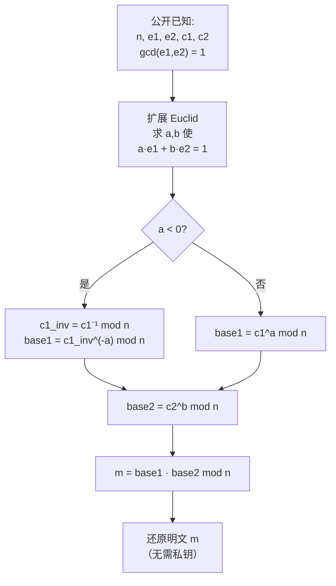

# 密码学（56）· RSA共模与小公钥指数攻击

> [!abstract] TL;DR
> - **共模攻击（Common Modulus Attack）**：若两用户共用同一 RSA 模数 `n` 但持有不同公钥指数 `(e1, e2)`，且 `gcd(e1, e2) = 1`，则只需同一明文 `m` 在两人的密文 `c1, c2`，用扩展欧几里得求 `a·e1 + b·e2 = 1`，就能还原 `m = c1^a · c2^b mod n`，**无需任何私钥**。此外，共享 `n` 下任意一方私钥均可分解 `n`，危及全部用户。
> - **小公钥指数攻击（Small e Attack）**：`e = 3` 且无填充时，若明文 `m` 较小使 `m^3 < n`，密文 `c = m^3` 直接对 `c` 开整数立方根即可得 `m`。
> - **Håstad 广播攻击**：同一消息 `m`（或线性相关）以 `e = 3` 加密后发给 ≥ 3 个不同模数的接收方，攻击者用 **CRT** 合并三组密文后开三次方根，仍无需私钥。
> - **Franklin-Reiter 相关消息攻击**：两条已知线性关系的消息在小 `e` 下相关，多项式 GCD 即可还原；进阶的 Coppersmith 短填充攻击见 [[59.RSA-Coppersmith攻击]]。
> - **防御**：每对用户**独立生成 n**（不共模）；公钥指数取 `e = 65537`；**始终用 OAEP 随机填充**。

本篇是 [[55.RSA攻击概览]] 中"参数滥用"攻击类的详解，承接 [[22.RSA详解]] 的算法基础（模幂、CRT、扩展 Euclid）。读者需了解 RSA 基本原理与 [[21.非对称加密总论]] 中的数论工具（Bézout 定理、中国剩余定理）；攻击以防御视角展开，每节给出完整数学与对应缓解措施。

---

## 概述与定位

RSA 的安全性建立在**大整数分解难题**之上，但这并非唯一的攻击面——当密钥参数选取失误（共用模数、指数过小）或缺少随机化填充时，攻击者无需分解 `n`，仅凭公开信息和初等数论便可还原明文。

本篇聚焦四类"参数滥用"攻击：

| 攻击 | 前提 | 数学工具 | 复杂度 |
|---|---|---|---|
| 共模攻击 | 共用 n，同消息两份密文 | 扩展 Euclid（Bézout） | O(log e) |
| 共模私钥泄露 | 共用 n，获得任一用户 d | 模运算、因式分解 | O(多项式) |
| 小 e 直接攻击 | e 小且 m^e < n，无填充 | 整数 e 次方根 | O(1) |
| Håstad 广播攻击 | 同 m，e 份不同 n 的密文 | CRT + e 次方根 | O(e·log n) |
| Franklin-Reiter | 已知线性关系的两消息，小 e | 多项式 GCD | O(e² log n) |

> [!warning] 攻击篇定位
> 本篇以**安全教育与防御**为目标，阐明攻击成立的数学原理与避免条件。所有数值示例均为玩具参数，不提供针对真实系统的武器化代码。

---

## 原理与机制

### 共模攻击（Common Modulus Attack）

#### 场景

系统管理员为图方便，生成一个 RSA 模数 `n`，然后给不同用户分配不同的公钥指数 `e1, e2, ...`：

```
用户 Alice：公钥 (n, e1)，私钥 (n, d1)
用户 Bob  ：公钥 (n, e2)，私钥 (n, d2)
```

发送方将同一消息 `m` 分别加密给两人：

```
c1 = m^e1  mod  n
c2 = m^e2  mod  n
```

#### 攻击数学

**引理（Bézout 定理）**：若 `gcd(e1, e2) = 1`，则存在整数 `a, b`（至少一个为负）使得

```
a · e1 + b · e2 = 1
```

可用扩展欧几里得算法（Extended Euclidean Algorithm, EEA）在 `O(log(min(e1, e2)))` 步内求出 `a, b`。

**攻击构造**：

设已知 `c1, c2`（公开密文）和 `n, e1, e2`（公开参数）。利用 Bézout 系数，令

```
M = c1^a · c2^b  mod  n
```

由 RSA 的定义 `c1 = m^e1 mod n`，`c2 = m^e2 mod n`，代入：

```
c1^a · c2^b ≡ (m^e1)^a · (m^e2)^b
            = m^(a·e1) · m^(b·e2)
            = m^(a·e1 + b·e2)
            = m^1
            = m   (mod n)
```

**因此 M ≡ m (mod n)，完全还原明文，且不需要任何私钥。**

> [!note] 负指数的处理
> 若 `a < 0`，则 `c1^a mod n` 需先求 `c1` 的模逆元 `c1_inv = c1^(-1) mod n`（用扩展 Euclid 求），再计算 `c1_inv^(-a) mod n`。只要 `gcd(c1, n) = 1`（消息不整除 n，几乎必然），模逆元存在。

#### 攻击流程 Mermaid



#### 数值示例（玩具参数，仅示意）

```
选 p=61, q=53  →  n=3233,  φ(n)=3120
选 e1=17, e2=7

用扩展 Euclid 求 gcd(17,7)=1 的 Bézout 系数：
  17*(-2) + 7*5 = -34 + 35 = 1
  故 a=-2, b=5

设明文 m=42：
  c1 = 42^17 mod 3233 = 2090  （示例值）
  c2 = 42^7  mod 3233 = 2387  （示例值）

攻击：
  c1_inv = 2090^(-1) mod 3233  （扩展 Euclid 求）
  M = c1_inv^2 · 2387^5 mod 3233
  M ≡ 42 = m  ✓
```

> [!warning] 示例输出为示意
> 以上 c1、c2 为说明用占位值，实际结果需以真实模幂计算为准。

#### 共模下私钥泄露危及所有用户

共享 `n` 还有另一层危险：**任何一方的私钥一旦已知，可分解 `n`，进而危及所有用户**。

设攻击者获得用户 Alice 的 `d1`，而 `e1 · d1 ≡ 1 (mod φ(n))`，即 `e1 · d1 = 1 + k · φ(n)`，则：

1. 计算 `k·φ(n) = e1·d1 - 1`（已知），
2. 对 `φ(n) = (p-1)(q-1) = n - p - q + 1`，结合 `n` 可列方程求 `p+q = n - φ(n) + 1`，
3. 再解二次方程 `x² - (p+q)x + pq = 0` 即得 `p, q`——即使没有精确的 `φ(n)`，仅有 `k·φ(n)` 亦可通过 Miller-Rabin 式随机算法在多项式时间内以高概率分解 `n`（Boneh-Durfee 1999 分析的推论）。

所以：**共享模数 = 一人私钥泄露 → 全系统崩溃**。

---

### 小公钥指数攻击（Small e Attack）

#### 场景

RSA 加密时若选取极小的 `e`（如 `e = 3`），且不添加随机填充，消息 `m` 也较小，则 `m^e` 可能不发生模 `n` 的规约：

```
若 m^3 < n，则 c = m^3 mod n = m^3（整数意义）
```

攻击者只需计算密文 `c` 的整数三次方根即可还原 `m`：

```
m = c^(1/3)   （整数 e 次方根，牛顿迭代法或二分搜索）
```

**完整条件链**：

```
1. 使用裸 RSA（无填充）
2. e = 3（或其他小值）
3. m^e < n（m 相对 n 很小）
```

三条同时满足时，不需要任何 `n` 的因子，`O(log n)` 步整数开方根即可还原明文。

#### 整数 e 次方根算法（伪代码）

```python
def integer_eth_root(c, e):
    """
    返回满足 x^e = c 的整数 x，不存在则返回 None。
    使用牛顿迭代法，复杂度 O(log c / log e)。
    """
    # 初始猜测
    x = int(c ** (1.0 / e)) + 1
    while True:
        x_prev = x
        # 牛顿步：x_{n+1} = ((e-1)*x_n + c/x_n^(e-1)) / e
        x = ((e - 1) * x + c // x**(e-1)) // e
        if x >= x_prev:
            break
    # 验证
    for candidate in [x_prev, x_prev - 1, x_prev + 1]:
        if candidate**e == c:
            return candidate
    return None  # c 不是完全 e 次幂
```

> [!note] 为何整数开方根有效
> 当 `m^e < n` 时，`c = m^e`（不经模规约），所以 `c` 就是 `m` 的 `e` 次幂——这是普通整数意义的等式，与模 `n` 无关，直接开方即可。只有在 `m^e ≥ n` 时模运算才会"改变"数值。

---

### Håstad 广播攻击（Håstad Broadcast Attack）

#### 场景

实际中"同一消息 e 份密文"的情况出现在广播场景：发送方将消息 `m` 用 `e = 3` 加密后分别发给 3 个接收方，每人持有不同的模数 `n1, n2, n3`（互质）：

```
c1 = m^3 mod n1
c2 = m^3 mod n2
c3 = m^3 mod n3
```

攻击者截获 `c1, c2, c3`，已知 `n1, n2, n3, e=3`。

#### 攻击数学（CRT 合并）

**中国剩余定理（CRT）**：若 `n1, n2, n3` 两两互质，则存在唯一 `C < N = n1·n2·n3` 使得

```
C ≡ c1  (mod n1)
C ≡ c2  (mod n2)
C ≡ c3  (mod n3)
```

CRT 合并公式：

```
N = n1 · n2 · n3
N1 = N / n1,  N2 = N / n2,  N3 = N / n3
y1 = N1^(-1) mod n1,  y2 = N2^(-1) mod n2,  y3 = N3^(-1) mod n3
C = (c1·N1·y1 + c2·N2·y2 + c3·N3·y3) mod N
```

由于 `m < min(n1, n2, n3)`，可知 `m^3 < n1·n2·n3 = N`，故 CRT 合并结果正好是 `C = m^3`（整数等式），直接整数开三次方根得 `m`。

**完整攻击步骤**：

```
1. 用 CRT 从 (c1 mod n1, c2 mod n2, c3 mod n3) 合并出 C = m^3 mod N
2. 对 C 计算整数三次方根：m = C^(1/3)
```

#### 线性相关消息的推广

Håstad（1988）还证明，即使 `e` 份消息并非完全相同，而是满足已知的线性关系（即每个接收方收到的是 `m_i = a_i·m + b_i` 的加密），攻击仍然成立，只是转化为联立多项式方程组后仍可用 Coppersmith 方法求解。详见 [[59.RSA-Coppersmith攻击]]。

---

### Franklin-Reiter 相关消息攻击

#### 场景

设同一密钥 `(n, e)` 对两条已知线性关系的消息 `m1, m2 = a·m1 + b`（`a, b` 已知）分别加密：

```
c1 = m1^e  mod  n
c2 = m2^e = (a·m1 + b)^e  mod  n
```

攻击者知道 `c1, c2, n, e, a, b`，目标是求 `m1`。

#### 数学原理

定义模多项式（在 `Z_n[x]` 上）：

```
f(x) = x^e - c1           （因为 f(m1) ≡ 0 mod n）
g(x) = (a·x + b)^e - c2   （因为 g(m1) ≡ 0 mod n）
```

`m1` 是这两个多项式的公根，即 `gcd(f(x), g(x))` 有因子 `(x - m1)`。

用**多项式最大公因式（Polynomial GCD）**算法（类比 Euclid 算法在多项式环上）求 `gcd(f(x), g(x))`，结果是 `(x - m1)`，提取常数项的负值即得 `m1`。

算法复杂度 `O(e² log n)`，对 `e = 3` 极其快速。

> [!tip] 与 Coppersmith 攻击的关系
> Franklin-Reiter 攻击揭示了：小 `e` 下，相关消息之间存在多项式代数关系，导致同一根被"共享"。Coppersmith 攻击（基于 LLL 格基规约）则将此思路推广到已知部分明文字节的场景（短填充、已知高位），详见 [[59.RSA-Coppersmith攻击]]。

---

## 算法流程 / 结构详解

### 共模攻击完整伪代码

```python
def extended_gcd(a, b):
    """返回 (g, x, y) 使 a*x + b*y = g = gcd(a, b)"""
    if b == 0:
        return a, 1, 0
    g, x, y = extended_gcd(b, a % b)
    return g, y, x - (a // b) * y

def modinv(a, n):
    """模逆元：a^(-1) mod n，不存在则报错"""
    g, x, _ = extended_gcd(a % n, n)
    if g != 1:
        raise ValueError("模逆元不存在")
    return x % n

def common_modulus_attack(n, e1, e2, c1, c2):
    """
    共模攻击：在 gcd(e1,e2)=1 的条件下从 (c1,c2) 还原 m。
    前提：c1 = m^e1 mod n，c2 = m^e2 mod n，同一 n。
    """
    g, a, b = extended_gcd(e1, e2)
    assert g == 1, "e1, e2 必须互质"

    if a < 0:
        # c1^a = (c1^(-1))^(-a)
        base1 = pow(modinv(c1, n), -a, n)
    else:
        base1 = pow(c1, a, n)

    if b < 0:
        base2 = pow(modinv(c2, n), -b, n)
    else:
        base2 = pow(c2, b, n)

    return (base1 * base2) % n

# 使用示例
# m_recovered = common_modulus_attack(n, e1, e2, c1, c2)
```

### Håstad 广播攻击完整伪代码

```python
def crt_combine(remainders, moduli):
    """
    中国剩余定理合并：给定 r_i mod n_i，求唯一的 C mod (n1*n2*...)。
    remainders: [c1, c2, ..., ce]
    moduli    : [n1, n2, ..., ne]，两两互质
    """
    N = 1
    for ni in moduli:
        N *= ni

    C = 0
    for ri, ni in zip(remainders, moduli):
        Ni = N // ni
        yi = modinv(Ni, ni)
        C += ri * Ni * yi

    return C % N

def integer_cube_root(c):
    """整数三次方根，不是完全立方返回 None"""
    # 牛顿法
    if c == 0:
        return 0
    x = int(round(c ** (1/3)))
    for delta in range(-2, 3):
        candidate = x + delta
        if candidate >= 0 and candidate**3 == c:
            return candidate
    return None

def hastad_broadcast_attack(ciphertexts, moduli, e=3):
    """
    Håstad 广播攻击：e=3，至少 e 份不同 n 的密文。
    ciphertexts: [c1, c2, c3]
    moduli     : [n1, n2, n3]，两两互质
    """
    assert len(ciphertexts) >= e and len(moduli) >= e
    C = crt_combine(ciphertexts[:e], moduli[:e])
    # C = m^e，对 C 开 e 次整数方根
    m = integer_cube_root(C)   # e=3 的特例
    return m
```

---

## 安全性与正确使用

### 参数失误的根因分析

共模攻击和小指数攻击的根本原因不是 RSA 数学本身的弱点，而是**对参数约束的无知或忽视**：

| 失误 | 根本原因 | 直接后果 |
|---|---|---|
| 共享模数 `n` | 为减少生成开销，认为"公共 n 无害" | 任意两用户密文可联合破解明文；一私钥泄露→分解 n→全崩 |
| 使用 e = 3 无填充 | 追求加密速度（e 小→模幂快）、忽略填充 | m 小时立方根直接破解；广播时 CRT 合并破解 |
| 线性相关明文不随机化 | 缺少填充随机性 | Franklin-Reiter 攻击；短填充下 Coppersmith 攻击 |

### 防御措施

> [!tip] 核心防御原则
> 1. **绝不共用模数**：每个密钥对独立生成 `(p, q, n, e, d)`，哪怕同一服务器发布多套密钥也必须各自独立。
> 2. **使用 e = 65537**：这是目前的工程共识，65537 = 2^16 + 1 是 Fermat 质数，汉明重量低（加密快），又足够大以避免所有已知小指数攻击。e = 3 和 e = 17 已被证明在无填充或相关消息场景下不安全。
> 3. **始终使用 OAEP 随机填充**：OAEP 在消息中注入随机种子（见 [[22.RSA详解]] 填充方案一节），使即使同一明文每次加密结果均不同，从根本上破坏了 Håstad 广播攻击（`m` 的每个副本均不同）和 Franklin-Reiter 攻击（线性相关结构被随机化破坏）的前提。

**各攻击的防御对照表：**

| 攻击 | 必要前提 | 防御——破坏哪个前提 |
|---|---|---|
| 共模攻击 | 两密文共享 n | 每用户独立 n |
| 共模私钥泄露 | 共享 n | 同上 |
| 小 e 直接攻击 | m^e < n 且无填充 | OAEP 填充（m 变大+随机化） |
| Håstad 广播 | 多份相同 m 的密文 | OAEP（每次填充不同，m 副本不同） |
| Franklin-Reiter | 线性相关消息，小 e | OAEP（随机化破坏线性关系） |

### 正确使用 RSA 的参数清单

> [!tip] RSA 工程最佳实践（攻击篇补充）
> - 密钥长度 ≥ 2048 位，推荐 3072 位（参见 [[22.RSA详解]] 密钥长度表）
> - 公钥指数：`e = 65537`（禁止 e = 3）
> - 加密：**RSAES-OAEP**（SHA-256 + MGF1）；禁止裸 RSA
> - 签名：**RSASSA-PSS**（SHA-256）；禁止裸 RSA 哈希
> - 每个用户/证书**独立生成 n**，不复用、不共享
> - 库选择：OpenSSL ≥ 3.0、BouncyCastle、Java JCA——均在 OAEP 层面自动处理随机填充

### OpenSSL 示例（OAEP 加密）

```bash
# 生成独立的 2048 位 RSA 密钥（绝不复用 n）
openssl genrsa -out alice.pem 2048
openssl genrsa -out bob.pem 2048

# 用 OAEP 填充加密（pkeyutl 是 3.x 推荐方式）
openssl pkeyutl -encrypt \
    -pubin -inkey alice_pub.pem \
    -pkeyopt rsa_padding_mode:oaep \
    -pkeyopt rsa_oaep_md:sha256 \
    -in plaintext.bin -out cipher.bin

# 解密
openssl pkeyutl -decrypt \
    -inkey alice.pem \
    -pkeyopt rsa_padding_mode:oaep \
    -pkeyopt rsa_oaep_md:sha256 \
    -in cipher.bin -out decrypted.bin
```

> [!warning] 示例输出为示意
> `pkeyopt rsa_oaep_md` 在 OpenSSL 3.0+ 可用；旧版本（1.1.x）参数名略有差异，请参照当前版本文档。

---

## 小结

| 攻击 | 所需输入 | 数学工具 | 破坏前提 |
|---|---|---|---|
| **共模攻击** | n, e1, e2, c1, c2（gcd=1） | 扩展 Euclid → Bézout 系数 | 共用 n |
| **共模私钥危害** | n, e, d（任一用户） | φ(n) 推导 → 分解 n | 共用 n |
| **小 e 直接攻击** | c，e 小，m^e < n | 整数 e 次方根 | 无填充 + e 小 |
| **Håstad 广播** | e 份 ci mod ni | CRT + e 次方根 | 无填充 + 同 m |
| **Franklin-Reiter** | c1,c2，线性关系，小 e | 多项式 GCD | 线性相关 + 小 e |

**核心结论**：RSA 的参数空间里有几个"陷阱坐标"——共享模数与小公钥指数，落入其中时攻击者不需要分解 `n`，初等数论足以还原明文。OAEP 随机填充和独立模数是抵御这些攻击的两把锁，缺一不可。理解攻击原理，是正确部署防御的最短路径。

---

## 相关阅读

- [[55.RSA攻击概览]] — 所有 RSA 攻击类的全景地图
- [[22.RSA详解]] — RSA 算法基础：密钥生成、加解密、填充（OAEP/PSS）
- [[21.非对称加密总论]] — 数论基础：欧拉定理、CRT、扩展 Euclid
- [[57.RSA-Wiener与小私钥攻击]] — 连分数攻击：小私钥指数 d 的破解
- [[58.RSA-Bleichenbacher与padding-oracle]] — PKCS#1 v1.5 padding oracle 攻击
- [[59.RSA-Coppersmith攻击]] — 格攻击：短填充、已知部分位、相关消息的推广
- [[23.Diffie-Hellman密钥交换]] — 对比：DH 的离散对数安全假设与 RSA 的异同

---

⬅️ 上一篇 [[55.RSA攻击概览]] ｜ 🏠 [[00.密码学总览]] ｜ 下一篇 [[57.RSA-Wiener与小私钥攻击]] ➡️
