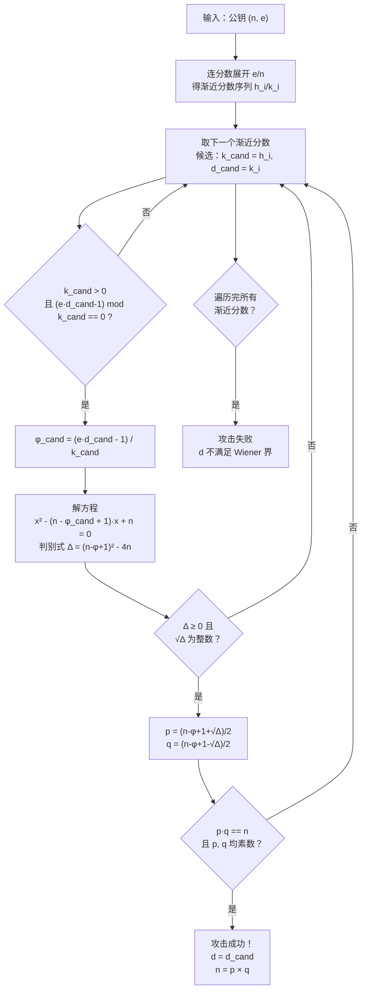

# 密码学（57）· RSA-Wiener与小私钥攻击

> [!abstract] TL;DR
> - **背景**：为了加快 RSA 解密速度，有人人为选取**小私钥指数 d**；然而当 `d < (1/3)·n^(1/4)` 时，攻击者仅凭公钥 `(n, e)` 就可在多项式时间内还原 `d`——这就是 **Wiener 攻击（1990）**。
> - **核心**：`e·d ≡ 1 (mod φ(n))` 意味着 `e/n` 非常接近有理数 `k/d`（`k` 为一个小整数）。利用**连分数展开**对 `e/n` 逐步逼近，渐近分数序列中必有一项命中正确的 `k/d`，从而暴露 `d`。
> - **Boneh-Durfee（1999）**：用**格规约（LLL）**将安全界推进到 `d < n^0.292`，见 [[59.RSA-Coppersmith攻击]]。
> - **与"小 e 攻击"区分**：[[56.RSA共模与小公钥指数攻击]] 中的 Håstad 广播攻击针对小**公钥**指数 e；本篇针对小**私钥**指数 d——方向相反，成因各异。
> - **防御**：标准 `e=65537` + 正规密钥生成流程自动保证 `d ≈ n`，绝无小私钥问题；若需加速解密，使用 **CRT 优化**（见 [[22.RSA详解]]），不要人为缩小 d。

本篇是「密码学」系列攻击篇，承接 [[55.RSA攻击概览]] 的攻击全景和 [[56.RSA共模与小公钥指数攻击]] 的小公钥指数方向，对 RSA 小私钥问题进行深入剖析。理解本篇需要 [[22.RSA详解]] 的密钥生成原理与 [[21.非对称加密总论]] 的数论基础（模运算、互质、欧拉函数）。

---

## 概述与定位

### 为什么会有"小私钥"需求

RSA 加密运算 `c = m^e mod n` 中，公钥指数 e 通常取 65537（Fermat 质数 F4），只有约 17 个二进制 1 位，模幂运算极快。而解密 `m = c^d mod n` 中，私钥指数 `d` 由 `e·d ≡ 1 (mod φ(n))` 唯一确定，通常 `d ≈ φ(n) ≈ n`，即约 2048 位——解密比加密慢约 100 倍以上。

面对这个不对称，某些工程师（尤其是早期资源受限场景）想到：**既然解密慢是因为 d 太大，何不选一个小 d？** 例如随意挑选 `d = 2^{16}+3` 之类的值，再反推 `e = d^{-1} mod φ(n)`，这样解密就变得和加密一样快。

这个想法于 1990 年被 Michael Wiener 证明是**致命的**：只要 d 足够小，攻击者仅凭公开的 `(n, e)` 就可在多项式时间内还原 d，等价于彻底破解私钥。

### 本篇在攻击篇中的位置

| 攻击类型 | 攻击目标 | 所需条件 | 本篇关系 |
|---|---|---|---|
| Fermat 因式分解 | p, q 差值过小 | p ≈ q | 另见 [[55.RSA攻击概览]] |
| 共模攻击 | 共用模数 n | 同 n、不同 e | [[56.RSA共模与小公钥指数攻击]] |
| Håstad 广播 | 小公钥指数 e | 同消息广播给多人 | [[56.RSA共模与小公钥指数攻击]] |
| **Wiener 攻击** | **小私钥 d** | **d < (1/3)·n^(1/4)** | **本篇核心** |
| Boneh-Durfee | 较小私钥 d | d < n^0.292 | 本篇延伸，详见 [[59.RSA-Coppersmith攻击]] |
| Bleichenbacher | 填充 oracle | PKCS#1 v1.5 解密端 | [[58.RSA-Bleichenbacher与padding-oracle]] |

---

## 数学原理

### 从密钥方程到有理数逼近

RSA 密钥生成保证：

```
e · d ≡ 1  (mod φ(n))
```

等价地，存在正整数 k，使得：

```
e · d = 1 + k · φ(n)
```

即：

```
e · d - k · φ(n) = 1
```

两边同除以 `d · φ(n)`：

```
e/φ(n) - k/d = 1 / (d · φ(n))
```

右侧非常小（`d` 和 `φ(n)` 都大），说明 `e/φ(n)` 非常接近有理数 `k/d`。

**关键替换**：攻击者知道 `n`（公开），不知道 `φ(n)`，但由于 `n = p·q` 而 `φ(n) = (p-1)(q-1) = n - p - q + 1`，有：

```
|n - φ(n)| = p + q - 1 < 3√n   （当 p, q ≈ √n 时）
```

因此 `e/n` 也非常接近 `k/d`，误差可以估算：

```
|e/n - k/d| = |e·d - k·n| / (n·d)
```

由 `e·d - k·φ(n) = 1`，且 `φ(n) = n - (p+q-1)`：

```
e·d - k·n = 1 - k·(n - φ(n)) = 1 - k·(p+q-1)
```

所以：

```
|e/n - k/d| ≈ k·(p+q) / (n·d)
```

当 `p, q ≈ √n` 时，`p + q ≈ 2√n`，故：

```
|e/n - k/d| ≲ 2k√n / (n·d) = 2k / (d·√n)
```

同时，由 `e·d = 1 + k·φ(n) ≤ k·n + 1`，故 `k/d ≤ e/n`，即 `k < d·e/n ≤ e`，而 `e < n`，故 `k < d`。这意味着 `k/d` 是一个**分子和分母都不大**的有理数，且它非常接近 `e/n`。

### 连分数定理：为什么渐近分数能命中 k/d

**定理（Legendre，1798）**：设 `α` 是一个实数，`p/q` 是满足

```
|α - p/q| < 1 / (2q²)
```

的有理数，则 `p/q` 必然是 `α` 的某个**渐近分数（convergent）**。

对我们的问题，取 `α = e/n`，`p/q = k/d`，验证条件是否满足：

```
|e/n - k/d| ≲ 2k / (d·√n)

而 1/(2d²) 是 Legendre 定理的门槛。

只要 2k/(d·√n) < 1/(2d²)，即 4k·d < √n，即 d < √n / (4k)
```

由于 `k < d`，取最坏情况 `k ≈ d`，得到：

```
d² < √n / 4  =>  d < n^(1/4) / 2
```

精确推导（Wiener 原文）给出的界是：

```
d < (1/3) · n^(1/4)
```

在此条件下，`k/d` 必定出现在 `e/n` 的连分数展开的渐近分数序列中。

---

## 算法流程：Wiener 攻击

### 连分数展开简介

对实数 `α`，其连分数展开是：

```
α = a₀ + 1/(a₁ + 1/(a₂ + 1/(a₃ + ...)))

简记：α = [a₀; a₁, a₂, a₃, ...]
```

其中 `a₀ = ⌊α⌋`，`a₁ = ⌊1/(α - a₀)⌋`，以此类推（全称辗转相除法）。

**渐近分数**（convergents）序列 `h_i/k_i` 定义为：

```
h_{-1} = 1,  h₀ = a₀,  h_i = a_i · h_{i-1} + h_{i-2}
k_{-1} = 0,  k₀ = 1,   k_i = a_i · k_{i-1} + k_{i-2}
```

渐近分数序列从两侧交替逼近 `α`，且是**最佳有理数近似**（分母不大于 `k_i` 的所有分数中，与 `α` 最近的）。

### Wiener 攻击步骤

```
输入：公钥 (n, e)
输出：私钥 d（若满足 d < (1/3)·n^(1/4)）

步骤：
1. 计算 e/n 的连分数展开，得到渐近分数序列 {h_i / k_i}
2. 对每个渐近分数 h_i / k_i，令候选 k_cand = h_i，d_cand = k_i
3. 验证 d_cand：
   a. 若 d_cand 为偶数或 k_cand = 0，跳过
   b. 计算候选 φ_cand = (e · d_cand - 1) / k_cand
      （必须为整数，否则跳过）
   c. 用 φ_cand 构造方程：
      x² - (n - φ_cand + 1)·x + n = 0
      （因为 p + q = n - φ(n) + 1，而 p, q 是该方程的两根）
   d. 计算判别式 Δ = (n - φ_cand + 1)² - 4n
      若 Δ < 0 或 √Δ 不是整数，跳过
   e. p = ((n - φ_cand + 1) + √Δ) / 2
      q = ((n - φ_cand + 1) - √Δ) / 2
      验证 p·q == n，且 p, q 均为素数
4. 若验证通过，返回 d = d_cand（及分解 n = p·q）
5. 若遍历所有渐近分数均失败，则 d 不满足 Wiener 界，攻击失败
```

> [!note] 渐近分数数量
> 对 `e/n`（e、n 均约 2048 位），连分数展开的渐近分数个数约为 `O(log n)`（约数千项），每项验证 O(1)，故总体时间复杂度 `O(log² n)`，极快。

### 数值示例（小参数演示）

以下使用极小参数**仅示意算法流程**，不代表任何安全参数：

```
n = 90581
e = 17993

连分数展开 e/n = 17993/90581：
  17993/90581 = [0; 5, 29, 4, 1, 3, 2, 4, 3] （示意）

渐近分数序列（部分）：
  0/1, 1/5, 29/146, 117/589, 146/735, 555/2794, ...

逐一验证：
  候选 k=1, d=5：φ_cand = (17993·5 - 1)/1 = 89964
    方程：x² - (90581 - 89964 + 1)x + 90581 = 0
         = x² - 618x + 90581 = 0
    判别式：618² - 4·90581 = 381924 - 362324 = 19600 = 140²  ✓
    p = (618 + 140)/2 = 379, q = (618 - 140)/2 = 239
    验证：379 × 239 = 90581 ✓，379 和 239 均为素数 ✓
  攻击成功，d = 5（此处为演示，实际 d=5 极小）
```

> [!warning] 示例输出为示意
> 上方数值为构造示意，实际 Wiener 攻击中渐近分数的迭代步骤顺序与具体参数有关。

---

## Wiener 攻击 Mermaid 流程图



---

## 为何 e/n 近似 k/d：直觉解释

从直觉层面理解 Wiener 攻击的数学核心：

**RSA 密钥关系**：`e·d = 1 + k·φ(n)`，可以改写为 `e/φ(n) = k/d + 1/(d·φ(n))`。

这说明 `e/φ(n)` 与 `k/d` 的误差仅为 `1/(d·φ(n))`，极小（`φ(n) ≈ n`，`d` 也大）。

**替换 φ(n) 为 n**：攻击者知道 n 而不知 φ(n)，但二者之差 `n - φ(n) = p + q - 1 < 3√n`，相对于 n 而言仅为 `O(1/√n)` 的相对误差。所以从 `e/φ(n) ≈ k/d` 过渡到 `e/n ≈ k/d` 引入的额外误差仍然极小。

**连分数定理发挥作用**：`e/n` 和 `k/d` 非常接近，且 `d` 小（满足 Wiener 界时 `d < n^0.25`），连分数定理保证 `k/d` 必然出现在 `e/n` 的渐近分数序列中。

**验证步骤还原 φ(n)**：一旦猜中 `k/d`，由 `e·d - k·φ(n) = 1` 立刻可以反推 `φ(n) = (e·d - 1)/k`，再用韦达定理（`p·q = n`，`p+q = n - φ(n) + 1`）解出 p, q，完成因式分解。

---

## Boneh-Durfee 攻击：格把界推进到 n^0.292

Wiener 攻击的界 `d < (1/3)·n^{1/4}` 并非最终答案。1999 年，Dan Boneh 和 Glenn Durfee 用**格规约（LLL 算法）**将攻击界扩展到：

```
d < n^0.292
```

**核心思路**：由 `e·d ≡ 1 (mod φ(n))`，写为 `e·d = 1 + k·φ(n)`，其中 `φ(n) = n - s`（`s = p+q-1 ≈ 2√n`）。这等价于：

```
e·d ≡ 1 + k·(n - s)  (mod n)
e·d - k·n ≡ 1 - k·s  (mod n)
```

构造含未知量 `(k, d)` 的二元多项式方程：

```
f(x, y) = 1 + x(n + y)     （令 x = k, y = -s ≈ -(p+q)）
```

满足 `f(k, -s) ≡ 0 (mod e)`，且 `k` 和 `s` 都"小"（`k < d < n^{0.292}`，`s < 2√n`）。利用 **Coppersmith 方法**（在格上找小根），可以在满足上述界时高效求解，详见 [[59.RSA-Coppersmith攻击]]。

| 攻击 | 安全界（d 的上限） | 方法 | 时间复杂度 |
|---|---|---|---|
| Wiener（1990） | `n^{1/4}/3` | 连分数 | `O(log² n)`（极快） |
| Boneh-Durfee（1999） | `n^{0.292}` | LLL 格规约 | 多项式时间（更慢但界更强） |
| 理论下界 | 未知（n^{0.5} 猜想） | — | — |

> [!note] 实践意义
> `n^{0.292}` 对 2048 位 RSA 来说约为 597 位。任何低于这个长度的 d 均可能被 Boneh-Durfee 攻破。标准 d 约 2048 位，远高于此界。

---

## 与小公钥指数攻击的区分

本篇（小 d）与 [[56.RSA共模与小公钥指数攻击]]（小 e）是两类**方向相反**的攻击，但都源于"为了性能而人为减小某个指数"的错误设计：

| 维度 | 小公钥指数攻击（56 篇） | 小私钥攻击（本篇） |
|---|---|---|
| 攻击目标 | 公钥指数 e（如 e=3） | 私钥指数 d（如 d≈n^{0.2}） |
| 动机 | 加快**加密**速度 | 加快**解密**速度 |
| 典型攻击 | Håstad 广播、e 次方根 | Wiener 连分数、Boneh-Durfee LLL |
| 条件 | e 小 + 同消息广播 / 无填充 | d < (1/3)·n^{1/4} 或 n^{0.292} |
| 正确防御 | 使用 OAEP 填充 + e=65537 | 不手动缩小 d，用 CRT 加速代替 |

---

## 安全性与正确使用

### 标准流程天然免疫 Wiener 攻击

正确的 RSA 密钥生成流程（如 PKCS#1 v2.2、RFC 8017 规定）：

1. 选大素数 `p, q`（各约 1024 位，生成 2048 位 n）
2. 选公钥指数 `e = 65537`（固定）
3. 计算 `d = e⁻¹ mod φ(n)`（或 `λ(n)`）

此时 d 由 e 和 φ(n) 共同决定，**没有任何方法让 d 变小**：φ(n) ≈ n 约 2048 位，e 约 17 位，d = e⁻¹ mod φ(n) ≈ φ(n)，约 2048 位，远超 `n^{0.292}` ≈ 597 位的危险界。

### 正确的解密加速方式：CRT

若解密速度是瓶颈，**正确做法是保留 p, q 并使用 CRT 加速**（见 [[22.RSA详解]]）：

```
d_p = d mod (p-1)
d_q = d mod (q-1)
q_inv = q⁻¹ mod p

m_p = c^{d_p} mod p
m_q = c^{d_q} mod q
m = CRT(m_p, m_q, p, q)    ← Garner 公式合并
```

CRT 解密将模幂规模从"2048 位模 2048 位"变为"1024 位模 1024 位"两次，速度提升约 **4 倍**，而 `d` 本身的安全性**完全不变**——因为暴露给攻击者的仍是 `(n, e)`，d、p、q 依然保密。

> [!warning] 绝不用小 d 换速度
> CRT 加速 4 倍已是最安全且最有效的方法。任何"减小 d"的操作，只要 d 跌入 Wiener 界（甚至 Boneh-Durfee 界）就会导致私钥可被多项式时间恢复。

### CTF / 实战场景识别

Wiener 攻击在 CTF 中非常常见，典型特征：

- 题目给出 `(n, e)` 且 e 异常大（e ≈ n）——这正是 d 被选为小值后反推出 e 的特征（e·d ≡ 1 (mod φ(n))，d 小则 e = φ(n)/d 的余数大）
- 有时题目明确说"选了小 d 以加速解密"
- 有时密文可以解密但没有给出 d，暗示需要通过攻击还原

识别到上述特征后，直接对 `e/n` 做连分数展开即可，通常几百个渐近分数内命中。

### 安全使用清单

> [!tip] RSA 私钥安全最佳实践
> 1. **绝不手动选取 d**——让密钥生成算法由 e 和 φ(n) 自动决定 d
> 2. **e 固定为 65537**——这样 d ≈ n，天然远超 Wiener/Boneh-Durfee 攻击界
> 3. **解密加速用 CRT**——保留 p, q 做 CRT，不以缩小 d 换速度
> 4. **密钥长度 ≥ 2048 位**——即使 d 未被人为缩小，n 太小仍有 GNFS 分解威胁
> 5. **使用审计库**——OpenSSL、BouncyCastle 等不会生成小 d，不要手搓密钥生成
> 6. **CRT 解密后验证**——防止 Bellcore 故障注入攻击（见 [[22.RSA详解]] CRT 一节）

---

## 小结

| 要素 | 关键点 |
|---|---|
| **攻击前提** | 私钥指数 d 被人为设为小值（`d < (1/3)·n^{1/4}`） |
| **数学核心** | `e·d ≡ 1 (mod φ(n))` 使 `e/n` 极接近有理数 `k/d` |
| **攻击工具** | 连分数展开 `e/n`，渐近分数序列必含 `k/d` |
| **还原路径** | 命中 `k/d` → 重建 `φ(n)` → 解二次方程得 `p, q` → 得 `d` |
| **Boneh-Durfee** | LLL 格规约将界推进到 `d < n^{0.292}` |
| **防御** | 标准 e=65537 + 正规生成保证 d≈n；加速用 CRT，不缩 d |
| **混淆风险** | 小 e 攻击（Håstad）vs 小 d 攻击（Wiener）——方向相反 |

Wiener 攻击是数论在密码攻击中的经典范例：一个看似无害的"性能优化"（缩小解密指数），在数学上等价于向攻击者透露了一条"高速公路"——连分数逼近在多项式时间内驶到终点。防御只需遵守一条铁律：**RSA 密钥参数由标准算法生成，人为干预参数大小往往是灾难的起点**。

---

## 相关阅读

- [[21.非对称加密总论]] — 数论基础：模运算、欧拉定理、公钥思想
- [[22.RSA详解]] — RSA 密钥生成、CRT 加速解密、安全使用清单
- [[55.RSA攻击概览]] — RSA 所有攻击方向全景地图
- [[56.RSA共模与小公钥指数攻击]] — 小公钥指数 e 的 Håstad 广播攻击
- [[58.RSA-Bleichenbacher与padding-oracle]] — 填充 oracle 攻击与 PKCS#1 v1.5
- [[59.RSA-Coppersmith攻击]] — Coppersmith/LLL 格攻击，Boneh-Durfee 的数学基础
- [[23.Diffie-Hellman密钥交换]] — 基于离散对数的替代方案

---

⬅️ 上一篇 [[56.RSA共模与小公钥指数攻击]] ｜ 🏠 [[00.密码学总览]] ｜ 下一篇 [[58.RSA-Bleichenbacher与padding-oracle]] ➡️
