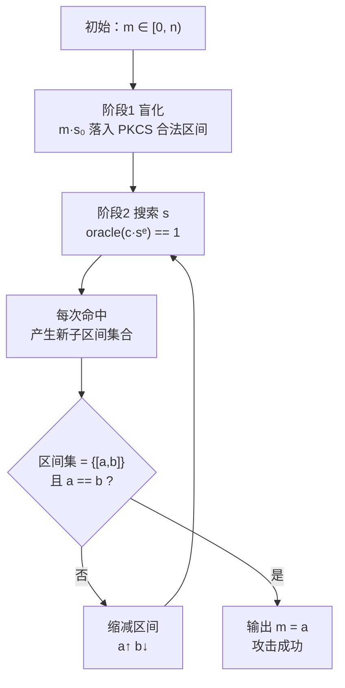
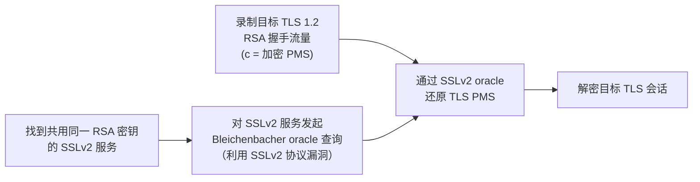

# 密码学（58）· RSA-Bleichenbacher与padding-oracle

> [!abstract] TL;DR
> - **Padding Oracle**：服务端只要能区分"填充格式合法"与"格式非法"这 1 bit 信息，攻击者就能以此为黑盒 oracle，自适应构造密文并逐步缩小明文范围——无需私钥。
> - **Bleichenbacher 攻击（CRYPTO 1998，"百万消息攻击"）**：针对 **PKCS#1 v1.5 加密填充**（`0x00 0x02 PS 0x00 M`），利用"填充是否以 `0x00 0x02` 开头"这一 oracle，通过自适应选择密文把目标明文所在区间从 `[0, n)` 逐步收窄到唯一值；核心数学：合法填充 ⟺ 解密结果 `m∈[2B, 3B-1]`（`B = 2^(8(k-2))`），乘以 `s^e mod n` 等价于对明文乘以 `s`，每轮 oracle 返回真假让区间不断裂分缩小。
> - **ROBOT（2017）**、**DROWN（2016）**：现代 TLS 实现仍存在 Bleichenbacher 漏洞复活（ROBOT）及跨协议复用（DROWN / SSLv2）。
> - **防御核心**：改用 **OAEP**（加密）；**统一错误处理**（填充错误与其他解密错误返回同一错误码/同一时延，不给 oracle）；TLS 1.3 彻底弃用 RSA 密钥传输。

本篇属于「密码学」系列攻击篇，承接 [[55.RSA攻击概览]] 给出的 RSA 攻击全景和 [[57.RSA-Wiener与小私钥攻击]] 对私钥侧的分析，聚焦**加密侧填充漏洞**。读者需掌握 RSA 加解密基础（见 [[22.RSA详解]]）和分组密码基础（Padding Oracle 的对称版见 [[60.对称密码攻击]]）。本篇深入讲解：Padding Oracle 通用概念 → Bleichenbacher 攻击数学原理与区间缩小算法 → 实际中的 ROBOT 和 DROWN → 防御要点。攻击分析仅限教育与防御视角，不提供真实系统武器化利用。

---

## 概述与定位

### Padding Oracle 的通用威胁模型

**Padding Oracle** 是一类攻击范式，而非单一漏洞。它的必要条件极低：

> 攻击者向解密者（服务端）提交密文，**服务端的响应中泄露了"解密后填充是否合法"这 1 bit 信息**。

这 1 bit 可以以任何形式泄露：不同的 HTTP 响应码、不同的错误消息文本、不同的响应时延，甚至在某些边界情况下不同的连接行为——只要可区分，就构成有效 oracle。

Padding Oracle 在**非对称加密（RSA PKCS#1 v1.5）**和**对称加密（CBC 模式）**中都有对应实例：

| 攻击实例 | 密码原语 | Oracle 区分点 |
|---|---|---|
| **Bleichenbacher 1998** | RSA PKCS#1 v1.5 加密 | 解密后是否以 `0x00 0x02` 开头 |
| **POODLE 2014** | TLS CBC（SSL 3.0） | 块填充是否合法（最后一字节检查） |
| **BEAST / Lucky13** | TLS CBC | MAC 计算时序差异 |
| **ROBOT 2017** | RSA PKCS#1 v1.5（TLS 实现） | 错误码 / 握手行为差异 |

本篇聚焦 RSA 侧。对称加密侧的 CBC Padding Oracle 详见 [[60.对称密码攻击]]，两者共享同一逻辑根：**解密过程中对不同类型错误的不一致处理**制造了可观测的信息泄露。

### 为什么 PKCS#1 v1.5 填充会有 oracle

PKCS#1 v1.5（RFC 2437）加密填充格式（设 RSA 模数 `k` 字节）：

```
EM = 0x00 || 0x02 || PS || 0x00 || M
```

- `0x00 0x02`：两字节类型标记
- `PS`：至少 8 字节的**随机非零字节**
- `0x00`：分隔符（唯一的零字节，用于定位消息起点）
- `M`：实际消息（可为空到 `k - 11` 字节）

解密端在拿到 `EM` 后需要**验证格式**：前两字节是否为 `0x00 0x02`、`PS` 段是否有足够长度、是否存在分隔零字节。任何一项不符都是填充错误。

**问题**：早期实现在填充验证失败时会返回**与其他错误（如解密本身失败、记录层错误）可区分的响应**。攻击者因此得到了一个精确的"1-bit oracle"：

```
oracle(c') = 1    当且仅当    Dec(c') 的首两字节 == 0x00 0x02
```

单靠这 1 bit，Bleichenbacher 证明了只需约 **10⁶ 次查询**（对 1024 位 RSA）即可还原完整明文——这也是"百万消息攻击"得名的由来。

---

## 原理与机制：Bleichenbacher 攻击

### 数学直觉

设 RSA 公钥 `(n, e)`，`k = n` 的字节长度（如 2048 位则 `k = 256`）。令：

```
B = 2^(8*(k-2))
```

`B` 是 `k-2` 字节全 `0xFF` 对应的整数，在 2048 位 RSA（k=256 字节）下约为 `2^2032`。

填充合法等价于：解密后的整数 `m` 满足：

```
2B  ≤  m  <  3B
```

原因：`0x02` 在第二字节位置的整数值恰好是 `2B`，而 `0x03` 对应 `3B`——合法格式确保最高两字节为 `0x00 0x02`，即 `m` 落在区间 `[2B, 3B-1]`。

### 自适应选择密文：乘以因子 s

设目标密文为 `c`，对应未知明文 `m`（即 `c ≡ m^e mod n`）。攻击者构造：

```
c' = (c * s^e) mod n
```

则解密结果为：

```
m' = (c')^d mod n = (c * s^e)^d = c^d * s = m * s  mod n
```

即 **将目标密文"乘以 s"等价于将明文乘以 s**（模 n 意义下）。

攻击者把 `c'` 发给 oracle：
- 若 oracle 返回 1（合法填充），则 `m·s mod n ∈ [2B, 3B-1]`
- 若 oracle 返回 0，则 `m·s mod n ∉ [2B, 3B-1]`

这一约束让攻击者能对 `m` 的可能范围施加限制。

### 区间收敛算法（概念层）

Bleichenbacher 的算法由三个阶段组成：

**阶段 1：盲化（Blinding）**

若目标密文 `c` 本身的明文 `m` 不满足 PKCS#1 格式（例如目标密文是用真实消息生成的但攻击者不能直接查它本身），先搜索 `s₀`，使 `m·s₀ mod n` 落入 `[2B, 3B-1]`。得到 `c₀ = c·s₀^e mod n` 作为起点，此后攻击在已知"当前密文对应明文 PKCS-合法"的前提下进行。

**阶段 2：搜索 s（缩小区间上界）**

从 `s₁ = ⌈n/(3B)⌉` 开始逐一递增搜索，直到 oracle 返回 1。每找到一个合法的 `s`，就能从：

```
∃ r 使得:  m ∈ [( 2B + r*n ) / s ,  ( 3B - 1 + r*n ) / s ]
```

中计算若干候选子区间。随着 `s` 增大，子区间越来越窄。

**阶段 3：区间裂分与收敛**

当当前区间只剩一个候选子区间 `[a, b]` 时，可以利用区间范围精确推算 `r` 的候选范围，再在小范围内搜 `s`，使每次都有较大概率命中 oracle = 1。每次成功命中都让 `[a, b]` 继续收缩：

```
a = max(a,  ceil((2B + r*n) / s))
b = min(b, floor((3B - 1 + r*n) / s))
```

当 `a == b` 时，`m = a`，攻击完成。



### 查询次数分析

| RSA 密钥长度 | 典型查询次数 | 时间（假设 100 次/秒）|
|---|---|---|
| 512 位 | ≈ 3 × 10⁴ | 约 5 分钟 |
| 1024 位 | ≈ 10⁶ | 约 3 小时 |
| 2048 位 | ≈ 10⁶–10⁷ | 约数小时至数天 |

实际查询次数受 `s` 搜索效率影响，Bleichenbacher 1998 论文报告 1024 位约 **3×10⁵ 至 10⁶** 次。后续研究（Bardou 等，2012；Ronen 等，2019）给出改进版本，查询次数可降至数千次。

### 攻击变体：伪造签名

PKCS#1 v1.5 **签名**场景下也存在填充 oracle 变体：

签名验证时，验证端解密签名 `s^e mod n`，检查格式 `0x00 0x01 FF...FF 0x00 DigestInfo`。若验证端**对尾部格式不严格**（例如只检查前几字节），攻击者可以**不需要 oracle**，直接用立方根（对 e=3）或其他方式构造满足宽松格式检验的伪签名——这是 Bleichenbacher 2006 年对 PKCS#1 v1.5 签名验证的另一个攻击（与 1998 年的加密 oracle 攻击是不同场景）。本篇主要讨论 1998 年加密 oracle 攻击；签名伪造变体简要收录于此以避免混淆。

---

## 现实中的复活：ROBOT 与 DROWN

### ROBOT（2017）：Return Of Bleichenbacher's Oracle Threat

2017 年，Böck、Somorovsky、Young 对 28 个主流 HTTPS 主机及常见 TLS 实现做了大规模测试，发现**大量现代 TLS 实现仍存在可利用的 Bleichenbacher oracle**：

**漏洞成因（多类）：**

| 实现缺陷 | 具体表现 |
|---|---|
| 错误码不统一 | 填充错误返回 `handshake_failure`，其他错误返回 `decrypt_error`，可区分 |
| 时延差异 | 填充检验失败路径比后续 MAC/HMAC 路径快，响应时延不同 |
| 协议层行为差异 | 某些实现在填充错误时直接断连，其他错误时继续握手 |
| "补丁"引入新 oracle | 为修复已知问题打补丁后逻辑产生新的可区分路径 |

**影响范围：** 包括 F5 BIG-IP、Cisco ACE、Radware、OpenSSL（特定条件）、Facebook、PayPal 在内的多个高流量服务在 ROBOT 发现时仍存在漏洞。

**可行攻击场景：**

1. **被动录制 TLS 流量** + 后续发动 Bleichenbacher 攻击还原加密的 Pre-Master Secret（针对使用 RSA 密钥交换的 TLS 1.2 及以下）
2. **实时中间人攻击**（需要足够快的 oracle 响应）

> [!warning] TLS 1.3 已根治此问题
> TLS 1.3 完全移除了 RSA 静态密钥传输（只保留 ECDHE/DHE），不再有"加密 Pre-Master Secret 送往服务端解密"这一步骤，Bleichenbacher 攻击路径在 TLS 1.3 中**从根本上不存在**。ROBOT 攻击仅影响 TLS 1.2 及以下配置了 `TLS_RSA_*` 密码套件的实现。

### DROWN（2016）：跨协议降级复用

**DROWN**（Decrypting RSA with Obsolete and Weakened eNcryption）利用 **SSLv2** 协议的 Bleichenbacher oracle 来攻击使用**同一 RSA 密钥**的现代 TLS 连接：

**攻击路径：**



**关键洞察：** SSLv2 的握手协议在格式验证上存在更多漏洞（包括 export-grade 截断、额外的密码套件降级），使 oracle 效率更高、查询次数更少。即使服务端主网站已升级到 TLS 1.2，只要**任何使用同一 RSA 密钥对的服务（邮件服务器、旧子域名等）仍开启 SSLv2**，攻击就成立。

**影响范围（2016 年调查）：** 约 17% 的 HTTPS 服务器受影响（其中 SSLv2 端口直接开放者约 6%，另外通过密钥复用受影响约 11%）。

**缓解：** 禁用 SSLv2（及 SSLv3）；不同服务使用独立 RSA 密钥对；迁移到 TLS 1.3。

---

## 算法流程详解

### 完整 Bleichenbacher 攻击伪代码

```python
# 输入：目标密文 c，公钥 (n, e)，oracle 函数 pkcs_oracle(c') -> bool
# 输出：明文整数 m

def bleichenbacher(c, n, e, oracle):
    k  = byte_length(n)
    B  = 2 ** (8 * (k - 2))

    # 阶段 1：盲化
    # （若 c 本身已是 PKCS-合法密文可跳过，令 c0=c, s0=1）
    s0 = find_s_such_that(oracle, c, n, e, start=1)
    c0 = (c * modpow(s0, e, n)) % n
    M  = {(2*B, 3*B - 1)}        # 初始区间集合

    s = ceil_div(n, 3*B)         # 阶段 2a：首次搜索起点

    while True:
        # 找下一个使 oracle == 1 的 s
        while not oracle((c0 * modpow(s, e, n)) % n):
            s += 1

        # 更新区间集合
        M_new = set()
        for (a, b) in M:
            r_lo = ceil_div(a*s - 3*B + 1, n)
            r_hi = floor_div(b*s - 2*B,     n)
            for r in range(r_lo, r_hi + 1):
                new_a = max(a, ceil_div (2*B + r*n, s))
                new_b = min(b, floor_div(3*B - 1 + r*n, s))
                if new_a <= new_b:
                    M_new.add((new_a, new_b))
        M = M_new

        # 终止条件
        if len(M) == 1:
            (a, b) = list(M)[0]
            if a == b:
                return a       # 还原明文

        # 选择下一轮 s 的起点（阶段 2b/2c 优化）
        if len(M) == 1:
            (a, b) = list(M)[0]
            r = ceil_div(2 * (b*s - 2*B), n)
            s = ceil_div(2*B + r*n, b)
        else:
            s += 1
```

> [!note] 伪代码说明
> `ceil_div(a, b) = ⌈a/b⌉`，`floor_div(a, b) = ⌊a/b⌋`。实际实现中 `s` 搜索步骤（阶段 2c）在单区间场景下可大幅跳步，效率远高于逐一递增。Bleichenbacher 原始论文给出了完整三阶段优化；后续 Ronen 等（2019）进一步给出 `number_queries ∝ √n` 的改进方法。

### PKCS#1 v1.5 解密的"正确"实现与"错误"实现对比

```python
# 错误实现：两种错误可被区分（给出了 oracle）
def decrypt_wrong(c, priv_key):
    m = rsa_decrypt_raw(c, priv_key)
    em = integer_to_bytes(m, k)
    if em[0] != 0x00 or em[1] != 0x02:
        raise PaddingError("PKCS#1 v1.5 padding invalid")   # ← 可区分
    sep = em.index(0x00, 2)
    return em[sep+1:]

# 正确实现（Bardou 等建议的"统一处理"）：
# 无论填充是否合法，始终走完相同的代码路径，返回随机字节（或统一错误码）
def decrypt_correct(c, priv_key, expected_msg_len):
    m   = rsa_decrypt_raw(c, priv_key)
    em  = integer_to_bytes(m, k)
    # 常数时间检查填充（bitwise，不走 branch）
    good = (em[0] == 0x00) & (em[1] == 0x02) & (len_ps_ok(em))
    # 若填充非法，返回随机字节（长度与期望相同）—— 消除 oracle
    fallback = os.urandom(expected_msg_len)
    result   = constant_time_select(good, em[sep+1:], fallback)
    return result
```

> [!warning] "随机字节"防御的限制
> 返回随机字节（而非报错）会让协议握手继续，后续步骤（如 MAC 验证）会以随机明文失败——攻击者能从后续失败推断出"填充非法"，等价于还有 oracle。真正的修复是：**无论填充合法与否，后续所有操作（MAC、会话密钥推导）都在相同时间内完成，错误在最终统一点上报**。TLS 的实现（RFC 5246 §7.4.7.1 的"RSA-encrypted premaster secret message"）专门规定了这一点，但正确实现极难——这正是 ROBOT 反复复活的根本原因。

---

## 安全性与正确使用

### 根本原因分析

Bleichenbacher 类攻击的根源不在于数学，而在于**工程实现中的信息泄露**：

```
攻击成立的充要条件：
    ∃ 可被攻击者观测的信道，使其能区分
        "解密后格式合法" 与 "解密后格式非法"
```

这是"选择密文攻击（CCA2）安全"的直接反例——PKCS#1 v1.5 加密**在 CCA2 模型下不安全**，任何理论上完美的实现最终都无法防御一个能与解密端交互的主动攻击者，因为填充格式本身就是信息泄露的来源。

### 防御层次

| 层次 | 措施 | 效果 |
|---|---|---|
| **根治（推荐）** | 改用 **OAEP** 替代 PKCS#1 v1.5 加密 | OAEP 在随机预言机模型下 IND-CCA2 安全；填充结构设计上消除了简单的区分 oracle |
| **协议层** | 迁移到 **TLS 1.3**，弃用 RSA 静态密钥传输 | 彻底移除 Bleichenbacher 攻击的协议路径 |
| **实现层** | 统一错误处理：填充错误与其他错误**同一错误码 + 相同时延** | 消除可观测 oracle，但实现极难做到真正恒定时间 |
| **常数时间** | 填充验证用位运算替代条件分支（`constant_time_compare`） | 消除时序 oracle |
| **密钥隔离** | 不同服务使用独立 RSA 密钥 | 防止 DROWN 式跨协议攻击 |
| **禁用旧协议** | 彻底关闭 SSLv2、SSLv3 | 切断 DROWN 攻击链 |

### OAEP 为何能防御

OAEP（[[22.RSA详解]] §填充方案 / RFC 8017）的格式：

```
EM = 0x00 || maskedSeed || maskedDB
```

没有类似 `0x00 0x02` 的固定前缀标志——解密时检查的是 `lHash` 是否匹配（通过 MGF1 解混淆后），而 `lHash` 位于 `DB` 内部，其正确性依赖整个 `maskedDB` 的完整性（双向 MGF 交叉混淆）。**任何 1 bit 的密文篡改都导致高度随机的解密结果，无法以固定阈值区分合法与非法**，从而在随机预言机模型下破坏了 oracle 的构建。

> [!important] 工程决策树
> - **新系统/新协议**：RSA 加密一律用 **OAEP + SHA-256**；签名用 **PSS + SHA-256**；或直接放弃 RSA 转用 ECDH（X25519）+ AEAD。
> - **必须兼容旧系统（如 TLS 1.2 遗留）**：在仍保留 `TLS_RSA_*` 密码套件的实现中，**必须正确实现 Bardou 建议的统一错误路径**，且定期对比 ROBOT 检测工具的测试结果。
> - **TLS 配置**：优先仅保留 `TLS_ECDHE_*` 密码套件，禁用所有 `TLS_RSA_*`（即静态 RSA 密钥交换套件）；协议版本最低 TLS 1.2，建议仅开 TLS 1.3。

### 已知 CVE 速览

| CVE / 漏洞名 | 年份 | 受影响实现 | 本质缺陷 |
|---|---|---|---|
| **Bleichenbacher 原始** | 1998 | 所有 PKCS#1 v1.5 实现（原理性） | 填充 oracle 存在性 |
| **CVE-2012-5081** | 2012 | Java JCE SunJSSE | TLS RSA 握手 padding oracle |
| **DROWN / CVE-2016-0800** | 2016 | OpenSSL SSLv2 | SSLv2 跨协议 Bleichenbacher |
| **ROBOT** | 2017 | F5 BIG-IP、Cisco、Citrix、RadWare、多 CDN | 错误码可区分 |
| **CVE-2019-1559** | 2019 | OpenSSL 1.0.2（不受影响 1.1.x） | CBC oracle + 间接 PKCS 泄露 |
| **Marvin（2023）** | 2023 | PKCS#1 v1.5 解密时序侧信道（多实现） | 时延 oracle 复活 |

> [!note] Marvin 攻击（2023）
> Hubert Kario（Red Hat）2023 年发布的 Marvin 攻击表明，即使错误码已统一，**解密不同类型"非法密文"的时延差异**仍可作为 oracle。受影响实现包括多个主流 TLS 库的 PKCS#1 v1.5 解密路径。这再次验证了根本解决方案是**放弃 PKCS#1 v1.5 加密，改用 OAEP**，而非持续打补丁。

---

## 小结

| 要素 | 关键点 |
|---|---|
| **攻击前提** | 解密端的任何可观测响应差异（错误码、时延、连接行为）均可构成填充 oracle |
| **Bleichenbacher 数学核心** | 合法填充 ⟺ `m∈[2B,3B-1]`；`c·sᵉ` 等价于对明文乘以 `s`；区间集合随每次 oracle 反馈不断收缩至唯一值 |
| **查询代价** | 1024 位 RSA 约 10⁶ 次查询；2048 位约 10⁶–10⁷ 次；ROBOT/改进版可降至数千次 |
| **ROBOT（2017）** | 证明"Bleichenbacher 1998"在现代 TLS 实现中持续存在，影响多个大型商业产品 |
| **DROWN（2016）** | SSLv2 oracle 跨协议攻击共用同一 RSA 密钥的 TLS 1.2 流量 |
| **根本防御** | 改用 OAEP；启用 TLS 1.3；统一错误处理 + 常数时间；禁用 SSLv2/3；密钥隔离 |
| **PKCS#1 v1.5 加密** | CCA2 不安全，25 年来 oracle 不断复活，应视为技术债彻底迁出 |

Bleichenbacher 攻击的深刻之处在于：它用**极少的数学知识**——一个合法填充区间 `[2B, 3B-1]` 和模运算的乘法性质——将看似随机的 RSA 密文剖析至明文；而其长达 25 年的生命力（1998 → ROBOT 2017 → Marvin 2023）则说明，**算法层的安全性设计必须落实到实现层的每一行代码**，否则任何一处可观测的差异都可能成为重建攻击的突破口。Coppersmith 格攻击等数学工具见 [[59.RSA-Coppersmith攻击]]。

---

## 相关阅读

- [[22.RSA详解]] — RSA 基础、PKCS#1 v1.5 填充格式、OAEP 结构
- [[55.RSA攻击概览]] — RSA 攻击全景（因式分解、数学攻击、实现攻击）
- [[57.RSA-Wiener与小私钥攻击]] — 小私钥 d 的连分数恢复（数学攻击对比）
- [[59.RSA-Coppersmith攻击]] — 已知部分比特、格攻击；与本篇共同构成 RSA 攻击三连
- [[60.对称密码攻击]] — CBC Padding Oracle、POODLE、Lucky13（对称侧同类攻击）
- Bleichenbacher, D.（1998）. *Chosen Ciphertext Attacks Against Protocols Based on the RSA Encryption Standard PKCS#1*. CRYPTO 1998.
- Böck, H., Somorovsky, J., Young, C.（2018）. *Return Of Bleichenbacher's Oracle Threat*. USENIX Security 2018.
- Aviram, N. et al.（2016）. *DROWN: Breaking TLS Using SSLv2*. USENIX Security 2016.
- Kario, H.（2023）. *Marvin Attack*. Red Hat Security Blog.

---

⬅️ 上一篇 [[57.RSA-Wiener与小私钥攻击]] ｜ 🏠 [[00.密码学总览]] ｜ 下一篇 [[59.RSA-Coppersmith攻击]] ➡️
