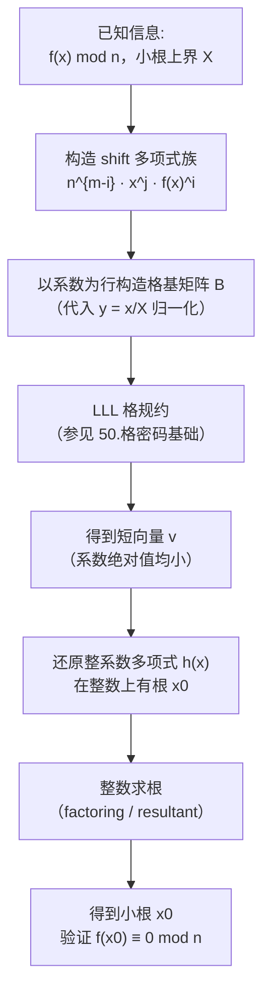
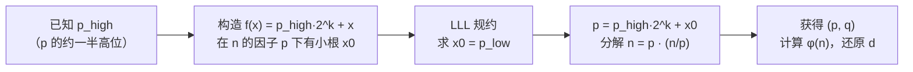

# 密码学（59）· RSA-Coppersmith攻击

> [!abstract] TL;DR
> - **Coppersmith 方法（1996）**：给定模 `n` 的首一多项式 `f(x)`，若存在小根 `|x0| < n^{1/d}`（d 为多项式次数），可在多项式时间内求出该根——核心工具是 **LLL 格规约**（见 [[50.格密码基础]]）。
> - 直觉：把"模多项式方程的小根"转化为"构造系数绝对值都小的整系数多项式"，后者的根在整数上也是 `f(x) mod n` 的根，直接用数值方法求解即可。
> - **典型危险场景（防御视角）**：① 已知明文高位/低位（partial known plaintext）② 短填充 / Franklin-Reiter 相关消息升级版（见 [[56.RSA共模与小公钥指数攻击]]）③ Stereotyped messages（含已知模板的消息）④ 部分私钥 d 比特泄露恢复全私钥 ⑤ 已知 p 高位约一半即可分解 `n`。
> - **为何"看似安全实则可破"**：攻击者只需已知消息的一部分结构（或填充格式、或密钥的少量比特），便可将暴力搜索空间压缩到 `n^{1/d}` 以内，格规约代劳完成剩余搜索。
> - **防御**：OAEP 随机填充彻底消除消息结构；保护私钥不泄露任何比特；密钥 ≥ 2048 位；不自行设计填充方案。

本篇是 [[55.RSA攻击概览]] 攻击子系列的最后一篇，承接 [[22.RSA详解]] 的 RSA 数学原理与 [[50.格密码基础]] 的 LLL 算法，同时与 [[56.RSA共模与小公钥指数攻击]] 中的 Franklin-Reiter 相关消息攻击形成递进关系。读者需了解 RSA 基本流程（模幂、公私钥、填充方案）以及格的直觉概念（基、LLL 规约）；本篇以**防御视角**展开，每个攻击场景都以"为什么有效 → 如何防御"的结构呈现。

---

## 概述与定位

1996 年，Don Coppersmith 在 Eurocrypt 上发表了题为 *Finding a Small Root of a Univariate Modular Equation* 的论文，提出了一个令密码学界震惊的结论：**RSA 中某些"足够小"的未知量，即使只知道其周围的部分结构，也可以在多项式时间内被高效求解**。这与朴素暴力搜索的指数级代价形成了鲜明对比。

Coppersmith 方法的应用场景与 RSA 的种种"危险参数"高度重叠：

| 场景 | 危险参数 | Coppersmith 如何介入 |
|---|---|---|
| 小 `e` + 已知明文高位 | `e` 小（如 3），消息含已知前缀 | 把未知部分设为小变量，构造模多项式 |
| 短随机填充 / 相关消息 | 填充长度不足（< `n^{1/e²}` 量级） | Franklin-Reiter 升级为 Coppersmith 短填充攻击 |
| Stereotyped messages | 消息模板已知，未知量只有少数比特 | 未知量即小根 |
| 部分私钥泄露 | 已知 `d` 的高位或低位若干比特 | 从已知比特构造多项式，恢复全部 `d` |
| 已知 p 高位 | 已知 `p` 约一半比特 | 令 `p = p_known + x`，对 `n` 模多项式求小根 x，分解 `n` |

> [!warning] 攻击篇定位
> 本篇内容用于安全教育与防御设计。所有数学分析最终落点是"什么样的参数/填充/实现会引入此风险"以及"如何避免"，不提供面向真实系统的武器化利用。

---

## 原理与机制

### Coppersmith 核心定理（直觉版）

**定理（非正式表述）**：给定模 `n` 的首一整系数多项式

```
f(x) = x^d + a_{d-1} x^{d-1} + ... + a_1 x + a_0   (首一，次数为 d)
```

若存在整数 `x0` 满足 `f(x0) ≡ 0 (mod n)` 且 `|x0| ≤ n^{1/d} / 2`（称为"小根"），则可在多项式时间内求出 `x0`。

**为什么 `n^{1/d}` 是分界线？**

直觉来自维度与体积的平衡：LLL 规约能保证找到格中长度最多约为 `det(L)^{1/dim}` 量级的短向量（参见 [[50.格密码基础]] 的 LLL 保证）。Coppersmith 的构造巧妙地将多项式的"小根条件"等同于某个格中存在足够短的向量——当 `|x0| < n^{1/d}` 时，对应格向量的长度恰好落在 LLL 可找到的范围内。

**为什么找到短向量后就能得到小根？**

如果我们从 `f(x) mod n` 出发，构造一族辅助多项式（Coppersmith 的 "shifts" 技巧），这族多项式在 `x0` 处同时为零，而它们的系数向量张成一个格 `L`。若某个格向量足够短（系数绝对值都小），对应的整系数多项式 `h(x)` 满足：

```
h(x0) = 0   在整数上成立（非模运算！）
```

于是可以用标准的整系数方程求根算法（如 SageMath 的 `roots()`、数值分解）直接求 `x0`——彻底绕过了模逆运算的困难。

### 格构造的核心步骤

```
设 f(x) 次数为 d，小根上界 X = n^{1/d}
选参数 m（提升次数，越大越精确，但格维数更高）

构造辅助多项式族（"shift" 技巧）：
    g_{i,j}(x) = n^{m-i} · x^j · f(x)^i
    其中 0 ≤ i ≤ m，0 ≤ j < d（i=m 时）或 j=0（i<m 时）

各 g_{i,j} 以各幂次系数为行，代入 y = x/X（归一化）后得到系数矩阵 B
对 B 做 LLL 规约 → 得到短向量 v
v 对应的多项式 h(x) 在整数上有根 x0
对 h(x) 求整数根 → 得到 x0
验证 f(x0) ≡ 0 (mod n)
```

> [!note] 参数 m 的选取
> 实际实现中，`m` 通常取 `ceil(log n / log X)` 附近的整数。`m` 越大，格维数越高（约 `d·m`），LLL 运行时间增加，但成功概率提升。在 CTF 实现中常见 `m = 4` 至 `m = 8`；学术证明通常取 `m = Θ(log n)`。

### 从模根到格规约的流程图



---

## 典型攻击场景详解

### 场景一：已知明文部分位（Partial Known Plaintext）

**设定**：`e = 3`，加密时无填充（或填充方案已知）。攻击者已知明文 `m` 的高位 `m_high`，设未知低位为 `x`，则

```
m = m_high · 2^k + x       （k = 未知位数）
c = m^3 mod n
```

构造多项式：

```
f(x) = (m_high · 2^k + x)^3 - c  ≡ 0 (mod n)
```

其中 `x` 满足 `|x| < 2^k`。只要 `2^k < n^{1/3}`（即未知位数少于密钥长度的约 1/3），Coppersmith 方法即可求出 `x`，从而还原完整明文。

**防御为何有效**：OAEP 中随机种子 `r` 长度约为哈希长度（SHA-256 = 32 字节），保证即使攻击者知道消息模板，由于 `r` 的随机性，每次加密的完整明文块都是不可预测的大随机数，无法构成"小根"条件。

### 场景二：短填充攻击（Coppersmith's Short Pad Attack）

这是 [[56.RSA共模与小公钥指数攻击]] 中 Franklin-Reiter 相关消息攻击的"升级版"。

**设定**：`e = 3`，使用自定义短随机填充（如填充 `r`，长度 `|r| < n^{1/9}`）。相同消息 `m` 被填充两次发送：

```
m1 = m · 2^k + r1
m2 = m · 2^k + r2
c1 = m1^3 mod n
c2 = m2^3 mod n
```

攻击者知道 `c1, c2, e=3, n`，以及 `r1, r2` 的长度上界 `k`（但不知道具体值）。

步骤：
1. 令 `g1(x) = x^3 - c1`，`g2(x) = (x + r2 - r1)^3 - c2` 均以 `m1` 为根
2. 计算 `gcd(g1(x), g2(x))` 在模 `n` 的多项式环上 → 得到线性因子 `x - m1`（Franklin-Reiter）
3. 若 `r1, r2` 也未知，换 Coppersmith：令 `Δ = r1 - r2`（未知），构造双变量问题再降维，当 `|Δ| < n^{1/9}` 时可解

**直觉**：填充越短，未知随机量越小，越容易成为 Coppersmith 方法的"小根"。填充必须足够长，才能把搜索空间推到格规约无法覆盖的范围之外。

### 场景三：Stereotyped Messages（模板消息）

**设定**：消息含有大量已知固定内容（如协议头、格式字段），只有少数比特未知：

```
m = "ENCRYPTED MESSAGE: " || unknown_8_bytes || " TIMESTAMP:2024"
```

未知部分 `x`（64 位，约 `2^64` 搜索空间），密文 `c = m^e mod n`（`e = 65537`，`n = 2048` 位）。

构造多项式：

```
f(x) = (m_template_with_x)^e - c  ≡ 0 (mod n)
```

当 `e` 不小但 `x` 确实很小（`< n^{1/e}`），Coppersmith 仍然适用——但 `e = 65537` 时 `n^{1/65537}` 约为 `2` 的 0.03 位，几乎无用；此场景更多出现在 `e = 3` 或 `e = 17` 的旧系统中。

> [!note] 为什么 e=65537 能缓解此攻击
> `n^{1/e}` 随 `e` 增大急剧缩小。`e = 65537` 时，若用 1024 位的 `n`，小根上界 `n^{1/65537} ≈ 2^{0.016}`，远小于 1 比特——实际上不存在任何有意义的整数小根，Coppersmith 失效。这正是 `e = 65537` 相比 `e = 3` 在此类攻击下更安全的数学原因。

### 场景四：部分私钥泄露（Partial Key Exposure）

**设定**：攻击者通过侧信道、内存泄漏或 HSM 缺陷，知道了私钥 `d` 的约 1/4 低位比特（称 `d_low`）：

```
d = d_high · 2^k + d_low      （d_low 已知，d_high 未知）
```

注意 `e · d ≡ 1 (mod φ(n))`，即 `e · d = 1 + k · φ(n)` 对某整数 `k` 成立。从已知的 `d_low` 可以推导出 `φ(n) mod 2^k` 的近似值，再进一步——

构造多项式（简化描述）：

```
令 φ = φ(n)（未知），p 满足 n = p · q
已知 e · d_low ≡ 1 + ... (mod 2^k)，可枚举 k 的候选值（数量小）
对每个候选，以 p 的未知高位为变量构造 Coppersmith 多项式
当已知 d 的低位 ≥ n^{1/4} 时，可以在多项式时间内恢复全部 d 并分解 n
```

**Boneh-Durfee-Frankel 定理**（1998）：在已知 d 的低 `n^{1/4}` 比特的前提下，可在多项式时间内分解 `n`。

**防御**：HSM 必须严格阻止任何私钥比特的侧信道泄露；`d` 绝不分割存储；私钥操作必须在受保护的安全飞地（TEE/HSM）内执行。

### 场景五：已知 p 高位——Coppersmith 分解

**设定**：攻击者通过某种渠道（如旧密钥文件部分覆盖、内存残留）知道了素因子 `p` 的高位 `p_high`（约占 `p` 的一半比特）：

```
p = p_high · 2^k + x_low   （x_low 未知，k ≈ n^{1/2} / 2 即约 512 位）
```

由于 `p | n`，令：

```
f(x) = p_high · 2^k + x     （一次多项式，d=1）
```

条件：`n ≡ 0 (mod p)`，即 `f(x0) · q ≡ 0 (mod n)`——等价于 `f(x0) ≡ 0 (mod p)`。

但 p 未知，Coppersmith 直接对 `n` 操作：令 `g(x) = n mod (p_high · 2^k + x)` 需要特殊处理，实际做法：

```
对模 n 的多项式 f(x) = p_high · 2^k + x（次数 d=1）
小根上界 X = 2^k ≈ n^{1/2}
当 k ≈ (1/2)log n 时，X ≈ n^{1/2} > n^{1/d=1}——注意 d=1 时界为 n^1 = n
```

> [!note] 实际 Coppersmith 分解的边界
> 以上分析（`d=1`，模 `n`）对应单模版本，界为 `n^{1/d=1} = n^1`，此时 `X ≈ n^{1/2}` 不满足界，无法直接适用。
>
> **以下进入未知因子版（Coppersmith for unknown divisors，模 n 的未知因子 p≥n^β）**：严格地说，Coppersmith 直接对 `f(x) mod p`（未知模数 `p`）的形式需要使用**双模版本（Coppersmith for unknown divisors）**：对于 `f(x) ≡ 0 (mod p)` 且 `p | n`，当 `|x0| < n^{β²/d}` 且 `p > n^β` 时可求解。对 `β = 1/2`（p 约为 `sqrt(n)`）、`d = 1`，界为 `n^{1/4}` 即约 512 位 `n` 中需知道 `p` 的高 256 位（1/4 `n` 的比特数）——已知约 `log p / 2` 即可。工程结论：**知道 p 约一半的比特即可分解 n**。



---

## 算法流程：实现 Coppersmith 单变量攻击

以下给出防御研究级别的伪代码（以 `e = 3`、已知明文高位为例），说明 Coppersmith 实现的关键步骤：

```python
# 场景: e=3, 已知 m 的高 2/3 位，求低 1/3 位
# 参数: n (RSA 模数), e=3, c (密文), m_high (已知高位), k (未知低位数)

def coppersmith_partial_known(n, e, c, m_high, k):
    X = 2**k                        # 小根上界
    # 构造目标多项式 f(x) = (m_high * 2^k + x)^e - c
    # 在 SageMath / Fpylll 中:
    R.<x> = PolynomialRing(ZZ)
    f = (m_high * 2**k + x)**e - c
    # 归一化: 代入 y = x / X，使根变为 |y0| < 1
    # Coppersmith shift 构造（m 次提升，d*m 维格）
    m_param = ceil(log(n) / (e * log(X)))
    shifts = []
    for i in range(m_param + 1):
        for j in range(e if i == m_param else 1):
            shifts.append(n**(m_param - i) * x**j * f**i)
    # 以系数行组成格基矩阵 B，对 B 做 LLL
    B = build_lattice_from_coeffs(shifts, X)
    B_reduced = LLL(B)              # fpylll / SageMath LLL
    # 还原短向量对应的多项式 h(x)
    h = reconstruct_poly(B_reduced[0], X)
    # 整数求根
    roots = h.roots()
    for (r, _) in roots:
        m_candidate = m_high * 2**k + r
        if pow(m_candidate, e, n) == c:
            return m_candidate      # 找到明文
    return None
```

> [!warning] 此代码为概念演示
> 真实实现依赖 SageMath 的 `small_roots()` 或 fpylll 库，且对参数 `m` 和 `t`（辅助提升次数）的选取有精确要求；不同次数 `d` 和不同上界 `X` 的组合会导致格维数和成功概率的变化。

---

## 攻击条件对比总览

| 攻击变体 | 所需已知信息 | 关键条件 | 被攻击参数 |
|---|---|---|---|
| 已知高位明文 | `m_high`（高位），`e=3` | 未知位数 `< n^{1/3}` 的比特数 | 无填充或固定填充 |
| 短填充攻击 | 两份密文 `c1,c2`，`e=3` | 填充长度 `< n^{1/9}` 量级 | 自定义短随机填充 |
| Stereotyped | 消息模板（大部分已知） | 未知段 `< n^{1/e}` | 小 `e` 且消息结构化 |
| 部分私钥 d | `d` 的低 1/4 位 | 已知位数 `≥ n^{1/4}` | 私钥比特泄露 |
| 已知 p 高位 | `p` 的约一半高位 | 已知位数 `≥ log(p)/2` | `n` 的因子信息泄露 |

---

## 安全性与正确使用

### 为什么 OAEP 能从根本上防御

Coppersmith 攻击的所有变体都依赖一个前提：**攻击者能对明文空间构造一个含小未知量的多项式**。OAEP 消除这个前提的方式是：

```
OAEP 编码后的内容:
   maskedDB  = DB  XOR MGF(r, ...)      r 是 256 位真随机种子
   maskedSeed = r  XOR MGF(maskedDB, ...)

即使攻击者知道消息 M 本身，整个编码块因随机种子 r 而完全不可预测
```

攻击者面对的 `m_padded` 不含任何可利用的"小量"结构，无法构成合法的 Coppersmith 多项式——攻击在填充层面就被彻底瓦解，与密钥长度或 `e` 的大小无关。

### 为什么 `e = 65537` 比小 `e` 安全得多

| 公钥指数 `e` | `n^{1/e}` 上界（n=2048 位） | 实际意义 |
|---|---|---|
| `e = 3` | `n^{1/3}` ≈ 683 位 | 未知量 < 683 位即可用 Coppersmith |
| `e = 17` | `n^{1/17}` ≈ 121 位 | 未知量 < 121 位 |
| `e = 65537` | `n^{1/65537}` ≈ 0.03 位 | 实际上无任何整数小根存在 |

`e = 65537` 从数学上使单变量 Coppersmith 攻击失效，这是推荐使用 `65537` 而非 `3` 或 `17` 的重要理由之一（除了加密速度和其他攻击面）。

### 防御清单

> [!tip] 防御 Coppersmith 攻击：工程最佳实践
> 1. **强制 OAEP 填充**：加密必须用 `RSA-OAEP + SHA-256`（或更强）；绝不使用无填充的 Textbook RSA，也不自行设计短填充
> 2. **e = 65537**：不使用 `e = 3`、`e = 17` 等小指数；即使配合 OAEP，历史上已有多个侧信道路径利用小 `e` 加速其他攻击
> 3. **保护私钥任何比特**：部分私钥泄露（哪怕只有 `n^{1/4}` 位）就足以让 Coppersmith 分解 `n`；私钥操作必须在 HSM/TEE 内执行，使用恒定时间实现
> 4. **素数独立生成**：每次密钥生成都用 CSPRNG 生成独立的 `p, q`，不复用任何中间结果（防止 p 高位泄露路径）
> 5. **足够长的密钥**：2048 位是当前最低门槛，高安全场景用 3072；密钥越长，即使在 `e = 3` 场景下 `n^{1/d}` 的绝对比特数也更大，攻击者搜索空间更难被格规约覆盖
> 6. **不信任"填充看起来够用"**：填充方案的安全性应经过正式证明（OAEP 在随机预言机模型下 IND-CCA2 安全），而非依赖工程直觉估算"填充已经足够随机了"

### Coppersmith 与格密码的双重角色

值得注意的是，LLL 格规约在这里扮演了**攻击工具**的角色（见 [[50.格密码基础]] 中对 LLL/BKZ 的介绍：它们既是格密码的安全分析工具，也是攻击者手中的利刃）。格密码（Kyber、Dilithium）之所以被认为抗量子，正是因为其安全参数被设计成使 BKZ 的代价超出量子计算机的能力范围——而 Coppersmith 攻击对 RSA 的成功，恰恰说明了若安全参数设计留有"小根空间"，格规约就能高效利用它。

---

## 小结

| 要素 | 关键点 |
|---|---|
| **核心定理** | 首一模多项式若有小根 `|x0| < n^{1/d}`，LLL 格规约可在多项式时间求出 |
| **数学工具** | LLL 格规约 + 系数矩阵 + 整系数多项式整数根 |
| **危险场景** | 已知部分明文位、短填充、Stereotyped 消息、部分私钥泄露、已知 p 高位 |
| **共同前提** | 未知量落在 `n^{1/d}` 以内；消息/密钥存在可被建模的小变量结构 |
| **根本防御** | OAEP 随机填充消除结构；e=65537；严密保护私钥每一比特；HSM 恒定时间实现 |
| **与格密码关系** | LLL 是双刃剑：攻击 RSA 的工具，也是评估后量子格参数安全的标尺 |

Coppersmith 方法是"小根可破、结构可利用"这一思想的最深刻体现。它提醒密码工程师：加密系统的安全性不仅取决于密钥本身，更取决于**消息在进入模幂运算前是否被真正随机化**。从这个意义上说，OAEP 的每一个随机比特都是对 Coppersmith 攻击的直接抵御。

---

## 相关阅读

- [[22.RSA详解]] — RSA 完整原理：密钥生成、模幂、OAEP/PSS 填充
- [[50.格密码基础]] — LLL 算法、SVP/CVP 困难问题、格规约直觉
- [[55.RSA攻击概览]] — RSA 攻击四大类全景地图
- [[56.RSA共模与小公钥指数攻击]] — Franklin-Reiter 相关消息攻击（本篇 Coppersmith 短填充的前置）
- [[57.RSA-Wiener与小私钥攻击]] — 连分数恢复小私钥 d
- [[58.RSA-Bleichenbacher与padding-oracle]] — PKCS#1 v1.5 填充 oracle，ROBOT 攻击
- [[49.后量子密码概览]] — 量子计算对 RSA 的根本威胁与格密码替代方案
- [[43.随机数与熵]] — CSPRNG 生成高质量素数，弱随机的灾难性后果

---

⬅️ 上一篇 [[58.RSA-Bleichenbacher与padding-oracle]] ｜ 🏠 [[00.密码学总览]] ｜ 下一篇 [[60.对称密码攻击]] ➡️
