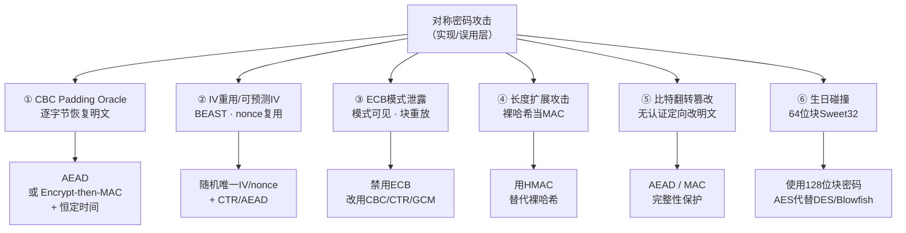
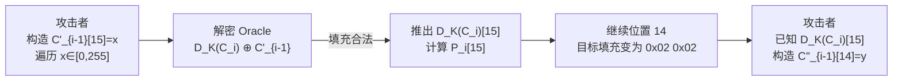
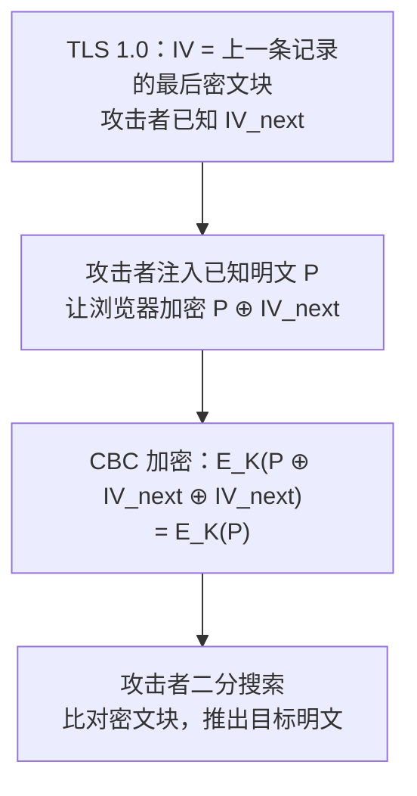
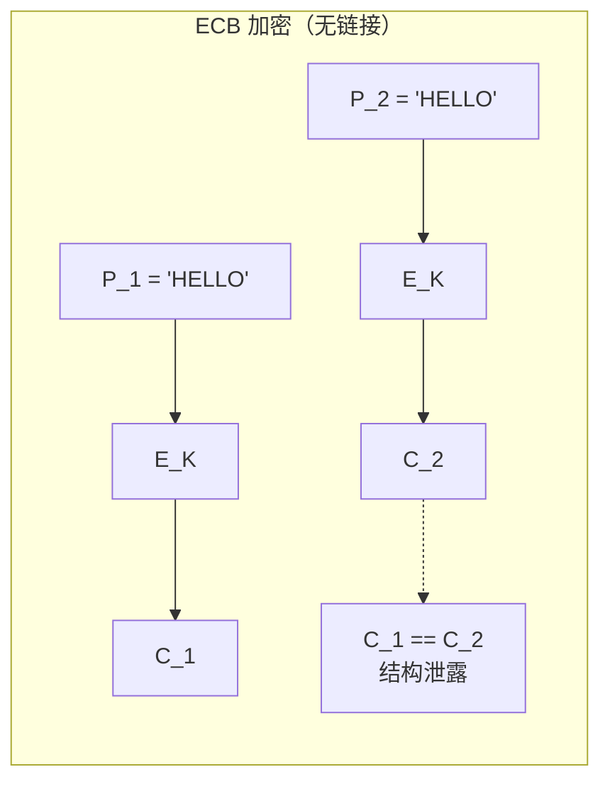
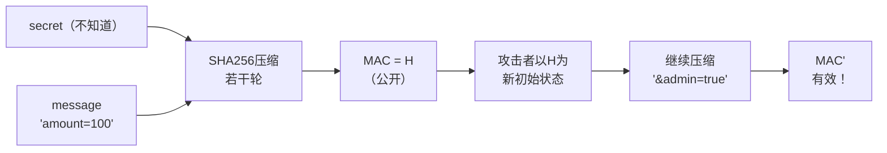
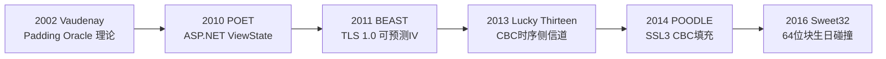

# 密码学（60）· 对称密码攻击

> [!abstract] TL;DR
> 本篇从防御者视角系统梳理对称密码"实现与误用"层的经典攻击。核心教训只有一条：**无认证的加密是危险的——攻击者无需拿到密钥，只要能观察解密端的任何"差异响应"，就能恢复明文甚至伪造消息。** 六类攻击：① CBC Padding Oracle（观察填充合法性逐字节恢复明文）；② IV 重用与可预测 IV（BEAST、流密码 nonce 复用两次一密）；③ ECB 模式泄露（相同明文块 → 相同密文块）；④ 长度扩展攻击（裸哈希当 MAC 被追加伪造）；⑤ 比特翻转篡改（无认证可精确控制明文字段）；⑥ 生日与 64 位块碰撞（Sweet32）。防御汇总：**AEAD、唯一随机 IV/nonce、HMAC、恒定时间比较、弃用弱模式**。

---

## 概述与定位

密码学攻击通常分为三层：

- **算法层**：攻击密码原语本身（差分分析、线性分析、代数攻击等）；
- **协议层**：攻击多方协议的交互逻辑（重放、中间人、降级协议等）；
- **实现/误用层**：即本篇主题——算法正确、协议合理，但工程实现把填充信息暴露给外部、IV 复用、模式选错、没加 MAC……

实现层攻击往往只需要极少的假设，却能造成"和直接拿到密钥一样"的破坏效果。Vaudenay 2002 年的 Padding Oracle、BEAST（2011）、Lucky Thirteen（2013）、POODLE（2014）、Sweet32（2016）——这一串真实协议事件说明：**选错模式或做错实现，密码学保证在现实中轰然崩塌**。

本篇与以下篇章高度关联：

| 关联篇 | 关系 |
|---|---|
| [[12.CBC模式]] | Padding Oracle、比特翻转、BEAST 的机制基础 |
| [[11.ECB模式]] | ECB 模式泄露与企鹅图攻击 |
| [[18.流密码总论]] | 同步流密码的 nonce 重用两次一密 |
| [[29.哈希函数原理]] | Merkle-Damgård 构造与长度扩展攻击 |
| [[15.AEAD原理与GCM]] | 本篇所有攻击的统一防御路径 |
| [[61.侧信道攻击]] | Lucky Thirteen 时序攻击的深化 |

---

## 攻击分类与防御全景



---

## 原理与机制

### 一、CBC Padding Oracle 攻击

#### 背景：Vaudenay 2002

Serge Vaudenay 在 2002 年 EUROCRYPT 发表的论文首次系统描述了 Padding Oracle 攻击。其核心洞察：**只要解密服务对"填充是否合法"的响应存在可区分差异（错误码、HTTP 状态码、响应时长均可），攻击者就能把它当作"预言机（Oracle）"，在不知道密钥的情况下，逐字节恢复任意密文块对应的明文。**

#### 数学前提：CBC 解密公式

复习 [[12.CBC模式]] 的解密公式：

```
P_i = D_K(C_i) ⊕ C_{i-1}
```

其中 `D_K(C_i)` 是块密码的原始解密输出（与密钥有关，与 `C_{i-1}` 无关），`⊕ C_{i-1}` 才是最终的明文。

这意味着：如果攻击者**可控地修改 `C_{i-1}`**，就能操控 `P_i`——完全不依赖 `D_K` 的具体值。

#### PKCS#7 填充校验规则

AES 块大小 16 字节。明文不足 16 字节时用 PKCS#7 填充：差 n 字节则追加 n 个值为 `n` 的字节（详见 [[12.CBC模式]] "PKCS#7 填充"节）。解密后校验：末尾 n 个字节是否均等于 n，合法才剥离，否则报"填充错误"。

这个"合法/非法"的二元反馈，就是 Oracle。

#### 攻击流程（以一个 16 字节块为例）

目标：在不知道 K 的情况下，恢复密文块 `C_i` 对应的明文 `P_i`。

**攻击者持有**：`C_{i-1}`（前驱密文块）和 `C_i`（目标密文块），以及 Oracle（解密服务）。

**第一步：恢复 `P_i` 的最后一个字节（位置 15）**

构造修改后的前驱块 `C'_{i-1}`，仅改最后一个字节：

```
C'_{i-1}[15] = x      （x 从 0x00 遍历到 0xFF）
C'_{i-1}[0..14] = C_{i-1}[0..14]   （其余不变）
```

把 `(C'_{i-1} || C_i)` 发给 Oracle。Oracle 会计算：

```
P'_i[15] = D_K(C_i)[15] ⊕ x
```

当 Oracle 报"填充合法"，说明 `P'_i[15] == 0x01`（最简单的单字节合法填充），即：

```
D_K(C_i)[15] ⊕ x == 0x01
→ D_K(C_i)[15] == x ⊕ 0x01
```

从而：

```
P_i[15] = D_K(C_i)[15] ⊕ C_{i-1}[15]
        = (x ⊕ 0x01) ⊕ C_{i-1}[15]
```

x 已知（攻击者选定的），`C_{i-1}[15]` 已知（密文），`P_i[15]` 即可算出。

> [!note] 注意 0x01 陷阱
> 当 x 恰好让 `P'_i[15] == 0x01` 时合法，但有极低概率 x 让末尾两字节碰巧等于 `0x02 0x02` 也合法。实际实现会先暂存候选值并做交叉验证排除假阳。

**第二步：推导前一字节（位置 14），以此类推**

已知 `D_K(C_i)[15]`，现在要让解密后末两字节均为 `0x02`：

```
C''_{i-1}[15] = D_K(C_i)[15] ⊕ 0x02    （让 P'_i[15] = 0x02）
C''_{i-1}[14] = y                        （遍历 y）
```

当 Oracle 合法，说明 `P'_i[14] = 0x02`，同理推出 `D_K(C_i)[14]` 和 `P_i[14]`。

**循环直到位置 0**，每字节最多 256 次查询，16 字节块最多 `16 × 256 = 4096` 次请求完整恢复 `P_i`。



#### 历史案例

| 事件 | 年份 | 原理 |
|---|---|---|
| ASP.NET ViewState（POET） | 2010 | AES-CBC 填充错误与 200/500 HTTP 状态码差异 |
| POODLE（SSL 3.0） | 2014 | SSL 3 CBC 填充规则不够严格，下降攻击迫使降级到 SSL3 |
| Lucky Thirteen | 2013 | TLS CBC MAC 校验时间差异（时序 Oracle）→ 详见 [[61.侧信道攻击]] |

#### 防御

1. **首选 AEAD**：AES-GCM 或 ChaCha20-Poly1305 没有"填充+Oracle"这条攻击链，见 [[15.AEAD原理与GCM]]。
2. **若必须 CBC**：采用 Encrypt-then-MAC——先 AES-CBC 加密，再 HMAC-SHA256(IV || 密文)；接收方**先验 MAC（恒定时间），验证失败立即丢弃，不解密**。
3. **恒定时间响应**：无论填充合法与否，响应时间必须一致，消除时序 Oracle（Lucky Thirteen 的教训）。
4. **禁止 MAC-then-Encrypt**：先 MAC 后加密使得密文+MAC 仍在 CBC 链上，攻击者还是能对密文做 Padding Oracle，验证不到 MAC 就已经解密了。

---

### 二、IV 重用与可预测 IV

#### 2.1 CBC 可预测 IV 与 BEAST 攻击

**BEAST（Browser Exploit Against SSL/TLS）** 由 Duong 和 Rizzo 于 2011 年在 Ekoparty 演示，针对 TLS 1.0 的 CBC 模式实现。

**TLS 1.0 的缺陷**：TLS 1.0 使用**上一条记录的最后一个密文块**作为下一条记录的 IV。换句话说，下一次加密的 IV 对攻击者提前可知（攻击者已经看到了上一条密文）。

**CPA（选择明文攻击）分析**：

CBC 的 IND-CPA 安全性要求 IV 在加密**之前**对攻击者不可预测。若攻击者能在提交明文之前知道 IV：

```
猜测明文 m，预测 IV = IV_next
计算目标块：T = m ⊕ IV_next
观察加密 T 得到的密文 C'
若 C' 等于目标密文块，则猜测正确
```

攻击者通过控制浏览器在 HTTPS 连接上发送已知明文（如注入 JavaScript），用"选择明文+可预测 IV"二进制搜索恢复 HTTPS Cookie 中的秘密字节。



**修复**：TLS 1.1 为每条记录生成**独立的随机 IV**；TLS 1.3 彻底移除 CBC 套件。

> [!warning] IV 不可预测的正确含义
> "每次随机"还不够——IV 必须在攻击者**提交明文之前**对其不可预测。若攻击者能提前观察 IV（如 TLS 1.0 的链式 IV），CPA 安全失效。

#### 2.2 流密码 / CTR 模式的 Nonce 重用：两次一密

同步流密码（[[18.流密码总论]]）和 CTR 模式的加密都是异或密钥流：

```
C1 = P1 ⊕ KS(K, nonce)
C2 = P2 ⊕ KS(K, nonce)    ← 同一 nonce 重用
```

若 nonce 重用，对两条密文异或：

```
C1 ⊕ C2 = P1 ⊕ P2
```

密钥流完全消除，攻击者得到两段明文的异或。若已知其中一段的部分内容（协议头部、格式字段），立即可以还原另一段——**"两次一密（Two-Time Pad）"使一次性密码本的绝对安全彻底崩溃**。

**历史案例**：

- Microsoft Office 2007 加密早期版本在某些场景下复用 nonce，使文档可被逆向；
- WEP 协议使用 24 位 IV，由于生日悖论在几千个包后 IV 碰撞极为普遍，导致 WEP 密钥可在分钟级被恢复；
- RC4 的 WEP 实现进一步因"弱 IV"（密钥调度中前几字节高度相关）被 FMS 攻击和 AirSnort 工具利用。

**防御**：

1. **CTR/GCM**：nonce 必须在同一密钥下**绝对唯一**，推荐 96 位随机 nonce（2^48 条消息前碰撞概率可忽略）。
2. **流密码**：每次加密生成新密钥或新 nonce，绝不复用组合 `(K, nonce)`。
3. **AEAD**：GCM 在 nonce 唯一时提供 IND-CCA2 安全；nonce 重用则同时破坏机密性与完整性（GCM nonce 重用甚至可以恢复认证密钥），参见 [[15.AEAD原理与GCM]]。

---

### 三、ECB 模式泄露

ECB 模式对每个明文块独立加密，不注入任何随机性：

```
C_i = E_K(P_i)      （各块完全独立）
```

**核心缺陷**：相同明文块必然产生相同密文块，结构与重复模式完全可见。



**攻击面**：

- **企鹅图攻击（ECB Penguin）**：对同一幅图像的像素块做 ECB 加密，密文图像仍清晰呈现原图轮廓——Adobe 2013 年密码泄露事件中，ECB 加密的 1.53 亿条密码因重复块直接被彩虹表映射；
- **块重放/剪切-粘贴**：攻击者把一条密文中表示"权限=admin"的块，粘贴到另一条消息中，服务器解密后得到攻击者伪造的字段；
- **块重排序**：仅重新排列密文块顺序，服务器解密后得到重排的明文，而 MAC 仍然通过（若按块验证）。

**防御**：

- **绝不在需要机密性的场合使用 ECB**，参见 [[11.ECB模式]]；
- 改用 CBC（配 HMAC）、CTR 或 AEAD。

---

### 四、长度扩展攻击

#### 原理：Merkle-Damgård 构造的副作用

MD5、SHA-1、SHA-256 等基于 Merkle-Damgård 构造（参见 [[29.哈希函数原理]]）。其内部状态演化：

```
H_0 = IV（固定初始值）
H_i = compress(H_{i-1}, block_i)
hash(M) = H_n     ← 最终状态就是哈希值
```

**关键事实**：给定 `H = hash(M)`，攻击者可以把 `H` 当作**新的"中间状态"**，继续压缩额外的块，得到 `hash(M || padding || extra)` 的哈希值——而无需知道 M 本身。

#### 裸哈希 MAC 被伪造

若系统用 `MAC = H(secret || message)` 做消息认证：

```
合法消息：M = "amount=100"
MAC = SHA256(secret || "amount=100")
```

攻击者知道 `MAC` 和 `len(secret)` 的大致范围（或通过枚举），可以计算：

```
MAC' = SHA256_extend(MAC, "amount=100", padding, "&admin=true")
```

并构造伪造消息：`M' = "amount=100" || padding || "&admin=true"`，配上 `MAC'`，发给服务器——服务器用 `H(secret || M')` 验证，结果与 `MAC'` 一致，**伪造成功**，攻击者从未得到 secret。



**受影响算法**：MD5、SHA-1、SHA-2 全族（包括 SHA-256、SHA-512）。

**不受影响**：SHA-3（Keccak 海绵结构，内部状态不暴露）、HMAC（双重压缩 + 内外两层密钥）。

#### 防御

1. **用 HMAC**，而非裸哈希：

```
HMAC(K, M) = H((K ⊕ opad) || H((K ⊕ ipad) || M))
```

内层哈希 `H(K ⊕ ipad || M)` 的结果被外层再次用密钥混入，攻击者无法用中间状态扩展；参见系列内 HMAC 详解。

2. **SHA-3 / BLAKE3** 作为裸哈希不受长度扩展攻击，但认证场合仍推荐 HMAC 接口（规范化、易审计）。
3. **`H(M || K)`（后缀密钥）** 理论上可避免长度扩展，但存在其他设计风险（如对 M 做任意前缀攻击），不推荐自制 MAC。

---

### 五、比特翻转篡改

#### CBC 比特翻转原理

CBC 解密公式：

```
P_i = D_K(C_i) ⊕ C_{i-1}
```

`C_{i-1}` 中某一比特 `j` 被翻转（从 0 变 1 或反之），则解密后 `P_i[j]` 精确翻转，且 `P_{i-1}` 因 `D_K(C_{i-1})` 整体被扰乱而完全乱码。

**攻击者的权衡**：牺牲 `P_{i-1}` 的可读性，换取对 `P_i` 某个字段的精确控制。若明文结构已知（如 JSON、HTTP 头、数据库查询），且"乱码块"对应无关字段（或攻击者可以容忍），则这是一个高度定向的篡改手段。

**示例**：

```
明文（16字节对齐，第一块为 user=alice）：
P1 = "role=user;admin="    ← 块 1
P2 = "false;user=alice;"  ← 块 2（目标）

攻击者翻转 C1 中对应"user" → "admi" 位置的比特：
解密后 P2 = "true;user=alice;"   ← 权限提升！
代价：P1 变成乱码（但攻击者可能不在意）
```

#### CTR/OFB 模式的比特翻转更直接

在 CTR 模式下：

```
C_i = P_i ⊕ KS_i
```

翻转 `C_i[j]` 则 `P_i[j]` 精确翻转，没有"前一块乱码"的代价——**每个位置一对一映射**，篡改代价为零。

**历史案例**：

- 早期 WEP 通过 RC4 + CRC32 加密，CRC32 是线性的，攻击者可构造密文修改使修改后的 CRC32 仍合法，实现无密钥的任意明文修改；
- TLS CBC 在无 MAC 或 MAC 验证之前解密的实现中（如 SSL 3.0 的某些实现）可被比特翻转。

#### 防御

1. **AEAD**：GCM 的 GHASH 认证标签覆盖整个密文，任意位翻转都导致认证失败，不会进入解密，参见 [[15.AEAD原理与GCM]]；
2. **Encrypt-then-MAC**：接收方先验 HMAC，不通过则丢弃，篡改检测在解密之前；
3. **拒绝 MAC-then-Encrypt** 和 **Encrypt-and-MAC（并行）**：两者都会先解密后验 MAC，比特翻转已经改变了明文，即便最终 MAC 失败，侧信道已经泄露或服务端做了有问题的处理。

---

### 六、生日碰撞与 Sweet32（64 位块密码）

#### 生日界

分组密码的工作模式（CBC、CTR 等）在同一密钥下加密 `2^(n/2)` 个 n 位的块后，进入"生日界"——两个密文块碰撞的概率达到 50%。

- **128 位块（AES）**：`2^64` 个块 ≈ 1.47 × 10^11 GB 数据，实践中几乎不可达；
- **64 位块（DES、3DES、Blowfish、CAST5）**：`2^32` 个块 ≈ 32 GB，现代高带宽网络数小时内即可达到。

#### Sweet32 攻击（2016）

Bhargavan 和 Leurent 在 CCS 2016 发表 Sweet32，针对仍在使用的 3DES-CBC（TLS HTTPS）和 Blowfish-CBC（OpenVPN）：

```
当同一密钥下密文块量达到 2^32：
若 C_i == C_j，则 P_i ⊕ IV_i == P_j ⊕ IV_j
攻击者若知道 P_j（或其结构），可推断 P_i 对应字节
```

具体而言，HTTPS 连接上，攻击者让浏览器大量发送已知格式的 HTTP 请求（含认证 Cookie），在约 32 GB 数据后，对碰撞块做差分恢复 Cookie 值。

**防御**：

- 弃用所有 64 位块密码（DES、3DES、Blowfish、RC2、CAST5）；
- 同一密钥下数据量限制：即使 AES-CBC 也应在加密约 2^32 块（64 GB）后轮换密钥；
- TLS 1.3 已从套件中移除全部 64 位块密码。

---

## 真实协议事件时间线



| 事件 | 年份 | 攻击类型 | 目标 | 根因 |
|---|---|---|---|---|
| Vaudenay Padding Oracle | 2002 | CBC Padding Oracle | 通用 CBC 实现 | 填充合法性可区分 |
| POET / ASP.NET | 2010 | Padding Oracle | ASP.NET ViewState | HTTP 状态码差异暴露 Oracle |
| BEAST | 2011 | 可预测 IV | TLS 1.0 CBC | IV = 上一记录末尾密文块 |
| Lucky Thirteen | 2013 | 时序 Padding Oracle | TLS CBC 实现 | MAC 校验耗时与填充长度相关 |
| POODLE | 2014 | CBC Padding Oracle | SSL 3.0 CBC | SSL3 填充规则宽松 + 下降攻击 |
| Sweet32 | 2016 | 生日碰撞 | 3DES / Blowfish | 64 位块生日界 |

---

## 算法流程与结构详解

### Padding Oracle 攻击伪代码

```python
# Padding Oracle 攻击：恢复密文块 C_target 对应的明文
# oracle(ciphertext) -> True（填充合法）/ False（非法）

def padding_oracle_attack(C_prev, C_target, oracle):
    block_size = 16
    D_K = bytearray(block_size)       # 中间值 D_K(C_target)
    P = bytearray(block_size)         # 目标明文

    for pad_byte in range(1, block_size + 1):     # 从末尾往前，填充值 1→16
        for guess in range(256):
            C_prime = bytearray(C_prev)
            # 设置已知字节让末尾 pad_byte-1 个字节输出目标填充值
            for k in range(1, pad_byte):
                C_prime[block_size - k] = D_K[block_size - k] ^ pad_byte
            # 猜测当前字节
            C_prime[block_size - pad_byte] = guess
            if oracle(bytes(C_prime) + bytes(C_target)):
                # 填充合法：D_K[pos] = guess ⊕ pad_byte
                D_K[block_size - pad_byte] = guess ^ pad_byte
                P[block_size - pad_byte] = D_K[block_size - pad_byte] ^ C_prev[block_size - pad_byte]
                break
    return bytes(P)
```

> [!warning] 示例输出为示意
> 上述伪代码省略了"假阳排除"逻辑（当 `pad_byte=1` 时需验证修改邻位不影响合法性）。实际实现还需处理网络重试和多线程。

### 长度扩展攻击伪代码

```python
# 长度扩展攻击：给定 H(secret || message)，伪造 H(secret || message || padding || extra)
# 无需知道 secret

def sha256_length_extension(known_hash_hex, secret_len, message, extra):
    """
    known_hash_hex: 已知 MAC = SHA256(secret || message) 的十六进制
    secret_len:     secret 的字节长度（可通过枚举猜测）
    message:        已知消息
    extra:          攻击者追加的内容
    """
    # 1. 计算 SHA256 填充（SHA256 在 secret||message 后追加的 padding）
    original_len = secret_len + len(message)
    padding = sha256_padding(original_len)      # 0x80 + 0x00...0x00 + 64位长度

    # 2. 恢复中间状态：把 known_hash_hex 拆成 8 个 32 位字
    state = [int(known_hash_hex[i*8:(i+1)*8], 16) for i in range(8)]

    # 3. 以该状态为初始值，继续压缩 extra（并追加新填充）
    forged_hash = sha256_with_initial_state(state, extra, original_len + len(padding))

    # 4. 构造伪造消息
    forged_message = message + padding + extra
    return forged_message, forged_hash
```

---

## 安全性与正确使用

### 各类攻击防御对照表

| 攻击 | 必要前提 | 危害 | 防御措施 |
|---|---|---|---|
| CBC Padding Oracle | 解密端泄露填充合法性 | 无密钥恢复任意明文 | AEAD；或 E-t-M + 恒定时间验证 |
| 可预测 IV（BEAST） | TLS1.0 链式 IV / 应用层 IV 可控 | CPA，恢复加密字段 | 每次加密随机 IV，升级 TLS 1.2+ |
| 流密码 nonce 重用 | 同一 (K, nonce) 加密两条消息 | 两次一密，明文异或泄露 | 严格唯一 nonce；AEAD |
| ECB 模式泄露 | 使用 ECB 模式 | 结构/重复模式可见；块重放 | 禁用 ECB，改用 CBC/CTR/GCM |
| 长度扩展 | 用 SHA-2 裸哈希做 MAC | 无密钥伪造认证消息 | 使用 HMAC；或 SHA-3 |
| 比特翻转 | 无消息认证 | 无密钥篡改明文字段 | AEAD；或 E-t-M |
| Sweet32（64位块） | 使用 3DES/Blowfish + 大量数据 | 生日碰撞，明文恢复 | 改用 AES（128位块） |

### 推荐实践

> [!success] 统一建议：用 AEAD，解决一切
> **AES-GCM** 或 **ChaCha20-Poly1305** 同时提供机密性、完整性与认证，天然规避 Padding Oracle、比特翻转和可预测 IV（通过强制 nonce 唯一性）。参见 [[15.AEAD原理与GCM]]。

1. **对称加密**：优先 AES-256-GCM（硬件加速）或 ChaCha20-Poly1305（无硬件加速环境）；
2. **IV/nonce**：
   - CBC：每次加密用 `os.urandom(16)` 生成，与密文同传，不重用；
   - GCM：96 位随机 nonce，同一密钥下发送消息数不超过 2^32（约 42 亿条）；
3. **MAC**：任何认证场合用 HMAC-SHA256 或 HMAC-SHA3-256，不用裸哈希；
4. **时序安全**：MAC 比较必须使用 `hmac.compare_digest()`（Python）/ `crypto_verify_32()`（libsodium）等恒定时间函数，绝不用 `==` 短路比较；
5. **弃用清单**：
   - 模式：ECB、SSL 3.0 CBC、TLS 1.0 CBC（生产环境）；
   - 算法：DES、3DES、RC4、Blowfish（64 位块）；
   - MAC 构造：`H(secret || message)`、`H(message || secret)` 等裸哈希 MAC；
6. **密钥轮换**：AES-CBC 同一密钥加密数据超过 2^32 块需轮换；AES-GCM 超过 2^32 条消息需轮换（nonce 碰撞概率到 1/2）；

### 最小安全配置清单

```
加密算法：AES-256-GCM 或 ChaCha20-Poly1305
IV/nonce：随机生成，绝不复用
MAC：HMAC-SHA256（MAC 优先验证，恒定时间）
验证顺序：先 MAC，后解密（Encrypt-then-MAC）
时序保护：所有密码学比较使用恒定时间函数
块密码选择：AES（128位块），弃用全部64位块密码
密钥管理：加密密钥与 MAC 密钥独立派生（KDF）
```

---

## 小结

对称密码攻击的根源不在于 AES 本身被破解，而在于**工作模式、IV/nonce 管理、认证构造的工程错误**：

- **CBC Padding Oracle**（Vaudenay 2002）——填充合法性泄露 → 逐字节恢复明文，最多 4096 次请求破一个块；
- **可预测 IV / nonce 重用**——BEAST 让 CPA 成立；流密码 nonce 重用让密钥流抵消变成两次一密；
- **ECB 模式**——相同明文块产生相同密文，结构可见，块可重放；
- **裸哈希 MAC**——Merkle-Damgård 长度扩展，无密钥伪造消息认证；
- **比特翻转**——无 MAC 保护时可精确控制解密明文字段；
- **Sweet32**——64 位块密码生日界约 32 GB，现代带宽轻松触达。

**统一防御路径**：**AEAD**（随机/唯一 nonce）+ **HMAC**（E-t-M 顺序）+ **恒定时间比较** + **弃用弱模式**，可以一次性规避上述所有攻击。

---

## 相关阅读

- [[12.CBC模式]] — CBC 加解密公式、PKCS#7 填充、Padding Oracle 机制基础
- [[11.ECB模式]] — 企鹅图攻击、块重放、模式泄露原理
- [[18.流密码总论]] — 同步流密码、nonce 重用两次一密
- [[29.哈希函数原理]] — Merkle-Damgård 构造、长度扩展漏洞根因
- [[15.AEAD原理与GCM]] — 统一防御路径：机密性 + 完整性 + 认证
- [[61.侧信道攻击]] — Lucky Thirteen 时序攻击深化、恒定时间实现

---

⬅️ 上一篇 [[59.RSA-Coppersmith攻击]] ｜ 🏠 [[00.密码学总览]] ｜ 下一篇 [[61.侧信道攻击]] ➡️
