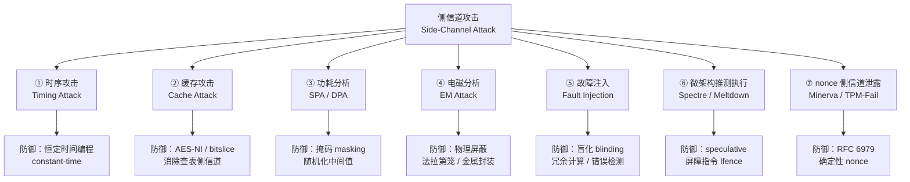

# 密码学（61）· 侧信道攻击

> [!abstract] TL;DR
> - **侧信道攻击（Side-Channel Attack）** 绕过算法本身的数学安全性，改从实现的**物理或微架构泄露**中提取密钥：时间、缓存状态、功耗电流、电磁辐射、故障、推测执行均可成为信息通道。
> - **时序攻击**：非恒定时间比较/模幂让执行时长随密钥位变化；Brumley-Boneh 2003 远程利用 OpenSSL RSA-CRT 时序差异；Lucky13 利用 CBC-HMAC 填充时序恢复明文。
> - **缓存攻击（Flush+Reload / Prime+Probe）**：AES T-table 软件实现的 S 盒查表访问不同 cache 行，泄露密钥字节；AES-NI 硬件指令彻底消除该信道（呼应 [[04.AES详解]]）。
> - **功耗分析（SPA/DPA）**：对智能卡等嵌入式设备，单次迹（SPA）或差分功耗分析（DPA）可逐位恢复密钥。
> - **故障注入**：Bellcore 攻击——向 RSA-CRT 设备注入单次故障，一次错误签名即可用 gcd 分解 n；Rowhammer 提供软件层面故障路径。
> - **微架构推测执行**：Spectre/Meltdown 利用推测执行 + 缓存侧信道跨边界读取密钥内存。
> - **nonce 侧信道泄露**：Minerva / TPM-Fail 从标量乘时序泄露 ECDSA nonce 偏置比特，构成格攻击输入（呼应 [[54.ECDSA-nonce攻击]]）。
> - **防御核心**：恒定时间编程、随机化盲化（RSA/ECC blinding）、掩码（masking）、AES-NI 等硬件加速、物理屏蔽。

本篇是「密码学」系列攻击篇之一，承接 [[60.对称密码攻击]] 的算法层攻击，视角转向**实现与物理层**。读者应先掌握 [[04.AES详解]] 的 T-table 结构与 AES-NI 原理、[[22.RSA详解]] 的 CRT 加速原理、[[54.ECDSA-nonce攻击]] 的格攻击背景。二进制层防护机制见 [[34.现代二进制防护机制/00.现代二进制防护机制总览.md]]。

---

## 概述与定位

### 侧信道的本质：实现即接口

密码算法的数学安全性证明通常基于"黑盒"模型——攻击者只能看到输入输出。但真实实现运行在有血有肉的硬件上：CPU 访问不同内存地址耗时不同，执行不同分支路径耗时不同，智能卡在执行乘法时电流峰值不同，DRAM 在频繁翻转某一行时会扰动相邻行……这些**物理和微架构层面的可观测量**与密钥相关，构成"侧信道"。

> [!note] 侧信道 vs. 算法攻击
> 差分密码分析、线性密码分析等攻击算法本身的数学结构，需要大量已知/选择明文。侧信道攻击则完全不碰数学结构——即便 AES 的 S 盒无任何数学弱点，只要软件实现用了依赖数据的查表，缓存侧信道就能在几秒内还原密钥。这是算法安全与实现安全的根本分野。

### 攻击面全景



---

## 原理与机制

### ① 时序攻击（Timing Attack）

#### 1.1 非恒定时间比较

最简单的时序漏洞来自"短路"字符串比较：

```
// 错误：早期退出，执行时间随第一个不匹配字节的位置而变化
bool naive_compare(const char *a, const char *b, size_t n) {
    for (size_t i = 0; i < n; i++) {
        if (a[i] != b[i]) return false;   // ← 泄露密钥位置
    }
    return true;
}
```

攻击者逐字节猜测 MAC 或口令：当某字节正确时比较耗时略长（因为进入了下一次迭代），通过统计大量测量值即可逐字节枚举，将暴力搜索空间从 O(256^n) 降为 O(256×n)。

**恒定时间比较**应累积所有字节的差异，最终一次性判断：

```
// 正确：恒定时间，不提前退出
int ct_memcmp(const uint8_t *a, const uint8_t *b, size_t n) {
    uint8_t diff = 0;
    for (size_t i = 0; i < n; i++) {
        diff |= a[i] ^ b[i];              // 累积差异，不分支
    }
    return diff;  // 0 代表相等
}
```

Linux 内核的 `crypto_memneq()`、libsodium 的 `sodium_memcmp()` 均采用此模式。

#### 1.2 模幂时序：依赖密钥位的分支

RSA 的私钥操作是模幂 `m^d mod n`，常用"从左到右的二进制方法"（square-and-multiply）：

```
result = 1
for bit in bits_of_d (MSB first):
    result = result^2 mod n          // 总是平方
    if bit == 1:
        result = result * m mod n    // 只在位为 1 时乘
```

若 `bit == 1` 的乘法分支与 `bit == 0` 路径耗时不同（乘法 vs. 跳过），执行总时长就与私钥 d 的汉明重量（Hamming weight）相关，进一步的精密分析可逐位还原 d。

> [!info] Kocher 1996
> Paul Kocher 在 1996 年首次系统描述时序攻击，针对 RSA、Diffie-Hellman、DSS 的各种实现，证明仅凭解密时间差异（毫秒级）即可在受控实验条件下还原私钥。这一论文直接催生了恒定时间实现的需求。

#### 1.3 远程时序攻击：Brumley-Boneh 2003

Brumley 和 Boneh 在 2003 年演示了对同一局域网内 **OpenSSL RSA-CRT**（中国剩余定理加速）的远程时序攻击，无需物理接触目标机器。

RSA-CRT 将模幂拆分为模 p 和模 q 的两次小模幂再用 CRT 合并，大幅提速。OpenSSL 使用了 Montgomery 模乘，其执行时间依赖操作数位长（当中间约简触发额外减法时略慢）。这个时差在同一网段内可被统计：

```
攻击流程（简化）：
1. 选取探测密文集合 {c₁, c₂, ...}，其与真实素数因子 p 的关系不同
2. 大量发送解密请求，精密测量响应时间（μs 级，通过统计去噪）
3. 分析时序分布差异，推断 p 的各位
4. 类似 Kocher 方法，从 MSB 到 LSB 逐位确认 p
5. 得到 p 后 gcd(p, n) = p，再 n/p = q，私钥还原
```

攻击通过约 125 万次查询，在局域网上成功还原了 1024 位 RSA 私钥。这证明了**远程网络时序信道的可行性**——物理距离不再是保护屏障。

防御：OpenSSL 随后引入 **RSA blinding**（见后文"防御"节），让每次解密操作随机化，使时序不再与密钥相关。

#### 1.4 Lucky13：CBC-HMAC 的填充时序

Lucky13（2013，Al Fardan & Paterson）针对 TLS/DTLS 的 CBC+HMAC 模式（MAC-then-Encrypt）。

CBC 解密后需要验证 PKCS#7 填充：

```
明文末尾：... [data] [pad pad pad pad N]
填充字节 N 表示填充长度；合法填充形如 0x00→01, 0x01 0x01→02, ...
```

早期 TLS 实现在"填充无效"和"填充有效但 MAC 错误"两种情况下的处理路径不同，响应时间有微小差异（十几个 TLS 记录处理周期，对应约几微秒）。攻击者通过构造选择密文并测量响应时间，可区分这两种情况，从而对 CBC 密文进行解密。Lucky13 与 **Vaudenay CBC Padding Oracle（2002，参见 `[[60.对称密码攻击]]`）机制同源——均为时序 Oracle**；与 Bleichenbacher 的 RSA 填充 oracle 属不同攻击面。

**Lucky13 的"13"** 来自 CBC-HMAC 中最不利的填充组合使 MAC 计算多处理 13 字节，是攻击利用的关键时差来源。

防御：TLS 1.3 废弃了 MAC-then-Encrypt，统一使用 AEAD（[[15.AEAD原理与GCM]]），从根本上消除该漏洞面；实现层面需恒定时间处理所有填充路径。

---

### ② 缓存攻击（Cache Attack）

#### 2.1 AES T-table 的 cache 信道

[[04.AES详解]] 介绍了 AES-NI 对 cache 时序侧信道的消除；此处展开攻击原理。

软件 AES 的常见优化将 SubBytes + ShiftRows + MixColumns 合并为 4 张 **T-table**（256 项 × 32 位 = 1 KB/表），加密一轮变为 16 次查表和异或：

```
// 典型 T-table 实现（一轮加密，简化）
for col in 0..4:
    s[col] = T0[a[col][0]] ^ T1[a[col+1][1]] ^ T2[a[col+2][2]] ^ T3[a[col+3][3]]
           ^ roundkey[col]
```

问题在于：查哪个 T-table 表项由**密钥与明文的 XOR**决定。现代 CPU 的 cache 行通常为 64 字节，4 KB 的 T-table 对应 64 条 cache 行。不同索引访问不同 cache 行，留下可被测量的足迹。

**Flush+Reload 攻击**（Yarom & Falkner 2014）：

```
1. 攻击者（同一物理机不同进程/VM）先将目标 T-table 从 cache 中驱逐（clflush 指令）
2. 受害者进程执行一次 AES 加密（知道明文）
3. 攻击者探测每条 cache 行的访问延迟：
     - 命中（~4 周期）：受害者访问了该行 → 对应的 T-table 索引被使用
     - 缺失（~200 周期）：受害者未访问该行 → 对应索引未被使用
4. 结合已知明文，每条 cache 行命中推断出密钥的若干位
5. 多轮叠加恢复完整 AES 密钥（通常需数百次加密）
```

**Prime+Probe 攻击**（Osvik et al. 2006）无需共享内存，攻击者先填满（prime）特定 cache 组，再在受害者加密后探测（probe）哪些 cache 组被驱逐，推断受害者的访问模式。适用于不共享页面的跨进程或跨 VM 场景。

> [!warning] 云环境风险
> 同一物理服务器上的不同租户可能通过 Prime+Probe 互相泄露密钥材料。这不依赖内存共享，仅依赖共享 LLC（Last Level Cache）——这在同宿主的虚拟机之间始终存在。

**防御：AES-NI 与 bitslice 实现**

[[04.AES详解]] 已详述：`AESENC` 等 x86 指令在**专用硬件电路**中完成 S 盒查表，不访问 CPU cache，执行时间恒定，Flush+Reload 和 Prime+Probe 对其无效。

无 AES-NI 的平台（如部分 ARM 嵌入式）可用 **bitslice AES**（Biham 1997）：将 128 个 AES 块并行处理，S 盒用逻辑门电路（AND/OR/XOR）而非查表实现，消除数据依赖访存。代价是单块延迟高，吞吐量靠并行弥补。

---

### ③ 功耗分析（Power Analysis）

功耗分析针对能直接采集功耗信号的设备，典型场景是智能卡（IC 卡、SIM 卡、硬件安全模块 HSM）。

#### 3.1 简单功耗分析（SPA, Simple Power Analysis）

SPA 从**单条**功耗迹中直接读取操作序列。以 RSA 的 square-and-multiply 为例：

```
平方操作的功耗波形特征  ≠  乘法操作的功耗波形特征
→ 直接从功耗迹读出 d 的每一位
```

DES/AES 密钥加载阶段、ECC 的双倍点（doubling）与加法（addition）操作，均有不同功耗特征，SPA 往往一次采集即可区分。

#### 3.2 差分功耗分析（DPA, Differential Power Analysis）

Kocher、Jaffe、Jun 在 1999 年提出 DPA，可在存在噪声时统计恢复密钥。

基本思路（针对 AES 第一轮 SubBytes）：

```
假设密钥字节 k[i] 的某个候选值 k_guess：
  对每条采集到的功耗迹 t_j（对应已知明文 p_j）：
    预测中间值 v_j = SubBytes(p_j[i] XOR k_guess)
    取 v_j 的某一位 b_j ∈ {0, 1}

将所有迹按 b_j 分为两组：D₀（b_j=0），D₁（b_j=1）
计算差分迹：ΔD = mean(D₁) - mean(D₀)

若 k_guess == 真实密钥字节：中间值预测正确
  → 分组与实际功耗相关 → ΔD 在特定时刻出现尖峰

若 k_guess 错误：中间值随机 → 两组功耗迹无差别 → ΔD 趋近于 0
```

对所有 256 个 k_guess 重复上述过程，出现最高相关峰的候选即为真实密钥字节。逐字节推断，完整 AES-128 密钥 16 字节可独立破解（不需枚举 2^128）。

**相关功耗分析（CPA）** 是 DPA 的改进版，用 Hamming weight 或 Hamming distance 作为功耗模型，相关系数代替均值差，收敛更快。

**防御——掩码（Masking）**：

将中间值拆分为随机共享，使任何单个共享都与密钥无关：

```
计算 a = SubBytes(x XOR k) 时，引入随机掩码 r：
  x_masked = x XOR r        （对明文加掩码）
  计算 a_masked = SubBytes(x_masked XOR k) XOR SubBytes(r)  （一阶掩码）
  最终解掩码：a = a_masked XOR SubBytes(r)
```

一阶掩码使 DPA（一次功耗迹的单变量攻击）失效；高阶掩码（2 阶、3 阶）可防御 HODPA，但实现复杂度和性能开销倍增。

---

### ④ 电磁分析（Electromagnetic Attack）

芯片运行时产生的电磁辐射携带与功耗几乎相同的信息，且攻击者无需与目标直接接触（可通过感应探针在几毫米内采集）。DEMA（Differential Electromagnetic Analysis）与 DPA 原理相同，只是采集信号从电流变为 EM 辐射。

EM 攻击的优势：可探测芯片**局部区域**的辐射（空间分辨率），而功耗测量只能得到整芯片的总电流。对复杂 SoC（如现代智能卡），EM 可以专门针对密码协处理器区域，噪声更小。

防御：芯片层面的金属屏蔽层（内置法拉第笼）、主动干扰（注入随机噪声电流）、分散布局（让密码运算产生的 EM 辐射难以集中采集）。

---

### ⑤ 故障注入（Fault Injection）

#### 5.1 Bellcore 攻击：一次错误签名分解 RSA

1996 年，Boneh、DeMillo、Lipton（Bellcore 研究院）发现了针对 RSA-CRT 的毁灭性攻击：**只需一次故障签名即可分解 n**。

RSA-CRT 签名：

```
// 正常流程
sp = m^d_p mod p     （d_p = d mod (p-1)）
sq = m^d_q mod q     （d_q = d mod (q-1)）
s = CRT(sp, sq)      （用 CRT 合并）

// 验证：s^e mod n == m（或其哈希）
```

若攻击者在计算 `sq` 时注入故障，使 `sq` 变为错误值 `sq'`：

```
s_faulty = CRT(sp, sq')   ← 错误签名

s_faulty^e mod n     ≡ m mod p  （sp 正确，模 p 这边无误）
s_faulty^e mod n     ≢ m mod q  （sq' 有错，模 q 这边出错）
```

于是：

```
gcd(s_faulty^e - m, n) = p    ← 立即分解 n！
```

由于 gcd 是多项式时间运算，攻击者**只需一个错误签名**就能完成 RSA 公钥体制的根本破坏，完全不需要暴力分解。

故障注入的物理手段：
- **电压毛刺（voltage glitch）**：瞬间拉低/升高供电电压，造成计算错误
- **时钟毛刺（clock glitch）**：在运算关键时刻注入额外时钟边沿
- **激光故障注入（laser fault injection）**：芯片去封装后用激光照射特定晶体管，翻转内存位

防御：
1. 计算两次并比较（冗余计算）：`if CRT_verify(s, m, n) fails: abort`
2. RSA-CRT 签名后用公钥验签，发现错误拒绝输出
3. 随机化 d_p、d_q（每次签名时加入随机倍数，防止故障分析提取精确 d_p/d_q）

#### 5.2 Rowhammer：DRAM 行翻转故障

Rowhammer（Kim et al. 2014，Google Project Zero 2015 实战利用）是纯软件触发的故障攻击：

```
攻击原理：
  DRAM 相邻行之间存在电磁耦合
  若以极高频率（数十万次/秒）反复读取（"hammer"）某一 DRAM 行
  → 相邻行的电容电荷泄漏加速 → 数据位发生翻转

利用方式（经典案例）：
  1. 选择目标：相邻于页表页面的 DRAM 行
  2. 大量 Hammer 该行，翻转页表中的"可写"位或物理地址位
  3. 获得对任意物理内存的写权限（本地提权）
```

Rowhammer 本身不直接攻击密钥，但若密钥材料（如 RSA 私钥、TLS session key）驻留在可被 Hammer 的 DRAM 位置，理论上可造成密钥损坏或借道提权后读取密钥。

密码工程防御：将密钥页面锁定在内存（`mlock`），避免密钥与攻击者页面相邻；更根本的防御在 ECC DRAM 和 DDR5 的目标行刷新（TRR）机制。

---

### ⑥ 微架构推测执行：Spectre / Meltdown

2018 年曝光的 Spectre（CVE-2017-5753/5715）和 Meltdown（CVE-2017-5754）揭示了现代 CPU 推测执行与缓存侧信道的危险组合。

#### 6.1 核心原理

CPU 为提高性能会**推测执行**条件分支之后的代码——即使分支条件尚未求值，CPU 也会猜测走哪条路并提前执行，等分支结果确认后若猜错则撤销寄存器状态。但**cache 状态不被撤销**，这正是侧信道的来源。

**Meltdown（内核→用户泄露）**：

```
// 攻击者用户态代码（简化 Meltdown 序列）
char probe_array[256 * 4096];  // probe 数组，每项一个 cache 页
uint8_t secret = *kernel_addr; // ① 推测执行读取内核内存（会被硬件拒绝，但推测提前执行）
uint8_t junk = probe_array[secret * 4096]; // ② 用密值索引 probe 数组，加载对应 cache 行
// ③ 权限检查触发异常，CPU 撤销 secret 值，但 cache 行已加载
// ④ 攻击者 Flush+Reload probe_array，命中的索引即 secret 值
```

Meltdown 允许普通用户进程在 x86 上读取内核内存（包括内核中缓存的密钥、密码哈希等），修复方案是内核页表隔离（KPTI/Kaiser）。

**Spectre（跨进程 / 同进程泄露）**：利用分支预测训练，让受害进程在错误的分支上推测执行，通过 cache 侧信道泄露信息；修复更为困难，需要软件插入 `lfence`/`retpoline` 等屏障，且对性能有持续影响。

#### 6.2 对密码实现的影响

密码库（OpenSSL、BoringSSL、libgcrypt）中的密钥可能通过推测执行泄露给同宿主的攻击者进程或 VM，即便密钥存储在严格隔离的内存区域。这使侧信道攻击从物理接触攻击扩展到了**软件层面的远程攻击**。

防御：内核层面 KPTI/IBRS/IBPB；密码库层面在敏感操作前后插入推测屏障指令（`LFENCE`）；硬件层面（Ice Lake+）Spectre v2 硬件修复（eIBRS）。

---

### ⑦ nonce 侧信道泄露：Minerva / TPM-Fail

[[54.ECDSA-nonce攻击]] 已详述 ECDSA nonce 的数学漏洞；此处聚焦**硬件侧信道如何泄露 nonce 偏置**。

#### 7.1 Minerva 攻击（2019）

Minerva（Jancar et al. 2019）针对一批实现椭圆曲线标量乘的密码库和智能卡，发现它们的标量乘执行时间与 nonce k 的**最高有效位数量**相关（即 k 的 bit 长度不同，执行时间不同）。

```
攻击流程：
1. 收集大量 ECDSA 签名及对应执行时间
2. 时间差异 → k 的 bit 长度分布 → k 的 MSB 是 0 的概率
3. 这等价于：k 的最高若干位被偏置为 0（Hidden Number Problem, HNP）
4. 代入 LLL/BKZ 格攻击（见 [[54.ECDSA-nonce攻击]] 格攻击节），恢复私钥 d
```

实验中，对某个受影响实现，约 1000 条带时间戳的签名即可恢复 256 位私钥。

受影响产品涵盖 NSS（Firefox 密码库）、Bouncy Castle、多款 PKCS#11 设备。

#### 7.2 TPM-Fail（2019）

TPM-Fail（Moghimi et al. 2019）针对 Intel fTPM（固件 TPM）和 STMicroelectronics 硬件 TPM，通过测量 TPM 执行 ECDSA 签名的时间（精度 μs，远程网络测量即可），提取 nonce 偏置，随后格攻击恢复 256 位 ECDSA 私钥。

攻击只需约 40,000 次签名（Intel fTPM）或 80,000 次（ST TPM），可在 2 小时内完成。这意味着即便是专用安全芯片（TPM）也未能抵抗时序侧信道。

**防御**：
- 标量乘使用**恒定时间实现**（Montgomery ladder 等），不因 k 的位模式而改变执行路径
- 使用 RFC 6979 确定性 nonce（与 k 的随机性无关，但同样需要恒定时间实现）
- 硬件厂商应对发现的时序差异发布固件补丁

---

## 防御体系

### 恒定时间编程（Constant-Time Programming）

恒定时间编程是抵御时序攻击和部分缓存攻击的根本原则，核心要求：

**① 无数据依赖的条件分支**

```
// 危险：if 路径泄露密钥位
if (key_bit) {
    slow_op();   // 时序可见
}

// 正确：用位运算规避分支
uint64_t mask = -((uint64_t)key_bit & 1);  // 位为1时 mask=0xFFFF...，为0时 mask=0
result = (slow_result & mask) | (skip_result & ~mask);
```

**② 无数据依赖的内存访问**

避免用密钥材料作为数组下标（这正是 AES T-table 的问题所在）。若必须查表，使用"混淆查表"（oblivious table lookup）：对每个可能的索引都访问一次，再用位掩码提取目标值——开销很大，通常不如 AES-NI 实用。

**③ 编译器不得优化掉恒定时间代码**

编译器优化可能将精心编写的恒定时间代码"优化"回有分支的版本。需使用：
- `__attribute__((noinline))` 防止内联
- `volatile` 关键字强迫访存
- 汇编实现关键路径
- 专用库（BearSSL、BLST、s2n）提供经验证的恒定时间原语

> [!warning] 编译器不保证恒定时间
> C/C++ 标准对"恒定时间"没有任何保证。`-O2` 可能生成分支代码；LLVM 有实验性的 `SLH`（Speculative Load Hardening）扩展，但生产级支持尚不完善。密码库需在汇编层验证恒定时间性（工具：`ct-verif`、`dudect`、`tlsfuzzer`）。

### 盲化（Blinding）

盲化通过在运算前引入随机因子、运算后消除，使同一密钥每次操作的实际计算值都不同，从而使时序/功耗测量无法与密钥相关。

**RSA 盲化**（消除 Brumley-Boneh 类时序攻击）：

```
// 正常解密：m = c^d mod n（时序依赖 d）
// 盲化解密：
r = random()
c_blind = c * r^e mod n     // 用公钥 e 盲化密文
m_blind = c_blind^d mod n   // 解密盲化密文
m = m_blind * r^{-1} mod n  // 消除盲化因子

// 每次解密 r 不同 → 实际模幂操作数不同 → 时序与密钥无关
```

OpenSSL 在 Brumley-Boneh 论文发表后即引入此盲化，默认启用。

**ECC 标量乘盲化**（防御功耗分析）：

```
// 标量盲化：k' = k + r*n，r 随机，k'*G = k*G（因 n*G = 无穷远点）
// 基点盲化：将 G 替换为 G + R（随机椭圆曲线点 R），运算后减去 R
// 坐标随机化：在射影坐标下随机化 Z 坐标（Jacobi 坐标：(X:Y:Z) → (λ²X:λ³Y:λZ)）
```

### 掩码（Masking / Secret Sharing）

如前述 DPA 防御，将密钥或中间值拆为多个"共享"，使任何单个共享与密钥统计独立。一阶掩码（1st-order masking）由两个共享组成，破坏一阶 DPA；d 阶掩码防御 d 阶 DPA，但实现复杂度 O(d²) 增长。

国际标准 ISO/IEC 17825（Testing methods for the mitigation of non-invasive attack classes against cryptographic modules）规范了功耗攻击及防御测试方法。

### 硬件防御：AES-NI 与安全硬件

如 [[04.AES详解]] 所述，AES-NI 不仅提升性能，更从根本上消除了 T-table 缓存侧信道。类似地：

- **SHA-NI**（x86 SHA 扩展指令）消除 SHA 实现的 cache 侧信道
- **ARMv8 Cryptography Extension**（`AESENC`/`SHA256H` 等）在 ARM 上提供同等保护
- **硬件安全模块（HSM）** 将密钥材料与主系统完全隔离，物理防篡改包装（防拆封检测）

与二进制防护机制（[[34.现代二进制防护机制/00.现代二进制防护机制总览.md]] 中的 ASLR、堆栈保护等）类似，硬件层面的侧信道防护也是"纵深防御"（defense in depth）的重要层次：没有任何单一防御措施能覆盖所有攻击向量，需要软件+硬件+物理多层协同。

---

## 安全性与正确使用

### 核心原则对照表

| 攻击向量 | 关键弱点 | 正确做法 |
|---|---|---|
| 时序攻击（比较） | 短路字符串比较泄露位置 | 使用 `crypto_memcmp` / `sodium_memcmp` 等恒定时间比较函数 |
| 时序攻击（RSA 模幂） | square-and-multiply 有条件分支 | 恒定时间实现（Montgomery ladder）+ RSA blinding |
| 时序攻击（Lucky13） | CBC 填充验证路径不等时 | 迁移至 TLS 1.3 / AEAD；或恒定时间处理所有填充路径 |
| 缓存攻击（T-table AES） | S 盒查表依赖密钥+明文 | 使用 AES-NI（首选）或 bitslice AES |
| 功耗 DPA（AES/DES） | 非掩码中间值与密钥相关 | 一阶或高阶 masking；或使用 AES-NI（功耗也随机化） |
| 故障注入（RSA-CRT） | 单次错误签名可分解 n | 签名后验签；冗余计算并对比结果 |
| Spectre/Meltdown | 推测执行+cache 侧信道 | KPTI/IBRS；密码关键路径插入 lfence |
| nonce 侧信道（ECDSA） | 标量乘时序依赖 k bit 长度 | 恒定时间标量乘；RFC 6979 确定性 nonce |

### 库与 API 的安全选择

**恒定时间比较**：
- Python：`hmac.compare_digest(a, b)`
- C：`CRYPTO_memcmp()`（OpenSSL）、`sodium_memcmp()`（libsodium）
- Go：`subtle.ConstantTimeCompare()`
- Java：`MessageDigest.isEqual()`（Java 6+，恒定时间）

**避免使用**：
- `memcmp()`、`strcmp()`、`==` 直接比较 MAC/密码哈希

**AES 实现**：
- 确认运行环境支持 AES-NI（`cpuid` 检测），优先路径使用硬件指令
- OpenSSL、BoringSSL、libsodium 在 x86/x86-64 上默认启用 AES-NI 路径

**RSA 实现**：
- 使用 OpenSSL（≥1.0.1g）/BoringSSL：已内置 RSA blinding，默认启用
- 私钥操作永远在服务端/HSM 内完成，避免将私钥暴露到可被时序探测的网络接口

**ECDSA**：
- 优先选用 [[28.EdDSA与Ed25519]]（内置确定性，设计上规避 nonce 问题）
- 若必须 ECDSA，使用 RFC 6979 确定性 nonce + 恒定时间实现（如 libsodium、BLST）

> [!warning] "安全"实现的可迁移性
> 一个平台上通过测试的恒定时间实现，移植到另一平台（不同编译器、ISA、优化级别）后可能不再恒定时间。建议在目标平台上用 `dudect` 或 `tlsfuzzer` 做端到端时序测试，而不仅依赖代码审查。

---

## 小结

| 维度 | 说明 |
|---|---|
| 攻击本质 | 绕过算法数学安全性，从实现的物理/微架构可观测量中提取密钥 |
| 时序攻击 | 非恒定时间比较/模幂；Brumley-Boneh 远程 RSA；Lucky13 填充时序 |
| 缓存攻击 | Flush+Reload / Prime+Probe；AES T-table 查表泄露密钥字节 |
| 功耗分析 | SPA 直接读波形；DPA/CPA 差分统计；适用于智能卡/嵌入式 |
| 故障注入 | Bellcore：一次错误 RSA-CRT 签名即可 gcd 分解 n；Rowhammer 软件触发 |
| 推测执行 | Spectre/Meltdown：cache 侧信道跨权限泄露内核/进程内存 |
| nonce 侧信道 | Minerva/TPM-Fail：标量乘时序 → k 偏置 → 格攻击恢复私钥 |
| 防御核心 | 恒定时间编程 + blinding + masking + AES-NI + 物理屏蔽 |
| 工程首选 | `crypto_memcmp` 比较 MAC；AES-NI 加密；RSA blinding 默认启用；ECDSA 用 RFC 6979 |

侧信道攻击的核心教训是：**密码学安全性不等于密码实现安全性**。算法可以在数学上无懈可击，而一行"提前退出"的比较代码、一张查找表、一条未屏蔽的推测执行路径，都可以在几秒或几万次请求内交出密钥。安全实现是密码工程的独立难题，需要与算法设计同等重视。

---

## 相关阅读

- [[04.AES详解]] — T-table 结构与 AES-NI 消除 cache 侧信道的原理
- [[22.RSA详解]] — RSA-CRT 加速原理，Bellcore 攻击的基础
- [[54.ECDSA-nonce攻击]] — nonce 数学漏洞与格攻击，Minerva/TPM-Fail 的格攻击背景
- [[60.对称密码攻击]] — 算法层攻击（差分/线性密码分析），与本篇实现层攻击形成完整对照
- [[62.协议误用与密码工程]] — 协议层的密码工程陷阱，侧信道防御的工程实践延伸
- [[34.现代二进制防护机制/00.现代二进制防护机制总览.md]] — ASLR/KPTI 等系统层防护，与 Spectre/Meltdown 防御的交叉
- [[58.RSA-Bleichenbacher与padding-oracle]] — Padding Oracle 攻击，与 Lucky13 时序攻击同源
- [[15.AEAD原理与GCM]] — AEAD 从根本上消除 MAC-then-Encrypt 类时序漏洞

---

⬅️ 上一篇 [[60.对称密码攻击]] ｜ 🏠 [[00.密码学总览]] ｜ 下一篇 [[62.协议误用与密码工程]] ➡️
