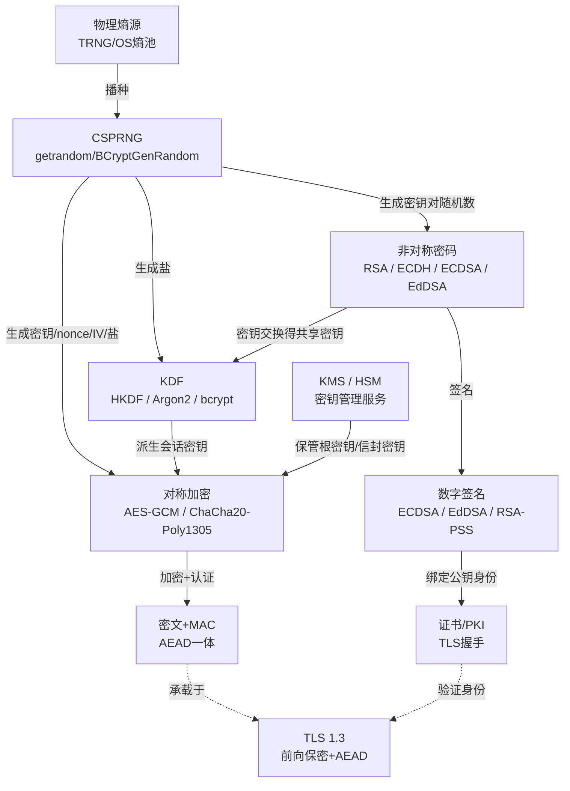
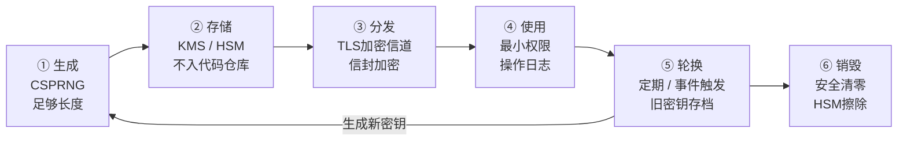
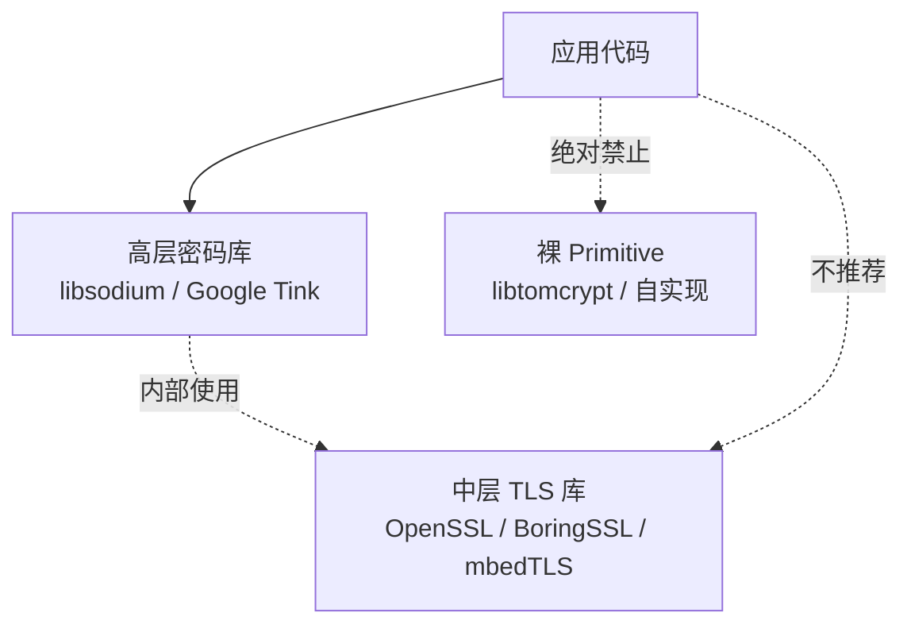
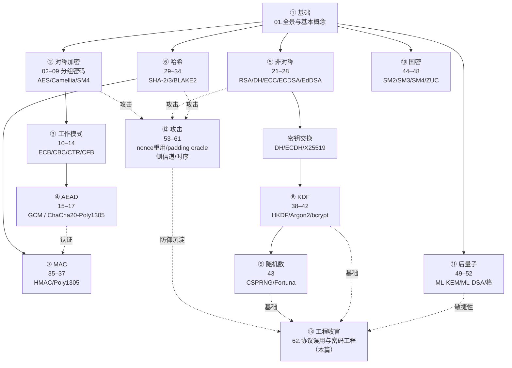

# 密码学（62）· 协议误用与密码工程

> [!abstract] TL;DR
> - **误用是密码系统崩溃的头号原因**：算法本身往往未被攻破，倒下的是弱随机数（→ [[43.随机数与熵]]）、nonce 重用（→ [[15.AEAD原理与GCM]]）、ECB 模式（→ [[11.ECB模式]]）、裸哈希当 MAC（→ [[29.哈希函数原理]]）、明文口令/弱口令哈希（→ [[42.Argon2]]）、密钥硬编码进代码仓库。
> - **用高层库**：libsodium / Google Tink 把正确决策固化进 API，"Don't roll your own crypto"不是口号，是工程原则。
> - **密钥是最贵的资源**：生成用 CSPRNG、存储进 KMS/HSM、不入代码仓、按生命周期轮换销毁；信封加密让密钥永远不以明文形式落盘。
> - **协议层对齐**：TLS 1.3 + AEAD + 前向保密 + 证书校验是现代通信的最低标准（→ [[71.详解网络协议/15.TLS协议.md]]）；协议自己实现一旦降级则全面沦陷。
> - **密码敏捷性是遗留债**：为后量子迁移留接口（→ [[49.后量子密码概览]]），今天的密文明天可能被量子计算机解密。
> - **合规不是终点**：FIPS 140-3 / 国密密评验证的是实现可信度，而非设计正确性——两者都要有。
> - **全系列协同**：对称负责速度、非对称负责密钥分发与签名、哈希+MAC 负责完整性、KDF 把弱口令升格为强密钥、CSPRNG 是所有一切的熵源——62 篇的终点是把它们组合正确。

本篇是「密码学」系列第 **62 篇**，也是**全系列收官**。前 61 篇从基础概念、逐算法深讲，到攻击分析、侧信道防护（→ [[61.侧信道攻击]]），积累了一张庞大的知识地图。本篇不再引入新算法，而是以**工程师视角**，把全系列的"如何正确用"提炼成可操作的清单：常见误用模式、密钥全生命周期管理、库选型原则、协议层最佳实践、密码敏捷性策略与合规框架。阅读完本篇，应能将系列知识落地为安全的密码工程实践，并为系统留出后量子迁移的接口。

---

## 概述与定位

### 密码系统为何失败

历史上大多数密码系统的溃败，并非源于算法被数学攻破，而是源于**实现者的决策失误**：

- 2008 年 Debian OpenSSL：一行注释删掉了熵采集，导致全球数百万私钥可被枚举（→ [[43.随机数与熵]]）。
- 2013 年 Dual_EC_DRBG 后门：标准化的随机数生成器被植入后门，预测随机数即可还原私钥。
- 2016 年 DROWN：服务器同时支持 SSLv2 与 TLS，攻击者降级利用 SSLv2 弱点解密 TLS 会话密文。
- ECDSA 签名 nonce 重用（Sony PS3、比特币地址）：两次签名共用同一 nonce，私钥直接被代数还原（→ [[54.ECDSA-nonce攻击]]）。
- AES-GCM nonce 重用：一旦 (key, nonce) 对被复用，认证密钥 H 即暴露，明文与 MAC 同时瓦解（→ [[15.AEAD原理与GCM]]）。

**结论**：密码工程的核心不是"选哪个算法"，而是"如何正确组合与使用"。

### 本篇在系列中的位置

| 主题 | 本篇提炼 | 深度篇 |
|---|---|---|
| 弱随机 / nonce | CSPRNG 强制使用、nonce 管理策略 | [[43.随机数与熵]]、[[54.ECDSA-nonce攻击]] |
| 模式误用 | ECB 禁用、AEAD 优先 | [[11.ECB模式]]、[[15.AEAD原理与GCM]] |
| 口令安全 | KDF 选型、盐的必要性 | [[39.PBKDF2]]–[[42.Argon2]] |
| 密钥管理 | 生命周期、信封加密、KMS | [[38.HKDF]]、[[43.随机数与熵]] |
| 协议层 | TLS 1.3、证书校验、降级防御 | [[71.详解网络协议/15.TLS协议.md]] |
| 后量子迁移 | 密码敏捷性接口设计 | [[49.后量子密码概览]]、[[51.Kyber-ML-KEM]] |
| 合规 | FIPS 140-3、国密密评 | [[44.国密SM体系概览]] |

---

## 原理与机制

### 全系列协同模型



> [!tip] 一句话总结
> 对称加密负责**速度与数据保护**，非对称负责**密钥分发与身份验证**，哈希/MAC 负责**完整性**，KDF 负责**弱口令升格**，CSPRNG 是**所有一切的熵源**——少了任何一环，或任一环的用法错误，整座大厦都会倒塌。

---

## 常见误用清单

这是全系列误用模式的完整汇总，工程中每条都曾造成真实安全事故。

### ① 弱随机数与 nonce 重用

**症状**：用 `rand()`、时间戳、用户 ID 等可预测值生成密钥、IV、nonce、会话 token。

**后果**：
- 密钥可枚举 → 暴力破解变为现实（Debian OpenSSL 2008）
- ECDSA nonce 重用 → 私钥被代数还原（Sony PS3、区块链事故）
- AES-GCM nonce 重用 → 认证密钥 H 泄露，密文明文同时被破

**正确做法**：
- 所有密码操作的随机数来源**唯一**：`getrandom(2)`（Linux）、`BCryptGenRandom`（Windows）、`SecRandomCopyBytes`（iOS/macOS）。
- nonce 采用随机 96 位（12 字节）或严格单调计数器；同一 key 下 **nonce 绝不重用**。
- 高层库（libsodium/Tink）自动管理 nonce，不要手动拼。

> 深度参见 [[43.随机数与熵]]、[[54.ECDSA-nonce攻击]]

---

### ② 用 ECB 模式加密

**症状**：直接用 AES/SM4 的 ECB 模式加密超过一个分组的数据。

**后果**：相同明文分组 → 相同密文分组，模式一览无余（企鹅图问题）。ECB 不提供任何语义安全性。

**正确做法**：**永远不使用 ECB**。选 AES-GCM（AEAD，同时加密与认证）或 ChaCha20-Poly1305；若必须分组模式则用 CBC/CTR，但必须单独附加 MAC。

> 深度参见 [[11.ECB模式]]、[[15.AEAD原理与GCM]]

---

### ③ 裸哈希当 MAC

**症状**：`MAC = SHA-256(key || message)` 或 `SHA-256(message || key)`——把哈希函数直接当 MAC 用。

**后果**：
- 构造 `H(key || message)` 时，若用 Merkle-Damgård 哈希（SHA-256/SHA-1/MD5），攻击者无需知道 key 即可通过**长度扩展攻击**伪造 `H(key || message || padding || extra)`（→ [[60.对称密码攻击]]）。
- `H(message || key)` 同样存在结构性弱点。

**正确做法**：**用 HMAC**（RFC 2104），或直接用 AEAD（GCM/Poly1305 的认证标签天然是安全 MAC）。

```
# 正确：HMAC-SHA256
mac = HMAC-SHA256(key, message)

# 错误：裸哈希（长度扩展攻击目标）
mac = SHA256(key || message)   # ❌
```

> 深度参见 [[36.HMAC]]、[[29.哈希函数原理]]

---

### ④ 用户输入直接当格式串 / 不转义

**症状**：把用户控制的数据不加转义地传入格式化函数（C 的 `printf(user_input)`）、SQL 拼接、模板渲染——虽属通用安全问题，密码上下文中同样出现于证书 DN 注入、LDAP 查询注入等场景。

**正确做法**：参数化查询、输入白名单、不信任任何外部输入的格式。

---

### ⑤ 硬编码密钥 / 密钥进入代码仓库

**症状**：API 密钥、AES 密钥、私钥文件以明文字符串写入源代码，提交到 Git/SVN 仓库。

**后果**：仓库一旦泄露（公开 GitHub、离职员工、仓库备份），所有以该密钥加密的历史数据即刻暴露，且密钥无法吊销（代码历史永久记录）。

**正确做法**：
- 密钥通过**环境变量**或**配置中心/KMS** 注入，不进代码仓库。
- Git 仓库使用 `git-secrets`、`truffleHog`、`gitleaks` 等工具扫描泄露历史。
- 已经泄露的密钥：**视为已攻陷**，立即轮换，不能仅删除提交记录。

---

### ⑥ 不验证证书 / 主机名

**症状**：TLS 连接时关闭证书验证（`verify=False`、`InsecureSkipVerify: true`、空 `HostnameVerifier`）。

**后果**：中间人攻击（MITM）变为零成本——攻击者用任意自签名证书即可冒充服务端，TLS 加密形同虚设。

**正确做法**：
- 始终开启证书链验证 + 主机名校验。
- 固定公钥（Certificate Pinning）用于移动端高敏感场景，但需谨慎管理轮换。
- 测试环境用专用 CA，不用 `InsecureSkipVerify`。

> 与 TLS 握手深度参见 [[71.详解网络协议/15.TLS协议.md]]

---

### ⑦ 降级攻击

**症状**：服务端同时支持多版本协议（TLSv1.0/1.1/1.2/1.3、SSLv3），允许降级到弱密码套件（RC4、3DES、NULL 加密）。

**后果**：攻击者在握手阶段篡改协商参数，强迫双方使用已知弱协议，再发动相应攻击（POODLE、BEAST、DROWN、SLOTH…）。

**正确做法**：
- **禁用 TLS 1.0、1.1、SSLv3**；最低版本 TLS 1.2，强烈推荐仅允许 TLS 1.3。
- 禁用所有弱密码套件（RC4、3DES、NULL、匿名 DH/ECDH）。
- 配置 `TLS_FALLBACK_SCSV`（RFC 7507）防止版本回滚。

---

### ⑧ 自造密码算法 / 协议（"roll your own crypto"）

**症状**：自己设计加密函数、修改现有算法参数、发明新的认证协议。

**后果**：密码算法的安全性需要数十年、数百位密码学家的公开审查；工程师自造的"算法"往往包含不显然的弱点（模运算偏置、结构攻击入口、侧信道泄露），且无法被独立验证。

**正确做法**：**只使用经过公开审查的标准算法和标准实现**。需要加密用 AES-GCM；需要签名用 Ed25519；需要密钥交换用 X25519/ECDH。如需特殊功能（盲签名、同态加密、零知识证明），找专业密码学工程师或使用专业库（libsodium-extended、ZKP 框架等）。

---

### ⑨ 口令明文存储 / 弱口令哈希

**症状**：口令以明文存数据库；或用 `MD5(password)`、`SHA1(password)`（无盐裸哈希）存储。

**后果**：数据库泄露 → 口令立即可见或彩虹表秒破。MD5/SHA1 哈希每秒可计算百亿次（GPU），无盐哈希可预计算。

**正确做法**：

| 推荐等级 | 算法 | 特点 |
|---|---|---|
| 最优（2024+） | **Argon2id** | 内存硬、并行抗性、OWASP 首推 |
| 优 | **bcrypt** | time-tested，最大 72 字节密码需注意 |
| 可用 | **scrypt** | 内存硬，参数需调优 |
| 不可用 | MD5/SHA1/SHA256（无盐） | 彩虹表/GPU 即破 |

盐由 CSPRNG 生成（≥16 字节），与哈希值一起存储，绝不重用。

> 深度参见 [[39.PBKDF2]]、[[40.bcrypt]]、[[41.scrypt]]、[[42.Argon2]]

---

### ⑩ IV / 盐复用

**症状**：CBC 模式固定 IV（全零 IV）、GCM 固定 nonce（计数器从 0 不变）、密码哈希所有用户共用同一盐。

**后果**：
- 固定 IV + CBC：攻击者可对比密文判断明文前缀是否相同（选择明文攻击成本降低）。
- 固定 nonce + GCM：参见 ③，直接暴露认证密钥 H 并破解加密。
- 共用盐：可对整个数据库统一预计算彩虹表。

**正确做法**：IV/nonce/盐均随加密/注册随机生成，与密文/哈希一起存储（IV 不需要保密，仅需唯一）。

---

## 密钥管理生命周期

密钥是密码系统中最高价值的资产。以下是完整的密钥生命周期模型：



### 生成：CSPRNG + 足够长度

- 对称密钥：AES-128（128 位）或 AES-256（256 位），由 CSPRNG 生成。
- 非对称密钥：RSA ≥ 3072 位、ECDSA/ECDH 用 P-256 或 X25519。
- 绝不用 `rand()` 或时间种子生成密钥（→ [[43.随机数与熵]]）。

### 存储：KMS / HSM / 不入代码

| 存储方式 | 适用场景 | 安全性 |
|---|---|---|
| **HSM（硬件安全模块）** | 根密钥、CA 私钥、支付密钥 | 最高：密钥不可导出，操作在硬件内部完成 |
| **云 KMS**（AWS KMS、Azure Key Vault、阿里云 KMS） | 应用层加密密钥、信封密钥 | 高：密钥存储隔离，可审计 |
| **密钥文件 + 权限控制** | 开发环境、中低风险场景 | 中：依赖 OS 权限模型 |
| **代码/配置文件明文** | **禁止** | 零：任何人读到代码即拿到密钥 |

**信封加密（Envelope Encryption）**：

```
数据密钥 DEK（随机 AES-256）── 加密 ──► 密文数据
          ↑
          用 KMS 托管的主密钥 KEK 加密 DEK
          把 Enc(KEK, DEK) 与密文数据一起存储
```

数据永远不以明文与密钥同时落盘；主密钥 KEK 永不离开 KMS/HSM。解密时先请求 KMS 解包 DEK，再本地解密数据，DEK 用后立即清零内存。

### 分发：加密信道

- 密钥分发唯一路径：**TLS 1.3 加密信道**，不走邮件/IM。
- 对等方身份由证书验证（→ [[71.详解网络协议/15.TLS协议.md]]）。
- 大型系统用 RBAC + 最小权限：谁需要哪个密钥做什么操作，在 KMS 策略里明确写清。

### 使用：最小权限 + 审计

- 密钥按用途分离：签名密钥 ≠ 加密密钥 ≠ 认证密钥。
- 每次密钥操作记入审计日志（谁、什么时间、对哪个密钥、做了什么操作）。
- 限制密钥的使用次数或时间窗口（会话密钥、一次性密钥）。

### 轮换：定期 + 事件触发

| 触发条件 | 动作 |
|---|---|
| 定期（如每年/每季度，按风险等级） | 生成新密钥，用旧密钥重加密历史数据（或新数据用新密钥，旧数据旧密钥读） |
| 密钥泄露 / 怀疑被攻陷 | 立即吊销，强制所有依赖方更新 |
| 人员离职（掌握密钥访问权限） | 轮换所有该人员有权访问的密钥 |
| 协议/算法弃用（后量子迁移） | 密码敏捷性接口触发替换 |

### 销毁：安全清零

- 内存中密钥用完后用 `memset_s` / `explicit_bzero` 清零（普通 `memset` 可能被编译器优化消除）。
- 磁盘文件用多遍覆写或物理销毁介质。
- HSM 支持远程擦除命令，确保密钥不可恢复。

---

## 库选型原则

### 层次模型



**推荐层级**（从高到低）：

| 层级 | 库 | 场景 | 说明 |
|---|---|---|---|
| 高层（**首选**） | **libsodium** | 通用加密、签名、密钥交换 | API 默认安全，难以误用；`crypto_secretbox_easy` 自动选 XSalsa20-Poly1305 |
| 高层（**首选**） | **Google Tink** | 多语言（Java/Go/C++/Python）企业场景 | 类型安全、密钥集管理、KMS 集成；算法套件经 Google 内部审计 |
| 中层 | **OpenSSL** / **BoringSSL** | TLS 服务端、底层需要 | API 复杂、参数陷阱多（EVP vs 裸 RSA）；BoringSSL 去除大量遗产 |
| 中层 | **mbedTLS** | 嵌入式 / RTOS | 轻量，模块可裁剪；需手动配置密码套件 |
| 不可用 | 裸 primitive 自实现 | 几乎无场景 | 时序攻击、实现 bug 概率极高 |

> **"Don't roll your own crypto"** 的深层含义不是"不要写代码"，而是"不要自己设计密码构造或绕过经过审查的 API"。即便是经验丰富的工程师，在裸 RSA 实现中也极易引入 Bleichenbacher oracle 或时序泄露（→ [[58.RSA-Bleichenbacher与padding-oracle]]）。

### libsodium 快速上手（概念示例）

```c
// 对称加密：secret-key authenticated encryption
// 等价于 XSalsa20-Poly1305-AEAD，nonce 随机生成
unsigned char nonce[crypto_secretbox_NONCEBYTES];
randombytes_buf(nonce, sizeof nonce);          // CSPRNG 自动
crypto_secretbox_easy(ciphertext, msg, mlen, nonce, key);

// 非对称加密：X25519 密钥交换 + XSalsa20-Poly1305
// crypto_box_keypair() / crypto_box_easy()

// 签名：Ed25519
// crypto_sign_keypair() / crypto_sign_detached()
```

> [!warning] 示例输出为示意
> 以上为概念性伪代码，函数签名以 libsodium 实际头文件为准。

### Tink 密钥集（概念）

```python
# Python Tink 示例（概念）
keyset_handle = tink.new_keyset_handle(aead.aead_key_templates.AES256_GCM)
aead_primitive = keyset_handle.primitive(aead.Aead)
ciphertext = aead_primitive.encrypt(plaintext, associated_data)
```

Tink 的密钥以"密钥集（Keyset）"形式管理，支持密钥轮换、旧密钥解密新密钥加密，天然支持密码敏捷性。

---

## 协议层最佳实践

### TLS 1.3 配置基线

| 配置项 | 最佳实践 | 说明 |
|---|---|---|
| 协议版本 | **TLS 1.3 only**（退而 TLS 1.2） | 1.3 移除了所有遗产脆弱套件 |
| 密码套件 | `TLS_AES_256_GCM_SHA384`、`TLS_CHACHA20_POLY1305_SHA256` | TLS 1.3 默认仅 AEAD |
| 证书校验 | 完整链验证 + 主机名 SNI 匹配 | 不跳过、不忽略错误 |
| 前向保密 | 只允许 ECDHE / DHE 密钥交换 | 保证历史会话密钥不被解密 |
| HSTS | `Strict-Transport-Security: max-age=31536000; includeSubDomains; preload` | 强制浏览器只用 HTTPS |
| OCSP Stapling | 开启 | 减少证书吊销查询延迟、泄露 |
| Session Tickets | 定期轮换 ticket key | 泄露 ticket key 影响前向保密 |

> TLS 1.3 的握手详解见 [[71.详解网络协议/15.TLS协议.md]]

### AEAD 使用规范

```
加密 API 签名模型：
ciphertext = AEAD.Encrypt(key, nonce, plaintext, aad)
                                              ↑
                                     关联数据（不加密但被认证）
                                     用于绑定上下文（会话ID、协议版本、头部）

解密时 AEAD.Decrypt 会验证认证标签，失败则整条消息丢弃（不返回任何部分明文）
```

**关联数据（AAD）的正确使用**：将协议版本、消息序号、发送方身份等上下文绑入认证标签，防止重放攻击与跨上下文攻击。

> 深度参见 [[15.AEAD原理与GCM]]、[[16.ChaCha20-Poly1305]]

### 防降级策略

```
客户端               服务端
  ──── ClientHello（TLS_FALLBACK_SCSV 附加于套件列表）────►
                      若服务端支持更高版本但看到此信号 → 拒绝连接
  ◄── alert: inappropriate_fallback ────
```

- 服务端配置只允许 TLS 1.2+，自动拒绝更低版本握手。
- 不要因"兼容旧客户端"开放 TLS 1.0/1.1——这是主动降低安全基线。

---

## 密码敏捷性（Crypto-Agility）

### 为什么需要

量子计算机一旦实用化，Shor 算法将在多项式时间内破解 RSA、ECDH、ECDSA（→ [[49.后量子密码概览]]）。"今天的密文，明天被量子解密"（Harvest Now, Decrypt Later）是真实的长期威胁：攻击者现在收集密文，等量子机出现再解密。

**密码敏捷性（Crypto-Agility）**：系统设计让密码算法可以**在不改动上层业务逻辑的情况下被替换**。

### 设计模式

```
┌─────────────────────────────────────┐
│            应用层 / 协议层           │
│  "给我加密 X"  "验证签名 Y"         │
└──────────────┬──────────────────────┘
               │  抽象接口
               ▼
┌─────────────────────────────────────┐
│         密码提供者抽象层            │
│  AlgID: "X25519-ML-KEM-768"        │  ← 算法 ID 字段
│  Sign: fn(privkey, msg) → sig      │
│  Verify: fn(pubkey, msg, sig) → ok │
└──────────────┬──────────────────────┘
               │  可插拔实现
    ┌──────────┴────────────┐
    ▼                       ▼
传统实现（ECDH P-256）    PQC 实现（ML-KEM-768）
                            （→ [[51.Kyber-ML-KEM]]）
```

### 实践要点

| 要点 | 说明 |
|---|---|
| **协议版本 / 算法 ID 字段** | 每条消息/密文携带算法标识符，解密时按 ID 分派 |
| **避免算法硬编码** | 不要 `AES256GCM.encrypt()`，而是 `crypto.encrypt(algID, …)` |
| **双签名过渡期** | 迁移期同时计算传统签名 + PQC 签名，两者均验证 |
| **密钥集轮换** | Tink 密钥集天然支持：新密钥加密，全部旧密钥可解密 |
| **测试矩阵** | CI 自动测试多算法实现的互换性 |

> 后量子候选算法详情见 [[49.后量子密码概览]]、[[51.Kyber-ML-KEM]]、[[52.Dilithium-ML-DSA]]

---

## 合规框架

### FIPS 140-3

FIPS 140-3（Federal Information Processing Standard）是美国 NIST 发布的密码模块安全标准，分四个安全级别（Level 1–4）：

| 级别 | 要求 | 典型场景 |
|---|---|---|
| Level 1 | 算法正确、代码正确 | 纯软件实现，最低合规要求 |
| Level 2 | + 物理防篡改证据（封条/封漆） | 商用安全设备 |
| Level 3 | + 物理防入侵（检测并响应） | HSM、智能卡 |
| Level 4 | + 完整环境攻击防护 | 军用、顶级金融 |

合规含义：FIPS 140-3 验证的是**实现**的正确性与安全边界，而非算法本身的强度。政府采购、金融支付、医疗数据等场景通常强制要求 Level 1+ 认证模块。

**关键要求**：仅允许 FIPS 批准的算法（AES、SHA-2/3、RSA、ECDSA、HMAC、DRBG），禁用 RC4、DES、MD5 等。

### 国密密评

中国密码行业标准下的**商用密码应用安全性评估**（密评）要求：

| 场景 | 要求 |
|---|---|
| 政务系统 | SM4 加密（替代 AES）、SM3 哈希（替代 SHA-2）、SM2 签名/密钥交换（替代 ECDSA/ECDH）|
| 随机数 | 符合 GM/T 0005 标准的 TRNG/DRBG |
| 密钥管理 | 密钥全生命周期管理，符合 GM/T 0054 |
| 证书 | SM2 证书链，国密 CA |

> 国密算法体系详见 [[44.国密SM体系概览]]–[[48.ZUC流密码]]

### 随机数认证

- NIST SP 800-90A/B/C：DRBG 设计与熵源评估标准。
- GM/T 0005-2021：随机性检测规范（中国）。
- FIPS 140-3 IG（Implementation Guidance）：进一步规定 DRBG 实现约束。

---

## 安全性与正确使用

### 密码工程十戒

以下是全系列收官的工程戒律，每一条都有篇章支撑：

| # | 戒律 | 违反后果 | 对应篇 |
|---|---|---|---|
| 1 | 随机数必须用 CSPRNG | 密钥/nonce 可预测 → 全线崩溃 | [[43.随机数与熵]] |
| 2 | nonce 绝不重用 | GCM 认证密钥泄露、ECDSA 私钥可还原 | [[15.AEAD原理与GCM]]、[[54.ECDSA-nonce攻击]] |
| 3 | 禁用 ECB | 语义安全为零 | [[11.ECB模式]] |
| 4 | MAC 用 HMAC 或 AEAD，不用裸哈希 | 长度扩展伪造 | [[36.HMAC]]、[[29.哈希函数原理]] |
| 5 | 密钥不入代码仓 | 代码泄露即密钥泄露 | 本篇密钥管理 |
| 6 | 证书必须验证 | MITM 零成本 | [[71.详解网络协议/15.TLS协议.md]] |
| 7 | 禁止降级到弱协议 | 已知攻击即可破解 | 本篇协议层 |
| 8 | 不自造算法 | 不可审查的弱点 | [[01.密码学全景与基本概念]] |
| 9 | 口令必须用内存硬 KDF + 随机盐 | 数据库泄露 → 口令即破 | [[42.Argon2]]、[[40.bcrypt]] |
| 10 | 为密码敏捷性设计，留后量子接口 | 量子时代历史密文可解密 | [[49.后量子密码概览]] |

### 参数速查表（2024+ 推荐值）

| 类型 | 推荐参数 | 说明 |
|---|---|---|
| 对称加密 | AES-256-GCM / ChaCha20-Poly1305 | AEAD，nonce 12 字节随机 |
| 非对称加密 | RSA-OAEP-SHA256（≥3072 bit）/ ECIES-X25519 | PKCS#1 v1.5 禁用 |
| 数字签名 | Ed25519 / ECDSA-P256 / RSA-PSS-SHA256 | PKCS#1 v1.5 签名可接受但劣于 PSS |
| 密钥交换 | X25519 / ECDH-P256 / ML-KEM-768（PQC） | 优先 X25519，PQC 混合模式 |
| 口令哈希 | Argon2id（m=64MB, t=3, p=4） | bcrypt 次选 |
| MAC | HMAC-SHA256 / HMAC-SHA3-256 | GHASH 仅在 GCM 上下文中使用 |
| KDF | HKDF-SHA256（密钥派生）/ Argon2id（口令） | 两者用途不可互换 |
| 随机数 | OS CSPRNG（getrandom/BCryptGenRandom） | 绝不用 rand() |
| TLS | TLS 1.3，ECDHE + AEAD，证书链全验 | 最低 TLS 1.2 |

---

## 全系列回顾

### 62 篇知识地图



### 协同机制一句话总结

- **对称加密**（AES-GCM/ChaCha20-Poly1305）——负责**批量数据的机密性与完整性**，速度是非对称的 1000 倍以上。
- **非对称密码**（RSA/ECDH/ECDSA/EdDSA）——解决**密钥分发困难**（DH/ECDH）与**身份证明**（签名），是"陌生人也能安全通信"的前提。
- **哈希 + MAC**（SHA-3/HMAC）——提供**防篡改保证**，签名 = 哈希 + 非对称加密的组合。
- **KDF**（HKDF/Argon2）——把**弱口令或短密钥**升格为密码学强密钥，是口令存储和密钥派生的门控。
- **CSPRNG**——是**所有以上机制的熵源**；它是密码学的最终地基，弱随机即全线崩塌。
- **TLS 1.3**——把以上全部组件**协同编排**成可用的网络安全协议：ECDHE（密钥交换）+ AEAD（加密认证）+ 证书链（身份验证）+ 前向保密。
- **攻击分析篇**（53–61）——揭示每个环节的**最薄弱点**，工程的本质是把这些弱点一一封堵。
- **密码敏捷性**——为量子时代提前布局，让系统在算法被淘汰时**优雅迁移**而非系统性崩溃。

---

## 小结

密码工程的本质是**系统性地避免已知错误**，而非追求算法的数学极限。全系列 62 篇积累的知识，收敛成三条核心工程原则：

> [!tip] 密码工程三原则
> 1. **用高层库**：libsodium / Tink 把"正确用法"固化进 API，比自己拼 primitive 安全一个数量级。
> 2. **密钥是最高价值资产**：CSPRNG 生成、KMS/HSM 存储、信封加密隔离、生命周期完整管理。
> 3. **不信任自造**：不造算法、不跳过证书验证、不容许协议降级——每条都是血与教训的总结。

密码学没有"差不多安全"。一个 nonce 的重用、一行 `verify=False`、一次密钥进代码仓库，足以让整座精心设计的大厦轰然倒塌。从 [[01.密码学全景与基本概念]] 出发，穿越 62 篇的数学与工程，最终回到这里——**正确使用**，才是密码学真正的终点。

---

## 相关阅读

- [[01.密码学全景与基本概念]]——全系列起点，Kerckhoffs 原则、攻击模型
- [[43.随机数与熵]]——CSPRNG 原理与弱随机危害案例
- [[15.AEAD原理与GCM]]——GCM 原理与 nonce 重用后果
- [[42.Argon2]]——现代口令哈希，参数调优
- [[36.HMAC]]——安全 MAC 构造
- [[54.ECDSA-nonce攻击]]——nonce 弱随机的数学攻击
- [[58.RSA-Bleichenbacher与padding-oracle]]——库实现错误的代价
- [[61.侧信道攻击]]——实现层攻击与防护
- [[49.后量子密码概览]]——量子威胁与迁移策略
- [[71.详解网络协议/15.TLS协议.md]]——TLS 1.3 协议全景
- [[44.国密SM体系概览]]——国密合规体系

---

⬅️ 上一篇 [[61.侧信道攻击]] ｜ 🏠 [[00.密码学总览]] ｜ 下一篇 [[00.密码学总览]] ➡️
