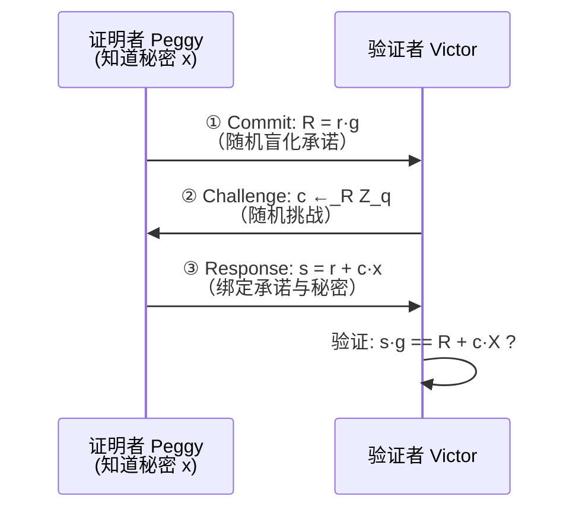

# 密码学（63）· 零知识证明基础（Σ协议 / Fiat-Shamir / zk-SNARK / zk-STARK）

> [!abstract] TL;DR
> - **零知识证明（ZKP）** 允许证明者向验证者证明"我知道某个秘密"，而不泄露秘密本身的任何信息。
> - 三大核心性质：**完备性**（真命题必能证明）、**可靠性**（假命题无法欺骗验证者）、**零知识性**（验证者除"命题为真"外学不到任何东西）。
> - **Σ协议**（如 Schnorr）是交互式 ZKP 的经典构造：commit → challenge → response 三步。
> - **Fiat-Shamir 变换**将交互式协议转为非交互式，用哈希函数代替验证者发出的随机挑战——Schnorr 签名、ML-DSA 均基于此。
> - **zk-SNARK**（Groth16 等）提供极小证明（~200 字节）和快速验证，但需要可信设置（trusted setup）。
> - **zk-STARK** 无可信设置、基于哈希/FRI、抗量子，证明尺寸稍大（数十 KB），适合需要透明性的场景。
> - 核心应用：zkRollup（以太坊扩容）、Zcash（隐私交易）、zkLogin（身份验证）、StarkNet。

---

## 概述与定位

零知识证明这一概念由 Goldwasser、Micali、Rackoff 于 1985 年的论文《The Knowledge Complexity of Interactive Proof Systems》首次形式化。在此之前，密码学界普遍认为"证明"必然需要展示证据本身——而这篇论文颠覆了这种直觉：**证明"知道"某件事，与"展示"该事物本身，是可以分离的**。

一个经典的直觉比喻：洞穴问题（Ali Baba 洞穴）。洞穴尽头有一扇密门，打开需要魔法口令。证明者 Peggy 声称自己知道口令。验证者 Victor 站在洞口，命令 Peggy 从左侧通道进入、从右侧通道出来（或反之）——若 Peggy 真的知道口令，她每次都能绕过密门满足要求；若不知道，她猜对的概率每轮只有 1/2，重复 40 轮后欺骗成功的概率低于 10^-12。而 Victor 全程没有看见口令本身。

这就是零知识证明的精髓：**通过重复交互将作弊概率指数级压低，同时对秘密本身只字不提**。

### ZKP 的三大性质

| 性质 | 直觉含义 | 形式定义摘要 |
|---|---|---|
| 完备性（Completeness） | 诚实的证明者总能说服诚实的验证者 | 若命题为真，诚实 Peggy 使 Victor 以压倒性概率接受 |
| 可靠性（Soundness） | 不知道秘密的作弊者无法欺骗验证者 | 若命题为假，任何 Peggy* 使 Victor 接受的概率可忽略 |
| 零知识性（Zero-Knowledge） | 验证者从交互中学不到秘密的任何信息 | 存在模拟器 S，其输出与真实交互的统计分布不可区分 |

零知识性的严格定义依赖**模拟器论证**：若验证者（即使是恶意的验证者）能独立运行一个模拟器产生与真实交互无法区分的记录，则他从真实交互中获取的信息为零。这是最微妙也最重要的一个性质。

### ZKP 在密码学体系中的位置

```
经典签名/认证（知识展示）
        ↓ 演进
Σ协议：交互式知识证明
        ↓ Fiat-Shamir 变换
非交互式知识证明 / 签名
        ↓ 算术化 + 多项式承诺
zk-SNARK / zk-STARK（通用计算可验证性）
```

Σ协议解决的是"证明我知道某个离散对数"这类简单陈述；SNARK/STARK 将能力提升到"证明我正确执行了任意程序"，是区块链隐私与扩容的核心密码原语。

---

## 原理与机制

### Σ协议：以 Schnorr 协议为核心

Σ协议（Sigma Protocol）是满足特定性质的三步交互式证明系统，得名于三步结构形如希腊字母 Σ（commit、challenge、response）。

**场景设定**：椭圆曲线群 G，生成元 g，阶为 q。证明者 Peggy 知道离散对数 x，满足 `X = x·g`（即公钥 X 对应的私钥 x）。Peggy 希望向 Victor 证明她知道 x，但不透露 x 本身。

**Schnorr 协议三步**：

```
步骤一 Commit（承诺）：
  Peggy 选随机数 r ←_R Z_q
  计算 R = r·g
  发送 R 给 Victor

步骤二 Challenge（挑战）：
  Victor 选随机挑战 c ←_R Z_q
  发送 c 给 Peggy

步骤三 Response（响应）：
  Peggy 计算 s = r + c·x  (mod q)
  发送 s 给 Victor

验证：
  Victor 检查 s·g == R + c·X
  即 (r + cx)·g == r·g + c·(x·g) == R + c·X  ✓
```

> [!note] 为什么不直接发送 x？
> 如果省略 commit 步骤直接回答 `s = c·x`，那么 Victor 通过 `s/c` 即可还原 x。随机数 r 的承诺将 s 与 x 的关系"掩盖"：即使泄露了 (R, c, s)，s 的计算中有未知的随机数 r，无法还原 x。

#### 特殊可靠性（Special Soundness）

若存在两个接受记录 `(R, c, s)` 与 `(R, c', s')`，且 `c ≠ c'`（同一承诺、不同挑战），则可以提取出秘密：

```
s·g = R + c·X
s'·g = R + c'·X
=> (s - s')·g = (c - c')·X
=> X = (s - s') / (c - c') · g
=> x = (s - s') · (c - c')^{-1}  (mod q)
```

这个推导定义了**知识提取器（Knowledge Extractor）**：在随机预言模型下，能产生两个接受记录等价于"知道秘密"。特殊可靠性正是零知识协议"可靠性"的形式化依据。

#### 特殊 HVZK（诚实验证者零知识）

模拟器工作方式：先随机选 `(c, s)` → 倒推 `R = s·g - c·X`，输出 `(R, c, s)`。这是合法的接受记录，且其分布与真实交互完全一致（因为真实中 r 也是随机的）。这证明了协议满足 HVZK——**诚实的**（即按规则随机选 c 的）验证者学不到任何关于 x 的信息。

### Σ协议交互流程图



---

## 结构/算法/伪代码详解

### Fiat-Shamir 变换：交互式 → 非交互式

交互式协议需要验证者在线发送随机挑战，实际部署不便。**Fiat-Shamir 变换（1986）** 用**哈希函数代替验证者的随机挑战**，将三步交互压缩为一步非交互的证明：

```
非交互式 Schnorr 证明（Fiat-Shamir）：

证明生成：
  r ←_R Z_q
  R = r·g
  c = H(X || R || msg)     # 哈希代替验证者挑战
  s = r + c·x  (mod q)
  输出证明 π = (R, s)       # 不需要发送 c，验证者可重算

证明验证：
  重算 c' = H(X || R || msg)
  检查 s·g == R + c'·X
```

在**随机预言模型（ROM）**下，哈希函数行为如同随机函数，Fiat-Shamir 变换保持了可靠性——作弊者无法预先控制 `c = H(...)` 的值。

#### Schnorr 签名 = Fiat-Shamir + Schnorr 协议

Schnorr 签名（见 [[53.ECDSA与Schnorr签名]]）正是 Fiat-Shamir 变换的直接产物：

```
签名：σ = (R, s)，其中 c = H(X || R || msg)，s = r + cx
验证：s·g == R + c·X
```

这与上面的非交互式证明完全相同，区别仅在于"msg"绑定了被签名的消息，赋予了不可伪造性。

#### ML-DSA 的 Fiat-Shamir-with-Aborts

[[52.Dilithium-ML-DSA]] 将同样的变换应用到格上：用 Module-LWE/SIS 结构替代离散对数，但基本框架仍是 commit-challenge-response。为防止侧信道泄露（格上的 `s = r + cx` 若 s 分布不均匀会泄露 x），引入了"拒绝采样（rejection sampling）"——若 s 超出安全范围则丢弃本次 r 重来，使输出分布均匀。这就是"Fiat-Shamir **with Aborts**"名称的来源。

### zk-SNARK：简洁非交互知识论证

zk-SNARK（Zero-Knowledge Succinct Non-interactive ARgument of Knowledge）的目标远比 Schnorr 协议宏大：证明者能证明**任意 NP 语句**，即"我知道一个见证 w，使得某个电路 C 满足 C(x, w) = 1"。

#### 算术电路与 R1CS

任意计算程序可以被编译为**算术电路**（由加法门和乘法门构成），再转化为**R1CS（Rank-1 Constraint System）**：

```
R1CS 约束形式：
对每一个乘法门：<a_i, z> · <b_i, z> = <c_i, z>
其中 z 是所有中间变量构成的向量
a_i, b_i, c_i 是选择向量（常量）
```

例如，电路中有一个乘法门 `x * y = z`，对应约束 `(0,1,0,...) · z * (0,0,1,...) · z = (0,0,0,1,...) · z`。一个有 n 个乘法门的电路产生 n 条 R1CS 约束。

#### 从 R1CS 到 QAP

**QAP（Quadratic Arithmetic Program）** 将 R1CS 的 n 条约束"打包"为单一的多项式等式：

```
将每一条约束编码为多项式值：
  选取 n 个评估点 {r_1, ..., r_n}
  构造多项式 A(x), B(x), C(x) 使得：
    对每个 i：A(r_i) = a_i·z，B(r_i) = b_i·z，C(r_i) = c_i·z
  
QAP 满足等价于：
    A(x) · B(x) - C(x) ≡ 0  (mod 目标多项式 T(x))
    其中 T(x) = (x - r_1)(x - r_2)...(x - r_n)
```

见证 w 满足电路当且仅当 `A(x)·B(x) - C(x) = H(x)·T(x)`（某个商多项式 H 整除）。

#### Groth16：可信设置与证明结构

Groth16（2016）是迄今最高效的 SNARK 方案，证明仅包含**3 个椭圆曲线点**（约 200 字节），验证时间为毫秒级。

```
可信设置（Trusted Setup）——"有毒废料"问题：
  一次性生成结构化参考字符串 (SRS = CRS)
  SRS 生成时依赖随机秘密 τ（"有毒废料"）
  若 τ 泄露，攻击者可伪造任意假证明
  => 必须在生成后安全销毁 τ
  => 通常用多方计算（MPC ceremony）：参与者联合生成，只要有一人诚实销毁自己的份额即安全
  
证明结构（简化）：
  π = (A ∈ G1, B ∈ G2, C ∈ G1)
  三个椭圆曲线点，利用配对密码（[[64.配对密码]]）验证

验证方程（高度简化）：
  e(A, B) == e(α, β) · e(L(x), γ) · e(C, δ)
  其中 e 是双线性配对，常数 α,β,γ,δ 来自 SRS
```

可信设置的局限性是 SNARK 的最大工程风险，Zcash 的 "Powers of Tau" 仪式（2017/2022）邀请了数百名参与者共同生成 SRS 以降低风险。

#### SNARK 证明生成与验证流程

```mermaid
flowchart LR
    A[计算程序<br/>C(x,w)=1] --> B[编译为<br/>算术电路]
    B --> C[转化为 R1CS<br/>约束系统]
    C --> D[转化为 QAP<br/>多项式形式]
    D --> E{一次性<br/>可信设置}
    E -->|SRS| F[证明者<br/>Prover]
    E -->|验证密钥 vk| G[验证者<br/>Verifier]
    F -->|输入 x, w| H[生成证明<br/>π ∈ 3个曲线点]
    H --> G
    G -->|输入 x, π, vk| I{验证配对等式<br/>Accept / Reject}
```

### zk-STARK：无可信设置、抗量子

zk-STARK（Scalable Transparent ARgument of Knowledge，StarkWare 2018）的设计目标是解决 SNARK 的两个核心缺陷：

1. **透明性（Transparency）**：不需要可信设置，任何人都可以验证参数生成过程，SRS 替换为公开的随机字符串（只需哈希函数）。
2. **抗量子性**：安全基础仅依赖哈希函数的抗碰撞性，而非椭圆曲线离散对数——量子计算机无法破解哈希函数（Grover 算法只将安全性减半，SHA-256 仍有 128 位后量子安全）。

#### FRI 协议：STARK 的核心

STARK 的简洁性来源于 **FRI（Fast Reed-Solomon IOP of Proximity）** 协议，本质是**低度测试**：高效证明一个函数与某个低次多项式距离很近。

```
FRI 直觉：
  证明者声称 f(x) 是次数 < d 的多项式
  FRI 协议通过 O(log d) 轮折叠（每轮将多项式次数减半）
  加上 Merkle 树承诺，允许验证者以 O(log^2 d) 次哈希查询验证

对比：
  SNARK 使用椭圆曲线承诺（需要配对曲线）
  STARK 使用 Merkle 树承诺（只需哈希函数）
```

STARK 的证明尺寸是 O(log^2 n) 字节（n 为电路大小），实践中约数十 KB 到数百 KB，远大于 SNARK 的 ~200 字节，但验证时间接近。

#### SNARK vs STARK 对比

| 维度 | zk-SNARK（Groth16） | zk-STARK |
|---|---|---|
| 证明大小 | ~200 字节（极小） | ~数十 KB |
| 验证时间 | 毫秒级 | 毫秒级 |
| 证明时间 | 分钟级 | 分钟级 |
| 可信设置 | **需要**（"有毒废料"风险） | **不需要**（透明） |
| 安全假设 | 椭圆曲线 + 配对 | 哈希函数 |
| 后量子安全 | **否**（配对基于 ECDLP） | **是** |
| 典型应用 | Zcash, Groth16-based zkEVM | StarkNet, StarkEx |

---

## 工具视角与实战

### 主流实现库

| 库 / 框架 | 语言 | 适合场景 |
|---|---|---|
| snarkjs + circom | JavaScript + DSL | 原型开发、浏览器端证明 |
| bellman（Zcash） | Rust | 生产级 Groth16 |
| arkworks | Rust | 多种后端，学术/工程兼顾 |
| gnark | Go | 高性能，支持 Groth16/PLONK |
| StarkWare Cairo | Cairo 语言 | StarkNet 智能合约 |
| halo2（zkSync/Scroll） | Rust | 无可信设置 SNARK（PLONK 变体） |

### Circom 示例：Schnorr 的简化版（知道哈希原像）

```circom
// 证明：知道 x 使得 H(x) == hash_pub（不透露 x）
pragma circom 2.0.0;
include "circomlib/circuits/mimcsponge.circom";

template HashPreimage() {
    signal input x;          // 私有输入（见证 w）
    signal input hash_pub;   // 公开输入
    
    component mimc = MiMCSponge(1, 220, 1);
    mimc.ins[0] <== x;
    mimc.k <== 0;
    
    hash_pub === mimc.outs[0];  // 约束：H(x) == hash_pub
}

component main {public [hash_pub]} = HashPreimage();
```

编译和使用：

```bash
# 编译电路
circom hash_preimage.circom --r1cs --wasm --sym

# 生成可信设置（Powers of Tau + 电路特定设置）
snarkjs powersoftau new bn128 12 pot12_0000.ptau
snarkjs powersoftau contribute pot12_0000.ptau pot12_0001.ptau
snarkjs groth16 setup hash_preimage.r1cs pot12_final.ptau setup_0000.zkey

# 生成证明（输入见证 w = {x: "42"}）
snarkjs groth16 prove setup_0000.zkey witness.wtns proof.json public.json

# 验证
snarkjs groth16 verify verification_key.json public.json proof.json
```

### 应用场景一览

**zkRollup（以太坊扩容）**：将数千笔交易的执行正确性压缩为一个 SNARK/STARK 证明上链验证，大幅降低 Gas 费。zkSync、Scroll（Groth16/PLONK）与 StarkNet（STARK）是主流实现。

**Zcash（隐私交易）**：发送方证明"我有足够的余额且知道私钥"而不揭示发送方、接收方或金额。Sapling 升级使用 Groth16，Orchard 使用 halo2。

**zkLogin（身份验证）**：Sui 区块链中，用户凭借 Google/Facebook OAuth JWT 证明"我拥有合法的 OAuth token"生成链上账户，服务方无法关联链下身份与链上地址。

**StarkNet**：以太坊 L2，所有状态转换由 STARK 证明背书，智能合约用 Cairo 语言编写并编译为可验证计算。

---

## 安全性与正确使用

### 随机数的关键性

Schnorr / Fiat-Shamir 签名的随机数 r **绝对不能复用**。Sony PlayStation 3 于 2010 年被破解的根本原因正是 ECDSA 签名使用了固定 r（k），导致攻击者通过两条签名提取私钥：

```
若 (R, c, s) 和 (R', c', s') 两次使用了同一 r（即 R = R'）：
s - s' = c·x - c'·x = (c - c')·x
=> x = (s - s') / (c - c')  (可直接提取私钥)
```

> [!note] ML-DSA 的 rejection sampling
> ML-DSA（格签名）中引入了 deterministic nonce（基于私钥和消息的确定性 r），同时用 rejection sampling 确保输出分布均匀，两者共同防止随机数复用和分布泄露。

### 可信设置的工程风险

使用 Groth16 等需要可信设置的方案时：

- **优先使用社区已完成的 Powers of Tau 仪式产物**（如 Hermez 的 2^28 SRS），而非自行生成。
- 了解 SRS 的参与者数量——参与人越多、托管方越多样，单点作弊风险越低。
- **考虑 PLONK / halo2 等通用 SRS 方案**：SRS 可在不同电路间复用，仅需一次全局可信设置。
- 若安全需求极高，优先考虑 zk-STARK 或 halo2（无可信设置）。

### 零知识性的边界

> [!note] HVZK vs 完全零知识
> Schnorr 协议提供的是 HVZK（Honest-Verifier Zero-Knowledge）：仅对按规则随机选 c 的验证者保证零知识性。若验证者恶意选择 c（预先与证明者的 commit 相关联），可能泄露信息。在随机预言模型下，Fiat-Shamir 将其提升为完全非交互式零知识，但依赖 ROM 假设。

### 性能与实用性边界

当前（2024-2025）ZKP 的主要工程挑战：

- **证明生成时间**：一个中等规模电路（10^6 约束）的 Groth16 证明约需 1-5 分钟；STARK 类似。
- **电路编写复杂性**：将业务逻辑翻译为算术电路需要领域知识，circom / Cairo 等 DSL 降低了门槛但仍有陡峭学习曲线。
- **递归证明**：halo2、Plonky2 等支持证明递归折叠，是 zkEVM 高效性的关键，技术复杂度显著上升。

---

## 小结

零知识证明是密码学中"可验证计算"与"隐私保护"交汇的核心领域：

1. **三大性质**：完备性 + 可靠性 + 零知识性，通过模拟器论证严格定义。
2. **Σ协议**：commit-challenge-response 三步，特殊可靠性保证知识提取，HVZK 保证零知识性；Schnorr 是最经典的实例。
3. **Fiat-Shamir 变换**：哈希替代随机挑战，交互式→非交互式，Schnorr 签名、ML-DSA 均源于此。
4. **zk-SNARK（Groth16）**：算术电路→R1CS→QAP，证明极小（~200 字节），但需要可信设置（有毒废料）。
5. **zk-STARK**：FRI + Merkle 树承诺，无可信设置、抗量子，证明尺寸稍大，是高透明性场景的首选。
6. **应用**：zkRollup、Zcash、zkLogin、StarkNet 已将 ZKP 从理论带入大规模生产部署。

---

## 相关阅读

- [[53.ECDSA与Schnorr签名]] —— Schnorr 协议的签名应用，与 ZKP 同源
- [[52.Dilithium-ML-DSA]] —— 格上的 Fiat-Shamir-with-Aborts 签名
- [[43.随机数与熵]] —— 随机数复用为何导致私钥泄露
- [[64.配对密码]] —— SNARK 验证使用的双线性配对
- [[62.协议误用与密码工程]] —— 密码原语的工程实践与误用
- [[49.后量子密码概览]] —— STARK 的后量子安全背景
- [[61.侧信道攻击]] —— rejection sampling 所防御的侧信道

---

⬅️ 上一篇 [[62.协议误用与密码工程]] ｜ 🏠 [[00.密码学总览]] ｜ 下一篇 [[64.配对密码]] ➡️