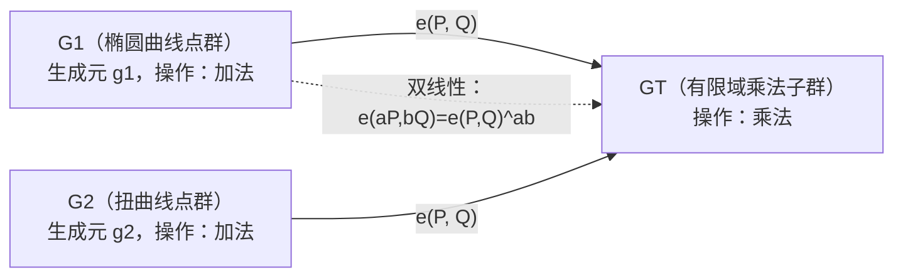
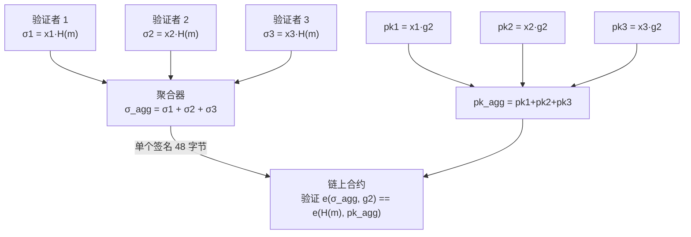

# 密码学（64）· 配对密码（BLS / IBE / SM9 数学基础）

> [!abstract] TL;DR
> - **双线性配对（Bilinear Pairing）** 是一种特殊映射 `e: G1 × G2 → GT`，将两个椭圆曲线群上的计算与目标群中的乘法连接起来，是诸多高级密码方案的数学基础。
> - 三大性质：**双线性**（`e(aP, bQ) = e(P,Q)^{ab}`）、**非退化性**（输出不恒为 1）、**可高效计算性**。
> - **BLS 签名**：签名仅 48 字节（BLS12-381 曲线），支持**聚合验证**（n 个签名压缩为 1 个）——以太坊信标链验证者签名的核心机制。
> - **IBE（身份基加密）**：用邮箱/手机号即可作为公钥加密，无需预先交换证书，Boneh-Franklin 方案基于配对实现。
> - **SM9**：中国国家标准中基于配对的签名/加密算法，数学基础与本文所述一致，与 [[44.国密SM体系概览]] 交叉。
> - **配对友好曲线**：BN254、BLS12-381 是主流选择；BN254 在 2015 年遭受亚指数攻击后安全级别下调，BLS12-381 成为新标准（~128 位安全）。

---

## 概述与定位

在标准椭圆曲线密码学（[[22.椭圆曲线密码ECC]]）中，群上的操作只有加法：给定点 P 和整数 k，可以高效计算 kP；但给定 P 和 kP，无法（在计算上）还原 k（ECDLP 难题）。这限制了密码方案的表达能力——某些安全属性需要"跨维度"的代数结构。

**双线性配对**打破了这个限制。它允许在两个椭圆曲线群的元素之间建立乘法关系：`e(aP, bQ) = e(P, Q)^{ab}`。这条等式看似简单，却为整整一代高级密码方案（BLS、IBE、属性基加密、配对签名聚合、zk-SNARK）提供了核心工具。

### 历史脉络

配对（Pairing）原本被视为**攻击工具**：1991 年 Menezes-Okamoto-Vanstone（MOV 攻击）利用 Weil 配对将某些椭圆曲线的 ECDLP 归约为有限域的 DLP（更容易攻击），因此早期密码学家刻意避开配对友好曲线。

2000 年代，Joux（2000）和 Boneh-Franklin（2001）将配对的视角从"攻击"转为"构造"，开创了**配对密码学（Pairing-based Cryptography）** 领域。此后二十年，基于配对的方案在身份基加密、聚合签名、零知识证明等方向开花结果。

---

## 原理与机制

### 双线性配对的三大性质

设 `G1`、`G2` 是素数阶 q 的加法循环群（椭圆曲线上的点群），`GT` 是同阶 q 的乘法循环群（有限域的乘法子群）。映射 `e: G1 × G2 → GT` 被称为**双线性配对**，当且仅当满足：

| 性质 | 数学表达 | 直觉含义 |
|---|---|---|
| 双线性（Bilinearity） | `e(aP, bQ) = e(P, Q)^{ab}` | 输入的标量乘法变成目标群中的指数 |
| 非退化性（Non-degeneracy） | `e(P, Q) ≠ 1`（P,Q 为生成元） | 不是退化的零映射 |
| 可高效计算性（Efficiency） | 存在多项式时间算法 | 工程上可用 |

双线性性是最重要的性质，它使得以下等式成立：

```
e(aP, Q)  = e(P, Q)^a
e(P, bQ)  = e(P, Q)^b
e(aP, bQ) = e(P, Q)^{ab} = e(abP, Q) = e(P, abQ)
```

这意味着：如果 Alice 的公钥是 `A = a·P1`，Bob 的公钥是 `B = b·P2`，那么：

```
e(A, B) = e(a·P1, b·P2) = e(P1, P2)^{ab}
e(ab·P1, P2) = e(P1, P2)^{ab}
```

即知道 a 或 b 的任何一方都能计算 `e(P1, P2)^{ab}`，但只知道 `A` 和 `B`（不知道 a 和 b）的人**无法**计算它——这是**双线性 Diffie-Hellman（BDH）假设**，多数配对方案的安全基础。

### 对称配对与非对称配对

- **Type 1（对称配对）**：`G1 = G2`，即 `e: G1 × G1 → GT`。数学更简洁，但超奇异曲线（supersingular curves）的安全性较低，现代方案已少用。
- **Type 3（非对称配对）**：`G1 ≠ G2`，没有已知的高效同构 `G1 → G2`。BN254、BLS12-381 均属此类，是主流工程选择。



### Weil 配对与 Tate 配对简介

具体的配对构造有 **Weil 配对**和 **Tate 配对**（及其改进版 ate 配对、optimal ate 配对）。

**Weil 配对**（André Weil，1940 年代数学研究成果的密码应用）：

```
e_W(P, Q) 基于除子（Divisor）理论定义
  - P, Q 是椭圆曲线 E(F_q) 上的 n 阶点
  - 通过构造有理函数 f_P（满足 div(f_P) = n[P] - n[O]）
  - 定义 e_W(P, Q) = f_P(Q) / f_Q(P)
  
性质：反对称 e_W(P, Q) = e_W(Q, P)^{-1}，意味着 e_W(P, P) = 1（需要 P, Q 线性无关）
```

**Tate 配对**和后续的 **ate / optimal ate 配对** 在工程效率上显著优于 Weil 配对（循环次数更少），现代实现（如 BLS12-381 上的配对）均使用 optimal ate 变体。本文不深入构造细节，重点在于应用。

---

## 结构/算法/伪代码详解

### BLS 签名

**BLS 签名**（Boneh-Lynn-Shacham，2001）是配对密码最广为部署的应用，以极短的签名和优雅的聚合性质著称。

#### 基本方案

设 BLS12-381 曲线，`g1 ∈ G1`，`g2 ∈ G2`，`H: {0,1}* → G1`（哈希到 G1 上的点）。

```
密钥生成：
  sk = x ←_R Z_q          # 私钥：随机标量
  pk = x · g2  ∈ G2        # 公钥：G2 上的点（48 字节 × 2 = 96 字节）

签名：
  σ = x · H(m)  ∈ G1       # 签名：G1 上的点（48 字节）

验证：
  检查 e(σ, g2) == e(H(m), pk)
  即 e(x·H(m), g2) == e(H(m), x·g2)
  由双线性性：e(H(m), g2)^x == e(H(m), g2)^x  ✓
```

BLS 签名在 **BLS12-381 曲线**上仅 **48 字节**（G1 压缩点），显著小于 ECDSA 的 64 字节或 RSA-2048 的 256 字节，是其部署优势之一。

#### 签名聚合：多签的革命

BLS 签名最强大的特性是**聚合**：n 个验证者对 n 条（可能不同的）消息的签名，可以压缩为 1 个签名，验证时间接近单签名验证。

```
n 个签名者，消息 m_i，私钥 x_i，公钥 pk_i = x_i · g2：

各自签名：σ_i = x_i · H(m_i)

聚合签名（简单加法）：
  σ_agg = σ_1 + σ_2 + ... + σ_n  ∈ G1  （椭圆曲线点加法）

聚合验证（同一消息 m）：
  pk_agg = pk_1 + pk_2 + ... + pk_n  ∈ G2
  验证：e(σ_agg, g2) == e(H(m), pk_agg)

多消息聚合验证（不同消息需要哈希分离防止 rogue-key 攻击）：
  e(σ_agg, g2) == e(H(m_1), pk_1) · e(H(m_2), pk_2) · ... · e(H(m_n), pk_n)
```

以太坊信标链中，每个 slot（12 秒）约有数百个验证者需要对区块进行签名认证。若使用 ECDSA，链上需验证 n 个独立签名，开销为 O(n)。使用 BLS 聚合签名，只需**一次** `e(σ_agg, g2) == e(H(m), pk_agg)` 验证，复杂度降为 O(1) 常数（加上聚合公钥计算的 O(n)，但聚合可链下完成）。

#### BLS 签名聚合流程图



#### Rogue Key 攻击与防御

朴素聚合存在**流氓密钥（Rogue Key）攻击**：攻击者注册公钥 `pk* = x*·g2 - pk_honest`，使得聚合公钥 `pk_agg = pk* + pk_honest = x*·g2`，实质上冒充了诚实方。

防御方案：**知识证明（PoP）**——每个验证者在注册公钥时提供一个对公钥本身的 BLS 签名（证明自己知道对应私钥），验证节点只接受提交了 PoP 的公钥参与聚合。以太坊信标链严格执行此要求。

### IBE：身份基加密

**IBE（Identity-Based Encryption，身份基加密）** 解决公钥基础设施（PKI）的根本痛点：在传统系统中，加密前必须获取对方的公钥证书，涉及 CA 签发、证书分发等复杂流程。IBE 颠覆这一模型：**任意字符串（如邮箱地址、手机号、身份证号）直接作为公钥**，加密者无需预先交换任何密钥材料。

#### Boneh-Franklin IBE（高层结构）

**系统参数**：可信私钥生成中心（PKG，Private Key Generator）持有主密钥 `s ∈ Z_q`，发布主公钥 `P_pub = s·g1`。

```
密钥提取（用户向 PKG 申请私钥）：
  用户 Alice 提交身份 ID = "alice@example.com"
  PKG 计算私钥 d_ID = s · H1(ID)  ∈ G1
  通过安全信道发给 Alice

加密（发送者 Bob 向 Alice 加密消息 M）：
  r ←_R Z_q
  C1 = r · g1  ∈ G1
  g_ID = e(H1(ID), P_pub) = e(H1(ID), s·g1) = e(H1(ID), g1)^s  ∈ GT
  C2 = M ⊕ H2(g_ID^r)         # XOR 加密
  密文 C = (C1, C2)

解密（Alice 用私钥 d_ID 解密）：
  g_ID^r = e(d_ID, C1) = e(s·H1(ID), r·g1) = e(H1(ID), g1)^{sr}
  M = C2 ⊕ H2(g_ID^r)  ✓
```

IBE 的核心构造来自双线性配对的以下等式：

```
e(s · H1(ID), r · g1) = e(H1(ID), g1)^{sr} = e(H1(ID), r · g1)^s = e(H1(ID), s·g1)^r
                                               ^^^^^^^^^^^^^^^^^           ^^^^^^^^^^^^^^^^
                                               可由加密者（知道 r）计算     等于 e(H1(ID), P_pub)^r
```

加密者和持有 `d_ID = s·H1(ID)` 的私钥持有者通过配对的双线性性"汇聚"到同一个值，实现密钥共享。

**IBE 的局限**：PKG 知道所有用户的私钥（密钥托管问题），不适合需要完全去中心信任的场景，但在企业内网、政务系统中有广泛应用。

### SM9 的配对数学基础

**SM9** 是中国国家密码局（GM/T 0044）标准化的基于配对的密码算法族，包含：
- SM9 签名算法
- SM9 标识加密（等效于 IBE）
- SM9 密钥封装
- SM9 密钥交换

SM9 使用的曲线是 **BN256**（一种 Barreto-Naehrig 曲线，类似 BN254），配对类型为 Type 3（`G1 ≠ G2`），安全级别约 100 位（BN256 在 2015 年后的估计为 100-128 位之间，实际部署通常认可 ≥ 100 位）。

SM9 的签名验证方程与 BLS 类似，均依赖配对等式：

```
SM9 签名验证（简化）：
  e(h·g1 + sk, g2) == e(H(m), pk)
  其中 h 是消息哈希值的整数表示，sk 是公钥对应的配对点

实质：等式两边通过双线性性化简，与 BLS 的
  e(σ, g2) == e(H(m), pk) 结构相同
```

SM9 加密与 Boneh-Franklin IBE 数学等价，区别在于具体的哈希到曲线算法、密钥封装方式等工程细节。详细的 SM9 算法描述及与 SM2/SM3/SM4 的关系见 [[44.国密SM体系概览]]。

---

## 工具视角与实战

### 配对友好曲线选择

| 曲线 | 嵌入度 | 安全级别 | 典型用途 | 备注 |
|---|---|---|---|---|
| BN254 | 12 | ~100 位（降级后） | circom/snarkjs 默认，zkEVM | 2015 年 Kim-Barbulescu 攻击后从 128 降至约 100 |
| BLS12-381 | 12 | ~128 位 | 以太坊信标链 BLS 签名、Zcash Sapling | 现代标准首选 |
| BLS12-377 | 12 | ~126 位 | 递归 SNARK（Zexe/Marlin） | 与 BW6-761 形成递归配对 |
| BN256 | 12 | ~100-128 位 | SM9（中国国标） | |

> [!note] 曲线安全级别的变化
> 2015 年之前，BN254/BN256 被认为提供 128 位安全。Kim-Barbulescu（2015）改进了有限域 DLP 的亚指数算法，使嵌入度为 12 的曲线安全级别降至约 100 位。对于需要严格 128 位安全的新系统，应选择 BLS12-381 而非 BN254。现有系统（如 Zcash Sprout）若使用 BN254，在未来应考虑迁移。

### 主流实现库

| 库 | 语言 | 支持曲线 | 用途 |
|---|---|---|---|
| blst（以太坊基金会） | Rust/C | BLS12-381 | 以太坊客户端 BLS 签名标准库 |
| mcl（herumi） | C++/Go/Wasm | BN254, BLS12-381, BLS12-377 | 高性能，SM9 支持 |
| arkworks/ark-ec | Rust | 多种配对曲线 | 学术/SNARK 工程 |
| gnark-crypto | Go | BN254, BLS12-381, BLS12-377 | zkSync/Linea 生态 |
| pairing-plus（Rust） | Rust | BLS12-381 | zk-SNARK 基础库 |

### BLS12-381 上的 BLS 签名（Go 伪代码）

```go
import "github.com/herumi/bls-go-binary/bls"

// 初始化 BLS12-381 曲线
bls.Init(bls.BLS12_381)

// 密钥生成
var sk bls.SecretKey
sk.SetByCSPRNG()                    // 随机私钥
pk := sk.GetPublicKey()             // G2 上的公钥

// 签名（48 字节，G1 上的点）
msg := []byte("Hello, pairing!")
sig := sk.Sign(string(msg))

// 验证
valid := sig.Verify(pk, string(msg))
fmt.Println(valid)  // true

// 聚合签名
var sigs []bls.Sign
var pubs []bls.PublicKey
// ...填充多个签名和公钥...
var aggSig bls.Sign
aggSig.Aggregate(sigs)              // 聚合为一个签名
aggValid := aggSig.FastAggregateVerify(pubs, msg)
```

---

## 安全性与正确使用

### 配对密码的安全假设

配对方案的安全性依赖以下假设（依赖强度递增）：

```
ECDLP（椭圆曲线离散对数）
  ↓ 配对引入新的约化
BDH（双线性 Diffie-Hellman）：
  给定 (P, aP, bP, cP)，难以计算 e(P,P)^{abc}
  ↓ 更弱假设
BDDH（判定 BDH）：
  难以区分 e(P,P)^{abc} 与随机 GT 元素
```

配对密码的安全比纯 ECC 更依赖曲线的代数结构，亚指数攻击对有限域 DLP 的改进会直接影响目标群 `GT` 的安全性——这正是 BN254 安全级别降低的原因。

### 不要自行实现配对运算

配对运算（Miller Loop + 最终幂次运算）的正确实现涉及：

- **最终幂次（Final Exponentiation）** 的正确性，算错会导致验证方程失效
- **哈希到曲线（Hash-to-Curve）** 的安全实现（RFC 9380），错误实现会引入结构性弱点
- **常数时间实现** 防止侧信道泄露

> [!note] 哈希到曲线的安全要求
> BLS 签名中 `H: {0,1}* → G1` 必须是 **不可区分的编码（Indistinguishable Encoding）**，即哈希输出的分布在 G1 中均匀。若直接用 SHA-256 的输出作为 x 坐标，会导致约 50% 的哈希值无法对应到曲线上的点，且非均匀分布使签名可伪造。RFC 9380 定义了标准的 hash_to_curve 算法，blst 等库已内置。

### 与后量子密码的关系

配对密码**不是后量子安全的**：

- `GT` 群（有限域乘法子群）上的 DLP 可被量子计算机上的 Shor 算法在多项式时间内求解
- 因此 BLS 签名、IBE、SM9 在量子计算机面前都不安全

目前没有基于格或哈希函数的配对密码等价物（配对的双线性结构在格上难以构造）。后量子签名使用 ML-DSA（[[52.Dilithium-ML-DSA]]）或 SLH-DSA，而非配对签名。在需要签名聚合的后量子场景，一个活跃研究方向是**格上的签名聚合**，但尚无成熟标准。

---

## 小结

配对密码以双线性映射 `e: G1 × G2 → GT` 为核心，将椭圆曲线密码学提升到新的表达维度：

1. **双线性性** `e(aP, bQ) = e(P,Q)^{ab}` 是所有配对方案的公共引理。
2. **BLS 签名**：48 字节签名、可聚合（n 个签名压缩为 1），是以太坊信标链验证者签名的核心技术。
3. **IBE**：用邮箱/身份即可加密，无需证书基础设施，代价是对 PKG 的信任（密钥托管）。
4. **SM9**：国家标准的配对密码，基于 BN256 曲线，与本文数学一脉相承。
5. **曲线选择**：BLS12-381 是现代新系统的标准选择（~128 位安全）；BN254 仍在 SNARK 生态中广泛使用，但新设计应考虑 BLS12-381。
6. **非后量子**：配对密码在量子计算面前不安全，长期应规划迁移。

---

## 相关阅读

- [[22.椭圆曲线密码ECC]] —— 配对密码的数学基础：椭圆曲线群论
- [[63.零知识证明基础]] —— zk-SNARK 使用配对做证明验证（Groth16）
- [[44.国密SM体系概览]] —— SM9 的算法规范与工程部署
- [[26.ECDH密钥交换]] —— 无配对的 DH 密钥建立，与 IBE 对比
- [[65.同态加密基础]] —— 另一类"高级密码"方案，不依赖配对
- [[49.后量子密码概览]] —— 配对密码在量子威胁下的处境
- [[61.侧信道攻击]] —— 配对实现中的常数时间要求

---

⬅️ 上一篇 [[63.零知识证明基础]] ｜ 🏠 [[00.密码学总览]] ｜ 下一篇 [[65.同态加密基础]] ➡️