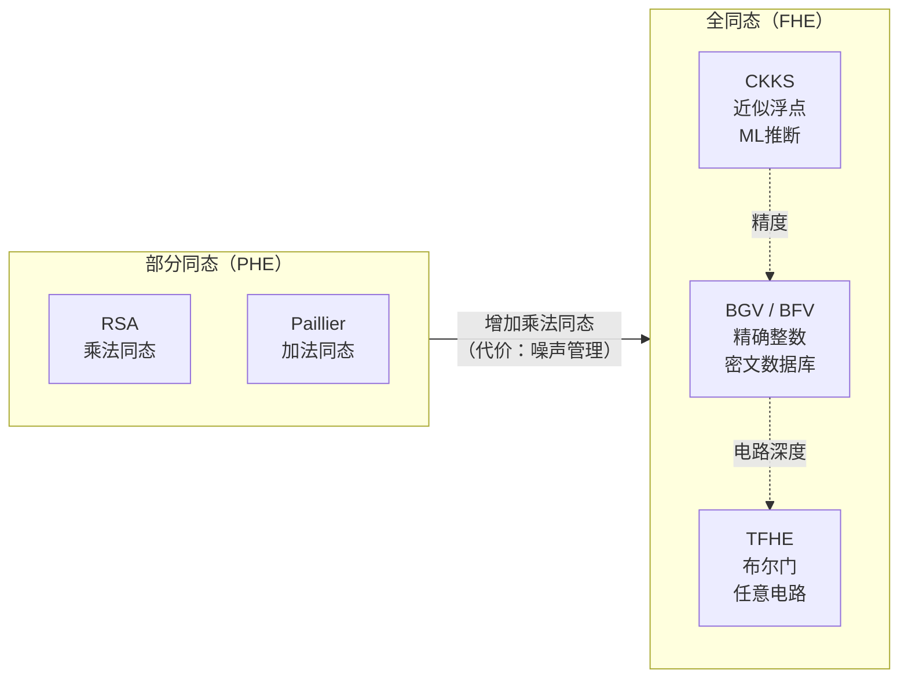

# 密码学（65）· 同态加密基础（PHE / FHE / CKKS / BGV）

> [!abstract] TL;DR
> - **同态加密（Homomorphic Encryption）** 允许在不解密的前提下对密文直接计算，结果解密后等于对明文计算的结果——数据在整个计算过程中始终保持加密状态。
> - **部分同态（PHE）**：仅支持一类操作。RSA/ElGamal 支持乘法同态；Paillier 支持加法同态。实用、高效，已在实际系统部署。
> - **全同态（FHE）** 支持任意计算（加法 + 乘法 = 图灵完备），由 Craig Gentry 2009 年突破性论文奠基。
> - 主流 FHE 方案：**CKKS**（近似浮点数，适合机器学习）、**BGV/BFV**（精确整数，适合整数运算）、**TFHE**（布尔门/快速 bootstrapping，适合任意电路）。
> - **噪声增长与 bootstrapping**：FHE 密文携带噪声，乘法操作使噪声指数增长；bootstrapping 是 Gentry 降噪技术，代价是极高的计算开销。
> - **性能瓶颈**：FHE 运算比明文慢 3-6 个数量级，bootstrapping 更慢，是当前工程化的主要障碍；硬件加速（GPU/FPGA/专用芯片）是活跃研究方向。
> - **应用边界**：隐私机器学习推断、联邦学习的密文聚合、密文数据库查询、外包计算；对延迟和吞吐要求极高的场景（如实时通信）当前不适用。

---

## 概述与定位

想象这样一个场景：你有一份包含个人医疗数据的数据库，希望外包给云服务商进行统计分析，但又不信任云服务商不会窥探原始数据。传统方案要求先解密、再分析，安全性取决于服务商是否诚实。

**同态加密**提供了一种根本性解决方案：**把加密后的数据发给云端，云端在密文上直接运行分析程序，返回加密的分析结果，只有你持有密钥能解密查看答案**。云端全程看到的只是密文，无法还原任何明文。

```
直觉模型：
  Enc(a) ⊕ Enc(b) = Enc(a + b)    # 加法同态
  Enc(a) ⊗ Enc(b) = Enc(a × b)    # 乘法同态
  
  云端只做 ⊕ 和 ⊗ 操作（密文运算），不做 Dec（解密）
  最终 Dec(结果密文) = 对明文计算的结果
```

这个想法早在 1978 年（RSA 论文同年）就被 Rivest、Adleman、Dertouzos 提出，但完整的理论构造等了 31 年——直到 Craig Gentry 2009 年的博士论文。

### 同态加密在密码学体系中的位置

```
基础加密（仅保密性）
  ↓ 增加计算能力
部分同态（PHE）：单类操作（加法或乘法）
  ↓
有限深度全同态（leveled FHE）：任意 L 层电路
  ↓ Gentry bootstrapping
全同态（FHE）：任意深度任意电路
```

同态加密与安全多方计算（MPC）、差分隐私（DP）共同构成**隐私计算**的三大密码基础，各有所长：MPC 适合多方不信任场景、DP 适合统计查询隐私、FHE 适合单方外包计算场景。

---

## 原理与机制

### 部分同态加密（PHE）

部分同态加密在历史上早于 FHE 理论就有实用方案，至今仍是许多实际部署的首选，因为效率远高于 FHE。

#### RSA 的乘法同态

RSA 加密（见 [[20.RSA加密与签名]]）天然具有乘法同态性：

```
RSA 加密：Enc(m) = m^e  mod n
乘法同态：Enc(m1) × Enc(m2) = (m1^e)(m2^e) = (m1 m2)^e = Enc(m1 × m2)  mod n
```

这意味着可以在密文层面计算两条消息乘积的密文，无需解密。实际应用：盲签名（Blind Signature）中利用了这一性质。

**局限**：RSA 不支持加法同态；且教科书 RSA 没有随机性，相同明文产生相同密文——不满足现代语义安全要求，需配合 OAEP 填充（但填充后破坏同态性）。

#### ElGamal 的乘法同态

```
ElGamal 加密：Enc(m; r) = (r·g, m + r·pk)  （加法群上的版本）
乘法同态（乘法群版本）：
  Enc(m1; r1) = (r1·g, m1·pk^{r1})
  Enc(m2; r2) = (r2·g, m2·pk^{r2})
  乘积：(  (r1+r2)·g,  m1·m2·pk^{r1+r2}  ) = Enc(m1·m2; r1+r2)
```

两个密文的分量各自相乘，等价于明文相乘的加密。ElGamal 同样只支持乘法同态（对乘法群），不支持加法。

#### Paillier 加密方案：加法同态的实用选择

**Paillier（1999）** 是最广泛部署的加法同态加密方案，安全性基于合数阶群上的 Decisional Composite Residuosity（DCR）假设。

```
密钥生成：
  选素数 p, q，令 n = pq，λ = lcm(p-1, q-1)
  公钥：(n, g)，其中 g ∈ Z_{n^2}^*
  私钥：λ（等效于 p, q）

加密：
  m ∈ Z_n（明文），r ←_R Z_n^*（随机数）
  Enc(m; r) = g^m · r^n  mod n^2

解密：
  Dec(c) = L(c^λ mod n^2) / L(g^λ mod n^2)  mod n
  其中 L(x) = (x - 1) / n

加法同态：
  Enc(m1) · Enc(m2) = g^{m1}·r1^n · g^{m2}·r2^n
                    = g^{m1+m2} · (r1·r2)^n
                    = Enc(m1 + m2; r1·r2)
  
标量乘法：
  Enc(m)^k = g^{km} · r^{kn} = Enc(k·m; r^k)  # 密文的 k 次幂 = 明文乘 k 的密文
```

Paillier 的加法同态 + 标量乘法已足以实现**线性函数**的密文计算，这覆盖了大量隐私统计场景：

- 投票统计：各票密文相乘 = 总票数密文
- 薪资合计：工资密文求和不泄露个人薪资
- 联邦学习梯度聚合：各参与方提交梯度密文，服务器聚合后解密平均梯度

---

## 结构/算法/伪代码详解

### 全同态加密的核心挑战：噪声

FHE 方案（LWE/RLWE 基础，与格密码 [[50.格密码基础]] 同源）的密文包含一个**噪声项** e，使得密文"接近"但不精确等于真实值：

```
LWE 密文结构（简化）：
  (a, b) 其中 b = a·sk + m·Δ + e
  sk = 私钥，m = 明文，Δ = 缩放因子，e = 小噪声
  
解密：b - a·sk = m·Δ + e ≈ m·Δ
  若 |e| < Δ/2，则四舍五入后准确恢复 m
```

**噪声增长规律**：

```
加法运算：
  Enc(m1)[噪声 e1] + Enc(m2)[噪声 e2] = Enc(m1+m2)[噪声 e1+e2]
  噪声线性增长（可容忍）

乘法运算（密钥交换后）：
  Enc(m1)[噪声 e1] × Enc(m2)[噪声 e2] ≈ Enc(m1·m2)[噪声 ~e1·e2·|sk|]
  噪声指数增长！
  
经过 L 层乘法：噪声 ≈ e^{2^L}（指数爆炸）
```

当噪声超过解密阈值，密文便无法正确解密——这是 FHE 的根本限制。

#### 层级（Leveled）FHE

**层级 FHE** 预先固定支持的乘法电路深度 L，选择足够大的参数使得 L 层乘法后噪声仍可解密：

```
参数选择：
  log q（密文模数大小）∝ L × log(噪声增长率)
  环维度 n ∝ 安全参数 / log q

代价：
  每增加一层乘法深度，参数尺寸（n, q）呈多项式增长
  L = 20 层乘法可能需要 n = 32768，密文尺寸数十 MB
```

层级 FHE 适合固定深度的机器学习推断（神经网络前向传播层数固定），是 CKKS 和 BGV/BFV 的主要使用模式。

#### Gentry Bootstrapping：降噪的关键

Gentry（2009）的核心创新是 **bootstrapping（自举）**：用 FHE 加密**密钥本身**，将解密操作表达为算术电路并在密文上执行，输出一个噪声更小的新密文，等价于对原密文"降噪"。

```
Bootstrapping 直觉：
  步骤 1：加密私钥 sk → Enc(sk)
  步骤 2：将解密电路 Dec(·, sk) 表达为算术电路 C_Dec
  步骤 3：同态计算 C_Dec(Enc(c_old), Enc(sk))
            = Enc(Dec(c_old, sk))
            = Enc(m)         # 与原密文等值，但噪声是"新加密的噪声"（很小）
  输出：c_new（噪声刷新的密文）
```

> [!note] 为何 bootstrapping 极慢？
> 解密电路本身也是一个有相当深度的算术电路（取模运算需要展开为多层乘加）。在密文上同态执行这个解密电路，相当于在极高噪声下执行深度为 O(log q) 的运算，需要预先留出足够的"噪声预算"。典型的 TFHE bootstrapping 需要约 0.1-1 秒，CKKS/BGV bootstrapping 更慢（秒级到分钟级）。

### CKKS：近似浮点数的 FHE

**CKKS（Cheon-Kim-Kim-Song，2017）** 专为浮点数近似计算设计，是机器学习隐私推断的主流方案。

```
核心设计：放弃精确性，换取效率
  加密浮点数 m ∈ R，缩放因子 Δ = 2^{精度位数}
  密文解密后得到 m' ≈ m，误差 ≤ 1 ULP（最低有效位）

批处理（SIMD 编码）：
  CKKS 利用 RLWE（Ring-LWE）的多项式结构
  一个密文可同时编码 n/2 个浮点数（n = 环维度）
  单次密文运算 = 同时对 n/2 个槽执行相同操作
  => 吞吐量 n/2 倍提升
```

CKKS 特别适合：神经网络激活函数（ReLU 近似）、统计计算（均值/方差）、多项式近似计算。

**参数示例（实践中的规模感）**：

```
任务：32 层神经网络推断（CKKS）
参数：n = 32768（环维度），log q = 881 位（55 个质数乘积）
密文大小：约 3 MB（每个密文）
推断时间：数分钟（CPU），数秒（GPU 加速）
批处理：16384 个样本同时推断
```

### BGV / BFV：精确整数的 FHE

**BGV（Brakerski-Gentry-Vaikuntanathan，2012）** 和 **BFV（Fan-Vercauteren，2012）** 是精确整数运算的主流方案，适合需要精确结果的场景（如密文数据库查询、整数逻辑运算）。

```
BGV 核心思想：模数切换（Modulus Switching）降低噪声
  
  密文 c 的噪声 e 相对于模数 q 很小
  切换到更小的模数 q'：c' = round(c · q'/q) mod q'
  新密文的噪声 e' ≈ e · q'/q（按比例缩小）
  => 每次乘法后做一次模数切换，将噪声控制在合理范围
  
  代价：可支持的乘法深度 L 受初始参数中质数个数限制（每层乘法消耗一个质数）
```

BFV 与 BGV 数学等价，在实现上 BFV 更易于工程化（微软 SEAL 库采用 BFV/CKKS）。

### TFHE：布尔门与快速 Bootstrapping

**TFHE（Fast Fully Homomorphic Encryption，Chillotti et al. 2016）** 的设计哲学与 CKKS/BGV 完全不同：

```
目标：支持任意布尔电路，每个门操作后立即 bootstrapping

CKKS/BGV 方式：
  预先分配噪声预算 → 执行 L 层运算 → (可能)做一次 bootstrapping
  适合高并行、固定深度计算

TFHE 方式：
  每个逻辑门（AND/OR/NOT）后立即自动 bootstrapping
  噪声永远不积累，支持无限深度任意电路
  单门操作含 bootstrapping，约 10-100ms（CPU）/ 0.1ms（GPU）
```

TFHE 适合：任意逻辑电路的正确执行（不近似）、深度不固定的程序、密文比较和条件分支（IF/ELSE 密文化）。

#### 三种 FHE 方案对比



| 方案 | 明文类型 | 支持操作 | Bootstrapping | 典型场景 |
|---|---|---|---|---|
| Paillier | 整数 | 加法 + 标量乘 | 不需要 | 联邦学习聚合、投票 |
| CKKS | 浮点数（近似） | 加/乘/多项式 | 慢（秒级） | ML 推断、统计 |
| BGV/BFV | 整数（精确） | 加/乘 | 慢（秒级） | 密文数据库、精确计算 |
| TFHE | 布尔/整数 | 任意逻辑门 | 快（ms 级） | 任意程序、比较/分支 |

---

## 工具视角与实战

### 主流 FHE 库

| 库 | 语言 | 方案 | 维护方 | 特点 |
|---|---|---|---|---|
| Microsoft SEAL | C++/Python | CKKS, BFV | 微软研究院 | 文档全面，入门首选 |
| HElib | C++ | BGV, CKKS | IBM Research | 学术级，功能丰富 |
| TFHE-rs | Rust | TFHE | Zama | 工程化最好的 TFHE 实现，有 GPU 支持 |
| OpenFHE | C++ | CKKS, BGV, TFHE | Duality Tech | 统一 API，取代 PALISADE |
| Concrete（Zama） | Python | TFHE | Zama | Python 高层封装，支持 Numpy |
| Lattigo | Go | CKKS, BGV, TFHE | EPFL | Go 生态，多方 FHE 研究 |

### Microsoft SEAL：CKKS 加密神经网络推断示例

```cpp
#include "seal/seal.h"
using namespace seal;

// 参数设置（CKKS，n=8192，L=4 层乘法）
EncryptionParameters parms(scheme_type::ckks);
size_t poly_modulus_degree = 8192;
parms.set_poly_modulus_degree(poly_modulus_degree);
parms.set_coeff_modulus(CoeffModulus::Create(poly_modulus_degree, {60,40,40,40,60}));

double scale = pow(2.0, 40);   // 精度 ~12 位有效数字
SEALContext context(parms);

// 密钥生成
KeyGenerator keygen(context);
auto secret_key = keygen.secret_key();
PublicKey public_key;
keygen.create_public_key(public_key);
RelinKeys relin_keys;
keygen.create_relin_keys(relin_keys);   // 用于乘法后密钥切换

Encryptor encryptor(context, public_key);
Decryptor decryptor(context, secret_key);
Evaluator evaluator(context);
CKKSEncoder encoder(context);

// 加密向量 [1.0, 2.0, 3.0, 4.0]
vector<double> input = {1.0, 2.0, 3.0, 4.0};
Plaintext plain_input;
encoder.encode(input, scale, plain_input);   // 批处理编码（SIMD）
Ciphertext encrypted;
encryptor.encrypt(plain_input, encrypted);

// 密文乘法（等于对每个元素平方）
evaluator.multiply_inplace(encrypted, encrypted);
evaluator.relinearize_inplace(encrypted, relin_keys);  // 乘法后必须重线性化
evaluator.rescale_to_next_inplace(encrypted);          // 缩放因子降维（模数切换）

// 解密验证
Plaintext plain_result;
decryptor.decrypt(encrypted, plain_result);
vector<double> result;
encoder.decode(plain_result, result);
// result ≈ {1.0, 4.0, 9.0, 16.0}  (近似，误差 < 10^-10)
```

### TFHE-rs：密文整数比较

```rust
use tfhe::{generate_keys, set_server_key, ConfigBuilder, FheUint8};
use tfhe::prelude::*;

// 密钥生成
let config = ConfigBuilder::default().build();
let (client_key, server_key) = generate_keys(config);
set_server_key(server_key);   // 服务端持有服务密钥

// 客户端加密两个 8 位整数
let encrypted_a = FheUint8::encrypt(42u8, &client_key);
let encrypted_b = FheUint8::encrypt(17u8, &client_key);

// 服务端在密文上执行：加法、比较（不解密）
let encrypted_sum = &encrypted_a + &encrypted_b;     // 密文加法
let encrypted_cmp = encrypted_a.gt(&encrypted_b);    // 密文比较（> 运算）

// 客户端解密验证
let sum: u8 = encrypted_sum.decrypt(&client_key);  // 59
let cmp: bool = encrypted_cmp.decrypt(&client_key);  // true (42 > 17)
```

---

## 安全性与正确使用

### 参数选择与安全级别

FHE 的安全性同样基于 RLWE/LWE 难题（与后量子密码同源），参数选择需要参考**同态加密标准（HE Standard）**（https://homomorphicencryption.org 发布）：

| 安全级别 | 环维度 n | 密文模数 log q | 密钥大小 | 推荐场景 |
|---|---|---|---|---|
| 128 位 | ≥ 4096 | ≤ 109 | 中等 | 简单计算（1-2 层乘法） |
| 128 位 | ≥ 8192 | ≤ 218 | 较大 | 中等深度电路（4-5 层） |
| 128 位 | ≥ 16384 | ≤ 438 | 大 | 深层神经网络推断 |
| 128 位 | ≥ 32768 | ≤ 881 | 极大 | Bootstrapping 后继续计算 |

> [!note] 参数不足的风险
> FHE 方案参数不足（n 过小或 q/n 比例不对）会导致 RLWE 假设被破坏，可能被格基规约攻击（BKZ、LLL）攻破。一定要使用 HE Standard 规定的参数，不要自行压缩参数以换取性能。

### 近似计算的安全边界

CKKS 的近似性引发了一个微妙的安全问题（Li-Micciancio，2021）：

```
问题：CKKS 的"解密"是近似的——解密值 m' ≈ m，不严格相等
     这意味着 m' 包含了关于噪声 e 的信息
     在某些交互协议中，解密输出（包含 e）可以被用来重构密钥
     
影响：交互式场景（如允许多次查询解密结果）下，CKKS 可能泄露密钥
非影响：非交互场景（数据拥有者自行解密，不向外部提供解密服务）是安全的
```

工程应对：若需要在交互协议（如多方 FHE）中使用 CKKS，使用**噪声截断（noise flooding）** 在解密前添加额外随机噪声以掩盖真实噪声分布，代价是精度略降。微软 SEAL 和 OpenFHE 均提供此选项。

### 侧信道与实现安全

FHE 运算本身（多项式模运算）难以进行传统侧信道攻击（无分支、无秘密依赖访存），但：

- **参数生成**中的随机数质量至关重要，密钥生成使用低质量随机数直接导致密钥可破解
- **软件实现**中的内存侧信道（Cache-timing）在某些高级攻击下仍需关注
- **密钥管理**：FHE 密钥（包括 Evaluation Key，可能几十 MB）的存储和传输本身是安全风险点

### 性能的现实预期

```
当前（2024-2025）典型 FHE 性能数量级：

操作类型              明文速度    FHE 密文（CPU）  FHE 密文（GPU）
-------------------------------------------------------------------
64 位整数加法         1 ns       ~10 μs           ~1 μs
64 位整数乘法         2 ns       ~100 μs          ~10 μs
浮点神经网络推断(小型) 1 ms       ~60 s            ~5 s
TFHE 单布尔门         0.1 ns    ~10 ms            ~0.1 ms
CKKS Bootstrapping   N/A       ~10 s             ~1 s

=> 相比明文，FHE 慢 4-6 个数量级
=> CKKS Bootstrapping 是性能瓶颈（限制单位时间可完成的推断数量）
```

**实用结论**：当前 FHE 在以下场景实际可用：

- **离线/批量推断**：不在乎延迟，只在乎结果保密（医疗影像分析、基因组计算）
- **联邦学习梯度聚合**：Paillier/CKKS 聚合梯度，不需要复杂深层计算
- **低频密文查询**：密文数据库的偶尔查询，延迟可以分钟计
- **不适用**：实时通信加密、高吞吐量交易处理、低延迟用户交互

---

## 小结

同态加密从概念到工程历经了约半个世纪的发展：

1. **同态定义**：`Dec(Enc(m1) ⊕ Enc(m2)) = m1 + m2`，在密文上计算等于对明文计算后加密。
2. **部分同态（PHE）**：RSA/ElGamal 乘法同态，Paillier 加法同态——高效、实用，适合线性运算场景（联邦学习聚合）。
3. **FHE 噪声机制**：RLWE 密文携带噪声，乘法使噪声指数增长；bootstrapping 降噪但代价极高。
4. **CKKS**：近似浮点运算，批处理 SIMD，ML 推断首选；注意交互协议中的近似解密泄露问题。
5. **BGV/BFV**：精确整数，层级方案（每层乘法消耗一个模数质数），密文数据库/精确计算场景。
6. **TFHE**：每门 bootstrapping、支持任意逻辑电路，GPU 加速下可用，适合带条件分支的任意程序。
7. **性能现实**：比明文慢 4-6 个数量级，当前适合批量/低频/非实时的隐私计算场景。

---

## 相关阅读

- [[50.格密码基础]] —— FHE 的安全基础：LWE/RLWE 假设
- [[49.后量子密码概览]] —— FHE 与后量子密码共享 RLWE 数学根基
- [[20.RSA加密与签名]] —— RSA 乘法同态的源头
- [[64.配对密码]] —— 另一类"高级密码"方案，不依赖噪声
- [[63.零知识证明基础]] —— 隐私计算的另一基石，与 FHE 应用场景互补
- [[43.随机数与熵]] —— FHE 密钥生成的随机数质量
- [[61.侧信道攻击]] —— FHE 实现的侧信道注意事项

---

⬅️ 上一篇 [[64.配对密码]] ｜ 🏠 [[00.密码学总览]] ｜ 下一篇 [[66.门限密码与秘密共享]] ➡️