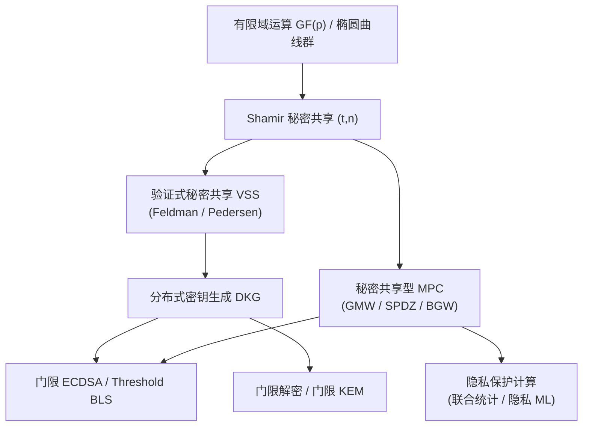
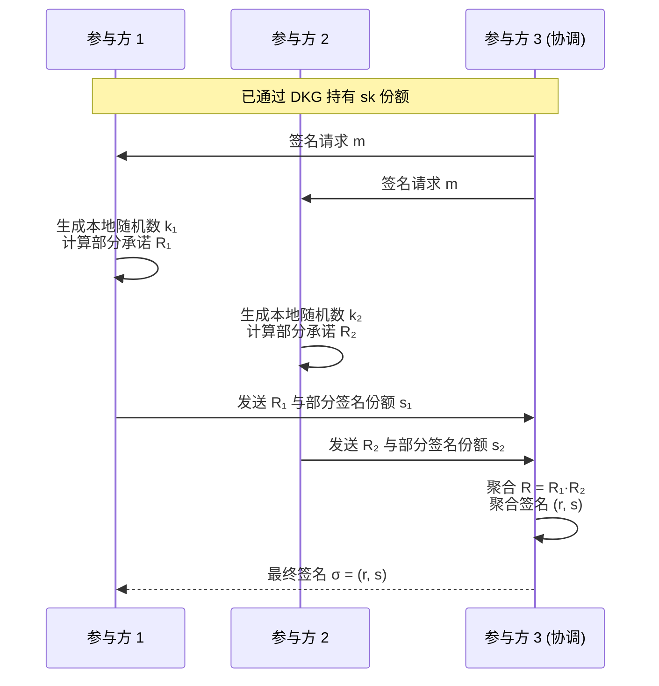

# 密码学（66）· 门限密码与秘密共享（Shamir / 门限签名 / MPC）

> [!abstract] TL;DR
> - **秘密共享**将一个秘密 s 拆成 n 份，任意 t 份可重建 s，少于 t 份零信息——Shamir (t,n) 方案基于多项式插值，信息论安全。
> - **验证式秘密共享（VSS）**（Feldman/Pedersen）让验证者能在不重建秘密的前提下确认份额合法，防止恶意分发者。
> - **门限签名**（Threshold ECDSA、Threshold BLS）让 t 个参与方协同完成一次签名，无需任何单点拥有完整私钥——BLS 天然可门限化。
> - **分布式密钥生成（DKG）**在无可信中心的条件下协作生成密钥对，消除单点信任。
> - **多方安全计算（MPC）**是更广泛的框架：任意函数在不泄露各方输入的情况下联合计算，秘密共享是其最重要的构造工具。
> - 应用：多重签名钱包、分布式 CA、云 HSM、MPC 钱包、门限 TLS。

---

## 概述与定位

### 为什么需要门限密码

传统密码学中，私钥被单一实体持有：一台硬件安全模块（HSM）、一把 USB 密钥、一个可信服务器。这带来了**单点故障**与**单点信任**两类问题：

- **单点故障**：设备损毁、丢失或被盗，密钥不可恢复，所有受保护的资产彻底失控。
- **单点信任**：持有密钥的实体若被攻击或行为不端，可单方面滥用密钥——无需任何共谋。

**门限密码（Threshold Cryptography）**提供了系统性解决方案：将密钥的"使用权"分散到 n 个参与方，只有 t 个或以上的参与方协作，才能完成签名、解密等操作。任意 t-1 个参与方单独无法执行任何操作，也无法恢复完整私钥。

这一思想与现实世界中的"双人规则"（two-person rule）、银行保险柜"双锁"机制同构，但在数学上是精确的、可证明安全的。

### 知识地图

门限密码的技术栈从底层到顶层大致如下：



本文从 Shamir 秘密共享出发，逐层向上展开。

---

## 原理与机制

### Shamir 秘密共享：(t, n) 门限方案

**Shamir (t, n) 方案**由 Adi Shamir 于 1979 年提出，建立在拉格朗日插值定理上：

**核心思想**：一条 (t-1) 次多项式由任意 t 个不同点唯一确定，但 t-1 个点不能确定任何东西（欠定方程组有无穷解）。

设秘密为 s（某有限域 GF(p) 中的元素，p 是足够大的素数）：

1. **分发（Share）**：分发者选取随机多项式
   ```
   f(x) = s + a₁x + a₂x² + ... + a_{t-1}x^{t-1}   (mod p)
   ```
   其中 a₁, ..., a_{t-1} 是随机系数，f(0) = s。对 n 个参与方 i = 1, ..., n，分发份额 sᵢ = f(i)。

2. **重建（Reconstruct）**：任意 t 个参与方 {i₁, ..., iₜ} 持有对应点 (iⱼ, sᵢⱼ)，使用**拉格朗日插值**恢复 f(0) = s：
   ```
   s = f(0) = Σⱼ sᵢⱼ · λⱼ(0)   (mod p)
   ```
   其中拉格朗日基多项式在 x=0 处的值：
   ```
   λⱼ(0) = ∏_{k≠j} (0 - iₖ) / (iⱼ - iₖ)   (mod p)
   ```

3. **安全性（信息论）**：少于 t 个份额对 s 的分布完全无信息。直觉上：t-1 个点可被任意 s' 的 (t-1) 次多项式通过，无法排除任何候选秘密——这是**信息论安全（information-theoretic security）**，不依赖任何计算困难假设。

**性质总结：**

| 性质 | 描述 |
|---|---|
| 正确性 | 任意 t 份额唯一确定 s |
| 安全性 | 任意 t-1 份额对 s 零信息（信息论） |
| 灵活性 | t 和 n 可自由设置（如 (3,5)、(2,3)） |
| 可扩展 | 不重建 s 的前提下可刷新份额 |

### 验证式秘密共享（VSS）

**问题**：基本 Shamir 方案假设分发者诚实。若分发者发送错误份额（如给某参与方一个伪造的 f(i)），重建时会得到错误的 s，且无法察觉。

**VSS（Verifiable Secret Sharing）** 让每个参与方能在不知道 s 的情况下验证自己收到的份额是否与其他人一致。

#### Feldman VSS

**设置**：使用循环群 G（阶为 p，生成元 g），群上的离散对数问题困难。

**额外广播**：分发者公开「多项式系数的群承诺」：
```
C₀ = g^s,  C₁ = g^{a₁},  ...,  C_{t-1} = g^{a_{t-1}}  (群运算 mod p)
```

**验证**：参与方 i 收到份额 sᵢ = f(i) 后，验证：
```
g^{sᵢ} =? C₀ · C₁^i · C₂^{i²} · ... · C_{t-1}^{i^{t-1}}
```
（因为 f(i) = s + a₁i + ... + a_{t-1}i^{t-1}，指数对应加法，群运算对应乘法）

**安全性**：承诺是"计算隐藏"的（离散对数困难），但"完美绑定"的——恶意分发者无法让错误份额通过验证。缺点：C₀ = g^s 泄露了 s 的一个承诺，在某些协议中不可接受。

#### Pedersen VSS

使用两个生成元 g、h（h = g^x，x 未知），承诺变为：
```
Cᵢ = g^{aᵢ} · h^{bᵢ}  （引入额外随机多项式 q(x)，bᵢ = q(i)）
```
份额变为 (f(i), q(i))，承诺是**完美隐藏**的（不泄露任何关于 s 的信息），同时仍可验证一致性。代价是多项式数量翻倍，通信量增加。

---

## 结构/算法/伪代码详解

### 分布式密钥生成（DKG）

**问题**：门限签名需要一个密钥对 (sk, pk)，但任何单一实体都不应持有完整的 sk。DKG 让 n 个参与方在无可信中心的条件下共同生成密钥对，使得 pk 公开，sk 以门限方式分散持有。

**基于 VSS 的 DKG（Pedersen 1991）思路：**

```
1. 每个参与方 i 独立执行 VSS 分发者角色：
   - 选取随机秘密 sᵢ ∈ GF(p)
   - 生成多项式 fᵢ(x)，其中 fᵢ(0) = sᵢ
   - 广播 Feldman/Pedersen 承诺 {Cᵢⱼ}
   - 向每个参与方 j 私密发送份额 fᵢ(j)

2. 所有参与方验证收到的份额（对照承诺）；
   若某参与方广播无效份额，执行投诉/排除流程

3. 最终密钥：
   sk（以份额持有） = Σᵢ fᵢ(j)   （参与方 j 持有的总份额）
   pk = ∏ᵢ Cᵢ₀ = g^(Σᵢ sᵢ)     （公开验证）
```

实际上没有任何人知道完整的 sk = Σᵢ sᵢ，sk 只以 t-of-n 的份额形式分散存在，这正是 DKG 的核心价值。

### 门限 BLS 签名

BLS 签名（Boneh-Lynn-Shacham）天然支持门限化，因为 BLS 签名是线性的（群运算）：

**BLS 基础回顾：**
```
密钥生成：sk ∈ Zₚ, pk = g₂^{sk}
签名：σ = H(m)^{sk}    （H: 消息哈希到 G₁ 群）
验证：e(σ, g₂) =? e(H(m), pk)   （双线性配对）
```

**门限 BLS (t, n)：**

```
分发：用 Shamir 共享 sk，每个参与方 i 持有 skᵢ = f(i)
     公钥份额：pkᵢ = g₂^{skᵢ}（公开）

部分签名：参与方 i 计算 σᵢ = H(m)^{skᵢ}
          （任意 t 个参与方执行此步骤）

聚合：收集 t 个部分签名 {σᵢⱼ}，用拉格朗日系数聚合：
     σ = ∏ⱼ σᵢⱼ^{λⱼ(0)}   （群乘法对应指数加权）
     等价于 H(m)^{Σ λⱼ skᵢⱼ} = H(m)^{f(0)} = H(m)^{sk}

验证：与普通 BLS 验证完全相同
```

BLS 的线性性使得聚合步骤非常简洁——这也是以太坊 PoS 共识选择 BLS 签名的重要原因（数百个验证者的签名可高效聚合）。

### 门限 ECDSA

ECDSA 不像 BLS 那样天然线性，门限化需要更复杂的协议（ECDSA 中涉及随机数 k 的逆元，不是线性操作）。主流方案：

**GG18 / GG20（Gennaro-Goldfeder）**：基于 Paillier 同态加密或秘密共享计算随机数 k 的份额、k 的逆元份额，以及最终签名的份额，通过多轮 MPC 协议完成签名而无需重建 k 或 sk。代价是通信轮数较多（3-5 轮）。

**CGGMP21 / Lindell22**：更高效的两方或多方 ECDSA，优化通信轮数，支持异步网络。



---

## 工具视角与实战

### 主流实现库

| 库 | 语言 | 支持方案 | 应用场景 |
|---|---|---|---|
| **tss-lib** | Go | Threshold ECDSA (GG18/GG20) | 链上 MPC 钱包（如 Binance TSS） |
| **FROST** (ZCash/ietf) | Rust/Python | Threshold Schnorr/Ed25519 | Bitcoin Taproot 门限签名 |
| **Herumi BLS** | C++/Go/Wasm | Threshold BLS | 以太坊验证者聚合 |
| **secretsharing** | Python | Shamir SSS | 密钥备份、教学原型 |
| **SCALE-MAMBA / MP-SPDZ** | C++ | MPC (SPDZ/Overdrive) | 隐私保护数据分析 |

### 典型应用场景

**1. 多重签名加密货币钱包**

比特币的多签脚本（P2SH multisig）在链上暴露参与方数量与阈值，门限签名对外看起来就是普通签名，链上隐私更好：

```
传统多签：OP_2 <pubkey1> <pubkey2> <pubkey3> OP_3 OP_CHECKMULTISIG
门限签名：与普通签名链上格式完全相同，阈值逻辑在链下的 MPC 中完成
```

**2. 分布式 CA（证书颁发机构）**

CA 私钥是 PKI 安全的核心——一旦泄露，攻击者可签发任意假证书。门限方案将 CA 私钥以 (3,5) 方式分散到不同地理位置的 HSM 上，任意 3 台协作才能签发证书，单台被攻破不影响整体安全。

**3. 云 HSM 与 MPC 钱包**

Fireblocks、Curv、ZenGo 等 MPC 钱包服务商将用户私钥分成客户端份额（手机/浏览器）与服务端份额（云 HSM），两方 (2,2) 协同完成签名——客户端被攻击或服务端被攻击均无法单独盗取资产。

### Shamir 密钥备份的实战注意事项

```
正确流程：
1. 离线主机生成熵 → 派生主密钥 master_key（如 BIP32 根密钥）
2. Shamir(3,5) 分享 master_key → 5 份 share
3. 每份 share 分开存储（纸张/金属板/加密 U 盘），异地保管
4. 销毁 master_key 内存中的明文副本
5. 需要时：在隔离网络离线机器上汇集 3 份 share 重建

错误做法（常见）：
× 重建后在联网设备上长期保留 master_key
× 所有 share 存储在同一台设备（等于没分）
× 使用非密码学安全的随机数生成 share（伪随机数攻击）
```

---

## 安全性与正确使用

**1. 信息论安全的边界**

Shamir 方案的信息论安全仅适用于**被动攻击者**（窃听 t-1 个份额）。若攻击者能**主动操控**参与方（如提交伪造份额），则需要 VSS 或认证信道。

> [!note] VSS 是生产环境的最低门槛
> 不使用 VSS 的 Shamir 方案在实际部署中几乎都存在恶意分发者攻击面。所有生产级秘密共享实现（tss-lib、FROST 等）均内置 VSS 或等效承诺机制。

**2. 门限签名中的随机数安全**

ECDSA 的 k（随机数）重用会直接导致私钥泄露（参见 [[61.侧信道攻击]]），门限 ECDSA 中 k 以分布式方式生成，要求所有参与方的随机数相互独立，协议本身保证最终 k 的随机性。若某参与方提交固定的 k 份额，可能导致其他参与方私钥份额泄露——这是 GG20 之后协议版本着重修复的问题（GG20 存在此类安全漏洞，GG21/CGGMP21 已修复）。

> [!note] 使用库版本务必检查 CVE
> GG20 协议 2021 年被发现参与方可通过提交特殊值影响随机数生成，导致另一参与方私钥份额泄露。请检查所用库是否已更新至 CGGMP21 或 Lindell22 等修复版本。

**3. 网络层安全要求**

门限协议依赖认证且保密的通信信道（各参与方之间），否则攻击者可通过中间人攻击插入恶意消息影响协议。生产部署应使用 mTLS 或预建立的认证密钥加密信道。

**4. DKG 重置与份额刷新**

份额在使用一定次数后建议**主动刷新（Proactive Secret Sharing）**：在不改变 pk 和 sk 的情况下重新分发新份额，使攻击者需要在份额有效期内同时攻陷 t 个参与方，而不是在较长时间内分批攻击。

**5. MPC 的安全模型差异**

| 安全模型 | 含义 | 适用场景 |
|---|---|---|
| 半诚实（Semi-honest） | 参与方遵守协议但试图推断他人输入 | 互信内部多方 |
| 恶意（Malicious） | 参与方可任意偏离协议 | 外部不可信参与方 |
| 阈值诚实多数 | 至多 (n-1)/2 个参与方可恶意 | BGW、SPDZ 等协议 |

---

## 小结

门限密码与秘密共享解决了单点私钥持有的根本性安全困境：

1. **Shamir (t,n) 秘密共享**：基于多项式插值，信息论安全，t-1 份额零信息，是所有门限方案的数学基础。
2. **验证式秘密共享（VSS）**：Feldman（计算隐藏）或 Pedersen（完美隐藏）承诺防止恶意分发者，是生产级门限方案的必要组件。
3. **分布式密钥生成（DKG）**：消除可信中心，密钥以份额形式天然分散生成，无人知道完整私钥。
4. **门限 BLS**：天然可线性聚合，适合大规模验证者场景；**门限 ECDSA**需要更复杂的 MPC 协议，已有成熟的 CGGMP21/Lindell22 方案。
5. **MPC** 是更广泛的框架，秘密共享是其最核心的构造工具，支撑着从隐私计算到分布式签名的广泛应用。

---

## 相关阅读

- [[65.同态加密基础]] —— 同态加密与 MPC 的关系（FHE 可替代部分 MPC 场景）
- [[67.Signal协议与双棘轮]] —— 端到端加密中的密钥管理
- [[50.格密码基础]] —— 后量子门限方案的数学基础
- [[52.Dilithium-ML-DSA]] —— 数字签名基础（门限签名的基础方案之一）
- [[61.侧信道攻击]] —— 门限协议实现中的侧信道威胁
- [[43.随机数与熵]] —— DKG 和门限签名中的随机数要求
- [[00.密码学总览]] —— 全系列导航

---

⬅️ 上一篇 [[65.同态加密基础]] ｜ 🏠 [[00.密码学总览]] ｜ 下一篇 [[67.Signal协议与双棘轮]] ➡️