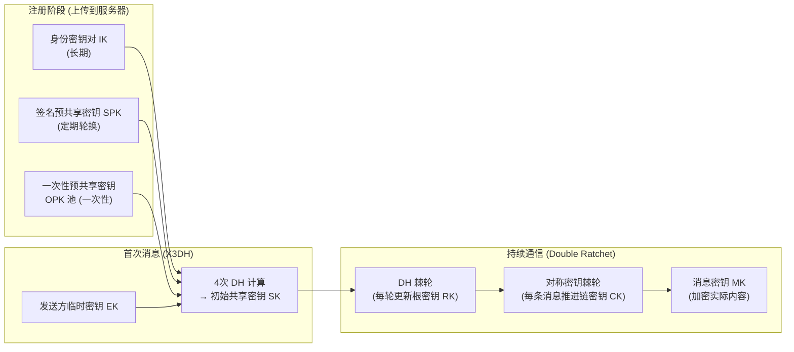
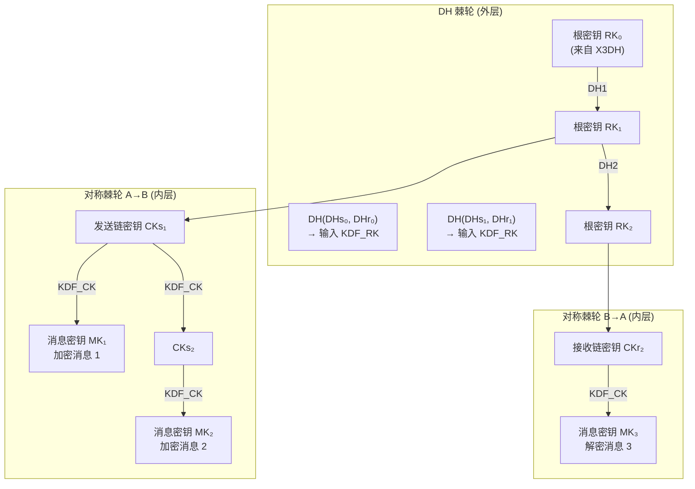

# 密码学（67）· Signal 协议与双棘轮（X3DH + Double Ratchet）

> [!abstract] TL;DR
> - **Signal 协议** = **X3DH**（异步密钥协商，建立初始共享密钥）+ **Double Ratchet**（每条消息派生独立密钥，保证前向保密与自愈）。
> - **X3DH** 将身份密钥 IK、签名预共享密钥 SPK、一次性预共享密钥 OPK 与发送方临时密钥 EK 做四次 DH，在无需对方在线的情况下建立会话。
> - **Double Ratchet** = DH 棘轮（每次通信轮更新根密钥，提供 PCS 自愈）+ 对称密钥棘轮（每条消息推进链密钥，提供 PFS 前向保密）。
> - **前向保密（PFS）**：历史消息密钥即用即弃，当前密钥泄露不影响过去通信。
> - **事后保密/自愈（PCS）**：即使私钥临时泄露，一旦双方再次交换新 DH 公钥，安全可完全恢复。
> - 被 Signal、WhatsApp（20 亿用户）、Facebook Messenger 秘密对话、Matrix、Google Messages 等广泛采用。

---

## 概述与定位

### 端到端加密通信的安全需求

现代即时通信的安全需求远超 TLS 所能提供的：

| 需求 | TLS | Signal 协议 |
|---|---|---|
| 传输加密（防运营商窃听） | 是 | 是 |
| 服务端无法读取内容（E2E） | 否（服务端解密） | 是 |
| 前向保密（历史消息安全） | 部分（会话级） | 是（逐条消息） |
| 自愈（事后保密 PCS） | 否 | 是 |
| 离线首消息 | 否 | 是（X3DH 异步） |
| 密钥泄露后自动恢复 | 否 | 是（DH 棘轮） |

TLS 1.3 通过 DHE/ECDHE 握手提供会话级前向保密（历史会话密钥不因长期私钥泄露而受损），但整个 TLS 会话共享同一组密钥，且没有"自愈"机制——攻击者若劫持了当前会话密钥，在会话期间可读所有消息。

Signal 协议的设计目标是：**每条消息使用独立密钥，密钥即用即弃，且密钥树每次 DH 交换后完全更新，即使某时刻密钥泄露也能在后续通信中恢复安全**。

### 协议全景



---

## 原理与机制

### X3DH：扩展三重 Diffie-Hellman

X3DH（Extended Triple Diffie-Hellman）解决了**异步密钥协商**问题：Alice 可以向不在线的 Bob 发送第一条消息，且该消息具有完整的端到端加密和前向保密属性。

#### 密钥材料

**Bob 的预共享密钥（提前上传到服务器）：**

```
IK_B   ：身份密钥对（长期密钥，用于身份认证）
SPK_B  ：签名预共享密钥（数周或数月轮换一次），包含：
           SPK_B.public  —— 公钥，上传服务器
           Sig(IK_B, SPK_B.public)  —— 用 IK_B 对 SPK_B 公钥的签名（防篡改）
OPK_B  ：一次性预共享密钥（每次握手消耗一个，服务器维护池），可选
```

**Alice 在发送首消息时生成：**

```
IK_A   ：Alice 的身份密钥对
EK_A   ：临时密钥对（本次会话专用，用后丢弃）
```

#### 四次 DH 推导共享密钥

Alice 从服务器获取 Bob 的预共享密钥后，执行四次 DH：

```
DH1 = DH(IK_A.private, SPK_B.public)   — Alice 身份 × Bob 签名预共享
DH2 = DH(EK_A.private, IK_B.public)    — Alice 临时 × Bob 身份
DH3 = DH(EK_A.private, SPK_B.public)   — Alice 临时 × Bob 签名预共享
DH4 = DH(EK_A.private, OPK_B.public)   — Alice 临时 × Bob 一次性预共享（可选）
```

将四次 DH 结果拼接后通过 KDF（如 HKDF）派生出初始共享密钥 SK：

```
SK = KDF(DH1 || DH2 || DH3 || DH4)
```

**为什么要四次 DH？每次 DH 贡献不同安全属性：**

| DH | 贡献 |
|---|---|
| DH1 (IK_A × SPK_B) | 证明 Alice 知道自己的身份私钥；SPK_B 由 IK_B 签名，防止 Bob 的预共享密钥被替换 |
| DH2 (EK_A × IK_B) | 证明 Bob 控制其身份私钥（相互认证基础） |
| DH3 (EK_A × SPK_B) | 引入 Alice 的临时性（前向保密：EK_A 用后丢弃） |
| DH4 (EK_A × OPK_B) | 一次性，防重放；若不可用可省略（稍弱安全性） |

Alice 发出的初始消息包含 `(IK_A.public, EK_A.public, OPK_B.id, 密文)`，Bob 收到后可用相同方式重建 SK，然后解密初始消息。

#### 安全性属性

- **互认证**：DH1 和 DH2 共同保证双方都控制各自的身份密钥，无需额外认证步骤。
- **前向保密**：EK_A 用后丢弃，SPK_B 定期轮换，OPK_B 一次性；SK 的推导依赖这些临时材料，历史 SK 不受未来密钥泄露影响。
- **异步友好**：Bob 可完全离线，服务器代为持有预共享密钥；Alice 发出后 Bob 在任意时刻上线均可解密。

---

## 结构/算法/伪代码详解

### Double Ratchet 算法

X3DH 建立了初始共享密钥 SK，Double Ratchet 从 SK 出发，为每条消息派生独立的加密密钥。

Double Ratchet = **DH 棘轮**（外层）+ **对称密钥棘轮**（内层）。

#### 状态结构

每方持有以下状态：

```
DHs      ：本方当前 DH 密钥对（Sending ratchet key）
DHr      ：对方最新发来的 DH 公钥（Receiving ratchet key）
RK       ：根密钥（Root Key，32 字节）
CKs, CKr ：发送/接收链密钥（Chain Key，32 字节）
Ns, Nr   ：发送/接收消息计数器
MKSKIPPED：跳过消息密钥缓存（处理乱序消息）
```

#### 对称密钥棘轮（KDF 链）

每次发送或接收一条消息时，从当前链密钥推进一步：

```
CK_new, MK = KDF_CK(CK_current)
  其中：
  MK  = HMAC-SHA256(CK, 0x01)   ← 消息密钥（加密本条消息）
  CK_new = HMAC-SHA256(CK, 0x02) ← 新链密钥（下条消息用）
```

MK 用后即弃（或安全删除），CK 推进。这保证了**前向保密**：即使攻击者得到当前 MK，无法推算前一条消息的 MK（单向 HMAC）。

#### DH 棘轮（Ratchet Step）

当收到对方携带新 DH 公钥的消息时，触发 DH 棘轮步骤（切换发送/接收链密钥）：

```
# 收到对方新公钥 DHr_new 时：
RK_new, CKr_new = KDF_RK(RK, DH(DHs, DHr_new))
  # 更新接收链密钥

# 生成本方新密钥对并更新发送链：
DHs_new = GENERATE_DH()
RK_new2, CKs_new = KDF_RK(RK_new, DH(DHs_new, DHr_new))
  # 更新发送链密钥

RK = RK_new2
```

每次 DH 棘轮步骤都将新的 DH 共享值混入根密钥，根密钥更新后派生全新的链密钥——**此前的所有链密钥和消息密钥与新状态完全断开**。

**这实现了"事后保密"（Post-Compromise Security / PCS）**：若攻击者在某时刻得到了完整的 Double Ratchet 状态（所有密钥），当双方下次交换新的 DH 公钥时，攻击者因不知道新的 DH 私钥，无法推算后续的 RK、CK 或 MK——安全性在一次新 DH 后完全恢复。

#### 完整密钥推进流程图



---

## 工具视角与实战

### 消息格式：头部携带 DH 公钥

每条 Double Ratchet 消息的格式包含：

```
Header：
  DHs_public     ← 发送方当前 DH 公钥（用于接收方触发棘轮步骤）
  Ns             ← 发送计数器
  Pn             ← 上一个发送链发送的消息数（用于乱序处理）

Body：
  AES-256-CBC / AES-256-GCM 加密的实际消息（密钥 = MK）
```

接收方通过对比 `DHs_public` 是否变化来判断是否需要触发 DH 棘轮步骤。

### 乱序消息处理

Signal 协议支持网络乱序传递（消息 3 先于消息 2 到达）。接收方预先推进跳过的消息密钥并缓存在 `MKSKIPPED` 中（设有上限，防止内存攻击），待后续补丁到达时直接使用缓存密钥解密。

### 与其他协议的对比

| 特性 | Signal Double Ratchet | TLS 1.3 会话 | OTR（旧协议） |
|---|---|---|---|
| 前向保密粒度 | 每条消息 | 每次握手（会话级） | 消息级（无 DH 棘轮） |
| 事后保密（自愈） | 是（DH 棘轮） | 否 | 否 |
| 异步离线消息 | 是（X3DH） | 否 | 否 |
| 消息乱序支持 | 是 | 是（TCP 层） | 部分 |
| 拒绝否认 | 是 | 否（证书绑定） | 是 |

### 支持 Signal 协议的应用

- **Signal**：参考实现，开源（signal-protocol-java / libsignal）
- **WhatsApp**：使用 Signal 协议加密 10 亿+ 活跃用户的消息
- **Facebook Messenger 秘密对话**：端对端加密模式使用 Signal 协议
- **Google Messages**（RCS 加密）：基于 Signal 协议的 E2EE
- **Matrix / Element**：基于 Signal 协议衍生的 MegOlm 协议，支持群组聊天

### 从 TLS 到 Signal 的层次关系

在实际部署中，Signal 消息通常在 TLS 之上传输——TLS 提供传输层安全（防止中间人篡改密文），Signal 协议提供端到端加密（防止服务器读取明文）。两者互补，各自防御不同的威胁模型。

---

## 安全性与正确使用

**1. 安全数字身份验证（Safety Numbers）**

X3DH 中，服务器传递 Bob 的预共享密钥给 Alice。若服务器恶意替换这些密钥（中间人攻击），X3DH 握手会成功但与攻击者而非 Bob 建立。Signal 通过让双方比对"Safety Number"（由双方身份密钥派生的人类可读指纹）来检测此类攻击——这是 Signal 扫描 QR 码或朗读号码的原理。

> [!note] Safety Number 必须通过安全信道比对
> Safety Number 比对是 Signal 协议唯一需要带外（out-of-band）验证的步骤。若跳过此步骤，服务器中间人攻击在技术上可行。在高安全需求场景（记者、活动人士），必须完成 Safety Number 比对。

**2. 密钥材料的生命周期管理**

- `OPK` 一次性使用后必须在服务器侧删除（不可复用），服务器若重放旧 OPK，接收方可能解密到错误消息但无法检测。Signal 规范中 Bob 在上传新 OPK 批次时应验证服务器正确删除了已用 OPK。
- `SPK` 应定期轮换（Signal 建议数周），过期 SPK 使用期间产生的消息若在轮换后到达需特殊处理。

**3. 前向保密的边界**

PFS（前向保密）指：当前密钥泄露不影响历史消息。但 Signal 无法保护**已在设备上解密并明文存储的消息**——设备被没收、应用备份（未加密的 Google Drive/iCloud 备份）均可读取历史聊天记录。这是物理安全问题，超出了密码协议的保护范围。

> [!note] 应用层备份加密同样关键
> Signal 自身的本地备份加密（passphrase 派生密钥）和 iOS 设备加密是保护历史消息的最后防线。使用明文备份到云存储会使 PFS 的密码学保证在实践中失效。

**4. 群聊的扩展：MLS 协议**

Signal 的双棘轮是为双方通信设计的。WhatsApp 将 Signal 协议的发件方密钥（Sender Key）方案用于群聊：每个成员生成一条链，其他成员订阅。这破坏了部分 PCS 属性（成员变更时需显式重协商）。IETF 的 **MLS（Message Layer Security，RFC 9420）** 是专为大规模群组设计的下一代 E2EE 协议，使用树状棘轮（TreeKEM）实现高效群组密钥更新，已被多个主流通信平台采纳。

**5. 与后量子密码的结合**

Signal 协议本身基于 X25519（Curve25519 ECDH），量子计算机上的 Shor 算法可破解 X3DH 中的所有 DH 步骤。Signal 基金会已开始研究将 CRYSTALS-Kyber（ML-KEM）混入 X3DH，实现后量子混合模式，参见 [[51.Kyber-ML-KEM]]。Double Ratchet 的对称部分（AES-256、HMAC-SHA256）在量子计算机面前仍安全（Grover 算法仅将密钥空间减半，256 位对称密钥仍足够）。

---

## 小结

Signal 协议是现代端到端加密通信的事实标准，其设计优雅地解决了即时通信的多维安全需求：

1. **X3DH** 解决异步场景：通过预共享密钥池，让 Alice 在 Bob 不在线时建立完整的认证且前向保密的会话。
2. **Double Ratchet** 提供逐消息前向保密（PFS）与自愈（PCS）的双重保障：DH 棘轮确保密钥材料不断更新，对称棘轮确保每条消息密钥独立。
3. **PFS vs PCS 的互补**：PFS 保护历史，PCS 保护未来——两个棘轮共同实现了这一互补保障。
4. **与 TLS 的互补**：TLS 保护传输层，Signal 协议保护端到端内容，两者都是必要的。
5. **实践边界**：密码协议强大，但设备安全、备份加密、Safety Number 比对等非密码因素同样是完整安全的必要组成部分。

---

## 相关阅读

- [[66.门限密码与秘密共享]] —— 密钥分散管理的基础方案
- [[68.Falcon签名]] —— 后量子签名，可用于 X3DH 身份密钥的量子化替换
- [[51.Kyber-ML-KEM]] —— 可融入 X3DH 的后量子 KEM
- [[26.ECDH密钥交换]] —— X3DH 中每次 DH 步骤的基础
- [[43.随机数与熵]] —— 临时密钥 EK 的随机数要求
- [[61.侧信道攻击]] —— 实现 Double Ratchet 时的侧信道风险
- [[00.密码学总览]] —— 全系列导航

---

⬅️ 上一篇 [[66.门限密码与秘密共享]] ｜ 🏠 [[00.密码学总览]] ｜ 下一篇 [[68.Falcon签名]] ➡️