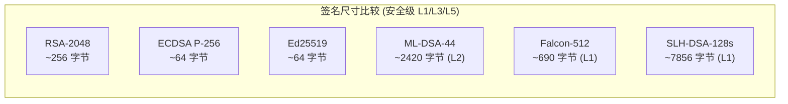
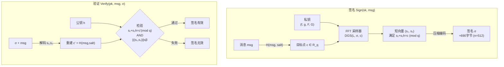

# 密码学（68）· Falcon（FIPS 206 格基签名）

> [!abstract] TL;DR
> - **Falcon** 是 NIST 后量子密码标准化第四个正式标准（FIPS 206，2024 年末发布），基于**格密码**的数字签名方案。
> - 安全基础：**NTRU 格**上的短向量问题（SVP/CVP），抗经典与量子攻击。
> - 核心技术：**GPV 框架**（基于格陷门的签名）+ **FFT 高斯采样器**（快速且安全地采样短向量）。
> - 签名紧凑：Falcon-512 约 **690 字节**、Falcon-1024 约 **1330 字节**，比 ML-DSA 小约 30%~40%。
> - 实现难度高：浮点高斯采样器存在侧信道风险，常量时间实现需要专用整数采样器，工程复杂度显著高于 ML-DSA。
> - 选型建议：对签名大小极其敏感（如区块链、嵌入式）考虑 Falcon；需要简单可靠实现优先选 [[52.Dilithium-ML-DSA]]。

---

## 概述与定位

### NIST PQC 标准化与 Falcon 的位置

2024 年，NIST 正式发布了后量子密码标准化第一批标准，共四个标准：

| 标准 | 算法 | 功能 | 安全假设 |
|---|---|---|---|
| FIPS 203 | ML-KEM（Kyber） | 密钥封装 | Module-LWE |
| FIPS 204 | ML-DSA（Dilithium） | 数字签名 | Module-LWE / Module-SIS |
| FIPS 205 | SLH-DSA（SPHINCS+） | 数字签名 | 哈希函数安全性 |
| **FIPS 206** | **Falcon（FN-DSA）** | **数字签名** | **NTRU 格上 SVP** |

Falcon 是四个标准中**唯一基于 NTRU 格**的方案，也是签名尺寸最紧凑的选项。与 ML-DSA 同为格基签名但数学结构不同，两者提供不同的工程权衡，互为补充。

Falcon 的完整名称在 FIPS 206 中称为 **FN-DSA（Fast Fourier Lattice-Based Compact Signatures over NTRU）**，但业界普遍仍称 Falcon。

### 签名大小对比



Falcon-512 的签名约 690 字节，比 ML-DSA 紧凑得多（ML-DSA-44 约 2420 字节），比 SLH-DSA 更是小一个数量级——这使得 Falcon 在每笔交易需要存储签名的区块链场景、带宽受限的嵌入式通信场景中极具吸引力。

---

## 原理与机制

### NTRU 格基础

**NTRU** 最初是 1996 年由 Hoffstein、Pipher、Silverman 提出的公钥加密方案，其核心数学结构——**NTRU 格**——后来成为格密码中一类重要的格结构。

**环设置：** Falcon 工作在多项式环上：

```
R = Z[x] / (x^n + 1)     n = 512 或 1024（2 的幂次）
R_q = Z_q[x] / (x^n + 1) q = 12289（对于 n=512 和 1024）
```

`x^n + 1` 是分圆多项式（n 为 2 的幂次时不可约），q = 12289 是特别选取的 NTT 友好素数（满足 q ≡ 1 mod 2n）。

**NTRU 难题：** 给定 h = g · f^{-1} mod q，其中 f 和 g 是"短"多项式（系数很小），求 (f, g) 是计算困难的。这等价于在 NTRU 格中寻找短向量（SVP）：

```
NTRU 格 L_{h,q}：
由向量 (f, g) 和 (h, 1) 的线性组合生成的 2n 维整数格
其中 (f, g) 是一个特别短的向量（密钥）
公钥 h = g · f^{-1}（mod q）没有泄露 (f, g) 的信息
```

在经典计算机上，最优格归约算法（BKZ-β）在指数时间内运行；量子计算机（如 Grover）对格 SVP 没有超多项式加速——这是格密码抗量子的根本。

### GPV 签名框架

Falcon 基于 **GPV 框架**（Gentry-Peikert-Vaikuntanathan，2008），这是用格陷门（trapdoor）构造数字签名的通用方法。

**基本思路（简化）：**

```
密钥生成：
  - 生成短多项式对 (f, g)（这就是陷门/私钥）
  - 计算公钥 h = g · f^{-1} mod q

签名（哈希到格点，再找短向量）：
  - 计算消息哈希 c = H(msg, nonce)  （映射到格上某个目标点）
  - 用陷门 (f, g) 找一个短向量 (s₁, s₂) 使得
    s₁ + s₂ · h = c  (mod q)
    且 ||(s₁, s₂)|| 足够小（高斯分布内）

验证：
  - 检查 s₁ + s₂ · h = c (mod q)
  - 检查 ||(s₁, s₂)|| ≤ 阈值
```

关键在于：**签名是满足特定代数关系的"短向量"**，公钥 h 允许任何人验证代数关系，但没有陷门 (f, g)，找到这样的短向量等价于解 NTRU SVP。

### 为什么需要高斯采样

朴素的签名做法是：找任意满足条件的短向量。但这会泄露私钥！

**直觉：** 若签名均匀采样（而非高斯采样），多个签名的分布会"暴露"出私钥方向。攻击者通过收集多个签名做统计分析，可以重建 (f, g)——这正是 2016 年对 GGH 签名方案的攻击方式。

**高斯采样的作用：** 使签名的分布精确为以格点 c 为中心的**离散高斯分布** D_{L,σ,c}。由于高斯分布关于格具有旋转对称性，签名中不含任何关于陷门方向的信息——这称为**签名统计独立于私钥**（information-theoretically）。

GPV 的安全性正式证明依赖于此：签名的分布与没有陷门的情况下随机短向量无法区分。

---

## 结构/算法/伪代码详解

### FFT 加速的高斯采样器

标准的 GPV 高斯采样在 n 维时需要计算 Cholesky 分解和 n 次 LDLT 分解，复杂度 O(n³)，效率极低。Falcon 的核心创新是利用 NTRU 结构将采样加速到 O(n log n)。

**关键观察：** NTRU 格有特殊的代数结构——格基矩阵可以用 NTRU 多项式表示，对应的 Gram 矩阵可以用 FFT（快速傅里叶变换）在频域高效分解。

**Falcon 的 FFT 高斯采样器（Fast Fourier Sampling）：**

```
Input: 私钥 (f, g, F, G)（满足 fG - gF = q 的 NTRU 密钥），目标点 t
Output: 短向量 (s₁, s₂) 服从以 t 为中心的离散高斯分布

1. 计算 FFT(f), FFT(g), FFT(F), FFT(G)
2. 在频域构造格基的 LDL* 分解（LDLT 分解）
3. 递归调用 SamplerZ（一维整数高斯采样）n 次
   （利用 NTRU 的分圆多项式结构，递归拆分为两个 n/2 维问题）
4. IFFT 变换回时域得到 (s₁, s₂)
```

递归分解的关键在于 `x^n + 1 = (x^{n/2} - ζ)(x^{n/2} + ζ)`（复数因子），使得 n 维问题分解为两个 n/2 维问题，总复杂度 O(n log n)。

**完整签名/验证流程：**



### 参数规格

| 参数 | Falcon-512 | Falcon-1024 |
|---|---|---|
| n（多项式次数） | 512 | 1024 |
| q（模数） | 12289 | 12289 |
| 安全级别 | NIST L1（≈AES-128） | NIST L5（≈AES-256） |
| 公钥大小 | 897 字节 | 1793 字节 |
| 签名大小（平均） | ≈690 字节 | ≈1330 字节 |
| 签名大小（ML-DSA 对应级） | ML-DSA-44: 2420 B | ML-DSA-87: 4627 B |
| 密钥生成速度（参考） | 较慢（复杂陷门生成） | 较慢 |
| 签名速度（参考） | 中等（FFT 采样） | 中等 |
| 验证速度 | 快（NTT 多项式乘法） | 快 |

签名大小约为 ML-DSA 的 28%~29%——这是 Falcon 最核心的竞争优势。

---

## 工具视角与实战

### 实现库

| 库 | 语言 | 说明 |
|---|---|---|
| **Falcon 参考实现** | C | NIST 提交的参考实现，含软件高斯采样器 |
| **liboqs** | C | Open Quantum Safe 项目，集成 Falcon-512/1024 |
| **pqclean/Falcon** | C | PQClean 项目，可移植清洁实现 |
| **CIRCL** | Go | Cloudflare，含 Falcon 支持 |
| **PQCrypto-SIDH** | C#/.NET | Microsoft Research，含 Falcon |
| **falcon-rust** | Rust | 社区实现，含常量时间整数采样器 |

> [!note] 使用 liboqs 作为集成入口
> 直接使用参考实现需要注意浮点采样器的侧信道问题（见安全性节）。liboqs 集成了多个实现变体，并跟踪 NIST 标准更新，是工程集成的推荐入口。

### 典型使用场景

**1. 区块链交易签名**

Falcon-512 的 690 字节签名比 ML-DSA 的 2420 字节小约 71%。在每笔链上交易都需要存储签名（永久）的区块链中，这一差距直接转化为存储成本。例如，一个日均 100 万笔交易的链，一年签名存储差异约为 550 GB（ML-DSA）vs 100 GB（Falcon-512）。

**2. 嵌入式 / IoT 设备**

受限设备（MCU、传感器节点）的传输带宽有限，每条签名消息额外 1.7 KB（ML-DSA vs Falcon）在低速无线链路（LoRa 50 bps~5 kbps）上可能是不可接受的延迟。

**3. 证书与 PKI**

TLS 证书链中每个证书都携带签名。后量子迁移阶段若采用混合证书（一个经典签名 + 一个 PQ 签名），Falcon 使额外的 PQ 签名开销最小化。

### API 示例（liboqs C 接口）

```c
#include <oqs/oqs.h>

// 密钥生成
OQS_SIG *sig = OQS_SIG_new(OQS_SIG_alg_falcon_512);
uint8_t pk[sig->length_public_key];
uint8_t sk[sig->length_secret_key];
OQS_SIG_keypair(sig, pk, sk);

// 签名
uint8_t signature[sig->length_signature];
size_t sig_len;
OQS_SIG_sign(sig, signature, &sig_len, message, msg_len, sk);

// 验证
OQS_STATUS result = OQS_SIG_verify(sig, message, msg_len, signature, sig_len, pk);
// result == OQS_SUCCESS 表示验证通过

OQS_SIG_free(sig);
```

---

## 安全性与正确使用

**1. 浮点高斯采样器的侧信道风险**

这是 Falcon 实现中最重要的安全陷阱。

Falcon 的参考实现使用**浮点数（double）计算**高斯采样：计算概率值、对数等需要浮点运算。浮点运算在大多数处理器上**不是常量时间**的：

- 浮点异常（denormalized numbers、NaN）触发不同的微码路径，执行时间不同
- 浮点条件分支（如 `if (val < threshold)`）的分支预测器行为可被时序侧信道观测
- 2022 年 Karabulut-Aysu 等研究者展示了针对浮点 Falcon 实现的侧信道攻击（FALCON 攻击），能通过时序分析部分恢复私钥

**常量时间整数采样器（推荐）：** FIPS 206 最终标准以及 pqclean / falcon-rust 等实现采用**整数算术**的高斯采样器替代浮点版本：

```
整数版本：将高斯概率表达式用整数算术近似
          所有比较和分支基于固定宽度整数，常量时间
缺点：代码更复杂，速度略低（约 1.3x~1.5x 慢）
优点：无浮点侧信道，可在不含 FPU 的 MCU 上运行
```

> [!note] 生产环境必须使用整数采样器
> 参考实现的浮点版本主要用于性能基准测试，不适合任何具有侧信道威胁的生产环境。选用库时明确确认是否使用整数高斯采样器（或常量时间实现）。

**2. 密钥生成的复杂性**

Falcon 的密钥生成涉及 NTRU 密钥对 (f, g, F, G)（满足 fG - gF = q）的生成，需要使用扩展欧几里得算法求模逆，并验证格基质量。这比 ML-DSA 的密钥生成（简单矩阵采样）复杂约 10-20 倍，且有概率失败重来（约 3%~5% 失败率需重采样）。

**3. 签名的概率性**

高斯采样本质是概率算法——同一私钥对同一消息，每次签名结果不同（与 ECDSA 的随机数 k 类似，但这里是签名向量不同）。验证只需检查代数关系和范数阈值，不需要固定值——多个有效签名同时存在，这是设计的一部分。

**4. 后量子安全等级估计**

| 版本 | 安全位（经典） | 安全位（量子，格规约） | NIST 安全级 |
|---|---|---|---|
| Falcon-512 | ~127 bits | ~127 bits（BKZ-估计） | L1 |
| Falcon-1024 | ~256 bits | ~256 bits | L5 |

注意：格密码的量子安全估计相对保守（量子算法对 SVP 无超多项式加速，Grover 不适用）。目前的最佳量子攻击仍是量子格规约（Quantum BKZ），其加速程度有限，NIST L1 约等价于 AES-128 的安全级别。

---

## 与 ML-DSA 的工程选型对比

[[52.Dilithium-ML-DSA]] 是同为 NIST 标准的格基签名，两者的对比是工程选型的核心问题：

| 特性 | Falcon-512 (L1) | ML-DSA-44 (L2) |
|---|---|---|
| 公钥大小 | 897 B | 1312 B |
| 签名大小 | **~690 B** | 2420 B |
| 签名/秒（软件） | ~1200/s | ~2700/s |
| 验证/秒（软件） | ~4000/s | ~4500/s |
| 密钥生成速度 | 较慢（NTRU 采样） | 快 |
| 实现复杂度 | **高**（高斯采样器） | 低 |
| 侧信道风险 | **高**（浮点采样） | 低（基于哈希/模运算） |
| 常量时间实现难度 | 较难 | 较容易 |
| 适合场景 | 签名大小敏感（区块链/IoT） | 通用，需要快速实现 |

**选型建议汇总：**

```
选 Falcon 当：
  ✓ 签名存储/传输成本是主要约束（区块链、受限 IoT）
  ✓ 有专业密码工程团队保证实现质量
  ✓ 使用成熟库（liboqs、pqclean 整数版）

选 ML-DSA 当：
  ✓ 需要快速、简单、低风险的实现
  ✓ 一般服务端场景（服务器签名、TLS 证书）
  ✓ 团队不熟悉格密码实现细节
  ✓ 需要在多种硬件平台（含无 FPU 的 MCU）上可靠部署
```

---

## 小结

Falcon（FIPS 206 / FN-DSA）代表了后量子签名在紧凑性上的极致追求：

1. **NTRU 格**：提供比 Module-LWE 更紧凑的格结构，是签名尺寸优势的根本来源。
2. **GPV 框架 + 高斯采样**：通过离散高斯分布采样保证签名不泄露私钥信息，信息论级别的安全性证明。
3. **FFT 采样器**：将 O(n³) 的朴素采样加速到 O(n log n)，使 n=512 的实用签名成为可能。
4. **签名尺寸优势显著**：约为 ML-DSA 的 28%，在存储/带宽受限场景有实质性优势。
5. **实现风险是主要挑战**：浮点高斯采样器的侧信道风险要求使用经过验证的整数采样器实现，提高了工程门槛。

Falcon 与 ML-DSA 各有侧重，共同构成 NIST PQC 签名标准的完整工具箱——前者追求紧凑，后者追求简单可靠。

---

## 相关阅读

- [[52.Dilithium-ML-DSA]] —— 同为 NIST 标准的格基签名（实现更简单，签名较大）
- [[50.格密码基础]] —— NTRU 格、SVP、格规约等数学基础
- [[49.后量子密码概览]] —— NIST PQC 标准化进程全景
- [[51.Kyber-ML-KEM]] —— 同族格密码，解决密钥封装问题
- [[61.侧信道攻击]] —— 浮点采样器侧信道攻击的背景知识
- [[67.Signal协议与双棘轮]] —— 后量子签名在 E2EE 协议中的应用场景
- [[00.密码学总览]] —— 全系列导航

---

⬅️ 上一篇 [[67.Signal协议与双棘轮]] ｜ 🏠 [[00.密码学总览]] ｜ 下一篇 [[69.XMSS与LMS]] ➡️