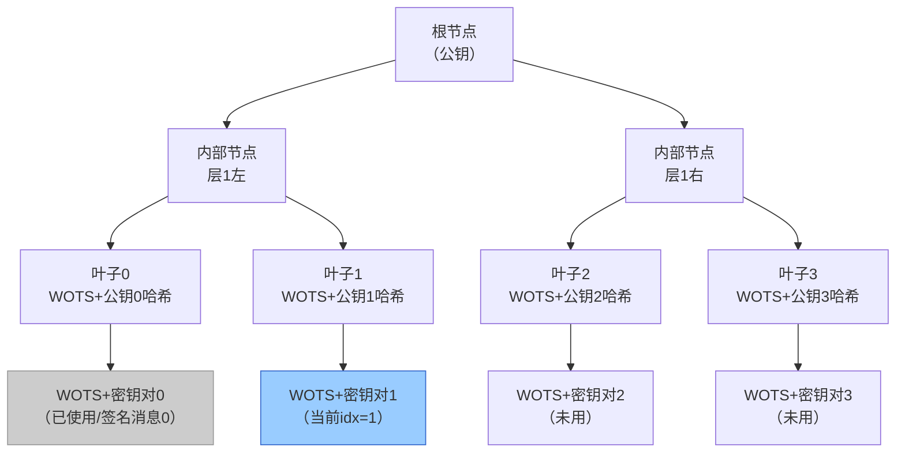

# 密码学（69）· XMSS 与 LMS 有状态哈希签名

> [!abstract] TL;DR
> - **有状态哈希签名**（XMSS、LMS）仅依赖哈希函数的抗碰撞性，无格或椭圆曲线假设，量子安全。
> - 核心思路：用 **Merkle 树**将大量一次性签名（OTS）密钥聚合成单一根公钥；每签一条消息消耗一片叶子，叶子**不可复用**。
> - **状态管理**是最大工程挑战：重用同一叶子等价于灾难性私钥泄露；签名系统必须持久化计数器且防回滚、防克隆。
> - **XMSS**（RFC 8391）：带位掩码的多层树结构（XMSS^MT），侧重安全边界精确化；**LMS**（RFC 8554，NIST SP 800-208）：结构简单，已成为固件签名主流推荐。
> - 工程定位：**离线/低频签名场景**（固件发布、引导链签名、证书颁发）而非高并发在线签名——后者更适合无状态的 [[52.Dilithium-ML-DSA]] 或 SLH-DSA。

---

## 概述与定位

### 后量子签名的两大路线

[[49.后量子密码概览]] 中将后量子签名分为三大类：格基（ML-DSA/FALCON）、哈希基（XMSS/LMS/SLH-DSA）、编码基。哈希基签名的核心主张是：**安全性归约到哈希函数的单向性与碰撞抗性，无需额外数学假设**。只要所选哈希函数（SHA2/SHA3/SHAKE）安全，签名方案就安全——这使其在量子计算威胁下具有极强的"最坏情况保障"。

然而哈希基签名内部又分两个路线：

| 路线 | 代表 | 状态 | 签名大小 | 适用场景 |
|---|---|---|---|---|
| 有状态哈希签名 | XMSS、LMS | 需要（叶子计数器） | 小（~1–4 KB） | 固件签名、CA 离线根 |
| 无状态哈希签名 | SLH-DSA（SPHINCS+） | 无需 | 大（~8–50 KB） | 通用签名替代 |

有状态方案通过记住"已用到哪片叶子"来换取更小的签名与更快的计算；无状态方案 SLH-DSA 用随机化路径选择规避状态问题，但签名体积大得多。本篇聚焦有状态路线。

### XMSS 与 LMS 的标准化历程

- **XMSS（eXtended Merkle Signature Scheme）**：2018 年由 IETF 以 RFC 8391 发布；XMSS^MT 是多树扩展版本，支持更大的签名总量。
- **LMS（Leighton-Micali Signatures）**：2019 年以 RFC 8554 发布；同年 NIST SP 800-208 将 LMS 和 HSS（分层签名系统，即 LMS 的多树版）列为推荐标准，成为目前固件/引导签名的主流标准。

---

## 原理与机制

### 一次性签名（OTS）：所有哈希签名的地基

哈希签名的最底层是**一次性签名（One-Time Signature，OTS）**：每个密钥对只能安全地签一条消息，若用同一密钥对签两条不同消息，攻击者可借助两个签名推导私钥。

**Lamport OTS**（最简版本）的构造：

设消息哈希 `m = H(msg)` 为 n 位（如 256 位）。

- 私钥：随机选取 $2n$ 个 n 位随机值 $x[0][0], x[0][1], \ldots, x[1][n-1]$（共 $2n$ 个随机串）
- 公钥：对每个私钥值取哈希 $y[b][i] = H(x[b][i])$
- 签名：对消息哈希 $m$ 的第 $i$ 位 $m_i$，公开 $x[m_i][i]$
- 验证：重新哈希后对比公钥

Lamport OTS 的问题在于**密钥和签名体积极大**（256 位消息需要 512 个随机值做私钥，公钥同样庞大），且一次性限制严格。

### WOTS 与 WOTS+：实用化 OTS

**WOTS（Winternitz OTS）** 通过哈希链（Hash Chain）将签名压缩：不是每位用一对密钥，而是将消息哈希分成若干 w 位的块，对每块用哈希链的某一中间节点作为签名值。参数 w（Winternitz 参数）控制链长与安全性/效率的权衡：

- w 大 → 签名更紧凑，但哈希计算更多
- w 小 → 每块更短，签名更大，但计算量小

**WOTS+ ** 在 WOTS 的基础上引入**位掩码（bitmask）**：每一步哈希链计算前先将中间值与一个公开随机掩码做 XOR，再取哈希。这一改动使安全性可在**多目标攻击**场景下更精确地归约——攻击者同时攻击大量公钥时无法借助生日悖论获益。

XMSS 使用 WOTS+；LMS 使用 LMOTS（Leighton-Micali OTS），其安全性框架略有不同但目标相似。

### Merkle 树：将 OTS 聚合为长期公钥

OTS 每对只用一次的限制使其无法直接用于通用签名。**Merkle 树**将 $2^h$ 片叶子（每片是一个 WOTS+/LMOTS 公钥的哈希）聚合成单一根节点，作为整个签名方案的公钥：

```
                    Root (公钥)
                   /           \
            Node[1,0]        Node[1,1]
           /       \         /       \
       Leaf[0]  Leaf[1]  Leaf[2]  Leaf[3]
       WOTS+_0  WOTS+_1  WOTS+_2  WOTS+_3
```

签名第 $i$ 条消息时：

1. 选取叶子 $i$ 对应的 WOTS+ 密钥对，用其对消息签名，产出 WOTS+ 签名。
2. 附上从叶子 $i$ 到根节点的**认证路径**（Authentication Path）：即 Merkle 树中兄弟节点的哈希值列表，共 $h$ 个。
3. 验证者用 WOTS+ 公钥 + 认证路径重建根节点，与公钥对比。

Merkle 树高度 $h$ 决定最多可签 $2^h$ 条消息。常见参数：$h=10$ 约 1024 次签名，$h=20$ 约百万次。

---

## 结构与算法详解

### 状态管理：有状态签名的核心难题

状态计数器 `idx`（下一片未用叶子的索引）是有状态签名的"阿喀琉斯之踵"。

**叶子复用的后果**：若用同一叶子（同一 WOTS+/LMOTS 私钥）签两条不同消息 $m_1$ 和 $m_2$，攻击者可以比较两个 WOTS+ 签名，利用哈希链的单调性逆推私钥的某些分量，从而伪造签名。这不是理论上的漏洞，而是设计规范明确指出的**灾难性安全失败**。

因此，状态持久化需要满足以下要求：

> [!note] 状态管理四要素
> 1. **持久化**：每次签名后立即将 `idx` 写入非易失存储，在签名动作完成前不得丢失。
> 2. **原子性**：更新 `idx` 与产出签名必须视为原子操作——如果存储 `idx` 失败，宁可不完成签名，不得回退 `idx`。
> 3. **防克隆**：若私钥从一台设备迁移到另一台，两份副本必须协调共享同一个 `idx` 序列，绝不能各自独立计数（双副本将大概率复用叶子）。
> 4. **防回滚**：日志、备份恢复场景中若将存储回滚到旧快照，`idx` 也随之回滚——此后签名将再次使用已用叶子。

这四条要求导致有状态哈希签名在云虚机、容器化环境、无状态微服务中几乎无法安全使用。**最合适的部署场景**是：

- **硬件安全模块（HSM）** 内置不可递减计数器
- **固件签名 / 代码签名服务器**：只有一台设备持有私钥，签名次数有自然上限
- **离线根 CA**：签发下级证书，签名频率极低

### XMSS（RFC 8391）的详细结构

XMSS 的构建模块：

1. **WOTS+ 实例**：每个叶子对应一个 WOTS+ 密钥对，签名为一组哈希链节点。
2. **L-tree 压缩**：将一个 WOTS+ 公钥（多个 n 字节串）压缩成单个 n 字节叶子值，采用类 Merkle 树结构。
3. **Merkle 树**：高度 $h$，根为公钥。
4. **位掩码机制**：每层节点哈希计算时使用与层/位置相关的公开随机位掩码 XOR，防多目标攻击。

XMSS 公钥结构：`(OID, root, SEED)`，其中 SEED 是生成所有位掩码与 PRF 的随机种子。

**XMSS^MT（多树扩展）**：将 $d$ 棵高度为 $h'$ 的 XMSS 树堆叠，顶层树用私钥签名下层树的根公钥。总可签消息数为 $2^{h' \cdot d}$。优势在于：单次签名只需遍历一棵小树（高度 $h'$ 而非 $h' \cdot d$），大幅降低签名时间——尤其适合 HSM 内部的低功耗场景。

### LMS / HSS（RFC 8554 / NIST SP 800-208）

LMS 的结构与 XMSS 相似，但细节上更简洁：

- OTS 层使用 **LMOTS**（w 取 1/2/4/8，由参数集决定）
- Merkle 树叶子为 `Hash(public_key_seed || leaf_id || LMOTS_pk)`
- 不使用位掩码；安全性归约稍有不同（在随机预言模型下证明）

**HSS（Hierarchical Signature System）**：LMS 的多树版，类似 XMSS^MT。由 $L$ 层 LMS 树组成，每层用上层私钥签下层公钥。

**参数集命名**：LMS 参数集如 `LMS_SHA256_M32_H10`（SHA-256、32 字节节点、高度 10），LMOTS 参数集如 `LMOTS_SHA256_N32_W4`（W=4 即 Winternitz 参数）。NIST SP 800-208 推荐的参数集组合列有具体安全级别对应关系。

### XMSS 与 LMS 的关键差异

| 维度 | XMSS（RFC 8391） | LMS（RFC 8554） |
|---|---|---|
| OTS 方案 | WOTS+（含位掩码） | LMOTS |
| 位掩码机制 | 有（抗多目标攻击更精确） | 无 |
| 安全归约模型 | 标准模型 | 随机预言模型 |
| 多树扩展 | XMSS^MT | HSS |
| NIST 批准 | 否（RFC 仅 IETF） | 是（SP 800-208，2020） |
| 固件生态支持 | 较少 | 广泛（UEFI、Linux IMA 等） |
| 签名大小（h=10） | ~2.5 KB | ~1.6 KB（W=8） |



---

## 工具视角与实战

### 签名操作流程

以 LMS/HSS 为例，一次完整签名：

```
输入：消息 M、私钥（含树结构缓存和当前 idx）
1. 取当前叶子索引 idx
2. 加载 idx 对应的 LMOTS 私钥（通常从种子派生，无需全部存储）
3. 用 LMOTS 对 H(随机数 || 公钥 || Q || M) 签名，产出 LMOTS 签名
4. 计算认证路径：从叶子 idx 到根，收集兄弟节点哈希（可缓存或逐步计算）
5. 组合输出：(idx, LMOTS签名, 认证路径)
6. 将 idx+1 持久化写入存储（原子操作）

输出：签名 σ = (idx, LMOTS_sig, auth_path)
       公钥 PK = (根哈希, 公钥种子)
```

验证流程：

```
1. 从 σ 中读取 idx 和 LMOTS_sig
2. 重建 LMOTS 公钥（验证 LMOTS 签名）
3. 从 LMOTS 公钥出发，沿认证路径重建根节点哈希
4. 比较根节点哈希与公钥 PK 中的根哈希
```

### 库与工具支持

| 工具/库 | 说明 |
|---|---|
| **liboqs（Open Quantum Safe）** | 包含 XMSS；C 语言，Python/Go/Rust 绑定 |
| **hash-sigs（CISCO）** | LMS/HSS 的 C 参考实现，代码量小，适合嵌入式移植 |
| **OpenSSL 1.1.1+** | 实验性 XMSS 支持（`-sigopt xmss_skip_sig: 1`） |
| **Java JDK 17+** | `XMSSParameterSpec`，通过 Bouncy Castle 支持 |
| **Bouncy Castle** | Java/C# 均支持 XMSS、XMSS^MT、LMS、HSS |

### 固件签名最佳实践

**硬件计数器方案**：在 TPM 2.0 或安全元件中维护单调递增计数器。每次签名前读取并递增计数器，用计数器值决定使用哪片叶子。由于 TPM 计数器具有物理不可回滚性，可从根本上防止叶子复用。

**密钥容量规划**：估算固件发布频率。若每年发布 50 次补丁，高度 $h=10$（1024 片叶子）够用约 20 年；$h=20$ 够百万次，但会增加认证路径计算量。

**密钥轮转策略**：当剩余叶子数低于阈值时，提前生成新密钥对并更新信任锚（如 UEFI 安全引导数据库）。不要等到叶子耗尽才轮转。

> [!note] 关于 HSM 迁移
> 若需将 LMS 私钥从一台 HSM 迁移到另一台（如设备更换），必须同时迁移 `idx` 状态，并在新 HSM 导入完成前销毁旧 HSM 的私钥。两台 HSM 同时持有同一 `idx`=N 的私钥，后续签名必然从 N 开始各自计数，造成叶子复用。

---

## 安全性与正确使用

### 安全归约分析

XMSS/LMS 的安全性可归约到底层哈希函数的以下性质：

- **单向性（OWF）**：WOTS+/LMOTS 的安全性要求 $H$ 是单向的——否则攻击者可从叶子哈希反推 WOTS+ 公钥，继而伪造签名。
- **二阶抗碰撞性（2nd-preimage resistance）**：Merkle 树节点计算要求 $H$ 抗第二原像，确保无法找到同一叶子的不同公钥碰撞。
- **多目标抗碰撞（XMSS 的额外需求）**：位掩码机制使安全性精确归约到多目标场景，攻击者即使同时攻击所有叶子，也无法借助生日悖论获益。

量子安全层面：Grover 算法对哈希函数的加速是平方根级别（$O(\sqrt{N})$），因此 SHA-256 在量子计算环境下等效约 128 位安全强度。LMS/XMSS 的参数集选择（n=32 即 SHA-256 输出）在后量子场景下保持约 128 位安全。

### 与 SLH-DSA（SPHINCS+）的工程权衡

[[52.Dilithium-ML-DSA]] 所在的 FIPS 204 系列（格基）与 FIPS 205（SLH-DSA，哈希基无状态）是有状态哈希签名的两个替代方向：

| 维度 | XMSS/LMS（有状态） | SLH-DSA（无状态） | ML-DSA（格基） |
|---|---|---|---|
| 安全假设 | 哈希函数 | 哈希函数 | 格（Module-LWE/SIS） |
| 状态需求 | 需要 | 无需 | 无需 |
| 签名大小 | 小（1–4 KB） | 大（8–50 KB） | 中（2.4–4.6 KB） |
| 签名速度 | 中 | 慢（哈希多） | 快 |
| 适用场景 | 固件/引导/CA | 通用后量子签名 | 通用后量子签名 |

> [!note] 实践建议
> - **固件/引导签名**：优先 LMS/HSS（NIST SP 800-208 推荐，生态成熟）。
> - **通用签名替代（在线服务、证书签发）**：优先 ML-DSA（FIPS 204）或 SLH-DSA（FIPS 205），避免状态管理复杂性。
> - **极高安全保障需求（无格假设）**：SLH-DSA，代价是签名体积增大。

---

## 小结

有状态哈希签名（XMSS/LMS）代表了后量子密码学中"最保守"的选择：安全性仅依赖哈希函数，假设最少，经过数十年分析，没有已知量子或经典攻击。其代价是**状态管理的工程复杂度**——叶子复用是不可逆的灾难性错误，因此部署场景受到严格限制。

核心要点回顾：

- OTS（WOTS+/LMOTS）是签名原子：每片叶子仅用一次
- Merkle 树将大量 OTS 公钥聚合成单一根公钥，认证路径支撑验证
- XMSS 侧重标准模型精确归约，XMSS^MT 支持多树扩展；LMS/HSS 结构简单，NIST 已批准
- 状态管理四要素：持久化、原子性、防克隆、防回滚
- 最佳部署：HSM 固件签名、离线 CA、代码签名服务器；不适合高频/云原生场景

与无状态方案相比，有状态哈希签名在特定场景（固件、引导）是更小、更快的后量子选择，但需要严格的工程纪律。

---

## 相关阅读

- [[49.后量子密码概览]] —— 量子威胁全景与 NIST 标准化进程
- [[52.Dilithium-ML-DSA]] —— 格基签名，FIPS 204，无状态通用签名替代
- [[50.格密码基础]] —— 对比格基方案的数学基础
- [[62.协议误用与密码工程]] —— 密钥管理与 HSM 实践
- [[43.随机数与熵]] —— 哈希签名密钥生成的随机数需求
- [[70.编码基密码]] —— 另一类后量子方案，基于纠错码

---

⬅️ 上一篇 [[68.Falcon签名]] ｜ 🏠 [[00.密码学总览]] ｜ 下一篇 [[70.编码基密码]] ➡️
