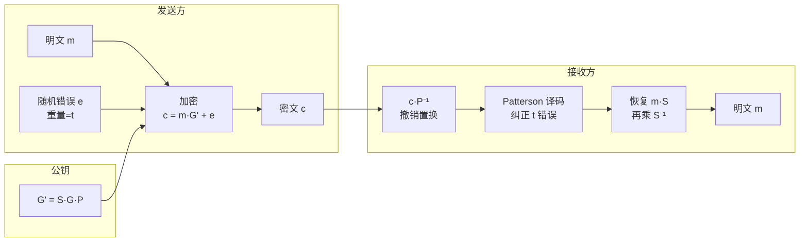

# 密码学（70）· 编码基密码（McEliece / HQC）

> [!abstract] TL;DR
> - **编码基密码**以**纠错码译码的 NP 难性**为安全基础，与格密码、哈希密码并列为后量子三大主流路线之一。
> - **McEliece（1978）** 是迄今分析最久、最保守的后量子加密方案：用 Goppa 码伪装成随机码，公钥为打乱的生成矩阵，安全性极高但公钥体积巨大（~256 KB 以上）。
> - **HQC（Hamming Quasi-Cyclic）** 引入准循环码结构大幅缩减密钥体积，已于 2025 年入选 NIST 第四轮后量子 KEM 标准。
> - 与格基 KEM（[[51.Kyber-ML-KEM]]）相比：编码基安全假设更独立（无格），历史更长；代价是密钥更大，实现效率较低。
> - 适用场景：高安全保障要求、愿意接受大密钥体积的场合，或与格基方案形成**假设多元化**部署。

---

## 概述与定位

### 后量子密码的"最老牌"方案

[[49.后量子密码概览]] 中指出，后量子密码学的任务是找到量子计算机也无法高效破解的困难问题。格密码（[[50.格密码基础]]）基于格上的最短向量问题（LWE/NTRU），而编码基密码则走了另一条路：**纠错码的译码问题**。

Robert McEliece 在 1978 年提出了以其名字命名的加密方案，比 RSA 还早一年。由于最初的方案参数较大、不够实用，在公钥密码黄金时代被 RSA/ECC 掩盖。然而时至今日，**McEliece 在后量子时代重新焕发生机**，原因恰恰是它的"缺点"：公钥巨大——这正源于其安全假设极为坚固，没有已知的量子或经典攻击能显著破解合理参数的 McEliece。

从分析历史看，**McEliece（Goppa 码版本）已经历超过 45 年的密码学分析，未发现实质性攻击**。这使其成为后量子候选中历史最悠久的方案，也是最保守的选择之一。

### 编码基密码在 NIST 后量子标准化中的位置

| 方案 | NIST 进展 | 类型 | 状态 |
|---|---|---|---|
| ML-KEM（Kyber） | FIPS 203（2024） | 格基 KEM | 已标准化 |
| ML-DSA（Dilithium） | FIPS 204（2024） | 格基签名 | 已标准化 |
| SLH-DSA（SPHINCS+） | FIPS 205（2024） | 哈希基签名 | 已标准化 |
| BIKE | 第四轮候选 | 编码基 KEM | 审查中 |
| HQC | 第四轮→标准化 | 编码基 KEM | 约 2025 标准化 |
| Classic McEliece | 候选（备份） | 编码基 KEM | 体积问题未进第三轮主赛道 |

NIST 将 HQC 作为格基 ML-KEM 的"备份/多元化"方案推进标准化，理由是：若将来发现格密码的未知弱点，依赖不同假设的 HQC 可以作为第二道防线。

---

## 原理与机制

### 线性码基础与译码困难问题

**线性码**是向量空间 $\mathbb{F}_2^n$（或更大域）上满足线性性质的子集。一个 $[n, k, d]$ 线性码包含 $2^k$ 个码字，最小汉明距离为 $d$，可纠正最多 $t = \lfloor (d-1)/2 \rfloor$ 个错误。

**生成矩阵** $G \in \mathbb{F}_2^{k \times n}$：将 $k$ 位消息 $m$ 编码为 $c = mG \in \mathbb{F}_2^n$。

**译码问题（Syndrome Decoding Problem）**：给定一个 $[n, k]$ 线性码（由校验矩阵 $H$ 描述）和一个接收向量 $r$，找到重量最小的错误向量 $e$ 使得 $Hr^T = He^T$（即 $r = c + e$ 中的 $c$ 是合法码字）。

> **一般线性码的译码是 NP 完全问题**（McEliece 1978、Berlekamp-McEliece-van Tilborg 1978）。

这是编码基密码的安全基石。注意关键词"**一般**"：对于**特定结构**的码（如 Hamming 码、Reed-Solomon 码、Goppa 码），存在高效译码算法。编码基加密的核心技巧正是用**特殊码伪装成一般码**。

### Goppa 码：McEliece 的内核

**Goppa 码**（Irwin Goppa，1970）是一类基于代数几何的线性码，具有以下特性：

- 设有限域 $\mathbb{F}_{2^m}$ 和一个度为 $t$ 的不可约多项式 $g(z) \in \mathbb{F}_{2^m}[z]$（称为 Goppa 多项式）
- 支撑点集 $L \subset \mathbb{F}_{2^m}$，$|L| = n$
- Goppa 码 $\Gamma(L, g)$ 是 $[n, n - mt, \geq 2t + 1]$ 的二元线性码
- 最重要性质：**存在多项式时间（$O(n^3)$）的 Patterson 算法**可以纠正最多 $t$ 个错误

Goppa 码之所以适合 McEliece，正是因为：
1. 合法持有者知道 $g(z)$ 和 $L$，可以高效译码
2. 公钥经过随机变换后，外人只看到一个"看起来随机"的 $[n, k]$ 线性码，无法区分它是否有结构

---

## 结构/算法/伪代码详解

### McEliece 加密方案

**密钥生成（KeyGen）**：

```
1. 选择参数 (n, k, t)，选择 Goppa 多项式 g(z) 和支撑点集 L
2. 构造 Goppa 码 Γ(L,g) 的生成矩阵 G ∈ F_2^{k×n}
3. 选取随机可逆矩阵 S ∈ F_2^{k×k}（"混淆"矩阵）
4. 选取随机置换矩阵 P ∈ F_2^{n×n}（对列重排）
5. 计算公钥 G' = S·G·P  ∈ F_2^{k×n}
6. 私钥 = (S, G, P)（含 Goppa 码结构和 Patterson 译码器）
   公钥 = G'（看似随机的 k×n 矩阵）
```

**加密（Encrypt）**：

```
输入：明文 m ∈ F_2^k，公钥 G'
1. 选取随机错误向量 e ∈ F_2^n，重量 wt(e) = t
2. 密文 c = m·G' + e
输出：c ∈ F_2^n
```

**解密（Decrypt）**：

```
输入：密文 c ∈ F_2^n，私钥 (S, G, P)
1. 计算 c' = c·P^{-1} = m·S·G + e·P^{-1}
   （置换的逆，e·P^{-1} 仍是 t 重量的错误向量）
2. 用 Patterson 算法对 c' 译码，纠正 t 个错误
   得到 m·S·G（码字），同时得到错误位置
3. 计算 m' = (m·S·G)·G^{-右}（从码字恢复消息，利用 G 的右伪逆）
4. 恢复 m = m'·S^{-1}
输出：m
```

安全性依赖：攻击者只有 $G' = S \cdot G \cdot P$，不知道 $S$/$P$，无法从 $G'$ 恢复出 Goppa 码结构，因此无法高效译码——只能面对"一般线性码译码"这个 NP 难问题。



### 公钥体积：McEliece 的主要工程障碍

经典 McEliece 推荐参数（NIST 候选，Classic McEliece 方案）：

| 安全级别 | n | k | t | 公钥大小 |
|---|---|---|---|---|
| 128 位量子安全 | 3488 | 2720 | 64 | ~256 KB |
| 192 位量子安全 | 4608 | 3360 | 96 | ~492 KB |
| 256 位量子安全 | 6688 | 5024 | 128 | ~1.0 MB |

公钥即生成矩阵 $G' \in \mathbb{F}_2^{k \times n}$（可以化简为系统式 $[I_k | A]$ 只存 $A$ 部分），大小约为 $k(n-k)/8$ 字节。这是 McEliece 最大的实用障碍：256 KB 的公钥在内存受限的嵌入式设备或 TLS 握手中都极为不便。

### HQC：用准循环码缩减密钥

**HQC（Hamming Quasi-Cyclic）** 由 Aguilar-Melchor 等人在 2017 年提出，其核心创新是引入**准循环码（Quasi-Cyclic Code）**结构。

**准循环码的关键性质**：若矩阵 $H$ 是一个分块循环矩阵（每块是一个 $n \times n$ 循环矩阵），只需存储每块循环矩阵的第一行（$n$ 个元素）即可完整描述整个矩阵。这将密钥/参数存储从 $O(n^2)$ 降至 $O(n)$。

**HQC 构造概述**：

HQC 工作在多项式环 $\mathbb{F}_2[x]/(x^n - 1)$（$n$ 为奇素数），元素对应长度为 $n$ 的二元多项式。

密钥生成：
```
1. 选取稀疏向量 h（公开，用于定义准循环结构）
2. 选取稀疏私钥向量 (x, y)，重量小
3. 公钥：s = x + h·y（在环上多项式乘法+加法）
```

加密（向量 u, v 是密文的两部分）：
```
1. 选随机向量 r1, r2，随机错误 e1, e2
2. u = r1 + h·r2
3. 将明文 m 编码为码字 c_m（用内嵌的纠错码如 Reed-Solomon 或 Reed-Muller）
4. v = c_m + s·r2 + e2
密文 = (u, v)
```

解密：
```
1. 计算 v - y·u = c_m + x·r2 + e1·y + e2（误差项控制在可纠正范围）
2. 用内嵌纠错码的译码算法恢复 m
```

安全性依赖**准循环码的译码困难性**——即便知道码是准循环的，只要参数足够大，译码仍计算困难。

**HQC 参数与密钥大小**（相比 Classic McEliece 的改善）：

| 方案 | 安全级别 | 公钥 | 密文 | 内嵌码 |
|---|---|---|---|---|
| HQC-128 | 128 位量子安全 | 3.9 KB | 4.5 KB | Reed-Solomon |
| HQC-192 | 192 位量子安全 | 7.2 KB | 8.0 KB | Reed-Solomon |
| HQC-256 | 256 位量子安全 | 14.5 KB | 16.2 KB | Reed-Solomon + RM |
| Classic McEliece 3488 | 128 位量子安全 | 256 KB | 128 B | — |

HQC 的公钥从 McEliece 的 256 KB 降至约 4 KB，密文也在可接受范围，接近 ML-KEM（[[51.Kyber-ML-KEM]]）的量级，使其具备实际部署可行性。

---

## 工具视角与实战

### 库支持

| 库 | 方案 | 语言 | 说明 |
|---|---|---|---|
| **liboqs** | HQC、Classic McEliece、BIKE | C/Python/Go/Rust | Open Quantum Safe，主要参考实现 |
| **PQClean** | HQC、Classic McEliece | C | NIST 候选的干净 C 实现 |
| **BouncyCastle** | Classic McEliece | Java/C# | 成熟密码库，含 McEliece |
| **SUPERCOP** | Classic McEliece | C/汇编 | 性能基准测试工具 |

使用 liboqs 的 HQC 示例（伪码）：

```python
import oqs

# 密钥生成
with oqs.KeyEncapsulation("HQC-128") as kem:
    public_key = kem.generate_keypair()
    # 封装（发送方）
    ciphertext, shared_secret_enc = kem.encap_secret(public_key)
    # 解封装（接收方）
    shared_secret_dec = kem.decap_secret(ciphertext)
    assert shared_secret_enc == shared_secret_dec
```

### 与格基 KEM 的混合部署

考虑到 ML-KEM 和 HQC 基于不同困难问题，可以通过 **KEM 组合（KEM Combiner）** 同时运行两者，将两个共享密钥通过 HKDF 组合成最终会话密钥。只要两个方案中任意一个安全，最终密钥就安全。

```
K_final = HKDF(K_MLKEM || K_HQC, label)
```

这种"假设多元化"部署在高安全级别场景（政府、金融、关键基础设施）中越来越被推荐，是 NIST 推进 HQC 标准化的重要动机之一。

---

## 安全性与正确使用

### 安全假设对比

| 方案 | 核心困难问题 | NP 难证明 | 量子攻击加速 |
|---|---|---|---|
| Classic McEliece | 一般线性码译码（SDP） | 是（Berlekamp-McEliece-van Tilborg 1978） | 无已知多项式加速 |
| HQC | 准循环码译码 | 无（准循环码是特殊结构码，NP 难尚无明确归约） | 无已知多项式加速 |
| ML-KEM（Kyber） | Module-LWE | 格上最坏情况归约 | 无已知多项式加速 |

> [!note] 安全假设强度差异
> Classic McEliece 的 SDP 归约最直接（NP 完全），理论基础最坚实；HQC 的准循环码译码尚无 NP 难证明，依赖分析者未找到有效攻击这一"实践信心"；ML-KEM 有最坏情况到平均情况的格理论归约，但格假设与 SDP 完全独立。三者安全假设互不依赖，混合部署可获最强保障。

### McEliece 的已知攻击与参数选择

对 McEliece 的攻击主要分两类：

**信息集译码（ISD，Information Set Decoding）攻击**：这是目前最强的攻击类型，包括经典的 Prange、Stern、May-Meurer-Thomae 算法以及量子化版本（如 Bernstein-Lange 等）。ISD 攻击的本质是暴力搜索满足条件的错误向量，时间复杂度指数级但可被量子算法加速（Grover 算法提供平方根加速）。选参数时需将量子 ISD 攻击纳入考量。

**结构恢复攻击**：试图从公钥 $G'$ 恢复 Goppa 码结构。对于二元 Goppa 码，目前最好的结构恢复算法（如 Couvreur-Gaborit-Gauthier-Otmani-Tillich）对合理参数无效。注意：McEliece 方案对具有明显代数结构的码（如 Reed-Solomon 码）并不安全——Sidelnikov-Shestakov 攻击（1992）已经成功破解 RS 码版本的 McEliece，这正是方案坚持使用 Goppa 码的原因。

> [!note] 避免替换 Goppa 码
> 不要将 McEliece 中的 Goppa 码替换为其他"看起来更好"的纠错码。RS 码、BCH 码、LDPC 码等已被证明结构可被恢复或存在攻击。只有二元 Goppa 码经受住了完整的密码学分析。

### HQC 的安全注意事项

- **随机数质量**：加密时的随机向量 $r_1, r_2, e_1, e_2$ 必须来自高质量 CSPRNG；稀疏向量的随机性不足可能降低安全性。
- **侧信道**：HQC 的译码步骤（Reed-Solomon/Reed-Muller 译码）可能存在数据依赖性分支，需确保常数时间实现。
- **密文可锻造性**：标准 HQC 满足 CCA2 安全（通过 Fujisaki-Okamoto 变换），不得绕过 FO 变换直接使用 CPA 版本。

---

## 小结

编码基密码以线性码译码的 NP 难性为安全基础，是后量子密码学中独立于格假设的重要分支。

核心要点回顾：

- **困难问题**：一般线性码译码（SDP）是 NP 完全的；特定结构码（Goppa）存在高效译码算法，这一差异构成了 McEliece 的巧思
- **McEliece 加解密**：加噪（添加 $t$ 个错误）→ 合法方用 Patterson 算法译码去噪；公钥为打乱的生成矩阵，体积巨大（~256 KB）
- **HQC 创新**：准循环码结构将公钥压缩至 ~4 KB，兼顾安全性与实用性，已进入 NIST 标准化
- **与格基方案对比**：安全假设完全独立（译码难 vs 格问题），可通过 KEM 组合实现假设多元化
- **McEliece 的保守价值**：45 年分析无实质攻击，是量子威胁下最"经过考验"的后量子方案

---

## 相关阅读

- [[51.Kyber-ML-KEM]] —— 格基 KEM 对比参照，FIPS 203 标准
- [[50.格密码基础]] —— 格困难问题，与编码基假设对比
- [[49.后量子密码概览]] —— 后量子密码全景与 NIST 标准化进程
- [[69.XMSS与LMS]] —— 另一类后量子方案，基于哈希函数的有状态签名
- [[71.密码协议形式化验证]] —— 密码方案的安全性形式化分析方法

---

⬅️ 上一篇 [[69.XMSS与LMS]] ｜ 🏠 [[00.密码学总览]] ｜ 下一篇 [[71.密码协议形式化验证]] ➡️
