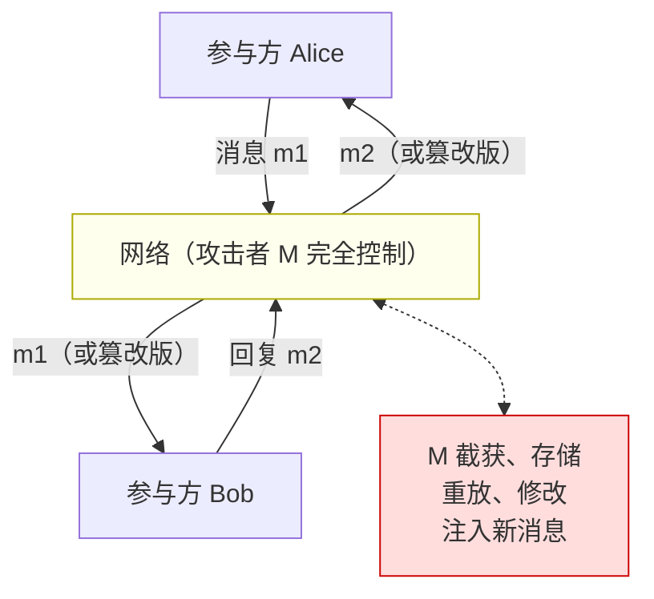

# 密码学（71）· 密码协议形式化验证（ProVerif / Tamarin）

> [!abstract] TL;DR
> - **形式化验证**用数学方法严格证明密码协议满足安全性质（保密性、认证性、前向安全），弥补人工审查和测试的盲区。
> - **Dolev-Yao 模型**：攻击者完全控制网络（可截获/重放/伪造所有消息），密码原语被抽象为理想黑盒——在此模型下可自动化证明。
> - **ProVerif**：基于 Horn 子句和应用 pi 演算，全自动化，可判定无界会话的保密性与认证性，偶有误报（保守）。
> - **Tamarin**：基于多重集重写和归纳法，支持 Diffie-Hellman 等价理论，可处理复杂协议但需人工辅助引理证明。
> - **TLS 1.3 案例**：ProVerif/Tamarin/miTLS-F* 多工具分析均验证了 TLS 1.3 设计的核心安全性质，与 TLS 1.2 前的多个已知漏洞形成对比。
> - 已知局限：符号模型抽象了实现细节，建模错误可掩盖真实漏洞；不能替代密码学归约证明。

---

## 概述与定位

### 为什么协议设计需要形式化验证

密码协议的安全不是"各组件安全就整体安全"的简单叠加。历史上最著名的反例是 **Needham-Schroeder 公钥协议（1978）**：该协议使用 RSA 加密，各组件无问题，但协议本身存在中间人攻击——两个合法参与方的会话可以被第三方劫持，注入另一个主体的标识符。这个漏洞在协议发表后 **17 年**才被 Lowe（1995）用 FDR（一种模型检验工具）发现，随后给出了一行修复。

这个案例说明了协议安全验证的独特挑战：

- 协议消息的交互产生**组合爆炸**：多个参与方、多条并发会话、各种消息顺序，人工穷举不可行
- 攻击者的能力模型需要明确假设：他能看到什么？能篡改什么？能并行运行多少会话？
- 安全性质需要精确定义：什么叫"保密"？什么叫"认证"？

**形式化方法**（Formal Methods）用逻辑和自动化工具回答这些问题，将协议建模为进程或规则，将安全性质建模为谓词，然后用证明引擎验证是否成立。

### 两大验证范式的宏观对比

密码协议形式化验证主要分两个层次：

| 范式 | 代表工具 | 攻击者模型 | 安全归约 | 自动化 |
|---|---|---|---|---|
| **符号模型（Dolev-Yao）** | ProVerif、Tamarin、Scyther | 理想密码原语 | 无（符号层） | 高（可全自动） |
| **计算模型** | CryptoVerif、EasyCrypt | 概率多项式时间 | 有（归约到密码假设） | 低（大量人工） |

符号模型和计算模型各有侧重。符号模型自动化程度高，可以在协议设计阶段快速发现逻辑漏洞；计算模型直接与密码学假设挂钩，证明更严格，但需要更多人工。本篇重点介绍符号模型工具，并简介两者的关系。

---

## 原理与机制

### Dolev-Yao 攻击者模型

**Dolev-Yao 模型**（1983）是符号形式化验证的基础假设。模型将密码协议的执行环境抽象为：

**攻击者能力（Dolev-Yao 模型下）**：
- 可以**截获**网络上所有消息
- 可以**保存**任意消息用于后续操作
- 可以**发送**任意构造的消息，伪装成任意主体
- 可以**解密**：若手中持有解密密钥，则可解密任意密文
- 可以**加密/MAC/签名**：若持有对应密钥，则可构造任意密文/MAC/签名
- **不能**在不持有密钥的情况下破解密码原语（密码原语被假设为完美黑盒）

**消息项（Term）**的代数结构：消息是由基本值（nonce、密钥、主体标识符）和操作（加密、哈希、配对等）构成的项树，操作满足代数等式（如 `decrypt(encrypt(m, k), k) = m`）。

Dolev-Yao 模型的核心贡献在于：它将"攻击者"的能力形式化为一个**可计算的闭包**——给定一组已知消息，攻击者可以推导出的所有消息集合（Dolev-Yao 推导闭包）是可判定的。这使得自动化分析成为可能。



### 保密性与认证性的符号定义

**保密性（Secrecy）**：一个项 $s$ 对攻击者保密，当且仅当在所有可能的协议执行（包括任意多个并发会话、攻击者任意注入）下，攻击者无法推导出 $s$（即 $s \notin Deductions(\text{攻击者已知集})$）。

**认证性（Authentication）**：有多种强弱不同的定义：

- **弱认证（Weak Authentication / Aliveness）**：若 Alice 完成了与 Bob 的会话，则 Bob 在协议的某一点确实参与了执行
- **非单射认证（Non-injective Agreement）**：Alice 和 Bob 就一组数据值达成了一致
- **单射认证（Injective Agreement）**：更强版本，一个 Alice 的会话对应一个不同的 Bob 会话（防重放）

**前向安全（Forward Secrecy）**：即使长期密钥事后泄露，过去的会话密钥也无法被恢复——这要求每次会话生成新的临时密钥材料（如 Diffie-Hellman 临时参数）。

---

## 结构/算法/伪代码详解

### ProVerif：自动化 Horn 子句证明

**ProVerif**（Bruno Blanchet，2001~今）是目前应用最广泛的符号协议验证工具。

**工作原理**：

1. **输入语言**：协议用**应用 pi 演算（Applied Pi-Calculus）** 描述，消息项用多排序代数（Many-Sorted Algebra）表示，加密/哈希/签名各有对应构造算子。
2. **转换为 Horn 子句**：ProVerif 将 pi 演算进程自动翻译成一阶 Horn 子句集合，其中 `attacker(x)` 表示"攻击者已知 x"。
3. **Horn 子句求解**：用基于分辨率的 Datalog 风格推导，判断"是否存在推导序列使 `attacker(secret)` 成立"（即是否破坏保密性）。
4. **无界会话分析**：ProVerif 对无限多个并发会话有效——通过抽象（将会话视为等价类），在有限时间内给出结果。

ProVerif 的判定结果：

- **RESULT not attacker(s[]) is true**：证明在 Dolev-Yao 模型下 $s$ 安全（保密）
- **RESULT not attacker(s[]) is false**：找到攻击，ProVerif 可输出攻击踪迹（Trace）

> [!note] ProVerif 的保守性（假阴性风险）
> ProVerif 使用了抽象近似：某些实际安全的协议可能被报告为"无法证明"（而非"不安全"）。这是健全性（Soundness）优先的设计——若报告安全，则协议一定安全；若报告不安全，则要么真的不安全，要么是抽象引入的误报。

**ProVerif 协议描述示例（简化版 DH 密钥交换）**：

```proverif
(* 声明通道 *)
free c: channel.

(* 密码原语 *)
fun exp(G, Z): G.         (* DH 指数运算 *)
equation forall x: Z, y: Z;
  exp(exp(g, x), y) = exp(exp(g, y), x).

fun encrypt(bitstring, key): bitstring.
reduc forall m: bitstring, k: key;
  decrypt(encrypt(m, k), k) = m.

(* 保密数据 *)
free secret: bitstring [private].

(* Alice 进程 *)
let Alice(a: Z) =
  out(c, exp(g, a));          (* 发送 g^a *)
  in(c, gb: G);               (* 接收 g^b *)
  let K = exp(gb, a) in       (* 计算共享密钥 *)
  out(c, encrypt(secret, K)). (* 用 K 加密发送秘密 *)

(* Bob 进程 *)
let Bob(b: Z) =
  in(c, ga: G);
  out(c, exp(g, b));
  let K = exp(ga, b) in
  in(c, msg: bitstring);
  let m = decrypt(msg, K) in
  0.

(* 查询 *)
query attacker(secret).
process
  new a: Z; new b: Z; (Alice(a) | Bob(b))
```

### Tamarin：多重集重写与等价理论

**Tamarin**（Benedikt Schmidt 等，2012~今）采用与 ProVerif 不同的范式，更适合需要精细控制和复杂代数理论的协议。

**核心机制**：

1. **多重集重写规则（Multiset Rewriting）**：协议中的每个动作被描述为重写规则 `[前提] --[动作]--> [后件]`，系统状态是"事实（Fact）"的多重集。
2. **动作痕迹（Action Trace）**：Tamarin 分析协议的所有可能执行路径（动作序列），安全性质用关于痕迹的一阶逻辑公式描述。
3. **内置等价理论**：Tamarin 原生支持 **Diffie-Hellman 等价理论**（如 $g^{ab} = g^{ba}$），这对 DH-based 协议（TLS、Signal 等）至关重要；ProVerif 对 DH 的支持在较新版本才改善。
4. **归纳证明**：对于无法自动解决的情况，Tamarin 提供交互式界面，允许用户提供辅助引理（Lemma）、引导证明搜索——这使其可以处理比 ProVerif 更复杂的协议，但代价是需要更多专业知识。

**Tamarin 安全引理示例**（保密性）：

```tamarin
// 协议规则（简化）
rule Alice_Send:
  [ Fr(~a), In(pk_B) ]
  --[ Send(A, B, ~secret) ]->
  [ Out(aenc(~secret, pk_B)), St_Alice(A, B, ~a) ]

rule Bob_Recv:
  [ St_Bob(B, ~sk_B), In(ct) ]
  --[ Recv(B, A, adec(ct, ~sk_B)) ]->
  [ ]

// 保密性查询
lemma secrecy:
  "All secret A B #i.
     Send(A, B, secret) @ i
     ==> not (Ex #j. K(secret) @ j)"
```

### 两工具的适用场景对比

| 维度 | ProVerif | Tamarin |
|---|---|---|
| 自动化程度 | 高（全自动） | 中（可能需引理辅助） |
| DH/XOR 等代数理论 | 有限（需 DY 扩展） | 原生支持 |
| 无界会话 | 支持 | 支持 |
| 等价性质（区分游戏） | 支持（biProcess） | 支持（diff-equivalence） |
| 学习曲线 | 较平缓 | 较陡峭 |
| 典型用途 | 快速验证保密性/认证性 | TLS/Signal 等复杂协议 |

---

## 工具视角与实战

### TLS 1.3 的形式化验证案例

TLS 1.3（RFC 8446）是迄今经过最充分形式化验证的密码协议之一，多个团队用多种工具独立验证：

**Tamarin 分析**（Cremers, Hoyland, Lowe, Maurer 等）：
- 验证了 TLS 1.3 握手的保密性（session key secrecy）
- 验证了 0-RTT 的注意事项（重放攻击风险在形式化模型中可见）
- 分析了各种握手模式（仅服务器认证、双向认证、PSK 模式）

**miTLS / F* 实现验证**（Bhargavan, Beurdouche 等，Inria/Microsoft Research）：
- 用依赖类型语言 F* 实现 TLS，使得实现本身可被形式化验证
- 发现了 TLS 1.2 的 SLOTH 攻击（MD5/SHA-1 降级）——正是该分析推动了 TLS 1.3 禁用弱哈希

**ProVerif 分析**（多团队，2016-2018）：
- 独立验证了 TLS 1.3 草稿的多个版本，为最终 RFC 设计提供了信心
- 验证内容：master secret 保密性、握手认证、前向安全

对比 TLS 1.2 及更早版本，形式化方法发现的历史攻击包括：
- BEAST（CBC 填充预测）、POODLE（SSLv3 降级）、FREAK（出口密码降级）等——部分在 TLS 1.3 中通过协议设计层面修复（移除 CBC、移除 RSA 静态密钥交换）

### 历史上形式化方法发现的经典攻击

| 协议/场景 | 漏洞 | 发现工具 | 年份 |
|---|---|---|---|
| Needham-Schroeder 公钥协议 | 中间人攻击，主体混淆 | FDR（模型检验） | 1995 |
| Kerberos / PKINIT | 身份绑定缺陷 | Automated（Spi 演算） | 1997 |
| 5G AKA | 追踪攻击（IMSI 泄露） | Tamarin | 2018 |
| WPA2 KRACK | 密钥重装攻击（nonce 复用） | 手工 + 形式化分析 | 2017 |
| iCloud 密钥恢复 SRP | 认证弱点 | 形式化分析辅助 | 2021 |

### 计算模型工具简介

符号模型无法处理的问题（如密钥长度、碰撞概率、具体安全级别）需要**计算模型**：

- **CryptoVerif**（Bruno Blanchet）：基于概率游戏变换，可将协议安全性归约到密码学标准假设（DDH、PRF 等），输出形如"若 AES-128 是 PRF，则此协议安全"的定理。
- **EasyCrypt**：基于概率程序逻辑，支持手工引导的密码学归约证明，已用于验证 SHA-3 等核心原语。

两类工具存在"符号到计算"的逻辑桥梁：Abadi-Rogaway 定理（2002）证明，在一定条件下，符号模型中的保密性蕴含计算模型中的计算不可区分性——这为符号分析工具提供了部分计算层意义。

---

## 安全性与正确使用

### 形式化验证的局限性

> [!note] 形式化验证不等于万能
> 1. **建模忠实性问题**：如果协议模型与真实实现有偏差（未建模某个消息字段、错误的等价理论假设），验证结论对实现无效。WPA2 KRACK 攻击的模型曾被人为省略了密钥重装的可能性，导致分析遗漏。
> 2. **符号模型的完美密码假设**：真实密码实现存在侧信道、填充错误响应差异等——这些在 Dolev-Yao 模型中完全不可见。
> 3. **状态爆炸**：有些协议（如大量并发会话的工业控制协议）的状态空间虽然可用抽象处理，但建模难度极高。
> 4. **无法保证密码原语本身安全**：形式化协议验证假设 AES/SHA/DH 是安全的，无法替代密码学原语的安全分析。

### 与其他安全验证方法的分工

| 方法 | 侧重点 | 工具 |
|---|---|---|
| 符号协议验证（本篇） | 协议逻辑漏洞 | ProVerif、Tamarin、Scyther |
| 计算密码学归约证明 | 密码假设到协议安全的归约 | CryptoVerif、EasyCrypt |
| 类型化程序逻辑 | 实现层安全（含类型错误） | F*（miTLS）、Rust 类型系统 |
| 模糊测试 / 差异测试 | 实现 bug、互操作性漏洞 | tlsfuzzer、TLS-Attacker |
| 侧信道分析 | 时序/功耗/电磁泄露 | 专用硬件测试台、[[61.侧信道攻击]] |

完整的密码系统安全保障需要以上多种方法协同，形式化验证是不可或缺但不充分的一环。

### 学习和使用指南

**ProVerif 入门路径**：
1. 安装 ProVerif（OCaml 实现，官网提供二进制）
2. 阅读官方手册（Blanchet 2020）中的 Needham-Schroeder 示例
3. 用应用 pi 演算描述目标协议
4. 运行 `proverif protocol.pv`，分析输出的攻击踪迹或安全证明

**Tamarin 入门路径**：
1. 安装 Tamarin（Haskell 实现，官网有 Docker 镜像）
2. 阅读 Tamarin Manual 的 Yubikey 协议分析案例
3. 用多重集重写规则描述协议，用 LTL 公式描述性质
4. 运行 `tamarin-prover --prove protocol.spthy`

推荐学习顺序：先 ProVerif（入门较简单，案例丰富），再 Tamarin（更强大但需要更多背景知识）。

---

## 小结

密码协议形式化验证弥补了人工审查和实现测试在逻辑漏洞方面的盲区，是现代密码工程不可缺少的工具。

核心要点回顾：

- **Dolev-Yao 模型**：攻击者完全控制网络，密码原语理想化，使得自动推理成为可能
- **ProVerif**：应用 pi 演算 + Horn 子句，全自动，适合快速验证保密性/认证性，对无界会话有效
- **Tamarin**：多重集重写 + 归纳法，原生 DH 理论，适合 TLS/Signal 等复杂协议，需人工辅助引理
- **TLS 1.3**：形式化验证的标志性成果，多工具独立验证核心安全性质，填补了 TLS 1.2 逻辑漏洞
- **经典发现**：Needham-Schroeder、5G AKA、KRACK 等攻击均由形式化方法或辅助形式化方法发现
- **局限**：不能替代计算模型归约证明，建模错误可掩盖真实漏洞，无法覆盖侧信道等实现层问题

形式化验证与密码学归约证明、实现安全审计共同构成密码协议安全保障的三支柱。在协议设计阶段引入 ProVerif/Tamarin 分析，是减少协议逻辑漏洞、降低日后修复成本的最有效手段之一。

---

## 相关阅读

- [[62.协议误用与密码工程]] —— 协议实现层的安全工程实践
- [[51.Kyber-ML-KEM]] —— ML-KEM 协议（可用 ProVerif/Tamarin 分析 KEM 集成协议）
- [[49.后量子密码概览]] —— 后量子协议迁移背景
- [[50.格密码基础]] —— 格基密码学的数学基础（配合计算模型验证）
- [[70.编码基密码]] —— 编码基方案的安全假设（对比符号与计算验证）

---

⬅️ 上一篇 [[70.编码基密码]] ｜ 🏠 [[00.密码学总览]]
