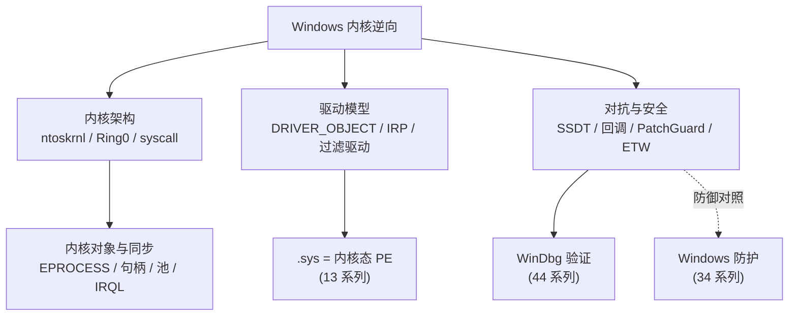

# Windows内核与驱动逆向 · 系列总览

> 作者原创系列，共 **20** 篇。系统拆解 **Windows 内核机制与驱动逆向**：从 **内核架构**、**用户态↔内核态切换**、**WDM/KMDF 驱动模型（`DRIVER_OBJECT`/IRP）**、**内核对象与句柄**、**内核内存**、**WinDbg 内核调试**，到 **SSDT/系统调用表**、**内核回调**、**内核 Hook**、**Rootkit 原理与检测**、**PatchGuard/DSE/HVCI**、**内核漏洞与利用基础**，再到 **驱动逆向实战**、**IRQL 与内核同步**、**文件系统微过滤驱动**、**网络驱动与 WFP**、**ETW 内核遥测**、**PEB/TEB/KPCR 进程线程结构**，最后落到 **Windows 安全机制与对抗全景**。基准平台 **Windows 10/11 x64 + ntoskrnl.exe**，逆向工具为 IDA/Ghidra/WinDbg/x64dbg。驱动 `.sys` 即一个内核态 PE——本系列与 [[13.PE文件详解/00-合集总览-PE文件详解|PE 文件详解]]、[[44.调试器原理与实战/10.WinDbg与x64dbg|WinDbg 调试]]、[[34.现代二进制防护机制/10.Windows防护体系|Windows 防护体系]]、[[33.二进制漏洞与利用基础/00.二进制漏洞与利用基础总览|二进制漏洞]]、[[32.hooks/00.总览|Hook 技术]] 深度互补，并与 [[15.操作系统加载与启动/10.系统调用机制|Linux 系统调用]] 形成双平台对照。

> [!caution] 安全与合规
> 本系列对抗/安全章节（08–13、15–20 中相关部分）一律取 **防御与分析视角**：讲清机制成因、EDR/反作弊如何利用、蓝队如何检测与防御；**不提供针对他人生产系统的武器化利用链或绕过 PatchGuard/免杀的可落地步骤**。仅用于自有环境的内核安全研究、恶意驱动分析与防御。

## 一、内核架构

| # | 章节 | 说明 |
| --- | --- | --- |
| 01 | [[01.Windows内核架构与逆向全景]] | ntoskrnl/HAL、Ring 0/3、内核组件、逆向目标与工具链 |
| 02 | [[02.用户态到内核态的切换]] | ntdll `Nt*`/`Zw*`→`syscall`→`KiSystemCall64`、与 Linux 对照 |

## 二、驱动模型

| # | 章节 | 说明 |
| --- | --- | --- |
| 03 | [[03.WDM驱动模型与IRP]] | `DriverEntry`/`DRIVER_OBJECT`/`DEVICE_OBJECT`、IRP、`IRP_MJ_*`、IOCTL |
| 04 | [[04.KMDF与WDF框架]] | WDF 对象模型、`WDFDEVICE`/队列、与裸 WDM 对比 |

## 三、内核对象与内存

| # | 章节 | 说明 |
| --- | --- | --- |
| 05 | [[05.内核对象与句柄]] | Object Manager、`EPROCESS`/`ETHREAD`、句柄表、`OBJECT_HEADER` |
| 06 | [[06.内核内存管理]] | 分页/非分页池、`ExAllocatePoolWithTag`、MDL、VAD、池标记 |

## 四、内核调试

| # | 章节 | 说明 |
| --- | --- | --- |
| 07 | [[07.WinDbg内核调试]] | KD 双机/转储、`!process`/`dt`/`lm`、符号、崩溃分析 |

## 五、对抗与安全（防御视角）

| # | 章节 | 说明 |
| --- | --- | --- |
| 08 | [[08.SSDT与系统调用表]] | SSDT/`KiServiceTable`、SSDT Hook 与 x64 限制、检测（防御） |
| 09 | [[09.内核回调机制]] | 进程/线程/镜像/注册表/句柄回调、EDR 用法与滥用检测（防御） |
| 10 | [[10.内核Hook技术]] | inline/IRP/IAT Hook、x64 约束、检测（防御视角） |
| 11 | [[11.Rootkit原理与检测]] | DKOM 进程隐藏原理、交叉视图检测（防御，含合规边界） |
| 12 | [[12.PatchGuard与DSE与HVCI]] | KPP、驱动签名强制、VBS/HVCI 代码完整性（防御） |
| 13 | [[13.内核漏洞与利用基础]] | 漏洞类别、Token 窃取概念、SMEP/kCFG/KASLR（研究/防御） |

## 六、驱动实战与内核机制

| # | 章节 | 说明 |
| --- | --- | --- |
| 14 | [[14.驱动逆向实战]] | 分析一个 `.sys`：定位 IRP/IOCTL handler、IDA/WinDbg 全流程 |
| 15 | [[15.IRQL与内核同步]] | IRQL 等级、自旋锁/DPC/APC、`KeAcquireSpinLock`、竞态与死锁 |
| 16 | [[16.文件系统微过滤驱动]] | minifilter/FltMgr、altitude、I/O 回调，EDR 文件监控（防御） |
| 17 | [[17.网络驱动与WFP]] | NDIS 分层、WFP 过滤引擎/callout、防火墙与流量监控（防御） |
| 18 | [[18.ETW与内核遥测]] | ETW provider/session、ETW-Ti、EDR 遥测与反取证（防御） |
| 19 | [[19.PEB与TEB与KPCR]] | PEB/TEB（用户）、KPCR/KPRCB（内核 per-CPU）、逆向取证字段 |

## 七、对抗全景

| # | 章节 | 说明 |
| --- | --- | --- |
| 20 | [[20.Windows安全机制与对抗全景]] | PPL/VBS/HVCI/Credential Guard/ELAM/WDAC、内核缓解全景（防御，收尾） |

## Windows 内核逆向的三大支柱

> 一句话：Windows 内核逆向 = **看懂架构**（ntoskrnl 怎么组织、用户态怎么经 `syscall` 进内核）+ **理解驱动模型**（`DRIVER_OBJECT`/IRP/IOCTL、minifilter/NDIS 各类过滤驱动、`.sys` 即内核态 PE）+ **掌握对抗面**（SSDT/回调/Hook/ETW 如何被 EDR 与 Rootkit 利用、PatchGuard/DSE/HVCI 如何防护）。再补上 IRQL/同步、PEB/TEB/KPCR 这些内核机制基石，配合 WinDbg 把每个结构落到实处，你就能分析真实驱动的 IOCTL 接口、看懂恶意驱动的隐藏与遥测对抗、并从蓝队视角检测它——全程防御与研究视角。
