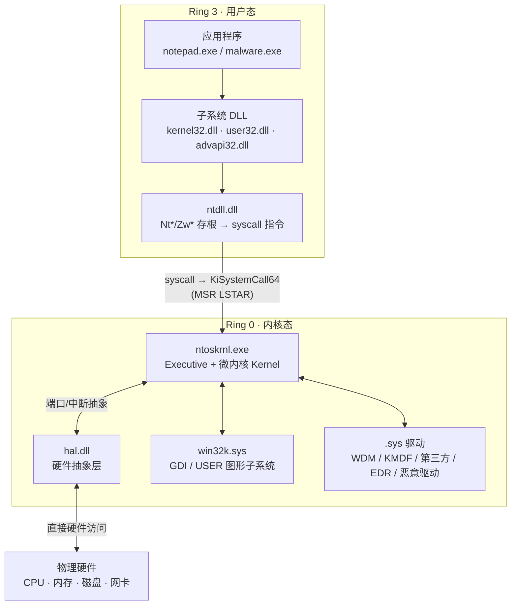

# Windows内核（01）· Windows内核架构与逆向全景

## 概述与定位

> [!abstract] TL;DR
> Windows 内核采用**分层混合内核**设计：用户态（Ring 3）程序经 `ntdll.dll` 的 `syscall` 指令陷入内核态（Ring 0），由 `ntoskrnl.exe`（Executive + 微内核 Kernel）处理请求；`hal.dll` 屏蔽硬件差异；驱动 `.sys` 文件以**内核态 PE** 的形式加载，直接运行在 Ring 0。逆向 Windows 内核的核心是：**读懂 ntoskrnl 的数据结构**（`EPROCESS`/`DRIVER_OBJECT`/`IRP`）、**用 WinDbg 动态验证**、再以 IDA/Ghidra 静态分析驱动二进制。

Windows 并不是纯微内核（Mach 那种）也不是宏内核（Linux），而是一种**混合架构**：关键子系统（进程/内存/I/O/对象/安全）都在内核态运行以保证性能，同时对外暴露清晰的 Executive API；图形子系统（`win32k.sys`）也在内核态，这与 Linux 的用户态 X Server 不同。

本篇是整个系列的**地图篇**，目标是在脑海中建立清晰的架构分层，让后续各章（系统调用、驱动模型、内核对象、调试、SSDT、回调、Hook、Rootkit、PatchGuard、漏洞、实战）都有明确的坐落点。

---

## 原理与机制

### 用户态与内核态的分层

Windows x64 使用 CPU 的**特权环（Privilege Ring）**实现隔离：

- **Ring 3（用户态）**：应用程序、子系统 DLL（`kernel32.dll`/`user32.dll`）、运行时库。用户程序无法直接访问物理内存、I/O 端口、特权指令。
- **Ring 0（内核态）**：`ntoskrnl.exe`、`hal.dll`、`win32k.sys`、所有 `.sys` 驱动。代码拥有完整硬件访问权限，一旦崩溃即蓝屏（BSOD）。

> [!note] Ring 1/2 未使用
> 现代 Windows x64 只使用 Ring 0 和 Ring 3，Ring 1/2 在实践中不被分配。Hypervisor（Hyper-V/VBS）运行在 Ring -1（VMX root mode），比 Ring 0 更高权限，这正是 **HVCI** 得以强制约束内核代码的原因——详见 [[12.PatchGuard与DSE与HVCI]]。



### 系统调用路径（概览）

用户态发起内核服务的完整路径（详见 [[02.用户态到内核态的切换]]）：

1. 应用程序调用 `kernel32!CreateFile` → 转发到 `ntdll!NtCreateFile`。
2. `ntdll!NtCreateFile` 把**系统调用号**（SSN）加载到 `EAX`，执行 `syscall` 指令。
3. CPU 自动切换到 Ring 0，跳转到 MSR `LSTAR` 指向的 `nt!KiSystemCall64`。
4. `KiSystemCall64` 查 **SSDT**（`nt!KiServiceTable`）找到对应的内核函数，分发执行。
5. 内核函数完成后，`sysret` 返回 Ring 3。

---

## 架构详解

### ntoskrnl.exe：内核的核心

`ntoskrnl.exe`（NT Operating System Kernel）是 Windows 内核的主二进制，体积通常在 **10–15 MB** 左右（Windows 11 x64）。它由两大层次组成：

#### Executive 层（`nt!Nt*` / `nt!Ex*` / 各管理器前缀）

Executive 是面向服务的一层，对外暴露 `NtXxx`/`ZwXxx` 系统调用接口，对内组织各功能管理器：

| 管理器 | 前缀 | 主要职责 |
|---|---|---|
| 进程与线程管理器 | `Ps`（Process/Thread） | `EPROCESS`/`ETHREAD` 创建/销毁、调度上下文切换 |
| 内存管理器 | `Mm`（Memory） | 虚拟地址空间、分页、VAD 树、工作集、MDL |
| I/O 管理器 | `Io`（I/O） | IRP 分发、设备栈、`IoCallDriver` / `IoCompleteRequest` |
| 对象管理器 | `Ob`（Object） | `OBJECT_HEADER`/`OBJECT_TYPE`、句柄表、引用计数 |
| 配置管理器 | `Cm`（Configuration） | 注册表（Hive）、`CmRegisterCallback` |
| 安全引用监视器 | `Se`（Security） | 访问检查、`Token`、审计 |
| 缓存管理器 | `Cc`（Cache） | 文件系统缓存、`CcCopyRead` / `CcCopyWrite` |
| 电源管理器 | `Po`（Power） | 电源状态（S0–S5）、设备电源 IRP |
| PnP 管理器 | `Pnp` | 设备枚举、驱动加载、资源分配 |
| 执行体支持 | `Ex` | 同步原语（`ERESOURCE`/`FAST_MUTEX`）、定时器、工作线程 |

> [!tip] 逆向时的前缀规律
> 在 WinDbg 或 IDA 中，内核符号的前缀直接告诉你它属于哪个管理器。看到 `nt!MmAllocateNonCachedMemory` 就知道是内存管理器分配非缓存内存；看到 `nt!IoCreateDevice` 就是 I/O 管理器创建设备对象。这套命名规律让大型内核的逆向工作事半功倍。

#### 微内核 Kernel 层（`Ke` 前缀）

Kernel 层是 Executive 之下的核心层，处理最底层机制：

| 功能 | 代表符号 |
|---|---|
| 调度器（Dispatcher） | `KeWaitForSingleObject` / `KeSetEvent` |
| 中断/陷阱分发 | `KiInterruptDispatch` / `KiSystemCall64` |
| DPC（延迟过程调用） | `KeInsertQueueDpc` / `KeDpcWatchdogCallback` |
| 自旋锁 | `KeAcquireSpinLock` / `KeReleaseSpinLock` |
| IRQL 管理 | `KfRaiseIrql` / `KfLowerIrql` |
| 处理器亲和性 | `KeSetAffinityThread` |

> [!note] IRQL（中断请求级别）
> Windows 用 **IRQL** 管理中断优先级，从低到高：`PASSIVE_LEVEL(0)` → `APC_LEVEL(1)` → `DISPATCH_LEVEL(2)` → `DIRQL(3–26)` → `HIGH_LEVEL(31)`。驱动代码在 `DISPATCH_LEVEL` 及以上**不能访问分页内存**，必须用非分页池（`NonPagedPool`）——这是驱动逆向时定位内存 bug 的重要线索。

### hal.dll：硬件抽象层

`hal.dll`（Hardware Abstraction Layer）将 ntoskrnl 与具体硬件平台隔离：

- 封装 **PIC/APIC 中断控制器**、**ACPI 总线**、**定时器**（HPET/TSC/APIC 定时器）差异。
- 提供 `HalGetBusDataByOffset`、`HalTranslateBusAddress` 等接口，让驱动不必关心总线细节。
- 现代 x64 Windows 中 HAL 已大幅简化（UEFI/ACPI 统一了大量差异），但作为独立 DLL 仍存在。

在 WinDbg 中可以看到：
```
lm m hal
```
```
start             end                 module name
fffff800`2c000000 fffff800`2c0bd000   hal
```

> [!warning] 示例输出为示意

### win32k.sys：图形子系统

`win32k.sys` 是 Windows **GUI 子系统**的内核部分，实现：

- **GDI（Graphics Device Interface）**：`nt!NtGdiXxx` 系统调用族。
- **USER（窗口管理器）**：`nt!NtUserXxx` 系统调用族，管理 `HWND`/消息队列/`WH_*` 钩子。
- 历史上是大量内核漏洞的重灾区（2014–2020 有数十个 `win32k` 提权漏洞）。
- Windows 10 1709 起引入 **Win32k System Call Filter**，沙箱进程可禁用大部分 `NtGdi*`/`NtUser*`（防御面压缩）。

### .sys 驱动：内核态 PE

驱动文件 `.sys` 本质上就是一个普通的 **PE 文件**（与 `.dll` 格式相同，只是加载上下文在内核态）：

- **导入表**：主要导入 `ntoskrnl.exe` 和 `hal.dll` 的导出符号（如 `IoCreateDevice`、`ExAllocatePoolWithTag`）；图形驱动还会导入 `win32k.sys`。
- **入口点**：`DriverEntry(DRIVER_OBJECT*, UNICODE_STRING*)` 对应 PE 的 `AddressOfEntryPoint`。
- **节区布局**：`.text`（代码）/ `.data`（数据）/ `.pdata`（异常数据，x64 SEH 展开）/ `INIT`（仅初始化时需要，可后期丢弃）。
- **签名要求**：x64 Windows 8+ 的内核强制 **DSE（Driver Signature Enforcement）**，未签名驱动默认无法加载（测试环境用 `bcdedit /set testsigning on` 或内核调试模式绕过）。

与 [[13.PE文件详解/00-合集总览-PE文件详解.md]] 的对应关系：
- 导入表（`ntoskrnl` 导出的内核 API）→ 详见 [[13.PE文件详解/08-详解PE文件(八)：导入表.md]]
- 证书表（驱动签名 Authenticode）→ 详见 [[13.PE文件详解/12-详解PE文件(十二)：证书表.md]]

---

## 逆向 / 分析实战

### 逆向目标场景

| 场景 | 目标 | 典型入口 |
|---|---|---|
| **驱动漏洞挖掘** | 找 IOCTL handler 的越界/UAF | `IRP_MJ_DEVICE_CONTROL` dispatch 函数 |
| **EDR/反作弊分析** | 理解其内核回调与钩子范围 | `PsSetCreateProcessNotifyRoutine` 注册点 |
| **恶意驱动分析** | 还原 Rootkit 隐藏手法 | `ActiveProcessLinks` 摘链 / SSDT Hook |
| **CTF 内核题** | 逆向驱动逻辑，构造 IOCTL payload | `DeviceIoControl` 接口 |

### 工具链

```
静态分析
  ├── IDA Pro          — 工业级反汇编/反编译，内置 x64 内核符号 FLIRT
  ├── Ghidra           — NSA 开源，免费，插件生态丰富
  └── PE-bear          — 快速查看 PE 头部（节区/导入/数字签名）

动态调试
  ├── WinDbg (kd)      — 内核调试器，双机 / 本地 / 转储分析
  └── x64dbg           — 用户态调试器（分析加载驱动的用户态程序）

辅助
  ├── LiveKD           — Sysinternals，本地内核快照（只读，非完整调试）
  └── VirtualKD / DebugView — 双机调试加速与内核 DbgPrint 捕获
```

### 符号配置

WinDbg 使用微软公共符号服务器，能解析 ntoskrnl 的大量内部符号（函数名、结构体字段）：

```
.sympath srv*C:\Symbols*https://msdl.microsoft.com/download/symbols
.reload /f ntoskrnl.exe
```

> [!warning] 示例输出为示意

配置后，`dt nt!_EPROCESS` 可以展开 `EPROCESS` 结构体字段；`x nt!Ps*` 可列出所有以 `Ps` 开头的内核符号。

### 观察引子：lm 与 !drvobj

**列出已加载内核模块**（含驱动）：

```
kd> lm
start             end                 module name
fffff800`06c00000 fffff800`07a00000   ntoskrnl  (pdb symbols)
fffff800`2c000000 fffff800`2c0bd000   hal
fffff805`10000000 fffff805`1007e000   win32k
fffff805`20000000 fffff805`200c4000   mydriver   (no symbols)
```

> [!warning] 示例输出为示意

**检查一个驱动对象**（查看其 `MajorFunction` dispatch 数组）：

```
kd> !drvobj \Driver\mydriver 2
Driver object (ffffb50012345678) is for:
 \Driver\mydriver
Driver Extension List: (id , addr)

Device Object list:
ffffb500`abcd0000

DriverEntry:   fffff805`20001000    mydriver!DriverEntry
DriverStartIo: 00000000`00000000
DriverUnload:  fffff805`20002000    mydriver!DriverUnload
AddDevice:     00000000`00000000

Dispatch routines:
[00] IRP_MJ_CREATE           fffff805`20003000    mydriver!DispatchCreate
[0e] IRP_MJ_DEVICE_CONTROL   fffff805`20004000    mydriver!DispatchIoControl
```

> [!warning] 示例输出为示意

`!drvobj <名称> 2` 中的 `2` 让 WinDbg 展开所有 dispatch 例程——`[0e]` 即 `IRP_MJ_DEVICE_CONTROL`（十六进制 `0x0E`），对应 IOCTL 处理函数。这是驱动逆向的**黄金入口**，详见 [[03.WDM驱动模型与IRP]]。

### 从哪里入手分析一个 .sys

1. **PE-bear 速览**：查看节区布局、导入表（确认它调用了哪些内核 API）、数字签名状态。
2. **IDA/Ghidra 加载**：IDA 会自动识别 `DriverEntry`；用 `FLIRT` 签名识别标准库函数。
3. **从 `DriverEntry` 出发**：找 `IoCreateDevice` 调用（创建设备）、找 `MajorFunction` 数组赋值（确认 dispatch 函数）。
4. **重点审计 `IRP_MJ_DEVICE_CONTROL` handler**：用 CTL_CODE 反推每个 IOCTL 码，审计用户控制的输入（`InputBuffer`/`OutputBuffer`）是否有边界检查。
5. **WinDbg 动态跟踪**：在 handler 入口下断点，用 `DeviceIoControl` 触发，观察 IRP 内容。

---

## 安全性与正确使用

### 内核代码的高权限与风险

Ring 0 代码没有任何硬件层保护：一个空指针解引用、栈溢出或非法内存访问会立即触发 **BSOD（蓝屏）**，系统崩溃转储（`%SystemRoot%\MEMORY.DMP`）是事后分析的唯一手段。这意味着：

- 内核漏洞的影响面远超用户态漏洞——攻击者利用驱动漏洞可直接获得 SYSTEM 权限甚至突破 EDR 监控。
- **EDR/反作弊**依赖内核回调（`PsSetCreateProcessNotifyRoutine`、`ObRegisterCallbacks`）监视进程行为；Rootkit 试图通过 DKOM/SSDT Hook 绕过这些监视。
- **PatchGuard（KPP）** 周期性校验关键内核结构，被篡改即 BSOD（`CRITICAL_STRUCTURE_CORRUPTION`）；**DSE** 要求驱动有有效签名；**HVCI** 利用虚拟化在硬件层强制内核代码不可执行写入——这三道防线在 [[12.PatchGuard与DSE与HVCI]] 中详细讨论。

### 逆向合规边界

> [!caution] 合规边界
> 本系列所有内核逆向技术仅适用于以下场景：
> - **自有设备 / 虚拟机**上的内核安全研究与学习
> - **授权渗透测试**（有书面授权，在约定范围内）
> - **恶意样本分析**（分析已知恶意驱动，非生成新武器）
> - **EDR/反作弊产品开发**（自有产品的防御能力建设）
>
> **不适用**：在他人生产系统上未授权部署内核代码；提供绕过 PatchGuard/HVCI/DSE 的可落地步骤；构建针对真实系统的利用链。逆向工程在大多数司法管辖区有明确的合法边界（研究/互操作性除外，商业 EULA 可能有额外限制）。

在虚拟机（Hyper-V/VMware/VirtualBox）中进行所有内核实验是最佳实践：快照保护、调试方便、崩溃隔离。

---

## 本系列地图

本系列 15 章的逻辑脉络：**先懂架构，再懂驱动，再懂对抗**。

```mermaid
graph LR
  C01["01 内核架构全景<br/>（本篇）"]
  C02["02 用户态→内核态切换<br/>syscall / KiSystemCall64"]
  C03["03 WDM驱动模型与IRP<br/>DRIVER_OBJECT / IOCTL"]
  C04["04 KMDF/WDF框架<br/>WDFDEVICE / Queue"]
  C05["05 内核对象与句柄<br/>EPROCESS / 对象管理器"]
  C06["06 内核内存管理<br/>池 / MDL / VAD"]
  C07["07 WinDbg内核调试<br/>双机 / 符号 / 转储"]
  C08["08 SSDT与系统调用表<br/>KiServiceTable"]
  C09["09 内核回调机制<br/>EDR的可观测点"]
  C10["10 内核Hook技术<br/>inline / IRP / IAT"]
  C11["11 Rootkit原理与检测<br/>DKOM / 交叉视图"]
  C12["12 PatchGuard/DSE/HVCI<br/>KPP / 签名 / 虚拟化"]
  C13["13 内核漏洞与利用基础<br/>池溢出 / UAF / Token"]
  C14["14 驱动逆向实战<br/>IDA + WinDbg全流程"]
  C15["15 Windows安全机制全景<br/>PPL / VBS / 对抗"]

  C01 --> C02 --> C03 --> C04
  C03 --> C05 --> C06 --> C07
  C07 --> C08 --> C09 --> C10
  C10 --> C11 --> C12 --> C13
  C13 --> C14 --> C15
```



> 一句话串联：**看懂内核架构（01–02）→ 理解驱动如何收发请求（03–04）→ 掌握内核数据结构（05–06）→ 用 WinDbg 落到实处（07）→ 分析 EDR/Rootkit 的内核技术面（08–13）→ 动手逆向一个真实驱动（14）→ 回到防御全景（15）。**

---

## 小结

| 核心概念 | 要点 |
|---|---|
| Ring 3 / Ring 0 分隔 | CPU 特权环，用户态无法直接访问内核数据 |
| ntoskrnl.exe | Windows 内核主体：Executive（各管理器）+ 微内核 Kernel 层 |
| hal.dll | 硬件抽象层，屏蔽平台差异 |
| Executive 子系统 | Ps/Mm/Io/Ob/Cm/Se/Ex/Ke——各有前缀，逆向时可按前缀定位 |
| .sys = 内核态 PE | 与普通 DLL 格式相同，只是加载在 Ring 0，需要 DSE 签名 |
| 逆向工具链 | IDA/Ghidra（静态）+ WinDbg（内核动态）+ PE-bear + x64dbg |
| 逆向入口 | `DriverEntry` → 设备创建 → `MajorFunction` 数组 → `IRP_MJ_DEVICE_CONTROL` |

从本篇出发，下一篇 [[02.用户态到内核态的切换]] 将深入 `syscall`/`KiSystemCall64`/SSDT 的完整路径；[[03.WDM驱动模型与IRP]] 将拆解 `DRIVER_OBJECT`/`IRP` 的每个字段；[[07.WinDbg内核调试]] 将把所有 WinDbg 命令系统化。整个系列最终在 [[14.驱动逆向实战]] 汇聚为一次完整的 `.sys` 分析全流程。

---

## 相关阅读

- **驱动即 PE** → [[13.PE文件详解/00-合集总览-PE文件详解.md]]
- **WinDbg 完整调试方法论** → [[44.调试器原理与实战/10.WinDbg与x64dbg.md]]
- **Windows 内核防护体系（PatchGuard/DSE/HVCI）** → [[34.现代二进制防护机制/10.Windows防护体系.md]]

---

🏠 [[00.Windows内核与驱动逆向总览]] ｜ 下一篇 [[02.用户态到内核态的切换]] ➡️
