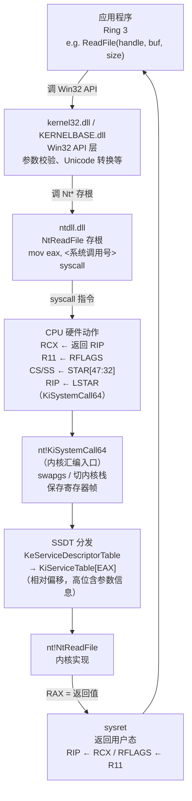

# Windows内核（02）· 用户态到内核态的切换

## 概述与定位

> [!abstract] TL;DR
> 用户态程序调用 Win32 API（`kernel32.dll`/`KERNELBASE.dll`）后，最终会抵达 `ntdll.dll` 中的 **`Nt*`/`Zw*` 存根**，存根把**系统调用号写入 EAX**，然后执行 `syscall` 指令。CPU 读取 MSR **`LSTAR`**（0xC0000082）并跳入 `nt!KiSystemCall64`；内核以 EAX 为索引在 **SSDT**（`nt!KeServiceDescriptorTable` → `nt!KiServiceTable`）中查找对应的 `nt!Nt*` 实现并调用，最终经 `sysret` 返回用户态。x64 的 `KiServiceTable` 存的是**相对偏移**，高位编码了参数字节信息。相比 Linux：两者都走 `syscall`+LSTAR，区别在于 Linux 系统调用号放 **RAX**，而 Windows 放 **EAX**（64 位寄存器的低 32 位）。

---

## 原理与机制

### 完整调用链概览

从用户程序的一次 API 调用到内核函数执行完毕，要经历以下几个层次：



> [!warning] 示例输出为示意

### 三层 API 栈

Windows 采用三层用户态 API 栈的设计，使得内核接口稳定，Win32 语义层独立演化：

| 层次 | 模块 | 角色 |
|---|---|---|
| **Win32 API** | `kernel32.dll` / `KERNELBASE.dll` | 对外暴露的 Win32 接口；负责参数校验、ANSI/Unicode 转换、错误码映射 |
| **原生 API（Native API）** | `ntdll.dll` | `Nt*`/`Zw*` 存根（syscall stub）；最终触发 `syscall` 进入内核；也承担进程启动（`LdrInitializeThunk`）等职责 |
| **内核执行体** | `ntoskrnl.exe`（`nt!Nt*`） | 实际系统调用实现；检验参数、操作内核对象、返回状态码 |

大多数 `kernel32` 函数只是对 `ntdll` 的薄包装：例如 `ReadFile` → `NtReadFile`，`VirtualAlloc` → `NtAllocateVirtualMemory`，`CreateProcess` → `NtCreateUserProcess`。部分函数通过 `KERNELBASE.dll`（Windows 7+ 重构后从 `kernel32` 分离）中转。

---

## 流程详解

### ntdll 中的 syscall 存根（stub）

`ntdll.dll` 中每个 `Nt*` 函数（也称 syscall stub）的汇编结构极为简洁。以 `NtReadFile` 为例（伪代码，示意）：

```nasm
; ntdll!NtReadFile（x64 示意，Intel 语法）
NtReadFile:
    mov     r10, rcx          ; 保存第 1 参数（rcx 将被 syscall 占用，存入 r10）
    mov     eax, 6            ; EAX = 系统调用号（号随版本变，此处为示意值）
    syscall                   ; 进入内核
    ret
```

> [!warning] 示例输出为示意

关键点：
- **`mov r10, rcx`**：`syscall` 指令执行后会把返回 RIP 写入 RCX，破坏第 1 参数；因此存根首先把 RCX（第 1 参数）挪到 R10 保存。
- **`mov eax, <号>`**：系统调用号写入 EAX（RAX 的低 32 位），高 32 位清零。
- **`syscall`**：触发特权级切换，CPU 执行以下硬件动作：
  1. `RCX ← RIP`（保存返回地址，即 `syscall` 下一条指令）
  2. `R11 ← RFLAGS`（保存用户态标志寄存器）
  3. `RFLAGS &= ~SFMASK`（清除包括 IF 在内的标志位，关中断）
  4. `CS` ← `STAR[47:32]`（切换到内核代码段）
  5. `RIP ← LSTAR`（跳入 `nt!KiSystemCall64`）

### MSR LSTAR 与内核入口

`LSTAR`（MSR 地址 `0xC0000082`，Long mode SYSCALL Target Address Register）由内核在初始化阶段写入 `nt!KiSystemCall64` 的虚拟地址。用 WinDbg 可验证：

```
kd> rdmsr C0000082
msr[c0000082] = fffff803`12345678   ; 示意地址
kd> ln fffff803`12345678
(fffff803`12345678)   nt!KiSystemCall64
```

> [!warning] 示例输出为示意

`KiSystemCall64` 的简化执行流程：

```nasm
; nt!KiSystemCall64 简化示意（基于公开符号/WinDbg 分析）
KiSystemCall64:
    swapgs                       ; 切换 GS.base → per-CPU KPCR（内核 per-CPU 结构）
    ; 将用户态 RSP 存入 KPCR，切换到内核栈
    mov     gs:[PcRspBase], rsp
    mov     rsp, gs:[PcUserRspShadow]  ; 切换内核栈（实际字段名示意）

    ; 保存用户寄存器（构建 KTRAP_FRAME）
    push    rcx          ; 保存用户返回 RIP（CPU 自动存入 RCX）
    push    r11          ; 保存用户 RFLAGS
    ; ... 保存其余寄存器 ...

    ; 跳入 KiSystemServiceStart 执行分发
    call    KiSystemServiceStart
    ; ... 分发完成后恢复寄存器 ...
    swapgs
    sysretq              ; 返回用户态（RIP←RCX, RFLAGS←R11）
```

> [!warning] 示例输出为示意

### SSDT 分发：KeServiceDescriptorTable 与 KiServiceTable

内核分发的核心数据结构是 **SSDT（System Service Descriptor Table，系统服务描述符表）**，其全局符号为 `nt!KeServiceDescriptorTable`。

```
kd> dt nt!_KSERVICE_TABLE_DESCRIPTOR
   +0x000 Base             : Ptr64 Uint4B    ; 指向 KiServiceTable（函数相对偏移数组）
   +0x008 Count            : Ptr64 Uint4B    ; 引用计数（调试用，通常 NULL）
   +0x010 Limit            : Uint4B          ; 表项总数（即系统调用总数）
   +0x018 Number           : Ptr64 UChar     ; 参数字节数表（x86 用，x64 已编码进 Base 项）
```

> [!warning] 示例输出为示意

实际分发代码（`KiSystemServiceStart`/`KiSystemServiceRepeat`，示意）：

```nasm
; KiSystemServiceStart 核心逻辑（示意，基于反汇编分析）
KiSystemServiceStart:
    ; EAX = 系统调用号（来自存根的 mov eax, N）
    ; 检查号是否在范围内
    cmp     eax, [KeServiceDescriptorTable + Limit]
    jae     .invalid_syscall

    ; 取 KiServiceTable 中的相对偏移
    lea     r10, [nt!KiServiceTable]     ; KiServiceTable 基地址
    mov     eax, dword ptr [r10 + rax*4] ; 取第 EAX 项（每项 4 字节相对偏移）
    ; 解码：低位含参数字节信息（高4位 or 低3位，依版本略有差异）
    ; 真实函数地址 = KiServiceTable基址 + (项值 >> 4)（示意解码方式）
    movsxd  r11, eax
    sar     r11, 4                       ; 右移 4 位得到相对偏移（示意）
    lea     rax, [r10 + r11]             ; 函数实际地址
    call    rax                          ; 调用 nt!NtReadFile 等内核实现
```

> [!warning] 示例输出为示意

**x64 KiServiceTable 的编码细节**：

与 x86 时代的 SSDT（直接存绝对地址）不同，x64 的 `KiServiceTable` 每项存储的是**相对于 `KiServiceTable` 自身基址的偏移**，且该偏移值的低位还编码了该函数期望的参数字节总数信息（便于内核在调用时准确从陷阱帧中取出参数）。这一设计使整个表更紧凑，也配合 KPP（PatchGuard）对该表的完整性校验。

WinDbg 查看 SSDT：

```
kd> dps nt!KeServiceDescriptorTable L4
fffff803`1234a000  fffff803`12399000   ; Base → KiServiceTable
fffff803`1234a008  00000000`00000000   ; Count
fffff803`1234a010  00000000`000001c8   ; Limit = 0x1c8 = 456 个系统调用（Win10 示意值）
fffff803`1234a018  fffff803`1239de40   ; Number（参数字节表）

kd> dd nt!KiServiceTable L10
fffff803`12399000  040d8c04 04fac80c ...  ; 每项为 4 字节相对偏移（含低位参数信息）
```

> [!warning] 示例输出为示意

### Nt* vs Zw*：用户态与内核态的差异

**在 ntdll（用户态）**，`NtXxx` 与 `ZwXxx` 指向**完全相同的存根**，二者等价，调用效果没有区别。

**在内核中**，两者存在实质差异：

| 前缀 | 内核层面行为 | `PreviousMode` | 典型使用场景 |
|---|---|---|---|
| `Nt*`（e.g. `nt!NtReadFile`） | 直接被 SSDT 分发调用；`PreviousMode` 反映来源（用户态=UserMode） | `UserMode`（来自用户 syscall） | 系统调用分发链末端 |
| `Zw*`（e.g. `nt!ZwReadFile`） | 通过系统调用机制再次进入内核，将 `PreviousMode` 设为 `KernelMode` | `KernelMode` | **驱动代码调用系统服务**时使用 |

驱动中应使用 `Zw*` 而非 `Nt*` 的原因：当 `PreviousMode = KernelMode` 时，内核中的参数探测函数（`ProbeForRead`/`ProbeForWrite`）不会对指针做用户空间合法性检查（内核指针无需此检查），行为更安全可靠；用 `Nt*` 则 `PreviousMode` 仍为 `UserMode`，内核会错误地对驱动传入的内核指针做用户空间校验，可能失败。

### KPTI / KVA Shadow（Meltdown 缓解）

Windows 10 版本 1803 起引入 **KVA Shadow（Kernel Virtual Address Shadow）**，即 x86-64 Linux 的 KPTI（Kernel Page-Table Isolation）的 Windows 实现，用于缓解 Meltdown 漏洞。

其核心是**内核/用户页表分离**：
- **用户页表**（User CR3）：仅映射用户地址空间 + 极少量的内核"蹦床"代码（syscall 入口桩）。
- **内核页表**（Kernel CR3）：映射完整的内核地址空间。

`syscall` 陷入内核后，`KiSystemCall64` 入口处需要执行 CR3 切换（从用户 CR3 → 内核 CR3），`sysret` 返回前再切回用户 CR3。这引入了额外的 TLB 刷新开销。现代 CPU（带 PCID/ASID 支持）可以通过标记 CR3 来避免完整 TLB 刷新，降低该开销。

可在 WinDbg 观察 KVA Shadow 是否启用：

```
kd> !spectre
Kernel VA Shadow: enabled   ; 示意输出
```

> [!warning] 示例输出为示意

---

## 逆向视角

### 在 ntdll 反汇编中认出 syscall stub

拿到一个可疑的用户态二进制时，识别其是否直接调用 `ntdll` 存根（绕过 Win32 层）是分析的第一步。syscall stub 有固定特征模式：

```nasm
; x64 Windows syscall stub 典型模式（IDA / x64dbg 视图，Intel 语法，示意地址）
; ntdll!NtWriteVirtualMemory 示意反汇编

.text:00007FFE412A1180   mov     r10, rcx         ; 保护 rcx（第1参）
.text:00007FFE412A1183   mov     eax, 3Ah         ; EAX = 0x3A = 系统调用号（随版本变）
.text:00007FFE412A1188   syscall                  ; ← 识别关键：syscall 紧跟 mov eax,立即数
.text:00007FFE412A118A   ret
```

> [!warning] 示例输出为示意

**识别规律总结**：

| 特征 | 说明 |
|---|---|
| `mov r10, rcx` | 几乎所有 stub 的第一条指令，保存被 syscall 破坏的 rcx |
| `mov eax, 立即数` | 紧随其后，立即数即系统调用号（Windows 系统调用号 < 0x1000） |
| `syscall` | 两条指令后即 syscall，函数体极短（4–6 字节） |
| 函数名模式 | `Nt*`/`Zw*` 前缀，可在 ntdll 导出表查找 |

在 IDA 中快速定位所有 syscall stub：使用脚本搜索模式 `4C 8B D1 B8 ?? ?? 00 00 0F 05`（`mov r10,rcx; mov eax,N; syscall` 的字节序列）。

### 系统调用号随版本变化

与 Linux 不同，**Windows 的系统调用号不是稳定的公开 ABI**。每个 Windows 版本（甚至每个补丁级别）都可能改变某个系统调用的编号：

| Windows 版本 | NtWriteVirtualMemory 号（示意，非精确值） |
|---|---|
| Windows 10 1809 | 0x3A |
| Windows 10 21H2 | 0x3B |
| Windows 11 22H2 | 0x3C |

> [!warning] 以上为示意说明版本变化趋势，非精确系统调用号

这带来以下逆向分析含义：

1. **直接 syscall 的兼容性**：某些安全工具（或恶意软件）的用户态 Hook 会拦截 `ntdll` 的 `Nt*` 存根，攻击者有时会**直接内联 `syscall` 指令**绕过此类 Hook——这种技术被称为 **Direct Syscall**（如 SysWhispers 工具所实现）。
2. **号表工程**：SysWhispers、ntdll-reflective-loader 等项目维护跨版本号表，或在运行时通过遍历 ntdll 导出/解析存根来动态获取当前系统的调用号。
3. **版本敏感分析**：逆向时看到硬编码的 `mov eax, N`，需要结合目标系统版本才能确定对应的 `Nt*` 函数。`ntdll.dll` 版本号 + 已知号表数据库（如 j00ru/windows-syscalls GitHub 项目）是通用参考。

用 WinDbg 枚举当前系统的系统调用号：

```
kd> u ntdll!NtReadFile L4
ntdll!NtReadFile:
00007ff8`1234abcd mov     r10,rcx
00007ff8`1234abd0 mov     eax,6        ; 6 = NtReadFile 的号（示意）
00007ff8`1234abd5 syscall
00007ff8`1234abd7 ret
```

> [!warning] 示例输出为示意

---

## 安全性与正确使用

### 直接 syscall（Direct Syscall）——分析视角

部分安全工具（EDR、反作弊）会在用户态 Hook `ntdll` 中的 `Nt*` 存根来监控 API 行为。理解这种 Hook 的工作方式及其绕过原理，对 **EDR 原理分析与检测研究**有直接价值（参见 [[32.hooks/02-windows-api-hook.md]]）。

**Hook 工作原理（Inline Hook，用户态）**：
EDR 的用户态组件在进程加载时，将 `ntdll!NtXxx` 存根的前几字节替换为 `jmp <EDR监控函数>`，从而在系统调用发出前截获参数和行为。

**Direct Syscall 绕过逻辑**（分析视角，非武器化）：
攻击者在自身代码中直接嵌入 `mov r10, rcx; mov eax, N; syscall` 指令序列，完全绕开 `ntdll` 的 Inline Hook。这种技术的脆弱性在于：**系统调用号随版本变化**，硬编码的号在其他系统版本上会调用错误的系统服务，甚至导致崩溃。

**检测思路（蓝队）**：
- 监控进程内存中**来自非 `ntdll` 模块的 `syscall` 指令**（内核驱动可通过 ETW-TI 或内存扫描检测）。
- 系统调用来源 RIP 不在 `ntdll` 地址范围内是强烈异常指标。
- 现代 EDR 将 Hook 下移到内核层（`ObRegisterCallbacks`、`PsSetCreateProcessNotifyRoutine`），不再依赖可被绕过的用户态 Inline Hook。

### 系统调用号版本依赖的脆弱性

任何**绕过 ntdll 直接使用硬编码调用号**的代码（工具或恶意软件），都面临跨版本兼容性问题：

- Windows 服务包/累积更新可能重排系统调用号。
- 内核升级后，硬编码号可能指向完全不同的 `Nt*` 函数，轻则调用失败，重则行为不可预测。

这是识别此类技术代码的实用特征：在反汇编中搜索不通过 `ntdll` 导出的 `syscall` 指令序列，结合号值与版本号表比对，即可判断目标文件是否使用了 Direct Syscall 及其对应的版本支持范围。

### KPTI 开销与缓解评估

KVA Shadow 对系统调用路径引入了 CR3 切换开销。在高频系统调用场景（如网络 I/O 密集、高频文件操作）下可能产生可观的性能影响，尤其是在没有 PCID 支持的旧硬件上。现代 Intel/AMD CPU 均支持 PCID，Windows 会自动利用以降低 TLB 刷新代价。内核调试时可通过 `!spectre` 命令确认当前缓解策略状态。

### 与 Linux 系统调用的简短对照

> [!note] 双平台对照（互补，详见 [[15.操作系统加载与启动/10.系统调用机制.md]]）
> 两者都走 `syscall` 指令 + `LSTAR` MSR 机制，核心 CPU 动作相同。关键差异：
> - **Linux**：调用号在 **RAX**（64 位全宽），参数顺序为 `RDI RSI RDX R10 R8 R9`，第 4 参走 **R10**（非 RCX），入口为 `entry_SYSCALL_64`，调用号是稳定的公开 ABI。
> - **Windows**：调用号在 **EAX**（RAX 低 32 位），第 1 参先 `mov r10, rcx` 保护，入口为 `nt!KiSystemCall64`，调用号**随版本变化，非公开稳定 ABI**，分发走 **SSDT**（`KiServiceTable`）而非 Linux 的函数指针数组（`sys_call_table`）。

---

## 小结

用户态到内核态的切换是 Windows 内核机制的基础枢纽，串联起所有上层 API 与内核功能：

1. **三层调用栈**：Win32 API（`kernel32`/`KERNELBASE`）→ 原生 API 存根（`ntdll` `Nt*`/`Zw*`）→ 内核实现（`nt!Nt*`）。
2. **系统调用号在 EAX**：ntdll 存根用 `mov eax, N` 设置号，高位清零，再 `mov r10, rcx` 保护第 1 参，最后 `syscall`。
3. **LSTAR 指向 KiSystemCall64**：MSR 0xC0000082，内核启动时写入；CPU 执行 `syscall` 后自动跳入此地址，同时把返回 RIP 存入 RCX、RFLAGS 存入 R11。
4. **SSDT 分发**：`KeServiceDescriptorTable → KiServiceTable` 存相对偏移（高位含参数信息）；EAX 为索引，找到 `nt!NtXxx` 实现并调用；`sysret` 经 RCX/R11 恢复用户态上下文返回。
5. **Nt* vs Zw***：用户态 ntdll 中等价；内核中 `Zw*` 将 `PreviousMode` 置为 `KernelMode`，驱动代码应使用 `Zw*` 调用系统服务。
6. **KPTI/KVA Shadow**：Meltdown 缓解，用户/内核页表分离，syscall 路径有 CR3 切换开销；支持 PCID 的 CPU 可显著降低该开销。
7. **逆向识别**：ntdll 中的 `mov r10,rcx; mov eax,N; syscall; ret` 四指令模式即 stub 特征；调用号版本敏感，需结合版本号表分析。

---

## 相关阅读

- [[15.操作系统加载与启动/10.系统调用机制.md]] — Linux `syscall` 完整机制（RAX/sys_call_table/entry_SYSCALL_64），本篇 Windows 侧的对照参考
- [[32.hooks/02-windows-api-hook.md]] — 用户态 Hook 拦截 ntdll `Nt*` 存根的原理与检测，Direct Syscall 的实战背景
- [[08.SSDT与系统调用表]] — SSDT/KiServiceTable 结构深度解析、x64 限制与 PatchGuard 防护、SSDT Hook 历史与检测

---

⬅️ 上一篇 [[01.Windows内核架构与逆向全景]] ｜ 🏠 [[00.Windows内核与驱动逆向总览]] ｜ 下一篇 [[03.WDM驱动模型与IRP]] ➡️
