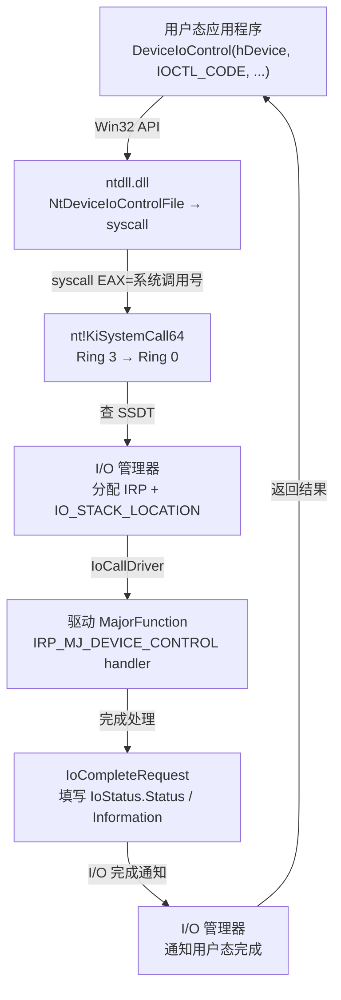

# Windows内核（03）· WDM驱动模型与IRP

## 概述与定位

> [!abstract] TL;DR
> WDM（Windows Driver Model）是 Windows 内核提供的最底层驱动框架。每个 WDM 驱动本质上是一个 **内核态 PE（`.sys`）**，由 I/O 管理器加载后调用 `DriverEntry` 初始化；驱动通过填写 **`DRIVER_OBJECT.MajorFunction[]` 分发表**（28 项）来声明自己能处理哪些 I/O 请求；用户态程序发来的每一个 I/O 操作（打开/读/写/DeviceIoControl）都被 I/O 管理器封装成一个 **IRP（I/O Request Packet）** 投递给驱动；IOCTL 通过 **`CTL_CODE`** 宏把设备类型、功能号、传输方式（`METHOD_*`）和访问权限编码成一个 32 位整数，逆向分析的关键就是 **找到 `IRP_MJ_DEVICE_CONTROL` handler → 按 `IoControlCode` 分支 → 根据 `Method` 定位输入/输出缓冲**。

Windows 驱动体系可以粗略分为三层：

1. **用户态**：应用程序调用 `CreateFile`/`ReadFile`/`WriteFile`/`DeviceIoControl` 等 Win32 API。
2. **I/O 管理器（I/O Manager，`nt!IoManager`）**：内核中枢，接收用户态请求、分配并初始化 IRP、把 IRP 路由到对应设备栈。
3. **驱动（`.sys`）**：运行于 Ring 0，通过实现 `MajorFunction` 分发函数来处理 IRP，完成后调用 `IoCompleteRequest`。

WDM 是"裸框架"——驱动必须手动处理 PnP、电源管理、IRP 路由等所有细节；后继的 KMDF/WDF（第 04 篇）在 WDM 之上封装了对象模型，简化了这些工作。

---

## 原理与机制

### 请求流转全景

下图展示从用户态 `DeviceIoControl` 到驱动 dispatch 例程的完整链路：



### 驱动加载过程

1. 服务控制管理器（SCM）调用 `NtLoadDriver`（或系统在启动时处理注册表 `HKLM\SYSTEM\CurrentControlSet\Services\<驱动名>`）。
2. 内核的 `MmLoadSystemImage` 把 `.sys` 作为内核态 PE 映射到系统地址空间。
3. I/O 管理器调用驱动的 **`DriverEntry`** 入口函数。
4. `DriverEntry` 返回 `STATUS_SUCCESS` 后，驱动正式就绪，可以处理 IRP。

---

## 结构详解

### `DriverEntry`

```c
NTSTATUS DriverEntry(
    PDRIVER_OBJECT  DriverObject,   // 由 I/O 管理器分配，代表本驱动
    PUNICODE_STRING RegistryPath    // 注册表服务键路径
);
```

`DriverEntry` 是驱动的唯一入口（类比用户态 `main`），必须完成：

| 任务 | 典型调用 |
|---|---|
| 填写分发函数表 | `DriverObject->MajorFunction[IRP_MJ_*] = MyHandler;` |
| 注册卸载例程 | `DriverObject->DriverUnload = MyUnload;` |
| 创建设备对象 | `IoCreateDevice(...)` |
| 创建符号链接 | `IoCreateSymbolicLink(...)` |

### `DRIVER_OBJECT`

`DRIVER_OBJECT` 由 I/O 管理器分配并传入 `DriverEntry`，代表一个已加载的驱动。关键字段（`dt nt!_DRIVER_OBJECT` 风格）：

```
dt nt!_DRIVER_OBJECT
   +0x000 Type                 : Int2B          ; 固定值 4
   +0x002 Size                 : Int2B
   +0x008 DeviceObject         : Ptr64 _DEVICE_OBJECT  ; 设备对象链表头
   +0x010 Flags                : Uint4B
   +0x018 DriverStart          : Ptr64 Void     ; .sys 在内核中的起始地址
   +0x020 DriverSize           : Uint4B
   +0x028 DriverSection        : Ptr64 Void     ; LDR_DATA_TABLE_ENTRY
   +0x030 DriverExtension      : Ptr64 _DRIVER_EXTENSION
   +0x038 DriverName           : _UNICODE_STRING ; "\\Driver\\Xxx"
   +0x048 HardwareDatabase     : Ptr64 _UNICODE_STRING
   +0x050 FastIoDispatch       : Ptr64 _FAST_IO_DISPATCH
   +0x058 DriverInit           : Ptr64 void     ; DriverEntry 地址
   +0x060 DriverStartIo        : Ptr64 void     ; StartIo（序列化队列，可选）
   +0x068 DriverUnload         : Ptr64 void     ; 卸载例程
   +0x070 MajorFunction        : [28] Ptr64 void ; 分发函数数组（28 项）
```

**`MajorFunction[IRP_MJ_MAXIMUM_FUNCTION + 1]`** 是核心：共 **28** 个函数指针槽，索引即主功能码 `IRP_MJ_*`。未初始化的槽默认指向 `nt!IopInvalidDeviceRequest`（返回 `STATUS_INVALID_DEVICE_REQUEST`）。

> [!warning] 示例输出为示意
> 上方 `dt` 偏移基于 Windows 10 22H2 x64 ntoskrnl.exe，不同版本可能存在微小差异。

### `DEVICE_OBJECT` 与设备栈

`DEVICE_OBJECT` 代表一个具体的设备，由 `IoCreateDevice` 创建：

```c
NTSTATUS IoCreateDevice(
    PDRIVER_OBJECT  DriverObject,
    ULONG           DeviceExtensionSize,  // 驱动私有数据的大小，紧跟 DEVICE_OBJECT 之后
    PUNICODE_STRING DeviceName,           // 内核命名空间路径，如 L"\\Device\\MyDevice"
    DEVICE_TYPE     DeviceType,           // FILE_DEVICE_UNKNOWN 等
    ULONG           DeviceCharacteristics,
    BOOLEAN         Exclusive,
    PDEVICE_OBJECT *DeviceObject          // 输出：新创建的设备对象指针
);
```

`DEVICE_OBJECT` 关键字段：

```
dt nt!_DEVICE_OBJECT
   +0x000 Type             : Int2B          ; 固定值 3
   +0x008 Size             : Uint4B
   +0x010 ReferenceCount   : Int4B
   +0x018 DriverObject     : Ptr64 _DRIVER_OBJECT ; 所属驱动
   +0x020 NextDevice       : Ptr64 _DEVICE_OBJECT  ; 同驱动的下一个设备
   +0x028 AttachedDevice   : Ptr64 _DEVICE_OBJECT  ; 附加于本设备之上的设备（过滤驱动用）
   +0x030 CurrentIrp       : Ptr64 _IRP
   +0x040 Flags            : Uint4B                ; DO_BUFFERED_IO / DO_DIRECT_IO
   +0x050 AlignmentRequirement : Uint4B
   +0x070 DeviceExtension  : Ptr64 Void            ; 驱动私有上下文
   +0x078 DeviceType       : Uint4B
   +0x07c StackSize        : Char                  ; 设备栈深度（IRP 中 IO_STACK_LOCATION 的数量）
```

> [!warning] 示例输出为示意

**符号链接**：内核设备名（`\Device\Xxx`）在内核命名空间中，用户态无法直接使用。需要创建符号链接把设备暴露给用户态：

```c
UNICODE_STRING devName  = RTL_CONSTANT_STRING(L"\\Device\\MyDevice");
UNICODE_STRING symLink  = RTL_CONSTANT_STRING(L"\\DosDevices\\MyDevice");
// \DosDevices\Xxx 等价于 \??\Xxx，用户态 CreateFile(L"\\\\.\\MyDevice") 最终解析到这里
IoCreateSymbolicLink(&symLink, &devName);
```

用户态通过 `CreateFile(L"\\\\.\\MyDevice", ...)` → 内核解析 `\??\MyDevice` → 找到符号链接 → 找到 `\Device\MyDevice` → 返回文件句柄。

**设备栈（Device Stack）**：过滤驱动通过 `IoAttachDeviceToDeviceStack` 把自己的 `DEVICE_OBJECT` "叠"在目标设备之上，形成设备栈。IRP 从栈顶向下传递，每一层可以处理或透传，最终由栈底（PDO）完成。

```
用户态请求
    ↓
[过滤设备 FDO]  ← AttachedDevice
    ↓ IoCallDriver
[功能设备 FDO]
    ↓ IoCallDriver
[物理设备 PDO]
```

### IRP（I/O Request Packet）

IRP 是 I/O 管理器为每个 I/O 请求动态分配的数据包，贯穿请求的整个生命周期。

```
dt nt!_IRP
   +0x000 Type                     : Int2B        ; 固定值 6
   +0x002 Size                     : Uint2B
   +0x008 MdlAddress               : Ptr64 _MDL   ; METHOD_IN/OUT_DIRECT 时的 MDL（内存描述符列表）
   +0x010 Flags                    : Uint4B
   +0x018 AssociatedIrp            : <union>      ; SystemBuffer（METHOD_BUFFERED 时的内核缓冲）
   +0x028 IoStatus                 : _IO_STATUS_BLOCK  ; 完成状态 { Status, Information }
   +0x038 RequestorMode            : Char         ; KernelMode 或 UserMode
   +0x040 PendingReturned          : UChar
   +0x044 StackCount               : Char         ; IO_STACK_LOCATION 总数
   +0x045 CurrentLocation          : Char         ; 当前层索引
   +0x050 Cancel                   : UChar
   +0x070 UserBuffer               : Ptr64 Void   ; 用户态输出缓冲（METHOD_NEITHER / METHOD_BUFFERED 完成时复制回）
   +0x078 Tail.Overlay             : ...
```

> [!warning] 示例输出为示意

**三种缓冲传递方式**由 `DEVICE_OBJECT.Flags`（`DO_BUFFERED_IO` / `DO_DIRECT_IO`）和 IOCTL 的 `Method` 字段共同决定：

| 方式 | `DEVICE_OBJECT.Flags` | 读/写 IRP 数据来源 | 说明 |
|---|---|---|---|
| Buffered I/O | `DO_BUFFERED_IO` | `Irp->AssociatedIrp.SystemBuffer` | 内核中间缓冲，输入/输出都经内核拷贝 |
| Direct I/O | `DO_DIRECT_IO` | `Irp->MdlAddress`（MDL 锁定的物理页） | 零拷贝，通过 MDL 直接映射用户态内存 |
| Neither I/O | 无标志 | `Irp->UserBuffer`（原始用户态指针）| 驱动必须自行用 `ProbeForRead/Write` + `__try` 校验 |

### `IO_STACK_LOCATION`

IRP 内部有一个 `IO_STACK_LOCATION` 数组（每层驱动一个槽）。当前驱动使用：

```c
PIO_STACK_LOCATION irpSp = IoGetCurrentIrpStackLocation(Irp);
```

关键字段：

```
dt nt!_IO_STACK_LOCATION
   +0x000 MajorFunction     : UChar           ; IRP_MJ_* 主功能码
   +0x001 MinorFunction     : UChar           ; 次功能码（PnP/电源用）
   +0x008 DeviceObject      : Ptr64 _DEVICE_OBJECT
   +0x010 FileObject        : Ptr64 _FILE_OBJECT
   +0x018 Parameters        : <union>          ; 与 MajorFunction 对应的参数联合体
```

对于 `IRP_MJ_DEVICE_CONTROL`，`Parameters` 中：

```c
struct {
    ULONG OutputBufferLength;   // 输出缓冲长度
    ULONG InputBufferLength;    // 输入缓冲长度
    ULONG IoControlCode;        // CTL_CODE 值（IOCTL 功能码）
    PVOID Type3InputBuffer;     // METHOD_NEITHER 时的输入缓冲（用户态指针）
} DeviceIoControl;
```

> [!warning] 示例输出为示意

### 主功能码 `IRP_MJ_*`

`DRIVER_OBJECT.MajorFunction[28]` 的索引对应如下主功能码（常用子集）：

| 索引（十六进制） | 符号常量 | 触发时机 |
|---|---|---|
| 0x00 | `IRP_MJ_CREATE` | `CreateFile` 打开设备 |
| 0x01 | `IRP_MJ_CREATE_NAMED_PIPE` | 命名管道创建 |
| 0x02 | `IRP_MJ_CLOSE` | 句柄引用计数降至零 |
| 0x03 | `IRP_MJ_READ` | `ReadFile` 读数据 |
| 0x04 | `IRP_MJ_WRITE` | `WriteFile` 写数据 |
| 0x05 | `IRP_MJ_QUERY_INFORMATION` | 查询文件信息 |
| 0x06 | `IRP_MJ_SET_INFORMATION` | 设置文件信息 |
| 0x07 | `IRP_MJ_QUERY_EA` | 查询扩展属性 |
| 0x08 | `IRP_MJ_SET_EA` | 设置扩展属性 |
| 0x09 | `IRP_MJ_FLUSH_BUFFERS` | `FlushFileBuffers` |
| 0x0A | `IRP_MJ_QUERY_VOLUME_INFORMATION` | 查询卷信息 |
| 0x0B | `IRP_MJ_SET_VOLUME_INFORMATION` | 设置卷信息 |
| 0x0C | `IRP_MJ_DIRECTORY_CONTROL` | 目录操作 |
| 0x0D | `IRP_MJ_FILE_SYSTEM_CONTROL` | 文件系统控制 |
| **0x0E** | **`IRP_MJ_DEVICE_CONTROL`** | **`DeviceIoControl`（最核心的 IOCTL 入口）** |
| 0x0F | `IRP_MJ_INTERNAL_DEVICE_CONTROL` | 内核内部 IOCTL（`IoBuildDeviceIoControlRequest`） |
| 0x10 | `IRP_MJ_SHUTDOWN` | 系统关机通知 |
| 0x11 | `IRP_MJ_LOCK_CONTROL` | 文件锁操作 |
| 0x12 | `IRP_MJ_CLEANUP` | `CloseHandle`（最后一个句柄关闭前清理） |
| 0x13 | `IRP_MJ_CREATE_MAILSLOT` | 邮槽创建 |
| 0x14 | `IRP_MJ_QUERY_SECURITY` | 查询安全描述符 |
| 0x15 | `IRP_MJ_SET_SECURITY` | 设置安全描述符 |
| 0x16 | `IRP_MJ_POWER` | 电源管理 IRP |
| 0x17 | `IRP_MJ_SYSTEM_CONTROL` | WMI 控制 |
| 0x18 | `IRP_MJ_DEVICE_CHANGE` | 设备变更通知 |
| 0x19 | `IRP_MJ_QUERY_QUOTA` | 查询配额 |
| 0x1A | `IRP_MJ_SET_QUOTA` | 设置配额 |
| 0x1B | `IRP_MJ_PNP` | 即插即用 IRP |

`IRP_MJ_MAXIMUM_FUNCTION = 0x1B`，数组共 **28** 项（`0x00` 到 `0x1B`）。

### `CTL_CODE` 与 IOCTL Method

`CTL_CODE` 是一个宏，将四个参数编码到一个 32 位整数中：

```c
// 定义（DDK 头文件 wdm.h / ntddk.h）
#define CTL_CODE(DeviceType, Function, Method, Access) \
    (((DeviceType) << 16) | ((Access) << 14) | ((Function) << 2) | (Method))
```

位字段布局：

```
 31          16 15  14 13          2 1   0
 ┌─────────────┬──────┬────────────┬──────┐
 │ DeviceType  │Access│  Function  │Method│
 │  (16 bits)  │(2 b) │  (12 bits) │(2 b) │
 └─────────────┴──────┴────────────┴──────┘
```

| 字段 | 位宽 | 含义 | 典型值 |
|---|---|---|---|
| `DeviceType` | [31:16] | 设备类型 | `FILE_DEVICE_UNKNOWN = 0x22` |
| `Access` | [15:14] | 访问权限检查 | `FILE_ANY_ACCESS=0`、`FILE_READ_DATA=1`、`FILE_WRITE_DATA=2` |
| `Function` | [13:2] | 功能号（0–0x7FF 厂商自定义，0x800+ 微软保留） | 任意自定义 |
| `Method` | [1:0] | **缓冲传输方式** | 见下表 |

**`Method` 四种取值**——这是逆向分析时确定数据在哪里的关键：

| 值 | 符号常量 | 输入数据位置 | 输出数据位置 | 典型场景 |
|---|---|---|---|---|
| `0` | `METHOD_BUFFERED` | `Irp->AssociatedIrp.SystemBuffer` | `Irp->AssociatedIrp.SystemBuffer`（完成后由 I/O 管理器拷贝到用户态） | 数据量小、最安全 |
| `1` | `METHOD_IN_DIRECT` | `Irp->AssociatedIrp.SystemBuffer` | `Irp->MdlAddress` 映射的内核地址 | 大块输出，零拷贝 |
| `2` | `METHOD_OUT_DIRECT` | `Irp->AssociatedIrp.SystemBuffer` | `Irp->MdlAddress` 映射的内核地址 | 大块输出，零拷贝 |
| `3` | `METHOD_NEITHER` | `irpSp->Parameters.DeviceIoControl.Type3InputBuffer`（原始用户态指针） | `Irp->UserBuffer`（原始用户态指针） | 最灵活但最危险，驱动必须 `ProbeForRead/Write` |

> [!note] 注意区分 `METHOD_IN_DIRECT` 与 `METHOD_OUT_DIRECT`
> 两者对输入缓冲（`SystemBuffer`）处理相同；区别在于 MDL 的锁定方式：`METHOD_IN_DIRECT` 对输出 MDL 以 `IoReadAccess` 锁定（允许驱动从中读），`METHOD_OUT_DIRECT` 以 `IoWriteAccess` 锁定（允许驱动向其写）。逆向时两者的缓冲定位方法一致。

### IRP 完成

驱动处理完 IRP 后，必须填写结果并完成 IRP：

```c
Irp->IoStatus.Status      = STATUS_SUCCESS;   // 或具体错误码
Irp->IoStatus.Information = BytesTransferred; // 实际传输字节数（METHOD_BUFFERED 时输出长度）
IoCompleteRequest(Irp, IO_NO_INCREMENT);       // 通知 I/O 管理器完成，第二参数为优先级提升
return STATUS_SUCCESS;
```

**多层设备栈中的传递**：若当前驱动不处理该 IRP（透传），需先 `IoCopyCurrentIrpStackLocationToNext` 或 `IoSkipCurrentIrpStackLocation`，然后调用 `IoCallDriver(NextDeviceObject, Irp)` 向下传递。若需在完成阶段做后处理，可用 `IoSetCompletionRoutine` 注册完成回调。

---

## 逆向实战

### 目标

拿到一个 `.sys` 文件，最常见的逆向目标是：**找出它暴露了哪些 IOCTL，以及每个 IOCTL 如何处理输入/输出数据**。

### 第一步：定位 `DriverEntry`

IDA Pro 加载 `.sys` 后，通常可以直接识别到 `DriverEntry`（PE 入口点）。如果符号被混淆：

- 查找 PE 入口点（`.text` 段 EP）。
- 在 IDA 中搜索 `sub_xxx(PDRIVER_OBJECT, PUNICODE_STRING)` 形式的函数——两个参数，返回 `NTSTATUS`。
- 典型特征：函数体内有对 `DriverObject->MajorFunction[N]` 的连续赋值和对 `IoCreateDevice` / `IoCreateSymbolicLink` 的调用。

### 第二步：找到 `MajorFunction[IRP_MJ_DEVICE_CONTROL]` 赋值

`IRP_MJ_DEVICE_CONTROL = 0x0E`，`MajorFunction` 数组在 `DRIVER_OBJECT + 0x070`，因此：

```
MajorFunction[0x0E] 的地址 = DriverObject + 0x070 + 0x0E × 8
                           = DriverObject + 0x070 + 0x070
                           = DriverObject + 0x0E0
```

在 IDA 伪代码中通常看到（偏移可能因 IDA 类型库版本不同而以绝对偏移出现）：

```c
// IDA 伪代码示意（已应用 DRIVER_OBJECT 类型）
DriverObject->MajorFunction[IRP_MJ_CREATE]          = DispatchCreateClose; // [0]
DriverObject->MajorFunction[IRP_MJ_CLOSE]           = DispatchCreateClose; // [2]
DriverObject->MajorFunction[IRP_MJ_DEVICE_CONTROL]  = DispatchIoControl;   // [14 = 0x0E]
DriverObject->DriverUnload                           = DriverUnload;
```

> [!warning] 示例输出为示意

### 第三步：进入 IOCTL handler，按 `IoControlCode` 分支

```c
// 典型 IOCTL dispatch 伪代码（IDA / Ghidra 反编译输出风格）
NTSTATUS DispatchIoControl(PDEVICE_OBJECT DeviceObject, PIRP Irp)
{
    PIO_STACK_LOCATION irpSp = IoGetCurrentIrpStackLocation(Irp);
    ULONG ioControlCode      = irpSp->Parameters.DeviceIoControl.IoControlCode;
    ULONG inputBufferLength  = irpSp->Parameters.DeviceIoControl.InputBufferLength;
    ULONG outputBufferLength = irpSp->Parameters.DeviceIoControl.OutputBufferLength;
    NTSTATUS status          = STATUS_INVALID_DEVICE_REQUEST;
    ULONG_PTR information    = 0;

    switch (ioControlCode) {
    case 0x222004:   // CTL_CODE(0x22, 1, METHOD_BUFFERED, FILE_ANY_ACCESS)
        {
            // METHOD_BUFFERED：输入和输出都在 SystemBuffer
            PVOID buffer = Irp->AssociatedIrp.SystemBuffer;
            // ... 处理 inputBufferLength 字节的输入 ...
            // ... 向 buffer 写不超过 outputBufferLength 字节的输出 ...
            information = actualOutputBytes;
            status = STATUS_SUCCESS;
        }
        break;

    case 0x22200B:   // CTL_CODE(0x22, 2, METHOD_NEITHER, FILE_ANY_ACCESS)
        {
            // METHOD_NEITHER：原始用户态指针，必须校验！
            PVOID inputBuf  = irpSp->Parameters.DeviceIoControl.Type3InputBuffer;
            PVOID outputBuf = Irp->UserBuffer;
            // 必须 ProbeForRead / ProbeForWrite + __try/__except
            __try {
                ProbeForRead(inputBuf, inputBufferLength, sizeof(ULONG));
                // ... 处理 ...
                ProbeForWrite(outputBuf, outputBufferLength, sizeof(ULONG));
                // ... 写结果 ...
            } __except (EXCEPTION_EXECUTE_HANDLER) {
                status = GetExceptionCode();
                break;
            }
            status = STATUS_SUCCESS;
        }
        break;

    default:
        status = STATUS_INVALID_DEVICE_REQUEST;
        break;
    }

    Irp->IoStatus.Status      = status;
    Irp->IoStatus.Information = information;
    IoCompleteRequest(Irp, IO_NO_INCREMENT);
    return status;
}
```

> [!warning] 示例输出为示意

### 第四步：解码 `CTL_CODE` 值

遇到硬编码的 `IoControlCode`，用以下公式反解：

```
给定 IOCTL = 0x222004
DeviceType = (0x222004 >> 16) & 0xFFFF = 0x0022   → FILE_DEVICE_UNKNOWN
Access     = (0x222004 >> 14) & 0x3    = 0x0      → FILE_ANY_ACCESS
Function   = (0x222004 >> 2)  & 0xFFF  = 0x801    → 厂商自定义功能 0x801
Method     = (0x222004)       & 0x3    = 0x0      → METHOD_BUFFERED
```

**Method = 0（METHOD_BUFFERED）**：逆向时直接看 `Irp->AssociatedIrp.SystemBuffer`，就是输入也是输出的共享缓冲区。

**Method = 3（METHOD_NEITHER）**：输入在 `irpSp->Parameters.DeviceIoControl.Type3InputBuffer`（用户态指针），输出在 `Irp->UserBuffer`（用户态指针）——若驱动未校验，这里是经典的任意读/写漏洞面。

### WinDbg 验证：观察 IOCTL 流转

```windbg
// 对目标驱动下断点，观察 IRP
bp MyDriver!DispatchIoControl
// 断下后查看 IRP
dt nt!_IRP @rdx
// 查看当前 IO_STACK_LOCATION
!irp @rdx
// 查看 IOCTL 功能码
dt nt!_IO_STACK_LOCATION @@(((nt!_IRP*)@rdx)->Tail.Overlay.CurrentStackLocation)
```

> [!warning] 示例输出为示意

---

## 安全性与正确使用

IOCTL 接口是内核攻击面最集中的区域之一。任何能访问 `\Device\Xxx`（或其符号链接）的进程都可以发送 IOCTL，驱动必须严格防御。

### 攻击面：IOCTL 接口

驱动暴露的 IOCTL 接口往往是提权漏洞的入口。常见问题：

| 漏洞类型 | 成因 | 典型后果 |
|---|---|---|
| 输入长度未校验 | 信任 `InputBufferLength` 而不检查实际内容 | 越界读/堆溢出 |
| `METHOD_NEITHER` 未 `Probe` | 直接解引用用户态指针 | 任意内核读/写（利用可导致本地提权） |
| 整数溢出 | 计算偏移/大小时未检查 | 缓冲区溢出 |
| TOCTOU（检查-使用时差） | 在用户态内存上检查后再使用 | 条件竞争绕过校验 |
| 设备访问权限过宽 | `IoCreateDevice` 时 ACL 对 `Everyone` 可写 | 低权限进程可发 IOCTL |

### `METHOD_NEITHER` 的指针校验（必须）

对 `METHOD_NEITHER` 方式的 IOCTL，驱动收到的是**原始用户态指针**，必须在访问前调用：

```c
// 校验用户态输入缓冲可读
ProbeForRead(
    Address,    // 用户态指针
    Length,     // 期望的字节数
    Alignment   // 对齐要求（sizeof(ULONG) 常见）
);

// 校验用户态输出缓冲可写
ProbeForWrite(
    Address,
    Length,
    Alignment
);
```

`ProbeForRead/Write` 的行为：
- 验证 `Address + Length` 不会绕回（溢出检查）。
- 验证整个区间都在用户态地址范围内（`< MmUserProbeAddress`）。
- 验证地址对齐。
- 若不满足，抛出 `STATUS_ACCESS_VIOLATION` 异常（因此必须在 `__try/__except` 块内调用）。

即使通过了 `ProbeForRead/Write` 校验，用户态内存仍可能在校验后被另一个线程修改（TOCTOU）——对安全关键数据，应先 **拷贝到内核缓冲** 再操作：

```c
// 安全模式：先拷贝到内核缓冲，再操作
UCHAR kernelBuf[MAX_SIZE];
__try {
    ProbeForRead(userInput, inputLen, 1);
    RtlCopyMemory(kernelBuf, userInput, inputLen);  // 固定快照
} __except (EXCEPTION_EXECUTE_HANDLER) {
    return GetExceptionCode();
}
// 后续只操作 kernelBuf，不再访问 userInput
```

### 设备对象的安全描述符

默认 `IoCreateDevice` 创建的设备对象对所有用户可访问（取决于 `DeviceCharacteristics`）。生产驱动应通过 `IoCreateDeviceSecure`（或 `WdmlibIoCreateDeviceSecure`）指定 SDDL 安全描述符，将访问限制为管理员或特定用户组：

```c
UNICODE_STRING sddl = RTL_CONSTANT_STRING(
    L"D:P(A;;GA;;;SY)(A;;GA;;;BA)");  // 仅 SYSTEM 和 Administrators 有完全访问权
IoCreateDeviceSecure(
    DriverObject, 0, &devName,
    FILE_DEVICE_UNKNOWN, 0, FALSE,
    &sddl, &guid, &pDevObj
);
```

### 蓝队检测视角

- **设备访问审计**：监控 `\Device\` 命名空间下非系统驱动创建的设备对象，以及对其发送 IOCTL 的用户态进程。
- **IOCTL fuzzing**：对第三方驱动暴露的每个 IOCTL 功能码发送边界/随机输入，观察是否崩溃（导致 BSOD）或产生异常内核行为——这是驱动漏洞挖掘的常见方法。
- **EDR 内核回调**：通过 `ObRegisterCallbacks` 监控驱动创建的设备对象被打开的事件（参见 [[09.内核回调机制]]）。
- **签名验证**：`DSE（Driver Signature Enforcement）` 要求驱动必须有有效的 EV/WHQL 签名（参见 [[12.PatchGuard与DSE与HVCI]]），拒绝加载未签名驱动是阻止恶意驱动部署的第一道防线。

---

## 小结

| 核心概念 | 要点 |
|---|---|
| `DriverEntry` | 驱动唯一入口，填 `MajorFunction[]`、创设备、建符号链接 |
| `DRIVER_OBJECT.MajorFunction` | 28 项函数指针表，索引 = `IRP_MJ_*`（`DEVICE_CONTROL = 0x0E`） |
| `DEVICE_OBJECT` | `IoCreateDevice` 创建；内核名 `\Device\Xxx`，符号链接 `\DosDevices\Xxx`(`= \??\Xxx`) 供用户态访问 |
| IRP | I/O 管理器分配的请求包，含 `IO_STACK_LOCATION` 数组（每层驱动一个槽） |
| `CTL_CODE` | `[DeviceType:16][Access:2][Function:12][Method:2]`，4 个字段编码成 32 位 IOCTL 码 |
| `METHOD_*` | 0=BUFFERED/1=IN_DIRECT/2=OUT_DIRECT/3=NEITHER，决定逆向时在哪里找数据 |
| `IoCompleteRequest` | 必须调用一次且仅一次，`Irp->IoStatus.Status/Information` 须先填好 |
| 安全核心 | `METHOD_NEITHER` 必须 `ProbeForRead/Write`；设备 ACL 限制为管理员；防 TOCTOU 先拷内核缓冲 |

逆向一个 WDM 驱动的黄金路径：**`DriverEntry` → `MajorFunction[0x0E]` 赋值 → 进入 `DispatchIoControl` → `switch(IoControlCode)` → 按 `Method` 定位缓冲**——掌握这条路径，就能系统性地分析任何 WDM 驱动的 IOCTL 接口。

---

## 相关阅读

- **驱动是内核态 PE**：[[13.PE文件详解/00-合集总览-PE文件详解.md]]
- **驱动逆向全流程实战**：[[14.驱动逆向实战]]
- **内核漏洞利用基础（TOKEN 窃取/SMEP）**：[[33.二进制漏洞与利用基础/00.二进制漏洞与利用基础总览.md]]
- **WDF/KMDF 框架（WDM 的上层封装）**：[[04.KMDF与WDF框架]]
- **内核回调（EDR 的合法钩子）**：[[09.内核回调机制]]
- **PatchGuard/DSE/HVCI（驱动签名防护）**：[[12.PatchGuard与DSE与HVCI]]
- **WinDbg 内核调试**：[[44.调试器原理与实战/10.WinDbg与x64dbg.md]]
- **Windows API Hook（用户态对照）**：[[32.hooks/02-windows-api-hook.md]]

---

⬅️ 上一篇 [[02.用户态到内核态的切换]] ｜ 🏠 [[00.Windows内核与驱动逆向总览]] ｜ 下一篇 [[04.KMDF与WDF框架]] ➡️
