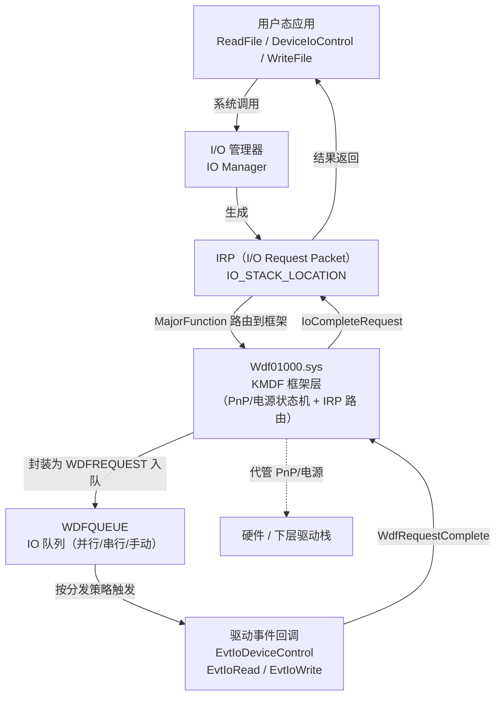
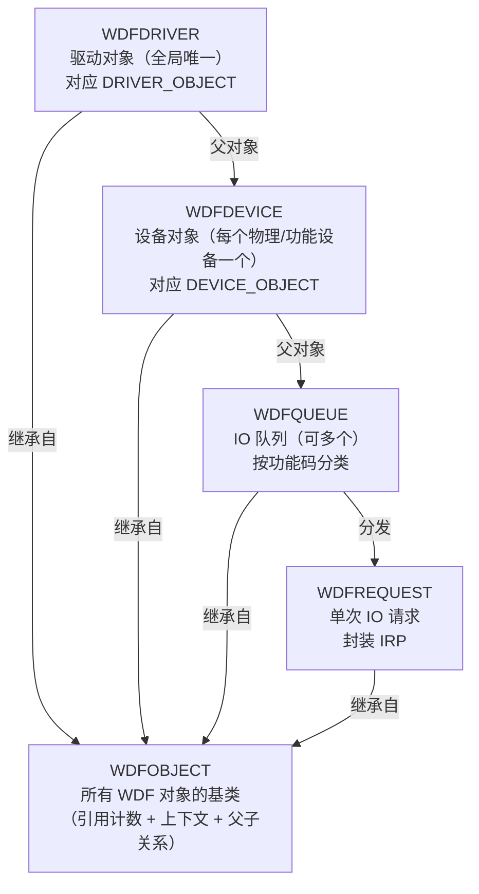

# Windows内核（04）· KMDF与WDF框架

## 概述与定位

> [!abstract] TL;DR
> **WDF（Windows Driver Frameworks）** 是微软在 WDM 之上推出的驱动开发框架，分为内核态的 **KMDF** 与用户态的 **UMDF**。KMDF 通过不透明句柄对象（`WDFDRIVER`/`WDFDEVICE`/`WDFQUEUE`/`WDFREQUEST`）和事件回调机制，将 PnP 状态机、电源管理、IRP 分发全部由框架代管，大幅减少驱动样板代码与 bug。逆向 KMDF 驱动时需认出 `Wdf01000.sys` 导入、`WdfVersionBind` 版本绑定、以及通过 `WdfFunctions` 间接表发出的函数调用——IOCTL handler 藏在 `EvtIoDeviceControl` 回调而非传统的 `MajorFunction[IRP_MJ_DEVICE_CONTROL]` 数组。

WDM（Windows Driver Model）是 Windows 2000 时代的原生驱动接口，开发者必须手动处理每一个 IRP、每一个 `IO_STACK_LOCATION`，以及复杂的 PnP/电源状态机。这套模型强大但极易写出因 IRP 完成顺序错误、引用计数失衡、取消例程缺失而导致的 BSOD/内存泄漏。

**WDF（Windows Driver Frameworks，Windows 驱动框架）** 于 Windows XP SP1 时代随 WDK 推出，目标是在 WDM 之上提供一套面向对象的框架，让驱动工程师只关注设备特定逻辑，其余"脏活"交给框架处理：

| 组件 | 运行态 | 定位 |
|---|---|---|
| **KMDF（Kernel-Mode Driver Framework）** | Ring 0 内核态 | 替代裸 WDM 的内核驱动（.sys） |
| **UMDF（User-Mode Driver Framework）** | Ring 3 用户态 | 非关键设备驱动（USB 功能设备等）以进程形式运行 |

本篇聚焦 **KMDF**，从框架架构、对象模型、入口序列，到逆向识别方法与安全分析视角展开讲解。与上一篇 [[03.WDM驱动模型与IRP]] 形成"裸 WDM vs 框架封装"的对比，与 [[14.驱动逆向实战]] 实战互补。

---

## 原理与机制

### WDF 分层架构

KMDF 并非替换 WDM，而是在 WDM 之上构建一层抽象。底层仍是 IRP 机制，但 KMDF 框架（`Wdf01000.sys`）接管了 IRP 的接收与分发，驱动只需注册回调函数。



### IRP 如何变成 WDFREQUEST

裸 WDM 驱动通过 `DRIVER_OBJECT.MajorFunction[]` 数组接收各类 IRP（共 28 项）。KMDF 在 `DriverEntry` 执行 `WdfDriverCreate` 时，框架自动为 `DRIVER_OBJECT.MajorFunction` 的所有项注册自己的内部处理例程。框架收到 IRP 后：

1. 识别 IRP 主功能码（`IRP_MJ_READ`/`IRP_MJ_WRITE`/`IRP_MJ_DEVICE_CONTROL` 等）。
2. 将 IRP 包装为 `WDFREQUEST` 句柄（驱动通过此句柄操作请求，无法直接访问底层 IRP——除非显式调用 `WdfRequestWdmGetIrp()`）。
3. 将 `WDFREQUEST` 投入对应 `WDFQUEUE`。
4. 按队列分发策略（`WdfIoQueueDispatchSequential`/`Parallel`/`Manual`）调用驱动注册的事件回调。

```
IRP → 框架内部路由 → WDFREQUEST → WDFQUEUE → EvtIoXxx 回调
```

### 队列分发策略

`WdfIoQueueCreate` 时由 `WDF_IO_QUEUE_DISPATCH_TYPE` 控制：

| 分发类型 | 常量 | 行为 |
|---|---|---|
| 串行（Sequential） | `WdfIoQueueDispatchSequential` | 前一请求完成后才分发下一个，顺序保证 |
| 并行（Parallel） | `WdfIoQueueDispatchParallel` | 请求入队即触发回调，可并发 |
| 手动（Manual） | `WdfIoQueueDispatchManual` | 驱动主动从队列取出（`WdfIoQueueRetrieveNextRequest`） |

---

## 结构详解

### WDF 对象模型

KMDF 中所有实体均是**不透明句柄（opaque handle）**，类型安全但驱动无法直接访问内部结构体字段。每种对象有自己的创建/删除 API，并支持附加**驱动私有上下文（context）**：

```
WdfObjectAllocateContext(handle, &WDF_OBJECT_ATTRIBUTES, &pContext)
```

核心对象层次：



**父子关系（Parent-Child）**：WDF 对象自动管理生命周期——子对象随父对象销毁而销毁，类似作用域析构。驱动创建对象时通过 `WDF_OBJECT_ATTRIBUTES.ParentObject` 指定父对象。

**主要对象一览：**

| 句柄类型 | 对应 WDM 概念 | 说明 |
|---|---|---|
| `WDFDRIVER` | `DRIVER_OBJECT*` | 驱动程序全局对象 |
| `WDFDEVICE` | `DEVICE_OBJECT*` | 设备对象（FDO/PDO/Filter） |
| `WDFQUEUE` | — | IO 请求队列（无 WDM 直接对应，由框架管理） |
| `WDFREQUEST` | `IRP*` + `IO_STACK_LOCATION*` | 单次 IO 请求（封装 IRP） |
| `WDFMEMORY` | `MDL*` / 缓冲区指针 | 框架管理的内存对象 |
| `WDFTIMER` | `KTIMER` + `DPC` | 内核定时器 |
| `WDFWORKITEM` | `WORK_QUEUE_ITEM` | 工作项（切换到 PASSIVE_LEVEL） |
| `WDFSPINLOCK` | `KSPIN_LOCK` | 自旋锁 |
| `WDFOBJECT` | 基础对象 | 所有 WDF 对象的公共基类 |

### 驱动入口序列

KMDF 驱动的 `DriverEntry` 比裸 WDM 简洁得多，核心调用链如下：

```c
// DriverEntry → WdfDriverCreate → EvtDriverDeviceAdd →
//   WdfDeviceCreate → WdfIoQueueCreate → 注册回调

NTSTATUS DriverEntry(
    PDRIVER_OBJECT  DriverObject,
    PUNICODE_STRING RegistryPath)
{
    WDF_DRIVER_CONFIG config;
    WDF_DRIVER_CONFIG_INIT(&config, MyEvtDriverDeviceAdd); // 注册设备添加回调

    return WdfDriverCreate(
        DriverObject,
        RegistryPath,
        WDF_NO_OBJECT_ATTRIBUTES,
        &config,
        WDF_NO_HANDLE);  // 驱动句柄（可选）
}

// PnP 枚举到设备时由框架调用
NTSTATUS MyEvtDriverDeviceAdd(
    WDFDRIVER       Driver,
    PWDFDEVICE_INIT DeviceInit)
{
    WDFDEVICE device;
    WdfDeviceCreate(&DeviceInit, WDF_NO_OBJECT_ATTRIBUTES, &device);

    // 创建 IO 队列并注册 IOCTL/Read/Write 回调
    WDF_IO_QUEUE_CONFIG queueConfig;
    WDF_IO_QUEUE_CONFIG_INIT_DEFAULT_QUEUE(
        &queueConfig,
        WdfIoQueueDispatchParallel);

    queueConfig.EvtIoDeviceControl = MyEvtIoDeviceControl;
    queueConfig.EvtIoRead          = MyEvtIoRead;
    queueConfig.EvtIoWrite         = MyEvtIoWrite;

    WDFQUEUE queue;
    WdfIoQueueCreate(device, &queueConfig,
                     WDF_NO_OBJECT_ATTRIBUTES, &queue);

    return STATUS_SUCCESS;
}

// IOCTL 处理回调（替代 IRP_MJ_DEVICE_CONTROL dispatch 例程）
VOID MyEvtIoDeviceControl(
    WDFQUEUE   Queue,
    WDFREQUEST Request,
    size_t     OutputBufferLength,
    size_t     InputBufferLength,
    ULONG      IoControlCode)
{
    PVOID buffer;
    size_t length;

    switch (IoControlCode) {
    case MY_IOCTL_CODE:
        WdfRequestRetrieveInputBuffer(Request, 0, &buffer, &length);
        // ... 处理 ...
        WdfRequestComplete(Request, STATUS_SUCCESS);
        break;
    default:
        WdfRequestComplete(Request, STATUS_INVALID_DEVICE_REQUEST);
    }
}
```

**完整入口调用序列（简化）：**

```
DriverEntry
  └─ WdfDriverCreate(DriverObject, RegistryPath, config{EvtDriverDeviceAdd})
       └─ 框架注册 DRIVER_OBJECT.MajorFunction[所有项]
EvtDriverDeviceAdd（PnP 枚举时由框架调用）
  └─ WdfDeviceCreate(DeviceInit)           → WDFDEVICE（≈ DEVICE_OBJECT）
       └─ WdfIoQueueCreate(device, config) → WDFQUEUE
            └─ 注册 EvtIoDeviceControl / EvtIoRead / EvtIoWrite
```

### WDM vs KMDF 对比

| 维度 | 裸 WDM | KMDF |
|---|---|---|
| **入口** | `DriverEntry` 手动填 `MajorFunction[]` 28 项 | `DriverEntry` 只需 `WdfDriverCreate` + `EvtDriverDeviceAdd` |
| **IRP 处理** | 手动检查 `IO_STACK_LOCATION`，手动 `IoCompleteRequest` | 框架路由到 `WDFREQUEST`，驱动调用 `WdfRequestComplete` |
| **IOCTL 处理** | `MajorFunction[IRP_MJ_DEVICE_CONTROL]` dispatch 函数 | `EvtIoDeviceControl` 回调，`IoControlCode` 直接传入 |
| **PnP 状态机** | 需手动实现 `IRP_MN_START_DEVICE`/`STOP`/`REMOVE` 等 | 框架代管，驱动注册 `EvtDevicePrepareHardware` 等可选回调 |
| **电源管理** | 手动处理 `IRP_MJ_POWER` 各子码 | 框架代管，驱动按需重写 `EvtDeviceD0Entry`/`D0Exit` |
| **同步** | 手动使用 KSPIN_LOCK / KMUTEX / 取消安全队列 | 框架对象内置同步，队列串行化内建 |
| **对象生命周期** | 手动引用计数 `ObReferenceObject`/`ObDereferenceObject` | 父子对象树自动销毁 |
| **内存传输** | 手动区分 Buffered/Direct/Neither，解析 MDL | `WdfRequestRetrieveInputBuffer`/`OutputBuffer` 抽象层 |
| **符号链接** | 手动 `IoCreateSymbolicLink` | `WdfDeviceCreateSymbolicLink` |
| **代码量** | 大量样板（典型 Hello World 驱动 ~300+ 行） | 框架代劳，驱动专注 IOCTL 逻辑 |
| **逆向难度** | 可直接找 `MajorFunction[]` 数组 | 需识别 `WdfFunctions` 间接表 + 事件回调 |

---

## 逆向实战

### 识别 KMDF 驱动：第一步看导入表

加载 `.sys` 文件到 IDA/Ghidra 后，首先检查**导入表**：

```
Imports:
  Wdf01000.sys   WdfVersionBind
  Wdf01000.sys   WdfVersionBindClass
  Wdf01000.sys   WdfVersionUnbind
  ntoskrnl.exe   ...
```

只要导入了 `Wdf01000.sys` 并且看到 `WdfVersionBind`，即可确认这是一个 **KMDF 驱动**（而非裸 WDM）。

> [!info] UMDF 驱动
> UMDF v1 运行在 `WUDFHost.exe` 宿主进程中；UMDF v2（Windows 8.1+）结构接近 KMDF，也使用 `Wdf01000.sys`，但宿主进程是用户态的 `WUDFRd.sys`（反射驱动）。

### WdfVersionBind 与 WDF_BIND_INFO

每个 KMDF 驱动在加载时通过 `WdfVersionBind` 向框架注册，绑定特定 WDF 版本：

```c
// WDF_BIND_INFO 结构（简化）
typedef struct _WDF_BIND_INFO {
    ULONG   Size;                // sizeof(WDF_BIND_INFO)
    PWCHAR  Component;           // 驱动组件名（Unicode）
    WDF_VERSION Version;         // 绑定的 WDF 版本 {Major, Minor, Build, Revision}
    ULONG   FuncCount;           // WdfFunctions 表中函数数量
    PVOID  *FuncTable;           // 指向驱动本地 WdfFunctions 数组的指针
} WDF_BIND_INFO;
```

`WdfVersionBind` 由框架（`Wdf01000.sys`）导出，驱动在 `DriverEntry` 执行前由系统自动调用（实际由 `WdfDriverCreate` 内部触发），框架检查版本兼容性后**将真实函数地址填入驱动的 `WdfFunctions` 表**——这与 ELF 的 GOT/延迟绑定思路如出一辙：表格在加载时由"链接器"（此处是 KMDF 框架）填充，驱动代码通过表格间接调用。

> [!warning] 示例输出为示意

### WdfFunctions 间接表：逆向的核心挑战

KMDF 驱动不直接调用框架 API（如 `WdfIoQueueCreate`），而是通过一个**编译期生成的间接函数表 `WdfFunctions`** 来调用。每个 WDF API 在该表中有固定索引：

```c
// 驱动本地（编译期由 WDK 头文件宏展开）
WDFFUNCENUM  WdfIoQueueCreateTableIndex     = 72;
WDFFUNCENUM  WdfRequestCompleteTableIndex   = 129;
// ...

// 宏展开后实际调用形式（示意）
WdfFunctions[WdfIoQueueCreateTableIndex](
    BindInfo,
    Device, QueueConfig, Attr, Queue);
```

因此在 IDA/Ghidra 中，你看到的 KMDF API 调用**不是**直接 `call WdfIoQueueCreate`，而是类似：

```nasm
; IDA 反编译示意（非真实地址）
mov     rax, cs:WdfFunctions        ; 全局函数表指针
mov     rcx, [rbp+BindInfo]         ; 第一参数固定是 BindInfo
; ... 其他参数 ...
call    qword ptr [rax+0x240]       ; 0x240 = 72 * 8（索引*指针大小）
```

> [!warning] 示例输出为示意

**逆向技巧：**

1. 找到驱动中的 `WdfFunctions` 全局指针（通常在 `DriverEntry` 附近被引用）。
2. 查阅 WDK 头文件（`wdffuncenum.h`）确认索引对应的 API 名称，或直接在 IDA 中为表指针定义结构体。
3. WinDbg 内核附加后可直接 `dq WdfFunctions L0x100` 查看表项——但框架填充后各项指向 `Wdf01000.sys` 内部实现，不是驱动本身。

> [!warning] 示例输出为示意

**社区 IDA 脚本**：存在开源的 KMDF 辅助脚本（如 `kmdf_helper.py`），能根据 `WDF_BIND_INFO` 中的 `FuncCount` 自动命名 `WdfFunctions` 中的每个函数指针，大幅提升逆向效率。

### 定位 EvtIoDeviceControl：IOCTL 处理入口

裸 WDM 逆向时直接找 `DriverObject->MajorFunction[0x0E]`（`IRP_MJ_DEVICE_CONTROL` = 14 = 0x0E）。KMDF 下该项被框架接管，不再有用。

正确路径：

```
1. 找 WdfIoQueueCreate 调用（通过 WdfFunctions 表偏移定位）
2. 查其第二参数 WDF_IO_QUEUE_CONFIG 结构
3. 结构偏移处即为回调函数指针：
   WDF_IO_QUEUE_CONFIG.EvtIoDeviceControl  → 目标函数地址
   WDF_IO_QUEUE_CONFIG.EvtIoRead           → Read 处理
   WDF_IO_QUEUE_CONFIG.EvtIoWrite          → Write 处理
```

`WDF_IO_QUEUE_CONFIG` 结构布局（x64，WDF 1.15，字段偏移示意）：

```
WDF_IO_QUEUE_CONFIG {
  +0x00  Size                  : ULONG
  +0x04  DispatchType          : WDF_IO_QUEUE_DISPATCH_TYPE
  +0x08  PowerManaged          : WDF_TRI_STATE
  +0x0C  AllowZeroLengthRequests : BOOLEAN
  +0x0D  DefaultQueue          : BOOLEAN
  +0x10  EvtIoDefault          : PFN_WDF_IO_QUEUE_IO_DEFAULT
  +0x18  EvtIoRead             : PFN_WDF_IO_QUEUE_IO_READ       ← Read handler
  +0x20  EvtIoWrite            : PFN_WDF_IO_QUEUE_IO_WRITE      ← Write handler
  +0x28  EvtIoDeviceControl    : PFN_WDF_IO_QUEUE_IO_DEVICE_CONTROL ← IOCTL handler
  +0x30  EvtIoInternalDeviceControl : PFN_...
  ...
}
```

> [!warning] 示例输出为示意

在 IDA 中，`WDF_IO_QUEUE_CONFIG_INIT_DEFAULT_QUEUE` 宏会初始化该结构体，初始化代码之后紧接着就是对各回调字段的赋值——这些赋值目标即为驱动的实际处理函数：

```c
// IDA 伪代码（示意）
WDF_IO_QUEUE_CONFIG_INIT_DEFAULT_QUEUE(&v_qConfig, 1 /*Parallel*/);
v_qConfig.EvtIoDeviceControl = sub_1C000_MyEvtIoDeviceControl;  // ← 找这里
v_qConfig.EvtIoRead          = sub_1C200_MyEvtIoRead;
WdfFunctions[72](pBindInfo, hDevice, &v_qConfig, NULL, &hQueue);
```

### WinDbg 下观察 KMDF 驱动

```windbg
; 列出已加载的内核模块，确认框架与驱动均已加载
lm m Wdf01000
lm m MyDriver

; 在 EvtDriverDeviceAdd 断点（驱动名需替换）
bp MyDriver!MyEvtDriverDeviceAdd

; 观察 WdfFunctions 表（框架导出，不是驱动内部符号）
; 先找驱动模块基址
!lmi MyDriver

; 内核扩展：列出 WDF 对象（需 wdfkd.dll 扩展）
!wdfkd.wdfdriverinfo MyDriver
!wdfkd.wdfdevice 0xffff...
!wdfkd.wdfqueue  0xffff...
!wdfkd.wdfrequest 0xffff...
```

> [!warning] 示例输出为示意

`wdfkd.dll` 是 WinDbg 内置的 KMDF 调试扩展，调试 KMDF 驱动崩溃时极为有用。

---

## 安全性与正确使用

### 框架代管降低 bug，但 IOCTL 仍是攻击面

KMDF 框架确实减少了大量驱动开发中的常见错误：

- **引用计数**：对象父子树自动管理生命周期，减少 UAF（Use After Free）。
- **IRP 取消安全**：框架内置取消安全队列，无需驱动自己实现 `CancelRoutine`。
- **PnP/电源序列化**：框架保证在错误时序下不触发回调，减少 BSOD。
- **IRQL 检查**：WDF 在调试版（`WdfVerifier`）下主动检查 IRQL 违例。

然而 **`EvtIoDeviceControl` 中的 IOCTL 处理逻辑仍由驱动自己实现**，这里依然是最常见的安全漏洞来源：

| 漏洞类型 | 典型成因 | 影响 |
|---|---|---|
| **缓冲区溢出** | `WdfRequestRetrieveInputBuffer` 返回后未检查 `length`，写入超界 | 内核任意写 → 权限提升 |
| **整数溢出** | `IoControlCode` 入参的长度字段未做上界校验 | 触发后续越界读/写 |
| **任意内核读** | `METHOD_NEITHER` IOCTL 直接使用用户态指针 | 读取任意内核内存 |
| **任意内核写** | IOCTL 功能允许写入任意内核地址（调试/工具驱动常见） | 内核地址篡改 → SYSTEM 权限 |
| **类型混淆** | 上下文（context）强转时未校验类型标记 | 读/写错误对象的字段 |
| **竞争条件（TOCTOU）** | `WdfRequestRetrieveInputBuffer` 获取的缓冲区未锁定，仍映射在用户态 | 内核读写间用户态修改数据 |

### Context 校验：防御视角

KMDF 的 context 机制为驱动私有状态提供了与框架对象绑定的存储空间，通过 `WdfObjectGetTypedContext` 宏检索：

```c
MY_DEVICE_CONTEXT* ctx = WdfObjectGetTypedContext(device, MY_DEVICE_CONTEXT);
```

防御要点：
- 始终使用带类型检查的 `WdfObjectGetTypedContext` 宏，而非裸指针偏移运算。
- 多个队列/多种请求类型的驱动，要确保 context 来自正确的对象类型，防止跨类型访问。
- `EvtIoDeviceControl` 入参 `IoControlCode` 在 switch 语句中务必加 `default` 分支并返回 `STATUS_INVALID_DEVICE_REQUEST`，防止未知 IOCTL 通过。

### 逆向时的安全分析要点（蓝队/漏洞研究）

分析一个未知 KMDF 驱动的安全性时，建议按以下顺序展开：

```
1. 确认 KMDF（Wdf01000.sys 导入 + WdfVersionBind）
2. 找 WdfIoQueueCreate 调用 → 提取 EvtIoDeviceControl 地址
3. 枚举 switch(IoControlCode) 的所有分支，列出 IOCTL 码表
4. 对每个 IOCTL：
   a. 确认 TransferType（METHOD_BUFFERED / IN_DIRECT / OUT_DIRECT / NEITHER）
   b. 检查输入/输出缓冲区长度校验
   c. 追踪缓冲区内容的使用路径（有无解引用用户态指针？有无越界写？）
5. 检查是否有 METHOD_NEITHER IOCTL（最危险，直接用用户态指针）
6. 检查设备访问控制：DeviceInit 中是否设置了安全描述符（限制谁能打开设备）
```

关于驱动签名与代码完整性，参见 [[12.PatchGuard与DSE与HVCI]] 的 DSE/HVCI 章节——合法 KMDF 驱动需 WHQL 或 EV 证书签名，测试时可 `bcdedit /set testsigning on`（仅自有测试环境）。

---

## 小结

| 知识点 | 要点 |
|---|---|
| WDF 定位 | WDM 之上的框架封装，KMDF=内核态，UMDF=用户态 |
| 核心对象 | `WDFDRIVER` / `WDFDEVICE` / `WDFQUEUE` / `WDFREQUEST`（均不透明句柄） |
| 入口序列 | `DriverEntry` → `WdfDriverCreate` → `EvtDriverDeviceAdd` → `WdfDeviceCreate` → `WdfIoQueueCreate` |
| 框架代管 | PnP 状态机、电源管理、IRP 分发、对象生命周期——驱动只写回调 |
| WdfFunctions 间接表 | 所有 WDF API 经此表间接调用，逆向时需按索引映射 API 名称 |
| WdfVersionBind | 版本绑定机制，类似 GOT 填充——框架在加载时填充函数表 |
| IOCTL 逆向入口 | 找 `WdfIoQueueCreate` → `WDF_IO_QUEUE_CONFIG.EvtIoDeviceControl`（而非 `MajorFunction[0x0E]`） |
| 安全攻击面 | IOCTL handler 中的长度校验、`METHOD_NEITHER` 指针、context 类型混淆 |

KMDF 使驱动开发变得更安全，但框架之外的 IOCTL 处理逻辑仍然是内核安全漏洞的高发区。理解框架的封装层次、函数表间接机制与回调注册方式，是逆向分析 KMDF 驱动、定位 IOCTL 漏洞的必备基础。下一篇将进入内核对象层：[[05.内核对象与句柄]]。

---

## 相关阅读

- [[03.WDM驱动模型与IRP]] — 裸 WDM 驱动：`DRIVER_OBJECT`/IRP/`IO_STACK_LOCATION`/IOCTL，是理解本篇"框架代管了什么"的前提
- [[14.驱动逆向实战]] — 完整分析一个 `.sys` 文件，KMDF/WDM 识别、IOCTL 枚举、IDA+WinDbg 全流程
- [[12.PatchGuard与DSE与HVCI]] — 驱动签名强制（DSE）、HVCI 对内核代码页保护——KMDF 驱动也必须遵守
- [[13.PE文件详解/00-合集总览-PE文件详解]] — `.sys` 即内核态 PE，导入表/证书表与本篇互补
- [[44.调试器原理与实战/10.WinDbg与x64dbg]] — WinDbg 内核调试与 wdfkd 扩展命令详解

---

⬅️ 上一篇 [[03.WDM驱动模型与IRP]] ｜ 🏠 [[00.Windows内核与驱动逆向总览]] ｜ 下一篇 [[05.内核对象与句柄]] ➡️
