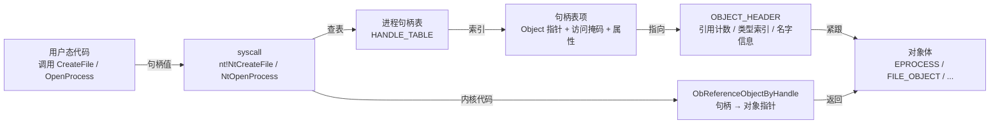

# Windows内核（05）· 内核对象与句柄

Windows 内核中几乎所有可共享的资源——进程、线程、文件、事件、互斥体、注册表键——都被抽象为**内核对象**，由**对象管理器（Object Manager，Ob）** 统一管辖。用户态程序通过**句柄（Handle）** 间接引用内核对象；内核代码则持有直接指针并维护**引用计数**。理解这套机制，是读懂进程结构（`EPROCESS`）、实施取证分析以及把握 DKOM 攻防原理的基础。

## 概述与定位

> [!abstract] TL;DR
> - **Object Manager** 维护统一命名空间（根 `\`），用 `WinObj` 工具可视化浏览。
> - 每个内核对象有类型描述符 **`OBJECT_TYPE`** 和对象头 **`OBJECT_HEADER`**（含引用计数、类型索引）。
> - **`EPROCESS`** 是进程内核对象，核心字段：`UniqueProcessId`（PID）、`ActiveProcessLinks`（全局进程双向链表）、`Token`（安全令牌）、`DirectoryTableBase`（CR3）。
> - 用户态拿到的**句柄值**是进程句柄表的索引，通过 `ObReferenceObjectByHandle` 转换为内核对象指针。
> - 引用计数归零 → 对象自动释放；`ObReferenceObject` / `ObDereferenceObject` 管理指针引用。
> - 逆向/取证视角：遍历 `ActiveProcessLinks` 列进程；交叉 `PspCidTable` 检测链表摘除（DKOM 隐藏）；`Token` 指针是提权分析的关注点。

---

## 原理与机制

### 对象管理器与命名空间

Windows 内核中的**对象管理器（Ob）** 是 Executive 层的子系统，负责：

1. **统一命名**：所有已命名内核对象都挂在根命名空间 `\` 下。典型路径：
   - `\Device\HarddiskVolume3`（磁盘卷）
   - `\KernelObjects\`（内核事件对象）
   - `\Sessions\1\BaseNamedObjects\`（用户会话命名对象）
   - `\Registry`（注册表根）
2. **类型管理**：每种对象（进程/线程/文件/事件/互斥体…）有对应 `OBJECT_TYPE` 描述符，含类型名、操作回调（`Open`/`Close`/`Delete`/`Parse` 等）、对象大小、配额信息。
3. **引用计数**：内核指针引用（`PointerCount`）+ 句柄引用（`HandleCount`），两者均归零后对象释放。
4. **访问检查**：`ObCheckObjectAccess` 按安全描述符（`SecurityDescriptor`）检查访问权限，再颁发句柄。

> `WinObj`（Sysinternals）工具可实时浏览 `\` 命名空间——展示设备对象、符号链接、目录对象，是快速探索 Object Manager 的好手。

### 句柄到对象的完整路径



核心映射关系：**句柄值（用户态数字）→ 句柄表项（内核）→ 对象头指针（偏移 −sizeof(OBJECT_HEADER)）→ 对象体**。

---

## 结构详解

### `OBJECT_HEADER`

每个内核对象的内存布局中，对象头紧在对象体之前。WinDbg `dt nt!_OBJECT_HEADER` 展示核心字段（字段偏移随版本略有差异，以下为 Win10/11 x64 典型值）：

| 偏移 | 字段 | 大小 | 说明 |
|------|------|------|------|
| `+0x000` | `PointerCount` | 8 字节 | 指针引用计数（内核代码持有） |
| `+0x008` | `HandleCount` / `NextToFree` | 8 字节（联合体） | 句柄引用计数 |
| `+0x010` | `Lock` | 8 字节 | 对象锁 |
| `+0x018` | `TypeIndex` | 1 字节 | 对象类型在 `ObTypeIndexTable` 中的索引（经编码） |
| `+0x019` | `TraceFlags` | 1 字节 | 对象跟踪标志 |
| `+0x01a` | `InfoMaskBit` / `InfoMask` | 1 字节 | 可选头掩码（指示哪些可选头存在） |
| `+0x01b` | `Flags` | 1 字节 | 对象标志（永久对象、内核对象、独占等） |
| `+0x020` | `ObjectCreateInfo` / `QuotaBlockCharged` | 8 字节（联合体） | 创建时分配信息 |
| `+0x028` | `SecurityDescriptor` | 8 字节 | 安全描述符指针（低位含 Cookie） |
| `+0x030` | `Body` | — | 对象体起始（`EPROCESS`/`FILE_OBJECT`/…） |

**可选头（Optional Headers）**：`OBJECT_HEADER_NAME_INFO`（含对象名字符串，已命名对象才有）、`OBJECT_HEADER_CREATOR_INFO`、`OBJECT_HEADER_QUOTA_INFO` 等，由 `InfoMask` 指示是否存在，位于 `OBJECT_HEADER` 之前（负偏移）。

> `ObpGetObjectType(obj)` 通过 `TypeIndex ^ 编码` 还原类型指针，`TypeIndex` 本身经过 XOR 混淆（Win8.1+ 引入），逆向时需注意。

### `OBJECT_TYPE`

`OBJECT_TYPE` 描述一类对象的公共属性，关键字段：

| 字段 | 说明 |
|------|------|
| `Name` | 类型名（如 `Process`、`Thread`、`File`、`Event`、`Key`） |
| `TotalNumberOfObjects` | 当前存活对象数 |
| `TypeInfo.ValidAccessMask` | 该类对象的合法访问掩码 |
| `TypeInfo.OpenProcedure / DeleteProcedure / SecurityProcedure` | 类型操作回调 |
| `TypeInfo.DefaultNonPagedPoolCharge` | 默认非分页池收费 |

内核维护 `nt!ObTypeIndexTable[]` 数组，索引即 `TypeIndex` 解码后的值（`0` 保留，实际类型从 `2` 开始）。

### `EPROCESS`——进程内核对象

`EPROCESS` 是 Executive 进程对象（`OBJECT_TYPE` 名为 `Process`），同时包含 `KPROCESS`（调度器视角）。使用 `dt nt!_EPROCESS` 查看完整字段；以下列出逆向/取证最常用的字段：

| 字段 | 典型偏移（x64 Win11） | 类型 | 说明 |
|------|----------------------|------|------|
| `Pcb` | `+0x000` | `KPROCESS` | 调度器进程块（含 `DirectoryTableBase`） |
| `UniqueProcessId` | `+0x440` | `PVOID`（实为 `HANDLE`） | **PID**，取证首查 |
| `ActiveProcessLinks` | `+0x448` | `LIST_ENTRY` | **全局进程双向链表**，`DKOM` 摘链点 |
| `Token` | `+0x4b8` | `EX_FAST_REF` | **安全令牌指针**（低3位存引用计数），提权分析关注点 |
| `ImageFileName` | `+0x5a8` | `CHAR[15]` | 进程映像名（截断到15字节） |
| `Peb` | `+0x550` | `PPEB` | 指向用户态进程环境块 |
| `VadRoot` | `+0x7d8` | `RTL_AVL_TREE` | 虚拟地址描述符（VAD）树根，描述用户地址空间布局 |
| `HandleTable` | `+0x570` | `PHANDLE_TABLE` | 本进程句柄表 |
| `SectionBaseAddress` | `+0x520` | `PVOID` | 可执行映像基址（PE 加载基址） |

`DirectoryTableBase`（CR3，页表基址）在 `KPROCESS.DirectoryTableBase`（即 `EPROCESS+0x028`），是内存取证中按进程切换 CR3 读取用户地址的依据。

> [!note] 字段偏移随 Windows 版本变化
> 上表偏移为 Windows 11 x64 典型值，**不同补丁级别可能相差数十字节**。逆向/取证脚本应通过 `dt` 命令或调试符号动态获取偏移，不要硬编码。

### `ETHREAD` / `KTHREAD`——线程内核对象

`ETHREAD` 是 Executive 线程对象（`OBJECT_TYPE` 名为 `Thread`），包含 `KTHREAD`（调度块）。关键字段：

| 字段 | 说明 |
|------|------|
| `Tcb`（`KTHREAD`） | 线程调度块，含 `StackBase`/`StackLimit`、`TrapFrame` 等 |
| `Cid`（`CLIENT_ID`） | 包含 `UniqueProcess`（父 PID）和 `UniqueThread`（TID） |
| `StartAddress` | 线程用户态起始地址（`CreateThread` 的 `lpStartAddress`） |
| `Win32StartAddress` | Win32 层线程起始地址（与 `StartAddress` 可能不同） |
| `ThreadListEntry` | 挂入 `EPROCESS.ThreadListHead` 的链表节点 |
| `Process` | 指向所属 `EPROCESS` |

### 句柄表（`HANDLE_TABLE`）

每个进程有独立句柄表（`EPROCESS.HandleTable` → `HANDLE_TABLE`），将**句柄值（用户态整数，4 的倍数）** 映射到**句柄表项（`HANDLE_TABLE_ENTRY`）**：

```
HANDLE_TABLE_ENTRY（16 字节，x64）：
  [0x00]  低位指向 OBJECT_HEADER 的编码指针（含 RefBits 低3位）
  [0x08]  GrantedAccessBits（实际授予的访问掩码，低位编码属性）
```

- 句柄表采用**多级页表式结构**（0级：直接数组；1级：指针数组；2级：二重指针数组），支持大量句柄。
- **系统全局句柄表** `PspCidTable`（`nt!PspCidTable`）以 PID/TID 为键存储所有进程/线程对象，是检测 DKOM 摘链的交叉视图来源。
- `ObReferenceObjectByHandle(Handle, DesiredAccess, ObjectType, AccessMode, &Object, &HandleInfo)` 是内核标准 API：由句柄值查句柄表 → 校验访问掩码 → 返回对象指针并递增引用计数。

**`!handle` 命令**（WinDbg）列出当前（或指定）进程的全部句柄；`!handle <值> 0xf` 展开单个句柄详情。

### 引用计数

对象头的两个计数器协同工作：

| 计数器 | 修改 API | 含义 |
|--------|----------|------|
| `PointerCount` | `ObReferenceObject` / `ObDereferenceObject` | 内核代码持有的指针引用 |
| `HandleCount` | `ObReferenceObjectByHandle` / `NtClose` 路径 | 用户态（及部分内核）句柄 |

- 句柄关闭时 `HandleCount--` → 若降为 0，同时 `PointerCount--`。
- `PointerCount` 降为 0 时，对象管理器调用类型的 `DeleteProcedure` 回调，然后释放内存。
- 驱动获取对象指针后**必须配对调用** `ObDereferenceObject`，否则对象内存永久泄漏（内核内存泄漏难以诊断）。

---

## 逆向 / 取证实战

### 用 `dt` 查看 `EPROCESS`

内核调试会话中（本地 KD 或双机 KD），`dt` 是探查结构体的首要工具：

```
kd> dt nt!_EPROCESS
   +0x000 Pcb              : _KPROCESS
   +0x438 ProcessLock      : _EX_PUSH_LOCK
   +0x440 UniqueProcessId  : Ptr64 Void
   +0x448 ActiveProcessLinks : _LIST_ENTRY
   ...
   +0x4b8 Token            : _EX_FAST_REF
   +0x520 SectionBaseAddress : Ptr64 Void
   +0x550 Peb              : Ptr64 _PEB
   +0x570 ObjectTable      : Ptr64 _HANDLE_TABLE
   +0x5a8 ImageFileName    : [15] UChar
   +0x7d8 VadRoot          : _RTL_AVL_TREE
   ...
```

> [!warning] 示例输出为示意
> 上方 `dt` 输出为代表性示意，真实字段偏移随 Windows 版本与补丁级别浮动，请以你实际调试环境的符号为准。

查看特定进程 `EPROCESS`（先用 `!process 0 0` 找到地址）：

```
kd> !process 0 0
PROCESS ffffdb8e`12345678  SessionId: 1  Cid: 0c84    ...  notepad.exe

kd> dt nt!_EPROCESS ffffdb8e`12345678
   +0x000 Pcb              : _KPROCESS
   +0x440 UniqueProcessId  : 0x00000000`00000c84
   +0x448 ActiveProcessLinks : [ 0xffffdb8e`23456798 - 0xffffdb8e`01234568 ]
   +0x4b8 Token            : _EX_FAST_REF (Token=0xffffc48a`56789001)
   +0x5a8 ImageFileName    : "notepad.exe"
```

> [!warning] 示例输出为示意
> 地址（`ffffdb8e...`）与字段值均为示例，实际环境数值各不相同。

读取 `Token` 字段（`EX_FAST_REF` 低3位为 RefBits，需掩掉才是真正的 `TOKEN` 指针）：

```
kd> dt nt!_EX_FAST_REF ffffdb8e`12345678+4b8
   +0x000 Object    : 0xffffc48a`56789001 Void
   +0x000 RefCnt    : 0y001   ← 低3位
   +0x000 Value     : 0xffffc48a`56789001

; 得到真实 Token 指针（屏蔽低3位）：
kd> ? ffffc48a`56789001 & ~7
Evaluate expression: -64927792070656 = ffffc48a`56789000
kd> dt nt!_TOKEN ffffc48a`56789000
```

> [!warning] 示例输出为示意

### 遍历 `ActiveProcessLinks` 枚举进程

`ActiveProcessLinks` 是双向链表 `LIST_ENTRY`，将系统中所有 `EPROCESS` 串联。链表头为 `nt!PsActiveProcessHead`。

```
kd> x nt!PsActiveProcessHead
fffff800`12ab3400 nt!PsActiveProcessHead = _LIST_ENTRY [ 0xffffdb8e`... - ... ]

kd> dl ffffdb8e`12345448 0n20 8     ; 从 ActiveProcessLinks 起始遍历，最多 20 项，指针宽 8
ffffdb8e`12345448  ffffdb8e`23456848  ffffdb8e`01234848
ffffdb8e`23456848  ...
```

`ActiveProcessLinks` 偏移（此例为 `+0x448`），用 `CONTAINING_RECORD` 逻辑回退到 `EPROCESS` 起始：`EPROCESS = ActiveProcessLinks地址 − 0x448`。

WinDbg 脚本化遍历（伪代码，说明逻辑）：

```
; 设 ListHead = nt!PsActiveProcessHead 地址
; 设 APLINKS_OFFSET = 0x448（由 dt 获取）
; 遍历：
;   curr = *ListHead.Flink
;   while curr != ListHead:
;     eproc = curr - APLINKS_OFFSET
;     读 UniqueProcessId @ eproc+0x440
;     读 ImageFileName  @ eproc+0x5a8
;     curr = *curr.Flink
```

实际操作常借助 WinDbg `!process 0 0`（底层即遍历该链表）或 Volatility/WinPmem 等取证框架。

### 通过 `PspCidTable` 查单个进程/线程对象

`nt!PspCidTable` 是全局的 `HANDLE_TABLE`，以 PID/TID（以 4 为步长的句柄值）为键存储所有进程/线程的内核对象指针，不依赖 `ActiveProcessLinks`。取证框架通过比对两个来源来检测隐藏进程（见下节）。

```
kd> ? nt!PspCidTable
Evaluate expression = fffff800`12cd5ef0

kd> dt nt!_HANDLE_TABLE poi(fffff800`12cd5ef0)
```

> [!warning] 示例输出为示意

---

## 安全性与正确使用

### DKOM 进程隐藏与检测（防御视角）

**Direct Kernel Object Manipulation（DKOM）** 是 Rootkit 的经典技术：将目标进程的 `EPROCESS.ActiveProcessLinks` 从链表中摘除（前驱的 `Flink` 指向后继，后继的 `Blink` 指向前驱，绕过目标），使 `!process 0 0`、任务管理器等依赖链表遍历的工具看不到该进程。

```
正常链表：A ↔ B（目标）↔ C
DKOM 后：A ↔ C（B 的节点被摘除，但 EPROCESS 内存仍存在）
```

**蓝队检测方法**（交叉视图法）：

| 检测来源 | 说明 |
|----------|------|
| `ActiveProcessLinks` 遍历 | 标准列进程链表（可被 DKOM 欺骗） |
| `PspCidTable` 扫描 | 通过 PID 句柄表枚举所有 `EPROCESS`/`ETHREAD`（DKOM 无法影响） |
| 线程扫描 `ETHREAD.Process` | 存活线程指向其 `EPROCESS`，即便进程摘链，线程仍保留反向指针 |
| 句柄表遍历 | 系统中打开了目标进程句柄的其他进程，其句柄表中仍有对应条目 |
| 池扫描（Pool Tag Scan） | 扫描非分页池中 `Proc` 标记的块，找到仍分配的 `EPROCESS` 内存 |

取证框架（Volatility、Rekall）正是同时运行多种视图并差集比对，输出"只在某些视图可见而不在链表中的进程"来定位隐藏进程。

> **合规边界**：本节描述 DKOM 机制是为了理解**检测方法**和分析恶意驱动样本，不提供可落地的进程隐藏驱动实现。对自有测试环境的研究请在隔离虚拟机中进行。

### `Token` 指针的敏感性

`EPROCESS.Token` 直接指向进程的安全令牌（`TOKEN` 对象）。令牌中记录用户 SID、权限列表（`Privileges`）、完整性级别等，是 Windows 访问控制的核心依据。

- **取证视角**：比对目标进程的 `Token` 是否与 `System`（PID 4）进程的 `Token` 相同或被替换，是检测"Token 窃取式提权"的关键方法（对应系列第 [[13.内核漏洞与利用基础]] 章的讨论）。
- **蓝队检测**：EDR 可通过 `ObRegisterCallbacks`（`ObjectType = *PsProcessType`，操作类型 `OB_OPERATION_HANDLE_CREATE`）监控进程句柄的 `PROCESS_VM_WRITE` / `PROCESS_VM_READ` 请求，检测可疑进程尝试读取其他进程内存（Token 改写的前提）。
- **驱动正确使用**：内核驱动若需临时切换安全上下文，应使用 `PsImpersonateClient` / `SeImpersonateClient` 等公开 API，不要直接改写 `Token` 指针——手动改写会破坏引用计数（`EX_FAST_REF` 管理），且在 **PatchGuard** 保护的关键结构范围内可能触发 `CRITICAL_STRUCTURE_CORRUPTION` BSOD（[[12.PatchGuard与DSE与HVCI]]）。

### 内核驱动的引用计数规范

引用计数是内核对象生命周期的根本，驱动开发最常见的稳定性问题之一是引用计数不平衡：

| 错误场景 | 后果 |
|----------|------|
| `ObReferenceObjectByHandle` 成功后未调用 `ObDereferenceObject` | 对象永不释放（内核内存泄漏，`!poolused` 可排查） |
| `ObDereferenceObject` 调用次数超过引用次数 | 引用计数下溢 → `PointerCount` 归零 → 提前释放 → UAF / BSOD |
| 在 `EvtDriverUnload` / `DriverUnload` 后仍持有对象指针 | 驱动卸载后对象可能已释放，访问野指针 |

正确模式：

```c
PEPROCESS pProcess = NULL;
NTSTATUS status = ObReferenceObjectByHandle(
    hProcess,
    PROCESS_QUERY_INFORMATION,
    *PsProcessType,
    KernelMode,
    (PVOID*)&pProcess,
    NULL
);
if (NT_SUCCESS(status)) {
    // ... 使用 pProcess ...
    ObDereferenceObject(pProcess);   // 必须配对
}
```

---

## 小结

| 概念 | 核心要点 |
|------|----------|
| Object Manager | 统一命名空间 `\`，管理类型（`OBJECT_TYPE`）与生命周期 |
| `OBJECT_HEADER` | 紧在对象体之前；含 `PointerCount`/`HandleCount`/`TypeIndex` |
| `EPROCESS` | 进程对象；`UniqueProcessId`（PID）、`ActiveProcessLinks`（全局链表）、`Token`（令牌）、`DirectoryTableBase`（CR3）是取证四要素 |
| `ETHREAD` | 线程对象；`Cid` 含 PID+TID，`StartAddress` 是线程起点 |
| 句柄表 | 用户态句柄值 → 句柄表项 → 内核对象指针；`ObReferenceObjectByHandle` 跨越边界 |
| 引用计数 | `ObReferenceObject` / `ObDereferenceObject` 必须配对；归零自动释放 |
| DKOM 检测 | 交叉 `ActiveProcessLinks` + `PspCidTable` + 线程反向指针，差集即隐藏对象 |
| `Token` | `EX_FAST_REF`（低3位为 RefBits），提权分析与 EDR 监控的重点 |

对象管理器是 Windows 内核资源管理的地基：下一章的内核内存管理（[[06.内核内存管理]]）讲对象如何从分页/非分页池分配；第 [[07.WinDbg内核调试]] 章将系统地应用 `dt`/`!process`/`!handle` 把本章知识落到实处；第 [[11.Rootkit原理与检测]] 章深入 DKOM 隐藏进程的检测全流程。

---

## 相关阅读

- [[07.WinDbg内核调试]] — 系统性使用 `dt nt!_EPROCESS`、`!handle`、`!process` 验证本章结构体
- [[11.Rootkit原理与检测]] — DKOM 摘链原理与交叉视图检测（防御，含合规边界）
- [[44.调试器原理与实战/10.WinDbg与x64dbg.md]] — WinDbg 操作手册与 x64dbg 对比
- [[06.内核内存管理]] — 分页/非分页池、`ExAllocatePoolWithTag`、内核对象的内存来源
- [[13.内核漏洞与利用基础]] — Token 窃取概念、SMEP/kCFG/KASLR（研究/防御视角）
- [[12.PatchGuard与DSE与HVCI]] — PatchGuard 对关键内核结构的保护机制

---

⬅️ 上一篇 [[04.KMDF与WDF框架]] ｜ 🏠 [[00.Windows内核与驱动逆向总览]] ｜ 下一篇 [[06.内核内存管理]] ➡️
