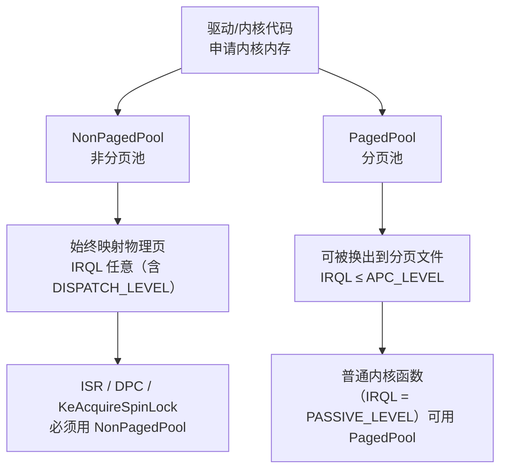
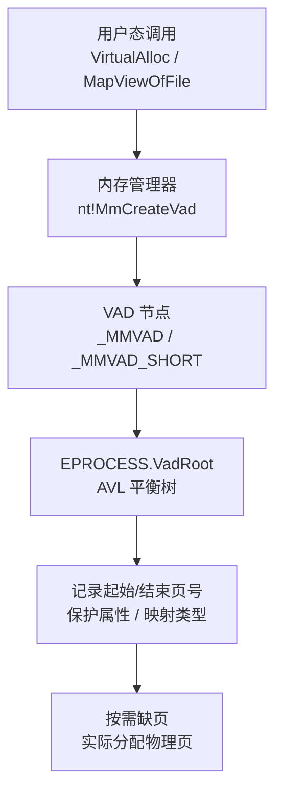

# Windows内核（06）· 内核内存管理

内核内存管理是驱动开发与内核逆向的基础语言——每个驱动都要从内核池申请内存、用 MDL 穿透用户/内核边界传递数据缓冲、通过 VAD 树理解进程地址空间。本篇从地址空间分区出发，逐层深入内核池、MDL、VAD，最终落到调试命令与安全边界。

## 概述与定位

> [!abstract] TL;DR
> - **地址空间**：x64 Windows 用户态占低 128 TB（`0x0000_0000_0000_0000`–`0x0000_7FFF_FFFF_FFFF`），内核态（高半区）占 `0xFFFF_8000_0000_0000` 以上，所有进程共享同一份内核映射。
> - **内核池**：`NonPagedPool`（非分页，始终在物理内存，可在任意 IRQL 访问）vs `PagedPool`（可换出，只能在 `IRQL <= APC_LEVEL` 访问）。分配函数 `ExAllocatePoolWithTag` / 现代 `ExAllocatePool2`，**4 字节池标记 Tag** 是排查泄漏的关键。
> - **MDL**：`Memory Descriptor List` 描述一段虚拟内存对应的物理页列表，DMA/直接 I/O（`METHOD_IN/OUT_DIRECT`）必用。
> - **VAD**：每进程维护一棵平衡树，记录用户态虚拟地址区域（保留/提交/映射），是取证注入检测的重要数据源。
> - **逆向视角**：`!pool`、`!poolused`、`dt nt!_POOL_HEADER` 三条命令覆盖 80% 内核内存调试场景。

---

## 原理与机制

### 内核地址空间分区

x64 Windows 采用 48 位有效虚拟地址（`CanonicalAddress`），规范地址分两段：低半区为用户态、高半区为内核态。

```
用户态（Ring 3）
  0x0000_0000_0000_0000
  ─────────────────────── ← 用户/内核分界（128 TB 用户上限）
  0x0000_7FFF_FFFF_FFFF

  （规范空洞，非可寻址）

内核态（Ring 0）
  0xFFFF_8000_0000_0000  ← 内核空间起始
  ...
  0xFFFF_8000_0000_0000 ~ 0xFFFF_FFFF_FFFF_FFFF
```

内核态关键区域（概念分区，具体地址因版本/KASLR 而变）：

| 区域 | 用途 |
|------|------|
| 系统 PTE 区（System PTE） | 内核驱动映射、MDL 系统地址 |
| 非分页池（NonPagedPool） | 始终驻留物理内存的内核分配 |
| 分页池（PagedPool） | 可换出的内核分配 |
| HAL 映射区 | HAL 设备映射 |
| 会话空间（Session Space） | 每登录会话独立的内核数据（win32k.sys、驱动会话数据） |
| 内核代码/数据（ntoskrnl） | 内核可执行映像与静态数据 |

> [!note]
> x64 Windows 10 19H1+ 引入了"大型系统空间"（Large System PTE Space），非分页池和分页池的理论上限大幅提升（数百 GB 量级），实际受物理内存约束。

所有进程共享同一份内核映射（`cr3` 的高半区 PML4 条目相同），因此内核内存在任何进程上下文都可访问，用户态地址则随进程切换而切换。

### 池类型与 IRQL 约束



**IRQL（Interrupt Request Level）** 是 Windows 内核的中断优先级机制：
- `PASSIVE_LEVEL (0)` — 普通内核/用户代码
- `APC_LEVEL (1)` — APC 传递层
- `DISPATCH_LEVEL (2)` — DPC 与调度层（此处不能缺页）
- `DIRQL (3+)` — 硬件中断

在 `DISPATCH_LEVEL` 及以上，内存管理器**不允许缺页中断**（会导致 BSOD `IRQL_NOT_LESS_OR_EQUAL`）。因此：
- 在中断服务例程、DPC、持有自旋锁期间，**只能访问 NonPagedPool**；
- `PagedPool` 仅在 `IRQL ≤ APC_LEVEL` 时安全。

---

## 结构详解

### NonPagedPool 与 PagedPool

两类池的对比：

| 属性 | NonPagedPool | PagedPool |
|------|-------------|-----------|
| 物理内存 | 始终驻留（不可换出） | 可换出到分页文件 |
| 最高安全 IRQL | 无上限（任意 IRQL） | APC_LEVEL (1) |
| 消耗物理内存 | 是（占用紧缺资源） | 否（压力大时可换出） |
| 典型用途 | 锁、DPC 数据、ISR 上下文、中断表 | 驱动对象、注册表数据、文件名缓冲 |
| 错误后果（IRQL 误用） | 无 | IRQL_NOT_LESS_OR_EQUAL BSOD |

> [!warning]
> 能用 `PagedPool` 的地方**不要用** `NonPagedPool`——非分页池是全系统共享的紧缺资源，过度使用会挤压其他驱动，导致系统不稳定。

### ExAllocatePoolWithTag 与 Tag

**`ExAllocatePoolWithTag`** 是内核分配内存的标准接口：

```c
PVOID ExAllocatePoolWithTag(
    POOL_TYPE PoolType,   // NonPagedPool / PagedPool / ...
    SIZE_T    NumberOfBytes,
    ULONG     Tag         // 4 字节池标记，常用 ASCII 拼写
);
```

对应释放函数：

```c
void ExFreePoolWithTag(
    PVOID P,
    ULONG Tag
);
```

**池标记 Tag** 是 4 字节整数，通常用四个 ASCII 字符拼写（内存中以小端序存储，调试时显示反向）：

```c
// 驱动中典型用法
#define MY_TAG 'DrvM'   // 反向显示为 'MrvD'

PVOID buf = ExAllocatePoolWithTag(NonPagedPool, 256, MY_TAG);
if (!buf) {
    return STATUS_INSUFFICIENT_RESOURCES;
}
// ... 使用 buf ...
ExFreePoolWithTag(buf, MY_TAG);
```

**现代替代：`ExAllocatePool2`**（Windows 10 2004+，取代了已废弃的 `ExAllocatePoolWithTag`）：

```c
PVOID ExAllocatePool2(
    POOL_FLAGS Flags,       // POOL_FLAG_NON_PAGED / POOL_FLAG_PAGED / ...
    SIZE_T     NumberOfBytes,
    ULONG      Tag
);
```

`ExAllocatePool2` 强制零初始化分配的内存，消除了未初始化内存信息泄漏风险，是新驱动的推荐做法。

### POOL_HEADER 结构

每个池分配块的头部是 `_POOL_HEADER`，描述该块的大小、类型和 Tag：

```
+--------------------+  ←── POOL_HEADER（前 16 字节）
|  PreviousSize: 8   |  前一块大小（池内部链接用）
|  PoolIndex: 8      |  池类型索引
|  BlockSize: 8      |  本块大小（以池粒度计）
|  PoolType: 8       |  NonPaged/Paged 等
|  Tag: 32           |  4 字节池标记
|  ProcessBilled: 32 |  计费进程（可选）
+--------------------+
|   调用者数据...    |  ←── ExAllocatePoolWithTag 返回的指针指这里
+--------------------+
```

WinDbg 查看结构定义：

```windbg
dt nt!_POOL_HEADER
```

> [!warning] 示例输出为示意
> ```
> nt!_POOL_HEADER
>    +0x000 PreviousSize     : Pos 0, 8 Bits
>    +0x000 PoolIndex        : Pos 8, 8 Bits
>    +0x000 BlockSize        : Pos 16, 8 Bits
>    +0x000 PoolType         : Pos 24, 8 Bits
>    +0x000 Ulong1           : Uint4B
>    +0x004 Tag              : Uint4B   ← 4 字节 ASCII 标记
>    +0x008 ProcessBilled    : Ptr64 _EPROCESS
>    +0x008 AllocatorBackTraceIndex : Uint2B
>    +0x00a PoolTagHash      : Uint2B
> ```

在 Windows 10 x64 中，内核使用了分段的池结构（`POOL_LARGE_SESSION_SPACE` / `POOL_SMALL_SESSION_SPACE`），并在 RS5+ 引入了安全非分页池（`NonPagedPoolNx`），取消了非分页池页面的执行权限（W^X）。

### MDL（Memory Descriptor List）

**MDL** 是内核描述一段虚拟内存与其对应物理页的数据结构，DMA 传输和直接 I/O 的核心。

#### 为什么需要 MDL

用户态缓冲区的虚拟地址是进程相关的，DMA 控制器或高 IRQL 代码无法直接使用（进程可能已切换、页面可能被换出）。MDL 锁定物理页并提供内核态访问地址，解决这个问题。

#### MDL 生命周期


关键 API：

```c
// 1. 分配 MDL，关联 UserBuffer 的 Length 字节
PMDL mdl = IoAllocateMdl(
    UserBuffer,   // 虚拟地址（用户或内核）
    Length,       // 字节数
    FALSE,        // 非次级 MDL
    FALSE,        // 不计费
    NULL          // 不关联 IRP（单独使用时）
);

// 2. 探测并锁定物理页（在 PASSIVE_LEVEL 调用，用户缓冲用 IoReadAccess/IoWriteAccess）
MmProbeAndLockPages(mdl, KernelMode, IoWriteAccess);

// 3. 获取内核系统地址（可在任意 IRQL 访问）
PVOID sysAddr = MmGetSystemAddressForMdlSafe(mdl, NormalPagePriority);

// 4. 操作完成后解锁与释放
MmUnlockPages(mdl);
IoFreeMdl(mdl);
```

#### MDL 与 IRP 传输方式

驱动在 `IoCreateDevice` 时通过 `DO_BUFFERED_IO` / `DO_DIRECT_IO` 标志指定传输方式：

| 传输方式 | IOCTL Method | 内核访问方式 |
|---------|-------------|-------------|
| METHOD_BUFFERED | 0 | 系统缓冲区（内核复制一份） |
| METHOD_IN_DIRECT | 1 | 使用 MDL 锁定输入缓冲物理页 |
| METHOD_OUT_DIRECT | 2 | 使用 MDL 锁定输出缓冲物理页 |
| METHOD_NEITHER | 3 | 直接传裸指针（驱动自行探测，危险） |

`METHOD_IN_DIRECT` / `METHOD_OUT_DIRECT` 时，I/O 管理器自动在 `IRP` 的 `MdlAddress` 字段填入已锁页的 MDL，驱动直接调用 `MmGetSystemAddressForMdlSafe` 取系统地址即可。

#### MDL 结构布局（简化）

```
struct _MDL {
    PMDL       Next;             // 链接下一个 MDL（MDL 链）
    SHORT      Size;             // MDL 本身大小（含后续 PFN 数组）
    SHORT      MdlFlags;         // 标志：已锁/已映射等
    PEPROCESS  Process;          // 关联进程
    PVOID      MappedSystemVa;   // 系统地址（MmGetSystemAddressForMdlSafe 填入）
    PVOID      StartVa;          // 原始虚拟地址（页对齐）
    ULONG      ByteCount;        // 字节数
    ULONG      ByteOffset;       // 页内偏移
    // 紧跟其后：PFN（Physical Frame Number）数组，每个描述一个物理页
};
```

WinDbg 查看某 IRP 的 MDL：

```windbg
dt nt!_MDL <mdl_addr>
!mdl <mdl_addr>
```

> [!warning] 示例输出为示意

### VAD（Virtual Address Descriptor）树

**VAD** 是每个进程维护的自平衡二叉树（AVL 树），描述用户态虚拟地址空间的所有区域。操作系统通过 VAD 跟踪每个 `VirtualAlloc`/`MapViewOfFile`/`NtMapViewOfSection` 创建的区域。

#### VAD 与用户态内存管理的关系



EPROCESS 中的 VAD 根：

```c
// EPROCESS 相关字段（概念示意）
typedef struct _EPROCESS {
    // ...
    struct _RTL_AVL_TREE VadRoot;   // VAD AVL 树根
    PVOID VadHint;                  // 最近访问节点缓存
    ULONG VadCount;                 // 节点总数
    // ...
} EPROCESS;
```

#### VAD 节点类型

| 类型 | 描述 |
|------|------|
| `_MMVAD_SHORT` | 基础节点：起始/结束虚拟页号、标志（保护/类型） |
| `_MMVAD` | 扩展节点：额外保存文件/节对象指针、子系统标志 |
| `_MMVAD_LONG` | 更大的扩展节点，含 `Banked` 等特殊区域信息 |

WinDbg 查看进程 VAD：

```windbg
!vad <process_obj_addr>
!vad <process_obj_addr> 1    ← 显示详细标志
```

> [!warning] 示例输出为示意
> ```
> VAD level     start       end commit
> Vad      1 7ff6b0000 7ff6b0fff      1 Private      READONLY
> Vad      2 7ff6b1000 7ff6b1fff      1 Mapped  Exe  EXECUTE_WRITECOPY
> Vad      3 7ff6b2000 7ff6b3fff      2 Mapped       READONLY
> ...
> Total VADs: 52, average level: 6, maximum depth: 12
> ```

#### VAD 在取证中的意义

取证分析注入检测时，扫描进程 VAD 树可发现：
- 匿名的 `MEM_COMMIT` 区域（`VadType == VadNone`）中有可执行权限——典型的 shellcode 注入特征；
- 已映射的 PE 文件（`VadType == VadImageMap`）与磁盘文件哈希不符——代码注入或模块欺骗；
- 孤立的可执行私有内存（没有对应文件支撑）——进程镂空（Process Hollowing）。

这也是 EDR/内存取证工具（Volatility 的 `vadinfo`/`malfind` 插件）的核心扫描路径。

### 会话空间、系统 PTE 与大页

**会话空间（Session Space）**：每个登录会话有一块独立的内核映射区域，存放 `win32k.sys`、会话级别的驱动数据等，实现不同会话的内核数据隔离。

**系统 PTE（Page Table Entry）区**：内核保留的页表条目池，用于驱动映射 MDL 系统地址、`MmMapIoSpace` 设备寄存器映射等。系统 PTE 资源不足时，`MmGetSystemAddressForMdlSafe` 会返回 `NULL`（应判断！）。

**大页（Large Pages）**：Windows 内核支持 2 MB 大页，减少 TLB 压力（`MmAllocateContiguousMemorySpecifyCache` + `LARGE_PAGES`）。某些驱动的 DMA 路径使用大页连续物理内存。

---

## 调试实战

### !pool — 查询单个地址所属池块

```windbg
!pool <地址>
```

> [!warning] 示例输出为示意
> ```
> kd> !pool ffff8a0012345678
> Pool page ffff8a0012345678 region is Nonpaged pool
> *ffff8a0012345660 size:   40 previous size:    0  (Allocated)  DrvM
>  ffff8a00123456a0 size:   80 previous size:   40  (Free)       ....
> ```
>
> - `Allocated` 表示已分配块，`Free` 表示空闲；
> - `DrvM` 是 Tag（小端序显示，原始设置为 `'MrvD'`）；
> - `size` 单位是池粒度（通常 16 字节），实际字节 = size × 0x10 - sizeof(POOL_HEADER)。

### !poolused — 统计各 Tag 池使用量

```windbg
!poolused
!poolused 4    ← 按分配大小降序排列
```

> [!warning] 示例输出为示意
> ```
> kd> !poolused
>  Sorting by Tag
>
>  Tag      NonPaged    Paged
>  CM25       16384        0  Configuration Manager: ...
>  DrvM      262144        0  MyDriver allocation
>  File       49152    32768  File objects
>  ...
> ```
>
> 用于定位内核内存泄漏：若某 Tag 的 `NonPaged` 计数持续增长而从不下降，驱动可能存在分配未释放的 Bug。

### dt nt!_POOL_HEADER — 剖析池头

```windbg
dt nt!_POOL_HEADER <地址 - 0x10>   ← 从返回指针回退 16 字节到 POOL_HEADER
```

> [!warning] 示例输出为示意

### 看驱动用哪类池

在 IDA/Ghidra 逆向时，搜索 `ExAllocatePoolWithTag` 调用，看第一个参数：
- `0` = `NonPagedPool`（旧常量）；`1` = `PagedPool`
- `512 (0x200)` = `NonPagedPoolNx`（新式不可执行非分页池，推荐）

观察 Tag（第三参数）可辅助识别驱动功能模块（许多驱动用驱动名缩写作 Tag）。

---

## 安全性与正确使用

### 池溢出与 UAF

内核池的漏洞类型与用户态堆高度相似（参见 [[13.内核漏洞与利用基础]]）：

**池溢出（Pool Overflow）**：向池块写入超出分配大小的数据，覆盖相邻块的 `POOL_HEADER` 或数据。攻击者可借此：
- 破坏相邻的函数指针/回调指针，劫持控制流；
- 覆盖相邻对象的关键字段（如 `TOKEN` 指针）。

**UAF（Use-After-Free）**：`ExFreePoolWithTag` 后继续读写该指针。内核 UAF 的危险性高于用户态——内核数据无用户态隔离，且 ASLR 效果弱于用户态 KASLR。

> [!caution] 合规边界
> 以上描述为**防御与分析视角**，帮助理解缓解机制和检测思路。**本篇不提供针对真实系统的池漏洞利用链或完整武器化步骤**。完整的内核漏洞利用分析见 [[13.内核漏洞与利用基础]]（研究/防御）。

### 池风水（Pool Grooming）

池风水是内核堆利用的预备步骤：攻击者提前大量分配/释放特定大小的对象，使目标池块落在预期的相邻位置，之后用漏洞覆盖邻居对象。防御视角：

- **隔离分配器（Segment Heap in Kernel / VBS NX 隔离）**：Windows 10 19H1 引入内核段堆（Segment Heap），大幅增加溢出到可利用目标的难度；
- **非分页池 NX（`NonPagedPoolNx`）**：禁止非分页池页面执行，防止 shellcode 直接放置在池中运行；
- **HVCI**：在 VBS 下内核内存写权限受第二层保护，恶意驱动难以分配并执行任意代码（见 [[12.PatchGuard与DSE与HVCI]]）。

### Tag 的作用与泄漏排查

良好的驱动开发实践：
1. **使用有意义的 4 字节 Tag**，方便用 `!poolused` 按 Tag 定位驱动；
2. 驱动卸载时验证所有 Tag 对应分配都已释放（`!poolused` 结果中该 Tag 归零）；
3. 优先使用 `ExAllocatePool2`（零初始化 + 不可执行 NX 标志默认启用，安全性更高）；
4. 始终检查返回值是否为 `NULL`，失败时返回 `STATUS_INSUFFICIENT_RESOURCES`。

### IRQL 约束检查表

| 操作 | 最低要求 IRQL | 最高允许 IRQL |
|------|-------------|-------------|
| 访问 PagedPool 内存 | — | APC_LEVEL (1) |
| 访问 NonPagedPool 内存 | — | 任意 |
| 调用 `ExAllocatePoolWithTag` | — | DISPATCH_LEVEL (2) |
| 调用 `MmProbeAndLockPages` | — | APC_LEVEL (1) |
| 调用 `MmGetSystemAddressForMdlSafe` | — | DISPATCH_LEVEL (2) |
| 持有自旋锁 `KeAcquireSpinLock` | DISPATCH_LEVEL | — |

IRQL 违规是 BSOD 的最常见根因之一。WinDbg 崩溃分析中 `IRQL_NOT_LESS_OR_EQUAL` bugcheck 通常意味着在 `DISPATCH_LEVEL` 访问了可换出内存（PagedPool 或用户态缓冲区）。

---

## 小结

本章从 x64 地址空间分区切入，厘清了以下核心知识点：

1. **内核高半区**：所有进程共享，`NonPagedPool` 和 `PagedPool` 是驱动动态分配内存的两条路，IRQL 约束是选择依据；
2. **`ExAllocatePoolWithTag` / `ExAllocatePool2`**：4 字节 Tag 是内核内存的"身份证"，是泄漏排查的基础工具；
3. **`POOL_HEADER`**：池块元数据，`!pool` / `dt nt!_POOL_HEADER` 是解剖单块的手段；
4. **MDL**：物理页列表，是 DMA/直接 I/O 的机制基础，`IoAllocateMdl` → `MmProbeAndLockPages` → `MmGetSystemAddressForMdlSafe` 是标准三步；
5. **VAD 树**：每进程的用户态虚拟地址目录，取证/EDR 分析注入的重要数据源；
6. **安全视角**：池溢出/UAF 是内核漏洞的常见类型；`NonPagedPoolNx`、内核段堆、HVCI 是现代防御屏障；`!poolused` 是泄漏检测的首选命令。

下一章将进入 **WinDbg 内核调试**，把本章介绍的命令（`!pool`、`!poolused`、`dt`）放入完整的双机调试与崩溃转储分析流程中。

---

## 相关阅读

- [[24.内存管理与堆分配器/00.内存管理与堆分配器总览.md]] — 用户态 ptmalloc/tcmalloc 堆机制，与内核池对照
- [[13.内核漏洞与利用基础]] — 池溢出/UAF 的漏洞分析视角（防御，研究视角）
- [[12.PatchGuard与DSE与HVCI]] — HVCI 如何在 VBS 层保护内核内存
- [[44.调试器原理与实战/10.WinDbg与x64dbg.md]] — WinDbg 完整命令参考
- [[34.现代二进制防护机制/10.Windows防护体系.md]] — Windows 内存防护机制全景

---

⬅️ 上一篇 [[05.内核对象与句柄]] ｜ 🏠 [[00.Windows内核与驱动逆向总览]] ｜ 下一篇 [[07.WinDbg内核调试]] ➡️
