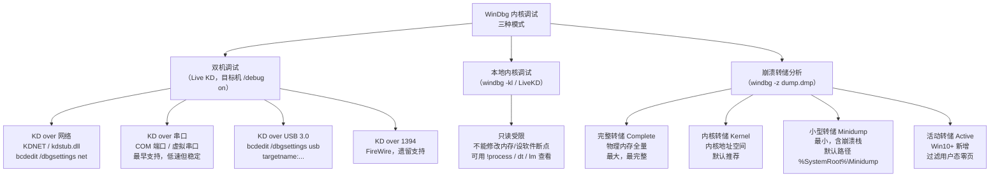
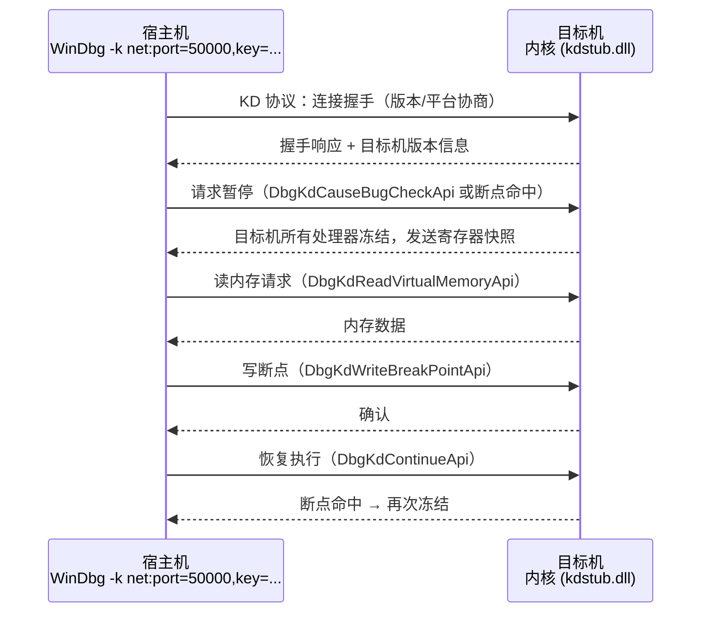
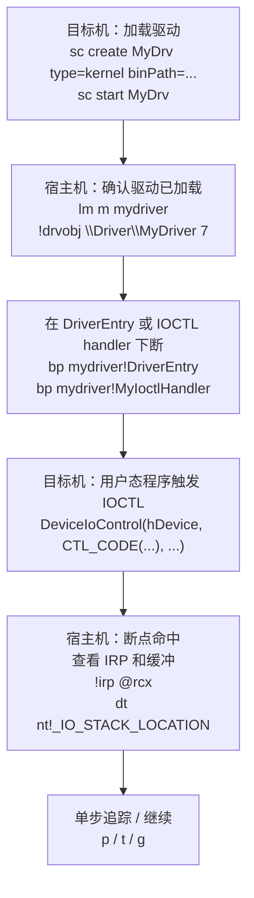

# Windows内核（07）· WinDbg内核调试

> [!abstract] TL;DR
> - **三种内核调试模式**：**双机调试**（KD over 网络/串口/USB/1394，目标机 `bcdedit /debug on`，宿主机 `windbg -k`）、**本地内核调试**（`windbg -kl` / LiveKD，只读受限）、**崩溃转储分析**（`windbg -z`，离线分析 complete/kernel/active/minidump）。
> - **符号是一切的前提**：`.sympath srv*c:\sym*https://msdl.microsoft.com/download/symbols` + `.reload` 把 PDB 拉下来；公共符号只含函数名/类型，私有符号含行号/局部变量。
> - **内核调试核心命令**：`!process 0 0`（列进程）、`dt nt!_EPROCESS <addr>`（结构体展开）、`lm`（模块列表）、`!drvobj <驱动> 7`（驱动对象+分发表）、`!irp <addr>`（IRP 详情）、`!analyze -v`（转储分析定位 BugCheck）。
> - **驱动调试流程**：加载驱动 → 在 `DriverEntry` / IOCTL handler 下断 → 从用户态触发 IOCTL → 内核断点命中 → 检查 IRP 和缓冲数据。
> - **PatchGuard 感知**：内核调试器会触发 KPP 校验机制变化，测试驱动务必在隔离测试机执行，**绝不在生产机启用调试模式**。

本篇是系列第四板块「内核调试」的唯一章节，位于内核内存（[[06.内核内存管理]]）之后、对抗与安全体系（[[08.SSDT与系统调用表]] 起）之前。调试能力是理解一切内核机制的眼睛：WinDbg 内核调试（KD）让你在 Ring 0 随时冻结目标内核、查看任意结构体、观察驱动的分发表和 IRP 流动。本篇聚焦**内核调试实战**，与 [[44.调试器原理与实战/10.WinDbg与x64dbg.md]] 互补——那篇覆盖用户态调试原理、DebugAPI、TTD，本篇专注内核态 KD 协议、符号、驱动断点与崩溃分析。

---

## 概述与定位

### 内核调试 vs 用户态调试

用户态调试（`DebugActiveProcess`、x64dbg）只能看进程级别的内存和寄存器，Ring 3 的世界。内核调试（KD，Kernel Debugger）进入 Ring 0——可以：

- 查看任意内核数据结构（`EPROCESS`、`ETHREAD`、`DRIVER_OBJECT`、IRP）
- 在内核任意位置设断点（`DriverEntry`、`IRP_MJ_DEVICE_CONTROL` handler、`nt!NtCreateFile`）
- 当系统崩溃（BSOD）时分析转储文件找根因
- 追踪池分配（`!pool`）、检测内存泄漏与损坏

代价是：内核调试对整个系统可见性极强，**运行内核调试的系统安全边界大幅降低**，必须在隔离测试环境中操作。

### WinDbg 内核调试的两个组件

内核调试拆成宿主机（Host，运行 WinDbg）和目标机（Target，被调试的内核）两侧，通过 KD 协议通信：

- **宿主机**：WinDbg Classic（`windbg.exe`）或 WinDbg Preview（Microsoft Store），加 `-k` 参数启动内核调试会话。
- **目标机**：Windows 系统开启调试模式（`bcdedit /debug on`），内核启动时加载 `kdcom.dll`/`kd.dll`（传输层），等待宿主机连入后冻结自身。

WinDbg 的核心引擎是 `dbgeng.dll`，它通过 `KD 协议`（一种基于报文的私有协议）控制目标机：读内存、写内存、设断点、恢复执行——概念上和 GDB/RSP 协议扮演同样角色，但专为 Windows 内核设计。

---

## 原理与机制

### 三种内核调试模式全景



#### 模式对比

| 模式 | 实时 | 可修改内核 | 可设断点 | 典型场景 |
|---|---|---|---|---|
| **双机调试** | 是 | 是 | 是（软件/硬件均可） | 驱动开发、内核调试、安全研究 |
| **本地内核调试** | 是（受限） | 否（只读） | 否（无法软件断点） | 快速查看本机内核结构 |
| **转储分析** | 否（离线） | 不适用 | 不适用 | BugCheck 根因分析、事后取证 |

### 双机调试：KD 协议握手流程



> [!warning] 示例输出为示意
> 上图协议报文名称为示意，KD 协议是微软私有协议，字段名来自逆向分析和 ReactOS 开源实现，可能与实际内部名称存在差异。

### 崩溃转储：四种格式详解

Windows 崩溃时由内核的 `KeBugCheckEx` 触发，写入转储文件（通常位于 `%SystemRoot%\MEMORY.DMP`）。转储格式由"控制面板 → 系统 → 高级系统设置 → 启动和故障恢复"配置：

| 转储类型 | 大小 | 内容 | 注册表值 |
|---|---|---|---|
| `Complete Memory Dump` | = 物理内存大小 | 全部物理内存 + 系统头 | `1` |
| `Kernel Memory Dump` | 约 1/3 物理内存 | 内核地址空间（含驱动、内核堆、页表） | `2` |
| `Active Memory Dump` | 可变（Win10+） | 内核空间 + 过滤零用户态页 | `3` |
| `Small Memory Dump` (Minidump) | 64KB–几MB | 崩溃栈 + BugCheck 参数 + 少量内核数据 | `3`（旧版） |

转储文件头为 `DUMP_HEADER`，Magic = `PAGE` (0x45474150)，内含 BugCheck 代码、BugCheck 参数（4个）、处理器上下文等。

---

## 实战详解

### 环境搭建：双机调试 KDNET

KDNET（网络传输）是当前最推荐的方式，延迟低、不需要物理串口，虚拟机直接用 NAT 网络即可。

**目标机（管理员 cmd）：**

```cmd
:: 开启内核调试模式
bcdedit /debug on

:: 配置 KDNET：宿主机 IP + 端口（自选 49152-65535）+ 随机密钥
bcdedit /dbgsettings net hostip:192.168.1.100 port:50001 key:1.2.3.4

:: 重启后生效（或用 bcdedit /bootdebug on 在下次启动时生效）
shutdown /r /t 0
```

**宿主机（WinDbg）：**

```cmd
:: Classic WinDbg
windbg -k net:port=50001,key=1.2.3.4

:: 或 WinDbg Preview（UI 模式）：Kernel Debug → Net → 填 port/key
```

**本地内核调试（测试只读场景）：**

```cmd
:: 以管理员启动，进入只读内核调试
windbg -kl

:: 或用微软 LiveKD 工具（Sysinternals）
livekd -w
```

> [!tip] 虚拟机调试
> 在 VMware / Hyper-V 中调试更安全。VMware 可启用"虚拟串口"（Pipe 模式）与宿主机通信，或直接用 KDNET（仅需目标 VM 与宿主机网络互通）。Hyper-V 还原生支持 vmbus KD 传输（`bcdedit /dbgsettings vmbus channel:1`）。

### 符号配置：`.sympath` 与 `.reload`

符号是内核调试能用的关键。没有符号，`nt!_EPROCESS` 结构体字段全是偏移数字，`!process` 无法正常解析。

```text
; 设置符号路径：本地缓存 + 微软公共符号服务器
.sympath srv*c:\sym*https://msdl.microsoft.com/download/symbols

; 如有私有驱动 PDB，追加私有路径（含 DriverEntry 的行号/局部变量信息）
.sympath+ C:\MyDriver\x64\Debug

; 强制重载所有模块的符号（连接或重启后第一步）
.reload

; 只重载特定模块
.reload /f nt           ; 强制重载 ntoskrnl
.reload /f mydriver.sys ; 重载自己的驱动符号

; 开启符号加载诊断（排查找不到符号的问题）
!sym noisy
.reload /f nt

; 关闭诊断
!sym quiet
```

> [!warning] 示例输出为示意
> 符号服务器地址 `https://msdl.microsoft.com/download/symbols` 为微软公共符号服务器，需要网络访问；离线环境可预先下载到本地并指向本地路径。

#### 公共符号 vs 私有符号

| 特征 | 公共符号（Public PDB） | 私有符号（Private PDB） |
|---|---|---|
| 来源 | 微软符号服务器（msdl.microsoft.com） | 自己编译生成 |
| 内容 | 导出函数名、类型信息（有限） | 函数名 + 源码行号 + 局部变量名 + 内联函数 |
| `dt` 显示 | 结构体字段名和大小（对 `nt!_EPROCESS` 等公开结构有） | 完整，包括私有字段 |
| 调试体验 | 可用，但局部变量显示为 `<optimized away>` | 完整，可用 `dv` 看局部变量 |

对 `ntoskrnl.exe` 来说，微软公共符号已经包含大量结构体类型信息（`nt!_EPROCESS`、`nt!_DRIVER_OBJECT` 等）和函数名，日常内核调试完全够用。

### 核心命令清单

| 命令 | 含义 | 典型用途 |
|---|---|---|
| `!process 0 0` | 列出所有进程（简略，仅 EPROCESS 地址+PID+名称） | 快速找目标进程 |
| `!process 0 7` | 列出所有进程（含线程栈） | 线程状态全景 |
| `!process <EPROCESS addr> 7` | 展开指定进程详情+线程 | 分析单个进程 |
| `dt nt!_EPROCESS <addr>` | 按结构体格式化显示 EPROCESS | 查看 Token、DirectoryTableBase 等字段 |
| `dt nt!_ETHREAD <addr>` | 格式化显示 ETHREAD | 线程状态、IRQL 等 |
| `!thread` | 显示当前线程信息 | 查看 IRQL、等待原因 |
| `lm` | 列出所有已加载模块（驱动+内核组件） | 确认驱动是否加载、查看基址 |
| `lm m nt` | 过滤显示 `nt`（ntoskrnl）模块 | 查看内核基址 |
| `!drvobj \Driver\MyDrv 7` | 展开驱动对象（含分发函数表） | 检查 IRP_MJ_* handler 地址 |
| `!devobj <DEVICE_OBJECT addr>` | 展开设备对象 | 查看设备栈 |
| `!irp <IRP addr>` | 解析 IRP 结构 | 查看 IRP 类型、IO_STACK_LOCATION、缓冲 |
| `u <addr>` | 从地址反汇编若干条指令 | 查看函数头 |
| `uf <addr>` | 反汇编整个函数（跟随分支） | 完整分析 handler |
| `bp <addr>` | 软件断点（内核地址） | 在 DriverEntry / handler 处中断 |
| `bp nt!NtCreateFile` | 系统调用断点 | 跟踪所有 NtCreateFile 调用 |
| `ba e1 <addr>` | 硬件执行断点（1 字节，规避写保护页） | 不可分页页面上的断点 |
| `ba r4 <addr>` | 硬件读断点（4 字节） | 监控内核结构字段访问 |
| `ba w8 <addr>` | 硬件写断点（8 字节） | 监控指针被谁写入 |
| `g` | 继续执行（Go） | 恢复目标内核运行 |
| `p` | 单步越过（Step Over） | 不进入调用 |
| `t` | 单步进入（Step Into） | 追踪进入调用 |
| `k` | 调用栈回溯 | 看谁调用了当前函数 |
| `kv` | 调用栈 + 参数值 | 查看每帧参数 |
| `!pool <addr>` | 分析池块归属 | 确认池标记、大小、类型（分页/非分页） |
| `!poolused` | 统计池使用（需完整转储或实时内核） | 排查池泄漏 |
| `!analyze -v` | 详细分析 BugCheck（崩溃转储首选） | 定位 BugCheck 代码、故障驱动、崩溃栈 |
| `.bugcheck` | 显示 BugCheck 代码和参数 | 转储分析快速查看 |
| `r` | 显示所有寄存器 | 检查处理器状态 |
| `db <addr> L10` | 显示内存字节（16 字节） | 原始内存查看 |
| `dq <addr>` | 显示 QWORD 数组 | 查看指针数组（如分发表） |

### 进程与线程：`!process` 与 `dt`

```text
kd> !process 0 0
**** NT ACTIVE PROCESS DUMP ****
PROCESS ffff8a01`12345000
    SessionId: 1  Cid: 0a1c    Peb: 0000007f`ffd15000  ParentCid: 030c
    DirBase: 00000001`2a345000  ObjectTable: ffffb881`23456780
    HandleCount: 287.  Image: notepad.exe

PROCESS ffff8a01`98765000
    SessionId: 0  Cid: 0004    Peb: 00000000`00000000  ParentCid: 0000
    DirBase: 00000000`00187000  ObjectTable: ffffb881`00012340
    HandleCount: 3218. Image: System
...
```

> [!warning] 示例输出为示意
> 以上 `!process 0 0` 输出为示意，地址已标示例值。实际输出中地址随 KASLR 每次启动不同。

找到目标进程的 `EPROCESS` 地址后，用 `dt` 展开：

```text
kd> dt nt!_EPROCESS ffff8a01`12345000
   +0x000 Pcb              : _KPROCESS
   +0x2e0 ProcessLock      : _EX_PUSH_LOCK
   +0x2e8 UniqueProcessId  : 0x00000a1c
   +0x2f0 ActiveProcessLinks : _LIST_ENTRY [ 0xffff8a01`23456ef0 - 0xffff8a01`09876ef0 ]
   +0x320 Token            : _EX_FAST_REF
   +0x388 ImageFileName    : [15]  "notepad.exe"
   +0x3f8 DirectoryTableBase : 0x00000001`2a345000
   +0x400 ObjectTable      : 0xffffb881`23456780
   ...
```

> [!warning] 示例输出为示意
> 字段偏移值（`+0x2e8` 等）随 Windows 版本更新而变化，上述偏移为 Windows 10 21H2 x64 参考值，请以实际 `.reload` 后 `dt nt!_EPROCESS` 显示为准。

### 驱动对象与分发表：`lm` 与 `!drvobj`

先用 `lm` 确认驱动是否已加载：

```text
kd> lm
start             end                 module name
fffff800`12340000 fffff800`1235f000   nt         (pdb symbols)  C:\sym\ntkrnlmp.pdb\...
fffff800`23450000 fffff800`23460000   mydriver   (pdb symbols)  C:\MyDriver\x64\Debug\mydriver.pdb
fffff800`56780000 fffff800`5678a000   Wdf01000   (deferred)
...
```

> [!warning] 示例输出为示意
> 地址、模块列表均为示意。

再用 `!drvobj` 看驱动对象详情，参数 `7` = 展开设备对象 + 分发函数表 + 驱动扩展：

```text
kd> !drvobj \Driver\MyDriver 7
Driver object (ffff8a01`34560000) is for:
 \Driver\MyDriver
Driver Extension List: (id , addr)

Device Object list:
ffff8a01`45670000  \Device\MyDevice

DriverEntry:   fffff800`23450010  mydriver!DriverEntry
DriverStartIo: 00000000`00000000
DriverUnload:  fffff800`2345a000  mydriver!DriverUnload

Dispatch routines:
[00] IRP_MJ_CREATE                fffff800`23451200   mydriver!MyCreateHandler
[01] IRP_MJ_CLOSE                 fffff800`23452000   mydriver!MyCloseHandler
[0e] IRP_MJ_DEVICE_CONTROL        fffff800`23453000   mydriver!MyIoctlHandler
...（共 28 项，未设置的指向 nt!IopInvalidDeviceRequest）
```

> [!warning] 示例输出为示意
> 分发函数地址和 handler 名称为示意。关键是分发表下标 `[0e]` 对应 `IRP_MJ_DEVICE_CONTROL`（值 0x0E），是 IOCTL 的入口。

这与 [[03.WDM驱动模型与IRP]] 中描述的 `DRIVER_OBJECT.MajorFunction[28]` 数组直接对应，可以用 `dq` 原始查看：

```text
kd> dq ffff8a01`34560000+0x70 L1c
ffff8a01`34560070  fffff800`23451200 fffff800`23452000
ffff8a01`34560080  fffff800`00000000 fffff800`00000000
...
ffff8a01`34560100  fffff800`23453000 ...
```

> [!warning] 示例输出为示意

### 驱动断点调试流程

完整的驱动调试流程分五步：



**在 `IRP_MJ_DEVICE_CONTROL` handler 下断后，检查 IRP：**

```text
; 断点命中时，第一个参数（RCX）= DEVICE_OBJECT，第二个（RDX）= IRP
kd> !irp @rdx
Irp is active with 1 stacks
Mdl=00000000: No Mdl System buffer=ffff8a01`56781000: Thread ffff8a01`11112000:  Irp stack trace.
     cmd  flg cl Device   File     Completion-Context
>[IRP_MJ_DEVICE_CONTROL(e), N/A(0)]
            0  0 ffff8a01`45670000 00000000`00000000 00000000`00000000-00000000`00000000
            Args: 00000040 00000040 0x222004 00000000

; 参数解读：
;   Args[0] = OutputBufferLength（0x40 = 64 字节）
;   Args[1] = InputBufferLength（0x40 = 64 字节）
;   Args[2] = IOCTL 代码（0x222004 = CTL_CODE(0x22, 1, METHOD_BUFFERED, FILE_ANY_ACCESS)）
```

> [!warning] 示例输出为示意
> `!irp` 输出中的地址、IOCTL 代码均为示意值。

**查看 METHOD_BUFFERED 的输入缓冲（System buffer 地址即 IRP.AssociatedIrp.SystemBuffer）：**

```text
kd> db ffff8a01`56781000 L40
ffff8a01`56781000  48 65 6c 6c 6f 20 57 6f-72 6c 64 21 00 00 00 00  Hello World!....
ffff8a01`56781010  00 00 00 00 00 00 00 00-00 00 00 00 00 00 00 00  ................
...
```

> [!warning] 示例输出为示意
> 缓冲内容展示了用户态通过 `DeviceIoControl` 传入的数据（`METHOD_BUFFERED` 时内核已将其拷贝到 SystemBuffer）。

### 条件断点

内核断点命中频繁时（如系统调用级别的 `nt!NtCreateFile`），需要条件断点：

```text
; 只在特定进程（PID = 0x1234）中断
bp nt!NtCreateFile "j (@$peb == 0) 'gc' ; ''"

; 更实用：检查当前进程名
bp nt!NtCreateFile ".if (poi(@$proc+0x450) != 0x61656469) {gc}"
; 0x61656469 = "idea" 小端序（notepad.exe 用 6574_6f6e）

; 断点命中后打印 IOCTL 代码并继续（不停留）
bp mydriver!MyIoctlHandler "r @rcx; !irp @rdx; gc"
```

> [!warning] 示例输出为示意
> 进程名字段偏移（`+0x450`，`ImageFileName`）随 Windows 版本变化，请 `dt nt!_EPROCESS` 确认实际偏移。

### 崩溃转储分析：`!analyze -v`

当内核崩溃（BSOD）产生转储文件后，在宿主机打开分析：

```cmd
windbg -z C:\Windows\MEMORY.DMP
```

进入 WinDbg 后：

```text
kd> !analyze -v
*******************************************************************************
*                                                                             *
*                        Bugcheck Analysis                                    *
*                                                                             *
*******************************************************************************

DRIVER_IRQL_NOT_LESS_OR_EQUAL (d1)
...

BUGCHECK_CODE:  d1

BUGCHECK_P1: ffff8a01`deadbeef  ; 出错地址（被访问的地址）
BUGCHECK_P2: 0000000000000002  ; IRQL（DISPATCH_LEVEL = 2）
BUGCHECK_P3: 0000000000000000  ; 0 = 读，1 = 写
BUGCHECK_P4: fffff800`23453042  ; 触发访问的指令地址

FAULTING_IP:
mydriver!MyIoctlHandler+0x42
fffff800`23453042 488b0f          mov     rcx,qword ptr [rdi]

STACK_TEXT:
fffff801`aa001000 fffff800`23453042 mydriver!MyIoctlHandler+0x42
fffff801`aa001010 fffff800`12ab3456 nt!IofCallDriver+0x56
fffff801`aa001020 fffff800`12cd5678 nt!IoCallDriver+0x28
...

MODULE_NAME: mydriver

IMAGE_NAME:  mydriver.sys

FOLLOWUP_RECOMMENDATION: MachineOwner
```

> [!warning] 示例输出为示意
> 以上 `!analyze -v` 输出为示意。BugCheck 参数含义随 BugCheck 代码不同而变化，需查 Microsoft 文档对应解读。

#### 常见 BugCheck 代码速查

| BugCheck 代码 | 符号名 | 常见原因 |
|---|---|---|
| `0x0000000A` (`0xA`) | `IRQL_NOT_LESS_OR_EQUAL` | 高 IRQL 访问分页内存；驱动在 DISPATCH_LEVEL 读写了 PagedPool |
| `0x0000001E` (`0x1E`) | `KMODE_EXCEPTION_NOT_HANDLED` | 内核态未处理异常（NULL 解引用、访问违例） |
| `0x0000007E` (`0x7E`) | `SYSTEM_THREAD_EXCEPTION_NOT_HANDLED` | 系统线程未处理异常，P4 含故障地址 |
| `0x000000D1` (`0xD1`) | `DRIVER_IRQL_NOT_LESS_OR_EQUAL` | 与 `0xA` 类似，指向具体驱动 |
| `0x0000003B` (`0x3B`) | `SYSTEM_SERVICE_EXCEPTION` | 内核服务中的异常 |
| `0x00000050` (`0x50`) | `PAGE_FAULT_IN_NONPAGED_AREA` | 在非分页区域发生页错误；指针无效 |
| `0x00000109` (`0x109`) | `CRITICAL_STRUCTURE_CORRUPTION` | PatchGuard 检测到内核关键结构被篡改（SSDT/IDT/GDT） |
| `0x0000007F` (`0x7F`) | `UNEXPECTED_KERNEL_MODE_TRAP` | 双故障/三故障等 CPU 异常 |

**定位故障驱动：**

```text
; 查看崩溃时的模块归属（P4 参数地址）
kd> ln fffff800`23453042
(fffff800`23453042)   mydriver!MyIoctlHandler+0x42

; 如果没有符号，用 lm 看哪个模块包含该地址
kd> lm a fffff800`23453042
start             end                 module name
fffff800`23450000 fffff800`2345f000   mydriver   (pdb symbols)
```

> [!warning] 示例输出为示意

---

## 案例：在 IOCTL Handler 下断看输入缓冲

**场景**：分析一个闭源驱动 `target.sys` 的 IOCTL 接口，想看它接受什么数据、验证 METHOD_BUFFERED 缓冲内容。

**思路与步骤：**

**1. 加载驱动，确认加载成功**

```text
kd> lm m target
start             end                 module name
fffff800`44440000 fffff800`44460000   target     (deferred)
```

> [!warning] 示例输出为示意

**2. 用 `!drvobj` 找 IOCTL handler 地址**

```text
kd> !drvobj \Driver\Target 7
...
[0e] IRP_MJ_DEVICE_CONTROL   fffff800`44451800   target+0x11800
```

> [!warning] 示例输出为示意

**3. 用 `uf` 反汇编 IOCTL handler 开头，识别 IOCTL 代码分支**

```text
kd> uf fffff800`44451800
target+0x11800:
fffff800`44451800 mov  rax, [rdx+0x70]      ; IRP->Tail.Overlay.CurrentStackLocation
fffff800`44451808 mov  r8d, [rax+0x18]      ; IoStackLocation->Parameters.DeviceIoControl.IoControlCode
fffff800`4445180e cmp  r8d, 0x222004         ; 比较 IOCTL 代码
fffff800`44451815 jne  target+0x11900
fffff800`4445181b mov  rcx, [rdx+0x18]      ; IRP->AssociatedIrp.SystemBuffer（METHOD_BUFFERED）
...
```

> [!warning] 示例输出为示意
> 真实驱动反汇编结果差异很大，字段偏移需结合 `dt nt!_IRP` 和 `dt nt!_IO_STACK_LOCATION` 确认。

**4. 在 handler 下断，触发 IOCTL，检查 SystemBuffer**

```text
kd> bp fffff800`44451800
kd> g

; （在用户态应用运行 DeviceIoControl(...)）
; 断点命中

kd> !irp @rdx
...
System buffer=ffff8a01`70001000

kd> db ffff8a01`70001000 L80
ffff8a01`70001000  xx xx xx xx xx xx xx xx  ................
...
```

> [!warning] 示例输出为示意

**5. 用 `dt` 把缓冲解析为已知结构体（如果已逆向出结构体定义）**

```text
kd> dt MyRequestStruct ffff8a01`70001000
```

这个流程在 [[14.驱动逆向实战]] 中会有完整的真实案例演示。

---

## 安全性与正确使用

### 调试模式对系统防护的影响

启用 `bcdedit /debug on` 不仅仅是打开通信通道——它改变了整个内核的安全状态：

1. **PatchGuard（KPP）行为变化**：内核调试模式下，PatchGuard（[[12.PatchGuard与DSE与HVCI]] 有详述）的某些校验周期和触发条件会改变。WinDbg 连接时内核结构被调试器读写，KPP 需要知道这些是合法操作而非攻击——这种"豁免"机制本身降低了检测精度。
2. **HVCI 与 VBS 交互**：如果目标机启用了 HVCI（虚拟化安全，VBS），内核调试器对内核代码页的写入（软件断点 `0xCC`）会被 HVCI 拦截——HVCI 保护内核代码页不可写。在 HVCI 机器上调试，需要改用**硬件执行断点**（`ba e1`）而非软件断点（`bp`）。
3. **DSE 测试签名**：加载未签名测试驱动需要 `bcdedit /set testsigning on`；同时开启调试模式时，系统处于"测试模式 + 调试模式"双重降防状态。

### 仅在隔离测试环境操作

> [!caution] 合规与安全边界
> - **绝对不要在生产机或个人日常使用的机器上开启内核调试模式**。调试模式降低内核完整性校验，加上测试签名允许任意驱动加载，等同于将整个内核暴露给宿主机（或物理串口/网络端的连接方）。
> - **隔离网络**：KD 网络传输（KDNET）应在隔离 VLAN 或纯虚拟机内网中进行，密钥（`key`）应随机生成，不应在公共网络暴露调试端口。
> - **目的仅限授权研究**：内核调试是驱动开发、内核安全研究、恶意驱动分析（蓝队）的工具，**不得用于未授权目标系统的调试或内核权限提升**。
> - **虚拟机是最佳实践**：驱动开发和恶意驱动分析均应在虚拟机快照环境中进行，崩溃后恢复快照，保护宿主机。

### 高 IRQL 与分页内存限制

内核断点有 IRQL 约束，这是内核调试与用户态调试的关键差异：

| 约束 | 说明 |
|---|---|
| **分页内存限制** | 软件断点（`bp`）在分页内存地址有效；但在高 IRQL（`DISPATCH_LEVEL` 及以上）执行路径上，访问分页内存会导致 `IRQL_NOT_LESS_OR_EQUAL` BugCheck——这也是很多驱动崩溃的根因。 |
| **DISPATCH_LEVEL 断点** | 在 DPC 例程、`KeAcquireSpinLock` 持有期间设断点，断点命中后必须快速处理；此时不能调用任何可能引起调度的操作。 |
| **高 IRQL 禁止的操作** | `DISPATCH_LEVEL` 以上：不能访问 PagedPool；不能调用 `KeWaitForXxx`（等待）；不能调用 `IoAllocateIrp` 等可能分配/等待的函数。 |
| **硬件断点首选** | 在 ISR（中断服务例程，`DIRQL`）或 DISPATCH_LEVEL 代码中，用 `ba e1`（硬件执行断点）而非 `bp`，避免软件断点本身引起问题。 |

---

## 小结

1. **三种模式各有适用场景**：双机调试（完整 KD）适用于驱动开发与实时内核分析；本地内核调试（`-kl`）快速只读查看；崩溃转储分析是生产事故的事后手段，`!analyze -v` 是第一条命令。

2. **符号是核心基础设施**：`.sympath srv*c:\sym*https://msdl.microsoft.com/download/symbols` + `.reload` 是每个会话的开局动作；私有 PDB 使调试体验质的提升，提供行号和局部变量；公共符号对系统组件已足够。

3. **`!process`/`dt`/`lm`/`!drvobj` 是内核调试四大支柱**：`!process 0 0` 找进程，`dt nt!_EPROCESS` 展开结构，`lm` 确认模块加载，`!drvobj` 查分发表——四个命令覆盖日常 90% 的内核探查需求。

4. **驱动调试流程**：加载驱动 → `lm` 确认 → `!drvobj` 看分发表 → `bp` 在 handler 下断 → 触发 IOCTL → `!irp` + `db` 看缓冲——这条流程足以分析绝大多数 IOCTL 接口。

5. **`!analyze -v` 是崩溃分析的起点**：自动定位 BugCheck 代码（如 `0xD1 DRIVER_IRQL_NOT_LESS_OR_EQUAL`）、故障指令地址、调用栈、归属模块，配合 `ln <addr>` 和 `lm a <addr>` 精确定位故障驱动。

6. **安全意识**：内核调试模式改变系统安全状态（PatchGuard 感知变化、HVCI 限制软件断点），必须在隔离测试机/虚拟机中进行，严格禁止在生产机或未授权目标上操作。

---

## 相关阅读

- **WinDbg 用户态调试原理（DebugAPI、TTD、x64dbg）**：[[44.调试器原理与实战/10.WinDbg与x64dbg.md]]
- **调试器系列总览**：[[44.调试器原理与实战/00.调试器原理与实战总览.md]]
- **驱动模型（DRIVER_OBJECT / IRP / IOCTL）**：[[03.WDM驱动模型与IRP]]
- **内核对象与 EPROCESS**：[[05.内核对象与句柄]]
- **内核内存（池 / MDL / VAD）**：[[06.内核内存管理]]
- **SSDT 与系统调用表（下一篇）**：[[08.SSDT与系统调用表]]
- **驱动逆向实战（完整案例）**：[[14.驱动逆向实战]]
- **PatchGuard / DSE / HVCI（安全机制）**：[[12.PatchGuard与DSE与HVCI]]
- **Windows 防护体系（跨系列）**：[[34.现代二进制防护机制/10.Windows防护体系.md]]
- **PE 文件详解（.sys 即 PE）**：[[13.PE文件详解/00-合集总览-PE文件详解.md]]

---

⬅️ 上一篇 [[06.内核内存管理]] ｜ 🏠 [[00.Windows内核与驱动逆向总览]] ｜ 下一篇 [[08.SSDT与系统调用表]] ➡️
