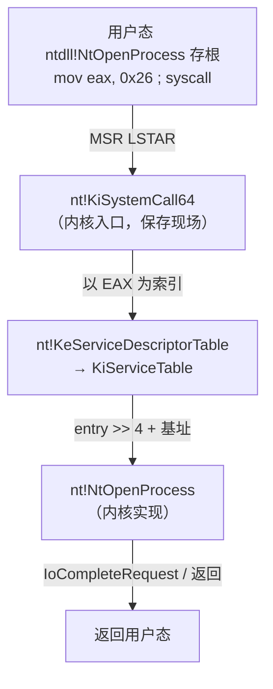

# Windows内核（08）· SSDT与系统调用表

## 概述与定位

> [!abstract] TL;DR
> **SSDT（System Service Descriptor Table，系统服务描述符表）** 是 Windows 内核将用户态 `syscall` 请求路由到具体内核函数（`nt!Nt*`）的核心数据结构。它由 `nt!KeServiceDescriptorTable` 暴露，内部的 `KiServiceTable` 以**系统调用号（EAX）为索引**，在 x64 上每项存储的不是绝对地址，而是**相对于表基址的带参数编码偏移**（`target = KiServiceTable + (entry >> 4)`）。Shadow SSDT（`KeServiceDescriptorTableShadow`）另行映射 win32k.sys 的 GUI 服务。32 位时代 Rootkit 通过篡改 SSDT 项拦截系统调用；x64 上 **PatchGuard** 周期校验并以 BSOD 阻止此类篡改，现代 EDR 改用合法内核回调（见第 09 章）。本章从防御与分析视角讲透 SSDT 的结构、索引机制、x64 偏移编码与蓝队检测方法。

SSDT 在 Windows 内核对抗体系中占据枢纽位置：理解它是读懂 SSDT Hook、PatchGuard 保护对象以及 EDR 内核监控转型的前提。前序章节 [[02.用户态到内核态的切换]] 已讲清 `ntdll.dll` 的 `Nt*`/`Zw*` 存根→`syscall`→`nt!KiSystemCall64` 的入口路径；本章聚焦 `KiSystemCall64` 之后如何查 SSDT 完成分发，以及这张表在对抗中的历史与现状。

---

## 原理与机制

### 系统调用分发全景

用户态程序调用 `NtOpenProcess`（ntdll 导出）时，其存根汇编形如：

```nasm
; ntdll!NtOpenProcess 存根（x64，系统调用号示例）
mov     r10, rcx          ; 保存 rcx（System V 约定的首参）
mov     eax, 0x26         ; 系统调用号装入 EAX（此值随 Windows 版本变化）
syscall                   ; 陷入内核
ret
```

`syscall` 触发后，CPU 通过 MSR `LSTAR`（Model Specific Register C0000082h）跳转到 `nt!KiSystemCall64`。`KiSystemCall64` 保存寄存器现场、切换至内核栈，然后以 EAX 中的系统调用号为索引查询 SSDT，找到实现函数并调用：

```
EAX（系统调用号）
    ↓
KeServiceDescriptorTable.KiServiceTable[EAX]  →  nt!NtOpenProcess
```



> [!note] EAX 即系统调用号
> Windows 系统调用号（SSN，System Service Number）**不跨 Windows 版本稳定**，同一函数的编号在不同版本间可能不同，这是 Windows ABI 有意设计的私有细节，用户态程序应始终通过 ntdll 存根而非硬编码 SSN 调用。

---

## 结构详解

### KeServiceDescriptorTable

`nt!KeServiceDescriptorTable` 是一个全局导出符号，指向 `_KSERVICE_TABLE_DESCRIPTOR` 结构体。该结构体在 x64 的布局（依据公开符号与 WinDbg `dt` 输出）如下：

```c
// nt!_KSERVICE_TABLE_DESCRIPTOR（x64，公开符号风格）
typedef struct _KSERVICE_TABLE_DESCRIPTOR {
    PULONG_PTR ServiceTable;   // 指向 KiServiceTable（x64 为 int32 偏移数组）
    PULONG     CountTable;     // 每个服务调用计数（调试用，可为 NULL）
    ULONG      ServiceLimit;   // 表中服务项总数（x64 Windows 10 约 450+ 项）
    PUCHAR     ArgumentTable;  // 每服务参数字节数表（x64 已废弃/编码在偏移低位）
} KSERVICE_TABLE_DESCRIPTOR, *PKSERVICE_TABLE_DESCRIPTOR;
```

| 字段 | 说明 |
|---|---|
| `ServiceTable` | 指向 `nt!KiServiceTable`，实际是 `int32[]`（x64 存相对偏移，见下节） |
| `CountTable` | 调用计数，调试/性能用途，正常内核可为 `NULL` |
| `ServiceLimit` | 有效索引上界；EAX ≥ ServiceLimit 则拒绝调用 |
| `ArgumentTable` | x64 上参数字节数信息已编码于偏移低 4 位，此字段意义弱化 |

WinDbg 中观察：

```windbg
kd> dt nt!_KSERVICE_TABLE_DESCRIPTOR nt!KeServiceDescriptorTable
   +0x000 ServiceTable     : 0xfffff800`12345678 -> KiServiceTable
   +0x008 CountTable       : (null)
   +0x010 ServiceLimit     : 0x1d0
   +0x018 ArgumentTable    : 0xfffff800`1234abcd
```

> [!warning] 示例输出为示意
> 上述地址及 ServiceLimit 值均为示意，实际值因 Windows 版本与 KASLR 随机化而不同。

---

### KiServiceTable 与 x64 偏移编码

这是 SSDT 最核心的实现细节，也是 x64 与 x86-32 最显著的差异之处。

**x86-32**（历史实现）：`KiServiceTable` 每项直接存储服务函数的 **32 位绝对虚拟地址**，索引即取即用：

```
KiServiceTable[EAX]  →  绝对地址（直接 call）
```

**x64**（Windows Vista+ 至今）：每项存储一个 **32 位有符号整数**，编码了两部分信息：

```
int32 entry = KiServiceTable[EAX]

实际函数地址 = (ULONG64)KiServiceTable + (int32)(entry >> 4)
                                           ^^^^^^^^^^^^^^^^^^^^
                                           函数相对于表基址的偏移
参数堆栈字节数/4 = entry & 0xF            低 4 位：参数字节数除以 4
                   ^^^^^^^^^^^^^^^^
                   （x64 调用约定下前 4 个整数参数走寄存器，此字段用于处理寄存器溢出到栈的部分）
```

用伪代码表达：

```c
// KiSystemCall64 分发核心（伪代码，防御分析用）
ULONG index = EAX;
if (index >= KeServiceDescriptorTable.ServiceLimit) {
    // 无效系统调用号，拒绝
    return STATUS_INVALID_SYSTEM_SERVICE;
}
INT32 entry = ((INT32*)KeServiceDescriptorTable.ServiceTable)[index];
ULONG64 target = (ULONG64)KeServiceDescriptorTable.ServiceTable + (entry >> 4);
// 调用 target，传入已准备好的参数
```

**为什么用相对偏移而非绝对地址？**

1. **KASLR 友好**：`ntoskrnl.exe` 加载基址随机，但 `KiServiceTable` 与所有 `Nt*` 函数同属一个 PE 映像，相对偏移在加载时固定不变，无需重定位。
2. **节省空间**：32 位偏移取代 64 位指针，在条目数百的表中可观。
3. **附带参数信息**：低 4 位复用，避免额外的 ArgumentTable。

**字节布局示意（单项 4 字节）**：

```
bit  31                    4  3      0
     [ 相对 KiServiceTable 的函数偏移 >> 4 | 参数字节数/4 ]
```

WinDbg 手动解析：

```windbg
; 查看 KiServiceTable 前若干项（原始 int32 偏移）
kd> dps nt!KiServiceTable L10
fffff800`12345678  04054e00`00000026   ; EAX=0 对应某 Nt* 函数
fffff800`12346678  03f20400`00000034   ; ...

; 计算第 0 项的目标地址（示意，假设 entry = 0x0405_4e04）
; target = 0xfffff800`12345678 + (0x04054e04 >> 4)
;        = 0xfffff800`12345678 + 0x00405_4e0
;        = fffff800`12745858（示意）

; 直接用 x 命令验证符号
kd> x nt!Nt*
```

> [!warning] 示例输出为示意
> 上述 entry 数值与最终地址均为示意，实际需在调试环境中执行命令获取真实值。

---

### Shadow SSDT（KeServiceDescriptorTableShadow）

`nt!KeServiceDescriptorTableShadow` 是 `KeServiceDescriptorTable` 的扩展版本，结构上包含**两张**服务描述符表：

| 表索引 | 映射模块 | 服务范围 |
|---|---|---|
| 表 0（`ntoskrnl` 服务表） | `ntoskrnl.exe`（`nt!KiServiceTable`） | 核心系统调用（`NtOpenProcess`、`NtAllocateVirtualMemory` 等） |
| 表 1（win32k 服务表） | `win32k.sys`（`W32pServiceTable`） | GUI/图形系统调用（`NtGdiXxx`、`NtUserXxx`） |

**加载时机**：win32k 服务表仅在线程首次调用 GUI 系统调用时才挂载到当前线程的服务描述符指针（`_KTHREAD.ServiceTable` 字段）——即所谓"GUI 线程"。非 GUI 线程的 `ServiceTable` 指向普通 `KeServiceDescriptorTable`，访问 win32k 系统调用号会被拒绝。

系统调用号区分方法：

```
EAX 高位（bit 12）= 0  →  ntoskrnl 服务表（表 0）
EAX 高位（bit 12）= 1  →  win32k  服务表（表 1，EAX & 0xFFF 为 win32k 内索引）
```

> [!note] win32k 服务表的安全意义
> win32k.sys 的 GUI 系统调用历史上漏洞频发（特权提升、沙箱逃逸），Windows 10 引入了 Win32k System Call Filtering 机制，允许沙箱进程（如 Chrome 渲染进程）通过策略限制可调用的 win32k 系统调用集合，大幅缩减攻击面。

---

## 防御分析

### SSDT Hook 的历史（32 位时代）

在 Windows XP/Vista 的 x86-32 时代，内核安全软件（HIPS、Anti-Rootkit、Antivirus）与恶意 Rootkit 的激烈博弈催生了大量 SSDT Hook 手法。核心原理极简：

```
攻击/监控前：KiServiceTable[NtOpenProcess]  →  nt!NtOpenProcess
Hook 后：    KiServiceTable[NtOpenProcess]  →  MyFilter（自定义函数）
                                                   ↓
                                           可记录/修改/拒绝后再跳回
```

常见操作步骤（仅描述历史原理，防御分析用途）：

1. 通过 `KeServiceDescriptorTable` 定位 `KiServiceTable`。
2. 调用 `MmGetSystemRoutineAddress` / 自解析符号找到目标函数在表中的索引。
3. 修改目标表项指向 Hook 函数（需先去掉 WP 位：`cli` + `mov cr0, eax` 清 bit 16，或用 MDL 映射）。
4. Hook 函数在前后调用原始函数，实现透明拦截。

这一手法曾被 Rootkit 用于隐藏进程（Hook `NtQuerySystemInformation`）、隐藏文件（Hook `NtQueryDirectoryFile`）、隐藏注册表项等，也被 HIPS/Antivirus 用于行为监控。

### x64 + PatchGuard：SSDT Hook 的终结

从 Windows Vista x64 起，**Kernel Patch Protection（KPP，俗称 PatchGuard）** 使直接 SSDT Hook 在 64 位系统上实际不可行：

| 项目 | x86-32 | x64（PatchGuard 开启） |
|---|---|---|
| SSDT Hook 可行性 | 技术可行，历史广泛使用 | PatchGuard 周期校验 SSDT，篡改触发 BSOD |
| 触发的 BSOD 检查码 | 无 | `CRITICAL_STRUCTURE_CORRUPTION`（0x109） |
| 校验频率 | N/A | 随机间隔（数分钟级，确切时机故意随机化） |
| 覆盖范围 | N/A | SSDT / IDT / GDT / 关键内核代码页 / 关键数据结构 |

PatchGuard 的具体工作机制：内核启动时对上述关键区域计算校验快照，并以随机时间间隔在内核中运行检查例程（利用 DPC、APC、线程等多种触发机制）比对当前内存与快照。一旦发现不一致，立即调用 `KeBugCheckEx(0x109, ...)` 终止系统。

> [!caution] 合规边界
> PatchGuard 的绕过技术（如利用内核漏洞修改校验例程上下文、利用 hypervisor 拦截校验）涉及对他人生产系统的攻击行为，本章**不提供**此类可落地步骤。本节内容仅面向内核安全研究人员在自有授权环境中的防御理解与恶意驱动分析。

**现代 EDR 的转型**：正因 SSDT Hook 在 x64 上被 PatchGuard 封死，主流 EDR（CrowdStrike Falcon、Microsoft Defender for Endpoint、SentinelOne 等）已全面转向合法的**内核回调机制**（第 09 章）：

```
32位时代：SSDT Hook（KiServiceTable 直接改表项）
        ↓
x64时代：PatchGuard 阻止 SSDT Hook
        ↓
现代 EDR：PsSetCreateProcessNotifyRoutine / ObRegisterCallbacks
         / PsSetLoadImageNotifyRoutine 等合法内核回调
```

### 蓝队检测：枚举与校验 SSDT

蓝队工具（内核安全扫描器、Anti-Rootkit 引擎）在检测 SSDT Rootkit 时，通常执行以下步骤：

**步骤 1：枚举 KiServiceTable 所有项并解析目标地址**

对每个有效索引 `i`（0 ≤ i < ServiceLimit）：

```c
INT32  entry  = KiServiceTable[i];
UINT64 target = (UINT64)KiServiceTable + (entry >> 4);
```

**步骤 2：校验目标地址是否落在合法模块范围内**

每个解析出的 `target` 应落在 `ntoskrnl.exe` 的 `.text`/`PAGE` 节区地址范围内（可通过 `LDR_DATA_TABLE_ENTRY` 或 `nt!PsLoadedModuleList` 获得各模块的基址与大小）。**超出此范围的表项即可疑**，可能被 Hook 到第三方驱动或恶意代码空间。

**步骤 3：代码完整性校验**

结合 WinDbg 的 `!chkimg` 命令，校验内核代码段是否被内存补丁（inline patch）修改：

```windbg
kd> !chkimg nt
```

> [!warning] 示例输出为示意
> `!chkimg` 实际输出取决于调试环境的符号与 PE 镜像，命令本身会对比内存中的代码与磁盘/符号文件中的原始字节，任何差异均会被列出。

**步骤 4：交叉验证 win32k Shadow SSDT**

对 `W32pServiceTable` 做类似检测，确认每项目标均落在 `win32k.sys` 或 `win32kbase.sys`/`win32kfull.sys` 的合法范围内。

### WinDbg 逆向视角

在内核调试环境中，可用以下命令系统地观察 SSDT：

```windbg
; 1. 查看 KeServiceDescriptorTable 结构
kd> dt nt!_KSERVICE_TABLE_DESCRIPTOR nt!KeServiceDescriptorTable

; 2. 转储 KiServiceTable 原始偏移（前 32 项）
kd> dd nt!KiServiceTable L20

; 3. 查看 KiServiceTable 的函数指针（dps 自动解析符号）
kd> dps nt!KiServiceTable L20

; 4. 列出所有 Nt* 内核函数符号（用于与表项对照）
kd> x nt!Nt*

; 5. 检查指定索引（如 EAX=0x26）对应的函数
kd> ? nt!KiServiceTable + ( poi(nt!KiServiceTable + 0x26*4) >> 4 )

; 6. !chkimg 校验内核代码完整性
kd> !chkimg nt
```

> [!warning] 示例输出为示意
> 上述命令中的索引、地址均为示意。实际系统调用号因 Windows 版本不同而变化；命令需在配置了正确符号路径（`.sympath srv*`）的 WinDbg 内核调试会话中执行。

---

## 安全性与正确使用

### 检测方法总结

| 检测手段 | 检测目标 | 工具/命令 |
|---|---|---|
| SSDT 表项范围校验 | 项指向非 `ntoskrnl`/`win32k` 空间 | Anti-Rootkit 驱动、ARK 工具 |
| `!chkimg nt` | `ntoskrnl` 代码段 inline patch | WinDbg（KD 模式） |
| `!chkimg win32k` | win32k 代码完整性 | WinDbg（KD 模式） |
| `PsLoadedModuleList` 遍历 | 未签名 / 可疑驱动加载 | 结合 DSE 检测 |
| BSOD 日志分析 | `0x109 CRITICAL_STRUCTURE_CORRUPTION` | 转储分析（`!bugcheck`/`!analyze -v`） |
| 交叉视图（线程 ServiceTable 字段） | 非预期 ServiceTable 替换 | `dt nt!_KTHREAD @$thread ServiceTable` |

### 合规边界

> [!caution] 合规与法律声明
> 本章所有内容面向以下**合法用途**：
> - 在**自有受控环境**（个人测试机、企业安全实验室）中进行内核安全研究。
> - **恶意驱动分析**与逆向（分析已有恶意样本）。
> - **蓝队检测工具开发**（检测 SSDT 异常、PatchGuard 触发分析）。
> - **EDR/反作弊引擎原理学习**。
>
> 本章**不提供**：
> - 绕过 PatchGuard（KPP）并持久维持 SSDT Hook 的可落地步骤。
> - 针对他人生产系统实施 SSDT Hook 的完整工具链或指导。
> - 任何可直接武器化的内核 Rootkit 落地方案。
>
> 请遵守《网络安全法》及相关法律法规，确保所有内核研究活动在授权范围内进行。

---

## 小结

| 要点 | 核心内容 |
|---|---|
| SSDT 核心结构 | `KeServiceDescriptorTable` → `KiServiceTable`（x64 为 int32 相对偏移数组） |
| x64 偏移编码 | `target = KiServiceTable + (entry >> 4)`，低 4 位编码参数字节数 /4 |
| Shadow SSDT | `KeServiceDescriptorTableShadow` 附加 win32k 服务表，仅 GUI 线程加载 |
| SSDT Hook 历史 | 32 位 Rootkit/HIPS 直接改表项；x64 上被 PatchGuard 以 `0x109` BSOD 阻止 |
| 现代 EDR 转型 | 合法内核回调（`PsSet*`/`ObRegisterCallbacks`）取代 SSDT Hook |
| 蓝队检测 | 枚举表项校验模块范围 + `!chkimg` 代码完整性 + `0x109` 转储分析 |

SSDT 是理解 Windows 内核对抗格局演化的关键锚点：它展示了从「内核直接改表 → PatchGuard 封堵 → EDR 转向合法回调」的完整历史弧线，也是分析 Rootkit 与 EDR 技术路线时绕不开的基础结构。

---

## 相关阅读

- **前置（syscall 入口）**：[[02.用户态到内核态的切换]]
- **后续（现代内核监控）**：[[09.内核回调机制]]
- **PatchGuard 详解**：[[12.PatchGuard与DSE与HVCI]]
- **Windows 防护体系**：[[34.现代二进制防护机制/10.Windows防护体系]]
- **Hook 技术（用户态对照）**：[[32.hooks/02-windows-api-hook]]
- **WinDbg 使用**：[[44.调试器原理与实战/10.WinDbg与x64dbg]]
- **Linux 系统调用对照**：[[15.操作系统加载与启动/10.系统调用机制]]

---

⬅️ 上一篇 [[07.WinDbg内核调试]] ｜ 🏠 [[00.Windows内核与驱动逆向总览]] ｜ 下一篇 [[09.内核回调机制]] ➡️
