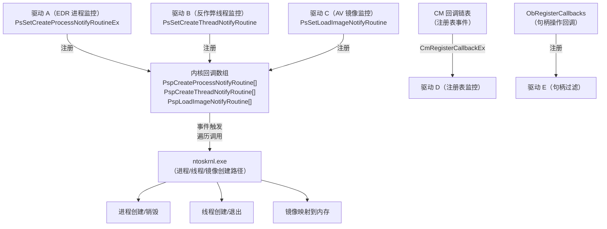
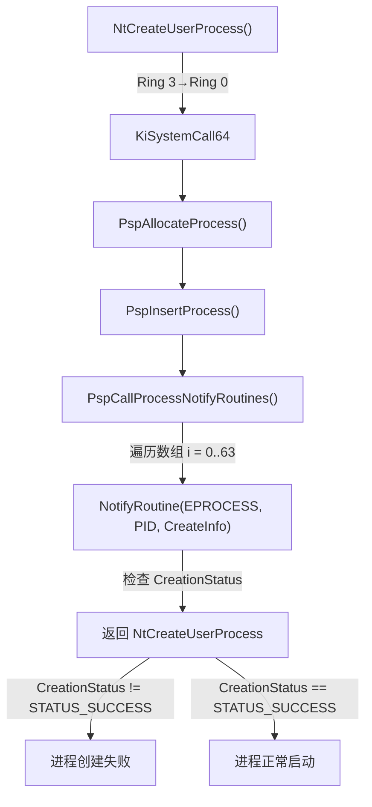
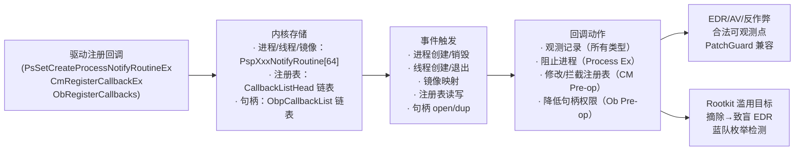

# Windows内核（09）· 内核回调机制

## 概述与定位

> [!abstract] TL;DR
> Windows 内核回调是内核向驱动程序暴露的**合法可观测点**：当进程创建/销毁、线程启动/退出、镜像（驱动/.exe/.dll）被加载、注册表被修改、进/线程句柄被打开时，内核会主动调用驱动注册的回调函数。EDR/反作弊/AV 正是通过这套机制在 Ring 0 层实时感知系统行为，而无需任何 Hook。Rootkit 反过来会枚举并"摘除"这些回调以致盲防御软件——本章从防御分析视角讲透其工作原理、内核数据结构、WinDbg 验证方法与蓝队检测思路。

内核回调（Kernel Callbacks）是 Windows 操作系统向内核驱动程序提供的一套**发布-订阅（publish-subscribe）通知机制**。它与 SSDT Hook（篡改函数指针）在思路上截然不同：

- **SSDT Hook**（篡改式）：悄悄替换 `KiServiceTable` 中某个系统调用的目标地址，拦截后再转发；在 x64 下被 PatchGuard 监控，难以落地——详见 [[08.SSDT与系统调用表]]。
- **内核回调**（注册式）：驱动调用官方 API（`PsSetCreateProcessNotifyRoutine` 等）将自身函数地址写入内核维护的回调数组，内核在特定事件发生时**主动调用**所有已注册例程；无需修改任何系统内核代码，在 PatchGuard 体系内完全合法。

这种设计赋予了以下优势：

| 特性 | SSDT Hook | 内核回调 |
|---|---|---|
| 是否修改内核代码/关键结构 | 是 | 否 |
| PatchGuard 兼容性 | 不兼容（x64 被阻止） | 兼容 |
| Microsoft 官方支持 | 不支持 | 有正式文档 |
| 粒度 | 系统调用级 | 进程/线程/镜像/注册表/句柄 |
| 可选择性 | 全量拦截 | 按类型注册 |

本章覆盖五类主要回调：**进程（Process）、线程（Thread）、镜像加载（Load Image）、注册表（Registry/CM）、对象/句柄（Object）**。每类都从注册 API → 内核存储结构 → 触发时机 → WinDbg 验证 → 逆向识别 → 安全含义逐一讲透。

---

## 原理与机制

### 回调的整体架构

Windows 内核用**数组 + 原子操作**维护所有已注册回调，核心设计如下：



关键设计决策：

1. **数组项用 EX_CALLBACK_ROUTINE_BLOCK 封装**：指向实际例程地址的指针通过低位标志位（bit 0 = "正在使用"锁）做无锁并发控制。
2. **注册上限**：进程/线程/镜像回调各最多支持 **64** 个注册项（Windows 10 2004+ 扩展到 64；旧版 8 或 16）。
3. **调用在事件线程上下文**：回调在触发事件的线程上下文中同步调用，故 IRQL 通常为 `PASSIVE_LEVEL`（进程/镜像）或 `PASSIVE_LEVEL`（线程创建），不能做阻塞 I/O 等不安全操作。

### 五类回调速览

| 注册 API | 内核数组/链表 | 最大项数 | 触发时机 |
|---|---|---|---|
| `PsSetCreateProcessNotifyRoutine(Ex/Ex2)` | `PspCreateProcessNotifyRoutine` | 64 | 进程创建/销毁 |
| `PsSetCreateThreadNotifyRoutine(Ex)` | `PspCreateThreadNotifyRoutine` | 64 | 线程创建/退出 |
| `PsSetLoadImageNotifyRoutine(Ex)` | `PspLoadImageNotifyRoutine` | 64 | `NtMapViewOfSection` 映射可执行镜像 |
| `CmRegisterCallback(Ex)` | `CallbackListHead`（`_CM_CALLBACK_CONTEXT` 链表） | 无硬性上限 | 注册表操作（pre/post） |
| `ObRegisterCallbacks` | `ObpCallbackList`（`OB_CALLBACK_REGISTRATION` 链表） | 受 `_OB_OPERATION_REGISTRATION` 限制 | 进/线程句柄 open/dup |

---

## 结构 / 源码 / 流程详解

### 1. 进程创建回调

#### 注册 API 演进

```c
// 最早版（Windows 2000+）：不区分 create/exit，无法阻止进程
NTSTATUS PsSetCreateProcessNotifyRoutine(
    IN PCREATE_PROCESS_NOTIFY_ROUTINE  NotifyRoutine,  // 函数指针
    IN BOOLEAN                         Remove           // TRUE = 移除
);

// 扩展版（Vista+）：传入 PS_CREATE_NOTIFY_INFO，可访问更多信息
NTSTATUS PsSetCreateProcessNotifyRoutineEx(
    IN PCREATE_PROCESS_NOTIFY_ROUTINE_EX  NotifyRoutine,
    IN BOOLEAN                             Remove
);

// Win10 RS3+：可拦截进程镜像名变更（commandline 欺骗检测）
NTSTATUS PsSetCreateProcessNotifyRoutineEx2(
    IN PSCREATEPROCESSNOTIFYTYPE      NotifyType,    // PsCreateProcessNotifySubsystems
    IN PVOID                          NotifyInformation,
    IN BOOLEAN                        Remove
);
```

#### 回调函数签名（Ex 版）

```c
typedef VOID (*PCREATE_PROCESS_NOTIFY_ROUTINE_EX)(
    PEPROCESS               Process,        // 新进程的 EPROCESS
    HANDLE                  ProcessId,      // PID
    PPS_CREATE_NOTIFY_INFO  CreateInfo      // NULL = 进程销毁
);

typedef struct _PS_CREATE_NOTIFY_INFO {
    SIZE_T              Size;               // 结构大小
    union {
        ULONG           Flags;
        struct {
            ULONG       FileOpenNameAvailable : 1; // ImageFileName 有效
            ULONG       IsSubsystemProcess    : 1;
            ULONG       Reserved              : 30;
        };
    };
    HANDLE              ParentProcessId;    // 父进程 PID
    CLIENT_ID           CreatingThreadId;   // 创建者线程 ID
    struct _FILE_OBJECT *FileObject;        // 进程镜像文件对象
    PCUNICODE_STRING    ImageFileName;      // 镜像路径（NT 路径格式）
    PCUNICODE_STRING    CommandLine;        // 完整命令行
    NTSTATUS            CreationStatus;     // 可修改以拒绝进程创建（Ex 版）
} PS_CREATE_NOTIFY_INFO, *PPS_CREATE_NOTIFY_INFO;
```

关键细节：
- `CreateInfo == NULL` → 进程 **销毁**（已退出）通知，此时无法阻止。
- `CreateInfo != NULL` → 进程 **创建** 通知；`Ex` 版驱动可将 `CreateInfo->CreationStatus` 置为错误码来**拒绝**进程创建（AV 常用此手段阻断恶意进程）。
- `ImageFileName` 为 NT 内部路径（如 `\Device\HarddiskVolume3\Windows\System32\cmd.exe`），不是 Win32 路径。

#### 内核存储结构

内核用全局数组 `PspCreateProcessNotifyRoutine` 存储已注册的例程，每项是一个 `EX_CALLBACK_ROUTINE_BLOCK` 封装指针：

```c
// 概念性等价（非公开定义，由逆向得出）
typedef struct _EX_CALLBACK_ROUTINE_BLOCK {
    EX_RUNDOWN_REF        RundownProtect;  // 防止卸载时 use-after-free
    PEX_CALLBACK_FUNCTION Function;        // 实际回调地址（+1 = 低位锁）
} EX_CALLBACK_ROUTINE_BLOCK, *PEX_CALLBACK_ROUTINE_BLOCK;
```

数组项存储的不是裸指针，而是 `ExAllocateCallBack` 返回的对象地址 **低位置 1**（bit 3 = 1，低 4 位充当"slot 已占用"标志），读取时需屏蔽低位：

```
真实函数地址 = PspCreateProcessNotifyRoutine[i] & ~0xF
```

这一编码方式是检测回调、验证注册数量的基础，也是 Rootkit "清零"的目标。

#### 触发流程



---

### 2. 线程创建回调

#### API 与签名

```c
// 注册
NTSTATUS PsSetCreateThreadNotifyRoutine(
    IN PCREATE_THREAD_NOTIFY_ROUTINE  NotifyRoutine
);

// Win10 1703+：扩展版，支持按子系统过滤
NTSTATUS PsSetCreateThreadNotifyRoutineEx(
    IN PSCREATETHREADNOTIFYTYPE       NotifyType,
    IN PVOID                          NotifyInformation
);

// 回调签名
typedef VOID (*PCREATE_THREAD_NOTIFY_ROUTINE)(
    HANDLE  ProcessId,   // 所属进程 PID
    HANDLE  ThreadId,    // 新线程 TID
    BOOLEAN Create       // TRUE = 创建，FALSE = 销毁
);
```

与进程回调不同，线程回调**无法阻止**线程创建（没有 `CreateInfo->CreationStatus` 字段）；主要用途是监控远程线程注入（`ProcessId != CurrentProcessId`）、追踪线程生命周期。

#### 内核数组

类似地，内核维护 `PspCreateThreadNotifyRoutine[64]`，由 `PspCallThreadNotifyRoutines()` 在 `PspInsertThread()` 路径上调用。

---

### 3. 镜像加载回调

#### API 与签名

```c
// Vista+：任何可执行映像（.exe/.dll/.sys）被映射时触发
NTSTATUS PsSetLoadImageNotifyRoutine(
    IN PLOAD_IMAGE_NOTIFY_ROUTINE  NotifyRoutine
);

// Win10 RS3+：增加 NotifyType 参数
NTSTATUS PsSetLoadImageNotifyRoutineEx(
    IN PLOAD_IMAGE_NOTIFY_ROUTINE  NotifyRoutine,
    IN ULONG                       Flags   // PS_IMAGE_NOTIFY_CONFLICTING_ARCHITECTURE 等
);

typedef VOID (*PLOAD_IMAGE_NOTIFY_ROUTINE)(
    PUNICODE_STRING  FullImageName,   // 完整路径（可为 NULL）
    HANDLE           ProcessId,       // 加载目标进程（0 = 内核驱动）
    PIMAGE_INFO      ImageInfo        // 详细信息，见下
);

typedef struct _IMAGE_INFO {
    union {
        ULONG Properties;
        struct {
            ULONG ImageAddressingMode  : 8;  // 通常 IMAGE_ADDRESSING_MODE_32BIT
            ULONG SystemModeImage      : 1;  // 1 = 内核模式（驱动）
            ULONG ImageMappedToAllPids : 1;
            ULONG ExtendedInfoPresent  : 1;  // 紧跟 IMAGE_INFO_EX
            ULONG MachineTypeMismatch  : 1;  // 架构不匹配（如 WoW64）
            ULONG ImageSignatureLevel  : 4;  // 签名级别
            ULONG ImageSignatureType   : 3;  // 签名类型
            ULONG ImagePartialMap      : 1;
            ULONG Reserved             : 12;
        };
    };
    PVOID     ImageBase;       // 加载基址（虚拟地址）
    ULONG     ImageSelector;
    SIZE_T    ImageSize;       // 映射大小
    ULONG     ImageSectionNumber;
} IMAGE_INFO, *PIMAGE_INFO;
```

触发时机：`MmMapViewOfSection()` → `PspCallImageNotifyRoutines()`；对内核驱动加载（`ProcessId == 0`）和用户态 DLL/EXE 加载均触发。EDR 据此可在 DLL 被映射到进程地址空间的瞬间扫描其内容，比 `CreateRemoteThread` 等检测更早。

---

### 4. 注册表回调（CmRegisterCallback）

注册表回调是五类中**设计最复杂**的：它同时提供 **Pre-operation**（操作前，可修改/阻止）和 **Post-operation**（操作后，只读）两阶段通知。

#### API 与签名

```c
// 注册（Vista+）
NTSTATUS CmRegisterCallback(
    IN PEX_CALLBACK_FUNCTION  Function,   // 回调函数
    IN PVOID                  Context,    // 驱动自定义上下文
    OUT PLARGE_INTEGER        Cookie       // 注销用 Cookie
);

// 扩展版（Vista SP1+）：支持 Altitude 排序
NTSTATUS CmRegisterCallbackEx(
    IN PEX_CALLBACK_FUNCTION  Function,
    IN PCUNICODE_STRING       Altitude,   // 如 L"328010"，决定调用顺序
    IN PVOID                  Driver,     // PDRIVER_OBJECT
    IN PVOID                  Context,
    OUT PLARGE_INTEGER        Cookie,
    IN PVOID                  Reserved
);

// 注销
NTSTATUS CmUnRegisterCallback(
    IN LARGE_INTEGER  Cookie
);

// 回调签名
typedef NTSTATUS (*PEX_CALLBACK_FUNCTION)(
    IN PVOID  CallbackContext,   // 注册时传入的 Context
    IN PVOID  Argument1,         // REG_NOTIFY_CLASS（枚举值）
    IN PVOID  Argument2          // 操作特定信息结构体指针
);
```

#### REG_NOTIFY_CLASS 枚举（部分）

`Argument1` 是一个 `REG_NOTIFY_CLASS` 值，决定 `Argument2` 的类型：

| REG_NOTIFY_CLASS 值 | 阶段 | Argument2 类型 | 对应操作 |
|---|---|---|---|
| `RegNtPreCreateKey` / `RegNtPostCreateKey` | Pre/Post | `PREG_CREATE_KEY_INFORMATION` | `NtCreateKey` |
| `RegNtPreOpenKey` / `RegNtPostOpenKey` | Pre/Post | `PREG_OPEN_KEY_INFORMATION` | `NtOpenKey` |
| `RegNtPreSetValueKey` / `RegNtPostSetValueKey` | Pre/Post | `PREG_SET_VALUE_KEY_INFORMATION` | `NtSetValueKey` |
| `RegNtPreDeleteKey` / `RegNtPostDeleteKey` | Pre/Post | `PREG_DELETE_KEY_INFORMATION` | `NtDeleteKey` |
| `RegNtPreQueryValueKey` / `RegNtPostQueryValueKey` | Pre/Post | `PREG_QUERY_VALUE_KEY_INFORMATION` | `NtQueryValueKey` |
| `RegNtPreLoadKey` / `RegNtPostLoadKey` | Pre/Post | `PREG_LOAD_KEY_INFORMATION` | `NtLoadKey` |

**Pre-operation**：返回非 `STATUS_SUCCESS` 可拦截/修改注册表操作；返回 `STATUS_CALLBACK_BYPASS` 表示由回调自行完成操作（完全替代内核默认处理）。

#### 内核存储结构

注册表回调不用数组，而用**侵入式双向链表**（`LIST_ENTRY`）挂载在 `nt!CmpCallbackListLock` 保护的 `nt!CallbackListHead` 链表上：

```c
// 逆向还原的 _CM_CALLBACK_CONTEXT（非公开）
typedef struct _CM_CALLBACK_CONTEXT {
    LIST_ENTRY          CallbackListEntry;   // 链接到 CallbackListHead
    LARGE_INTEGER       Cookie;              // 注销 Cookie
    PVOID               CallerContext;       // 驱动上下文
    PEX_CALLBACK_FUNCTION Function;          // 实际回调地址
    UNICODE_STRING      Altitude;            // 排序字符串
    PDRIVER_OBJECT      DriverObject;        // 所属驱动
    // ... 其他内部字段
} CM_CALLBACK_CONTEXT, *PCM_CALLBACK_CONTEXT;
```

**Altitude 机制**：Altitude 是一个数字字符串（如 `"328010"`），内核按数值从小到大依次调用 Pre 回调，从大到小调用 Post 回调（对称栈式）。文件系统/注册表/进程保护驱动通过 Altitude 在官方分配的范围内排序，避免相互干扰。

---

### 5. 对象/句柄回调（ObRegisterCallbacks）

这是五类中**唯一能在句柄打开/复制时主动降低权限**的机制，是 PPL（Protected Process Light）相关保护的基础。

#### API 与注册结构

```c
// 注册（Vista SP1+）
NTSTATUS ObRegisterCallbacks(
    IN  POB_CALLBACK_REGISTRATION  CallbackRegistration,
    OUT PVOID                       *RegistrationHandle
);

// 注销
VOID ObUnRegisterCallbacks(
    IN PVOID  RegistrationHandle
);

// 主注册结构
typedef struct _OB_CALLBACK_REGISTRATION {
    USHORT                    Version;             // OB_FLT_REGISTRATION_VERSION
    USHORT                    OperationRegistrationCount;
    UNICODE_STRING            Altitude;
    PVOID                     RegistrationContext;
    OB_OPERATION_REGISTRATION *OperationRegistration; // 数组，见下
} OB_CALLBACK_REGISTRATION, *POB_CALLBACK_REGISTRATION;

// 单项操作注册（可注册多个类型）
typedef struct _OB_OPERATION_REGISTRATION {
    POBJECT_TYPE              *ObjectType;    // &PsProcessType 或 &PsThreadType
    OB_OPERATION              Operations;    // OB_OPERATION_HANDLE_CREATE | OB_OPERATION_HANDLE_DUPLICATE
    POB_PRE_OPERATION_CALLBACK  PreOperation;  // 操作前回调（可裁剪权限）
    POB_POST_OPERATION_CALLBACK PostOperation; // 操作后回调（只读）
} OB_OPERATION_REGISTRATION, *POB_OPERATION_REGISTRATION;
```

#### Pre-Operation 回调：权限裁剪

```c
typedef OB_PREOP_CALLBACK_STATUS (*POB_PRE_OPERATION_CALLBACK)(
    PVOID                          RegistrationContext,
    POB_PRE_OPERATION_INFORMATION  OperationInformation
);

typedef struct _OB_PRE_OPERATION_INFORMATION {
    OB_OPERATION     Operation;         // CREATE 或 DUPLICATE
    union {
        ULONG        Flags;
        struct {
            ULONG    KernelHandle : 1;  // 是否为内核句柄
            ULONG    Reserved     : 31;
        };
    };
    PVOID            Object;            // 目标对象（EPROCESS 或 ETHREAD）
    POBJECT_TYPE     ObjectType;        // &PsProcessType 或 &PsThreadType
    PVOID            CallContext;
    POB_PRE_OPERATION_PARAMETERS Parameters; // Pre 特有参数，含 DesiredAccess
} OB_PRE_OPERATION_INFORMATION;
```

核心字段 `Parameters->CreateHandleInformation.DesiredAccess`：驱动可直接将其中的高危权限位（如 `PROCESS_VM_WRITE`、`PROCESS_SUSPEND_RESUME`）清零，使调用者得到的句柄无法注入或挂起目标进程。EDR 和游戏反作弊大量使用此手段保护自身进程。

---

### WinDbg 观察回调数组

以下示例展示如何在 WinDbg 内核调试会话中枚举进程回调：

```windbg
; 定位 PspCreateProcessNotifyRoutine 数组地址
kd> dq nt!PspCreateProcessNotifyRoutine L40
; 遍历每项（非零项即已注册）
; 真实地址 = 值 & ~0xF（屏蔽低 4 位标志）

; 假设 i=0 项值为 0xfffffa8004a13141（低位 = 1，代表已占用）
kd> dq fffffa8004a13140 L2
; 输出 EX_CALLBACK_ROUTINE_BLOCK：RundownProtect + Function 指针

; 取 Function 字段解析地址
kd> ln fffffa800...（Function 地址）
; 输出所属模块：如 (fffff880`04b00000)   MyEDRDriver  (fffff880`04b1f000)
```

> [!warning] 示例输出为示意
> 上述地址均为示例值，真实调试环境中地址由 KASLR 随机化；需先用 `.sympath srv*` 加载公开符号再执行 `dq nt!PspCreateProcessNotifyRoutine`。

查看注册表回调链表：

```windbg
; CallbackListHead 是链表头（_LIST_ENTRY）
kd> dt nt!_LIST_ENTRY nt!CallbackListHead
kd> !list -x "dt nt!_CM_CALLBACK_CONTEXT @$extret" poi(nt!CallbackListHead)
; 每个节点包含 Function 指针和 Altitude 字符串
```

> [!warning] 示例输出为示意
> `_CM_CALLBACK_CONTEXT` 为非公开结构，实际字段偏移需结合当前 ntoskrnl 版本手动逆向；输出格式仅供参考。

查看句柄回调（ObRegisterCallbacks）：

```windbg
; 句柄回调挂在 _OBJECT_TYPE.CallbackList
kd> dt nt!_OBJECT_TYPE poi(nt!PsProcessType)
; 找到 CallbackList 字段（_EX_CALLBACK 数组）
kd> !excallback poi(nt!PsProcessType)
```

> [!warning] 示例输出为示意
> `!excallback` 在部分 WinDbg 版本中可用；替代方式是手动 `dt nt!_EX_CALLBACK_ROUTINE_BLOCK`。

---

## 逆向 / 分析实战

### 识别驱动注册了哪些回调

当逆向分析一个可疑 `.sys` 时，以下模式有助于快速定位回调注册：

#### IDA/Ghidra 中的特征

1. **`DriverEntry` 直接调用内核导入**：
   - 导入表出现 `PsSetCreateProcessNotifyRoutineEx`、`CmRegisterCallbackEx`、`ObRegisterCallbacks` 等符号 → 直接说明该驱动使用了相应回调。
   - 查看 IAT（.sys 为内核态 PE，见 [[13.PE文件详解/08-详解PE文件(八)：导入表.md]]）找到这些 `ntoskrnl.exe` 导出函数的引用点。

2. **参数特征**：
   - `PsSetCreateProcessNotifyRoutineEx(NotifyRoutine, FALSE)` → 第二个参数 0 = 注册，1 = 移除。
   - `CmRegisterCallbackEx(...)` 第四个参数为 `UNICODE_STRING` Altitude 字符串 → IDA 中通常表现为 `lea rcx, aAltitude` 或常量结构体地址。
   - `ObRegisterCallbacks` 传入的 `OB_CALLBACK_REGISTRATION` 结构体引用了 `PsProcessType`/`PsThreadType` 内核变量地址。

3. **回调函数本身的特征**（逆向回调体）：
   - 进程回调：函数签名第三参数 `CreateInfo` 判空（`test rdx, rdx` / `jz destroy_path`），非空路径访问 `ImageFileName`/`CommandLine` 偏移。
   - 注册表回调：函数开头对 `Argument1`（`REG_NOTIFY_CLASS`）做大 `switch`，每个分支处理不同操作类型。
   - 句柄回调 Pre-op：在 `OB_PRE_OPERATION_INFORMATION` 的 `Parameters` 偏移处做位运算清除 `DesiredAccess`。

#### 实战伪代码：进程回调分析

```c
// 典型进程监控回调（IDA F5 还原后的伪代码风格）
void CreateProcessCallback(PEPROCESS Process, HANDLE ProcessId, PPS_CREATE_NOTIFY_INFO CreateInfo)
{
    if (CreateInfo == NULL) {
        // 进程销毁路径：记录日志、清理资源
        RemoveProcessFromTracking(ProcessId);
        return;
    }
    
    // 进程创建路径
    PCUNICODE_STRING imageName = CreateInfo->ImageFileName;
    if (imageName != NULL) {
        // 检查是否匹配黑名单
        if (IsInBlacklist(imageName)) {
            // 阻止进程创建（仅 Ex 版有效）
            CreateInfo->CreationStatus = STATUS_ACCESS_DENIED;
            LogBlockedProcess(imageName);
            return;
        }
    }
    // 否则放行，加入白名单跟踪
    AddProcessToTracking(Process, ProcessId, imageName);
}
```

#### 真实恶意驱动案例模式

分析真实 Rootkit 样本时，常见的回调相关恶意行为（防御/检测视角）：

| 行为 | 代码特征 | 检测思路 |
|---|---|---|
| 枚举回调数组，移除 EDR 回调 | 遍历 `PspCreateProcessNotifyRoutine[]`，将目标驱动的项置零 | 检测数组中出现 NULL 项（合法驱动注销会整理，不留洞） |
| 假冒合法 Altitude 注册注册表回调 | `CmRegisterCallbackEx` 传入与已知 AV 相同的 Altitude 字符串 | 检测重复/冲突 Altitude |
| 通过 ObRegisterCallbacks 降低自身保护句柄权限 | Pre-op 回调中判断 `RegistrationContext`（自身 EPROCESS）后清 `DesiredAccess` | 正常行为；检测滥用在于判断保护目标是否合法进程 |
| 在回调中注入 shellcode | 进程回调 Pre 阶段向新进程映射内存 | Pre 阶段只应观测，不应分配远程内存 |

---

### 使用 WinDbg 脚本批量枚举回调

```windbg
; 枚举进程回调（简单脚本）
.for (r $t0 = 0; $t0 < 0x40; $t0 = $t0 + 1) {
    r $t1 = poi(nt!PspCreateProcessNotifyRoutine + (@$t0 * 8));
    .if (@$t1 != 0) {
        r $t2 = @$t1 & 0xFFFFFFFFFFFFFFF0;
        .printf "Slot %d: raw=0x%p func=0x%p\n", @$t0, @$t1, poi(@$t2+8);
        ln poi(@$t2+8);
    }
}
```

> [!warning] 示例输出为示意
> 各字段偏移（`+8` 处的 `Function`）需根据当前 Windows 版本的 ntoskrnl 实际结构调整；在新版本 Windows 中结构可能有变化。

---

## 安全性与正确使用

### EDR / 反作弊的正当使用模式

内核回调是微软为安全软件设计的**首选监控路径**，正确使用包括：

1. **进程/线程回调**：仅记录事件、查询进程属性（`PsGetProcessImageFileName`、`SeLocateProcessImageName`）、在 Pre 阶段阻止已知恶意进程。
2. **镜像加载回调**：在 `ImageInfo.SystemModeImage == 0`（用户态 DLL）时扫描加载的 DLL，结合哈希白名单检测恶意注入。
3. **注册表回调**：监控关键持久化路径（`HKLM\SOFTWARE\Microsoft\Windows\CurrentVersion\Run` 等）的写入；注销应使用 `CmUnRegisterCallback`。
4. **句柄回调**：保护 EDR 进程不被 `OpenProcess(PROCESS_TERMINATE)` 后强杀；保护目标只应是自身进程，不应滥用于保护恶意进程免受安全工具检测。

**IRQL 限制**：
- 进程/线程/镜像回调在 `PASSIVE_LEVEL`，可用分页内存，可等待。
- 注册表 Pre-op 也通常在 `PASSIVE_LEVEL`，Post-op 可能在 `APC_LEVEL`。
- 回调中**禁止**提升 IRQL、持有自旋锁后再调用可分页函数、或做长时间阻塞操作。

### Rootkit 滥用与蓝队检测

> [!caution] 防御视角
> 以下描述 Rootkit 手法仅用于理解攻击原理和建立检测能力；本章**不提供武器化枚举/移除回调的完整代码**。

**常见滥用手法**（防御参考）：

1. **回调摘除（Callback Removal）**：
   - 手法：通过任意内核写漏洞或已签名驱动漏洞直接将 `PspCreateProcessNotifyRoutine[i]` 置零，使 EDR 的进程监控失盲。
   - 检测：蓝队工具（如 GMER、Windows Defender System Guard）对比注册数量和已知驱动列表；监控 `PspCreateProcessNotifyRoutine` 数组的突变（PatchGuard 也会在周期校验时 BSOD）。

2. **伪合法回调注入**：
   - 手法：注册一个 Altitude 与知名安全软件相同或相近的注册表回调，在调用链中干扰其他 Pre-op 结果。
   - 检测：枚举 `CallbackListHead` 链表，校验每个节点的 `DriverObject` 是否对应已签名/已知驱动。

3. **ObRegisterCallbacks 权限提升**：
   - 手法：注册句柄 Pre-op 回调，在目标进程打开 LSASS 等敏感进程句柄时**提高**权限（理论上 `DesiredAccess` 只能降低不能提高，内核会忽略尝试提高的操作——此为内建防护）。
   - 检测：ObRegisterCallbacks 本身要求驱动具备有效 `PROCESS_TRUST_LABEL`（Vista SP1+ 引入）；未签名驱动调用会失败，HVCI 下更难绕过。

### 合规边界

- 在**自有研究环境**（测试签名模式 / 虚拟机）下编写回调驱动、使用 WinDbg 枚举回调：合法的内核安全研究。
- 在**生产机器**上枚举他人驱动的回调地址、移除竞品 EDR 的监控：违反反作弊/安全软件服务条款，可能触犯计算机欺诈相关法规。
- 将回调摘除手法封装为通用工具分发：超出安全研究范畴，属于恶意工具开发。

---

## 小结



五类回调核心对比：

| 回调类型 | 能否阻止/修改行为 | 存储结构 | 最大注册数 | 典型用途 |
|---|---|---|---|---|
| 进程（Ex） | 能（置 CreationStatus） | 数组[64] | 64 | 进程创建监控/阻断 |
| 线程 | 否 | 数组[64] | 64 | 远程线程注入检测 |
| 镜像加载 | 否（加载已发生） | 数组[64] | 64 | DLL 注入 / 内核模块检测 |
| 注册表（CM） | 能（Pre-op 拦截） | 链表（Altitude 有序） | 无硬限 | 持久化/配置保护 |
| 句柄（Ob） | 能（降低 DesiredAccess） | 链表（按 OBJECT_TYPE） | 受限 | 进程保护/句柄过滤 |

内核回调机制是 Windows 安全生态的核心基础设施：EDR 的实时可观测性依赖它，Rootkit 的致盲手法也围绕它展开。理解其数据结构和调用路径，是逆向恶意驱动、构建内核检测能力的必备前提。下一章将进入 [[10.内核Hook技术]]，探讨在没有回调 API 时，驱动如何通过 inline/IRP/IAT Hook 劫持控制流——以及防御侧如何检测这些更"低级"的手法。

---

## 相关阅读

- 上游机制：[[08.SSDT与系统调用表]]（为何 x64 SSDT Hook 失效，转向回调）
- 下游手法：[[10.内核Hook技术]]（无官方 API 时的替代拦截手段）
- 持久化攻防：[[11.Rootkit原理与检测]]（DKOM 隐藏 + 回调摘除的综合 Rootkit 模型）
- 防护体系：[[12.PatchGuard与DSE与HVCI]]（PatchGuard 为何不阻止合法回调；DSE 如何限制恶意驱动注册回调）
- 调试验证：[[07.WinDbg内核调试]]、[[44.调试器原理与实战/10.WinDbg与x64dbg.md]]
- Windows 防护对照：[[34.现代二进制防护机制/10.Windows防护体系.md]]
- Hook 总览：[[32.hooks/02-windows-api-hook.md]]
- 系统调用 Linux 对照：[[15.操作系统加载与启动/10.系统调用机制.md]]

---

⬅️ 上一篇 [[08.SSDT与系统调用表]] ｜ 🏠 [[00.Windows内核与驱动逆向总览]] ｜ 下一篇 [[10.内核Hook技术]] ➡️
