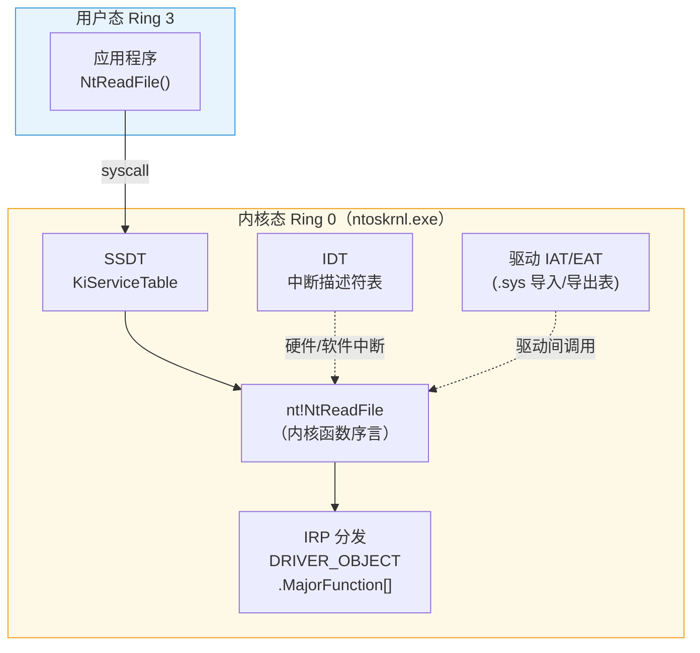
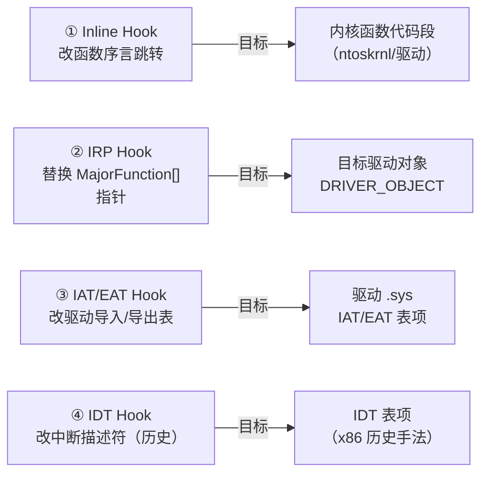

# Windows内核（10）· 内核Hook技术

## 概述与定位

> [!abstract] TL;DR
> 内核 Hook 是指在 Ring 0 级别**拦截或重定向执行路径**的技术总称，历史上被 Rootkit 广泛滥用，现代合法 EDR/反作弊已转向内核回调（第 09 章）而非侵入式 Hook。本章从防御与逆向分析视角讲透四类内核 Hook——**Inline Hook、IRP Hook、IAT/EAT Hook、IDT Hook**——的原理、x64 下 PatchGuard 的约束，以及蓝队如何检测已安装的 Hook。

内核 Hook 与用户态 Hook（见 [[32.hooks/02-windows-api-hook.md]]）在机制上高度相似，但影响范围截然不同：

| 维度 | 用户态 Hook | 内核 Hook |
|---|---|---|
| 运行级别 | Ring 3 | Ring 0 |
| 崩溃影响 | 进程级 | 全系统 BSOD |
| PatchGuard 约束 | 无 | 保护 SSDT/IDT/GDT/关键内核代码 |
| 现代 EDR 替代 | Userland Hooking | 内核回调 + minifilter |
| 典型检测手段 | 用户态完整性扫描 | `!chkimg`、MajorFunction 指针校验 |

**本章定位**：讲清每种 Hook 的结构与原理，重点放在"逆向时如何识别它""蓝队如何检测它"。武器化的落地步骤不在本章讨论范围内。

---

## 原理与机制

### Hook 类型全景

四类内核 Hook 作用于内核执行路径的不同层次：



四类 Hook 的切入点：



---

## 结构详解

### 一、Inline Hook

#### 原理

Inline Hook 直接**修改目标函数的机器码序言**，把原有指令替换为跳转指令，将执行流引向 Hook 处理函数。完成处理后可选择：
- 调用保存的原函数（"蹦床/Trampoline 模式"），实现透明拦截；
- 直接返回，完全拦截请求。

#### x86/x64 常见跳转编码

| 编码形式 | 字节 | 适用场景 |
|---|---|---|
| `E9 xx xx xx xx` | 5 字节 | 相对跳转（±2GB），x86/x64 均可 |
| `FF 25 00 00 00 00` + 8B 绝对地址 | 14 字节 | x64 绝对地址跳转（`jmp [rip+0]` + ptr） |
| `48 B8 addr; FF E0` | 12 字节 | `mov rax, abs_addr; jmp rax`，x64 常见 |

x64 推荐方式（12 字节序言覆盖）：

```nasm
; 被 Hook 的函数序言（修改后）
mov rax, 0xFFFFFFFF`DEADBEEF  ; 绝对地址（Hook 处理函数）
jmp rax                         ; 跳过去
; 后续原指令被保存到 Trampoline
```

#### Trampoline（蹦床）机制

```
原函数内存布局（修改前）:
  [+0x00] push rbp        ← 序言指令 1
  [+0x03] mov rbp, rsp    ← 序言指令 2
  [+0x06] ...             ← 正常函数体

修改后（Inline Hook 已装）:
  [+0x00] mov rax, HookFn ← 14B 跳转（覆盖原指令）
  [+0x0C] jmp rax
  [+0x0E] ...             ← 剩余原指令未动

Trampoline 缓冲区（分配的可执行内存）:
  [+0x00] push rbp        ← 保存的原序言（字节拷贝）
  [+0x03] mov rbp, rsp
  [+0x06] jmp [OrigFn+0x0E] ← 跳回原函数序言后的指令
```

> [!warning] 示例输出为示意
> 实际序言字节数因函数而异，跳转覆盖必须对齐指令边界，否则引发非法指令或 BSOD。

#### x64 PatchGuard 约束

**PatchGuard（KPP，Kernel Patch Protection）** 对 `ntoskrnl.exe`、`hal.dll` 等关键模块的代码段以及 SSDT/IDT/GDT 进行**周期性校验**（校验间隔随机）。若检测到这些受保护区域被修改，立即触发 `CRITICAL_STRUCTURE_CORRUPTION`（Bug Check 0x109）蓝屏。

因此，x64 下对受 PatchGuard 保护的内核函数（如 `nt!NtReadFile`）施加 Inline Hook **极高概率触发 BSOD**。

**未受保护函数的情形**：某些第三方驱动（非 `ntoskrnl.exe`）中的函数不在 PatchGuard 监控范围内，Inline Hook 仍可行但风险较高。EDR 产品在此场景下通常也放弃 Inline Hook，转而依赖内核回调（`PsSetCreateProcessNotifyRoutine`、`ObRegisterCallbacks` 等，见 [[09.内核回调机制]]）。

---

### 二、IRP Hook

#### 原理

每个 WDM 驱动通过 `DRIVER_OBJECT->MajorFunction[]` 数组（28 项）注册 IRP 处理例程（见 [[03.WDM驱动模型与IRP]]）。IRP Hook 的思路是：**找到目标驱动的 `DRIVER_OBJECT`，将其 `MajorFunction[N]` 指针替换为自己的处理函数**，从而截获该驱动的 I/O 请求。

```c
// IRP Hook 的逻辑示意（防御分析视角）
PDRIVER_OBJECT pTargetDrv;
ObReferenceObjectByName(TargetDriverName, ..., &pTargetDrv);

// 保存原 handler
OrigReadHandler = pTargetDrv->MajorFunction[IRP_MJ_READ];  // 索引 = 3

// 替换为 Hook 函数（写 Ring 0 内存，需先解除写保护）
pTargetDrv->MajorFunction[IRP_MJ_READ] = MyHookRead;
```

#### DRIVER_OBJECT 结构要点

```c
// WinDbg: dt nt!_DRIVER_OBJECT
typedef struct _DRIVER_OBJECT {
    SHORT              Type;                 // +0x00  = 4（驱动对象类型）
    SHORT              Size;                 // +0x02
    PDEVICE_OBJECT     DeviceObject;         // +0x08  设备对象链表头
    ULONG              Flags;                // +0x10
    PVOID              DriverStart;          // +0x18  驱动镜像基址
    ULONG              DriverSize;           // +0x20  镜像大小（字节）
    PVOID              DriverSection;        // +0x28  LDR_DATA_TABLE_ENTRY
    PDRIVER_EXTENSION  DriverExtension;      // +0x30
    UNICODE_STRING     DriverName;           // +0x38
    PUNICODE_STRING    HardwareDatabase;     // +0x48
    PFAST_IO_DISPATCH  FastIoDispatch;       // +0x50
    PDRIVER_INITIALIZE DriverInit;           // +0x58
    PDRIVER_STARTIO    DriverStartIo;        // +0x60
    PDRIVER_UNLOAD     DriverUnload;         // +0x68
    PDRIVER_DISPATCH   MajorFunction[IRP_MJ_MAXIMUM_FUNCTION + 1]; // +0x70 共28项
} DRIVER_OBJECT;
```

> [!warning] 示例输出为示意
> 偏移量在不同 Windows 版本可能变化，以 WinDbg `dt nt!_DRIVER_OBJECT` 实际输出为准。

#### 主要 IRP 功能码索引

| 宏常量 | 值 | 含义 |
|---|---|---|
| `IRP_MJ_CREATE` | 0x00 | 打开/创建设备 |
| `IRP_MJ_READ` | 0x03 | 读 |
| `IRP_MJ_WRITE` | 0x04 | 写 |
| `IRP_MJ_DEVICE_CONTROL` | 0x0E | IOCTL 控制 |
| `IRP_MJ_CLEANUP` | 0x12 | 句柄引用归零 |
| `IRP_MJ_CLOSE` | 0x13 | 关闭对象 |

IRP Hook 常见用途（合法/恶意均有）：

- **文件过滤**（历史手法，现代已由 minifilter 框架取代）：截获文件系统驱动的 `IRP_MJ_READ`/`WRITE`
- **网络拦截**（NDIS/TDI 时代）：替换网络驱动的 MajorFunction 指针
- **恶意隐藏**：通过拦截磁盘/文件系统 IRP 隐藏特定文件

#### 与 PatchGuard 的关系

`DRIVER_OBJECT->MajorFunction[]` 本身**不在 PatchGuard 的保护范围内**（PatchGuard 主要保护内核代码段与特定数据结构如 SSDT/IDT/GDT）。因此，IRP Hook 在 x64 上技术层面可行，但修改其他驱动对象属于危险操作：竞态条件可能导致原 handler 返回时崩溃，且易被安全软件检测。

---

### 三、IAT Hook 与 EAT Hook

#### 基础概念

驱动 `.sys` 文件本质上是**内核态 PE**（见 [[13.PE文件详解/00-合集总览-PE文件详解.md]]），拥有和普通 EXE/DLL 相同的 Import Address Table（IAT）与 Export Address Table（EAT）。

- **IAT Hook**：修改目标驱动 IAT 中某个函数的地址（例如把 `ntoskrnl!ExAllocatePoolWithTag` 的导入地址替换为 Hook 函数），从而在该驱动调用此函数时截获。
- **EAT Hook**：修改某个驱动/模块 EAT 中对外导出函数的地址，使其他调用方经由 EAT 索引到 Hook 函数。

#### IAT 结构回顾（内核驱动视角）

```
.sys 文件（内核态 PE）:
  .idata 节（或 IAT 位于 .rdata）:
    [ntoskrnl.exe]
      ExAllocatePoolWithTag  → 0xFFFFF800`XXXXXXXX  ← 可在此替换
      IoCreateDevice         → 0xFFFFF800`YYYYYYYY
      IoDeleteDevice         → 0xFFFFF800`ZZZZZZZZ
    [ntdll.dll]
      ...（驱动通常不依赖 ntdll，此处示意）
```

#### 与用户态 IAT Hook 的区别

| 维度 | 用户态 IAT Hook | 内核 IAT Hook |
|---|---|---|
| 目标 | EXE/DLL 的 IAT | .sys 驱动的 IAT |
| 写保护 | 通常需 `VirtualProtect` | 需关 CR0.WP 位或用 MDL 写 |
| 崩溃范围 | 进程 | 全系统（BSOD） |
| PatchGuard 影响 | 无 | 不直接保护第三方 IAT，但写内核内存本身有风险 |

> [!note] 关闭 CR0.WP 位的危险
> x86/x64 的 CR0 寄存器第 16 位（WP=Write Protect）控制内核是否能写只读页。历史上 Rootkit 通过 `cli; mov cr0, rax`（清 WP 位）绕过写保护修改内核只读数据，现代安全机制（SMEP/SMAP、HVCI）已使这一手法风险极高，在 HVCI 开启时会直接崩溃。

---

### 四、IDT Hook（历史手法）

#### 什么是 IDT

**中断描述符表（Interrupt Descriptor Table，IDT）** 是 x86/x64 架构的一张系统级表，由 CPU 的 `IDTR` 寄存器指向，共 256 项（`IDT[0..255]`），每项是一个 `INTERRUPT_GATE_DESCRIPTOR`（8 字节/x86，16 字节/x64），记录了对应中断/异常的处理程序入口地址和选择子。

典型 IDT 项：

```
IDT[0x0E] → nt!KiPageFault      （#PF 页错误，向量 14）
IDT[0x2E] → nt!KiSystemService  （x86 系统调用，INT 0x2E）
IDT[0x01] → nt!KiDebugTrapOrFault（#DB 调试陷阱）
```

#### IDT Hook 原理

在 x86 时代，Rootkit 通过：
1. 用 `sidt` 指令读取 IDTR，获得 IDT 基址；
2. 修改某项（如 `IDT[0x2E]` 用于系统调用拦截）的处理程序地址，指向自己的代码；
3. 自己的处理程序完成拦截后 `iret` 回原流程。

这样可以全局拦截系统调用（比 SSDT Hook 更底层）或特定异常。

#### 为何在 x64 已基本失效

1. **PatchGuard 直接保护 IDT**：x64 下 IDT 内容在 PatchGuard 的周期性校验范围内，修改 IDT 项 → `CRITICAL_STRUCTURE_CORRUPTION`（0x109）BSOD。
2. **x64 系统调用改为 `syscall`**：x64 Windows 不再使用 `INT 0x2E` 作为主要系统调用路径（改用 `syscall` 指令 + MSR `LSTAR`），IDT 拦截系统调用的意义已大幅下降。
3. **多核同步复杂**：IDT 是每个 CPU 各有一份，多核下需对每个处理器都修改。

因此，IDT Hook 在 x64 现代 Windows 上已成为纯粹的历史/研究话题，实际恶意样本极少采用。

---

## 防御分析

### 检测方法

#### 1. Inline Hook 检测：代码完整性比对

核心思路：**将内存中函数序言与磁盘上的原始镜像字节比对**，若不同则疑似被 Hook。

WinDbg 命令 `!chkimg`：

```
kd> !chkimg ntoskrnl.exe -v
```

> [!warning] 示例输出为示意
> 实际输出会列出每个发现差异的地址范围及前后字节。开启 SecureBoot/HVCI 的系统上，合法的内核代码段本应零差异；若存在差异，优先排查是否被 Inline Hook 或受 hotpatch 影响。

IDA/Ghidra 辅助分析恶意驱动时的比对思路：
1. 提取被分析驱动内存镜像（如进程转储中的 `.sys`）；
2. 对应磁盘上的原始 `.sys` 文件；
3. 比对函数头部前 16 字节，跳转指令 `E9`/`48 B8`/`FF 25` 开头即为可疑 Inline Hook 标志。

#### 2. IRP Hook 检测：MajorFunction 指针归属校验

检测 `DRIVER_OBJECT->MajorFunction[N]` 是否仍落在驱动自身的内存范围内：

```
kd> !drvobj \Driver\MyDriver
kd> dt nt!_DRIVER_OBJECT <地址>
```

> [!warning] 示例输出为示意
> 查看 `MajorFunction` 数组中每个指针，与驱动的 `DriverStart`/`DriverStart+DriverSize` 比对；若指针指向其他模块地址空间，则疑似 IRP Hook。

可配合 WinDbg 扩展或第三方工具（如 ARK/PCHunter 的"驱动 IRP"模块）自动化完成此比对。

```
; 检查指针归属的伪逻辑（分析脚本示意）
for each driver in loaded_modules:
    for i in range(IRP_MJ_MAXIMUM_FUNCTION + 1):
        handler = driver.MajorFunction[i]
        if not in_module_range(handler, driver):
            report("IRP Hook suspected: %s[%d] → %p", driver.name, i, handler)
```

#### 3. IAT/EAT Hook 检测

- **IAT 扫描**：读取驱动 IAT，每项与对应导出模块的实际导出地址比对；
- **EAT 扫描**：读取目标模块 EAT，与磁盘镜像对应 EAT 比对；
- 差异项即为 Hook 候选。

#### 4. 通用思路：扫描非常规跳转

在内核代码段（或已加载驱动区域）中扫描：
- 函数头部前 16 字节含 `E9`（相对 jmp）、`FF 25`（间接 jmp）、`48 B8 XX XX XX XX XX XX XX XX FF E0`（`mov rax, imm64; jmp rax`）等典型 Inline Hook 序言；
- 跳转目的地是否落在合法内核模块之内。

WinDbg 也可用 `u` 命令反汇编函数入口来人工确认：

```
kd> u nt!NtReadFile L5
```

> [!warning] 示例输出为示意
> 正常的函数序言应为标准 prologue（`push rbp`/`sub rsp, xx` 等），若首指令是 `jmp` 则基本可确认 Inline Hook。

---

### 与合法内核回调的对比

| 比较维度 | 侵入式 Hook（本章） | 合法内核回调（第 09 章） |
|---|---|---|
| 实现方式 | 直接改写内存/指针 | 系统 API 注册（`PsSetCreateProcessNotifyRoutine` 等） |
| PatchGuard 风险 | 高（受保护区域改写 → BSOD） | 无（官方接口，内部有支持） |
| 稳定性 | 低（竞态/版本兼容） | 高（系统管理回调链） |
| 卸载安全性 | 需精确恢复原字节/指针 | 系统 API 注销 |
| EDR/反作弊现状 | 已基本放弃 | 主流合法手段 |
| 恶意软件使用 | 仍有（IRP Hook 较多见） | 滥用（摘除其他驱动的回调） |
| 检测难度（蓝队） | 相对容易（比对字节/指针） | 较难（需比对合法注册列表） |

---

## 逆向分析实战

### 在 IDA/Ghidra 中识别恶意驱动的 Hook 行为

#### 1. 定位 DriverEntry，追踪 MajorFunction 写操作

恶意 IRP Hook 驱动通常在 `DriverEntry` 或初始化函数中：
1. 调用 `ObReferenceObjectByName` 或通过 IoGetDeviceObjectPointer 找到目标驱动对象；
2. 保存 `MajorFunction[N]` 原指针；
3. 将其替换为自己的函数地址。

**IDA 分析模式**：在 `DriverEntry` 处按 `x` 追引用，查找对 `DRIVER_OBJECT` 偏移 `0x70 + N*8` 的写操作（x64 下 MajorFunction[0] 位于 `+0x70`）。

#### 2. 查找跨模块写内存行为

Inline Hook 驱动必须向**其他模块的代码段**写入字节，这在静态分析中往往体现为：
- 调用 `MmGetSystemRoutineAddress` 或直接引用 `nt!NtXxx` 符号；
- 随后对该地址进行 DWORD/QWORD 写（`[rax] = ...`）；
- 写入值中含有跳转操作码（`0xE9`/`0x48 0xB8` 等）。

> [!note] 识别 CR0 写操作
> 在 x64 反汇编中，`mov cr0, rax` 为 `0F 22 C0`，其前后出现对 `cr0` 读（`0F 20 C0`）和写，且中间对某地址写内存——即为经典"关写保护+Inline Hook+开写保护"三连操作，是高度可疑的恶意行为标志。

#### 3. WinDbg 动态验证

对可疑驱动加载后，在内核调试器中：

```
kd> lm m suspicious_driver
kd> !drvobj \Driver\SuspiciousDriver 7
kd> u <MajorFunction 指针地址> L8
```

> [!warning] 示例输出为示意
> `!drvobj` 的第二个参数 `7` 会同时显示 IRP 处理例程列表；`u` 命令确认每个 handler 函数的实际入口字节。

---

## 安全性与正确使用

### 检测建议汇总

蓝队/DFIR 场景下的内核 Hook 检测清单：

| 检测类型 | 工具/方法 | 关注点 |
|---|---|---|
| Inline Hook | WinDbg `!chkimg`、内存 vs 磁盘字节比对 | 函数序言头部 16 字节差异 |
| IRP Hook | `!drvobj` + MajorFunction 指针归属 | 指针是否离开驱动自身地址范围 |
| IAT/EAT Hook | PE 解析工具 + 运行时地址比对 | IAT 条目地址与正常导出地址差异 |
| IDT 异常 | WinDbg `!idt`、`r idtr` | IDT 项是否仍指向合法内核模块 |
| 通用跳转扫描 | 自动化 ARK 工具（PCHunter/WKE） | 代码段头部非常规跳转指令 |
| 行为监控 | ETW（ETW-Ti）、Kernel Sensor | 内核内存写事件、CR0 修改事件 |

#### WinDbg 快速检查 IDT

```
kd> !idt -a
```

> [!warning] 示例输出为示意
> 输出会列出所有 256 个 IDT 项对应的处理程序地址与函数名，检查是否存在指向未知模块地址的项。

### 合规边界

> [!caution] 合规边界
> 本章所有内容面向**防御、检测与恶意驱动分析**：
> - **允许**：在受控实验环境/虚拟机中理解 Hook 机制、分析捕获的恶意驱动样本、搭建 EDR/蓝队检测能力。
> - **不允许**：对他人生产系统或未经授权的系统安装内核 Hook；绕过 PatchGuard/DSE 以部署持久化内核 Hook 的落地步骤不在本系列讨论范围。
> - x64 Windows 上的受保护区域（SSDT/IDT/GDT/关键内核代码）受 PatchGuard 保护，任何篡改均触发 BSOD，合法内核安全组件（EDR/AV）已全面转向官方回调机制。

---

## 小结

| 要点 | 结论 |
|---|---|
| Inline Hook 在 x64 上的命运 | 受 PatchGuard 保护的函数不可 Hook；第三方驱动未受保护但风险极高 |
| IRP Hook | `DRIVER_OBJECT->MajorFunction[]` 不受 PatchGuard 直接保护，技术可行，但易被指针归属检测发现 |
| IAT/EAT Hook | 针对特定驱动的函数调用截获，影响范围有限；同样不受 PatchGuard 直接保护 |
| IDT Hook | x64+PatchGuard 下几乎不可用；历史技术 |
| 现代 EDR 的选择 | minifilter + 内核回调（第 09 章）+ ETW-Ti，完全绕开侵入式 Hook |
| 蓝队核心武器 | `!chkimg`、`!drvobj`、`!idt`、MajorFunction 指针归属校验、跨内核 ARK 扫描 |

内核 Hook 技术的历史演进清晰地说明了一点：侵入式的代码/指针篡改在 x64 PatchGuard 时代已成为高风险赌注，而系统提供的官方可扩展点（回调、minifilter、ETW）才是合法内核安全产品的正确路线。从防御角度理解这些 Hook 的原理，正是识别恶意驱动行为的基础。

---

## 相关阅读

- [[32.hooks/02-windows-api-hook.md]] — 用户态视角的 Inline/IAT/EAT Hook 完整实现（对照学习）
- [[32.hooks/00.总览.md]] — Hook 技术总览
- [[09.内核回调机制]] — 合法内核可观测点（与本章侵入式 Hook 形成对比）
- [[08.SSDT与系统调用表]] — SSDT Hook 原理与 x64 限制（对抗篇上篇）
- [[12.PatchGuard与DSE与HVCI]] — PatchGuard 机制深入（本章多次引用）
- [[11.Rootkit原理与检测]] — DKOM 等更多内核隐藏手法（下篇）
- [[03.WDM驱动模型与IRP]] — DRIVER_OBJECT/IRP 基础（IRP Hook 前置知识）
- [[13.PE文件详解/00-合集总览-PE文件详解.md]] — IAT/EAT 结构详解（PE 系列）
- [[13.PE文件详解/08-详解PE文件(八)：导入表.md]] — 导入表与 IAT 结构
- [[34.现代二进制防护机制/10.Windows防护体系.md]] — SMEP/HVCI/kCFG 缓解机制
- [[44.调试器原理与实战/10.WinDbg与x64dbg.md]] — WinDbg 使用参考

---

⬅️ 上一篇 [[09.内核回调机制]] ｜ 🏠 [[00.Windows内核与驱动逆向总览]] ｜ 下一篇 [[11.Rootkit原理与检测]] ➡️
