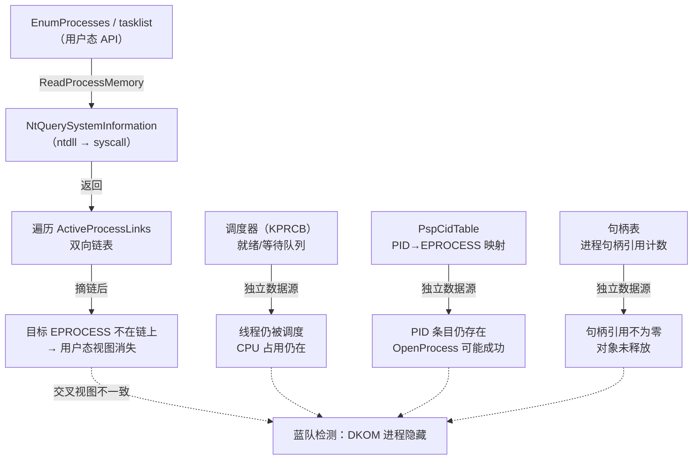
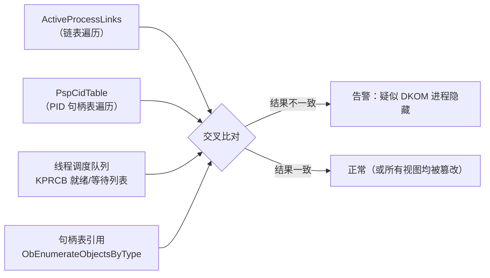

# Windows内核（11）· Rootkit原理与检测

## 概述与定位

> [!abstract] TL;DR
> Rootkit 是一类以"隐身"为核心目标的恶意软件技术——进程、文件、网络连接、驱动模块都可以从系统管理员和安全工具的视野中消失。内核态 Rootkit（驱动级）通过直接操纵内核数据结构（DKOM）绕过所有用户态 API，是最难检测的一类。蓝队检测的核心思路是**交叉视图（cross-view）**：对比多个独立数据源，任何不一致就是隐藏的线索。本篇站在**防御与取证**角度，讲清 DKOM 原理与各类检测方法，不提供可落地的隐藏/持久化武器化步骤。

### 本篇在系列中的位置

本篇承接 [[10.内核Hook技术]]（内核 Hook 也是 Rootkit 常用手段），是对抗篇的核心一环：

- 上游：[[08.SSDT与系统调用表]] → [[09.内核回调机制]] → [[10.内核Hook技术]]
- 本篇：Rootkit 原理（DKOM 摘链）+ 检测（交叉视图 / 内存取证）
- 下游：[[12.PatchGuard与DSE与HVCI]]（PatchGuard 对部分篡改的限制）

内核对象基础见 [[05.内核对象与句柄]]；调试验证见 [[07.WinDbg内核调试]]。

---

## 原理与机制

### Rootkit 分类概览

Rootkit 按运行权限可分为两大层次：

```
用户态 Rootkit（Ring 3）
  ├─ API Hook（IAT/EAT/inline）
  └─ DLL 注入（劫持用户进程上下文）

内核态 Rootkit（Ring 0）
  ├─ DKOM（Direct Kernel Object Manipulation）
  ├─ SSDT Hook（历史手法，x64 受 PatchGuard 限制）
  ├─ IRP Hook（filter driver / minifilter 滥用）
  └─ 驱动摘链（从 PsLoadedModuleList 隐藏模块）
```

按**隐藏目标**分：

| 隐藏目标 | 典型手法 | 蓝队观察点 |
|---|---|---|
| 进程隐藏 | DKOM 摘 `ActiveProcessLinks` | `PspCidTable` / 线程调度队列 / 句柄引用 |
| 驱动/模块隐藏 | 摘 `PsLoadedModuleList` | `MmLoadedUserImageList` / 内存扫描 |
| 文件隐藏 | minifilter 过滤 IRP 返回结果 / NTFS 直接操作 | 卷影副本 / 离线挂载取证 |
| 网络连接隐藏 | NDIS 过滤 / TDI/WFP 回调过滤 | PCAP/内核 socket 表扫描 |
| 注册表隐藏 | `CmRegisterCallback` 过滤查询结果 | 离线 hive 挂载 / 原始字节比对 |

> [!caution] 合规边界
> 本系列对抗章节一律取**防御与分析视角**。下文机制分析面向**蓝队取证与恶意样本分析**，不提供构建隐藏进程/持久化 Rootkit 的可落地步骤。

### DKOM 摘链隐藏进程——Mermaid 概览



---

## 机制详解

### EPROCESS 结构与 ActiveProcessLinks

每个 Windows 进程在内核中对应一个 `EPROCESS` 结构体（Executive Process Block）。进程管理器通过一条**双向循环链表**把所有 `EPROCESS` 串联起来，链表头由全局变量 `PsActiveProcessHead` 持有。

用 WinDbg 查看结构：

```
kd> dt nt!_EPROCESS
   +0x000 Pcb              : _KPROCESS
   +0x438 UniqueProcessId  : Ptr64 Void
   +0x440 ActiveProcessLinks : _LIST_ENTRY   ← 双向链表节点
   +0x450 Flags2           : Uint4B
   ...
   +0x4b8 Token            : _EX_FAST_REF
   +0x530 ObjectTable      : Ptr64 _HANDLE_TABLE
   +0x5e0 DirectoryTableBase : Uint8B        ← CR3
   ...
```

> [!warning] 示例输出为示意
> 上述偏移基于 Windows 10 22H2 x64 ntoskrnl，不同版本偏移有差异，实际调试以当前符号为准。

`ActiveProcessLinks` 是一个 `LIST_ENTRY`，包含 `Flink`（前向指针）和 `Blink`（后向指针），指向**链表中下一个/上一个 EPROCESS 的 ActiveProcessLinks 成员**（而非 EPROCESS 起始地址）。

遍历时要减去 `ActiveProcessLinks` 的偏移才能得到 EPROCESS 基址：

```
EPROCESS_base = ActiveProcessLinks.Flink - FIELD_OFFSET(EPROCESS, ActiveProcessLinks)
```

### DKOM 摘链操作原理

DKOM 的经典操作是把目标进程的 `EPROCESS` 从 `ActiveProcessLinks` 双向链表中摘除——前驱节点的 `Flink` 跳过它，后继节点的 `Blink` 也跳过它：

```
摘链前：
  EPROCESS_A.Flink → EPROCESS_target.ActiveProcessLinks
  EPROCESS_target.Flink → EPROCESS_B.ActiveProcessLinks
  EPROCESS_B.Blink → EPROCESS_target.ActiveProcessLinks
  EPROCESS_A.Blink ← EPROCESS_target.ActiveProcessLinks

摘链后：
  EPROCESS_A.Flink → EPROCESS_B.ActiveProcessLinks   （直接连 B）
  EPROCESS_B.Blink → EPROCESS_A.ActiveProcessLinks   （直接连 A）
  EPROCESS_target.Flink/Blink 可以指向自身（自环）
```

操作伪代码（基于公开内核符号，仅用于理解机制）：

```c
// 伪代码：展示摘链逻辑，仅供机制理解
LIST_ENTRY *entry = &target_eprocess->ActiveProcessLinks;
LIST_ENTRY *prev  = entry->Blink;
LIST_ENTRY *next  = entry->Flink;

prev->Flink = next;   // 前驱跳过 target
next->Blink = prev;   // 后继跳过 target

// 可选：让 target 自环，防止遍历时崩溃
entry->Flink = entry;
entry->Blink = entry;
```

**摘链后的效果**：`NtQuerySystemInformation(SystemProcessInformation)` 的内核实现会从 `PsActiveProcessHead` 开始遍历 `ActiveProcessLinks`，目标进程因不在链上而不被返回——用户态的 `EnumProcesses`、`tasklist`、任务管理器全部失明。

### 为何摘链后进程"不能真正消失"

摘链只是从**一个**管理链表中移除，内核中还有多个独立的进程引用路径：

| 数据源 | 说明 | 摘链后状态 |
|---|---|---|
| `ActiveProcessLinks` | 进程管理主链表，`NtQuerySystemInformation` 遍历 | **已摘除** → 用户态不可见 |
| `PspCidTable` | PID/CID 到对象指针的句柄表，`OpenProcess(PID)` 查这里 | **仍存在** → 知道 PID 仍可打开 |
| 线程调度队列 | `KPRCB` 的就绪/延迟/等待队列，调度器独立运行 | **仍存在** → 线程持续被调度 |
| 句柄引用计数 | `OBJECT_HEADER.PointerCount`，对象引用不为零 | **仍存在** → 对象不会被释放 |
| 内存池 | EPROCESS 对象仍在非分页池中 | **仍存在** → 池标记扫描可找到 |
| NMI/DPC 栈帧 | 调试器或性能监控可见调用栈 | **仍存在** → WinDbg `!thread` 可遍历 |

这就是"交叉视图检测"的理论基础——只要对比多个独立数据源，摘链产生的不一致就会暴露隐藏。

### 驱动模块隐藏：从 PsLoadedModuleList 摘链

驱动加载后，`ntoskrnl.exe` 通过 `PsLoadedModuleList`（类型为 `LIST_ENTRY`）维护一条内核模块链表，每个节点是 `LDR_DATA_TABLE_ENTRY`：

```
kd> dt nt!_LDR_DATA_TABLE_ENTRY
   +0x000 InLoadOrderLinks    : _LIST_ENTRY  ← 在 PsLoadedModuleList 中
   +0x010 InMemoryOrderLinks  : _LIST_ENTRY
   +0x020 InInitializationOrderLinks : _LIST_ENTRY
   +0x030 DllBase             : Ptr64 Void   ← 驱动加载基址
   +0x038 EntryPoint          : Ptr64 Void
   +0x040 SizeOfImage         : Uint4B
   +0x048 FullDllName         : _UNICODE_STRING
   +0x058 BaseDllName         : _UNICODE_STRING
   ...
```

> [!warning] 示例输出为示意

恶意驱动将自己的 `LDR_DATA_TABLE_ENTRY.InLoadOrderLinks` 从 `PsLoadedModuleList` 摘链后：

- `lm`（WinDbg `list modules`）不再显示
- `NtQuerySystemInformation(SystemModuleInformation)` 不返回
- 用户态 `EnumDeviceDrivers` / Process Hacker 模块视图中消失

但驱动代码仍在内存中执行，仍在处理 IRP，依然被调度器运行。

---

## 检测分析

### 交叉视图（Cross-View）检测原理

交叉视图检测的核心思想：**单一数据源可以被篡改，但多个独立数据源同时被篡改的代价指数级上升**。蓝队工具或 EDR 从多个维度枚举进程，取交集/差集：



**`PspCidTable`** 是检测 DKOM 进程隐藏最有效的对立视图之一：它是内核维护的一张 CID（Client ID，即 PID/TID）→ 内核对象指针的句柄表，结构独立于 `ActiveProcessLinks`，直接通过 PID 查找 EPROCESS 指针。摘链操作不会改变 `PspCidTable`，因此：

- 如果某个 PID 在 `PspCidTable` 中存在但不在 `ActiveProcessLinks` 遍历结果中 → 高度疑似 DKOM 隐藏

WinDbg 中枚举 PspCidTable（需解析句柄表层级结构，此处展示思路）：

```
kd> !process 0 0                  ← 遍历 ActiveProcessLinks
kd> dq nt!PspCidTable L1          ← 查 PspCidTable 地址（示意）
kd> !handle 0 0 <pid> Process      ← 用 PID 查句柄（示意）
```

> [!warning] 示例输出为示意

### psscan vs pslist：Volatility 的两种进程枚举

内存取证工具 Volatility 提供了两种进程枚举插件，恰好对应交叉视图检测：

| 插件 | 枚举方式 | 能找到 DKOM 隐藏进程？ |
|---|---|---|
| `pslist` | 遍历 `ActiveProcessLinks` 双向链表（走链表） | **否**（摘链后不在链上） |
| `psscan` | 扫描物理内存中的池标记 `Proc`（走池扫描） | **是**（进程对象仍在内存池中） |
| `pstree` | `pslist` 的树形展示 | 否 |
| `cmdline` | 从 PEB 读命令行 | 仅对 pslist 可见进程 |

**池标记（Pool Tag）扫描**：Windows 内核非分页池分配器（`ExAllocatePoolWithTag`）在每次分配时会在块头部写入 4 字节 Tag。EPROCESS 对象的池标记是 `Proc`（`0x636F7250`，ASCII "corP" 反序）。即使进程从 `ActiveProcessLinks` 摘链，其 EPROCESS 对象依然在非分页池中，Tag 依然存在。Volatility `psscan` 扫描物理内存页寻找 `Proc` 标记，再验证候选地址的 EPROCESS 字段合理性，从而发现被隐藏的进程。

```
# Volatility 3 使用示例（示意）
python3 vol.py -f memory.dmp windows.pslist   # 走链表，看不到隐藏进程
python3 vol.py -f memory.dmp windows.psscan   # 走池扫描，能看到隐藏进程

# 对比两个结果找出差集（psscan 有但 pslist 没有的 PID）
```

> [!warning] 示例输出为示意，需配合实际内存转储文件执行

`psscan` 和 `pslist` 结果差集中出现的 PID，是 DKOM 隐藏进程的强指标。

### 线程调度视图检测

内核调度器（`KPRCB`，Kernel Processor Control Block per-CPU）维护就绪队列和等待列表，独立于进程链表。被 DKOM 摘链的进程其线程依然在调度：

- WinDbg `!thread` 遍历内核线程链（`nt!PsActiveProcessHead` 对应的线程侧）
- 若某线程 `ETHREAD.ThreadListEntry` 指向的进程不在 `ActiveProcessLinks` 中 → 异常

Volatility 的 `thrdscan`（线程池标记 `Thre` 扫描）可独立于进程链表找到所有线程：

```
python3 vol.py -f memory.dmp windows.thrdscan
```

通过 `ETHREAD.Tcb.Process` 字段追溯宿主进程，与 `pslist` 对比，可发现"线程存在但宿主进程不在链表"的情形。

### 句柄表与对象引用视图

Windows 内核为每个进程维护一张句柄表（`_HANDLE_TABLE`），并通过 `Object Manager` 的引用计数管理对象生命周期。`ObEnumerateObjectsByType` 可以枚举系统中所有 Process 类型对象（需内核权限），独立于 `ActiveProcessLinks`。

EDR 驱动可在内核中利用此 API 对比两视图，发现不一致时记录告警。

### 驱动模块隐藏的检测

针对从 `PsLoadedModuleList` 摘链的驱动，检测思路与进程类似：

| 检测方法 | 原理 |
|---|---|
| 内存扫描 `MZ/PE` | 扫描内核地址空间的 `MZ` 头，与 `lm` 结果对比 |
| `MmLoadedUserImageList` 交叉对比 | 另一条独立模块链表 |
| Volatility `modules` vs `modscan` | `modules` 走链表，`modscan` 走池标记 `MmLd` 扫描 |
| WinDbg `!drivers` | 枚举 Device/Driver 对象树，不完全依赖模块链表 |

```
# Volatility 模块检测（示意）
python3 vol.py -f memory.dmp windows.modules    # 走 PsLoadedModuleList
python3 vol.py -f memory.dmp windows.modscan    # 走池标记扫描
```

> [!warning] 示例输出为示意

### Volatility 完整工作流（取证）

针对疑似感染内核 Rootkit 的系统，内存取证标准流程：

```
1. 采集内存转储
   - 生产环境：DumpIt、WinPmem、Magnet RAM Capture
   - 虚拟机：直接挂起 VM 获取 .vmem
   - WinDbg 附加后 .dump /f /ka memory.dmp

2. 识别操作系统版本
   python3 vol.py -f memory.dmp windows.info

3. 进程枚举交叉对比
   python3 vol.py -f memory.dmp windows.psscan > psscan.txt
   python3 vol.py -f memory.dmp windows.pslist > pslist.txt
   diff psscan.txt pslist.txt   ← 差集即疑似隐藏进程

4. 线程扫描
   python3 vol.py -f memory.dmp windows.thrdscan

5. 模块扫描
   python3 vol.py -f memory.dmp windows.modscan

6. 进程内存扫描（找注入代码）
   python3 vol.py -f memory.dmp windows.malfind

7. 导出可疑进程内存分析
   python3 vol.py -f memory.dmp windows.dumpfiles --pid <PID>
```

> [!warning] 示例输出为示意，实际命令依 Volatility 版本和 profile/ISF 而定

### 其他检测工具

| 工具 | 检测能力 | 说明 |
|---|---|---|
| **Volatility** | 内存取证全套（psscan/modscan/malfind） | 离线分析，黄金标准 |
| **GMER**（历史） | 早期 Windows Rootkit 检测，交叉视图 | Win 7/XP 时代主力，Win 10/11 已过时 |
| **EDR（CrowdStrike/SentinelOne 等）** | 内核驱动实时行为监控 + 交叉视图 | 现代主流防御，内核组件持续监控 |
| **PatchGuard 副作用** | 若 Rootkit 修改 SSDT/GDT/关键代码 → BSOD `CRITICAL_STRUCTURE_CORRUPTION` | 对 DKOM（数据篡改，非代码篡改）无直接保护 |
| **WinDbg `!process 0 0`** | 遍历 `ActiveProcessLinks` | 配合 `!thread` 交叉使用 |
| **Process Hacker / System Informer** | 用户态多路枚举，内置交叉视图检测 | 可见部分异常，深度依赖内核驱动辅助 |

---

## 安全性与正确使用

### 检测与取证建议（蓝队）

**防御纵深**：不要依赖单一枚举 API。EDR/HIDS 应在内核层注册回调（`PsSetCreateProcessNotifyRoutineEx`）实时记录进程创建事件，配合定期的内存交叉视图扫描，形成：

1. **实时层**：进程/线程/镜像加载回调（见 [[09.内核回调机制]]）——创建时即记录，摘链也无法抹去历史
2. **定期扫描层**：内核驱动周期性对比 `ActiveProcessLinks` vs `PspCidTable` vs 线程队列
3. **取证层**：内存转储 + Volatility `psscan`/`modscan`/`malfind`

**PatchGuard 与 DKOM 的关系**：PatchGuard（KPP）保护的是**代码与关键只读结构**（SSDT/IDT/GDT/关键内核代码段），而 `ActiveProcessLinks` 是**内核数据**，PatchGuard 不直接覆盖。因此 DKOM 不会直接触发 PatchGuard BSOD，但若 Rootkit 同时修改 SSDT 做 Hook 则会。这也是现代内核 Rootkit 偏向纯数据篡改（DKOM）而非代码 Hook 的原因之一。

**内存完整性（HVCI）与 DKOM**：HVCI（Hypervisor Protected Code Integrity）通过 VBS 强制内核代码不可写，防止代码注入和 Kernel Patch。但 DKOM 是数据修改（链表指针），HVCI 对此同样无直接保护。从防御角度，HVCI 主要阻断未签名驱动加载（配合 DSE），间接减少 Rootkit 的落脚点。

### 合规边界

> [!caution] 合规边界
> 本篇讲解的 DKOM 原理与检测分析面向以下**合法场景**：
> - **蓝队防御**：理解攻击机制以设计检测规则
> - **恶意驱动样本分析**：取证分析已知恶意样本
> - **EDR/HIDS 开发**：实现交叉视图检测功能
> - **CTF / 安全研究**：在**自有受控环境**中复现与研究
>
> **本篇不提供**：针对他人系统的进程/驱动/文件隐藏步骤，不提供持久化 Rootkit 构建指南，不提供绕过 EDR 检测的可落地技术细节。
>
> 任何在**未经授权**的系统上实施内核级隐藏操作均属违法，可能触犯《网络安全法》《计算机信息系统安全保护条例》等法律法规。

---

## 小结

| 知识点 | 核心要点 |
|---|---|
| Rootkit 分类 | 用户态（API Hook/DLL注入）vs 内核态（DKOM/驱动级），内核态权限最高最难检测 |
| DKOM 摘链 | 把 `EPROCESS.ActiveProcessLinks` 从双向循环链表摘除 → 用户态 `NtQuerySystemInformation` 遍历失明 |
| 为何不能真消失 | `PspCidTable`/调度队列/句柄引用/内存池均保留 → 多个独立数据源暴露隐藏 |
| 驱动隐藏 | 摘 `PsLoadedModuleList`（`LDR_DATA_TABLE_ENTRY.InLoadOrderLinks`），模块从 `lm` 消失但代码仍执行 |
| 交叉视图检测 | 对比 `ActiveProcessLinks` vs `PspCidTable` vs 线程调度队列 vs 句柄引用，任意不一致即告警 |
| psscan vs pslist | `pslist` 走链表（看不到摘链进程），`psscan` 走池标记 `Proc` 扫描（能找到隐藏进程） |
| Volatility 取证 | `psscan`/`thrdscan`/`modscan`/`malfind` 联合使用，差集指示隐藏对象 |
| PatchGuard 关系 | PatchGuard 保护代码/只读结构，DKOM 是数据篡改，不直接触发 KPP，但同时做 SSDT Hook 会触发 |

---

## 相关阅读

- [[05.内核对象与句柄]]——EPROCESS/ETHREAD 结构体、Object Manager、句柄表基础
- [[09.内核回调机制]]——实时监控进程/模块创建的合法内核可观测点（EDR 防御基础）
- [[07.WinDbg内核调试]]——`!process`/`!thread`/`dt nt!_EPROCESS`/`lm` 交叉验证实操
- [[10.内核Hook技术]]——Rootkit 另一类手段：inline/SSDT/IRP Hook（防御视角）
- [[12.PatchGuard与DSE与HVCI]]——KPP/DSE/HVCI 对内核完整性的防护
- [[34.现代二进制防护机制/10.Windows防护体系]]——Windows 安全防护全景
- [[44.调试器原理与实战/10.WinDbg与x64dbg]]——WinDbg 内核调试深入

---

⬅️ 上一篇 [[10.内核Hook技术]] ｜ 🏠 [[00.Windows内核与驱动逆向总览]] ｜ 下一篇 [[12.PatchGuard与DSE与HVCI]] ➡️
