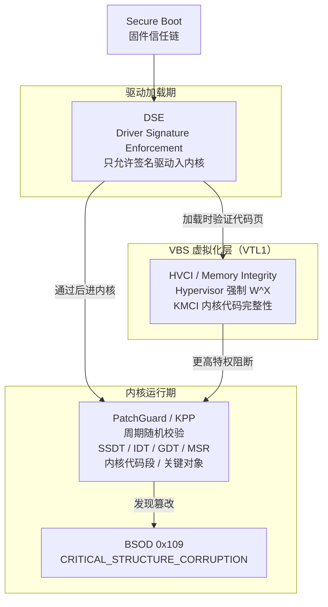
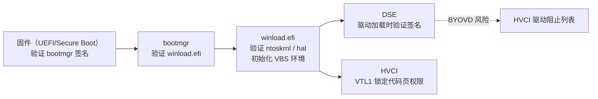
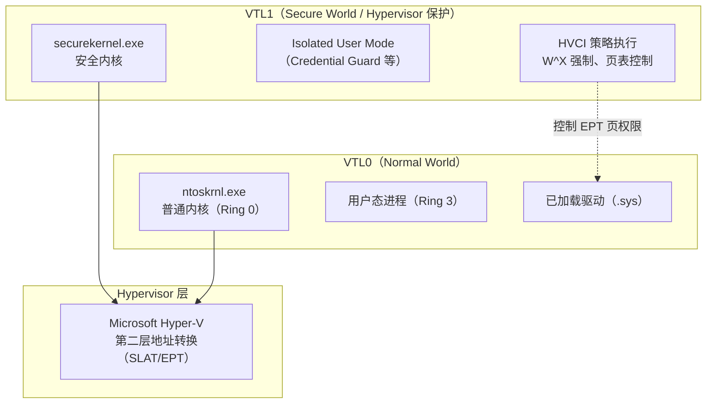
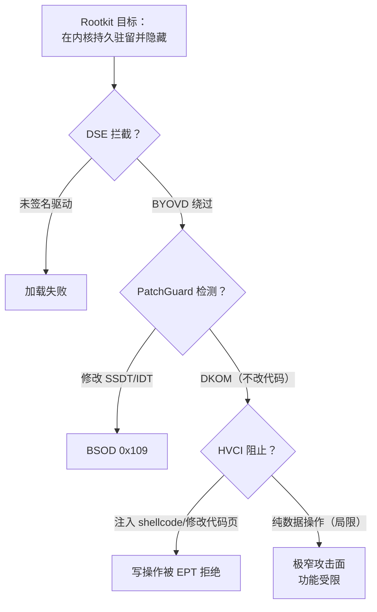

# Windows内核（12）· PatchGuard与DSE与HVCI

## 概述与定位

> [!abstract] TL;DR
> Windows x64 内核的三道防线：**DSE（Driver Signature Enforcement）** 把住"谁能进内核"——只允许经签名的驱动加载；**PatchGuard（KPP，Kernel Patch Protection）** 把住"进了内核别乱改"——周期性随机校验关键结构与代码，发现篡改即 BSOD `CRITICAL_STRUCTURE_CORRUPTION`（BugCheck `0x109`）；**HVCI（Hypervisor-enforced Code Integrity）** 则把代码完整性校验提升到虚拟化层（VTL1）——即使攻击者拿到了内核写原语，也无法让未签名的页变为可执行。三者构成"签名准入 → 运行期完整性 → 虚拟化级强制"的纵深信任链，是理解为什么现代内核 Rootkit/Hook 如此难做的关键。

本篇面向防御与分析视角：讲清每层机制的实现原理、EDR/反作弊如何借力、蓝队如何检测。**不提供绕过 PatchGuard 或 DSE 的可落地步骤。**

---

## 原理与机制

### 三层防护关系总览



> 一句话：**DSE 管谁能加载，PatchGuard 管加载后别乱改，HVCI 用虚拟化把代码完整性提到 hypervisor 层（最强防线）。**

### 信任链：Secure Boot → DSE → HVCI



---

## 机制详解

### 一、DSE — 驱动签名强制

#### 签名要求

DSE 在 Windows Vista x64 起默认强制：内核驱动（`.sys`）必须持有有效的**代码签名证书**，且签名链最终可信到微软认可的根 CA。生产级驱动还需通过 **WHQL（Windows Hardware Quality Labs）** 认证——微软在签名前会在测试实验室跑驱动，通过后颁发微软内嵌的**跨签名（Cross-signing）**。

| 签名类型 | 使用场景 | 加载条件 |
|---|---|---|
| WHQL / EV + 微软交叉签名 | 生产驱动 | 默认允许 |
| 自签 / 本地 CA | 开发调试 | 需开启测试签名模式 |
| 测试签名（`bcdedit /set testsigning on`） | 内核调试与开发 | 仅测试机，显示"测试模式"水印 |

#### 测试签名模式

```cmd
REM 开启测试签名（需管理员，重启生效）
bcdedit /set testsigning on

REM 关闭
bcdedit /set testsigning off
```

> [!warning] 示例输出为示意
> ```
> The operation completed successfully.
> ```
> 重启后桌面右下角出现"测试模式 Windows 10/11"水印。**测试签名仅用于本机开发调试，不适用于生产部署。**

开启测试签名后，可用 `makecert`、`signtool` 等工具为自开发驱动签名并加载。内核调试器（WinDbg KD 或 -nointegritychecks）也可在受控测试环境下绕过签名检查——**仅限自有测试机**。

#### 内部实现：`ci.dll` 与 `g_CiEnabled`

DSE 的核心在 `ci.dll`（Code Integrity）。加载器（`ntoskrnl!MmLoadSystemImage`）调用 `ci!CiValidateImageData` / `ci!CiValidateFileObject` 验证驱动 PE 的**验证码（Authenticode）签名**；`g_CiEnabled` 全局变量控制验证开关（默认为 `1`）。签名验证失败时，加载器返回 `STATUS_INVALID_IMAGE_HASH`（`0xC0000428`），驱动无法进入内存。

WinDbg 观察（内核调试器附加状态）：

```windbg
kd> x ci!g_CiEnabled
fffff803`12340abc ci!g_CiEnabled = 0n1

kd> dt nt!_LDR_DATA_TABLE_ENTRY
   +0x000 InLoadOrderLinks : _LIST_ENTRY
   +0x010 InMemoryOrderLinks : _LIST_ENTRY
   +0x020 InInitializationOrderLinks : _LIST_ENTRY
   +0x030 DllBase          : Ptr64 Void
   +0x038 EntryPoint       : Ptr64 Void
   +0x040 SizeOfImage      : Uint4B
   +0x048 FullDllName      : _UNICODE_STRING
   +0x058 BaseDllName      : _UNICODE_STRING
   ...
```

> [!warning] 示例输出为示意
> 上述地址为示例值，实际地址因 KASLR 而异。

#### BYOVD — 带入你自己的脆弱驱动

**BYOVD（Bring Your Own Vulnerable Driver）** 是当前内核威胁的热点手法：攻击者将一个**已签名但含内核漏洞**的合法驱动（如老版本的反作弊/硬件驱动）带入目标系统，利用其漏洞（任意读写、提权等）在内核中执行恶意操作——DSE 被合法签名绕过，PatchGuard 仍在运行但攻击者已获内核原语。

**防御视角：微软易受攻击驱动阻止列表**

微软维护并随 Windows 更新推送**驱动阻止列表**（`VulnerableDriverBlockList`）。HVCI 开启时，该列表由 Hypervisor 在更高特权层执行——即使在内核层也无法加载名单上的驱动。

| 阻止列表机制 | 控制位置 | 效果 |
|---|---|---|
| `VulnerableDriverBlockList`（注册表策略） | 内核层（ci.dll） | 驱动被拒绝加载 |
| HVCI + 驱动阻止列表 | VTL1（hypervisor） | 更高特权，更难规避 |
| Windows Defender 应用控制（WDAC） | 策略层 | 可自定义白/黑名单 |

蓝队检测：定期对比已加载驱动（`lm` 输出 / `DriverView`）与已知脆弱驱动列表；监控 `System` 事件日志中的驱动加载事件（事件 ID 6）。

---

### 二、PatchGuard — 内核补丁保护

#### 核心思想

PatchGuard（内部称 **KPP，Kernel Patch Protection**）是 Windows x64 内核的自我完整性校验机制，从 Windows XP x64 / Server 2003 x64 起引入。其目标是阻止内核代码或关键数据结构在运行时被篡改——无论是恶意 Rootkit、Hook 还是任何第三方修改。

> 设计哲学：x64 用户群不再依赖内核 API Hook（SSDT Hook 等旧手法），因此 PatchGuard 可以合理断言"内核结构在初始化后不应被修改"，发现修改即视为系统被入侵。

#### 校验对象

PatchGuard 周期性、随机化地校验以下关键结构（防御视角完整列表）：

| 校验对象 | 说明 |
|---|---|
| **SSDT（`nt!KiServiceTable`）** | 系统调用派发表，Rootkit 历史上最常篡改 |
| **IDT（中断描述符表，`nt!KiIdtBase`）** | 中断处理例程入口 |
| **GDT（全局描述符表）** | 段描述符，x64 下仍需保护 |
| **关键 MSR** | 如 `LSTAR`（`KiSystemCall64` 地址）、`STAR`、`SFMASK` |
| **内核代码段** | `ntoskrnl.exe` 的 `.text` 节（只读可执行段） |
| **`PsLoadedModuleList`** | 已加载模块链表，DKOM 类 Rootkit 可能篡改 |
| **`PsActiveProcessHead`** | 活动进程链表（`EPROCESS.ActiveProcessLinks` 链头） |
| **`KeServiceDescriptorTable`** | SSDT 描述符表本身 |
| **若干关键内核对象** | 如 `ObpTypeObjectType` 等对象类型数组 |

#### 实现特征（原理层，不教绕过）

PatchGuard 在实现上具备多重反分析特征，目的是让安全研究人员和 Rootkit 难以定位校验逻辑：

1. **随机化调度**：校验触发时间随机，不固定在某个内核线程或定时器回调；
2. **多重伪装**：校验代码分散在内核多个位置，并经过混淆/加密（解密后执行，执行后再加密）；
3. **延迟触发**：发现篡改后不立即触发 BSOD，存在随机延迟；
4. **自我保护**：校验 PatchGuard 自身数据结构的完整性；
5. **动态重定位**：校验逻辑随每次启动的内核地址随机化（KASLR）而变化。

> 这些特征决定了"定位 PatchGuard 校验代码"本身就是极高难度的逆向工程任务，是研究方向而非可轻易落地的攻击步骤。

#### BugCheck 0x109 — CRITICAL_STRUCTURE_CORRUPTION

当 PatchGuard 检测到校验失败，系统立即触发蓝屏（**Bug Check**）：

| 字段 | 值 |
|---|---|
| Bug Check 代码 | `0x00000109` |
| 名称 | `CRITICAL_STRUCTURE_CORRUPTION` |
| 参数 1（P1） | 损坏数据的哈希值 |
| 参数 2（P2） | 预期哈希（基准值） |
| 参数 3（P3） | 受损区域虚拟地址（示例值） |
| 参数 4（P4） | 损坏类型（0x3 = SSDT、0xA = 内核代码、等） |

WinDbg 崩溃转储分析：

```windbg
kd> !analyze -v
*******************************************************************************
*                                                                             *
*                        Bugcheck Analysis                                    *
*                                                                             *
*******************************************************************************

CRITICAL_STRUCTURE_CORRUPTION (109)
This bugcheck is generated when the kernel detects that critical kernel code or
data has been corrupted. There are generally three causes for a corruption:
1) A driver has inadvertently or deliberately corrupted kernel code or data.
2) A developer attempted to set a kernel breakpoint using a kernel debugger that
   was not attached when the system was booted.
3) A hardware corruption occurred, e.g. failing RAM holding kernel code or data.

Arguments:
Arg1: ffffb401e3d00000, Reserved
Arg2: 0000000000000000, Reserved
Arg3: fffff8031aeb0000, Failure type dependent information
Arg4: 0000000000000003, Type of corrupted region, 0x3 = Critical MSR
```

> [!warning] 示例输出为示意
> 上述崩溃转储内容为演示格式，实际地址与参数因系统/内核版本而异。参数 4 的常见类型编码（部分公开值）：`0x0` = GDT，`0x1` = IDT，`0x3` = MSR，`0x8` = SSDT，`0xA` = 内核代码。

**蓝队/事件响应价值**：`0x109` 崩溃转储是分析内核级攻击的第一手证据；参数 4 指示被篡改的结构类型；参数 3 的地址指向被修改的内存区域——配合 `!vm`、`!pte` 可进一步溯源到攻击驱动。

---

### 三、HVCI — 虚拟化强制代码完整性

#### VBS 与 VTL 架构

**VBS（Virtualization Based Security，基于虚拟化的安全）** 是 Windows 10+ 的虚拟化安全框架，利用 **Hyper-V** 将系统划分为两个"虚拟信任等级（VTL，Virtual Trust Level）"：

| VTL | 运行内容 | 特权级 |
|---|---|---|
| **VTL0** | 正常 Windows 内核（ntoskrnl）+ 用户态 | 较低（可被 VTL1 监控） |
| **VTL1**（Secure World） | 安全内核（securekernel.exe）+ Isolated User Mode | 最高（VTL0 无法访问） |



#### HVCI（Memory Integrity）核心原理

**HVCI（Hypervisor-enforced Code Integrity）**，即 Windows 安全中心所称的"**内存完整性**"，是 VBS 的核心安全特性之一。其强制两条规则：

1. **W^X（Write XOR Execute）**：内核中的内存页要么可写要么可执行，不能同时具备两种权限。任何试图将可写页标记为可执行（或反之）的操作，都会被 Hypervisor 在 **SLAT（Second Level Address Translation）/ EPT** 层面拒绝，VTL0 的内核无法绕过。

2. **KMCI（Kernel-Mode Code Integrity）**：所有进入内核地址空间的代码页，必须持有有效签名（与 DSE 配合，但在更高层强制）。即使攻击者在 VTL0 内核层拥有任意写原语，也无法将未签名的字节写入可执行区域并执行——因为页权限由 Hypervisor 控制，VTL0 内核对此无控制权。

```
传统内核（无 HVCI）：
  攻击者有内核写原语 → 修改内核代码页 → 执行恶意代码 ✓（成功）

开启 HVCI 后：
  攻击者有内核写原语 → 尝试修改内核代码页
    → Hypervisor EPT 检测到写操作针对可执行页
    → 拒绝 / 触发 #VE（虚拟化异常）
    → 操作失败，系统完整性维持 ✓（防御成功）
```

#### 与 DSE 和 PatchGuard 的协同

| 场景 | DSE 作用 | PatchGuard 作用 | HVCI 作用 |
|---|---|---|---|
| 攻击者加载未签名驱动 | 加载时拒绝 | — | — |
| 攻击者通过 BYOVD 进内核 | 被合法签名绕过 | 校验关键结构是否被篡改 | 阻止未签名代码页变可执行 |
| 攻击者修改 SSDT | 被 PatchGuard 发现→BSOD | 核心防线 | 强化代码段不可篡改 |
| 攻击者有内核任意写原语 | 不适用 | 发现数据结构变化 | 阻止利用写原语注入 shellcode |

#### HVCI 启用状态检测

```windbg
kd> rdmsr 0x4b564d53
; MSR 0x4B564D53 = "KVMS" (Kernel VBS / HVCI status)

kd> !analyze -v
; 在 HVCI 环境中，尝试 Hook 内核代码会失败并非 BSOD，而是操作被静默拒绝
```

> [!warning] 示例输出为示意

PowerShell 检测（用户态）：

```powershell
# 检查 HVCI / 内存完整性状态
Get-CimInstance -ClassName Win32_DeviceGuard -Namespace root\Microsoft\Windows\DeviceGuard |
    Select-Object VirtualizationBasedSecurityStatus, CodeIntegrityPolicyEnforcementStatus,
                  HypervisorEnforcedCodeIntegrityStatus
```

> [!warning] 示例输出为示意
> ```
> VirtualizationBasedSecurityStatus          : 2   (2=Running)
> CodeIntegrityPolicyEnforcementStatus       : 2
> HypervisorEnforcedCodeIntegrityStatus      : 2
> ```
> `Status = 2` 表示 Running；`0` = Not Configured，`1` = Configured but not running。

---

### ARM64 指针认证 PAC 与 BTI

ARM64 Windows（Surface Pro X、Qualcomm Snapdragon 平台以及 ARM64EC 应用）部署了两项硬件级控制流完整性机制，是 x64 CET（Control-flow Enforcement Technology）的 ARM 等价物，且与 HVCI 深度协同。

#### PAC — Pointer Authentication（指针认证）

PAC 利用 ARMv8.3-A 的硬件指令，对指针的**未使用高位（Bit 63–55 的虚拟地址扩展位）** 写入基于密钥的加密签名（Message Authentication Code），在使用前验证签名是否完整，从而阻止攻击者篡改指针。

**核心指令对**：

| 指令 | 功能 |
|------|------|
| `PACIA Xn, Xm` | 用密钥 IA 对 Xn（指针）签名，Xm 提供修饰符（modifer，如 SP 或 LR）；签名写入 Xn 高位 |
| `AUTIA Xn, Xm` | 验证 Xn 高位签名（密钥 IA + 修饰符 Xm），签名正确则还原裸指针；签名错误则将指针高位置为无效模式，后续解引用触发异常 |
| `PACIB`/`AUTIB` | 同上，使用密钥 IB（通常用于不同保护边界） |
| `PACDA`/`AUTDA` | 数据指针签名/验证（密钥 DA/DB） |
| `RETAA` / `RETAB` | `AUT` + `RET` 的融合指令，原子验证并返回 |

**ARM64 Windows 函数序言/尾声典型模式（示意）**：

```asm
; 函数入口（编译器生成，PACIASp = PACIA x30, sp）
;   x30 = LR（返回地址）
;   sp  = 修饰符（绑定当前栈帧，防止跨帧复用签名）
PACIASP                  ; 对 LR 签名，签名存入 x30 高位
STP  x29, x30, [sp, #-16]!
; ... 函数体 ...
LDP  x29, x30, [sp], #16
AUTIASP                  ; 验证 LR 签名，失败则高位置错误模式
RET                      ; RET 使用已还原（或无效）的 x30
```

> [!warning] 示例输出为示意

**签名密钥的存储与管理**：
- 密钥（IA/IB/DA/DB/GA，共 5 组 128 位密钥）存储在 EL1 专用系统寄存器（`APIAKeyLo_EL1` / `APIAKeyHi_EL1` 等），EL0 用户态无法读取；
- 每个进程（或每次进程创建）由内核写入随机密钥，使签名不可跨进程伪造；
- 在 ARM64 Windows HVCI 环境中，VTL1 安全内核负责保护密钥寄存器，防止 VTL0 内核在被攻陷时篡改密钥。

**防御效果**：攻击者即使通过栈溢出/UAF 覆盖了返回地址，由于缺少对应密钥，无法伪造正确的 PAC 签名——`AUTIASP` 验证失败后 `RET` 跳转到无效地址，进程崩溃而非执行 ROP 链。这从硬件层彻底消灭了 ROP（Return-Oriented Programming）攻击面。

#### BTI — Branch Target Identification（分支目标标识）

BTI 是 ARMv8.5-A 引入的间接分支落点限制机制：开启 BTI 模式后，**间接分支（`BR Xn`、`BLR Xn`）只能跳转到以 `BTI` 指令开头的位置**，否则 CPU 立即触发 Branch Target Exception（`ESR_EL1.EC = 0b101101`）。

**BTI 指令变体**：

| 指令 | 允许到达方式 |
|------|------------|
| `BTI c` | 允许 `BLR`（间接调用，call-landing） |
| `BTI j` | 允许 `BR`（间接跳转，jump-landing） |
| `BTI jc` | 同时允许 `BR` 和 `BLR` |
| `BTI` | 允许任意间接分支 |

编译器在函数入口插入 `BTI c`（call target），在间接跳转目标处插入 `BTI j`。合法的 ROP gadget 若不以 `BTI` 开头（绝大多数不会），CPU 直接拒绝执行跳转。

**BTI 启用方式**：通过 ELF GNU property（`.note.gnu.property` 节）或 PE 节标志向内核声明页面开启 BTI，内核在映射时通过页表 GP（Guarded Page）位激活保护。

#### PAC/BTI 在 ARM64 Windows 的部署状况

| 层次 | 部署情况 |
|------|---------|
| 内核 (`ntoskrnl.exe`) | 使用 PACIASP/AUTIASP 保护所有函数返回地址；BTI 在内核代码页全面启用 |
| 系统 DLL (`ntdll.dll`、`kernel32.dll`) | 同上，随 Windows 11 ARM64 更新逐步覆盖 |
| 用户态应用程序 | 依赖编译器（MSVC `/guard:cf` 对应 BTI、`/Qspectre` 和 PAC flag）；较旧应用可不开启 |
| HVCI 协同 | VTL1 保护 PAC 密钥寄存器；结合 W^X，攻击者无法注入带 BTI 标记的 shellcode 页 |
| ARM64EC | 兼容 x64 应用的 ARM64 ABI 转换层，同样支持 PAC |

#### 与 HVCI 及 x64 CET 的关系

| 机制 | 平台 | 防御类型 | 硬件要求 |
|------|------|---------|---------|
| **PAC** | ARM64（ARMv8.3-A+） | 防 ROP/JOP（指针签名） | ARMv8.3-A CPU |
| **BTI** | ARM64（ARMv8.5-A+） | 防间接分支劫持（JOP） | ARMv8.5-A CPU |
| **CET Shadow Stack** | x64 | 防 ROP（影子返回地址栈） | Intel CET / AMD ROP Guard |
| **CET IBT** | x64 | 防间接分支劫持（JOP） | Intel CET |
| **HVCI（W^X）** | x64 + ARM64 | 防代码注入（页权限 EPT 强制） | VT-x/AMD-V + SLAT |

**PAC 与 HVCI 的互补关系**：HVCI 阻止攻击者将数据页变为可执行，但若攻击者利用代码重用攻击（ROP）——不注入代码、只复用现有指令片段——则 HVCI 无法阻止。PAC 恰好填补这一空白：签名验证在 CPU 内部完成，与页表/EPT 无关，两者形成"代码注入 + 代码重用"双重防线。

逆向 ARM64 Windows 驱动/内核代码时，`PACIA`/`AUTIA` 指令对是识别函数边界和控制流的关键标志；`BTI c` 通常是间接调用目标（导出函数、回调接口）的首条指令，可据此加速函数识别。

---

## 防御分析

### 三者协同：为什么现代内核 Rootkit 极难落地

从 Rootkit 作者的视角反推，三道防线的协同效果如下：



**结论**：三重防线把攻击者的选项压缩到极小——要规避 DSE 需要 BYOVD（有合法签名的脆弱驱动），要绕过 PatchGuard 需要极高难度的逆向工程，而 HVCI 开启后即使有内核写原语也无法注入代码——使得完整功能的内核 Rootkit 在现代 Windows（HVCI 开启）上几近不可能实现。

### 为什么 EDR/反作弊用内核回调而非 Hook

这是本章最重要的工程结论之一：

- **历史上**：AV/安全软件通过 SSDT Hook（`KiServiceTable` 项替换）拦截系统调用，内核 Rootkit 也同样 Hook——双方都玩"谁的 Hook 优先"的游戏；
- **PatchGuard 出现后**：修改 `KiServiceTable` 会触发 `0x109` BSOD，SSDT Hook 不再可用；
- **现代 EDR/反作弊**：转向使用**内核官方回调接口**（`PsSetCreateProcessNotifyRoutine`、`ObRegisterCallbacks` 等），这些接口是微软提供的合法内核扩展点，PatchGuard 不校验；
- **攻击者**：转向 BYOVD + 纯数据操作（DKOM）等不直接修改受保护代码/表的手法，或寄希望于 HVCI 未启用的环境。

### 驱动阻止列表与 HVCI 协同

微软的易受攻击驱动阻止列表（`DriverSiPolicy.p7b`，`VulnerableDriverBlocklistEnable`）：

```
注册表键：
HKLM\SYSTEM\CurrentControlSet\Control\CI\Config
  → VulnerableDriverBlocklistEnable = 1
```

- 在 **HVCI 开启**时，该阻止列表在 VTL1 执行，即使攻击者在 VTL0 内核层也无法绕过；
- 在 **HVCI 未开启**时，阻止列表在 `ci.dll` 层执行，理论上内核级攻击者可能绕过（BYOVD 之所以仍有效的原因之一）；
- 建议管理员在企业环境通过 **Windows Defender 应用控制（WDAC）** 自定义驱动白名单策略，配合 HVCI 形成最强防护。

### 检测手段汇总（蓝队视角）

| 检测目标 | 工具/方法 |
|---|---|
| 已加载驱动签名异常 | `Get-Module -ListAvailable` / `sigcheck -vt`（Sysinternals） |
| 脆弱驱动存在 | 对比 `lm`（WinDbg）/ `DriverView` 与公开 BYOVD 列表（Elastic、LOLBAS） |
| SSDT 被篡改 | WinDbg `dq nt!KiServiceTable` + 验证每项指向模块是否为 `ntoskrnl` |
| 内核代码段被 Patch | PE 文件哈希与内存镜像比对（`volatility` / EDR 内核传感器） |
| HVCI/VBS 状态 | PowerShell `Get-CimInstance Win32_DeviceGuard` |
| 0x109 崩溃转储分析 | WinDbg `!analyze -v`，关注 P4 类型与 P3 地址 |

---

## 安全性与正确使用

### 启用建议

| 机制 | 启用方式 | 适用场景 |
|---|---|---|
| **DSE（默认）** | Windows x64 默认开启 | 所有生产 x64 系统 |
| **测试签名** | `bcdedit /set testsigning on` | 仅自有测试开发机 |
| **HVCI / 内存完整性** | Windows 安全中心 → 设备安全性 → 内核隔离 → 内存完整性 | 建议所有安全敏感设备开启 |
| **VBS** | 组策略 / MDM / `DeviceGuard` 注册表 | 企业托管设备（与 Credential Guard 协同） |
| **WDAC 驱动白名单** | 通过 WDAC 策略部署 | 企业受控环境 |

> [!tip] 开发者注意
> 如果你开发内核驱动并希望在有 HVCI 的系统上运行，驱动必须符合 **HVCI 兼容性**要求：不在内核中动态分配并执行代码、不使用 RWX 内存、使用 `ExAllocatePool2`（NT 10.0.19041+ 新 API，替代旧 `ExAllocatePoolWithTag` 并支持零初始化）。微软提供 Driver Verifier + HyperVisor Protected Code Integrity（HVCI）测试选项用于验证驱动兼容性。

### 合规边界

> [!caution] 合规边界
> 本篇所有内容面向**防御分析与内核安全研究**：
> - 在自有测试机上开启测试签名、加载自开发驱动进行研究是正当的；
> - 分析恶意驱动样本（沙箱/隔离环境）、理解 BYOVD 手法以建立检测规则是蓝队工作；
> - **本篇不提供、也不暗示绕过 PatchGuard、禁用 DSE 或规避 HVCI 的可落地步骤**；
> - 对他人系统实施内核级攻击（包括 BYOVD 利用）在大多数司法管辖区构成犯罪。

---

## 小结

| 机制 | 保护层级 | 核心检测/强制点 | 失效场景（防御侧了解） |
|---|---|---|---|
| **DSE** | 加载期（内核） | `ci.dll` 验证 Authenticode 签名 | BYOVD（合法签名脆弱驱动） |
| **PatchGuard** | 运行期（内核） | 周期随机校验 SSDT/IDT/GDT/MSR/代码段 | 极高难度逆向+规避（研究级别） |
| **HVCI** | 运行期（Hypervisor VTL1） | EPT 强制 W^X + KMCI 签名验证 | HVCI 未启用 / 兼容性关闭 |

三条主线理解：
1. **DSE + Secure Boot** 构成"入口白名单"，防止未签名驱动入场；
2. **PatchGuard** 是"实时巡查"，防止已入场者篡改关键数据；
3. **HVCI** 是"硬件级锁"，把代码完整性决策权从内核层提升到 Hypervisor，使得即使内核被攻陷也无法执行未授权代码。

EDR/反作弊的工程实践结论：PatchGuard 令 SSDT Hook 退出历史舞台，现代安全软件改用官方内核回调接口（`PsSetCreateProcessNotifyRoutine` 等）作为观测点——这不是妥协，而是更可靠、更稳定的合规内核扩展方式。

---

## 相关阅读

- [[34.现代二进制防护机制/10.Windows防护体系.md]] — Windows 用户态防护（GS/DEP/ASLR/CFG/CET）全景
- [[34.现代二进制防护机制/00.现代二进制防护机制总览.md]] — 防护机制系列总览
- [[15.操作系统加载与启动/13.可信启动与启动安全.md]] — Secure Boot 与可信启动链（本篇信任链起点）
- [[38.Windows内核与驱动逆向/11.Rootkit原理与检测]] — DKOM 等 Rootkit 手法与检测（本篇的攻击面背景）
- [[38.Windows内核与驱动逆向/08.SSDT与系统调用表]] — SSDT 结构与 PatchGuard 保护对象
- [[38.Windows内核与驱动逆向/09.内核回调机制]] — EDR 合法内核扩展点（PatchGuard 后的替代方案）
- [[44.调试器原理与实战/10.WinDbg与x64dbg.md]] — WinDbg 内核调试与崩溃转储分析

---

⬅️ 上一篇 [[11.Rootkit原理与检测]] ｜ 🏠 [[00.Windows内核与驱动逆向总览]] ｜ 下一篇 [[13.内核漏洞与利用基础]] ➡️
