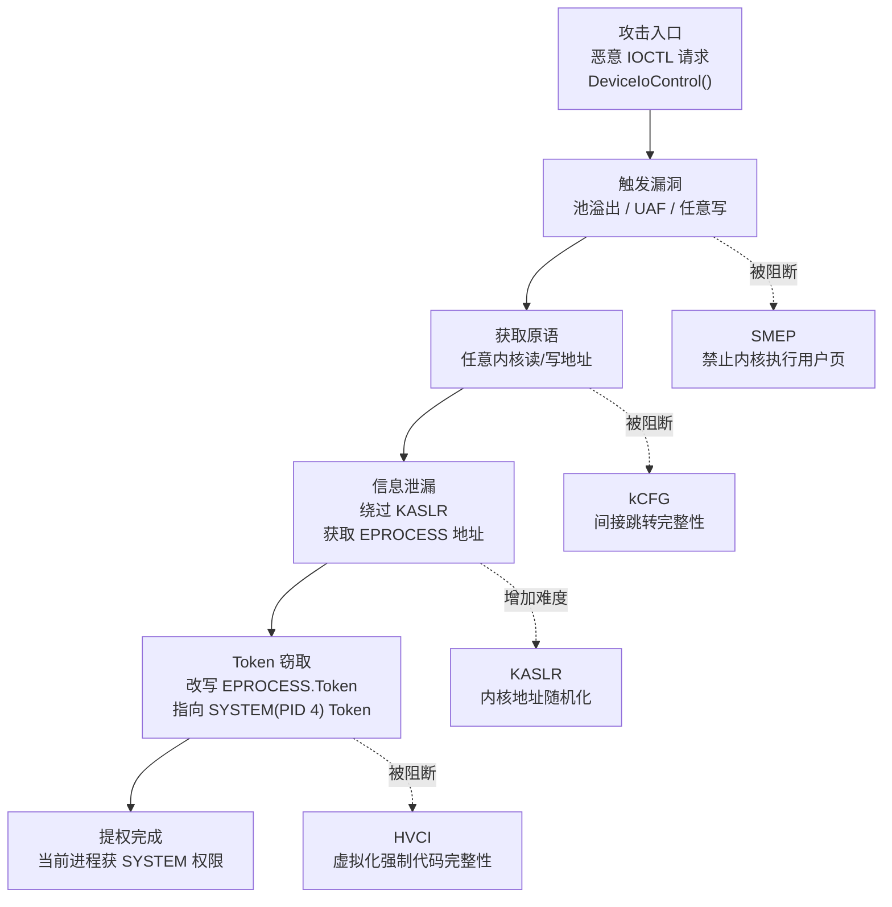
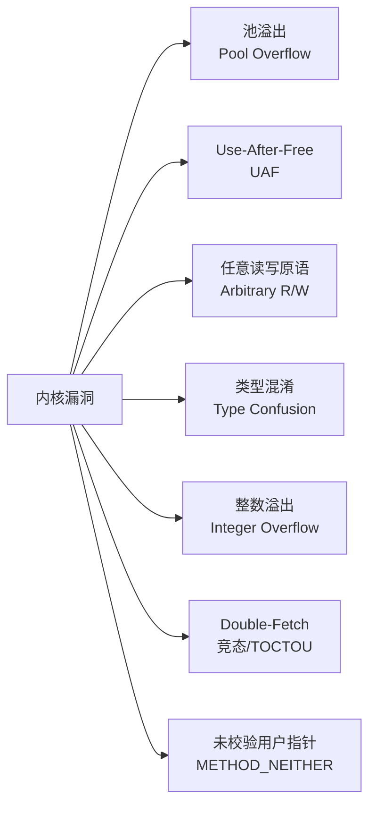
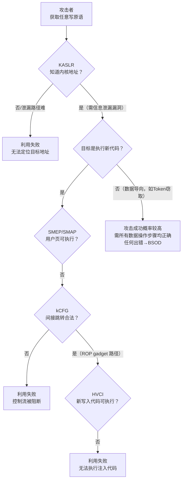

# Windows内核（13）· 内核漏洞与利用基础

## 概述与定位

> [!abstract] TL;DR
> 内核漏洞的攻击面绝大多数来自**驱动的 IOCTL 接口**（见 [[03.WDM驱动模型与IRP]]）——驱动在 Ring 0 运行，一旦漏洞被触发，攻击者获得的是内核级别的任意读/写原语，失败代价则是蓝屏（BSOD）。本章从**研究与防御视角**梳理七类内核漏洞的成因，讲清"任意写原语→Token 窃取→SYSTEM 提权"的概念路径，并系统拆解 SMEP、kCFG、KASLR、HVCI 等现代缓解机制如何层层阻断这条路径。读懂攻击面，才能写出安全的驱动、配置有效的防御纵深。

内核漏洞研究处于 Windows 安全对抗的核心地带。与用户态漏洞（见 [[33.二进制漏洞与利用基础/00.二进制漏洞与利用基础总览.md]]）相比，内核漏洞有三个独特之处：

| 维度 | 用户态漏洞 | 内核漏洞 |
|---|---|---|
| 执行环境 | Ring 3，受内核仲裁 | Ring 0，无上级仲裁 |
| 失败代价 | 进程崩溃 | **全系统 BSOD** |
| 权限上限 | 本进程/用户 | **SYSTEM（操作系统最高权）** |
| 主要攻击面 | 用户输入/网络 | **驱动 IOCTL 接口** |

正因如此，内核漏洞利用比用户态利用更脆，容错窗口极窄；而缓解机制（SMEP、KASLR、HVCI 等）的叠加也让现代提权攻击愈发复杂。

---

## 原理与机制

### 内核漏洞到提权的概念路径



> [!warning] 示例输出为示意
> 上图为概念路径，实际利用中每一步均面临现代缓解机制的阻断，且内核中任何一步出错均导致 BSOD。

### 漏洞类别全景



---

## 机制详解

### 漏洞类别逐项解析

#### 池溢出（Pool Overflow）

**成因**：内核通过 `ExAllocatePoolWithTag()` 从非分页池（NonPagedPool）或分页池（PagedPool）分配内存（见 [[06.内核内存管理]]）。若驱动在计算分配大小时存在错误（如直接信任用户传入的 `InputBufferLength`），向池块写入的数据超过其实际大小，就会溢出到相邻池块，可能覆盖相邻池块的池头或元数据，进而控制后续的内存分配/释放行为。

```
内核非分页池布局（示意）
┌─────────────┬────────────────────────────────┬────────────────────┐
│ Pool Block A│  Pool Header（8 字节）          │  Pool Block B      │
│  (被分配)   │  Size / Type / Tag / PoolIndex │  (相邻块，可被覆盖) │
└─────────────┴────────────────────────────────┴────────────────────┘
       ↑
 溢出写入覆盖相邻池头或数据
```

**缓解**：Windows 10+ 引入池头 Cookie（`PoolHeader.PreviousSize` 编码了随机化的 Cookie），池块大小随机化，使单纯的溢出覆盖难以预测目标布局。`!pool` 命令可在 WinDbg 下检查池头合法性。

**WinDbg 观察**（示意）：
```
kd> !pool ffffc000`deadbeef
Pool page ffffc000deadbeef region is Nonpaged pool
 ffffc000deadbea0 size:   50 previous size:    0  (Allocated)  Driv
```

> [!warning] 示例输出为示意

#### Use-After-Free（UAF）

**成因**：对象被 `ExFreePoolWithTag()` 释放后，某个指针仍保留对该内存区域的引用；后续若该内存被重新分配为另一类型的对象（池风水），通过旧指针访问将操作到新对象的数据。内核对象系统（Object Manager）中的引用计数错误（少 `ObDereferenceObject` 一次）是典型场景。

**成因模式**（伪代码）：
```c
// 错误示例（研究说明用，非可运行代码）
PDEVICE_EXTENSION ext = DevExt;
ExFreePoolWithTag(ext->Buffer, TAG);   // Buffer 已释放
// ... 中间代码允许用户重新分配该区域 ...
RtlCopyMemory(ext->Buffer, userData, size); // UAF：写到已释放内存上的新对象
```

**与用户态 UAF 的对照**：原理与 glibc 堆 UAF 相同（见 [[33.二进制漏洞与利用基础/00.二进制漏洞与利用基础总览.md]]），但内核池的分配器更简单，池风水布局往往更确定；失败代价是蓝屏而非进程崩溃。

#### 任意读/写原语（Arbitrary Read/Write Primitive）

**成因**：这通常不是"一类漏洞"，而是池溢出、UAF、类型混淆等漏洞被利用后的**中间阶段成果**——攻击者控制了某个内核指针字段，使驱动在操作该"指针"时，实际读取或写入到攻击者指定的任意内核地址。

**任意写原语的典型形式**（概念）：
```c
// 如果攻击者能控制 target_address 和 value
*(PULONG_PTR)target_address = value;  // 任意内核写
```

有了任意内核写原语，攻击者可以修改 `EPROCESS.Token`（Token 窃取），也可以修改函数指针或回调表。有了任意内核读原语，攻击者可以泄漏内核地址，绕过 KASLR。

#### 类型混淆（Type Confusion）

**成因**：驱动为多种 IOCTL 功能码使用同一块缓冲区，但未在读取前正确校验对象类型标记（Type Field），导致将 A 类型的对象当作 B 类型解引用——字段偏移语义不同，可能导致读/写到意外地址。

**与内核对象系统的关联**：`OBJECT_HEADER` 中有 `TypeIndex` 字段；Windows Object Manager 通过 `ObGetObjectType()` 校验；但驱动自定义的数据结构若缺乏类型校验，Object Manager 无法介入保护。

#### 整数溢出（Integer Overflow）

**成因**：驱动在计算内存分配大小时，将用户传入的两个值相乘/相加（如 `count * sizeof(ELEMENT)`），若结果超出 `SIZE_T`/`ULONG` 的范围则发生截断，导致实际分配远小于数据所需的缓冲区，进而触发越界写。

```c
// 整数溢出示例（成因说明，非可运行利用代码）
ULONG alloc_size = user_count * sizeof(MY_STRUCT);
// 若 user_count = 0x10000000，sizeof = 0x20
// alloc_size = 0x200000000 → ULONG 截断 = 0x00000000 → 分配 0 字节
PVOID buf = ExAllocatePoolWithTag(NonPagedPool, alloc_size, TAG);
RtlCopyMemory(buf, userData, user_count * sizeof(MY_STRUCT)); // 严重越界
```

**防御**：使用 `RtlULongMult()`（`ntddk.h` 中的安全乘法，返回 `STATUS_INTEGER_OVERFLOW`）或 `SIZE_T` 范围检查。

#### Double-Fetch / 竞态（TOCTOU）

**成因**：驱动通过 `METHOD_BUFFERED`（系统帮复制缓冲区）以外的传输方式（`METHOD_NEITHER` 等）访问用户态内存时，若先读取某字段做**校验**，再次读取该字段做**使用**，用户态代码可以在两次读之间（通过另一个线程）修改该字段，导致通过校验的值与实际使用的值不一致（Time-Of-Check / Time-Of-Use，TOCTOU）。

```c
// Double-fetch 成因（示意，非可运行利用代码）
ULONG len = *(PULONG)UserBuffer;   // 第一次读：做长度校验
if (len > MAX_LEN) return STATUS_INVALID_PARAMETER;
// ← 用户态线程此刻将 len 改为 0xFFFFFFFF
RtlCopyMemory(KernelBuf, UserBuffer + 4, *(PULONG)UserBuffer);
// 第二次读取 len：已被改大 → 内核缓冲区溢出
```

**防御**：将用户态数据**一次性复制到内核缓冲区**（`RtlCopyMemory` 到内核栈/池分配区），后续所有操作仅引用内核副本；或使用 `METHOD_BUFFERED` 让 I/O 管理器代劳复制。

#### 未校验用户指针（METHOD_NEITHER + 缺少 ProbeForRead/Write）

**成因**：当 IOCTL 使用 `METHOD_NEITHER` 时，I/O 管理器**不复制缓冲区**，驱动直接收到用户态指针（`Type3InputBuffer`）。若驱动未调用 `ProbeForRead()` / `ProbeForWrite()` 校验指针的可访问性和对齐，攻击者可以传入任意内核地址作为"用户缓冲区"，让驱动在内核地址上读/写——直接实现任意内核读/写原语。

```c
// METHOD_NEITHER 不安全写法（成因说明）
PVOID userPtr = irpSp->Parameters.DeviceIoControl.Type3InputBuffer;
// 缺少：ProbeForRead(userPtr, len, 1) + __try/__except 
RtlCopyMemory(kernelBuf, userPtr, len);  // 若 userPtr 指向内核地址 → 任意内核读
```

**正确写法（防御）**：
```c
__try {
    ProbeForRead(userPtr, len, sizeof(UCHAR));
    RtlCopyMemory(kernelBuf, userPtr, len);
} __except(EXCEPTION_EXECUTE_HANDLER) {
    status = GetExceptionCode();
}
```

`ProbeForRead/Write` 会检查指针是否完全落在用户态地址范围（`< MmUserProbeAddress`）及对齐，越界则抛出异常。

---

### Token 窃取原理（概念）

Token 窃取是获得内核任意写原语后最常见的提权手段，原理基于 Windows 进程安全令牌机制（见 [[05.内核对象与句柄]]）。

#### EPROCESS 与 Token 字段

每个进程的内核对象 `nt!_EPROCESS` 含有 `Token` 字段（`EX_FAST_REF` 类型，低 4 位用作引用计数，高位是指针）：

```
WinDbg 观察（示意，字段偏移因 Windows 版本不同而变化）：
kd> dt nt!_EPROCESS ffffc000`deadbeef
   +0x000 Pcb              : _KPROCESS
   ...
   +0x4b8 Token            : _EX_FAST_REF   ← 安全令牌引用
   +0x440 UniqueProcessId  : 0x00000004 (PID 4 = System)
   ...
```

> [!warning] 示例输出为示意，字段偏移因 Windows 版本不同而变化

#### Token 窃取的概念步骤

1. **定位 SYSTEM 进程 `EPROCESS`**：遍历 `EPROCESS.ActiveProcessLinks` 双向链表（见 [[11.Rootkit原理与检测]] 的 DKOM 章节），找到 `UniqueProcessId == 4`（PID 4 = System）的节点。
2. **读取 SYSTEM 的 Token 值**：从 SYSTEM `EPROCESS` 偏移 `+0x4b8`（版本相关）处读出 Token 字段值。
3. **覆写当前进程 Token**：将当前进程 `EPROCESS` 的 Token 字段用**任意内核写原语**替换为 SYSTEM 的 Token 值。
4. **效果**：当前进程的安全上下文变为 SYSTEM；在其中 `CreateProcess()` 的子进程同样继承 SYSTEM Token。

**为何有效**：Windows 访问控制系统在每次权限检查时从进程 `EPROCESS.Token` 读取令牌；替换后，内核访问控制看到的是 SYSTEM Token，所有权限检查均通过。这属于**数据导向攻击**（Data-Oriented Attack），无需注入可执行代码，因此 SMEP/DEP 无法直接阻断。

```
Token 窃取概念路径（示意）：

SYSTEM EPROCESS                   当前进程 EPROCESS
┌──────────────────┐              ┌──────────────────┐
│ PID = 4          │              │ PID = xxxx       │
│ Token → SystemTk │    写原语    │ Token → UserTk   │
└──────────────────┘  ─────────→ │ Token → SystemTk │ ← 被替换
        ↑                         └──────────────────┘
   从此读出 Token 值                   当前进程获 SYSTEM 权
```

---

### 缓解机制详解

现代 Windows 通过多层缓解机制构成防御纵深，每一层针对利用链的不同阶段。

#### SMEP（Supervisor Mode Execution Prevention）

**保护目标**：阻断经典的 **ret-to-user**（内核代码返回到用户态页执行 shellcode）。

**原理**：Intel/AMD x64 处理器特性，由 CR4 寄存器第 20 位（`CR4.SMEP`）控制。SMEP 启用后，当 CPU 处于 Ring 0（CPL=0）时，**执行权限被设置为"用户"（U/S=1）的页**会触发 `#PF`（Page Fault）异常，立即 BSOD（`ATTEMPTED_EXECUTE_OF_NOEXECUTE_MEMORY`）。

```
SMEP 防护示意：
攻击者在用户态页部署 shellcode
       ↓
内核漏洞触发，控制流跳转到用户态地址
       ↓
CR4.SMEP = 1 → 检测到 CPL=0 执行 U-bit 页
       ↓
Page Fault → BSOD（KeBugCheckEx ATTEMPTED_EXECUTE_OF_NOEXECUTE_MEMORY）
```

**绕过思路（研究层面）**：SMEP 只管"执行"，不管"读写"；因此 **ROP（Return Oriented Programming）** 链（拼接已映射内核代码中的 gadget）、以及**数据导向攻击**（如 Token 窃取）不依赖执行用户页，SMEP 无法拦截。现代利用已基本放弃 ret-to-user，转向 ROP + 数据导向。

#### SMAP（Supervisor Mode Access Prevention）

**保护目标**：阻断内核代码**读写**用户态页（防止内核被引导访问攻击者布置的用户态数据）。

**原理**：与 SMEP 类似，由 CR4 第 21 位（`CR4.SMAP`）控制。内核代码若直接访问 U-bit 页（未使用 `STAC`/`CLAC` 指令临时关闭 SMAP），触发 `#PF`。合法的内核访问用户内存路径（`ProbeForRead/Write`、`__try/__except`）会在访问前隐式执行 `STAC` 指令临时允许访问。

**效果**：即使攻击者利用 `METHOD_NEITHER` 漏洞传入用户态指针，SMAP 也会在驱动试图直接解引用时触发 BSOD——前提是驱动未走合法的 `Probe*` 路径。

#### kCFG（Kernel Control Flow Guard）

**保护目标**：阻断通过**覆写间接调用/跳转目标**（函数指针、虚函数表指针）控制内核控制流。

**原理**：Windows Kernel CFG 是用户态 CFG（Control Flow Guard）在内核的延伸（参见 [[34.现代二进制防护机制/08.CFI控制流完整性.md]]）。编译器为每个间接 `call`/`jmp` 指令前插入校验：目标地址必须是合法"CFG 目标"（编译时在位图中标记）；若目标不在位图中，则调用 `ntoskrnl` 的失败处理程序，导致 BSOD。

```
kCFG 校验流程（示意）：
call [rax]          ← 间接调用
    ↓
__guard_dispatch_icall_fptr:
    校验 rax 是否在 CFG 合法目标位图中
    ├── 合法 → 执行 call
    └── 非法 → KeBugCheckEx（KERNEL_SECURITY_CHECK_FAILURE）
```

**限制**：kCFG 保护间接调用目标，但对**数据导向攻击**（如 Token 窃取——修改数据指针而非代码指针）无效。此外，BYOVD 场景中使用的脆弱驱动可能未启用 kCFG。

#### KASLR（Kernel Address Space Layout Randomization）

**保护目标**：阻断攻击者**在不知道内核布局的情况下构造可靠利用**（找不到 gadget 地址、找不到 `EPROCESS` 地址）。

**原理**：Windows 8+ 在每次启动时将 `ntoskrnl.exe` 加载到随机偏移地址（随机化粒度约 64 KB）；驱动模块、内核堆栈、内核池同样随机化。攻击者必须先获得内核地址泄漏（信息泄漏漏洞）才能知道当前启动的布局。

```
KASLR 随机化示意：
启动 1：ntoskrnl 基址 = 0xFFFFF80012345000
启动 2：ntoskrnl 基址 = 0xFFFFF80078AB0000
启动 3：ntoskrnl 基址 = 0xFFFFF800F1C00000
```

> [!warning] 示例为示意地址

**信息泄漏的重要性**：绕过 KASLR 需要先获取一个已知内核地址（泄漏）。早期 `NtQuerySystemInformation`（`SystemModuleInformation`）可返回内核基址，已在 Windows 10 1607+ 对非特权用户限制。现代利用需要先找一条信息泄漏路径，这大幅提高了利用复杂度（参见 [[33.二进制漏洞与利用基础/13.现代利用与信息泄露.md]]）。

#### 内核池加固（Pool Hardening）

**Windows 10 20H1+（RS5+）的内核池加固**：

| 机制 | 说明 |
|---|---|
| Pool Header Cookie | 每个池块头部含随机 Cookie，释放时校验；Cookie 错误则 BSOD |
| 安全链表 | `LIST_ENTRY` 插入/移除前校验前后向指针，防 unlink 攻击 |
| 池块大小随机化 | 相同大小请求不保证得到相邻地址，增加风水布局难度 |
| NonPagedPoolNx | `ExAllocatePool2()` 默认分配不可执行（NX）池，替代旧 `ExAllocatePoolWithTag` |

#### HVCI/VBS（Memory Integrity / Virtualization-Based Security）

**保护目标**：即便攻击者拥有任意写原语，也**无法在内核中执行未签名代码**。

**原理**（见 [[12.PatchGuard与DSE与HVCI]]）：HVCI 在 Hyper-V 虚拟化层（Ring -1 / VMX root 模式）之上运行，Windows 内核本身运行在 Guest 模式。内核所有代码页的执行权限由 **Hypervisor 的 Extended Page Tables（EPT）**控制：

- 代码页（执行权限）：只有通过 HVCI 签名校验的页才被 EPT 标记为可执行（`EPT_EXECUTE`）。
- 数据页：可写但不可执行。

攻击者即便通过任意写向某内核地址写入 shellcode，EPT 中该页仍标记为不可执行，执行时触发 EPT 违规，Hypervisor 接管并 BSOD。

```
HVCI 防护层次（示意）：
┌────────────────────────────────────────────────────┐
│             Windows 内核 (Ring 0 / Guest)          │
│  攻击者写入 shellcode → 地址有写权但无执行权        │
│  尝试跳转执行 → EPT Violation                      │
└────────────────────┬───────────────────────────────┘
                     │  EPT Violation
                     ▼
┌────────────────────────────────────────────────────┐
│  Hypervisor / VTL1 (Ring -1 / VMX root)           │
│  HVCI 校验失败 → KeBugCheckEx → BSOD              │
└────────────────────────────────────────────────────┘
```

**HVCI 的根本价值**：它让"拥有任意写原语"不再等同于"可以执行任意代码"——把漏洞利用的难度从"写原语 → shellcode"提升到了更难的纯数据导向路径（且 Token 窃取等数据导向攻击仍需克服 KASLR + kCFG 等其他层次）。

#### SMEP 绕过需数据导向/ROP（研究层面概念）

SMEP/SMAP 联合阻断了执行用户页和从用户页读取数据的两条路径，迫使攻击者转向：
- **ROP（Return Oriented Programming）**：拼接已加载内核映像中的 gadget 片段，无需执行新代码。
- **数据导向攻击（Data-Oriented Attack / DOP）**：不执行任何新代码，只修改关键数据结构（如 Token、回调指针），驱动已有代码完成恶意操作。

kCFG 进一步阻断 ROP 中的间接跳转；HVCI 阻断注入的 shellcode 执行。三者叠加使现代内核提权攻击极为复杂，需要精心组合多个漏洞和信息泄漏。

---

## 防御分析

### 驱动安全编码规范

安全驱动编写的关键原则，对应上述漏洞类别：

| 漏洞类别 | 驱动侧防御措施 |
|---|---|
| 池溢出 | 分配前验证大小；使用 `RtlULongAdd`/`RtlULongMult` 防止整数溢出；`ExAllocatePool2`（Windows 10 20H1+，NX 池）|
| UAF | 正确管理引用计数（`ObReferenceObject`/`ObDereferenceObject`）；释放后将指针置 `NULL` |
| 任意读写 | 禁止向调用方暴露任何内核指针；对输出缓冲区做 `RtlZeroMemory` |
| 类型混淆 | 每个 IOCTL 使用独立数据结构；加入 Magic/TypeIndex 校验 |
| 整数溢出 | 使用 `SafeInt`（`C++`）或 `Rtl*` 安全算术函数 |
| Double-Fetch | 一次性将用户缓冲区复制到内核栈/池，后续仅操作内核副本 |
| 未校验用户指针 | `METHOD_NEITHER` 必须 `ProbeForRead/Write` + `__try/__except`；优先使用 `METHOD_BUFFERED` |

**WinDbg 池溢出检测**：用 Driver Verifier（`verifier.exe`）启用 "Special Pool" 和 "Pool Tracking"，在分配区前后插入 guard page，溢出即可即时触发 `BSOD` 并留下精确转储。

```
verifier /flags 0x1 /all          ← 启用基本 Pool 校验
verifier /flags 0xB /driver mydrv.sys  ← 针对特定驱动启用扩展校验
```

> [!warning] 示例输出为示意

### BYOVD 防御（驱动阻止列表）

**BYOVD（Bring Your Own Vulnerable Driver）**：攻击者携带一个已知存在内核漏洞的合法签名驱动，利用该驱动的漏洞获取内核任意读/写原语，进而完成提权或关闭 EDR 回调。这是绕过 DSE（驱动签名强制）的主要实战手段——无需突破签名验证，因为使用的驱动本身已被签名（见 [[12.PatchGuard与DSE与HVCI]]）。

**防御路径**：

| 机制 | 说明 |
|---|---|
| 驱动阻止列表（Blocklist） | Windows 内置 `ci.dll` 维护脆弱驱动哈希列表；WDAC（Windows Defender Application Control）可扩展该列表 |
| Microsoft 推荐脆弱驱动阻止列表 | 微软定期更新已知脆弱驱动哈希（HVCI 环境下自动生效） |
| ASR 规则 | Attack Surface Reduction 规则可阻止特定行为模式 |
| 监控驱动加载事件 | 通过 `PsSetLoadImageNotifyRoutine` 回调（见 [[09.内核回调机制]]）记录每次驱动加载，比对阻止列表 |

### 缓解机制协同效果

单一缓解机制均可被绕过；层层叠加才能形成有效防御纵深：



---

## 安全性与正确使用

> [!caution] 合规边界与授权声明
> 本章内容基于**研究与防御视角**，面向以下合法场景：
> - 在**自有环境**（测试机、虚拟机、授权渗透测试环境）中进行内核安全研究
> - 分析恶意驱动样本（蓝队取证、EDR 规则开发）
> - 驱动安全代码审查与漏洞缓解机制的理解
> - CTF 内核 PWN 题目学习
>
> **本章不提供针对他人系统的完整武器化利用链**，包括但不限于：完整 exploit 代码、绕过 PatchGuard/HVCI 的可落地步骤、实际 Token 窃取的运行代码。任何针对未授权系统的内核漏洞利用均构成违法行为。

### 安全研究环境建议

进行内核漏洞研究必须在隔离环境中操作：

1. **独立测试虚拟机**：Hyper-V 或 VMware，快照做好还原点（BSOD 是常态）。
2. **双机内核调试**：WinDbg over 网络/串口，主机可接收 BSOD 转储（见 [[07.WinDbg内核调试]]）。
3. **Driver Verifier**：开启 Special Pool、Force IRQL Checking、Pool Tracking，让驱动 bug 即时触发而非延迟崩溃。
4. **开启测试签名**（`bcdedit /set testsigning on`）：仅在测试 VM 中，方便加载未签名测试驱动，勿用于生产环境。
5. **WinDbg 符号**：`.sympath srv*C:\symbols*https://msdl.microsoft.com/download/symbols` 获取 `ntoskrnl.exe` 的公开符号，方便 `dt nt!_EPROCESS` 等命令解析结构偏移。

> [!warning] 示例输出为示意

---

## 小结

本章从研究与防御视角梳理了内核漏洞与利用基础的核心知识：

- **漏洞入口集中**：驱动 IOCTL 接口（见 [[03.WDM驱动模型与IRP]]）是内核漏洞的主要来源；七类漏洞（池溢出、UAF、任意读写、类型混淆、整数溢出、Double-Fetch、未校验用户指针）覆盖绝大多数真实 CVE 的成因。
- **提权概念路径**：漏洞 → 任意写原语 → Token 窃取（改写 `EPROCESS.Token`）→ SYSTEM 权限；理解这条路径是读懂内核漏洞报告的基础。
- **缓解层次清晰**：KASLR 阻断地址定位；SMEP/SMAP 阻断执行/读写用户页；kCFG 阻断间接控制流劫持；HVCI 从虚拟化层强制代码完整性；池加固增加堆布局难度。多层叠加才是有效防御。
- **与用户态对照**：内核漏洞原理与 [[33.二进制漏洞与利用基础/00.二进制漏洞与利用基础总览.md]] 中的堆/栈漏洞同根同源（UAF、整数溢出、任意写），但内核的失败代价是蓝屏，容错窗口更窄，利用更脆。
- **BYOVD 防御关键**：合法签名的脆弱驱动绕过 DSE（见 [[12.PatchGuard与DSE与HVCI]]），防御靠驱动阻止列表（WDAC/HVCI 阻止列表）而非签名验证本身。
- **驱动安全编码**：`ProbeForRead/Write`、一次性复制用户缓冲区、`Rtl*` 安全算术、`__try/__except` + `METHOD_BUFFERED` 是驱动侧防御的核心原则。

---

## 相关阅读

- **用户态漏洞对照**：[[33.二进制漏洞与利用基础/00.二进制漏洞与利用基础总览.md]]
- **现代信息泄漏技术（用户态）**：[[33.二进制漏洞与利用基础/13.现代利用与信息泄露.md]]
- **CFI/kCFG 机制详解**：[[34.现代二进制防护机制/08.CFI控制流完整性.md]]
- **EPROCESS/句柄/Token 结构**：[[05.内核对象与句柄]]
- **内核内存与池管理**：[[06.内核内存管理]]
- **WDM/IRP/IOCTL 模型**：[[03.WDM驱动模型与IRP]]
- **PatchGuard/DSE/HVCI**：[[12.PatchGuard与DSE与HVCI]]
- **WinDbg 崩溃分析**：[[07.WinDbg内核调试]]
- **内核回调（EDR 检测入口）**：[[09.内核回调机制]]

---

⬅️ 上一篇 [[12.PatchGuard与DSE与HVCI]] ｜ 🏠 [[00.Windows内核与驱动逆向总览]] ｜ 下一篇 [[14.驱动逆向实战]] ➡️
