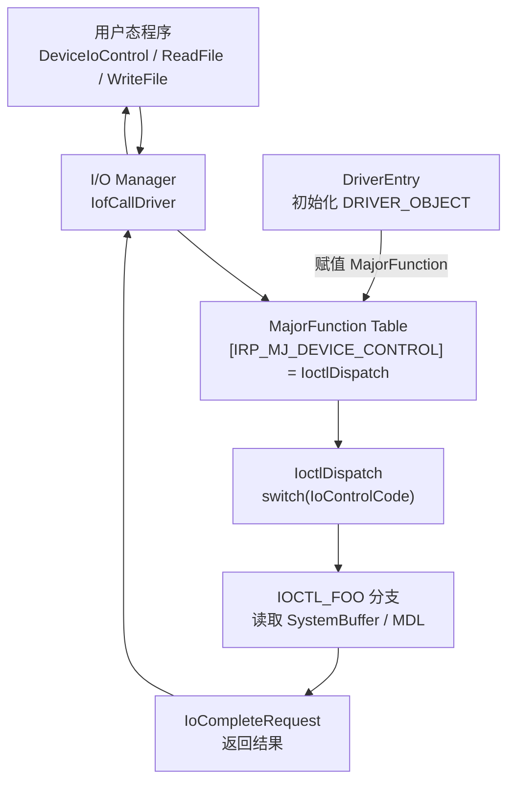
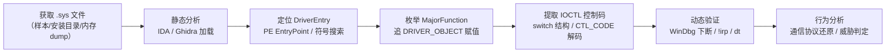

# Windows内核（14）· 驱动逆向实战

## 概述与定位

> [!abstract] TL;DR
> 驱动逆向是对 `.sys` 二进制文件进行静态反汇编/反编译 + 动态内核调试的全流程分析。核心目标是：定位 `DriverEntry`，枚举 `MajorFunction` dispatch table，提取 IOCTL 控制码及其处理逻辑，最终还原驱动与用户态程序之间的通信协议。本章以虚构但真实感的样本驱动 `SampleDrv.sys` 为主线，演示从零到完整接口图谱的逆向流程。

Windows 驱动（`.sys`）运行在内核态 Ring 0，拥有最高权限，是安全研究、漏洞挖掘、恶意软件分析的高价值目标。与用户态 PE 逆向相比，驱动逆向有以下独特挑战：

- **符号稀少**：release 驱动通常无 PDB，函数名全部丢失。
- **内核 API**：导入来自 `ntoskrnl.exe`、`hal.dll`、`NDIS.sys` 等内核模块，与 Win32 API 完全不同。
- **IRP 驱动模型**：I/O 请求包（IRP）是驱动与外界通信的唯一标准通道，必须理解 `IO_STACK_LOCATION` 的结构才能读懂分派逻辑。
- **调试环境复杂**：需要双机调试或 VM 内核调试，崩溃即 BSOD。

本章工具链：**IDA Pro**（反汇编/伪代码）、**Ghidra**（辅助交叉比对）、**WinDbg**（动态内核调试）、**x64dbg**（偶尔辅助用户态侧）。平台：Windows 10/11 x64，`ntoskrnl.exe`。

---

## 原理与机制

### 驱动通信全貌



### 驱动逆向总体流程



### CTL_CODE 宏编码规则

`CTL_CODE` 是一个宏，将设备类型、功能码、传输方式、访问权限压缩为一个 32 位整数：

```
CTL_CODE(DeviceType, Function, Method, Access)
  = (DeviceType << 16) | (Access << 14) | (Function << 2) | Method
```

| 字段 | 位域 | 说明 |
|------|------|------|
| DeviceType | [31:16] | 设备类型，如 `FILE_DEVICE_UNKNOWN` = 0x22 |
| Access | [15:14] | `FILE_ANY_ACCESS`=0, `FILE_READ_DATA`=1, `FILE_WRITE_DATA`=2 |
| Function | [13:2] | 功能编号，0x800+ 为厂商自定义 |
| Method | [1:0] | 数据传输方式：`METHOD_BUFFERED`=0, `METHOD_IN_DIRECT`=1, `METHOD_OUT_DIRECT`=2, `METHOD_NEITHER`=3 |

**示例解码**：`IoControlCode = 0x00222003`

```
DeviceType = 0x0022 = 34 (FILE_DEVICE_UNKNOWN)
Access     = (0x00222003 >> 14) & 0x3 = 0  (FILE_ANY_ACCESS)
Function   = (0x00222003 >>  2) & 0xFFF = 0x800 (自定义功能 0x800)
Method     = 0x00222003 & 0x3 = 3  (METHOD_NEITHER ← 危险！)
```

### IRP_MJ 主功能码常量

| 常量 | 值 | 触发操作 |
|------|----|----------|
| `IRP_MJ_CREATE` | 0x00 | `CreateFile` |
| `IRP_MJ_READ` | 0x03 | `ReadFile` |
| `IRP_MJ_WRITE` | 0x04 | `WriteFile` |
| `IRP_MJ_DEVICE_CONTROL` | 0x0E | `DeviceIoControl`（用户态） |
| `IRP_MJ_INTERNAL_DEVICE_CONTROL` | 0x0F | 内核态驱动间调用 |
| `IRP_MJ_CLEANUP` | 0x12 | 最后一个句柄关闭前 |
| `IRP_MJ_CLOSE` | 0x02 | 对象引用计数归零 |

---

## 结构 / WinDbg / 伪代码详解

### DRIVER_OBJECT 结构

```c
// 简化版，ntddk.h
typedef struct _DRIVER_OBJECT {
    CSHORT Type;                    // 0x04
    CSHORT Size;
    PDEVICE_OBJECT DeviceObject;    // 驱动创建的第一个设备对象链表头
    ULONG Flags;
    PVOID DriverStart;              // 驱动镜像起始地址
    ULONG DriverSize;
    PVOID DriverSection;            // LDR_DATA_TABLE_ENTRY
    PDRIVER_EXTENSION DriverExtension;
    UNICODE_STRING DriverName;
    PUNICODE_STRING HardwareDatabase;
    PFAST_IO_DISPATCH FastIoDispatch;
    PDRIVER_INITIALIZE DriverInit;
    PDRIVER_STARTIO DriverStartIo;
    PDRIVER_UNLOAD DriverUnload;
    PDRIVER_DISPATCH MajorFunction[IRP_MJ_MAXIMUM_FUNCTION + 1]; // 0x70 ~ 0x170
} DRIVER_OBJECT, *PDRIVER_OBJECT;
```

`MajorFunction` 是一个包含 **28 个函数指针**的数组（索引 0 到 0x1B），在 `DriverEntry` 中逐一赋值。未赋值的槽位默认指向 `IopInvalidDeviceRequest`（内核内部的"无效请求"处理函数）。

### IO_STACK_LOCATION 关键字段

```c
typedef struct _IO_STACK_LOCATION {
    UCHAR MajorFunction;
    UCHAR MinorFunction;
    UCHAR Flags;
    UCHAR Control;
    union {
        struct {
            ULONG OutputBufferLength;
            ULONG InputBufferLength;
            ULONG IoControlCode;         // CTL_CODE 值
            PVOID Type3InputBuffer;      // METHOD_NEITHER 时的输入指针
        } DeviceIoControl;
        struct {
            ULONG Length;
            ULONGLONG ByteOffset;
        } Read;
        // ... 其他联合成员
    } Parameters;
    PDEVICE_OBJECT DeviceObject;
    PFILE_OBJECT FileObject;
    PIO_COMPLETION_ROUTINE CompletionRoutine;
    PVOID Context;
} IO_STACK_LOCATION, *PIO_STACK_LOCATION;
```

### WinDbg 命令速查

#### 查看 DRIVER_OBJECT

```
kd> dt nt!_DRIVER_OBJECT <地址>
```

> [!warning] 示例输出为示意

```
kd> dt nt!_DRIVER_OBJECT 0xffffbe01`23456000
   +0x000 Type             : 0n4
   +0x002 Size             : 0n336
   +0x008 DeviceObject     : 0xffffbe01`23457000 _DEVICE_OBJECT
   +0x028 DriverName       : _UNICODE_STRING "\Driver\SampleDrv"
   +0x070 MajorFunction    : [0x1c] Ptr64     long
   ...
```

#### 枚举 MajorFunction 数组

```
kd> dps 0xffffbe01`23456000+0x70 L1c
```

> [!warning] 示例输出为示意

```
ffffbe01`23456070  fffff806`11a01000 SampleDrv!SampleCreate
ffffbe01`23456078  fffff806`11a0f000 nt!IopInvalidDeviceRequest
ffffbe01`23456080  fffff806`11a0f000 nt!IopInvalidDeviceRequest
ffffbe01`23456088  fffff806`11a02000 SampleDrv!SampleRead
ffffbe01`23456090  fffff806`11a03000 SampleDrv!SampleWrite
ffffbe01`23456098  fffff806`11a0f000 nt!IopInvalidDeviceRequest
...
ffffbe01`23456138  fffff806`11a04000 SampleDrv!SampleIoctl   ; [0x0E] IRP_MJ_DEVICE_CONTROL
```

#### 查看 IRP 内容

```
kd> !irp <IRP地址>
```

> [!warning] 示例输出为示意

```
kd> !irp 0xffffbe01`34560000
Irp is active with 1 stacks 1 is current (= 0xffffbe01`34560058)
 No Mdl: No System Buffer: Thread ffffbe01`12345678:  Irp stack trace.
     cmd  flg cl Device   File     Completion-Context
>[IRP_MJ_DEVICE_CONTROL(e), N/A(0)]
            1  0 ffffbe01`23457000 ffffbe01`45678000 00000000-00000000    pending
           \Driver\SampleDrv
            Args: 00000040 00000020 00222003 00000000
```

`Args` 四列依次为：OutputBufferLength, InputBufferLength, IoControlCode, Type3InputBuffer（仅 METHOD_NEITHER 有效）。

#### 查看 IO_STACK_LOCATION

```
kd> dt nt!_IO_STACK_LOCATION 0xffffbe01`34560058
```

> [!warning] 示例输出为示意

```
kd> dt nt!_IO_STACK_LOCATION 0xffffbe01`34560058
   +0x000 MajorFunction    : 0xe ''
   +0x001 MinorFunction    : 0 ''
   +0x040 Parameters       :
      +0x000 DeviceIoControl :
         +0x000 OutputBufferLength : 0x40
         +0x008 InputBufferLength  : 0x20
         +0x010 IoControlCode      : 0x222003
         +0x018 Type3InputBuffer   : (null)
```

#### 查看设备栈

```
kd> !devstack <DeviceObject地址>
```

> [!warning] 示例输出为示意

```
kd> !devstack 0xffffbe01`23457000
  !DevObj           !DrvObj            !DevExt           ObjectName
  ffffbe01`23457000  \Driver\SampleDrv  ffffbe01`23457100  SampleDrvDevice
```

---

## 逆向视角 / 实战

### 第一步：加载 .sys 到 IDA Pro

将 `SampleDrv.sys`（一个假设的 x64 驱动）拖入 IDA Pro。

1. IDA 自动识别为 **PE64**，加载 `ntoskrnl.exe` 的 import 符号。
2. 导入表（`.idata`）中可见：
   - `ntoskrnl.exe`：`IoCreateDevice`、`IoCreateSymbolicLink`、`IoDeleteDevice`、`IofCallDriver`、`IofCompleteRequest`（即 `IoCompleteRequest`）、`IoGetCurrentIrpStackLocation`、`MmGetSystemRoutineAddress` 等。
   - `hal.dll`：`KeStallExecutionProcessor`（用于延时，有时出现在反调试中）。
3. **PE EntryPoint** 通常即 `DriverEntry`（IDA 会标注 `start`）。若 EntryPoint 是一个跳转 thunk，追跳转目标即真正的 `DriverEntry`。

#### IDA 中识别 DriverEntry 伪代码

```c
// IDA Hex-Rays 伪代码（已手动注释）
NTSTATUS __stdcall DriverEntry(PDRIVER_OBJECT DriverObject, PUNICODE_STRING RegistryPath)
{
    NTSTATUS status;
    UNICODE_STRING DeviceName;
    UNICODE_STRING SymLinkName;
    PDEVICE_OBJECT DeviceObject;

    // 初始化设备名称 L"\\Device\\SampleDrv"
    RtlInitUnicodeString(&DeviceName, L"\\Device\\SampleDrv");
    // 初始化符号链接 L"\\DosDevices\\SampleDrv"
    RtlInitUnicodeString(&SymLinkName, L"\\DosDevices\\SampleDrv");

    // 创建设备对象
    status = IoCreateDevice(DriverObject, 0, &DeviceName,
                            FILE_DEVICE_UNKNOWN, 0, FALSE, &DeviceObject);
    if (!NT_SUCCESS(status))
        return status;

    // 创建符号链接（供用户态 CreateFile 使用）
    status = IoCreateSymbolicLink(&SymLinkName, &DeviceName);
    if (!NT_SUCCESS(status)) {
        IoDeleteDevice(DeviceObject);
        return status;
    }

    // 赋值 MajorFunction dispatch table ← 逆向核心
    DriverObject->MajorFunction[IRP_MJ_CREATE]         = SampleCreate;   // 0x00
    DriverObject->MajorFunction[IRP_MJ_CLOSE]          = SampleClose;    // 0x02
    DriverObject->MajorFunction[IRP_MJ_READ]           = SampleRead;     // 0x03
    DriverObject->MajorFunction[IRP_MJ_WRITE]          = SampleWrite;    // 0x04
    DriverObject->MajorFunction[IRP_MJ_DEVICE_CONTROL] = SampleIoctl;    // 0x0E
    DriverObject->DriverUnload = SampleUnload;

    DeviceObject->Flags |= DO_BUFFERED_IO;   // 选择缓冲区 I/O 模式
    DeviceObject->Flags &= ~DO_DEVICE_INITIALIZING;

    return STATUS_SUCCESS;
}
```

> [!tip] 在 IDA 中追 MajorFunction 赋值
> 搜索 `DriverObject->MajorFunction` 的写操作：在 Hex-Rays 视图中，按 `x` 查找 `DriverObject` 参数的所有引用；或者在汇编视图中搜索写入 `rcx+0x70`（`DRIVER_OBJECT.MajorFunction` 偏移）的 `MOV` 指令，即可枚举所有 dispatch 函数。

### 第二步：分析 IOCTL Dispatch 函数

进入 `SampleIoctl`：

```c
// IDA 伪代码（已标注）
NTSTATUS __fastcall SampleIoctl(PDEVICE_OBJECT DeviceObject, PIRP Irp)
{
    PIO_STACK_LOCATION irpSp;
    NTSTATUS status;
    ULONG ioControlCode;
    PVOID inputBuffer;
    ULONG inputLen;
    PVOID outputBuffer;
    ULONG outputLen;
    ULONG_PTR information;

    irpSp = IoGetCurrentIrpStackLocation(Irp);  // 获取当前栈位置
    ioControlCode = irpSp->Parameters.DeviceIoControl.IoControlCode;
    inputLen      = irpSp->Parameters.DeviceIoControl.InputBufferLength;
    outputLen     = irpSp->Parameters.DeviceIoControl.OutputBufferLength;
    inputBuffer   = Irp->AssociatedIrp.SystemBuffer;  // METHOD_BUFFERED 共享缓冲区
    outputBuffer  = Irp->AssociatedIrp.SystemBuffer;  // 同一块，输出也写这里
    information   = 0;
    status        = STATUS_INVALID_DEVICE_REQUEST;

    switch (ioControlCode)
    {
    case 0x00222000:  // IOCTL_SAMPLE_GET_VERSION
        // CTL_CODE(0x22, 0x800, METHOD_BUFFERED, FILE_ANY_ACCESS)
        if (outputLen >= 4) {
            *(ULONG*)outputBuffer = 0x00010002;  // version 1.2
            information = 4;
            status = STATUS_SUCCESS;
        } else {
            status = STATUS_BUFFER_TOO_SMALL;
        }
        break;

    case 0x00222004:  // IOCTL_SAMPLE_READ_PHYSICAL
        // CTL_CODE(0x22, 0x801, METHOD_BUFFERED, FILE_ANY_ACCESS)
        // 危险：读取任意物理地址
        if (inputLen >= sizeof(PHYS_READ_REQUEST) && outputLen >= sizeof(ULONG64)) {
            PHYS_READ_REQUEST* req = (PHYS_READ_REQUEST*)inputBuffer;
            status = SampleReadPhysicalMemory(req->PhysAddr, req->Size,
                                              outputBuffer, &information);
        }
        break;

    case 0x00222007:  // METHOD_NEITHER 示例（危险：直接使用用户指针）
        // CTL_CODE(0x22, 0x801, METHOD_NEITHER, FILE_ANY_ACCESS)
        // Type3InputBuffer = 未验证的用户态指针 ← 典型漏洞点
        {
            PVOID userPtr = irpSp->Parameters.DeviceIoControl.Type3InputBuffer;
            // 若无 ProbeForRead + __try/__except，任意地址读 → 内核崩溃/任意写
            status = SampleProcessUserPointer(userPtr, inputLen);
        }
        break;

    default:
        status = STATUS_INVALID_DEVICE_REQUEST;
        break;
    }

    Irp->IoStatus.Status      = status;
    Irp->IoStatus.Information = information;
    IoCompleteRequest(Irp, IO_NO_INCREMENT);  // 必须调用，否则 I/O Manager 泄漏
    return status;
}
```

#### 从 IDA switch 提取所有 IOCTL 控制码

IDA 的 `switch` 识别通常会生成一个**跳转表**（jump table）。在 Hex-Rays 视图中，`switch(ioControlCode)` 的 `case` 标签即为所有受支持的 IOCTL 值。将它们批量复制，逐一用 CTL_CODE 公式解码：

| IOCTL 值 | DeviceType | Access | Function | Method | 含义 |
|----------|-----------|--------|----------|--------|------|
| `0x00222000` | 0x22 | 0 | 0x800 | 0 (BUFFERED) | 获取版本 |
| `0x00222004` | 0x22 | 0 | 0x801 | 0 (BUFFERED) | 读物理内存（危险） |
| `0x00222007` | 0x22 | 0 | 0x801 | 3 (NEITHER) | 用户指针操作（极度危险） |

> [!danger] METHOD_NEITHER 的危险性
> `METHOD_NEITHER` 下，`Type3InputBuffer` 是**未经验证的用户态指针**，内核直接使用。若驱动未在 `__try/__except` 块内配合 `ProbeForRead`/`ProbeForWrite` 进行探测，攻击者可传入内核地址（如 `MajorFunction` 表地址）触发任意内核内存读写，构成提权漏洞。

### 第三步：WinDbg 动态验证

#### 在 dispatch 函数入口下断

```
kd> bp SampleDrv!SampleIoctl
kd> g
```

从用户态发送 IOCTL 后触发断点：

```
kd> bp nt!IofCallDriver
Breakpoint 1 hit
nt!IofCallDriver:
fffff806`4e123456 48895c2408      mov     qword ptr [rsp+8],rbx
```

> [!warning] 示例输出为示意

#### 断下后检查参数

```
kd> !irp @rdx
kd> dt nt!_IO_STACK_LOCATION @rdx+0x58
kd> r rcx, rdx    ; rcx=DeviceObject, rdx=Irp
```

> [!warning] 示例输出为示意

```
kd> r
rax=0000000000000000 rbx=ffffbe0123456000 rcx=ffffbe0123457000
rdx=ffffbe0134560000 ...

kd> dt nt!_IO_STACK_LOCATION ffffbe0134560058
   +0x010 IoControlCode : 0x222004   ← IOCTL_SAMPLE_READ_PHYSICAL
   +0x000 InputBufferLength : 0x10
   +0x008 OutputBufferLength : 0x8
```

### 第四步：识别数据传输方式

根据 Method 字段，IDA 伪代码中访问 `SystemBuffer` 的位置会不同：

```
Method 字段判断流程：

IOCTL 控制码 & 0x3  →  0 (BUFFERED) → Irp->AssociatedIrp.SystemBuffer
                   →  1 (IN_DIRECT)  → MmGetSystemAddressForMdlSafe(Irp->MdlAddress)
                   →  2 (OUT_DIRECT) → MmGetSystemAddressForMdlSafe(Irp->MdlAddress)
                   →  3 (NEITHER)    → irpSp->Parameters.DeviceIoControl.Type3InputBuffer
                                        (用户态虚拟地址，未映射到内核)
```

在 IDA 中，根据驱动访问哪个结构体字段，可以**反推 Method**：
- 看到 `Irp->AssociatedIrp.SystemBuffer` → BUFFERED
- 看到 `Irp->MdlAddress` + `MmGetSystemAddressForMdlSafe` → DIRECT
- 看到 `irpSp->Parameters.DeviceIoControl.Type3InputBuffer` → NEITHER

### 第五步：识别反调试/反分析手法

在 `DriverEntry` 或 timer 回调中，可能出现以下模式：

#### IRQL 检测

```c
// 反调试：检查当前 IRQL，若在调试器断点下 IRQL 异常
if (KeGetCurrentIrql() > DISPATCH_LEVEL) {
    // 疑似调试器介入，终止关键操作
    ExitProcess_Kernel();
}
```

在 IDA 中，`KeGetCurrentIrql` 调用后跟条件跳转、且跳转到"异常终止"路径，是反调试的典型特征。

#### 定时器心跳检测

```c
// 驱动注册一个 KTIMER / DPC，定期检查某个内核结构
KeInitializeTimer(&g_HeartbeatTimer);
KeInitializeDpc(&g_HeartbeatDpc, HeartbeatCallback, NULL);
// 每 500ms 触发一次
KeSetTimerEx(&g_HeartbeatTimer, due, 500, &g_HeartbeatDpc);
```

若 `HeartbeatCallback` 中检查 `PsGetCurrentProcess()`、`EPROCESS.DebugPort`，或用 `MmIsAddressValid` 扫描某段内存，则是明显的自保护机制。

#### 识别加密通信

若 IOCTL handler 中存在：
- 大量位运算（`XOR`、`ROL`、`ROR`）循环 → 流密码（RC4/自研）
- 固定长度结构赋值后调用 AES NI 指令（`AESDEC`/`AESENC`）→ AES
- 对 `SystemBuffer` 做 32/64 字节对齐操作 → 块加密

这类特征出现在 Rootkit 或 C2 驱动中，需重点标注。

---

## 安全性与正确使用

### 静态 + 动态结合分析要点

| 分析阶段 | 关注点 | 工具 |
|----------|--------|------|
| 静态 - 导入表 | 是否存在 `ZwWriteVirtualMemory`、`MmMapIoSpace`、`PsSetLoadImageNotifyRoutine` | IDA 导入表视图 |
| 静态 - 字符串 | 硬编码 IP/域名、加密 key、驱动服务名 | Strings 窗口 |
| 静态 - 控制流 | DKOM（`EPROCESS.ActiveProcessLinks` 链表操作）迹象 | Hex-Rays + xref |
| 动态 - 行为 | 实际 I/O 操作序列、注册表写入、网络连接 | WinDbg + ETW |

### 恶意驱动识别特征

1. **可疑 import 集合**：同时导入 `MmMapIoSpace`（物理内存映射）、`ZwWriteVirtualMemory`（跨进程写）、`PsLookupProcessByProcessId`（进程查找）——三者组合几乎确定是内核级注入或 DRM 绕过。
2. **DKOM 迹象**：在 IDA 中看到 `EPROCESS.ActiveProcessLinks`（偏移约 0x448 on Win10 x64）的 `Flink`/`Blink` 修改 → 进程隐藏。
3. **加密通信**：dispatch 函数收到 IOCTL 后，将 `SystemBuffer` 内容用自定义算法解密再执行 → C2 控制驱动。
4. **反调试链**：IRQL 检测 + KeQuerySystemTime delta 检测 + 特定进程名黑名单（`ida.exe`、`windbg.exe`、`x64dbg.exe`）。
5. **无符号链接**（stealth）：`DriverEntry` 不调用 `IoCreateSymbolicLink`，只有通过特定内核回调通信 → 传统 `DeviceIoControl` 无法到达。

### EDR 如何利用 WDM 回调机制防御

合法 EDR/AV 驱动会通过以下内核回调监控驱动行为：

- `PsSetCreateProcessNotifyRoutineEx`：监控进程创建，检查新进程是否由可疑驱动注入触发。
- `PsSetLoadImageNotifyRoutine`：监控模块加载，阻止未签名驱动/DLL 注入。
- `ObRegisterCallbacks`：监控句柄操作，防止攻击者打开受保护进程句柄（`OpenProcess(PROCESS_ALL_ACCESS, ...)`）。
- `CmRegisterCallback`：监控注册表写操作，防止持久化 Autorun key 修改。
- `FltRegisterFilter`（Filter Manager）：文件系统过滤，监控文件创建/写入。

当逆向一个疑似 Rootkit 的驱动时，检查它是否试图**摘除**这些回调（扫描 `PspCreateProcessNotifyRoutine` 数组并清零，或 Patch `PatchGuard` 保护下的回调表），是判断其恶意性的重要指标。

> [!caution] 逆向边界
> 本章所有分析技术均用于安全研究、漏洞挖掘、事件响应和防御场景。不得将 IOCTL 漏洞分析结果用于未授权的提权或横向移动。在生产环境外的隔离虚拟机中进行所有动态调试实验。

---

## 小结

本章围绕 `SampleDrv.sys` 演示了驱动逆向的完整流程：

1. **IDA 加载 .sys**：从 PE EntryPoint 定位 `DriverEntry`，读取导入表确认驱动 API 集合。
2. **枚举 MajorFunction**：追踪 `DRIVER_OBJECT->MajorFunction` 的赋值语句，提取全部 28 槽位的函数指针，确定哪些 IRP 主功能码被实现。
3. **IOCTL 接口提取**：进入 `IRP_MJ_DEVICE_CONTROL` handler，识别 `switch(IoControlCode)` 结构，用 `CTL_CODE` 公式解码所有控制码的 DeviceType/Function/Method/Access。
4. **传输方式判断**：根据 Method 字段（0/1/2/3）识别 BUFFERED/DIRECT/NEITHER，其中 METHOD_NEITHER 是漏洞高发区。
5. **WinDbg 动态验证**：`!irp`、`dt nt!_IO_STACK_LOCATION`、`!devstack`、`bp` 下断，验证静态分析结论。
6. **反调试识别**：IRQL 检测、定时器心跳、进程名黑名单等手法的 IDA 特征识别。
7. **威胁判定**：可疑 import 组合、DKOM 迹象、加密通信、回调摘除——四条主线判断恶意驱动。

`CTL_CODE` 解码和 IRP dispatch 枚举是驱动接口还原的核心技能；`IoCompleteRequest` 的调用合法性（每条路径都必须调用且只调用一次）是判断驱动代码质量和漏洞风险的直接指标。

---

## 相关阅读

- [[03.WDM驱动模型与IRP]]——IRP 生命周期与 IO_STACK_LOCATION 完整结构
- [[07.WinDbg内核调试]]——双机调试环境搭建与常用命令
- [[11.Rootkit原理与检测]]——DKOM、回调摘除等高级 Rootkit 技术
- [[13.内核漏洞与利用基础]]——驱动漏洞（任意写/UAF）利用原理
- [[15.IRQL与内核同步]]——IRQL 体系与同步原语，理解反调试中 IRQL 检测的背景

---

⬅️ 上一篇 [[13.内核漏洞与利用基础]] ｜ 🏠 [[00.Windows内核与驱动逆向总览]] ｜ 下一篇 [[15.IRQL与内核同步]] ➡️
