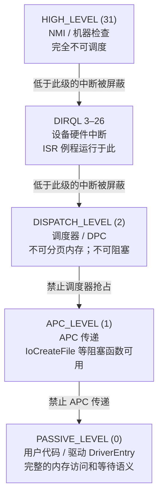
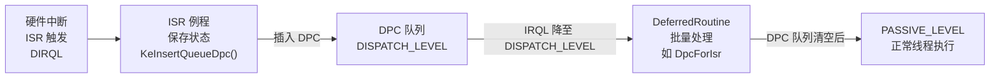
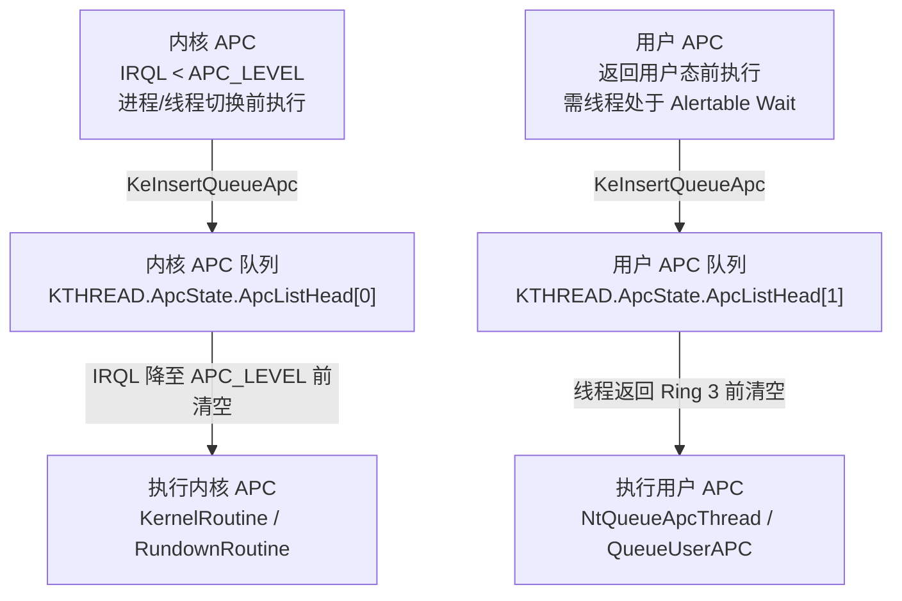

# Windows内核（15）· IRQL与内核同步

## 概述与定位

> [!abstract] TL;DR
> IRQL（Interrupt Request Level，中断请求级别）是 Windows 内核调度与同步的**核心抽象**：每个逻辑处理器在任意时刻都运行在某个 IRQL，更高级别的代码可以抢占更低级别的代码，但反之不行。自旋锁（Spin Lock）把 IRQL 抬到 `DISPATCH_LEVEL` 来"冻结"调度器；DPC 在 `DISPATCH_LEVEL` 异步执行中断尾部工作；APC 在 `APC_LEVEL` 或用户态返回前执行异步通知；`KEVENT`/`KMUTEX`/信号量则在 `PASSIVE_LEVEL` 和 `APC_LEVEL` 之间提供可等待同步。理解 IRQL 是写出**正确、稳定**驱动代码的前提，也是逆向分析内核崩溃（`IRQL_NOT_LESS_OR_EQUAL`、死锁）的钥匙。

现代 Windows 在 x64 架构下，IRQL 不是 CPU 硬件寄存器，而是由内核以软件方式维护（存储在处理器控制区 `KPCR/KPRCB` 中）。操作系统借助 IRQL 构建了一套**优先级抢占模型**：当前 IRQL 越高，越多的中断/调度动作被屏蔽，系统响应性越低但原子性越强。驱动开发者必须始终清楚自己代码运行在哪个 IRQL，否则极易制造出难以复现的 BSOD 崩溃。

本章在前序章节的基础上（见 [[03.WDM驱动模型与IRP]]、[[06.内核内存管理]]、[[07.WinDbg内核调试]]）深入讲解 IRQL 体系和全套内核同步原语。

---

## 原理与机制

### IRQL 等级体系

Windows x64 定义了 0–31 共 32 个 IRQL，实际使用的等级如下：



> [!warning] 示例输出为示意
> 上图各节点对应实际 IRQL 数值，`DIRQL` 范围因硬件平台而异，x64 桌面系统通常为 3–13。

| IRQL | 值 | 典型场景 | 限制 |
|---|---|---|---|
| `PASSIVE_LEVEL` | 0 | 用户态、`DriverEntry`、大多数 IRP 分发例程 | 无限制 |
| `APC_LEVEL` | 1 | APC 传递、`IoCreateFile` 阻塞调用 | 不能等待内核对象超时 |
| `DISPATCH_LEVEL` | 2 | 调度器、DPC、自旋锁持有期间 | 不可访问分页内存；不可阻塞；不可等待 |
| `DIRQL` | 3–26 | 设备 ISR（中断服务例程） | 不可调度；只能使用 `KeAcquireSpinLockAtDpcLevel` |
| `HIGH_LEVEL` | 31 | NMI、机器检查异常 | 完全不可调度；极少直接使用 |

### IRQL 提升与降低

内核通过以下 API 显式操控 IRQL：

```c
// 获取当前 IRQL
KIRQL currentIrql = KeGetCurrentIrql();

// 提升到指定 IRQL（返回旧值）
KIRQL oldIrql;
KeRaiseIrql(DISPATCH_LEVEL, &oldIrql);

// 恢复到旧 IRQL
KeLowerIrql(oldIrql);
```

`KeRaiseIrql` 只能将 IRQL 提升，不能降低（降低使用 `KeLowerIrql`）。内核在处理硬件中断时由 HAL 自动将 IRQL 提升至对应 `DIRQL`，中断处理完毕后再还原。

x64 上，HAL 使用 Local APIC 的 Task Priority Register（TPR）映射 IRQL，`KeGetCurrentIrql` 本质上读取 `gs:CurrentIrql`（`KPRCB.Irql`字段）。

### 自旋锁（Spin Lock）

自旋锁是内核中最基础的互斥原语，适用于**短暂临界区**：持锁线程在等待时不休眠，而是忙等（spin），因此持锁期间其他 CPU 核上的竞争者会空转消耗 CPU。

**关键约束**：持有自旋锁期间，IRQL 被抬至 `DISPATCH_LEVEL`，调度器无法抢占当前 CPU，分页内存访问和阻塞操作全部禁止。

```c
// 1. 初始化
KSPIN_LOCK gSpinLock;
KeInitializeSpinLock(&gSpinLock);

// 2. 获取锁（IRQL 抬到 DISPATCH_LEVEL）
KIRQL oldIrql;
KeAcquireSpinLock(&gSpinLock, &oldIrql);

// --- 临界区（不可分页内存；不可等待）---

// 3. 释放锁（恢复旧 IRQL）
KeReleaseSpinLock(&gSpinLock, oldIrql);
```

**读写自旋锁（Executive Reader-Writer Spin Lock）**：允许多个读者并发，但写者独占：

```c
EX_SPIN_LOCK gRwLock = 0;

// 读者路径
KIRQL oldIrql = ExAcquireSpinLockShared(&gRwLock);
// ... 读操作 ...
ExReleaseSpinLockShared(&gRwLock, oldIrql);

// 写者路径
oldIrql = ExAcquireSpinLockExclusive(&gRwLock);
// ... 写操作 ...
ExReleaseSpinLockExclusive(&gRwLock, oldIrql);
```

**队列自旋锁（Queued Spin Lock）**：在多处理器系统上性能更优，等待者在各自的队列节点上自旋而非在同一个锁变量上竞争，减少缓存行颠簸（cache line thrashing）：

```c
KLOCK_QUEUE_HANDLE lockHandle;
KeAcquireInStackQueuedSpinLock(&gSpinLock, &lockHandle);
// ... 临界区 ...
KeReleaseInStackQueuedSpinLock(&lockHandle);
```

> [!caution] 自旋锁不可递归
> 同一个处理器上如果递归获取同一把自旋锁，将造成**死锁**（处理器在等待自己释放锁）。WinDbg 命令 `!qlocked` 可检测。

### DPC（Deferred Procedure Call，延迟过程调用）

DPC 是 Windows 中断处理的**两阶段模型**核心——硬件中断的 ISR 在高 IRQL 快速完成（保存硬件状态、清中断标志），耗时操作推迟到 DPC 在 `DISPATCH_LEVEL` 异步执行。



`KDPC` 结构体布局（见下一节详解），通过以下 API 操作：

```c
KDPC gDpc;

// 初始化 DPC（绑定回调和上下文）
KeInitializeDpc(&gDpc, MyDeferredRoutine, pContext);

// 在 ISR 中插入队列（触发异步调用）
KeInsertQueueDpc(&gDpc, SystemArg1, SystemArg2);

// DPC 回调签名
VOID MyDeferredRoutine(
    _In_ PKDPC Dpc,
    _In_opt_ PVOID DeferredContext,
    _In_opt_ PVOID SystemArgument1,
    _In_opt_ PVOID SystemArgument2
) {
    // 运行于 DISPATCH_LEVEL
    // 不可分页内存；不可阻塞
}
```

**DPC Watchdog**：Windows 监控 DPC 执行时间，若单个 DPC 超过约 20ms（或所有 DPC 累计超过 120ms），触发 `DPC_WATCHDOG_VIOLATION`（Bug Check 0x133）。

**`DpcForIsr`**：专用于网络/存储驱动的 ISR 尾部工作，通过 `IoRequestDpc` 插入，在 `DPC_LEVEL` 上批量处理完成 IRP 列表。

### APC（Asynchronous Procedure Call，异步过程调用）

APC 是针对**特定线程**的异步通知机制，分为内核 APC 和用户 APC：



| 类型 | 触发条件 | 执行 IRQL | 典型用途 |
|---|---|---|---|
| 内核 APC | 任意，IRQL 降至 < `APC_LEVEL` 时 | `APC_LEVEL` | I/O 完成回调、线程注入 |
| 用户 APC | 线程处于 Alertable Wait（`SleepEx`/`WaitForSingleObjectEx`）时 | `PASSIVE_LEVEL`（Ring 3） | `QueueUserAPC`、异步 I/O |

`KeEnterGuardedRegion()` / `KeLeaveGuardedRegion()` 可临时禁用内核 APC 传递；`KeEnterCriticalRegion()` / `KeLeaveCriticalRegion()` 禁用用户 APC 和普通内核 APC（特殊内核 APC 仍然传递）。

### 可等待同步对象

当需要在 `PASSIVE_LEVEL`/`APC_LEVEL` 进行同步（允许线程休眠等待）时，内核提供以下对象：

#### KEVENT（事件）

```c
KEVENT gEvent;
// 初始化：NotificationEvent（手动重置）或 SynchronizationEvent（自动重置）
KeInitializeEvent(&gEvent, NotificationEvent, FALSE);

// 等待（线程进入等待状态，让出 CPU）
NTSTATUS status = KeWaitForSingleObject(
    &gEvent,
    Executive,   // WaitReason
    KernelMode,
    FALSE,       // Alertable
    NULL         // Timeout（NULL = 无限等待）
);

// 触发事件（唤醒等待线程）
KeSetEvent(&gEvent, IO_NO_INCREMENT, FALSE);

// 清除事件（手动重置）
KeClearEvent(&gEvent);
```

#### KMUTEX（内核互斥体）

```c
KMUTEX gMutex;
KeInitializeMutex(&gMutex, 0);

// 等待并获取（可递归，同一线程可多次获取）
KeWaitForMutexObject(&gMutex, Executive, KernelMode, FALSE, NULL);

// 释放（必须与获取次数匹配）
KeReleaseMutex(&gMutex, FALSE);
```

> [!info] KMUTEX vs FAST_MUTEX
> `KMUTEX` 支持递归获取和 `KeWaitForMultipleObjects`；`FAST_MUTEX` 不可递归但开销更小，通过 `ExAcquireFastMutex`/`ExReleaseFastMutex` 操作，运行于 `APC_LEVEL`（获取时 IRQL 升至 APC_LEVEL，防止 APC 打断临界区）。

#### KSEMAPHORE（信号量）

```c
KSEMAPHORE gSemaphore;
KeInitializeSemaphore(&gSemaphore, 0, MAXLONG); // (对象, 初始计数, 最大计数)

// 等待（计数 > 0 时减 1；计数为 0 时线程阻塞）
KeWaitForSingleObject(&gSemaphore, Executive, KernelMode, FALSE, NULL);

// 释放（增加计数，唤醒等待线程）
KeReleaseSemaphore(&gSemaphore, IO_NO_INCREMENT, 1, FALSE);
```

---

## 结构 / WinDbg / 伪代码详解

### KDPC 结构体布局

`KDPC`（Kernel DPC Object）在 `ntoskrnl.exe` 中的完整布局（x64，Windows 10 22H2）：

```c
// sizeof(KDPC) = 0x40 (64 字节)
typedef struct _KDPC {
    /* 0x00 */ UCHAR  Type;             // 0x13 = DPC，0x1A = ThreadedDpc
    /* 0x01 */ UCHAR  Importance;       // LowImportance(0)/MediumImportance(1)/HighImportance(2)
    /* 0x02 */ USHORT volatile Number;  // 目标 CPU 编号（-1 = 当前 CPU）
    /* 0x08 */ LIST_ENTRY DpcListEntry; // 链接到 KDPC_DATA.DpcListHead
    /* 0x18 */ PKDEFERRED_ROUTINE DeferredRoutine; // DPC 回调函数指针
    /* 0x20 */ PVOID DeferredContext;   // 传给回调的上下文指针
    /* 0x28 */ PVOID SystemArgument1;   // 由 KeInsertQueueDpc 传入
    /* 0x30 */ PVOID SystemArgument2;   // 由 KeInsertQueueDpc 传入
    /* 0x38 */ volatile PVOID DpcData;  // 指向目标 CPU 的 KDPC_DATA（已入队时非 NULL）
} KDPC, *PKDPC;
```

`DpcData` 非 NULL 表示 DPC 已在队列中，`KeInsertQueueDpc` 会检查此字段防止重复入队。`Importance` 控制 DPC 插入队列的位置：`HighImportance` 插头部，其余插尾部。

### KPCR / KPRCB 中的 IRQL 存储

```c
// 简化伪结构（逆向所得，偏移因版本而异）
typedef struct _KPRCB {
    // ...
    /* 0x02 */ KIRQL  Irql;           // 当前逻辑处理器 IRQL（即 KeGetCurrentIrql() 读取的来源）
    // ...
    /* 0x2980 */ KDPC_DATA DpcData[2]; // [0]=普通 DPC，[1]=线程化 DPC
    /* 0x29C0 */ ULONG DpcQueueDepth;  // 当前 DPC 队列深度
    /* 0x29C4 */ ULONG DpcCount;       // 累计处理 DPC 次数
    // ...
} KPRCB;
```

WinDbg 中访问当前处理器的 `KPRCB`：

```windbg
kd> !pcr            ; 显示 KPCR 基本信息
kd> dt _KPRCB @$prcb ; 展开 KPRCB 结构
```

### KeAcquireSpinLock 内核伪代码

```c
// ntoskrnl.exe 中 KeAcquireSpinLock 的逆向伪代码（x64）
VOID KeAcquireSpinLock(PKSPIN_LOCK SpinLock, PKIRQL OldIrql) {
    // 1. 提升 IRQL 至 DISPATCH_LEVEL，保存旧值
    *OldIrql = KfRaiseIrql(DISPATCH_LEVEL);

    // 2. 原子自旋等待锁变为空闲（0）
    while (InterlockedBitTestAndSet((LONG*)SpinLock, 0)) {
        // 锁被其他 CPU 持有，忙等
        // x64 使用 PAUSE 指令提示超线程处理器
        YieldProcessor();
    }
    // 此时 *SpinLock = 1，当前 CPU 持有锁
}

VOID KeReleaseSpinLock(PKSPIN_LOCK SpinLock, KIRQL NewIrql) {
    // 1. 清除锁标志（原子写 0）
    *SpinLock = 0;

    // 2. 恢复旧 IRQL
    KfLowerIrql(NewIrql);
}
```

### WinDbg 实战命令

**查询当前 IRQL：**

```windbg
kd> !irql
Debugger saved IRQL for processor 0x0 -- 2 (DISPATCH_LEVEL)
```

> [!warning] 示例输出为示意
> 实际输出中 IRQL 值因调试时机不同而变化；在 LiveKD/VM 快照中通常为 2（调试断点命中于 DPC 上下文）。

**查看 DPC 队列：**

```windbg
kd> !dpcs
Processor 0
  No DPCs queued

Processor 1
  DPC @ fffff8007a1234c0 Type 19 Rout fffff800`7b005678 [ntoskrnl!IopfCallDriver+0x0]
    Arg1 ffffe00012340000  Arg2 0000000000000000
```

> [!warning] 示例输出为示意
> 实际地址和函数名因系统和驱动不同而变化；`!dpcs` 需内核调试连接。

**检查自旋锁持有状态：**

```windbg
kd> !locks                         ; 显示 Executive Resource 锁
kd> !qlocked                       ; 检测队列自旋锁持有情况
kd> !spinlock ffffe000`1234ab00    ; 查看特定自旋锁状态
```

**分析持锁线程的调用栈：**

```windbg
; 1. 找到持有锁的线程
kd> !thread ffffe000`deadbeef 1f

; 2. 查看其调用栈
kd> .thread /p /r ffffe000`deadbeef
kd> k

; 典型输出
 # Call Site
00 nt!KiAcquireSpinLock
01 nt!IopfCallDriver
02 MyDriver!MyDispatchDeviceControl+0x78
03 nt!IofCallDriver
04 nt!IoCallDriver
```

> [!warning] 示例输出为示意
> 符号名和偏移量依赖符号文件和具体驱动版本。

**分析 BSOD 转储中的 IRQL 相关崩溃：**

```windbg
; 加载 dump 文件后
kd> !analyze -v
...
BUGCHECK_CODE: A              ; IRQL_NOT_LESS_OR_EQUAL
BUGCHECK_P1: fffff...         ; 访问的内存地址（通常是分页地址）
BUGCHECK_P2: 2                ; 崩溃时 IRQL（= DISPATCH_LEVEL）
BUGCHECK_P3: 0                ; 操作类型（0=读）
BUGCHECK_P4: fffff...         ; 触发故障的指令地址

kd> ln fffff...               ; 解析到具体驱动函数
```

---

## 逆向视角 / 实战

### 识别驱动中的 IRQL 操作模式

在 IDA Pro / Binary Ninja 中逆向驱动时，常见的 IRQL 操作特征：

**自旋锁获取/释放模式**（x64 汇编特征）：

```asm
; KeAcquireSpinLock 典型序列
mov  ecx, 2                    ; IRQL = DISPATCH_LEVEL
call nt!KfRaiseIrql            ; 提升 IRQL，返回旧值 in al
mov  [rbp+OldIrql], al         ; 保存旧 IRQL
lea  rcx, [rip+gSpinLock]      ; 锁地址
xor  eax, eax
lock bts dword ptr [rcx], 0   ; 原子 Test-and-Set
jnc  acquired                  ; 获取成功
; 自旋循环 ...

; KeReleaseSpinLock 典型序列
lea  rcx, [rip+gSpinLock]
mov  byte ptr [rcx], 0         ; 清锁（x64 上可用普通写，因内存序）
movzx ecx, [rbp+OldIrql]
call nt!KfLowerIrql            ; 恢复 IRQL
```

**`KeInsertQueueDpc` 调用特征**：
- 调用前通常有 `KeInitializeDpc` 或直接修改 `KDPC.DeferredRoutine`
- 第二、三参数（`SystemArgument1/2`）传递 IRP 指针或完成状态
- 调用后 ISR 立即返回，真实处理在 `DeferredRoutine` 中

### 逆向分析 DPC 回调

```c
// 典型 DPC 回调逆向模板（网卡驱动 Tx 完成处理）
VOID TxDpcRoutine(
    PKDPC Dpc, PVOID Context,
    PVOID SysArg1, PVOID SysArg2
) {
    PDEVICE_CONTEXT devCtx = (PDEVICE_CONTEXT)Context;
    ULONG completedCount = (ULONG)(ULONG_PTR)SysArg1;

    // 持自旋锁处理 Tx 环
    KIRQL oldIrql;
    KeAcquireSpinLock(&devCtx->TxLock, &oldIrql);

    for (ULONG i = 0; i < completedCount; i++) {
        // 完成 IRP，释放 DMA 缓冲区
        PIRP irp = devCtx->TxQueue[devCtx->TxHead];
        devCtx->TxHead = (devCtx->TxHead + 1) % TX_QUEUE_DEPTH;
        KeReleaseSpinLock(&devCtx->TxLock, oldIrql);

        irp->IoStatus.Status = STATUS_SUCCESS;
        IoCompleteRequest(irp, IO_NETWORK_INCREMENT);

        KeAcquireSpinLock(&devCtx->TxLock, &oldIrql);
    }

    KeReleaseSpinLock(&devCtx->TxLock, oldIrql);
}
```

### 定位 APC 注入痕迹

某些恶意驱动/Rootkit 利用 `KeInsertQueueApc` 向目标线程注入代码：

```windbg
; 查看某线程的 APC 队列
kd> dt _KTHREAD ffffe000`deadbeef ApcState
   +0x098 ApcState :
      +0x000 ApcListHead      : [2] _LIST_ENTRY  ; [0]=内核APC [1]=用户APC
      +0x010 Process          : 0xffffe000`...
      +0x018 InProgressFlags  : 0 ''
      +0x019 KernelApcInProgress : 0y0
      +0x01a UserApcPendingAll : 0y0
      +0x01c UserApcPending   : 0y0
```

若 `ApcListHead[0]` 或 `ApcListHead[1]` 非空（链表头 Flink != Blink），说明有待处理的 APC，可进一步展开 `KAPC` 结构分析 `KernelRoutine` 和 `NormalRoutine` 指针，验证是否指向已知驱动模块范围之外。

---

## 安全性与正确使用

### IRQL 规则一览

内核驱动的 **IRQL ABI 契约**是 Windows 内核设计的核心规范，违反即造成 BSOD：

| 规则 | 违反后果 | BSOD 代码 |
|---|---|---|
| `DISPATCH_LEVEL` 不访问分页内存 | 缺页异常，内核无法处理（调度器不可运行） | `IRQL_NOT_LESS_OR_EQUAL`(0xA) / `PAGE_FAULT_IN_NONPAGED_AREA`(0x50) |
| `DISPATCH_LEVEL` 不调用可阻塞函数 | 调度器无法切换线程，系统挂死 | 无法预知（系统挂起） |
| `DISPATCH_LEVEL` 不使用 `KeWaitForSingleObject`（除 timeout=0） | 线程阻塞于高 IRQL，死锁 | `DRIVER_IRQL_NOT_LESS_OR_EQUAL`(0xD1) |
| 自旋锁不递归 | CPU 自旋等待自己释放锁，单核死锁 | 系统挂起 |
| DPC 执行时间不超过 20ms | DPC watchdog 超时 | `DPC_WATCHDOG_VIOLATION`(0x133) |
| 释放自旋锁必须恢复正确的旧 IRQL | IRQL 失衡，后续代码运行于错误级别 | 随机崩溃 |

### 常见驱动 Bug 分析

#### Bug 1：在 DISPATCH_LEVEL 访问分页内存

```c
// 错误示例：在 DPC 回调（DISPATCH_LEVEL）中访问可能分页的数据结构
VOID BadDpcRoutine(PKDPC Dpc, PVOID Context, PVOID Arg1, PVOID Arg2) {
    PDEVICE_CONTEXT devCtx = (PDEVICE_CONTEXT)Context;

    // BUG: devCtx->Config 指向分页内存（分配时未用 NonPagedPool）
    // 若该页已被换出，触发缺页异常 → BSOD
    ULONG timeout = devCtx->Config->TimeoutMs;  // CRASH HERE
}

// 正确做法：DPC 上下文中只访问非分页内存（NonPagedPool / NonPagedPoolNx）
// 或在初始化时将必要数据复制到非分页内存
```

**WinDbg 分析**：

```windbg
kd> !analyze -v
BUGCHECK_CODE:  A       ; IRQL_NOT_LESS_OR_EQUAL
BUGCHECK_P2:    2       ; IRQL = DISPATCH_LEVEL（确认是高 IRQL 场景）
CURRENT_IRQL:   2

STACK_TEXT:
nt!KeBugCheckEx
nt!MmAccessFault          ; 缺页异常处理（检查到 IRQL >= DISPATCH_LEVEL，无法换入页）
MyDriver!BadDpcRoutine+0x45
nt!KiRetireDpcList
```

#### Bug 2：自旋锁递归死锁

```c
// 错误示例
VOID FunctionA(PDEVICE_CONTEXT devCtx) {
    KIRQL oldIrql;
    KeAcquireSpinLock(&devCtx->Lock, &oldIrql);
    FunctionB(devCtx);  // FunctionB 内部也尝试获取同一把锁 → 死锁
    KeReleaseSpinLock(&devCtx->Lock, oldIrql);
}
```

**WinDbg 检测死锁**：

```windbg
; 系统无响应时，通过 NMI 或调试器中断后
kd> !qlocked
; 或分析各 CPU 的当前线程调用栈
kd> ~* kn   ; 所有处理器调用栈
```

#### Bug 3：DPC Watchdog 超时

```c
// 错误示例：DPC 中执行了循环轮询操作
VOID SlowDpcRoutine(PKDPC Dpc, PVOID Context, PVOID Arg1, PVOID Arg2) {
    // BUG: 轮询硬件寄存器直到完成，可能超时
    while (!IsHardwareReady(Context)) {
        // 忙等超过 20ms → DPC_WATCHDOG_VIOLATION
        KeStallExecutionProcessor(100); // 100 微秒延迟
    }
}

// 正确做法：设置定时器或使用中断通知，不在 DPC 中忙等
```

> [!danger] DPC 执行时间预算
> Windows DPC 预算极为严格：单个 DPC 超过约 20ms，或 100ms 窗口内 DPC 累计超过 120ms，立即触发 `DPC_WATCHDOG_VIOLATION`(Bug Check 0x133)。在 DPC 中绝对不能执行 I/O 等待、大量计算或内存分配等耗时操作。

#### Bug 4：忘记释放自旋锁

```c
// 错误示例
NTSTATUS BadIoctl(PDEVICE_OBJECT DevObj, PIRP Irp) {
    KIRQL oldIrql;
    KeAcquireSpinLock(&gLock, &oldIrql);

    if (someCondition) {
        // BUG: 提前返回，忘记释放锁！
        Irp->IoStatus.Status = STATUS_INVALID_PARAMETER;
        IoCompleteRequest(Irp, IO_NO_INCREMENT);
        return STATUS_INVALID_PARAMETER;  // 锁泄漏
    }

    KeReleaseSpinLock(&gLock, oldIrql);
    // ...
}

// 正确做法：使用 __try/__finally 或 goto cleanup 确保一定释放
NTSTATUS GoodIoctl(PDEVICE_OBJECT DevObj, PIRP Irp) {
    KIRQL oldIrql;
    NTSTATUS status;

    KeAcquireSpinLock(&gLock, &oldIrql);
    __try {
        // ... 操作 ...
        status = STATUS_SUCCESS;
    } __finally {
        KeReleaseSpinLock(&gLock, oldIrql);
    }

    Irp->IoStatus.Status = status;
    IoCompleteRequest(Irp, IO_NO_INCREMENT);
    return status;
}
```

### 静态分析工具辅助

- **Driver Verifier**（`verifier.exe`）：内置 `IrqlVerify` 等选项，运行时检测 IRQL 违规（推荐在开发阶段启用）
- **SAL 注解**（Source Annotation Language）：通过 `_IRQL_requires_max_(DISPATCH_LEVEL)`、`_IRQL_raises_(DISPATCH_LEVEL)` 等注解，让编译器静态验证 IRQL 约束
- **Code Analysis for Drivers**（Visual Studio 代码分析）：检测未释放锁、IRQL 不匹配等问题

---

## 小结

本章系统梳理了 Windows 内核 IRQL 体系和全套同步原语：

1. **IRQL 是优先级抢占的基础**：从 `PASSIVE_LEVEL`(0) 到 `HIGH_LEVEL`(31)，越高越限制越多。`DISPATCH_LEVEL`(2) 是最重要的分水岭——高于此级不可分页、不可等待、不可调度。

2. **自旋锁**适用于短临界区、多处理器互斥；获取锁会将 IRQL 提升至 `DISPATCH_LEVEL`，因此持锁期间适用所有 `DISPATCH_LEVEL` 限制。不可递归，否则死锁。

3. **DPC** 是中断两阶段处理的核心：ISR 在高 IRQL 快速完成，耗时工作推迟到 DPC（`DISPATCH_LEVEL`）异步执行；DPC watchdog 强制要求每个 DPC 在 20ms 内完成。

4. **APC** 针对特定线程的异步通知：内核 APC 在 IRQL 降至 `APC_LEVEL` 前执行，用户 APC 在线程返回 Ring 3 前执行；Rootkit 常利用 APC 实现线程注入。

5. **可等待对象**（`KEVENT`/`KMUTEX`/`KSEMAPHORE`）只能在 `PASSIVE_LEVEL`/`APC_LEVEL` 使用，底层通过调度器等待机制让线程真正休眠，适合长时间等待场景。

6. **常见驱动 Bug** 均源于 IRQL 约束违反：在高 IRQL 访问分页内存、递归锁、DPC 超时、锁泄漏。Driver Verifier + WinDbg `!analyze -v` + SAL 注解是三件法宝。

理解 IRQL 体系，是从"会写驱动"到"写稳定、安全驱动"的关键一跃。下一章将进入文件系统微过滤驱动（Minifilter），IRQL 约束在那里依然无处不在。

---

## 相关阅读

- [[03.WDM驱动模型与IRP]] — IRP 分发例程的 IRQL 约束
- [[06.内核内存管理]] — 分页/非分页内存池与 IRQL 的关系
- [[07.WinDbg内核调试]] — `!analyze`、`!thread`、`!pcr` 等调试命令基础
- [[09.内核回调机制]] — 回调例程的 IRQL 要求
- [[16.文件系统微过滤驱动]] — Minifilter 中的 IRQL 实践

---

⬅️ 上一篇 [[14.驱动逆向实战]] ｜ 🏠 [[00.Windows内核与驱动逆向总览]] ｜ 下一篇 [[16.文件系统微过滤驱动]] ➡️
