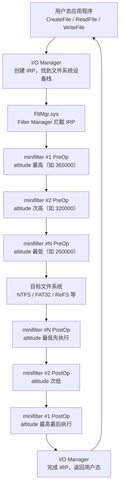

# Windows内核（16）· 文件系统微过滤驱动

## 概述与定位

> [!abstract] TL;DR
> 文件系统微过滤驱动（minifilter）是 Windows 在 Filter Manager（`FltMgr.sys`）框架下实现文件 I/O 拦截的现代机制。开发者无需手写完整的文件系统过滤驱动，只需向 FltMgr 注册回调，指定 **altitude**（高度）决定调用顺序，即可在 `IRP_MJ_CREATE`、`IRP_MJ_READ`、`IRP_MJ_WRITE` 等关键操作的 pre/post 阶段介入。EDR、防病毒引擎、加密驱动、备份软件均大量使用该框架。逆向分析 minifilter 是理解安全产品文件监控能力的核心手段。

### 旧式文件系统过滤驱动的局限

在 minifilter 框架出现之前，Windows 提供的文件系统过滤机制是**传统文件系统过滤驱动**（Legacy File System Filter Driver）。开发者必须：

- 手工将设备对象附加（`IoAttachDeviceToDeviceStack`）到文件系统或卷设备栈之上；
- 自己管理 IRP 的传递、完成与取消；
- 处理所有 `IRP_MJ_*` 类型，即使对绝大多数操作不感兴趣；
- 多个过滤驱动共存时，加载顺序决定调用顺序，缺乏统一管理，容易导致驱动冲突和 BSOD。

从 Windows XP SP2 开始，微软引入了 **Filter Manager**（过滤管理器），将公共基础设施封装进 `FltMgr.sys`，使开发者可以聚焦于业务逻辑，由框架统一管理 I/O 路径，这就是 minifilter 框架。

### minifilter 的核心优势

| 对比项 | 传统过滤驱动 | minifilter |
|--------|------------|-----------|
| 设备栈附加 | 手工 `IoAttachDevice*` | FltMgr 代劳 |
| 调用顺序管理 | 加载顺序，不可预测 | altitude 数值精确控制 |
| IRP 覆盖需求 | 必须处理所有 `IRP_MJ_*` | 只注册感兴趣的操作 |
| 多驱动共存 | 容易冲突 | FltMgr 统一协调 |
| 文件名获取 | 需要手工解析 `FILE_OBJECT` | `FltGetFileNameInformation` |
| 生产环境支持 | 微软不再推荐 | 官方推荐，WDK 一等公民 |

Windows 10/11 x64 上所有主流安全产品均已迁移至 minifilter 框架。

---

## 原理与机制

### I/O 调用链全景

每次用户态文件操作（`CreateFile`/`ReadFile`/`WriteFile` 等）最终产生一个 **IRP**（I/O Request Packet），在内核中经过以下路径：



> [!warning] 示例输出为示意
> 实际 altitude 值由微软分配，上图数值仅用于说明高低顺序，不代表真实产品 altitude。

**关键规律**：
- **PreOp（前操作回调）**：altitude 从高到低依次调用——应用层安全产品（高 altitude）先看到请求；
- **PostOp（后操作回调）**：altitude 从低到高依次调用——底层驱动先处理完成事件；
- 某个 minifilter 的 PreOp 若返回 `FLT_PREOP_COMPLETE`，则 IRP 不再下发，后续所有 minifilter 的 PreOp 以及文件系统本身均不执行；
- altitude 相同时，行为未定义，生产驱动必须申请唯一值。

### Altitude 分配规范

微软将 altitude 数值空间划分为多个范围，开发者须向微软申请属于特定类别的值：

| 范围 | 用途类别 | 典型产品类型 |
|------|---------|------------|
| 420000–429999 | FSFilter Top | 最顶层过滤（研究/调试） |
| 360000–389999 | FSFilter Anti-Virus | 防病毒、EDR 文件实时扫描 |
| 320000–329999 | FSFilter Replication | 文件复制/同步 |
| 280000–289999 | FSFilter Continuous Backup | 持续备份 |
| 260000–269999 | FSFilter Content Screener | 内容过滤/DLP |
| 240000–249999 | FSFilter Quota Management | 磁盘配额管理 |
| 180000–189999 | FSFilter System Recovery | 系统还原 |
| 140000–149999 | FSFilter Cluster File System | 集群文件系统 |
| 100000–109999 | FSFilter HSM | 分层存储管理 |
| 80000–89999 | FSFilter Imaging | 磁盘映像 |
| 60000–69999 | FSFilter Compression | 文件压缩 |
| 40000–49999 | FSFilter Encryption | 文件加密（EFS 等） |
| 20000–29999 | FSFilter Backup | 传统备份软件 |

逆向分析时，若发现一个驱动的 altitude 落在 **360000–389999** 范围，几乎可以断定其是防病毒或 EDR 类产品的文件监控组件。

---

## 结构 / WinDbg / 伪代码详解

### FLT_REGISTRATION 注册结构

minifilter 注册的核心是填充 `FLT_REGISTRATION` 结构体，向 FltMgr 描述自身能力和回调：

```c
typedef struct _FLT_REGISTRATION {
    USHORT                                  Size;               // sizeof(FLT_REGISTRATION)
    USHORT                                  Version;            // FLT_REGISTRATION_VERSION
    FLT_REGISTRATION_FLAGS                  Flags;              // 通常为 0
    CONST FLT_CONTEXT_REGISTRATION         *ContextRegistration; // Context 类型数组
    CONST FLT_OPERATION_REGISTRATION       *OperationRegistration; // I/O 回调数组
    PFLT_FILTER_UNLOAD_CALLBACK             FilterUnloadCallback;   // 驱动卸载回调
    PFLT_INSTANCE_SETUP_CALLBACK            InstanceSetupCallback;  // 实例附加卷时调用
    PFLT_INSTANCE_QUERY_TEARDOWN_CALLBACK   InstanceQueryTeardownCallback;
    PFLT_INSTANCE_TEARDOWN_CALLBACK         InstanceTeardownStartCallback;
    PFLT_INSTANCE_TEARDOWN_CALLBACK         InstanceTeardownCompleteCallback;
    PFLT_GENERATE_FILE_NAME                 GenerateFileNameCallback;  // 通常 NULL
    PFLT_NORMALIZE_NAME_COMPONENT           NormalizeNameComponentCallback;
    PFLT_NORMALIZE_CONTEXT_CLEANUP          NormalizeContextCleanupCallback;
    PFLT_TRANSACTION_NOTIFICATION_CALLBACK  TransactionNotificationCallback;
    PFLT_NORMALIZE_NAME_COMPONENT_EX        NormalizeNameComponentExCallback;
    PFLT_SECTION_CONFLICT_NOTIFICATION_CALLBACK SectionNotificationCallback;
} FLT_REGISTRATION, *PFLT_REGISTRATION;
```

**字段说明**：

| 字段 | 类型 | 说明 |
|------|------|------|
| `Size` | `USHORT` | 必须为 `sizeof(FLT_REGISTRATION)`，FltMgr 用于版本兼容检查 |
| `Version` | `USHORT` | 固定为 `FLT_REGISTRATION_VERSION`（当前为 0x0203） |
| `Flags` | `FLT_REGISTRATION_FLAGS` | 通常 0；`FLTFL_REGISTRATION_DO_NOT_SUPPORT_SERVICE_STOP` 禁止服务停止卸载 |
| `ContextRegistration` | 指针 | `FLT_CONTEXT_REGISTRATION` 数组，描述驱动使用的 Context 类型；以 `{FLT_CONTEXT_END}` 结尾 |
| `OperationRegistration` | 指针 | `FLT_OPERATION_REGISTRATION` 数组，每项对应一个 `IRP_MJ_*` 操作；以 `{IRP_MJ_OPERATION_END}` 结尾 |
| `FilterUnloadCallback` | 函数指针 | 驱动卸载时调用，清理资源 |
| `InstanceSetupCallback` | 函数指针 | FltMgr 将过滤器附加到新卷时调用；返回 `STATUS_FLT_DO_NOT_ATTACH` 可拒绝附加 |

### FLT_OPERATION_REGISTRATION 操作注册

```c
typedef struct _FLT_OPERATION_REGISTRATION {
    UCHAR                            MajorFunction;    // IRP_MJ_CREATE 等
    FLT_OPERATION_REGISTRATION_FLAGS Flags;            // 通常 0
    PFLT_PRE_OPERATION_CALLBACK      PreOperation;     // 前回调，可为 NULL
    PFLT_POST_OPERATION_CALLBACK     PostOperation;    // 后回调，可为 NULL
    PVOID                            Reserved1;        // 保留，必须为 NULL
} FLT_OPERATION_REGISTRATION, *PFLT_OPERATION_REGISTRATION;
```

典型的 EDR 文件监控注册示例（伪代码）：

```c
// EDR 驱动注册示例（伪代码）
CONST FLT_OPERATION_REGISTRATION g_Callbacks[] = {
    {
        IRP_MJ_CREATE,          // 文件创建/打开
        0,
        PreCreateCallback,
        PostCreateCallback,
        NULL
    },
    {
        IRP_MJ_WRITE,           // 文件写入
        0,
        PreWriteCallback,
        PostWriteCallback,
        NULL
    },
    {
        IRP_MJ_SET_INFORMATION, // 文件信息修改（重命名/删除）
        0,
        PreSetInformationCallback,
        NULL,
        NULL
    },
    {
        IRP_MJ_CLEANUP,         // 句柄关闭前的清理
        0,
        NULL,
        PostCleanupCallback,
        NULL
    },
    { IRP_MJ_OPERATION_END }    // 终止标记
};

CONST FLT_REGISTRATION g_FltRegistration = {
    sizeof(FLT_REGISTRATION),
    FLT_REGISTRATION_VERSION,
    0,                          // Flags
    g_ContextRegistration,
    g_Callbacks,
    DriverUnloadCallback,
    InstanceSetupCallback,
    NULL,
    NULL,
    NULL,
    NULL,
    NULL,
    NULL,
    NULL,
    NULL,
    NULL
};
```

### DriverEntry 注册流程（伪代码）

```c
NTSTATUS DriverEntry(
    _In_ PDRIVER_OBJECT  DriverObject,
    _In_ PUNICODE_STRING RegistryPath
) {
    NTSTATUS status;

    // 第一步：向 FltMgr 注册过滤器，获取 PFLT_FILTER 句柄
    status = FltRegisterFilter(
        DriverObject,        // 本驱动的驱动对象
        &g_FltRegistration,  // 注册结构体
        &g_FilterHandle      // [OUT] 过滤器句柄，后续操作均需要此句柄
    );
    if (!NT_SUCCESS(status)) {
        return status;
    }

    // 第二步：激活过滤器——此后回调开始被调用
    // 注意：FltStartFiltering 之前，即使注册成功，回调也不会触发
    status = FltStartFiltering(g_FilterHandle);
    if (!NT_SUCCESS(status)) {
        FltUnregisterFilter(g_FilterHandle);
        return status;
    }

    return STATUS_SUCCESS;
}
```

**关键点**：`FltRegisterFilter` 只是向 FltMgr 登记，此时回调尚未激活；`FltStartFiltering` 是真正"开工"的调用，调用后 I/O 路径上的回调立即生效。逆向时，若发现 `FltRegisterFilter` 调用但找不到 `FltStartFiltering`，说明该驱动注册了但还未激活（可能是条件激活或存在 bug）。

### Pre 回调详解

```c
FLT_PREOP_CALLBACK_STATUS PreCreateCallback(
    _Inout_ PFLT_CALLBACK_DATA    Data,    // I/O 请求数据
    _In_    PCFLT_RELATED_OBJECTS FltObjects, // 过滤器/卷/实例/文件对象
    _Flt_CompletionContext_Outptr_ PVOID *CompletionContext // 传给 PostOp 的上下文
) {
    NTSTATUS status;
    PFLT_FILE_NAME_INFORMATION nameInfo = NULL;

    // 获取文件名（归一化路径）
    status = FltGetFileNameInformation(
        Data,
        FLT_FILE_NAME_NORMALIZED | FLT_FILE_NAME_QUERY_DEFAULT,
        &nameInfo
    );
    if (!NT_SUCCESS(status)) {
        return FLT_PREOP_SUCCESS_NO_CALLBACK;
    }

    // 解析路径组成部分：目录/文件名/扩展名
    FltParseFileNameInformation(nameInfo);

    // nameInfo->Name       —— 完整路径，如 \Device\HarddiskVolume3\Windows\notepad.exe
    // nameInfo->FinalComponent —— 文件名，如 notepad.exe
    // nameInfo->Extension  —— 扩展名，如 exe
    // nameInfo->ParentDir  —— 父目录，如 \Device\HarddiskVolume3\Windows\

    // 业务逻辑：检查扩展名是否为危险类型
    if (IsBlockedExtension(&nameInfo->Extension)) {
        // 直接拒绝，不下发到文件系统
        Data->IoStatus.Status = STATUS_ACCESS_DENIED;
        Data->IoStatus.Information = 0;
        FltReleaseFileNameInformation(nameInfo);
        return FLT_PREOP_COMPLETE;  // IRP 在此终止
    }

    FltReleaseFileNameInformation(nameInfo);

    // 正常放行，同时请求 PostOp 回调（传递上下文）
    *CompletionContext = (PVOID)someContext;
    return FLT_PREOP_SUCCESS_WITH_CALLBACK;
}
```

### FLT_PREOP_CALLBACK_STATUS 返回值语义

| 返回值 | 含义 | 典型用途 |
|--------|------|---------|
| `FLT_PREOP_SUCCESS_NO_CALLBACK` | 放行 IRP，不需要 PostOp 回调 | 对本次请求不感兴趣时的默认处理 |
| `FLT_PREOP_SUCCESS_WITH_CALLBACK` | 放行 IRP，需要 PostOp 回调 | 需要在操作完成后检查结果（如获取最终路径） |
| `FLT_PREOP_COMPLETE` | IRP 在此终止，不下发到文件系统 | 主动拒绝或主动完成操作（拦截/重定向） |
| `FLT_PREOP_PENDING` | 将 IRP 挂起，稍后异步继续 | 需要异步决策（如发送到用户态代理审核） |
| `FLT_PREOP_SYNCHRONIZE` | 在 PostOp 中同步等待，不切换线程 | 需要在同一线程上下文处理后续结果 |
| `FLT_PREOP_DISALLOW_FASTIO` | 拒绝 Fast I/O，降级为正常 IRP | 强制走完整 IRP 路径以便拦截 |

### Context（上下文）机制

minifilter 通过 Context 在多个回调之间共享状态。FltMgr 支持多种粒度的 Context：

```c
// Context 类型及其生命周期
typedef enum _FLT_CONTEXT_TYPE {
    FLT_VOLUME_CONTEXT         = 0x0001,  // 每个卷一个，卷卸载时释放
    FLT_INSTANCE_CONTEXT       = 0x0002,  // 每个过滤器实例一个
    FLT_FILE_CONTEXT           = 0x0004,  // 每个文件（FILE_OBJECT）一个
    FLT_STREAM_CONTEXT         = 0x0008,  // 每个数据流一个（NTFS 交替数据流）
    FLT_STREAMHANDLE_CONTEXT   = 0x0010,  // 每个文件句柄一个
    FLT_TRANSACTION_CONTEXT    = 0x0020,  // 每个 TxF 事务一个
    FLT_SECTION_CONTEXT        = 0x0040,  // 节对象关联的上下文
} FLT_CONTEXT_TYPE;
```

EDR 使用 `STREAM_CONTEXT` 的典型模式：

```c
// 在 PostCreate 中分配上下文，记录文件打开时的信息
FLT_POSTOP_CALLBACK_STATUS PostCreateCallback(
    _Inout_ PFLT_CALLBACK_DATA       Data,
    _In_    PCFLT_RELATED_OBJECTS    FltObjects,
    _In_opt_ PVOID                   CompletionContext,
    _In_    FLT_POST_OPERATION_FLAGS Flags
) {
    PMY_STREAM_CONTEXT ctx = NULL;
    NTSTATUS status;

    if (!NT_SUCCESS(Data->IoStatus.Status)) {
        return FLT_POSTOP_FINISHED_PROCESSING;
    }

    // 分配流上下文
    status = FltAllocateContext(
        FltObjects->Filter,
        FLT_STREAM_CONTEXT,
        sizeof(MY_STREAM_CONTEXT),
        PagedPool,
        (PFLT_CONTEXT *)&ctx
    );
    if (!NT_SUCCESS(status)) {
        return FLT_POSTOP_FINISHED_PROCESSING;
    }

    RtlZeroMemory(ctx, sizeof(MY_STREAM_CONTEXT));
    ctx->FileSize     = GetCurrentFileSize(FltObjects);
    ctx->OpenTime     = KeQuerySystemTime();
    ctx->IsExecutable = IsExecutableFile(&nameInfo->Extension);

    // 将上下文挂到文件流，后续 Write/Cleanup 回调可获取
    status = FltSetStreamContext(
        FltObjects->Instance,
        FltObjects->FileObject,
        FLT_SET_CONTEXT_KEEP_IF_EXISTS,
        ctx,
        NULL  // old context
    );

    FltReleaseContext(ctx);  // 引用计数减一，SetStreamContext 已增加引用
    return FLT_POSTOP_FINISHED_PROCESSING;
}

// 在 PreWrite 中获取上下文，检查行为模式
FLT_PREOP_CALLBACK_STATUS PreWriteCallback(
    _Inout_ PFLT_CALLBACK_DATA    Data,
    _In_    PCFLT_RELATED_OBJECTS FltObjects,
    _Out_   PVOID                *CompletionContext
) {
    PMY_STREAM_CONTEXT ctx = NULL;

    FltGetStreamContext(
        FltObjects->Instance,
        FltObjects->FileObject,
        (PFLT_CONTEXT *)&ctx
    );

    if (ctx != NULL) {
        // 统计写入次数，检测勒索软件批量加密模式
        InterlockedIncrement(&ctx->WriteCount);
        FltReleaseContext(ctx);
    }

    return FLT_PREOP_SUCCESS_NO_CALLBACK;
}
```

### WinDbg 内核调试 minifilter

内核调试时，`FltMgr` 提供了专属的 `!fltkd` 扩展命令：

```
// 列出系统中所有已注册的 minifilter（名称、altitude、实例数）
kd> !fltkd.filters

Filter List: fffff8046c3a2b80 "Frame 0"
   FLT_FILTER: fffff8048a120010 "WdFilter"   Num Instances=3   Altitude=328010
   FLT_FILTER: fffff8048c3f0010 "storqosflt" Num Instances=1   Altitude=244000
   FLT_FILTER: fffff8048d1e0010 "wcifs"      Num Instances=1   Altitude=189900
   FLT_FILTER: fffff8048e250010 "CldFlt"     Num Instances=1   Altitude=180451
   FLT_FILTER: fffff8048b670010 "FileCrypt"  Num Instances=1   Altitude=141100
   FLT_FILTER: fffff8047f230010 "luafv"      Num Instances=1   Altitude=135000
   FLT_FILTER: fffff8048f1a0010 "npsvctrig"  Num Instances=1   Altitude=46000
   FLT_FILTER: fffff804871b0010 "Wof"        Num Instances=3   Altitude=40700
   FLT_FILTER: fffff804867a0010 "FileInfo"   Num Instances=4   Altitude=45000
```

> [!warning] 示例输出为示意
> 上述输出为示意，真实系统中 altitude、地址、实例数因环境不同而异。`WdFilter` 是 Windows Defender 的文件过滤驱动，altitude 328010 位于防病毒范围内。

```
// 查看特定 filter 的详细信息（包括 OperationRegistration 地址）
kd> !fltkd.filter fffff8048a120010

FLT_FILTER: fffff8048a120010
   FilterName  : WdFilter
   Flags       : 00000000
   Altitude    : 00000000000000000000000000000000000000000000000000000000328010
   RefCount    : 00000003
   DriverObject: fffff8048a100030
   OperationRegistration[0x00]:
      IRP_MJ_CREATE         PreOp: fffff80489ab1234  PostOp: fffff80489ab5678
      IRP_MJ_WRITE          PreOp: fffff80489ab9abc  PostOp: fffff80489abdef0
      ...

// 列出所有过滤卷（已附加的文件系统卷）
kd> !fltkd.volumes

Volume List: fffff8046c3a2c50 "Frame 0"   Filter=fffff8046c3a2b80
   FLT_VOLUME: fffff8048b210010 "\Device\Mup"
   FLT_VOLUME: fffff8048a9e0010 "\Device\HarddiskVolume4"   (System)
   FLT_VOLUME: fffff8048b130010 "\Device\HarddiskVolume5"
   FLT_VOLUME: fffff804902a0010 "\Device\HarddiskVolume1"

// 在 PreCreate 回调入口设置断点
kd> bp WdFilter!WdPreCreateCallback

// 查看 FltMgr 全局状态
kd> !fltkd.frame 0

// 查看特定卷上附加的 minifilter 实例（及顺序）
kd> !fltkd.volume fffff8048a9e0010
```

**关键地址结构**：通过 `dt FltMgr!_FLT_FILTER <addr>` 可以直接查看过滤器结构体；通过 `dt FltMgr!_FLT_INSTANCE <addr>` 查看实例结构；`OperationRegistration` 数组地址可用于手工枚举所有注册的 pre/post 函数指针。

---

## 逆向视角 / 实战

### IDA/Ghidra 分析 minifilter 的通用流程

**第一步：定位 `FltRegisterFilter` 调用**

在 IDA 中，通过交叉引用（Xref）或字符串搜索定位注册点：

```
// IDA 中搜索导入函数
View → Open Subviews → Imports
搜索 "FltRegisterFilter"

// 或使用 Ctrl+F 搜索
"FltRegisterFilter"
```

找到调用站点后，查看传入的第二参数（`FLT_REGISTRATION*`）——这是整个分析的锚点。

**第二步：解析 `FLT_REGISTRATION` 结构体**

IDA 中，选中该指针数据，按 `T` 键（Apply Struct）或右键 → "Convert to struct"，应用 `FLT_REGISTRATION` 类型（需导入 WDK 符号）。

无符号情况下，手工识别：
- 偏移 `+0x00`：`USHORT Size`（通常为 0x78 或 0xA0，取决于 WDK 版本）
- 偏移 `+0x02`：`USHORT Version`（通常为 0x0203）
- 偏移 `+0x10`：`ContextRegistration` 指针
- 偏移 `+0x18`：`OperationRegistration` 指针 ← **最关键**
- 偏移 `+0x20`：`FilterUnloadCallback` 函数指针

**第三步：枚举 `FLT_OPERATION_REGISTRATION` 数组**

定位到 `OperationRegistration` 数组起始地址，每项 `FLT_OPERATION_REGISTRATION` 结构大小为 `0x28`（x64）：

```
偏移 +0x00: UCHAR MajorFunction  （0x00 = IRP_MJ_CREATE, 0x04 = IRP_MJ_READ, ...）
偏移 +0x08: PFLT_PRE_OPERATION_CALLBACK PreOperation
偏移 +0x10: PFLT_POST_OPERATION_CALLBACK PostOperation
偏移 +0x18: PVOID Reserved1
```

遍历直到 `MajorFunction == 0x80`（即 `IRP_MJ_OPERATION_END`）为止。

**第四步：分析各回调函数**

对找到的每个 pre/post 函数指针，在 IDA 中跳转（`G` 键输入地址），重点关注：
- `FltGetFileNameInformation` 调用 → 说明该驱动对文件名感兴趣；
- 对 `Data->IoStatus.Status` 的赋值后跟 `return FLT_PREOP_COMPLETE` → 说明有拦截逻辑；
- 对 `CompletionContext` 的写入 → 说明有 pre/post 配对的状态传递；
- `FltSendMessage` 调用 → 驱动将事件上报到用户态代理（典型 EDR 架构）。

**第五步：识别 altitude**

altitude 通常存储在注册表或驱动资源中，而非代码里硬编码。在 IDA 中搜索驱动 `.rsrc` 节或分析 `DriverEntry` 中读取注册表的代码，也可以：

```
// 加载后运行时查询：在系统上安装驱动后
kd> !fltkd.filters
// 直接读到 altitude
```

### 识别 EDR/AV 的文件监控特征

通过静态/动态分析，EDR 的 minifilter 通常呈现以下模式：

**1. Altitude 范围**：位于 `328000–389999`（防病毒范围），高于大多数其他过滤驱动，能先于其他驱动看到 I/O 请求。

**2. 监控的 IRP_MJ 操作**：

| 操作 | IRP_MJ 值 | EDR 关注原因 |
|------|----------|------------|
| `IRP_MJ_CREATE` | 0x00 | 文件打开/创建，检测恶意文件访问、进程注入 |
| `IRP_MJ_READ` | 0x03 | 读取内容，触发实时扫描 |
| `IRP_MJ_WRITE` | 0x04 | 写入检测，勒索软件行为监控 |
| `IRP_MJ_SET_INFORMATION` | 0x06 | 文件重命名/删除，检测文件系统操作 |
| `IRP_MJ_CLEANUP` | 0x12 | 句柄关闭，触发最终扫描（文件写入完成后） |

**3. 用户态通信**：通过 `FltSendMessage`（或共享内存/事件）将文件信息发送到用户态代理，由代理决策是否放行——这是现代 EDR 的经典双组件架构。

**4. 上下文使用**：大量使用 `STREAM_CONTEXT` 追踪文件生命周期内的行为（写入次数、写入模式、熵值变化等），这是检测勒索软件加密行为的核心手段。

### 勒索软件早期检测原理（防御视角）

EDR 利用 minifilter 检测勒索软件加密行为的核心逻辑：

```c
// 勒索软件检测伪代码（防御视角，理解 EDR 工作原理）
// 在 PreWrite 回调中监控写入行为

FLT_PREOP_CALLBACK_STATUS PreWriteCallback(
    PFLT_CALLBACK_DATA Data,
    PCFLT_RELATED_OBJECTS FltObjects,
    PVOID *CompletionContext
) {
    PPROCESS_CONTEXT procCtx = GetProcessContext(PsGetCurrentProcessId());

    if (procCtx != NULL) {
        // 统计该进程在短时间窗口内修改的不同文件数量
        InterlockedIncrement(&procCtx->FilesModifiedCount);

        // 检测高熵写入（加密后数据的熵接近最大值 8 bit/byte）
        PVOID buffer = GetWriteBuffer(Data);
        ULONG bufferLen = GetWriteLength(Data);
        if (bufferLen > 4096) {
            float entropy = CalculateShannonEntropy(buffer, bufferLen);
            if (entropy > 7.8f) {
                InterlockedIncrement(&procCtx->HighEntropyWriteCount);
            }
        }

        // 检测文件扩展名批量修改（SET_INFORMATION 中记录）
        // 若在 30 秒内：修改文件数 > 50 且 高熵写比例 > 70%
        // → 高概率勒索软件行为，触发告警或阻断
        if (procCtx->FilesModifiedCount > 50 &&
            procCtx->HighEntropyWriteCount * 100 / procCtx->FilesModifiedCount > 70) {
            TriggerRansomwareAlert(procCtx->ProcessId);
            // 根据策略决定是否返回 FLT_PREOP_COMPLETE 阻断
        }
    }

    return FLT_PREOP_SUCCESS_NO_CALLBACK;
}
```

此模式说明为何勒索软件一旦开始批量加密，即使绕过了用户态检测，仍会被内核层 minifilter 捕获——文件 I/O 路径无法绕过 FltMgr。

---

## 安全性与正确使用

> [!caution] 合规与法律边界
> **逆向分析 minifilter 的合规边界**：
>
> - **合法行为**：分析 minifilter 结构、识别 EDR 使用的 altitude 和监控的 IRP_MJ 类型、理解安全产品的检测逻辑——这是正当的安全研究、驱动开发和防御能力评估工作。
> - **禁止行为**：本文不提供、也不讨论绕过 EDR 文件监控的具体技术方法（包括 altitude 冲突攻击、FltMgr 内部结构篡改、强制卸载过滤器等攻击性手段）。
> - **测试环境**：所有内核驱动调试必须在虚拟机或专用物理测试机上进行，禁止在生产环境或未授权的系统上加载、测试 minifilter 驱动。
> - **altitude 申请**：生产环境部署的 minifilter 必须向微软申请唯一 altitude（通过 [filtermgr@microsoft.com](mailto:filtermgr@microsoft.com)），使用未分配的值在 Windows 11 签名驱动强制执行环境下可能导致驱动无法加载或系统不稳定。

### 开发中的常见陷阱

**陷阱 1：IRQL 约束**

Pre 回调运行于 `IRQL <= APC_LEVEL`（对大多数操作），但 Paging I/O 可能在 `DISPATCH_LEVEL`。在 pre 回调中：
- 不能调用 `FltGetFileNameInformation` 处理 Paging I/O（通过 `FLT_IS_IRP_OPERATION` 宏检查）；
- 不能分配 `PagedPool` 内存；
- 不能等待内核同步对象（Mutex、Event）。

```c
// 正确做法：在 PreRead 中过滤 Paging I/O
if (FlagOn(Data->Iopb->IrpFlags, IRP_PAGING_IO) ||
    FlagOn(Data->Iopb->IrpFlags, IRP_SYNCHRONOUS_PAGING_IO)) {
    return FLT_PREOP_SUCCESS_NO_CALLBACK;
}
```

**陷阱 2：错误使用 FLT_PREOP_COMPLETE**

返回 `FLT_PREOP_COMPLETE` 时，必须在 `Data->IoStatus` 中设置合法的完成状态。若设置了 `STATUS_SUCCESS` 但未正确填写 `Information` 字段（如 `CREATE` 操作中的 `FILE_OPENED` 等），上层会收到不一致的结果，导致应用程序行为异常。

**陷阱 3：Context 引用计数泄漏**

`FltAllocateContext` 分配后引用计数为 1，`FltSetStreamContext` 成功会再增加引用；调用者必须在不再需要时调用 `FltReleaseContext`（包括 `FltSetStreamContext` 失败的错误路径），否则引用计数不归零，Context 内存永远不释放，导致内核池泄漏。

**陷阱 4：在 InstanceSetupCallback 中错误处理返回值**

```c
NTSTATUS InstanceSetupCallback(
    PCFLT_RELATED_OBJECTS FltObjects,
    FLT_INSTANCE_SETUP_FLAGS Flags,
    DEVICE_TYPE VolumeDeviceType,
    FLT_FILESYSTEM_TYPE VolumeFilesystemType
) {
    // 只监控 NTFS 卷，跳过网络文件系统
    if (VolumeFilesystemType == FLT_FSTYPE_NTFS) {
        return STATUS_SUCCESS;  // 附加到此卷
    }
    return STATUS_FLT_DO_NOT_ATTACH;  // 拒绝附加
}
```

若对所有卷都返回 `STATUS_FLT_DO_NOT_ATTACH`，驱动实际上没有附加到任何卷，回调永远不会被调用——这是调试时常见的"驱动注册成功但不工作"的原因。

---

## 小结

文件系统微过滤驱动（minifilter）是 Windows 内核安全生态的核心基础设施：

1. **FltMgr 是骨架**：`FltMgr.sys` 统一管理所有文件 I/O 拦截请求，开发者只需注册回调，无需关心设备栈的低层细节；

2. **altitude 决定顺序**：微软分配的 altitude 数值精确控制多个 minifilter 的调用顺序，防病毒/EDR 高 altitude 确保先于其他驱动看到请求；

3. **pre/post 回调分工**：Pre 回调在 I/O 下发前介入（可拦截/修改），Post 回调在 I/O 完成后触发（可检查结果）；返回值语义严格，`FLT_PREOP_COMPLETE` 会截断整个 I/O 链；

4. **Context 贯穿生命周期**：通过 Stream Context 在 Create→Write→Cleanup 多个回调间共享状态，是行为检测（如勒索软件识别）的技术基础；

5. **逆向要点**：从 `FltRegisterFilter` 调用切入，解析 `FLT_REGISTRATION` → 枚举 `OperationRegistration` → 分析各 pre/post 函数，结合 `!fltkd.filters` 命令可快速定位系统中所有 minifilter 及其 altitude；

6. **安全产品架构**：现代 EDR 典型架构是内核 minifilter 负责捕获事件，通过 `FltSendMessage` 传至用户态代理决策，兼顾性能与灵活性。

---

## 相关阅读

- [[03.WDM驱动模型与IRP]] — IRP 结构与传递机制
- [[07.WinDbg内核调试]] — `!fltkd` 扩展命令详解
- [[09.内核回调机制]] — 进程/线程/注册表回调与文件回调的对比
- [[15.IRQL与内核同步]] — pre 回调中的 IRQL 约束与同步原语
- [[17.网络驱动与WFP]] — 网络 I/O 拦截框架（WFP）
- [Microsoft Docs: File System Minifilter Drivers](https://learn.microsoft.com/en-us/windows-hardware/drivers/ifs/filter-manager-concepts)
- [WDK Samples: miniFilter](https://github.com/microsoft/Windows-driver-samples/tree/main/filesys/miniFilter)

---

⬅️ 上一篇 [[15.IRQL与内核同步]] ｜ 🏠 [[00.Windows内核与驱动逆向总览]] ｜ 下一篇 [[17.网络驱动与WFP]] ➡️
