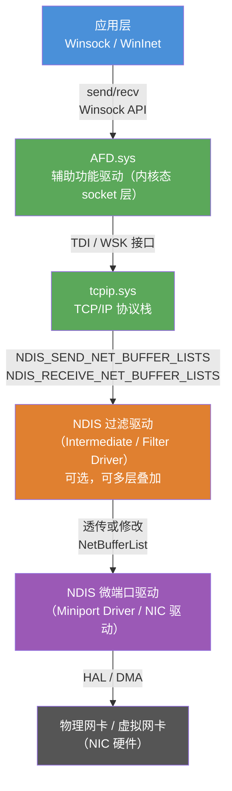
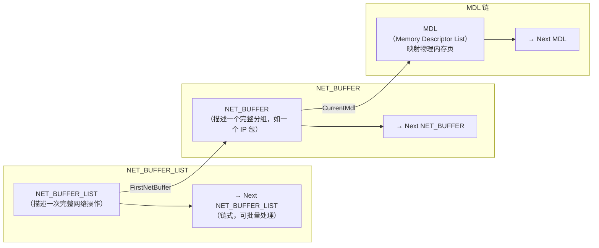
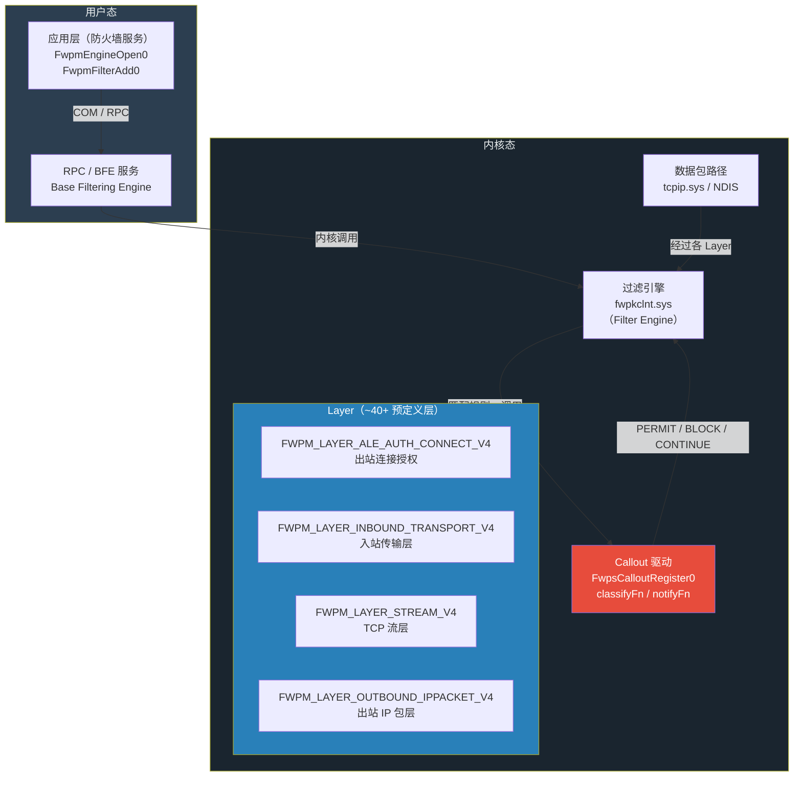

# Windows内核（17）· 网络驱动与WFP

## 概述与定位

> [!abstract] TL;DR
> Windows 网络栈由 **NDIS 分层架构**承载，从 NIC 硬件到 Winsock 应用层形成完整的驱动链；**WFP（Windows Filtering Platform）** 是 Vista 以来官方提供的内核级网络过滤框架，EDR、防火墙、DPI 引擎均基于它实现。本章从防御与逆向视角系统拆解：NDIS 分层模型与 NetBufferList 数据结构、WFP 的 Layer/Sublayer/Callout 三级体系、内核 Callout 驱动的注册与 `classifyFn` 分析，以及如何通过 IDA 和 WinDbg 定位第三方安全产品的 WFP 钩子。

在 Windows 内核生态中，网络子系统是攻防双方的重要战场——EDR 产品需要在此拦截恶意外联，Rootkit 试图绕开监控，网络取证工具则依赖这里捕获流量证据。理解底层架构，既是逆向分析商业安全产品的基础，也是正确开发高可靠过滤驱动的前提。

本章聚焦两条主线：

| 主线 | 涉及组件 | 典型使用场景 |
|---|---|---|
| NDIS 网络驱动架构 | `NDIS.sys`、微端口/协议/过滤驱动 | NIC 驱动开发、数据包捕获 |
| WFP 过滤平台 | `fwpkclnt.sys`、`fwpuclnt.dll` | 防火墙、DPI、进程网络访问控制 |

---

## 原理与机制

### NDIS 分层架构

NDIS（Network Driver Interface Specification）自 Windows Vista 起演进至 6.x 版本，构成了 Windows 网络栈的骨架。它将网络功能分解为若干可组合的驱动层，每层通过标准接口向上下层提供服务。



**NDIS 驱动类型**：

- **微端口驱动（Miniport Driver）**：与特定 NIC 硬件绑定，实现发送/接收原始帧。向上提供 `NdisMRegisterMiniportDriver` 注册的接口。
- **协议驱动（Protocol Driver）**：绑定到 NDIS，向下消费微端口服务（`tcpip.sys` 即是协议驱动）。
- **过滤驱动（Filter Driver）**：插入协议驱动与微端口之间，可透明拦截、修改或丢弃数据包。使用 `NdisFRegisterFilterDriver` 注册。

### NetBufferList 三层链结构

NDIS 6.x 废弃了旧式的 `NDIS_PACKET`，改用更灵活的三层链式结构描述网络数据：



`NET_BUFFER_LIST` 对应一次协议操作（如一个 TCP 发送），其下挂多个 `NET_BUFFER`（对应分片），每个 `NET_BUFFER` 通过 `MDL` 链描述实际物理内存映射。逆向过滤驱动时，必须熟悉 `NdisGetDataBuffer`、`NdisQueryMdl` 等辅助宏来安全读取数据内容。

### WFP 架构总览

WFP（Windows Filtering Platform）是 Windows Vista 起引入的内核网络过滤框架，将以往零散的 `ipfltdrv.sys`、TDI 过滤等机制统一为单一可扩展体系。



WFP 三级体系：

| 层级 | 概念 | 说明 |
|---|---|---|
| Layer | 过滤层 | 内核预定义的 40+ 个检查点，对应协议栈不同位置 |
| Sublayer | 子层 | 每个 Layer 内可有多个 Sublayer，按权重决定评估顺序 |
| Filter | 过滤规则 | 每条规则绑定到 Sublayer，匹配条件后执行动作或调用 Callout |
| Callout | 回调 | 驱动注册的自定义处理函数，可执行复杂逻辑并返回判决 |

---

## 结构 / WinDbg / 伪代码详解

### NDIS 微端口驱动特征结构

**`NDIS_MINIPORT_DRIVER_CHARACTERISTICS`**（NDIS 6.x）是微端口驱动的核心描述符，在 `NdisMRegisterMiniportDriver` 调用时传入：

```c
// NDIS 6.x 微端口驱动特征结构（关键字段）
typedef struct _NDIS_MINIPORT_DRIVER_CHARACTERISTICS {
    NDIS_OBJECT_HEADER          Header;              // 类型/版本/大小
    UCHAR                       MajorNdisVersion;    // 通常为 6
    UCHAR                       MinorNdisVersion;    // 如 0/20/30/60/80
    UCHAR                       MajorDriverVersion;
    UCHAR                       MinorDriverVersion;
    ULONG                       Flags;

    // 必选回调
    SET_OPTIONS_HANDLER         SetOptionsHandler;
    INITIALIZE_HANDLER_EX       InitializeHandlerEx; // 适配器初始化
    HALT_HANDLER_EX             HaltHandlerEx;       // 适配器停止
    UNLOAD_HANDLER              UnloadHandler;       // 驱动卸载

    // 数据路径回调（逆向重点）
    SEND_NET_BUFFER_LISTS_HANDLER   SendNetBufferListsHandler;   // 发送入口
    RETURN_NET_BUFFER_LISTS_HANDLER ReturnNetBufferListsHandler; // 接收完成

    // OID/设备管理
    OID_REQUEST_HANDLER_EX      OidRequestHandlerEx;
    // ... 更多可选回调
} NDIS_MINIPORT_DRIVER_CHARACTERISTICS;
```

**`NDIS_FILTER_DRIVER_CHARACTERISTICS`**（过滤驱动，通过 `NdisFRegisterFilterDriver` 注册）：

```c
typedef struct _NDIS_FILTER_DRIVER_CHARACTERISTICS {
    NDIS_OBJECT_HEADER          Header;
    UCHAR                       MajorNdisVersion;
    UCHAR                       MinorNdisVersion;
    UCHAR                       MajorDriverVersion;
    UCHAR                       MinorDriverVersion;
    ULONG                       Flags;

    NDIS_STRING                 FriendlyName;     // 过滤驱动友好名称
    NDIS_STRING                 UniqueName;       // 注册表唯一标识符
    NDIS_STRING                 ServiceName;      // SCM 服务名

    // 数据路径（逆向最关注的两个）
    FILTER_SEND_NET_BUFFER_LISTS_HANDLER    FilterSendNetBufferListsHandler;
    FILTER_RECEIVE_NET_BUFFER_LISTS_HANDLER FilterReceiveNetBufferListsHandler;

    // 附加/分离
    FILTER_ATTACH_HANDLER   FilterAttachHandler;
    FILTER_DETACH_HANDLER   FilterDetachHandler;
    // ...
} NDIS_FILTER_DRIVER_CHARACTERISTICS;
```

### WFP 核心结构

**`FWPS_CALLOUT0`**（内核 Callout 注册描述符）：

```c
typedef struct FWPS_CALLOUT0_ {
    GUID                calloutKey;      // 唯一标识此 Callout 的 GUID
    UINT32              flags;           // FWP_CALLOUT_FLAG_CONDITIONAL_ON_FLOW 等
    FWPS_CALLOUT_CLASSIFY_FN0  classifyFn;  // 分类函数（判决核心）
    FWPS_CALLOUT_NOTIFY_FN0    notifyFn;    // 规则添加/删除通知
    FWPS_CALLOUT_FLOW_DELETE_NOTIFY_FN0 flowDeleteFn; // 流销毁通知（可为 NULL）
} FWPS_CALLOUT0;
```

**`classifyFn` 函数原型与参数含义**：

```c
void NTAPI MyClassifyFn(
    const FWPS_INCOMING_VALUES0         *inFixedValues,  // 包头固定字段
    const FWPS_INCOMING_METADATA_VALUES0 *inMetaValues,  // 元数据
    void                                *layerData,      // 负载（NET_BUFFER_LIST*）
    const void                          *classifyContext,// 分类上下文（可为 NULL）
    const FWPS_FILTER0                  *filter,         // 触发此回调的过滤规则
    UINT64                               flowContext,     // 流上下文（流层有效）
    FWPS_CLASSIFY_OUT0                  *classifyOut     // 输出：判决结果
);
```

`inFixedValues` 按 Layer 定义提供字段数组，例如在 `FWPM_LAYER_ALE_AUTH_CONNECT_V4` 层：

| 字段索引 | 宏名 | 含义 |
|---|---|---|
| 0 | `FWPS_FIELD_ALE_AUTH_CONNECT_V4_ALE_APP_ID` | 应用程序路径（Unicode 字符串） |
| 1 | `FWPS_FIELD_ALE_AUTH_CONNECT_V4_ALE_USER_ID` | 用户 SID |
| 5 | `FWPS_FIELD_ALE_AUTH_CONNECT_V4_IP_LOCAL_ADDRESS` | 本地 IP |
| 8 | `FWPS_FIELD_ALE_AUTH_CONNECT_V4_IP_REMOTE_ADDRESS` | 远端 IP |
| 10 | `FWPS_FIELD_ALE_AUTH_CONNECT_V4_IP_REMOTE_PORT` | 远端端口 |
| 12 | `FWPS_FIELD_ALE_AUTH_CONNECT_V4_ALE_ORIGINAL_APP_ID` | 原始应用路径（含重定向时） |

`inMetaValues` 提供更丰富的元数据：

```c
// 关键字段
UINT64 processId;           // 发起连接的进程 PID（FWPS_METADATA_FIELD_PROCESS_ID）
UINT32 processFlags;        // 进程标志
FWPS_PROCESS_PATH0 *appEndPointHandle; // 进程路径
```

**`FWPS_CLASSIFY_OUT0`**（判决输出结构）：

```c
typedef struct FWPS_CLASSIFY_OUT0_ {
    FWP_ACTION_TYPE  actionType;    // 判决类型
    UINT64           outContext;    // 输出上下文
    UINT64           filterId;      // 触发规则 ID（调试用）
    UINT32           rights;        // 权限标志
    UINT32           flags;         // FWPS_CLASSIFY_OUT_FLAG_IS_LOOPBACK 等
    UINT32           reserved;
} FWPS_CLASSIFY_OUT0;

// actionType 取值
// FWP_ACTION_BLOCK   (0x00000001 | 0x00001000) → 阻断
// FWP_ACTION_PERMIT  (0x00000002 | 0x00001000) → 放行
// FWP_ACTION_CONTINUE (0x00000100)             → 继续评估下一规则（不终止）
```

### Callout 驱动注册伪代码

```c
// 1. 驱动入口：创建设备对象并注册 Callout
NTSTATUS DriverEntry(PDRIVER_OBJECT DriverObject, PUNICODE_STRING RegistryPath)
{
    NTSTATUS status;
    PDEVICE_OBJECT deviceObject = NULL;

    // 创建设备（Callout 注册需要 DeviceObject）
    UNICODE_STRING deviceName = RTL_CONSTANT_STRING(L"\\Device\\MyWfpFilter");
    status = IoCreateDevice(DriverObject, 0, &deviceName,
                            FILE_DEVICE_UNKNOWN, 0, FALSE, &deviceObject);
    if (!NT_SUCCESS(status)) return status;

    // 注册内核 Callout
    FWPS_CALLOUT0 callout = {0};
    callout.calloutKey  = MY_CALLOUT_GUID;   // {xxxxxxxx-...}
    callout.classifyFn  = MyClassifyFn;
    callout.notifyFn    = MyNotifyFn;
    callout.flowDeleteFn = NULL;

    UINT32 calloutId = 0;
    status = FwpsCalloutRegister0(deviceObject, &callout, &calloutId);
    if (!NT_SUCCESS(status)) goto Cleanup;

    // （用户态服务负责调用 FwpmCalloutAdd0 / FwpmFilterAdd0 完成管理面配置）
    g_CalloutId = calloutId;
    return STATUS_SUCCESS;

Cleanup:
    IoDeleteDevice(deviceObject);
    return status;
}

// 2. Callout 分类函数：以进程级网络控制为例
void NTAPI MyClassifyFn(
    const FWPS_INCOMING_VALUES0          *inFixedValues,
    const FWPS_INCOMING_METADATA_VALUES0 *inMetaValues,
    void                                 *layerData,
    const void                           *classifyContext,
    const FWPS_FILTER0                   *filter,
    UINT64                                flowContext,
    FWPS_CLASSIFY_OUT0                   *classifyOut)
{
    // 默认：继续评估
    classifyOut->actionType = FWP_ACTION_CONTINUE;

    // 确认有权限写入判决
    if (!(classifyOut->rights & FWPS_RIGHT_ACTION_WRITE))
        return;

    // 获取远端端口（在 ALE_AUTH_CONNECT_V4 层）
    UINT16 remotePort = inFixedValues->incomingValue[
        FWPS_FIELD_ALE_AUTH_CONNECT_V4_IP_REMOTE_PORT].value.uint16;

    // 获取发起连接的进程 PID
    UINT64 pid = 0;
    if (inMetaValues->currentMetadataValues & FWPS_METADATA_FIELD_PROCESS_ID)
        pid = inMetaValues->processId;

    // 示例：阻断 PID 1234 的所有出站连接
    if (pid == 1234) {
        classifyOut->actionType = FWP_ACTION_BLOCK;
        classifyOut->rights    &= ~FWPS_RIGHT_ACTION_WRITE;
        return;
    }

    // 示例：阻断所有到 443 以外端口的出站连接
    if (remotePort != 443 && remotePort != 80) {
        classifyOut->actionType = FWP_ACTION_BLOCK;
        return;
    }

    classifyOut->actionType = FWP_ACTION_PERMIT;
}

// 3. 卸载时注销 Callout
VOID DriverUnload(PDRIVER_OBJECT DriverObject)
{
    if (g_CalloutId != 0)
        FwpsCalloutUnregisterById0(g_CalloutId);

    if (g_EngineHandle != NULL) {
        FwpmFilterDeleteById0(g_EngineHandle, g_FilterId);
        FwpmCalloutDeleteById0(g_EngineHandle, g_WfpmCalloutId);
        FwpmEngineClose0(g_EngineHandle);
    }
    IoDeleteDevice(DriverObject->DeviceObject);
}
```

### 用户态管理面配置伪代码

```c
// 用户态服务（如防火墙服务进程）配置 WFP 规则
HANDLE engineHandle = NULL;
UINT32 calloutId = 0, sublayerId = 0;
UINT64 filterId = 0;

// 打开 BFE（Base Filtering Engine）
FwpmEngineOpen0(NULL, RPC_C_AUTHN_WINNT, NULL, NULL, &engineHandle);

// 注册 Callout（管理面记录，与内核注册对应）
FWPM_CALLOUT0 fwpmCallout = {0};
fwpmCallout.calloutKey  = MY_CALLOUT_GUID;
fwpmCallout.displayData.name        = L"MyWfpCallout";
fwpmCallout.applicableLayer         = FWPM_LAYER_ALE_AUTH_CONNECT_V4;
FwpmCalloutAdd0(engineHandle, &fwpmCallout, NULL, &calloutId);

// 添加 Sublayer
FWPM_SUBLAYER0 sublayer = {0};
sublayer.subLayerKey = MY_SUBLAYER_GUID;
sublayer.displayData.name = L"MySubLayer";
sublayer.weight           = 0x100;  // 优先级权重
FwpmSubLayerAdd0(engineHandle, &sublayer, NULL);

// 添加过滤规则（匹配所有 IPv4 出站 ALE 连接）
FWPM_FILTER0 filter = {0};
filter.layerKey      = FWPM_LAYER_ALE_AUTH_CONNECT_V4;
filter.subLayerKey   = MY_SUBLAYER_GUID;
filter.weight.type   = FWP_UINT8;
filter.weight.uint8  = 15;
filter.numFilterConditions = 0;  // 无条件：匹配所有
filter.action.type   = FWP_ACTION_CALLOUT_INSPECTION;  // 调用 Callout 检查
filter.action.calloutKey = MY_CALLOUT_GUID;
FwpmFilterAdd0(engineHandle, &filter, NULL, &filterId);
```

---

## 逆向视角 / 实战

### 定位目标驱动的 WFP Callout

逆向 EDR/防火墙产品时，第一步是找到其 WFP Callout 的注册位置和 `classifyFn` 实现。

**IDA Pro 静态分析流程**：

1. 在 IDA 中打开目标驱动 `.sys` 文件，等待分析完成
2. 搜索 `FwpsCalloutRegister` 的导入引用（`Imports` 窗口过滤 `fwpkclnt`）
3. 交叉引用（`X`）定位所有调用点
4. 调用前的 `FWPS_CALLOUT0` 结构体初始化代码即是关键区域——重命名字段，特别关注 `classifyFn` 指针
5. 进入 `classifyFn`，分析条件判断逻辑：
   - 查找 `inFixedValues->incomingValue[N]` 的访问（`N` 对应字段索引，上表所示）
   - 查找 `inMetaValues->processId` 或 `inMetaValues->currentMetadataValues` 的检查
   - 追踪 `classifyOut->actionType` 的赋值路径（`FWP_ACTION_BLOCK` = `0x1001`，`FWP_ACTION_PERMIT` = `0x1002`）

**WinDbg 动态分析**：

```windbg
; 断点监控所有 Callout 注册（需内核调试附加）
bp fwpkclnt!FwpsCalloutRegister0

; 断下后查看参数（x64 calling convention：RCX=DevObj, RDX=Callout 结构体指针, R8=输出 ID 指针）
; 在 RDX 指向的结构中读取 classifyFn 字段（偏移 0x18）
dt FWPS_CALLOUT0 @rdx

; 查看 Callout GUID（结构偏移 0x00 起 16 字节）
db @rdx L10

; 对 classifyFn 下断点（从结构体读取函数指针）
bp poi(@rdx+0x18)
```

> [!warning] 示例输出为示意
> 以下为 WinDbg 执行 `dt FWPS_CALLOUT0 @rdx` 的示意性输出，实际值因驱动而异：
> ```
> nt!FWPS_CALLOUT0
>    +0x000 calloutKey       : {a1b2c3d4-...}
>    +0x010 flags            : 0
>    +0x018 classifyFn       : 0xfffff800`12345678  MyDriver!MyClassifyFn
>    +0x020 notifyFn         : 0xfffff800`1234abcd  MyDriver!MyNotifyFn
>    +0x028 flowDeleteFn     : (null)
> ```

**`netsh wfp` 工具（用户态管理面审计）**：

```cmd
; 导出当前系统所有 WFP 过滤规则（需管理员权限）
netsh wfp show filters output=C:\tmp\wfp_filters.xml

; 导出 Callout 注册信息
netsh wfp show state output=C:\tmp\wfp_state.xml

; 分析 netEventMonitor（实时监控被阻断的连接）
netsh wfp capture start file=C:\tmp\wfp_cap.etl keywords=0x1FF
; ... 触发目标动作 ...
netsh wfp capture stop
```

> [!warning] 示例输出为示意
> `netsh wfp show filters` 的 XML 片段（示意）：
> ```xml
> <filters numItems="156">
>   <item>
>     <filterKey>{deadbeef-cafe-...}</filterKey>
>     <displayData><name>MyWfpFilter</name></displayData>
>     <layerKey>FWPM_LAYER_ALE_AUTH_CONNECT_V4</layerKey>
>     <subLayerKey>{...}</subLayerKey>
>     <action><type>FWP_ACTION_CALLOUT_INSPECTION</type>
>             <calloutKey>{...MY_CALLOUT_GUID...}</calloutKey></action>
>     <weight><type>FWP_UINT8</type><uint8>15</uint8></weight>
>   </item>
> </filters>
> ```

### 常用 Layer 与防御场景映射

| Layer 名称 | 主要用途 | 可获得信息 |
|---|---|---|
| `FWPM_LAYER_ALE_AUTH_CONNECT_V4/V6` | 出站连接授权（按进程/用户控制） | PID、应用路径、远端 IP/端口 |
| `FWPM_LAYER_ALE_AUTH_RECV_ACCEPT_V4/V6` | 入站接受授权 | PID、本地端口、远端 IP |
| `FWPM_LAYER_INBOUND_TRANSPORT_V4/V6` | 入站传输层（IP 头已解析） | IP 头、TCP/UDP 端口（无 PID） |
| `FWPM_LAYER_OUTBOUND_TRANSPORT_V4/V6` | 出站传输层 | 同上 |
| `FWPM_LAYER_INBOUND_IPPACKET_V4/V6` | 入站 IP 包（最早检查点） | IP 头（无 TCP/UDP 端口） |
| `FWPM_LAYER_OUTBOUND_IPPACKET_V4/V6` | 出站 IP 包 | 同上 |
| `FWPM_LAYER_STREAM_V4/V6` | TCP 流层（含负载） | 应用层数据内容（DPI） |
| `FWPM_LAYER_ALE_FLOW_ESTABLISHED_V4/V6` | 流建立通知（关联 PID） | PID + 流信息，适合建立流上下文 |
| `FWPM_LAYER_DATAGRAM_DATA_V4/V6` | UDP 数据报层 | UDP 负载 |

### 数据包注入

WFP Callout 还可以在判断后将修改过的数据包重新注入协议栈。常见用途：透明代理、数据包修改。

```c
// 异步注入出站网络层数据包（示意）
FWPS_PACKET_INJECTION_STATE injectionState;
injectionState = FwpsQueryPacketInjectionState0(
    g_InjectionHandle, netBufferList, NULL);

if (injectionState == FWPS_PACKET_NOT_INJECTED) {
    // 克隆 NBL 以便修改
    NET_BUFFER_LIST *clonedNbl = NULL;
    FwpsAllocateCloneNetBufferList0(netBufferList, NULL, NULL, 0, &clonedNbl);

    // ... 修改 clonedNbl 数据 ...

    // 异步注入（回调 CompletionFn 后释放克隆 NBL）
    FwpsInjectNetworkSendAsync0(
        g_InjectionHandle,
        NULL,
        0,
        compartmentId,
        clonedNbl,
        MyInjectCompletionFn,
        NULL);

    // 阻断原始包（防止重复）
    classifyOut->actionType = FWP_ACTION_BLOCK;
}
```

### NDIS 过滤驱动逆向要点

逆向基于 NDIS 的数据包捕获驱动（如早期 WinPcap/Npcap 原理）：

1. 在 IDA 中找 `NdisFRegisterFilterDriver` 调用，获取 `NDIS_FILTER_DRIVER_CHARACTERISTICS` 结构体
2. 定位 `FilterReceiveNetBufferListsHandler` 和 `FilterSendNetBufferListsHandler` — 这是数据包流经的两个关键函数
3. 在接收处理函数中，追踪 `NET_BUFFER_LIST` 的遍历循环，以及 `NdisGetDataBuffer` / `NdisQueryMdl` 的调用（数据实际读取点）
4. 注意"透传"行为：合法过滤驱动调用结束后必须将 NBL 传递给 `NdisFIndicateReceiveNetBufferLists` 或 `NdisFSendNetBufferListsComplete`，若驱动静默丢弃（不调用任何继续函数），则构成隐蔽拦截

---

## 安全性与正确使用

> [!caution] 合规边界
> - **分析授权范围**：逆向 WFP 规则用于**网络取证、防御加固、安全评估**是合规的；本章不提供利用 WFP 进行流量劫持或中间人攻击的武器化步骤，此类操作未经授权属于违法行为。
> - **代码签名**：从 Windows 10 开始，内核驱动必须具备有效的 EV 代码签名（WHQL 或自签名需关闭 Secure Boot + 测试签名模式）。未签名的 WFP Callout 驱动无法在正常配置的系统上加载。
> - **避免误阻断**：Callout 中 `classifyOut->actionType` 不赋值时默认为 `FWP_ACTION_CONTINUE`（值 0），切勿在错误路径中错误返回 `FWP_ACTION_BLOCK`——对所有连接误阻断将导致系统网络完全中断，严重时需安全模式修复。
> - **IRQL 约束**：`classifyFn` 在 `DISPATCH_LEVEL` 或更低 IRQL 执行，禁止在其中调用可能导致页错误的操作（如访问可分页内存），也不可使用等待同步原语（`KeWaitForSingleObject` 等）。
> - **流层竞态**：在 `FWPM_LAYER_STREAM_V4` 层操作时，若选择暂挂（`FwpsPendClassify0`）等待异步判断，必须严格管理引用计数并保证在所有路径上都调用 `FwpsCompleteClassify0`，否则会导致流永久挂起（网络连接卡死）。
> - **资源释放顺序**：卸载驱动时，必须先 `FwpsCalloutUnregisterById0` 完成（此函数在所有 `classifyFn` 返回后才完成），再删除设备对象；反序释放会触发蓝屏或悬挂引用。

### WFP Callout 驱动稳健性检查清单

| 检查项 | 说明 |
|---|---|
| 注册前设备对象有效 | `FwpsCalloutRegister0` 的第一个参数不可为 NULL |
| `classifyFn` 中判断 `FWPS_RIGHT_ACTION_WRITE` | 若无写权限，只能读取，不能修改 `actionType` |
| `FWP_ACTION_CONTINUE` 是默认安全值 | 对不关注的流量明确设置 CONTINUE，不留未初始化值 |
| 卸载前先注销 Callout | 用 `FwpsCalloutUnregisterById0`，不能仅删除设备对象 |
| 异步注入使用克隆 NBL | 注入原 NBL 后仍被原路径使用会导致 Double-free |
| 流层操作管理 Pend/Complete 配对 | 每个 Pend 必须有对应 Complete，否则流挂起 |

---

## 小结

本章系统梳理了 Windows 网络驱动的两大核心子系统：

**NDIS 架构**：理解了应用层 Winsock 到物理网卡之间的完整驱动链，以及 NDIS 6.x 的三层数据描述结构（`NET_BUFFER_LIST` → `NET_BUFFER` → `MDL`）。过滤驱动通过 `NdisFRegisterFilterDriver` 注入协议与微端口之间，是早期数据包捕获工具的基础机制。

**WFP 架构**：掌握了 Layer / Sublayer / Filter / Callout 四级体系。内核 Callout 驱动通过 `FwpsCalloutRegister0` 注册，`classifyFn` 是判决核心，通过 `inFixedValues`/`inMetaValues` 可获取连接的 PID、应用路径、IP/端口等完整上下文，最终向 `classifyOut->actionType` 写入 `FWP_ACTION_PERMIT`/`FWP_ACTION_BLOCK`/`FWP_ACTION_CONTINUE`。

**逆向实战**：IDA 中通过 `FwpsCalloutRegister` 交叉引用快速定位 Callout 实现；WinDbg `bp fwpkclnt!FwpsCalloutRegister0` 可动态捕获注册时机；`netsh wfp show filters` 是无需反汇编即可枚举系统当前所有 WFP 规则的利器。

EDR 和商业防火墙大量使用 `FWPM_LAYER_ALE_AUTH_CONNECT_V4` 实现进程级出站控制，使用 `FWPM_LAYER_STREAM_V4` 实现 DPI——读懂这套体系，是分析同类产品防护逻辑和评估网络安全覆盖范围的基础能力。

---

## 相关阅读

- [[03.WDM驱动模型与IRP]] — IRP 机制与驱动基础，WFP Callout 驱动也遵循 WDM 框架
- [[07.WinDbg内核调试]] — WinDbg 命令速查，本章 `bp fwpkclnt!...` 调试方法前置知识
- [[09.内核回调机制]] — 进程/线程/模块回调，与 WFP 进程 ID 获取配合使用
- [[16.文件系统微过滤驱动]] — minifilter 框架，与 WFP Callout 框架设计思路相似
- [[18.ETW与内核遥测]] — ETW 网络事件，与 WFP 事件日志互补的遥测手段

---

⬅️ 上一篇 [[16.文件系统微过滤驱动]] ｜ 🏠 [[00.Windows内核与驱动逆向总览]] ｜ 下一篇 [[18.ETW与内核遥测]] ➡️
