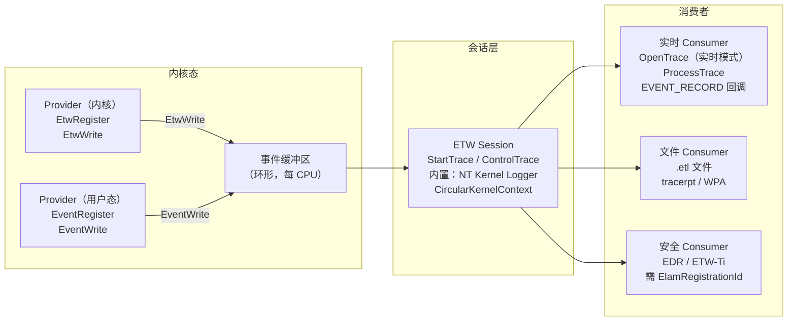
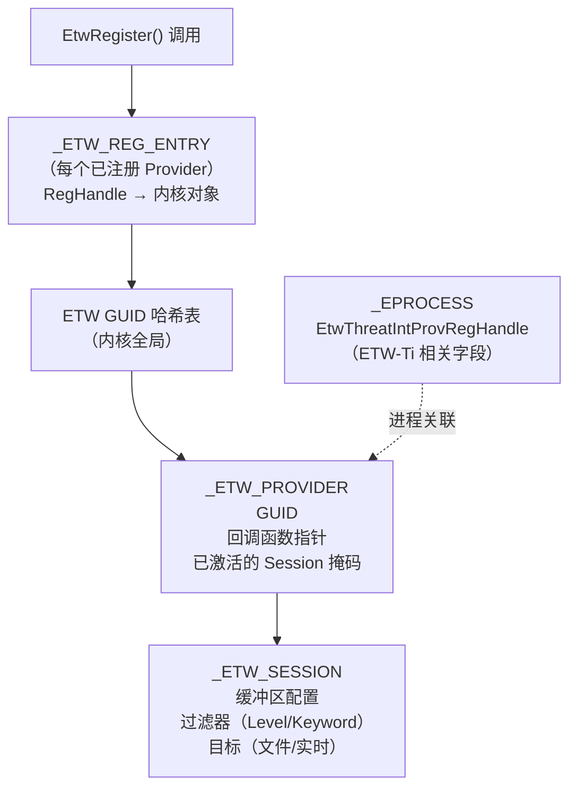
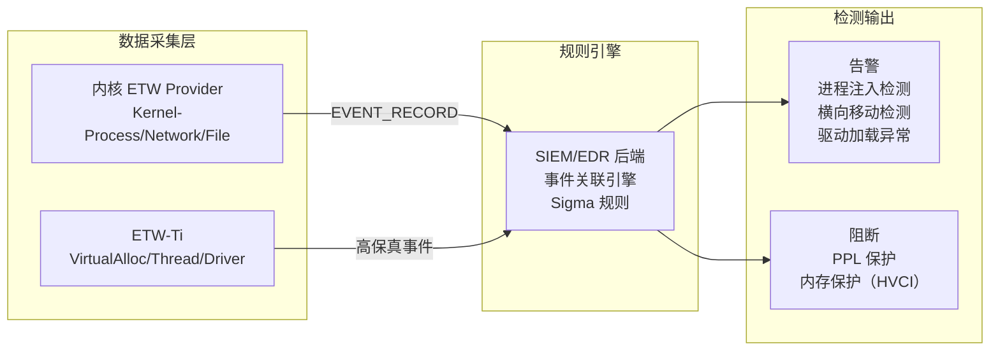

# Windows内核（18）· ETW与内核遥测

## 概述与定位

> [!abstract] TL;DR
> ETW（Event Tracing for Windows）是 Windows 内置的高性能事件追踪框架，贯穿用户态与内核态。从 EDR/AV 产品到 Windows Defender，大量防御侧遥测依赖 ETW，尤其是专供安全厂商的 **ETW-Ti（Threat Intelligence）** provider。本章从防御视角梳理 ETW 三层架构、关键内核 provider 及其 GUID、ETW-Ti 的订阅机制与 EPROCESS 联动、驱动中如何注册/发送事件、逆向 ETW 相关代码的方法，以及恶意软件绕过 ETW 遥测的手法和蓝队检测策略。

ETW 自 Windows 2000 引入，历经多个版本演化，在 Windows 10/11 x64 上已成为系统诊断、性能分析和安全遥测的核心基础设施。与 SSDT Hook、内核回调等机制相比，ETW 在内核层直接植入事件埋点，具有以下特点：

- **低开销**：采用内存缓冲区环形队列，仅在 consumer 订阅时才真正传递事件，无 consumer 时几乎零开销。
- **统一接口**：用户态和内核态均使用同一套 API（`EtwRegister`/`EtwWrite`），consumer 端使用 `OpenTrace`/`ProcessTrace`。
- **多路复用**：同一 provider 可被多个 session 同时订阅，互不干扰。
- **安全分级**：ETW-Ti provider 需要特权才能订阅，防止恶意软件监听安全事件。

理解 ETW 对于内核逆向工程师有双重价值：一方面可以利用 ETW 事件构建驱动行为的高层视图（比 WinDbg 单步调试效率高得多）；另一方面，理解攻击者如何试图规避 ETW 监控，是设计有效检测规则的前提。

---

## 原理与机制

### ETW 三层架构

ETW 采用经典的**生产者—中间层—消费者**模型，三层分别是 Provider、Session 和 Consumer。



#### Provider（提供者）

Provider 是事件的产生方，可以是内核驱动、内核本身（`ntoskrnl.exe`）或用户态进程。每个 Provider 用一个 128 位 GUID 唯一标识，并在系统 ETW 注册表（`HKLM\SYSTEM\CurrentControlSet\Control\WMI\Security`）中维护元数据。

**内核态注册流程**：

```c
// WDK 驱动中注册 ETW provider
REGHANDLE RegHandle;
NTSTATUS status = EtwRegister(
    &ProviderGuid,   // 128位GUID，标识此provider
    NULL,            // Callback（可选，用于收到enable/disable通知）
    NULL,            // CallbackContext
    &RegHandle       // 输出：注册句柄
);

// 发送事件
if (EtwEventEnabled(RegHandle, &EventDesc)) {
    EtwWrite(
        RegHandle,
        &EventDesc,   // EVENT_DESCRIPTOR：Id、Version、Level、Keyword
        ParamCount,
        Params        // EVENT_DATA_DESCRIPTOR 数组
    );
}
```

`EtwEventEnabled` 在无 consumer 订阅时直接返回 `FALSE`，从而跳过事件序列化，这是 ETW 低开销的关键。

**用户态注册流程**（`advapi32.dll` / `sechost.dll`）：

```c
REGHANDLE hProvider;
EventRegister(&ProviderGuid, NULL, NULL, &hProvider);
EventWriteTransfer(hProvider, &EventDesc, NULL, NULL, DataCount, Data);
EventUnregister(hProvider);
```

#### Session（会话）

Session 是 ETW 的控制中枢，负责管理缓冲区、路由事件到目标（文件或实时）。Session 通过 `StartTrace` API 创建，并用 `ControlTrace` 进行配置。

关键内置 Session：

| Session 名称 | GUID | 说明 |
|---|---|---|
| NT Kernel Logger | `{9E814AAD-3204-11D2-9A82-006008A86939}` | 系统级低层事件：进程/线程、内存、磁盘 I/O、网络 |
| Circular Kernel Context Logger (CKL) | 系统保留 | 环形缓冲，Windows 崩溃分析用 |
| EventLog-Security | 系统保留 | Windows 安全事件日志的 ETW 后端 |

每个 CPU 核心有独立的**事件缓冲区**（默认 64KB，可配置），Producer 写入本地 CPU 缓冲，减少锁竞争。Session 线程周期性地将填满的缓冲区刷新到目标（文件或内存队列供实时 Consumer 消费）。

一个 provider 可以同时被多个 Session 订阅（最多 8 个 Session 可启用同一 provider），每个 Session 可独立设置 `Level`（严重级别）和 `MatchAnyKeyword`/`MatchAllKeyword`（关键字掩码）过滤事件。

#### Consumer（消费者）

Consumer 通过 `OpenTrace`（指定 `.etl` 文件或实时 session 名称）加事件回调函数，再调用 `ProcessTrace`（阻塞式）逐一消费 `EVENT_RECORD`。每条 `EVENT_RECORD` 包含：

- `EventHeader`：时间戳、进程 ID、线程 ID、Provider GUID、`EVENT_DESCRIPTOR`（Id、Version、Level、Keyword、Task、Opcode、Channel）
- `UserData`/`UserDataLength`：实际事件载荷（需要根据 Provider 的 MOF 或 Manifest 解析）

---

### ETW 内部数据流与内核结构

ETW 的核心数据结构在 `ntoskrnl.exe` 中维护：



---

## 结构 / WinDbg / 伪代码详解

### _ETW_REG_ENTRY 结构

在 WinDbg 内核调试环境下，可以查看 ETW 注册条目：

```
kd> dt nt!_ETW_REG_ENTRY
   +0x000 RegList          : _LIST_ENTRY
   +0x010 Callback         : Ptr64     void
   +0x018 CallbackContext  : Ptr64     void
   +0x020 Provider         : Ptr64 _ETW_PROVIDER
   +0x028 Index            : Uint2B
   ...
```

通过 `!gle` 可以快速查看当前线程的 ETW 相关最后错误，但更有用的是直接枚举已注册的 provider：

```
// 在 WinDbg 中通过符号找到 ETW GUID 哈希表
kd> x nt!EtwpProviderTable
kd> dt nt!_ETW_PROVIDER <address>
kd> !list -x "dt nt!_ETW_REG_ENTRY" <address>
```

### 查看系统中所有已注册 ETW Provider

**用户态工具**（管理员权限）：

```cmd
logman query providers
```

> [!warning] 示例输出为示意
> ```
> Provider                                 GUID
> -------------------------------------------------------------------------------
> Microsoft-Windows-Kernel-Process         {22FB2CD6-0E7B-422B-A0C7-2FAD1FD0E716}
> Microsoft-Windows-Kernel-Network         {7DD42A49-5329-4832-8DFD-43D979153A88}
> Microsoft-Windows-Kernel-File            {EDD08927-9CC4-4E65-B970-C2560FB5C289}
> Microsoft-Windows-Kernel-Registry        {70EB4F03-C1DE-4F73-A051-33D13D5413BD}
> Microsoft-Windows-Threat-Intelligence   {F4E1897C-BB5D-5668-F1D8-040F4D8DD344}
> ...
> ```

```cmd
// 列出当前活跃的 ETW Session
logman query -ets

// 查看特定 Session 的详情
logman query "NT Kernel Logger" -ets
```

### 关键内核 ETW Provider 详表

| Provider 名称 | GUID | 覆盖事件 |
|---|---|---|
| `Microsoft-Windows-Kernel-Process` | `{22FB2CD6-0E7B-422B-A0C7-2FAD1FD0E716}` | 进程创建/销毁（含命令行）、线程创建/销毁、镜像加载/卸载 |
| `Microsoft-Windows-Kernel-Network` | `{7DD42A49-5329-4832-8DFD-43D979153A88}` | TCP/UDP 连接、收发包（含进程 ID、本地/远程端点） |
| `Microsoft-Windows-Kernel-File` | `{EDD08927-9CC4-4E65-B970-C2560FB5C289}` | 文件创建、读写、重命名、删除（需在 session 中启用） |
| `Microsoft-Windows-Kernel-Registry` | `{70EB4F03-C1DE-4F73-A051-33D13D5413BD}` | 注册表键值读写、创建、删除 |
| NT Kernel Logger | `{9E814AAD-3204-11D2-9A82-006008A86939}` | 系统调用进入/退出、内存操作、磁盘 I/O、网络底层 |
| `Microsoft-Windows-Threat-Intelligence` (ETW-Ti) | `{F4E1897C-BB5D-5668-F1D8-040F4D8DD344}` | 进程/线程创建（含 PPID、命令行）、`VirtualAlloc`/`VirtualProtect`（Shellcode 监控）、远程线程、驱动加载 |
| `Microsoft-Windows-Security-Auditing` | `{54849625-5478-4994-A5BA-3E3B0328C30D}` | 登录、权限操作、对象访问（Windows 安全事件日志后端） |
| `Microsoft-Windows-Kernel-EventTracing` | `{B675EC37-BDB6-4648-BC92-F3FDC74D3CA2}` | ETW 自身的元事件（provider 注册/注销、session 启停） |

### ETW-Ti：专供 EDR 的高权限内核遥测

`Microsoft-Windows-Threat-Intelligence`（ETW-Ti）是 Windows 从 Vista/7 SP1 起引入（在 Win10 大幅增强）的特殊 provider，仅供安全软件使用。其特殊之处在于：

1. **订阅需要特权**：订阅方的进程必须持有 `ElamRegistrationId`（早期启动反恶意软件注册 ID）或具备特定的 ELAM 证书。这意味着普通进程（包括恶意软件）无法监听 ETW-Ti 事件，防止攻击者通过 ETW 反侦察。

2. **覆盖高价值事件**：ETW-Ti 在内核关键路径上（而非仅在 API 层）插入埋点，包括：
   - 进程和线程的创建与终止（包含父进程 ID 和完整命令行）
   - `NtAllocateVirtualMemory` 调用（可检测 shellcode 注入的内存分配模式）
   - `NtProtectVirtualMemory` 调用（RW→RX 权限变更，经典注入指标）
   - 远程线程创建（`NtCreateThreadEx` 的跨进程场景）
   - 驱动镜像加载

3. **EPROCESS 关联**：内核在每个 `_EPROCESS` 结构体中维护 ETW-Ti 相关字段，用于确定该进程是否是受监控目标，以及关联的 provider 注册句柄。

### 内核驱动中的 ETW 完整示例（WDK 伪代码）

```c
#include <ntddk.h>
#include <wdm.h>

// 自定义 provider GUID（逆向时在 IDA 中以此为锚点）
DEFINE_GUID(MyProviderGuid,
    0x12345678, 0xABCD, 0x1234, 0xAB, 0xCD, 0x12, 0x34, 0x56, 0x78, 0x90, 0xAB);

REGHANDLE g_RegHandle = (REGHANDLE)0;

// DriverEntry 中注册 ETW provider
NTSTATUS DriverEntry(PDRIVER_OBJECT DriverObject, PUNICODE_STRING RegistryPath)
{
    NTSTATUS status;

    // 注册 provider
    status = EtwRegister(
        &MyProviderGuid,
        NULL,            // 无 enable/disable 回调
        NULL,
        &g_RegHandle
    );
    if (!NT_SUCCESS(status)) {
        return status;
    }

    // ... 其他初始化 ...

    DriverObject->DriverUnload = DriverUnload;
    return STATUS_SUCCESS;
}

// 发送事件的辅助函数
VOID LogFileOperation(PUNICODE_STRING FilePath, ULONG ProcessId)
{
    // EVENT_DESCRIPTOR 定义事件元数据
    EVENT_DESCRIPTOR EventDesc;
    EventDescCreate(
        &EventDesc,
        1,              // EventId
        0,              // Version
        0,              // Channel
        TRACE_LEVEL_INFORMATION,
        0x1,            // Task
        0x0,            // Opcode
        0x8000000000000001ULL  // Keyword
    );

    // 仅在有 consumer 订阅时才序列化事件
    if (!EtwEventEnabled(g_RegHandle, &EventDesc)) {
        return;
    }

    EVENT_DATA_DESCRIPTOR DataDesc[2];
    EventDataDescCreate(&DataDesc[0], FilePath->Buffer,
                        FilePath->Length);
    EventDataDescCreate(&DataDesc[1], &ProcessId,
                        sizeof(ULONG));

    EtwWrite(g_RegHandle, &EventDesc, 2, DataDesc);
}

VOID DriverUnload(PDRIVER_OBJECT DriverObject)
{
    if (g_RegHandle != (REGHANDLE)0) {
        EtwUnregister(g_RegHandle);
    }
}
```

---

## 逆向视角 / 实战

### 在 IDA 中逆向 ETW 相关代码

逆向一个未知驱动时，ETW 注册代码是理解驱动行为的重要入口点：

**第一步：定位 EtwRegister 调用**

在 IDA 中搜索导入表或字符串，找到 `EtwRegister` 的所有交叉引用（Xref）。每个调用点通常在 `DriverEntry` 或模块初始化函数中，且第一个参数是指向 16 字节 GUID 的指针。

```
// IDA 中按 X 查看 EtwRegister 的交叉引用
// 找到 GUID 后右键 → "Convert to GUID" 或手动读取字节拼出
// 格式：{XXXXXXXX-XXXX-XXXX-XXXX-XXXXXXXXXXXX}
```

**第二步：用 GUID 查询 Provider 含义**

将提取到的 GUID 在以下来源中查找：
- `logman query providers` 输出
- Microsoft 官方 ETW Provider 文档
- GitHub 上的 `ETWProviders` 等开源项目

**第三步：追踪 EtwWrite 的事件含义**

找到 `EtwRegHandle` 变量后，追踪其作为参数传入的 `EtwWrite` / `EtwEventEnabled` 调用，结合 `EVENT_DESCRIPTOR` 的 Id 和 Keyword 字段，配合 Provider 的 manifest（`.man` 文件或内嵌资源）推断具体事件语义。

**第四步：识别 ETW 相关条件判断**

合法驱动会检查 `EtwEventEnabled` 返回值再发送事件；恶意驱动可能完全跳过此检查，或者在特定条件下禁用自身的事件发送（反取证行为）。

### 使用 xperf / WPR 录制内核事件

```cmd
// 启动录制（管理员权限）
xperf -on DiagEasy -f kernel.etl

// 或使用 WPR（Windows Performance Recorder）
wpr -start GeneralProfile -filemode

// 执行目标操作...

// 停止录制
xperf -stop
// 或
wpr -stop output.etl

// 解析事件（文本格式）
tracerpt kernel.etl -o kernel.xml -of XML
tracerpt kernel.etl -o kernel.csv -of CSV

// 用 WPA（Windows Performance Analyzer）可视化分析
wpa kernel.etl
```

### 监控特定 Provider 的实时事件

```cmd
// 启用 Kernel-Process provider 进行进程追踪（管理员）
xperf -on Microsoft-Windows-Kernel-Process:0x10:5 -f proc.etl

// 0x10 = ImageLoad 关键字，:5 = Verbose 级别
// 等待片刻后停止
xperf -stop
tracerpt proc.etl -o proc.csv -of CSV
```

### SilkETW / SealighterTI：专为安全研究的 ETW 工具

SilkETW 是 FireEye 开源的 ETW consumer 工具，支持将 ETW 事件以 JSON 格式输出或转发到 Elasticsearch，特别适合：

- 构建进程行为基线
- 实时检测异常事件模式（如频繁的 `VirtualProtect` 调用）
- 订阅多个 provider 并关联分析

SealighterTI 进一步扩展了对 ETW-Ti 的访问能力（需要特权），使安全研究人员能够在受控环境中订阅 ETW-Ti 事件。

### WinDbg 分析 ETW 运行状态

```
// 查看 ETW 全局状态
kd> dt nt!_ETW_SILODRIVERSTATE

// 枚举已注册的 provider（通过遍历 GUID 哈希表）
kd> !etw providers

// 查看指定进程的 ETW-Ti 相关字段
kd> dt nt!_EPROCESS <address>
// 关注 EtwThreatIntProvRegHandle 字段

// 查看当前活跃的 ETW Session
kd> !etw sessions
```

---

## 安全性与正确使用

### ETW-Ti 的订阅安全机制

ETW-Ti 的访问控制依赖以下机制：

1. **ELAM（Early Launch Anti-Malware）注册**：合法的安全软件在系统启动极早期（Boot 阶段）通过 ELAM 驱动进行注册，获得 `ElamRegistrationId`。此 ID 是订阅 ETW-Ti 的凭证之一。

2. **进程保护（PPL）**：订阅 ETW-Ti 的进程通常以 PPL（Protected Process Light）级别运行，系统强制阻止其他进程注入或终止它，保证遥测数据的可信性。

3. **签名验证**：ELAM 驱动必须经过微软签名，不允许第三方随意创建 ELAM 组件。

> [!caution] 合规边界
> **ETW-Ti 是防御基础设施，不是攻击工具。** 以下行为属于违规或违法操作，本文仅从检测角度描述，不提供实现代码：
>
> - 绕过 ELAM 注册限制以非法订阅 ETW-Ti（破坏安全边界）
> - 修改运行中进程的 `_EPROCESS` 内部字段以干扰 ETW-Ti 遥测（这是典型的 Rootkit 行为，在严格司法管辖区属于刑事犯罪）
> - 在未授权系统上部署内核驱动来禁用 ETW session
>
> 安全研究应在隔离的测试环境中进行，并符合所在地法律法规。CTF/研究环境下的技术探索需获得明确授权。

### 恶意软件对 ETW 的规避行为（检测视角）

恶意驱动（Rootkit）为逃避 EDR 基于 ETW 的检测，常采用以下手法。蓝队需了解这些手法以设计对应检测：

#### 手法一：禁用 ETW Session

攻击者可以调用 `ControlTrace` 停止目标 Session（需要 `SeSystemtimePrivilege` 或管理员权限）。

**检测方法**：
- 监控 `ControlTrace`（`EVENT_TRACE_CONTROL_STOP`）的调用，特别是对 NT Kernel Logger 或安全相关 Session 的停止操作
- Windows Security Center 对特定 Session 状态有周期性心跳检测
- 检测 Session 消失事件（`Microsoft-Windows-Kernel-EventTracing` provider 会产生相应事件）

#### 手法二：操纵 EPROCESS 中的 ETW-Ti 相关字段

部分高级恶意软件通过内核漏洞利用（如任意内核写入原语），将 `_EPROCESS` 中与 ETW-Ti 关联的字段清零或修改，使目标进程"脱离" ETW-Ti 监控范围。

**防御方与检测方法**：

- **基于 HVCI（Hypervisor-Protected Code Integrity）**：在启用了 VBS/HVCI 的系统上，内存页保护由 Hypervisor 强制，攻击者无法通过内核写入修改被 Hypervisor 保护的关键结构（Win11 + 最新安全基线）。

- **周期性完整性校验**：安全驱动可以周期性地枚举所有运行中进程的 `_EPROCESS`，将 ETW-Ti 相关字段与已知良好状态进行比对。任何异常差异触发告警。

- **Kernel Sensor（内核传感器）**：企业级 EDR 部署的内核驱动可以 Hook 内核对象修改路径（如通过 PatchGuard 安全的回调机制），检测对关键 `_EPROCESS` 字段的非预期写入。

- **Volatility 内存取证**：在事后取证场景中，使用 Volatility 框架加载内存转储，通过 `etwproviders` 等插件枚举 ETW 状态，对比正常基线检测异常。

```python
# Volatility 3 命令示例（取证用途）
# vol.py -f memory.dmp windows.etw.EtwProviders
# 检查 provider 状态是否与已知正常基线一致
```

#### 手法三：Patching ETW 发送函数

用户态的攻击手法（不属于内核级，但影响用户态遥测）：在自身进程内存中 patch `ntdll!EtwEventWrite` 函数的开头字节为 `ret` 指令，使本进程的所有 ETW 事件静默丢弃。

**检测方法**：
- 内核 ETW-Ti 的 `ImageLoad` / `ProcessCreation` 事件在内核层生成，不经过用户态 `ntdll`，因此用户态 patch 无法影响内核 ETW-Ti 遥测。
- EDR 可以在内核层监控对 `ntdll.dll` 内存页的写入操作（借助 `NtProtectVirtualMemory` ETW-Ti 事件），检测内存 patch 行为。
- Process memory scanning（内存扫描）可以检测 `EtwEventWrite` 函数是否被修改。

#### 手法四：Provider 注销或重注册欺骗

攻击者可能尝试注销某个 provider 的注册（调用 `EtwUnregister`），或用相同 GUID 重新注册一个无害的 provider，以混淆安全系统。

**检测方法**：
- `Microsoft-Windows-Kernel-EventTracing` provider 本身记录所有 provider 的注册/注销事件，监控此 provider 可以检测异常的 provider 生命周期变化。
- 关键系统 provider 的注销应触发告警（NT Kernel Logger 不可注销，但用户态 provider 可以）。

### ETW 在蓝队工作流中的位置



---

## 小结

ETW 是 Windows 安全遥测的脊梁，理解其三层架构（Provider → Session → Consumer）是做内核逆向分析、EDR 原理研究和蓝队检测设计的基础。本章核心要点：

1. **架构**：每个 CPU 独立缓冲区、多 Session 多路复用、`EtwEventEnabled` 零开销快速路径。

2. **关键 Provider**：`Kernel-Process`（进程/镜像）、`Kernel-Network`（网络连接）、`Kernel-File`（文件 I/O）、`Kernel-Registry`（注册表）、NT Kernel Logger（低层系统事件）。GUID 需要背熟，在逆向和检测规则中频繁出现。

3. **ETW-Ti 的特殊性**：需要 ELAM 注册或特权才能订阅，覆盖 `VirtualAlloc`/`VirtualProtect` 等注入高价值事件，与 `_EPROCESS` 结构体深度关联，是现代 EDR 遥测的核心。

4. **逆向技巧**：IDA 中以 `EtwRegister` 为锚点，提取 GUID → 查询 Provider 含义 → 追踪 `EtwWrite` → 理解事件语义。

5. **攻防双方的博弈**：恶意软件试图通过停止 Session、修改 `_EPROCESS` 字段、patch 用户态函数等手段绕过 ETW 监控。蓝队的对策包括 HVCI 保护关键内存、周期性完整性校验、监控 `Kernel-EventTracing` 元事件，以及部署 PPL 保护 consumer 进程。

---

## 相关阅读

- [[07.WinDbg内核调试]] — WinDbg 基础命令，`dt`/`!process` 查看 EPROCESS 结构
- [[09.内核回调机制]] — `PsSetCreateProcessNotifyRoutineEx` 与 ETW 在进程监控上的互补关系
- [[11.Rootkit原理与检测]] — ETW 规避是 Rootkit 的常用技术之一
- [[12.PatchGuard与DSE与HVCI]] — HVCI 如何从 Hypervisor 层保护内核关键结构（包括 ETW 相关字段）
- [[17.网络驱动与WFP]] — WFP 与 `Kernel-Network` ETW provider 在网络监控上的关系

---

⬅️ 上一篇 [[17.网络驱动与WFP]] ｜ 🏠 [[00.Windows内核与驱动逆向总览]] ｜ 下一篇 [[19.PEB与TEB与KPCR]] ➡️
