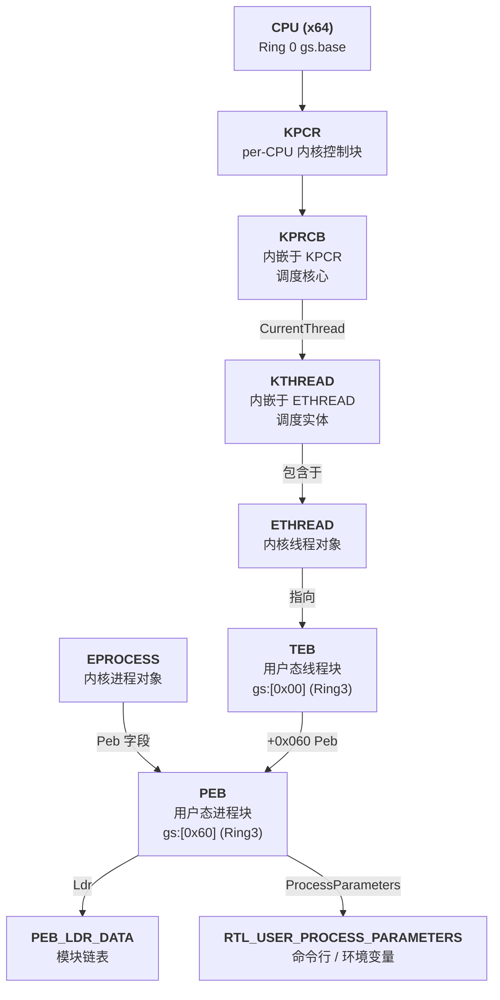
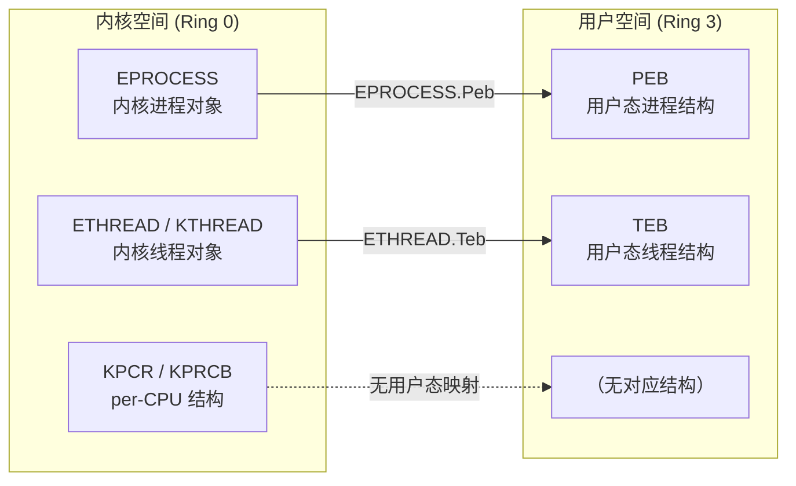

# Windows内核（19）· PEB与TEB与KPCR

## 概述与定位

> [!abstract] TL;DR
> PEB（Process Environment Block）是用户态每进程结构，保存进程加载模块列表、命令行、调试标志等关键信息，通过 `gs:[0x60]`（x64）访问。TEB（Thread Environment Block）是用户态每线程结构，保存线程本地存储、错误码、栈边界等，通过 `gs:[0x00]`（x64）访问。KPCR（Kernel Processor Control Region）是内核态每 CPU 结构，保存当前 CPU 的 GDT/IDT/TSS 及内嵌的 KPRCB 调度块，Ring 0 下通过 `gs` 段寄存器访问。三者共同构成 Windows 进程/线程/CPU 状态的完整运行时视图，是内核调试、逆向分析和安全检测的核心入口。

Windows 操作系统为每个运行实体维护一套对应的控制块（Control Block），这些控制块分布在用户态和内核态两个地址空间，通过特定的段寄存器快速寻址。从宏观上看：

- **进程维度**：内核侧为 `EPROCESS`，用户侧为 `PEB`；
- **线程维度**：内核侧为 `ETHREAD`/`KTHREAD`，用户侧为 `TEB`；
- **CPU 维度**：内核侧为 `KPCR`/`KPRCB`，用户侧无对应结构（CPU 属性对用户态透明）。

理解这三组结构的布局与访问方式，是进行内核调试、Rootkit 检测、shellcode 分析以及内存取证的必要基础。本章以 Windows 10/11 x64 为基准平台，逐一拆解三大结构的字段、访问路径与逆向应用。

---

## 原理与机制

### 段寄存器作为结构指针

x86/x64 架构用段寄存器实现快速的"线程本地"/"CPU 本地"数据访问。Windows 的设计：

- **用户态**（Ring 3）：`gs` 基址 → 当前线程的 TEB；通过 TEB 内的 `+0x060 Peb` 字段可进一步到达 PEB；
- **内核态**（Ring 0）：`gs` 基址经 `swapgs` 切换后指向当前 CPU 的 KPCR；系统调用入口 `KiSystemCall64` 首先执行 `swapgs` 完成此切换。

> [!note] swapgs 的作用
> `swapgs` 是 x64 特有指令，用于交换 `MSR_GS_BASE`（当前 gs.base）与 `MSR_KERNEL_GS_BASE`（备份 gs.base）。进入内核时执行一次，退出内核时再执行一次，确保 Ring 3 的 `gs` 始终指向 TEB，Ring 0 的 `gs` 始终指向 KPCR。

### 三层结构的层次关系



### 内核态与用户态的映射



---

## 结构 / WinDbg / 伪代码详解

### PEB（Process Environment Block）

#### 访问路径

| 架构 | 访问方式 | 说明 |
|------|---------|------|
| x64 | `gs:[0x60]` | `NtCurrentPeb()` 宏展开结果 |
| x64 内核 | `EPROCESS.Peb` | 由内核读取用户态 PEB 地址 |
| x86 | `fs:[0x30]` | 32 位进程（含 WOW64） |

```c
// 用户态获取 PEB（伪代码，x64）
PPEB pPeb = (PPEB)__readgsqword(0x60);
// 或直接调用内联函数
PPEB pPeb = NtCurrentPeb();
```

#### PEB 关键字段表（x64 偏移）

| 偏移 | 字段 | 类型 | 说明 |
|------|------|------|------|
| +0x000 | `InheritedAddressSpace` | `BYTE` | 是否继承地址空间 |
| +0x001 | `ReadImageFileExecOptions` | `BYTE` | 是否读取 IFEO 注册表 |
| +0x002 | `BeingDebugged` | `BYTE` | **1 = 被调试器附加** |
| +0x003 | `BitField` | `BYTE` | 含 `IsProtectedProcess`/`IsImageDynamicallyRelocated` 等 |
| +0x008 | `Mutant` | `HANDLE` | 进程互斥体（通常为 -1） |
| +0x010 | `ImageBaseAddress` | `PVOID` | PE 主模块加载基址 |
| +0x018 | `Ldr` | `PEB_LDR_DATA*` | 模块加载链表根节点 |
| +0x020 | `ProcessParameters` | `RTL_USER_PROCESS_PARAMETERS*` | 命令行/环境/cwd 等 |
| +0x038 | `SubSystemData` | `PVOID` | 子系统私有数据 |
| +0x040 | `ProcessHeap` | `PVOID` | 默认堆句柄 |
| +0x050 | `AtlThunkSListPtr` | `PVOID` | ATL thunk 列表 |
| +0x058 | `IFEOKey` | `PVOID` | IFEO 注册表键 |
| +0x060 | `CrossProcessFlags` | `ULONG` | `ProcessInJob`/`ProcessInitializing` 等标志 |
| +0x068 | `NtGlobalFlag` | `ULONG` | **调试时通常含 0x70** |
| +0x070 | `CriticalSectionTimeout` | `LARGE_INTEGER` | 临界区超时（默认 30 天） |
| +0x078 | `HeapSegmentReserve` | `ULONG_PTR` | 堆段预留大小 |
| +0x080 | `HeapSegmentCommit` | `ULONG_PTR` | 堆段提交大小 |
| +0x0B8 | `NumberOfProcessors` | `ULONG` | 可用 CPU 数量 |
| +0x0BC | `NtGlobalFlag2` | `ULONG` | 扩展全局标志 |
| +0x108 | `GdiHandleBuffer` | `ULONG[60]` | GDI 内核对象句柄缓存 |
| +0x230 | `SessionId` | `ULONG` | 登录会话 ID |

#### WinDbg PEB 操作速查

```
// 解析当前进程 PEB（用户态调试会话）
.peb
!peb

// 按地址展开结构
dt nt!_PEB @$peb

// 查看 Ldr 模块链表
dt nt!_PEB_LDR_DATA @$peb->Ldr

// 遍历 InMemoryOrderModuleList 中的 LDR_DATA_TABLE_ENTRY
dt nt!_LDR_DATA_TABLE_ENTRY <addr>

// 内核会话中读取指定进程的 PEB（先切换到目标进程上下文）
.process /p <EPROCESS_addr>
dt nt!_PEB @$peb
```

> [!warning] 示例输出为示意
> ```
> 0:000> .peb
> PEB at 示例地址00007ff...
>     InheritedAddressSpace:    No
>     ReadImageFileExecOptions: No
>     BeingDebugged:            No
>     ...
>     ImageBaseAddress:         示例地址00007ff...
>     Ldr                       示例地址00007ffd...
>         Ldr.Initialized:          Yes
>         Ldr.InInitializationOrderModuleList: ...
>         Ldr.InLoadOrderModuleList: ...
>         Ldr.InMemoryOrderModuleList: ...
>              Base TimeStamp                     Module
>              示例地址  ...         C:\Windows\System32\notepad.exe
>              示例地址  ...         ntdll.dll
>              示例地址  ...         KERNEL32.DLL
>              ...
> ```

#### PEB_LDR_DATA 与 LDR_DATA_TABLE_ENTRY

`PEB.Ldr` 指向 `PEB_LDR_DATA`，其中维护三条双向链表，以不同顺序遍历已加载模块：

| 链表字段 | 遍历顺序 | 常用场景 |
|---------|---------|---------|
| `InLoadOrderModuleList` | 按 LoadLibrary 加载时间顺序 | 诊断加载顺序依赖 |
| `InMemoryOrderModuleList` | 按模块在内存中的地址顺序 | **shellcode 遍历最常用** |
| `InInitializationOrderModuleList` | 按 DllMain 初始化完成顺序 | 诊断初始化依赖 |

每个链表节点实际为 `LDR_DATA_TABLE_ENTRY` 中的对应 `LIST_ENTRY` 嵌套：

| 字段 | 类型 | 说明 |
|------|------|------|
| `InLoadOrderLinks` | `LIST_ENTRY` | 加载顺序链接 |
| `InMemoryOrderLinks` | `LIST_ENTRY` | 内存顺序链接（+0x010 处） |
| `DllBase` | `PVOID` | 模块在内存中的基址 |
| `EntryPoint` | `PVOID` | DllMain / 入口点地址 |
| `SizeOfImage` | `ULONG` | 模块映射大小（字节） |
| `FullDllName` | `UNICODE_STRING` | 含路径的完整文件名 |
| `BaseDllName` | `UNICODE_STRING` | 不含路径的文件名（如 `ntdll.dll`） |
| `Flags` | `ULONG` | 模块标志（`LDRP_IMAGE_DLL` 等） |
| `LoadCount` | `USHORT` | 引用计数（Win8+ 内部字段变化） |
| `TlsIndex` | `SHORT` | TLS 槽索引 |

#### RTL_USER_PROCESS_PARAMETERS

| 字段 | 类型 | 说明 |
|------|------|------|
| `MaximumLength` | `ULONG` | 结构最大长度 |
| `Length` | `ULONG` | 当前使用长度 |
| `Flags` | `ULONG` | `RTL_USER_PROC_PARAMS_NORMALIZED` 等 |
| `DebugFlags` | `ULONG` | 调试标志 |
| `ConsoleHandle` | `HANDLE` | 控制台句柄 |
| `ConsoleFlags` | `ULONG` | 控制台标志 |
| `StandardInput/Output/Error` | `HANDLE` | 标准 I/O 句柄 |
| `CurrentDirectory` | `CURDIR` | 当前目录（含 `DosPath` 和目录 `Handle`） |
| `DllPath` | `UNICODE_STRING` | DLL 搜索路径 |
| `ImagePathName` | `UNICODE_STRING` | 可执行文件完整路径 |
| `CommandLine` | `UNICODE_STRING` | 完整命令行字符串 |
| `Environment` | `PVOID` | 指向环境变量块 |
| `StartingX/Y` | `ULONG` | 窗口初始位置 |
| `CountX/Y` | `ULONG` | 窗口初始大小 |
| `WindowFlags` | `ULONG` | `STARTF_USESTDHANDLES` 等 |

---

### TEB（Thread Environment Block）

#### 访问路径

| 架构 | 访问方式 | 说明 |
|------|---------|------|
| x64 | `gs:[0x00]` | `NtCurrentTeb()` 宏展开结果 |
| x86 | `fs:[0x00]` | 32 位线程 |

```c
// 用户态获取 TEB（伪代码，x64）
PTEB pTeb = (PTEB)__readgsqword(0x00);
// 或
PTEB pTeb = NtCurrentTeb();

// 从 TEB 获取 PEB
PPEB pPeb = pTeb->ProcessEnvironmentBlock;  // +0x060
```

#### TEB 关键字段表（x64 偏移）

| 偏移 | 字段 | 类型 | 说明 |
|------|------|------|------|
| +0x000 | `NtTib` | `NT_TIB` | 内嵌结构，见下方 NT_TIB 展开 |
| +0x020 | `EnvironmentPointer` | `PVOID` | 子系统环境指针（通常为 NULL） |
| +0x028 | `ClientId` | `CLIENT_ID` | `UniqueProcess`（PID）+ `UniqueThread`（TID） |
| +0x038 | `ActiveRpcHandle` | `HANDLE` | 活跃 RPC 调用句柄 |
| +0x040 | `ThreadLocalStoragePointer` | `PVOID` | 指向 `__declspec(thread)` TLS 槽数组 |
| +0x060 | `ProcessEnvironmentBlock` | `PEB*` | 指向所属进程 PEB |
| +0x068 | `LastErrorValue` | `ULONG` | `GetLastError()` 返回值 |
| +0x06C | `CountOfOwnedCriticalSections` | `ULONG` | 当前线程持有的临界区数 |
| +0x070 | `CsrClientThread` | `PVOID` | CSR（子系统服务）客户端线程 |
| +0x078 | `Win32ThreadInfo` | `PVOID` | Win32k 线程私有数据 |
| +0x0F0 | `CurrentLocale` | `ULONG` | 当前 Locale ID |
| +0x100 | `Win32ClientInfo[31]` | `ULONG_PTR[31]` | Win32 客户端信息缓存 |
| +0x1748 | `InstrumentationCallbackSp` | `ULONG_PTR` | ETW-Ti / InstrumentationCallback 相关 |
| +0x174C | `InstrumentationCallbackPreviousPc` | `ULONG_PTR` | 回调触发前的 PC |
| +0x1480 | `TlsSlots[64]` | `PVOID[64]` | 显式 TLS 槽（`TlsAlloc`/`TlsSetValue` 使用） |
| +0x1558 | `TlsLinks` | `LIST_ENTRY` | 链接到进程 TLS 链表 |
| +0x1788 | `DeallocationStack` | `PVOID` | 栈分配基址（用于释放） |
| +0x17C8 | `TlsExpansionSlots` | `PVOID*` | TLS 扩展槽（超过 64 个时分配） |

#### NT_TIB（内嵌于 TEB +0x000）展开

`NT_TIB` 是历史遗留的线程信息块，x86 时代是异常链表的基础，x64 虽然改用基于 `.pdata` 的 table-based SEH，但 `NT_TIB` 仍被保留：

| 偏移（NT_TIB 内） | 字段 | 类型 | 说明 |
|-----------------|------|------|------|
| +0x000 | `ExceptionList` | `EXCEPTION_REGISTRATION_RECORD*` | x86 SEH 链表头；x64 固定为 NULL 或 -1 |
| +0x008 | `StackBase` | `PVOID` | 栈顶地址（高地址端，即初始 RSP） |
| +0x010 | `StackLimit` | `PVOID` | 栈底地址（低地址端，保护页上方） |
| +0x018 | `SubSystemTib` | `PVOID` | 子系统私有 TIB |
| +0x020 | `FiberData` | `PVOID` | Fiber 数据（非 Fiber 时含 version） |
| +0x028 | `ArbitraryUserPointer` | `PVOID` | 供用户/编译器任意使用的指针 |
| +0x030 | `Self` | `NT_TIB*` | 指向 TEB 自身（等同于 `gs:[0x00]`） |

> [!note] StackBase 与 StackLimit 的命名陷阱
> Windows 文档中 `StackBase` 是栈的**高地址端**（即栈分配区域的起点），`StackLimit` 是**低地址端**（当前可用栈的最低地址）。x64 调用惯例下栈向低地址方向增长，因此 RSP 在 `StackLimit` 与 `StackBase` 之间。

#### WinDbg TEB 操作速查

```
// 解析当前线程 TEB
.teb
!teb
dt nt!_TEB @$teb

// 查看线程 PID/TID
dt nt!_CLIENT_ID @$teb+0x28

// 查看栈范围
dt nt!_NT_TIB @$teb

// 遍历进程所有线程（内核调试）
!process 0 4      // 列出所有进程及线程 TEB 地址
dt nt!_ETHREAD <addr>   // 展开某线程
```

> [!warning] 示例输出为示意
> ```
> 0:000> .teb
> TEB at 示例地址00000000...
>     ExceptionList:        示例地址
>     StackBase:            示例地址
>     StackLimit:           示例地址
>     ...
>     ClientId:             示例PID . 示例TID
>     ...
>     Peb:                  示例地址
>     LastErrorValue:       0
>     CountOfOwnedCriticalSections: 0
> ```

---

### KPCR（Kernel Processor Control Region）

#### 访问路径

内核态（Ring 0）下，`swapgs` 执行后 `gs.base` 指向当前 CPU 的 KPCR。每个物理/逻辑 CPU 拥有独立的 KPCR，存储在内核非分页内存中。

```c
// 内核驱动中获取当前 CPU 的 KPCR（伪代码）
PKPCR pKpcr = KeGetPcr();   // 内部实现：__readgsqword(0x18) 或 __builtin...
// 或通过内联汇编
// mov rax, gs:[0x18]  -> 即 KPCR.Self 字段
```

#### KPCR 关键字段表（`dt nt!_KPCR`）

| 字段 | 类型 | 偏移（参考） | 说明 |
|------|------|------------|------|
| `NtTib` | `NT_TIB` | +0x000 | 与 TEB 共享同一结构布局（历史兼容） |
| `GdtBase` | `PKDESCRIPTOR` | +0x028 | 本 CPU GDT（全局描述符表）基址 |
| `TssBase` | `PKTSS64` | +0x030 | 本 CPU TSS（含 RSP0：Ring 0 内核栈地址） |
| `UserRsp` | `ULONG64` | +0x038 | 进入内核时临时保存的用户态 RSP |
| `Self` | `PKPCR` | +0x018 | 指向 KPCR 自身（`gs:[0x18]` 快速定位） |
| `CurrentPrcb` | `PKPRCB` | +0x008 | 指向内嵌的 KPRCB（通常 = &KPCR.Prcb） |
| `Irql` | `KIRQL` | +0x050 | 当前 IRQL 级别 |
| `IdtBase` | `PKIDTENTRY64` | +0x038（某版本）| 本 CPU IDT（中断描述符表）基址 |
| `Prcb` | `KPRCB` | +0x180 | **内嵌 KPRCB，调度核心** |

> [!note] 偏移随 Windows 版本变化
> KPCR/KPRCB 字段偏移在不同 Windows 版本和 Service Pack 中可能发生变化，调试时应以 `dt nt!_KPCR` 的实际输出为准，不要硬编码偏移。

#### KPRCB（Kernel Processor Control Block）—— 调度核心

KPRCB 内嵌于 KPCR，是 Windows 调度器的最核心数据结构：

| 字段 | 类型 | 说明 |
|------|------|------|
| `MxCsr` | `ULONG` | SSE/AVX 状态寄存器值 |
| `Number` | `USHORT` | 本 CPU 编号（0-based） |
| `GroupNumber` | `UCHAR` | 所属处理器组 |
| `CurrentThread` | `PKTHREAD` | **当前正在执行的线程** |
| `NextThread` | `PKTHREAD` | 即将被调度的线程（上下文切换预备） |
| `IdleThread` | `PKTHREAD` | 本 CPU 空闲线程（System 进程） |
| `UserTime` | `ULONG` | 本 CPU 用户态累计时间（100ns 单位） |
| `KernelTime` | `ULONG` | 本 CPU 内核态累计时间 |
| `DpcTime` | `ULONG` | 本 CPU DPC 累计执行时间 |
| `InterruptTime` | `ULONG` | 本 CPU 中断处理累计时间 |
| `CycleTime` | `ULONG64` | 本 CPU 总 TSC Cycle 计数 |
| `DpcData[2]` | `KDPC_DATA[2]` | DPC 队列：[0] 普通 DPC，[1] Threaded DPC |
| `DpcQueueDepth` | `ULONG` | 当前 DPC 队列深度 |
| `DispatcherReadyListHead[32]` | `LIST_ENTRY[32]` | 32 个优先级就绪队列（优先级 0-31） |
| `DeferredReadyListHead` | `SINGLE_LIST_ENTRY` | 延迟就绪链表（跨核迁移临时存放） |
| `LookasideIrpFloat` | `LONG` | IRP Lookaside 列表浮动计数 |
| `InterruptCount` | `ULONG` | 本 CPU 中断总计数 |
| `KernelReserved[15]` | `ULONG[15]` | 内核保留字段 |
| `CpuVendorString` | `CHAR[13]` | CPU 厂商字符串（如 `GenuineIntel`） |
| `Cr0` | `ULONG64` | 本 CPU CR0 快照 |
| `PrcbLock` | `KSPIN_LOCK` | PRCB 自旋锁 |

#### WinDbg KPCR/KPRCB 操作速查

```
// 显示当前 CPU KPCR 摘要
!pcr

// 显示当前 CPU KPRCB 摘要（含 CurrentThread）
!prcb

// 完整展开结构
dt nt!_KPCR
dt nt!_KPRCB

// 按地址展开
dt nt!_KPCR <addr>
dt nt!_KPRCB nt!KiProcessorBlock[0]   // CPU 0 的 KPRCB

// 多核调试：切换到指定 CPU（内核调试）
~~[0]s     // 切换到 CPU 0 上下文
!prcb      // 查看 CPU 0 的 PRCB
~~[1]s     // 切换到 CPU 1 上下文
!prcb      // 查看 CPU 1 的 PRCB

// 查看 CPU 0 当前正在执行的线程
dt nt!_KPRCB nt!KiProcessorBlock[0] CurrentThread
```

> [!warning] 示例输出为示意
> ```
> kd> !prcb
> PRCB for Processor 0 at 示例地址:
>     Current IRQL -- 0
>     Threads--  Current 示例地址 Previous 示例地址 Idle 示例地址
>     Processor Index 0 Number (0, 0) GroupSetMember 1
>     ...
>     DPC Routines:
>         DpcInterruptRequested -- 0
>         DpcThreadRequested    -- 0
>     ...
> ```

---

## 逆向视角 / 实战

### shellcode 利用 PEB 遍历模块获取 API 地址

Position-Independent Shellcode（PIC）在运行时没有导入表，需要动态定位 `kernel32.dll` 等模块并解析其导出表来获取所需 API。这是利用 PEB `Ldr` 链表的经典手法：

#### 步骤拆解

```
1. 读取 gs:[0x60]           → 获取 PEB 地址
2. 读取 PEB.Ldr (+0x018)    → 获取 PEB_LDR_DATA*
3. 读取 Ldr.InMemoryOrderModuleList.Flink
                             → 第一个 LDR_DATA_TABLE_ENTRY（通常是主 EXE）
4. 遍历链表（.Flink 跳转）   → 依次检查每个模块
5. 读取 LDR_DATA_TABLE_ENTRY.BaseDllName（UNICODE_STRING）
                             → 比较是否为 "kernel32.dll"
6. 读取 .DllBase             → kernel32.dll 基址
7. 解析 PE 导出表（DOS头→NT头→DataDirectory[0]）
                             → 遍历 AddressOfNames[] 找到目标函数名
8. 通过 AddressOfNameOrdinals[] 获取序号，再从 AddressOfFunctions[] 得到 RVA
9. RVA + DllBase             → 最终函数地址（如 LoadLibraryA、VirtualAlloc 等）
```

> [!tip] InMemoryOrderModuleList 中 +0x010 的对齐偏移
> `InMemoryOrderModuleList` 中的 `LIST_ENTRY` 位于 `LDR_DATA_TABLE_ENTRY` 的 `+0x010` 处，因此从链表节点指针还原结构体指针时，需要减去 `0x10`（即 `CONTAINING_RECORD` 宏的作用）：
> ```c
> // p 是 InMemoryOrderModuleList.Flink 的值
> LDR_DATA_TABLE_ENTRY* entry = (LDR_DATA_TABLE_ENTRY*)((BYTE*)p - 0x10);
> ```

#### 汇编伪代码（x64 shellcode 框架）

```asm
; x64 shellcode：通过 PEB → Ldr → InMemoryOrderModuleList 找 kernel32.dll
    xor   rbx, rbx
    mov   rbx, gs:[rbx+0x60]    ; rbx = PEB*
    mov   rbx, [rbx+0x18]       ; rbx = PEB_LDR_DATA*
    mov   rbx, [rbx+0x20]       ; rbx = InMemoryOrderModuleList.Flink（第一个条目）

find_kernel32:
    mov   r8,  [rbx+0x50]       ; r8 = BaseDllName.Buffer（InMemoryOrder 偏移处的 UNICODE_STRING）
    ; 比较 r8 所指字符串是否为 L"KERNEL32.DLL"（不区分大小写）
    ; ...（字符比较逻辑省略）
    jne   next_module
    mov   rax, [rbx+0x20]       ; rax = DllBase
    ; rax 即为 kernel32.dll 基址，后续解析 PE 导出表...
    jmp   got_base

next_module:
    mov   rbx, [rbx]            ; 跳到下一个 InMemoryOrderLinks.Flink
    jmp   find_kernel32

got_base:
    ; 解析导出表流程省略（走 PE 头 → DataDirectory[0] → IMAGE_EXPORT_DIRECTORY）
```

### 反调试检测原理与绕过

调试器附加进程时，Windows 会修改 PEB 中若干字段作为"调试标记"，恶意软件常检测这些字段来判断是否处于分析环境：

| 检测目标 | 字段/位置 | 调试时的值 | 绕过方式 |
|---------|---------|----------|---------|
| `PEB.BeingDebugged` | `gs:[0x60]+0x02` | `1` | WinDbg `eb @$peb+2 0` 手动清零 |
| `PEB.NtGlobalFlag` | `gs:[0x60]+0x68` | `0x70`（FLG_HEAP_ENABLE_HEAP_TAIL_CHECK 等） | `ed @$peb+0x68 0` |
| 堆头 Flags | `ProcessHeap+0x70` | `0x40000062`（调试时含 `HEAP_TAIL_CHECKING_ENABLED` 等） | 手动修改堆标志 |
| 堆头 ForceFlags | `ProcessHeap+0x74` | `0x40000060` | 同上 |
| 堆头 Header Magic | NT 堆段尾部 | 调试时额外校验 cookie | 较难绕过 |
| `CheckRemoteDebuggerPresent` | API → `NtQueryInformationProcess` | 返回 TRUE | Hook 或 patch |
| `TEB.LastErrorValue` | `gs:[0x00]+0x68` | 特定错误码判断 | 通常不单独依赖 |

#### WinDbg 绕过 BeingDebugged 示例

```
0:000> eb @$peb+2 0      // 清除 BeingDebugged
0:000> ed @$peb+0x68 0   // 清除 NtGlobalFlag
```

### KPRCB.CurrentThread：快速定位当前线程

内核驱动调试时，通过 `KPRCB.CurrentThread` 可以立即获取当前正在执行的 `KTHREAD`，进而访问 `ETHREAD`、线程栈、TEB 等完整上下文：

```
kd> dt nt!_KPRCB nt!KiProcessorBlock[0] CurrentThread
   +0x008 CurrentThread : 示例地址 -> _KTHREAD

kd> dt nt!_KTHREAD 示例地址
   +0x000 Header           : _DISPATCHER_HEADER
   +0x220 Teb              : 示例地址 Void     // KTHREAD.Teb 指向 TEB
   ...

kd> dt nt!_ETHREAD 示例地址   // ETHREAD 包含 KTHREAD
```

### DKOM（Direct Kernel Object Manipulation）与检测

Rootkit 常通过修改 EPROCESS 链表隐藏进程（摘链），但 PEB.Ldr 链表（用户态）通常不被直接篡改。安全工具对比两个视图可发现异常：

- **EPROCESS 链表中存在但 PEB.Ldr 中不存在**：进程已被摘链（DKOM）但未卸载模块，可能存在隐藏进程；
- **PEB.Ldr 链表与磁盘 PE 不匹配**：模块可能遭到内存 Patch 或手动映射（reflective DLL injection）；
- **`ImageBaseAddress` 与 `DllBase` 不一致**：PE 头可能已被擦除（DoublePulsar/Hollow Process 类手法）。

#### Volatility 取证命令

```bash
# 列出进程树（基于 EPROCESS 链表）
volatility -f memory.dmp pstree

# 列出进程加载模块（基于 PEB.Ldr）
volatility -f memory.dmp dlllist -p <PID>

# 提取命令行（基于 ProcessParameters.CommandLine）
volatility -f memory.dmp cmdline -p <PID>

# 检测 PEB 异常（ImageBaseAddress 不匹配、Ldr 链表损坏等）
volatility -f memory.dmp malprocfind

# 扫描所有 EPROCESS 对象（包括摘链进程）
volatility -f memory.dmp psscan
```

---

## 安全性与正确使用

### 在驱动开发中访问用户态结构

从内核（Ring 0）访问 PEB/TEB 时，需要特别注意：

1. **地址有效性验证**：`PEB` 是用户态地址，在内核中直接解引用可能触发页错误。应通过 `ProbeForRead`/`MmIsAddressValid` 验证，或在 `try/except` 块中访问；
2. **IRQL 限制**：访问用户态内存（分页内存）必须在 `IRQL <= APC_LEVEL`；
3. **进程上下文**：访问目标进程的 PEB 必须先 `KeStackAttachProcess` 切换到目标进程上下文，否则地址空间不对应；
4. **并发安全**：PEB.Ldr 链表在 `LdrpLoaderLock` 临界区保护下修改，驱动读取时可能遇到竞态；

```c
// 内核驱动中安全读取目标进程 PEB（伪代码）
NTSTATUS ReadProcessPeb(PEPROCESS Process) {
    KAPC_STATE apcState;
    KeStackAttachProcess(Process, &apcState);  // 切换地址空间

    __try {
        PPEB pPeb = PsGetProcessPeb(Process);   // 获取 PEB 地址
        ProbeForRead(pPeb, sizeof(PEB), sizeof(ULONG));
        // 安全访问字段...
        PVOID imageBase = pPeb->ImageBaseAddress;
        (void)imageBase;
    }
    __except(EXCEPTION_EXECUTE_HANDLER) {
        // 处理页错误
    }

    KeUnstackDetachProcess(&apcState);  // 恢复地址空间
    return STATUS_SUCCESS;
}
```

### 读取 KPRCB 的注意事项

`KPRCB` 字段没有公开文档，微软内部布局随版本变化。生产代码中：
- 优先使用 `KeGetCurrentIrql()`、`KeGetCurrentProcessorNumberEx()` 等公开内核 API；
- `KPRCB.CurrentThread` 等字段可通过 `KeGetCurrentThread()` 获取，无需手动偏移；
- 硬编码偏移的代码在大版本升级时极易失效，是驱动签名失败和 BSOD 的常见原因。

### PEB 访问的安全边界

从用户态代码访问自身 PEB 是合法操作，但：
- **不要修改 `PEB.Ldr` 链表**（除非是 loader 本身），否则会影响 `GetModuleHandle`/`LoadLibrary` 等系统函数；
- **不要修改 `ProcessParameters`**（除 `Environment` 扩展），路径和命令行在系统调用参数解析时被引用；
- 读取 `TEB.LastErrorValue` 后立即调用任何 Win32 API 都会覆盖该值，需先保存；
- 访问其他进程的 PEB/TEB 需要 `PROCESS_VM_READ` 权限（`ReadProcessMemory`），或内核级访问。

---

## 小结

本章系统梳理了 Windows x64 平台三大核心控制块的结构、访问路径与逆向应用：

| 维度 | 结构 | 访问方式 | 典型用途 |
|------|------|---------|---------|
| 进程（用户） | PEB | `gs:[0x60]` | 模块遍历、反调试检测、取证分析 |
| 线程（用户） | TEB | `gs:[0x00]` | 错误码获取、TLS、栈范围检查 |
| CPU（内核） | KPCR/KPRCB | `swapgs` 后 `gs:[0x00]` | 调度、DPC、中断处理、当前线程定位 |

核心认知：
1. `gs` 段寄存器是用户态/内核态结构的统一入口，通过 `swapgs` 切换双重角色；
2. PEB.Ldr 三条模块链表是 shellcode 定位 API 的标准路径，也是 Rootkit 隐藏模块的攻击面；
3. KPRCB.CurrentThread 是调度器的心跳字段，内核调试必看；
4. PEB.BeingDebugged 和 NtGlobalFlag 是最常见的反调试检测目标，用 WinDbg 两条命令即可绕过；
5. 从内核访问用户态结构必须：切换进程上下文 + 验证地址 + try/except 保护 + 合适 IRQL。

---

## 相关阅读

- [[07.WinDbg内核调试]] — WinDbg 基础操作与内核调试环境搭建
- [[08.SSDT与系统调用表]] — 系统调用从用户态到内核态的完整路径
- [[09.内核回调机制]] — 内核回调与线程/进程创建通知
- [[11.Rootkit原理与检测]] — DKOM、SSDT Hook 与 PEB 篡改检测
- [[13.内核漏洞与利用基础]] — PEB 在内核漏洞利用链中的角色
- [[18.ETW与内核遥测]] — 基于 ETW 的进程/线程行为监控
- [[20.Windows安全机制与对抗全景]] — PatchGuard 对内核结构的保护范围

---

⬅️ 上一篇 [[18.ETW与内核遥测]] ｜ 🏠 [[00.Windows内核与驱动逆向总览]] ｜ 下一篇 [[20.Windows安全机制与对抗全景]] ➡️
