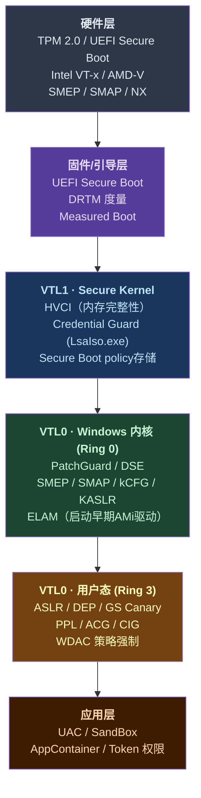
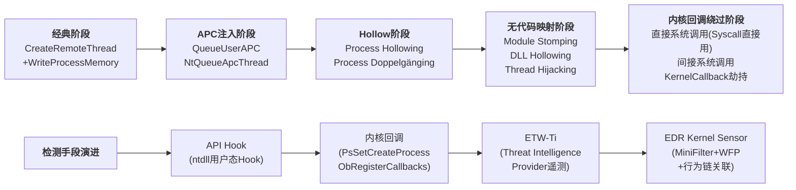
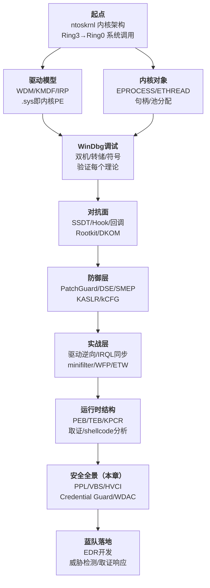

# Windows内核（20）· Windows安全机制与对抗全景

## 概述与定位

> [!abstract] TL;DR
> Windows 安全机制经历了从 XP 时代"几乎裸奔"到 Win11 "硬件级隔离"的三十年演进。现代 Windows 构建了一套从硬件（TPM/UEFI）→ Hypervisor（VBS/VTL1）→ 内核（PatchGuard/DSE/SMEP/kCFG）→ 进程（PPL/ELAM/ACG/CIG）的纵深防御体系。逆向工程师必须理解每层机制的保护边界，才能准确判断一个恶意样本的对抗面，并设计有效的蓝队检测策略。本章为系列收尾篇，全面梳理各缓解机制的原理、演进时间线、逆向视角与防御实战。

Windows 的安全架构不是一次性设计的产物，而是每次重大攻击浪潮后的持续加固结果。2003 年 Blaster/Slammer 蠕虫促成了 XP SP2 的 DEP/NX 引入；Vista 引入 ASLR/UAC；Rootkit 横行之后 Vista x64 开始强制驱动签名（DSE）；AMD/Intel 硬件提供 SMEP/SMAP 后，Windows 8/10 相继启用；Mimikatz 的 PTH 攻击直接催生了 Credential Guard；BYOVD（自带漏洞驱动）横行促使微软将 HVCI 在 Win11 上从可选变为强制。

理解这张"攻击→响应→加固"的时间线，是内核安全研究员、EDR 开发者和蓝队工程师的必修课。

---

## 原理与机制

### Windows 安全机制演进时间线

| 版本 | 重要安全机制 | 触发背景 |
|---|---|---|
| XP SP2（2004） | DEP/NX（数据不可执行）、堆保护、GS栈Canary | Blaster/Slammer 蠕虫、缓冲区溢出肆虐 |
| Vista（2007） | ASLR（用户态）、UAC、驱动签名可选 | Rootkit 泛滥（Sony BMG事件） |
| Vista x64（2007） | DSE（驱动签名强制）、PatchGuard v2 | x64 Rootkit 尝试直接改 SSDT |
| Win7（2009） | SMEP 软件支持（需 CPU）、堆喷缓解 | 内核 NULL 解引用利用大行其道 |
| Win8（2012） | SMAP 预备、KASLR、PPL（Protected Process Light） | 进程注入/内核漏洞利用进入工业化 |
| Win8.1（2013） | PPL 正式可用（AV/LSASS保护）、KASLR 增强 | 凭据窃取工具成熟 |
| Win10 TH1（2015） | VBS/VSM（可选）、Credential Guard、WDAC 前身 | Mimikatz PTH 令微软痛定思痛 |
| Win10 RS2（2017） | kCFG（内核控制流保护）、ACG/CIG、HVCI（可选） | ROPchain 内核利用与 DLL 注入 |
| Win10 RS4（2018） | Retpoline（Spectre缓解）、CFG 硬化 | Spectre/Meltdown |
| Win11（2021） | HVCI 默认开启、TPM 2.0 强制、DRTM | BYOVD 攻击与 Rootkit 持久化 |

### Windows 安全机制分层架构



> [!warning] 示例输出为示意
> 上图层次关系仅为概念模型，实际 Hyper-V 架构中 VTL0/VTL1 共享同一 CPU，通过 SLAT（EPT/NPT）隔离内存视图，并非物理隔离。

---

## 机制详解

### PPL（Protected Process Light）

PPL 是 Windows 8.1 引入的进程保护机制，其核心在于 `EPROCESS` 内的 `Protection` 字段——类型为 `PS_PROTECTION` 结构：

```c
typedef struct _PS_PROTECTION {
    union {
        UCHAR Level;
        struct {
            UCHAR Type   : 3;   // 0=None, 1=Light(PPL), 2=Full(PP)
            UCHAR Audit  : 1;
            UCHAR Signer : 4;   // 签名者等级
        };
    };
} PS_PROTECTION;
```

**Signer 等级（高→低）：**

| 值 | 名称 | 典型进程 |
|---|---|---|
| 7 | WinSystem | `System`, `smss.exe` |
| 6 | WinTcb | `csrss.exe`, `wininit.exe` |
| 5 | Windows | `services.exe`, `svchost.exe`（部分） |
| 4 | Lsa | `lsass.exe`（开启PPL后） |
| 3 | Antimalware | `MsMpEng.exe`（Defender）、EDR守护进程 |
| 2 | CodeGen | CLR JIT 相关 |
| 1 | Authenticode | 通用代码签名 |
| 0 | None | 普通进程 |

**PPL 保护规则**：当进程的 `Type=1`（PPL）时，低 Signer 等级的进程无法以高权限句柄打开该进程（`OpenProcess` 返回 `ACCESS_DENIED`）。Type=2 的 PP（Protected Process，非Light）等级更高，要求 WinTcb 以上才能访问。

**EDR 实践**：主流 EDR 产品（如 Defender、CrowdStrike Falcon）将自身守护进程配置为 PPL + Antimalware（Signer=3），即使攻击者拿到 SYSTEM 权限，也无法通过 `TerminateProcess` 或 `WriteProcessMemory` 直接终止或注入 EDR 进程。

**蓝队检测要点**：
- 在 `EPROCESS.Protection` 字段监控异常修改（典型 Rootkit 手法：直接改内核内存把 `Level` 清零）
- HVCI 开启时，任何试图修改内核只读内存的行为会触发异常并导致 BSOD（`KERNEL_SECURITY_CHECK_FAILURE`）
- ETW-Ti 的 `Microsoft-Windows-Kernel-Process` provider 可记录进程保护降级事件

---

### VBS/VSM（Virtualization-Based Security）

VBS 是 Windows 10 引入（Win11 强制）的基于虚拟化的安全隔离框架。其核心思想是：在系统已启动的 Hyper-V Hypervisor 之上，将 Windows 运行在 VTL0（Virtual Trust Level 0，Normal World），同时运行一个最小化的 Secure Kernel 于 VTL1（Secure World）。

**内存隔离机制（SLAT/EPT）：**

- Hyper-V 使用 SLAT（Second Level Address Translation，Intel 称 EPT，AMD 称 NPT）将客户物理地址（GPA）映射到宿主物理地址（HPA）
- VTL1 拥有独立的 EPT 视图；VTL0（即 Windows 内核 Ring 0）无法访问 VTL1 的内存页，即使是 Ring 0 的 `ntoskrnl.exe` 也不行
- VTL1 → VTL0 的调用通过 VMCALL 指令（Hypercall）完成，Hypervisor 负责安全过渡

**HVCI（Hypervisor-Protected Code Integrity，内存完整性）：**

HVCI 是 VBS 提供的最重要的内核保护机制。其工作原理：

1. 内核代码页在 VTL1 的 SLAT 视图中被标记为**只读**（Read-Only）
2. 当 `ntoskrnl` 或驱动试图分配新的可执行内存页（如内联 Hook 写入 shellcode）时，需经过 Secure Kernel 审批
3. Secure Kernel 只批准具有有效微软签名的代码页
4. 未签名代码无法变为可执行状态，即使传统 Ring 0 可以物理写入也无济于事（写入后执行时触发 EPT violation → BSOD）

HVCI 使传统内核 Rootkit（inline hook、SSDT 替换、内核 shellcode 注入）在 Win11 主流配置下**原理上失效**——这是近年 Rootkit 式微、BYOVD 兴起的直接技术原因。

**Credential Guard（凭据保护）：**

- `lsass.exe` 运行在 VTL0（普通用户态）时，Mimikatz 可直接读取其内存获取 NTLM hash 和 Kerberos TGT
- Credential Guard 将 LSA（Local Security Authority）的凭据存储逻辑迁移到 VTL1 的 `LsaIso.exe`（Isolated LSA）进程
- VTL0 的 `lsass.exe` 通过 Hypercall 请求凭据操作，VTL1 的 `LsaIso.exe` 执行实际的 hash/TGT 处理，但**从不将明文凭据暴露给 VTL0**
- 效果：Pass-the-Hash（PTH）和 Pass-the-Ticket（PTT）攻击在 Credential Guard 开启时**失效**，因为攻击者即使完全控制 VTL0 也无法从 `lsass.exe` 内存中读到有效凭据

**DRTM（Dynamic Root of Trust for Measurement）与 TPM：**

- DRTM 通过 Intel TXT 或 AMD SKINIT 在 CPU 层面建立可信执行环境
- TPM 2.0 在启动链中度量每个组件的哈希值，存储于 PCR（Platform Configuration Register）
- VBS 启动完整性由 TPM 度量，防止 Bootkit 在 VBS 初始化之前破坏安全策略

---

### ELAM（Early Launch Anti-Malware）

ELAM 是 Windows 8 引入的"最早的安全门卫"机制。操作系统在启动序列中，在**所有第三方驱动加载之前**，首先启动经过微软特殊签名认证的 ELAM 驱动。

**工作流程：**

```
Bootloader → Windows 内核初始化 → ELAM 驱动（WdBoot.sys） → 其他启动驱动
```

**ELAM 回调（`BootDriverCallbackFunction`）：**

对每个即将加载的驱动，ELAM 驱动可以返回以下判决：

| 判决值 | 含义 |
|---|---|
| `KnownGoodBoot` | 已知良性，允许加载 |
| `KnownBadBoot` | 已知恶意，阻止加载 |
| `UnknownBoot` | 未知，系统根据启动策略决定（默认允许） |
| `BadUnknownBoot` | 可疑未知，建议阻止 |

**WdBoot.sys** 是 Windows Defender 的 ELAM 驱动，负责在启动早期检测已知 Bootkit/Rootkit 签名，并为 Defender 服务的后续加载提供可信根（Attestation）。

ELAM 驱动必须通过微软专属签名流程，签名证书与普通驱动签名完全不同，大幅提高了 ELAM 位置的攻击门槛。

---

### WDAC（Windows Defender Application Control）

WDAC（前身为 Device Guard）是基于 VBS/CI.dll 的代码完整性策略系统，定义哪些代码可以在系统上执行。

**策略文件**：`.wdac.p7b`（PKCS#7 签名的二进制策略），部署到 `%SystemRoot%\System32\CodeIntegrity\CIPolicies\Active\`。

**保护范围**：

- **用户态**：阻止未被策略允许的 PE 执行（`.exe`/`.dll`/`.com`），包括无签名代码和签名但不在白名单的代码
- **内核态**：阻止未签名或策略外的驱动加载（`.sys`）；配合 HVCI 在 VTL1 层再次强制

**与 AppLocker 的对比**：

| 特性 | AppLocker | WDAC |
|---|---|---|
| 执行层 | 用户态（驱动可绕过） | Secure Kernel（VTL1，难以绕过） |
| 覆盖范围 | 用户态 PE | 用户态+内核态均覆盖 |
| 绕过难度 | 较低（有多种公知绕过） | 极高（需绕过 VBS） |
| 管理复杂度 | 较低 | 较高（需规划策略） |

**WDAC 在企业 EDR 部署中**：配合 Defender for Endpoint 策略，可实现"仅允许微软签名+已知良性第三方"的严格白名单控制，是当前公认的最强用户态代码执行控制方案。

---

### ACG 与 CIG

**ACG（Arbitrary Code Guard，任意代码防护）：**

- 防止动态生成/修改可执行代码（即 W^X：Write XOR Execute）
- 开启 ACG 的进程无法将可写内存页变为可执行（`VirtualProtect` 改 `PAGE_EXECUTE` 失败）
- 也无法通过 `WriteProcessMemory` 写入已有可执行页
- 典型场景：浏览器渲染进程（Renderer）开启 ACG，JIT 编译器运行在独立的 JIT 进程（有例外权限）中，通过 IPC 传递已编译代码映射到 Renderer

**CIG（Code Integrity Guard，代码完整性防护）：**

- 开启 CIG 的进程只允许加载经过微软签名或具有有效签名的 DLL
- 阻止经典的 DLL 注入（无签名 DLL 无法 `LoadLibrary` 进入受保护进程）
- 阻止 Module Stomping（将 shellcode 映射到合法 DLL 内存，但修改会导致签名校验失败）

ACG + CIG 组合使用，彻底封堵了绝大多数用户态代码注入技术——这也是 Chrome/Edge 沙盒进程的标准配置。

---

## 内核缓解全景对照表

| 机制 | 保护目标 | 技术原理 | Windows版本 | HVCI后效果 |
|---|---|---|---|---|
| DEP/NX | 数据页不可执行 | CPU NX 位标记数据页 | Vista+（x64必开） | 基础保障 |
| ASLR（用户态） | 基址随机化 | PE 加载时随机偏移（VDLL共享） | Vista+ | 仍有效 |
| KASLR（内核） | 内核基址随机化 | `ntoskrnl` 每次启动随机加载地址 | 8+ | 仍有效 |
| GS栈Canary | 栈溢出检测 | 函数返回前校验Canary值 | XP SP2+（编译器） | 仍有效 |
| SMEP | 内核不执行用户页 | CR4.SMEP 位；执行用户页触发 #PF | 8+（需Intel/AMD支持） | 仍有效 |
| SMAP | 内核不访问用户页 | CR4.SMAP 位；访问用户页触发 #AC | 10 RS1+（需CPU） | 仍有效 |
| kCFG | 内核控制流保护 | 间接调用目标校验位图；无效跳转BSOD | 10 RS2+ | 强化 |
| PatchGuard（KPP） | 内核关键结构完整性 | 定期校验 SSDT/IDT/KPCR 等 | x64 Vista+ | 仍有效（互补） |
| DSE | 驱动签名强制 | `ci.dll` 校验 PE 签名；未签名拒绝加载 | Vista x64+ | HVCI接管CI |
| HVCI | 内核代码完整性（VTL1） | VTL1 Secure Kernel审批可执行页；EPT只读 | 10+(可选)/11强制 | 本身即顶层 |
| PPL | 关键进程保护 | `EPROCESS.Protection` 限制句柄权限 | 8.1+ | 仍有效 |
| ELAM | 启动驱动完整性 | 最早加载，标记驱动可信状态 | 8+ | 互补 |
| Credential Guard | 凭据隔离（VTL1） | `LsaIso.exe` 运行于VTL1，凭据不出VTL1 | 10+(可选)/11强制 | 本身即VBS |
| WDAC | 代码执行白名单 | VTL1 CI策略；用户态+内核态均覆盖 | 10+（企业） | 强化 |
| ACG | 动态代码防护 | W^X进程内存；禁止可写页变可执行 | 10 RS1+（进程选择） | 用户态独立 |
| CIG | DLL加载完整性 | 只允许签名DLL进入受保护进程 | 10 RS1+（进程选择） | 用户态独立 |

---

## 逆向视角与防御实战

### 逆向角度：识别目标进程的保护级别

在 WinDbg 内核调试时，快速检查进程保护级别：

```
kd> dt nt!_PS_PROTECTION <eprocess_addr+offset>
   +0x000 Level            : 0x62 ''
   +0x000 Type             : 0y001  (0x1) = PPL
   +0x000 Audit            : 0y0
   +0x000 Signer           : 0y0110  (0x6) = WinTcb
```

> [!warning] 示例输出为示意
> 实际偏移量随 Windows 版本变化，需通过 `.reload /f nt.pdb` 加载符号后用 `dt nt!_EPROCESS` 确认 `Protection` 字段偏移。

**静态逆向时的保护级别判断**：

- 分析驱动时，查找对 `PsGetProcessProtection` 的调用或直接读 `EPROCESS.Protection` 的硬编码偏移
- 检查代码是否存在"先修改 Protection 字段再操作"的模式，这是权限提升后的典型后续步骤（正常安全研究环境下的检测对象）

### 逆向角度：HVCI 对 Hook 的影响

在 HVCI 开启的系统上，尝试内联 Hook 会遭遇：

```
Bug Check 0x139: KERNEL_SECURITY_CHECK_FAILURE
Bug Check 0x18: REFERENCE_BY_POINTER
Bug Check 0x3B: SYSTEM_SERVICE_EXCEPTION (伴随 EPT violation)
```

分析 HVCI 系统的内核崩溃转储时，`!analyze -v` 输出中的 `FAILURE_BUCKET_ID` 若包含 `HVCI` 或 `VTL1`，可直接定位到安全策略拦截。

### 防御实战：EDR 驱动的正确防护姿态

一个现代 EDR 内核驱动的防护配置清单：

1. **驱动签名**：必须有 EV 代码签名 + 微软 WHQL/WHCP 签名（HVCI 环境额外要求）
2. **守护进程 PPL**：Service 配置 `ServiceSidType = Unrestricted` + `PROTECTED_SERVICE_LIGHT` 注册表值（需微软合作协议）
3. **ELAM 驱动**：配合 `WdBoot.sys`（或自有 ELAM）确保启动早期可信
4. **CIG 保护**：守护进程配置 `MitigationPolicy = CIG`，阻止第三方 DLL 注入
5. **内核回调注册**：`PsSetCreateProcessNotifyRoutineEx`/`ObRegisterCallbacks`，在内核层监控异常句柄请求
6. **ETW-Ti 消费**：订阅 `Microsoft-Windows-Threat-Intelligence` provider，获取进程注入、内存分配等高可信遥测

---

## 安全性与正确使用

> [!caution] 合规边界 — 本章内容的使用范围
> **本章所有"对抗全景"内容严格取防御与分析视角，面向蓝队工程师、EDR 开发者和安全研究员。**
>
> - 讲述的历史漏洞原理（如 PPL Bypass、HVCI 前的 Hook 技术、Credential Guard 前的 PTH）均以**已公开发表的安全研究**为准，目的是帮助防御者理解攻击者的历史手法，从而设计更有效的检测规则
> - **本章不提供**：当前可用的武器化 BYOVD 工具链、可落地的 PPL/DSE 绕过步骤、针对真实目标系统的完整利用链、任何有助于绕过 HVCI/Credential Guard 的未公开技术细节
> - 内核安全研究应在**隔离的虚拟机或专用测试设备**上进行，不得针对他人系统或生产环境
> - ELAM 驱动开发需要与微软签署专项协议，PPL 保护进程资格需要 Windows Security Center API 合规接入
> - 违反以上原则可能违反《计算机信息网络国际联网安全保护管理办法》（中国）、《计算机欺诈与滥用法》（美国 CFAA）等多国法规

---

## 对抗全景：威胁演进与防御响应

### BYOVD（Bring Your Own Vulnerable Driver）

**攻击思路（历史已公开）：** 攻击者找到一个合法厂商签名但存在漏洞（如任意内核读写）的老驱动，加载该驱动（规避 DSE），然后通过漏洞执行内核级操作（如关闭 EDR 驱动、提权）。典型已公开案例：Lenovos SMBus、WinRing0、RTCore64.sys。

**防御响应：**
- 微软维护 `blocklist.xml`（`DriverSiPolicy.p7b`），包含已知漏洞驱动的 SHA256 哈希黑名单
- Win11 22H2+ 通过 Windows Update 推送 blocklist 更新（历史上这一更新不够及时，被批评为主要弱点）
- HVCI 开启后 BYOVD 的有效性大幅下降，因为即使加载了漏洞驱动，后续的内核内存写入操作也会被 VTL1 拦截
- 企业防御：启用 WDAC 驱动白名单，明确阻止 blocklist 中的驱动 Hash

### 进程注入技术的演进与检测



> [!warning] 示例输出为示意
> 上图进攻侧的具体技术细节（Syscall号、参数构造、API序列）均为已公开学术研究，不代表可直接使用的工具步骤。

**当前防御焦点**：

- **ETW-Ti Provider**（`Microsoft-Windows-Threat-Intelligence`）：在内核层记录 `VirtualAllocEx`/`WriteProcessMemory`/`CreateRemoteThread` 等敏感操作的调用链；运行在内核，难以被用户态攻击者关闭
- **CIG 配置**：受保护进程无法加载无签名 DLL，从根本上阻断 Module Stomping/DLL 注入
- **行为链关联**：单一事件不触发，EDR 通过跨进程操作序列的时序关联（如 `OpenProcess` → `WriteProcessMemory` → `CreateRemoteThread` 连续序列）判断注入行为

### Rootkit 的式微与转型

HVCI 之前（Win10 可选，Win11 前的 PC）：传统 Rootkit 通过直接修改 `ntoskrnl` 内联 Hook、替换 SSDT 条目、篡改 `EPROCESS` 链表（DKOM）实现进程/文件隐藏。

**HVCI 之后的格局变化**：

- 内核代码页只读（由 VTL1 EPT 强制），inline Hook 无法写入
- SSDT 替换需要可执行权限，VTL1 不批准未签名代码
- DKOM 篡改 `EPROCESS.ActiveProcessLinks` 虽不受 HVCI 直接限制，但 PatchGuard 会定期校验 ActiveProcessList 完整性，篡改后短时间内触发 BSOD

**现代恶意软件的转型方向（防御视角）：**

| 转型方向 | 原因 | 防御对策 |
|---|---|---|
| UEFI Bootkit（如 CosmicStrand、BlackLotus） | 在 Secure Boot 之前注入，绕过所有 OS 层防护 | UEFI 固件签名验证、DRTM、定期固件完整性扫描 |
| 固件层持久化（网卡/存储固件） | OS 完全重装也无法清除 | 供应链安全审计、固件哈希基线 |
| BYOVD（使用漏洞驱动） | 合法签名绕过 DSE，再借驱动漏洞执行内核操作 | HVCI + blocklist + WDAC 驱动白名单 |
| 滥用合法内核功能（Living-off-the-Land Kernel） | 使用 `ntoskrnl` 导出函数，不写shellcode | 行为基线异常检测、驱动数字签名验证 |

---

## 小结：系列收尾与知识图谱总览

经过二十章的系统拆解，Windows 内核与驱动逆向的知识脉络已完整呈现。

### 系列知识图谱回顾

**第一层：架构认知（1–2章）**

从 `ntoskrnl.exe` 的组织结构入手，理解内核态与用户态的边界，掌握 `syscall` / `KiSystemCall64` 这条从 Ring 3 到 Ring 0 的通道。这是一切后续内容的基础——不理解这条路径，就无法理解 SSDT Hook 为何有效，也无法理解 kCFG 为何能阻止 ROP。

**第二层：驱动模型（3–4章）**

WDM 的 `DRIVER_OBJECT`/`DEVICE_OBJECT`/IRP 三角是内核驱动的骨架；KMDF/WDF 在此之上提供对象生命周期管理。`.sys` 文件即内核态 PE，掌握驱动模型是逆向恶意驱动、开发 EDR 内核组件的前提。

**第三层：内核对象与内存（5–6章）**

Object Manager 的引用计数机制、`EPROCESS`/`ETHREAD` 的字段布局、分页与非分页池的分配策略——这层知识支撑了 DKOM 隐藏原理的分析，也是 PPL 检测的技术基础。

**第四层：内核调试（7章）**

WinDbg 的双机调试配置、`!process`/`dt`/`lm`/`!pool` 命令体系——没有调试验证，所有对内核结构的理解都只是纸上谈兵。第7章的技能贯穿后续每一章的实验。

**第五层：对抗与安全机制（8–13章）**

SSDT 的本质是函数指针表，Hook 的本质是替换这些指针；x64 PatchGuard 使简单替换失效，驱动签名（DSE）使未签名驱动无法加载；内核漏洞从 NULL 解引用到类型混淆，SMEP/KASLR/kCFG 每隔几年出现一次新的缓解层。这五章是整个攻防故事的主干。

**第六层：驱动实战与内核机制（14–19章）**

从真实 `.sys` 逆向实战（14章），到 IRQL 同步细节（15章），到 minifilter/WFP 过滤体系（16–17章），到 ETW 遥测（18章），到 PEB/TEB/KPCR 运行时结构（19章）——这层提供了从"理解原理"到"落地工程"的桥梁。EDR 开发者尤其需要 16–18 章的内容。

**第七层：安全全景（本章，20章）**

PPL/VBS/HVCI/Credential Guard/ELAM/WDAC/ACG/CIG——Win11 的安全架构已经是多层纵深防御，每一层都针对历史攻击手法设计。理解全景，才能在逆向未知样本时快速判断"它试图绕过哪一层，防御者该在哪里设陷阱"。

### 一张图串起二十章



### 给不同读者的收尾建议

**EDR/安全产品开发者**：重点深入 9（内核回调）、16（minifilter）、17（WFP）、18（ETW-Ti）四章，这是内核级遥测的四条主干通道；再结合本章理解 PPL 保护自身守护进程的工程实践。

**恶意代码分析师**：重点深入 11（Rootkit）、12（PatchGuard/DSE）、14（驱动逆向实战）、19（PEB/TEB）四章，这些是分析恶意驱动和 Rootkit 样本的核心工具箱；本章帮助你判断样本运行于哪个防御层级的环境。

**渗透测试（授权、合规环境）**：重点理解 2（系统调用）、8（SSDT）、13（内核漏洞基础）三章的防御侧视角，理解当前主流 Windows 版本的防护栈，评估授权测试目标的真实暴露面。

**安全研究员**：完整系列提供了从架构到实战的完整知识框架；进阶方向指向 UEFI/固件安全（VBS 的更底层）、Hyper-V 安全（VTL1 本身的安全性）和处理器微架构安全（Spectre/MDS 系列）。

---

## 相关阅读

- [[01.Windows内核架构与逆向全景]] — 系列起点，ntoskrnl 全局视图
- [[08.SSDT与系统调用表]] — SSDT Hook 历史与 x64 限制
- [[12.PatchGuard与DSE与HVCI]] — 本章 HVCI 的详细前置
- [[18.ETW与内核遥测]] — EDR 遥测与 ETW-Ti 防御实践
- [[19.PEB与TEB与KPCR]] — 进程运行时结构，本章前置
- [[00.Windows内核与驱动逆向总览]] — 二十章全局导航
- [[34.现代二进制防护机制/10.Windows防护体系]] — 用户态防护侧对照
- [[33.二进制漏洞与利用基础/00.二进制漏洞与利用基础总览]] — 内核漏洞利用基础前置

---

⬅️ 上一篇 [[19.PEB与TEB与KPCR]] ｜ 🏠 [[00.Windows内核与驱动逆向总览]]
