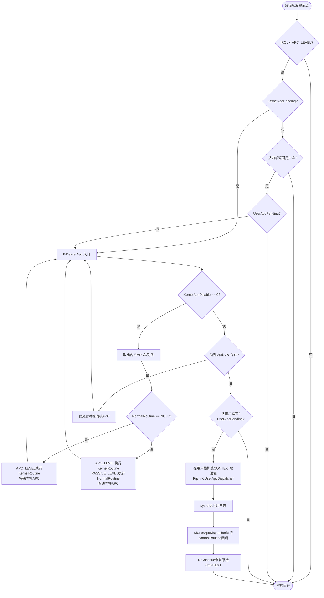

---
tags:
  - Windows
  - 内核
  - tier3
  - APC
  - 逆向
---
# APC 机制深度剖析

> [!abstract] TL;DR
> APC（Asynchronous Procedure Call，异步过程调用）是 Windows 内核中用于在特定线程上下文中异步执行代码的核心机制。它分为三类：特殊内核 APC、普通内核 APC、用户 APC，分别在不同的 IRQL 和执行环境下投递。内核通过 `KTHREAD.ApcState` 维护每线程 APC 队列，由 `KeInsertQueueApc`/`KiDeliverApc` 负责入队与交付。用户 APC 是最常见的线程注入手法之一（`QueueUserAPC`/`NtQueueApcThread`），Early Bird APC 注入更是规避沙箱的经典技术。理解 APC 是读懂异步 I/O 完成、线程注入、内核 Rootkit 持久化、EDR 检测逻辑的前提基础。

## 概述与定位

APC 并非 Windows 独创，其根源可追溯到 DEC VMS 操作系统的 AST（Asynchronous System Trap）机制。Windows NT 从设计之初便将 APC 作为内核异步执行模型的基础积木之一，与 DPC（延迟过程调用）、线程调度协同工作。

从宏观架构来看，APC 解决的核心问题是：**如何在不阻塞调用方、也不引发昂贵的上下文切换的前提下，将一段代码"注射"进目标线程的执行流，并在目标线程的安全点（safe point）自然触发**。

### 为什么需要 APC

考虑以下场景：

1. **异步 I/O 完成通知**：用户发起 `ReadFile` 的异步版本，I/O 完成后硬件中断触发 DPC，但 DPC 运行在任意 CPU 上、IRQL=DISPATCH_LEVEL，无法访问用户态内存。解决方案：DPC 将 APC 投递进发起 I/O 的线程，当该线程下次处于可警示等待时，用户 APC 回调在正确线程上下文中执行。

2. **线程终止清理**：当进程调用 `TerminateThread` 或线程自然退出，内核需要通知各子系统（Win32k 需要清理 GDI 对象、运行时需要执行析构器）。内核 APC 是实现这种"强制注入清理代码"的机制。

3. **强制挂起/唤醒**：`NtSuspendThread`/`NtAlertThread` 在内部使用 APC 机制投递特殊内核 APC 来操控线程状态。

4. **线程注入（攻击者视角）**：用户 APC 允许攻击者将 shellcode 投递进目标线程，当目标线程进入可警示等待状态时自动执行。

### 与 DPC 的本质区别

| 维度 | DPC | APC |
|------|-----|-----|
| 目标 | 任意 CPU 上的延迟执行 | 特定线程上下文执行 |
| IRQL | DISPATCH_LEVEL (2) | APC_LEVEL (1) 或 PASSIVE_LEVEL (0) |
| 线程关联 | 无，CPU 亲和性 | 强绑定到目标线程 |
| 用户态访问 | 不可（UAM 不可访问） | 用户 APC 可访问用户内存 |
| 典型用途 | 硬件中断尾处理 | I/O 完成、线程注入、挂起 |

APC 在 IRQL 层次中处于 APC_LEVEL（1级），高于 PASSIVE_LEVEL，低于 DISPATCH_LEVEL，因此 APC 可以被 DPC 和更高优先级中断抢占，但可以抢占普通用户态代码。

### 在系列中的定位

第 15 篇「IRQL 与内核同步」已介绍了 APC_LEVEL 作为 IRQL 等级的含义，以及 `KeCriticalRegion`/`KeGuardedRegion` 如何禁止 APC 交付。本篇作为深度专章，完整覆盖 `KAPC` 结构、三类 APC 的行为差异、APC 队列管理、内核/用户 APC 注入原理，以及逆向视角下的检测技术。

---

## 原理与机制

### APC 交付时机：三个安全点

内核不会在任意时刻中断线程去执行 APC，只在以下三个精确时机交付：

**时机 1：从内核态返回用户态时（KiDeliverApc 路径）**

每当线程从内核态（系统调用、异常处理、中断）返回用户态之前，内核在 `KiExitDispatcher`/`KiSystemCallExit` 路径上检查 `KTHREAD.ApcState.UserApcPending` 标志。若为真，调用 `KiDeliverApc` 交付待处理的用户 APC。这是用户 APC 的主要交付路径。

**时机 2：线程进入可警示等待（Alertable Wait）**

当线程调用 `WaitForSingleObjectEx`/`SleepEx`（`bAlertable=TRUE`）或 `NtWaitForSingleObject`/`NtDelayExecution`（`Alertable=TRUE`）时，调度器在使线程休眠前检查 APC 队列。若有待处理的用户 APC，线程不会进入等待，而是立即从等待函数返回（返回 `WAIT_IO_COMPLETION`），然后交付 APC。这是"可警示等待"这一术语的来源。

**时机 3：IRQL 降至 APC_LEVEL 以下**

当线程 IRQL 从 APC_LEVEL 或更高降至 PASSIVE_LEVEL 时，硬件机制（在 x64 上是 `sti`/APIC 的软件中断模拟，或 `HalProcessorIdle` 路径）触发 APC 软件中断，内核检查并交付待处理的内核 APC。这是特殊内核 APC 和普通内核 APC 的主要交付路径。

### 三类 APC 详解

Windows 内核定义了三种 APC，它们在 `KAPC` 结构中通过 `ApcMode` 字段和 `NormalRoutine` 是否为 NULL 来区分：

#### 1. 特殊内核 APC（Special Kernel APC）

- `ApcMode = KernelMode`
- `NormalRoutine = NULL`
- 交付时机：IRQL 降至 PASSIVE_LEVEL 即可触发，**无法被 `KeCriticalRegion` 禁止**（只有 `KeGuardedRegion` 才能屏蔽）
- 执行上下文：在 APC_LEVEL 运行 `KernelRoutine`（`KIRQL` 保持在 APC_LEVEL）
- 典型用途：线程挂起（`KiSuspendThread`）、强制 APC 交付（用于打破死锁）、I/O 取消操作
- 代表函数：`IopCancelAlertedRequest` 中的特殊内核 APC、`PspExitThread` 中的线程退出 APC

特殊内核 APC 是最高优先级的 APC，在 `KTHREAD.ApcState.ApcListHead[KernelMode]` 队列中排在普通内核 APC 之前执行。其 `KernelRoutine` 在 APC_LEVEL 执行，期间其他 APC 无法抢入。

#### 2. 普通内核 APC（Normal Kernel APC）

- `ApcMode = KernelMode`
- `NormalRoutine != NULL`
- 交付时机：与特殊内核 APC 相同（IRQL 降至 PASSIVE_LEVEL），但**可被 `KeCriticalRegion` 禁止**
- 执行顺序：先在 APC_LEVEL 执行 `KernelRoutine`（通常做参数调整），然后 IRQL 降至 PASSIVE_LEVEL 执行 `NormalRoutine`
- 典型用途：`IoCompleteRequest` 中的完成例程调用（文件系统驱动的 `IoCompletion` 历史上使用此路径）、驱动程序的异步操作通知
- 使用限制：`NormalRoutine` 在 PASSIVE_LEVEL 执行，可以获取非分页锁，但仍处于内核态

普通内核 APC 与特殊内核 APC 共享 `ApcListHead[KernelMode]` 队列，但在队列中排在特殊内核 APC 之后（`SpecialApcDisable` 标志控制队列头插入还是尾插入）。

#### 3. 用户 APC（User APC）

- `ApcMode = UserMode`
- `NormalRoutine != NULL`（指向用户空间函数指针）
- 交付时机：仅在线程从内核返回用户态时，或线程处于可警示等待时
- 排队：`ApcListHead[UserMode]` 单独队列，与内核 APC 队列完全隔离
- 执行机制：`KiDeliverApc` 在用户栈上构造特殊帧（`CONTEXT` 结构 + APC 参数），通过 `KeUserApcDispatcher`（ntdll 中的 `KiUserApcDispatcher`）分发给用户函数
- `KernelRoutine`：可选，在 APC_LEVEL 执行（通常做参数封送），然后控制转到用户态

用户 APC 是线程注入的核心路径，下文「工具视角与实战」节将详细分析。

### KTHREAD.ApcState：APC 状态核心结构

`KTHREAD`（内核线程对象，偏移在 `ETHREAD` 起始处）包含两个关键 APC 相关字段：

```
KTHREAD (简化视图)
+0x050 ApcState          : _KAPC_STATE   ← 当前 APC 状态
+0x0D8 SavedApcState     : _KAPC_STATE   ← 附加到其他进程时保存的原始状态
+0x1B0 ApcStatePointer   : [2] Ptr64 _KAPC_STATE
+0x1C0 ApcStateIndex     : UChar         ← 0=原始,1=保存中
+0x1C1 ApcQueueable      : UChar         ← 允许入队标志
```

`KAPC_STATE` 结构（约 0x30 字节）：

```c
typedef struct _KAPC_STATE {
    LIST_ENTRY ApcListHead[2];     // [0]=KernelMode APC链表, [1]=UserMode APC链表
    PKPROCESS  Process;            // 关联的进程对象（进程附加时变化）
    UCHAR      InProgressFlags;    // 位标志：KernelApcInProgress/UserApcInProgress
    UCHAR      KernelApcPending;   // 内核APC待处理标志
    union {
        UCHAR  UserApcPendingAll;
        struct {
            UCHAR SpecialUserApcPending : 1;
            UCHAR UserApcPending        : 1;
        };
    };
} KAPC_STATE, *PKAPC_STATE;
```

**进程附加（KeStackAttachProcess）时的 ApcState 切换**：

当驱动调用 `KeStackAttachProcess` 附加到另一个进程地址空间时，内核将当前线程的 `ApcState` 复制到 `SavedApcState`，为附加的进程创建新的 `ApcState`（`ApcListHead` 重置为空，`Process` 更新为目标进程）。`ApcStateIndex` 设为 1 表示当前处于"附加"状态。`KeUnstackDetachProcess` 时恢复原状。

这意味着：**在进程附加期间，用户 APC 无法被投递**（`ApcQueueable` 检查会拒绝），这是设计上的安全保证——附加期间代表另一个进程执行，用户 APC 的用户内存地址会与实际内存空间错位。

### APC 禁止机制：临界区与受保护区

两种机制允许代码临时屏蔽 APC 交付：

**`KeCriticalRegion` / `KeLeavesCriticalRegion`**：

递增/递减 `KTHREAD.KernelApcDisable`（有符号短整型，可嵌套）。当值非零时，普通内核 APC 被屏蔽，**但特殊内核 APC 仍可交付**。用户态等价是 `RtlEnterCriticalSection`（通过 `TEB.CriticalSectionCount`），但底层实现不同。

驱动代码中持有资源（`ERESOURCE`，如文件系统的读写锁）时自动处于临界区；`ExAcquireResourceExclusiveLite` 内部调用 `KeEnterCriticalRegion`。

**`KeEnterGuardedRegion` / `KeLeaveGuardedRegion`**：

递增/递减 `KTHREAD.SpecialApcDisable`（有符号短整型）。当值非零时，**特殊内核 APC 和普通内核 APC 都被屏蔽**，但用户 APC 不受影响（用户 APC 只在用户态交付）。

受保护区用于保护不可重入的内核代码段，例如 DPC 的 `KiRetireDpcList` 期间的部分代码。

### KiDeliverApc：交付引擎

`KiDeliverApc` 是 APC 交付的核心函数，其执行逻辑（简化伪代码）：

```c
VOID KiDeliverApc(KPROCESSOR_MODE PreviousMode, 
                  PKEXCEPTION_FRAME ExceptionFrame,
                  PKTRAP_FRAME TrapFrame) 
{
    PKTHREAD Thread = KeGetCurrentThread();
    
    // 1. 交付内核 APC（特殊 > 普通）
    while (!IsListEmpty(&Thread->ApcState.ApcListHead[KernelMode])) {
        Apc = CONTAINING_RECORD(RemoveHeadList(...), KAPC, ApcListEntry);
        
        if (Apc->NormalRoutine == NULL) {
            // 特殊内核 APC：在 APC_LEVEL 直接调用 KernelRoutine
            KiExecuteKernelApc(Apc);
        } else {
            // 普通内核 APC：先调 KernelRoutine，再调 NormalRoutine（PASSIVE_LEVEL）
            KiExecuteNormalKernelApc(Apc);
        }
    }
    
    // 2. 仅在从用户态陷入时才交付用户 APC
    if (PreviousMode == UserMode && 
        !IsListEmpty(&Thread->ApcState.ApcListHead[UserMode])) {
        Apc = CONTAINING_RECORD(RemoveHeadList(...), KAPC, ApcListEntry);
        
        // 在用户栈上构造 CONTEXT + APC_STACK_FRAME，设置 IP → ntdll!KiUserApcDispatcher
        KiInitializeUserApc(ExceptionFrame, TrapFrame, 
                            Apc->NormalRoutine,
                            Apc->NormalContext,
                            Apc->SystemArgument1,
                            Apc->SystemArgument2);
    }
}
```

用户 APC 的栈帧构造是理解注入机制的关键：内核在用户栈顶写入原始 `CONTEXT`（保存线程中断点的寄存器状态）和 APC 参数，然后将 `TrapFrame->Rip` 设置为 `ntdll!KiUserApcDispatcher`。线程从 `sysret` 返回用户态时，实际执行的是 `KiUserApcDispatcher`，它调用用户回调，完成后调用 `NtContinue` 恢复原始 `CONTEXT`，使线程无缝继续原本的执行流。

---

## 结构/算法/伪代码详解

### KAPC 结构完整字段解析

```c
typedef struct _KAPC {
    // --- 对象头（8字节，类型标识） ---
    UCHAR  Type;               // 0x12 = APC 类型标识
    UCHAR  AllFlags;           // 组合标志字节
    union {
        UCHAR SpareByte1;
        struct {
            UCHAR CallbackDataContext : 1;  // 0: 普通APC; 1: 回调数据APC
            UCHAR Unused             : 7;
        };
    };
    UCHAR  Size;               // sizeof(KAPC) = 0x58（x64）
    
    // --- 调度链 ---
    LIST_ENTRY ApcListEntry;   // 链接到 KAPC_STATE.ApcListHead[ApcMode]
    
    // --- 目标线程 ---
    PKTHREAD Thread;           // 投递目标线程（必须在初始化时指定）
    
    // --- 三个例程指针（核心） ---
    PKKERNEL_ROUTINE  KernelRoutine;   // 在APC_LEVEL执行，可修改参数
    PKRUNDOWN_ROUTINE RundownRoutine;  // 线程退出时APC未执行则调用（清理资源）
    PKNORMAL_ROUTINE  NormalRoutine;   // 实际执行体（NULL→特殊内核APC）
    
    // --- 传递给例程的参数 ---
    PVOID NormalContext;       // 传给 NormalRoutine 的 Context 参数
    PVOID SystemArgument1;     // 传给 NormalRoutine 的 Arg1
    PVOID SystemArgument2;     // 传给 NormalRoutine 的 Arg2
    
    // --- APC 类型标识 ---
    KPROCESSOR_MODE ApcMode;   // KernelMode(0) 或 UserMode(1)
    BOOLEAN Inserted;          // APC 是否已在队列中（防重复插入）
} KAPC, *PKAPC;
// sizeof = 0x58（x64），0x30（x86）
```

**关键字段深入**：

`KernelRoutine`：函数签名为 `VOID KernelRoutine(PKAPC Apc, PKNORMAL_ROUTINE *NormalRoutine, PVOID *NormalContext, PVOID *Arg1, PVOID *Arg2)`。注意参数均为指针的指针——`KernelRoutine` 可以在运行期修改 `NormalRoutine` 为 NULL（取消后续执行）或替换 `NormalContext`/参数。`IoCompleteRequest` 的内核 APC 利用此机制传递 IRP 指针。`KernelRoutine` 的最常见实现是 `IoFreeIrp`（释放 IRP）或仅调用 `ExFreePoolWithTag`（释放 APC 对象本身）。

`RundownRoutine`：当线程退出（`PspExitThread`）时，内核遍历 APC 队列，对所有未执行的 APC 调用 `RundownRoutine`（若不为 NULL）。这是资源清理的关键——若 APC 携带了分配的内存指针，`RundownRoutine` 负责释放，避免泄漏。若为 NULL 且 APC 已插入，线程退出时直接丢弃该 APC（内存可能泄漏，需驱动自行处理）。

`Inserted`：布尔标志，由 `KeInsertQueueApc` 设置为 TRUE，由 `KeRemoveQueueApc` 或交付后的清理代码设置为 FALSE。驱动代码中**必须检查此字段再重用 APC 对象**，否则可能导致双重插入（一个 APC 对象同时在队列中出现两次）造成链表损坏。

### KeInitializeApc / KeInsertQueueApc

驱动初始化和投递 APC 的完整流程：

```c
// 1. 分配 APC 对象（通常从非分页池）
PKAPC Apc = ExAllocatePool2(POOL_FLAG_NON_PAGED, sizeof(KAPC), 'cpaA');

// 2. 初始化（填充字段，不实际入队）
KeInitializeApc(
    Apc,                    // APC对象
    TargetThread,           // 目标 KTHREAD（PETHREAD 的起始处）
    OriginalApcEnvironment, // 环境：Original/Attached/CurrentApcEnvironment
    MyKernelRoutine,        // 内核例程
    MyRundownRoutine,       // 清理例程（可NULL）
    MyNormalRoutine,        // 正式执行体（NULL→特殊内核APC）
    KernelMode,             // APC模式
    NULL                    // NormalContext初始值
);

// 3. 投递（实际入队并可能立即触发）
BOOLEAN Result = KeInsertQueueApc(
    Apc,
    SystemArgument1,        // 可被KernelRoutine覆盖
    SystemArgument2,        // 同上
    IO_NO_INCREMENT         // 优先级增量（0=不提升目标线程优先级）
);
// 若返回FALSE：目标线程APC不可投递（正在终止或ApcQueueable=FALSE）
```

`KeInitializeApc` 的 `Environment` 参数控制 APC 附加到哪个 `ApcState`：

- `OriginalApcEnvironment`：附加到 `KTHREAD.ApcState`（若 `ApcStateIndex==0`）或 `SavedApcState`（若已附加）——即 APC 在线程的**原始**进程上下文中执行
- `AttachedApcEnvironment`：附加到当前实际活跃的 `ApcState`（可能是附加后的）
- `CurrentApcEnvironment`：等同于 `ApcStateIndex` 当前指向的那个（最常用）

错误选择 `Environment` 会导致 APC 在错误的地址空间上下文中执行——经典陷阱。

### APC 入队与优先级算法

```c
BOOLEAN KeInsertQueueApc(PKAPC Apc, PVOID Arg1, PVOID Arg2, KPRIORITY Increment) {
    Thread = Apc->Thread;
    
    // 检查线程是否允许入队
    if (!Thread->ApcQueueable || Thread->State == Terminated) return FALSE;
    
    // 检查是否已在队列中
    if (Apc->Inserted) return FALSE;
    
    // 根据APC类型决定插入位置
    ListHead = &Thread->ApcState.ApcListHead[Apc->ApcMode];
    
    if (Apc->ApcMode == KernelMode && Apc->NormalRoutine == NULL) {
        // 特殊内核APC：插入队列头（优先级最高）
        InsertHeadList(ListHead, &Apc->ApcListEntry);
    } else {
        // 普通内核APC 或 用户APC：插入队列尾（FIFO顺序）
        InsertTailList(ListHead, &Apc->ApcListEntry);
    }
    
    Apc->Inserted = TRUE;
    
    // 设置待处理标志
    if (Apc->ApcMode == KernelMode) {
        Thread->ApcState.KernelApcPending = TRUE;
        // 若线程在等待中，发送软件中断打断等待
        if (Thread->State == Waiting && Thread->WaitIrql < APC_LEVEL) {
            UnwaitThread(Thread, STATUS_KERNEL_APC, Increment);
        }
    } else {
        Thread->ApcState.UserApcPending = TRUE;
        // 若线程在可警示等待中，打断等待
        if (Thread->State == Waiting && Thread->WaitMode == UserMode 
            && Thread->Alertable) {
            UnwaitThread(Thread, STATUS_USER_APC, Increment);
        }
    }
    
    return TRUE;
}
```

值得注意的是 `UnwaitThread` 调用：对于内核 APC，即便目标线程不在等待状态，`KernelApcPending` 标志也会在下次 IRQL 降低时自动触发交付，无需显式打断。而用户 APC 必须等目标线程进入可警示等待或从内核返回用户态——这就是为什么 `QueueUserAPC` 通常需要目标线程在 alertable wait 中才能立即触发。

### APC 交付完整流程图



### ntdll 中的用户 APC 分发器

`ntdll!KiUserApcDispatcher`（用户态 APC 分发入口）的逻辑：

```asm
; x64 上的 KiUserApcDispatcher（简化汇编）
KiUserApcDispatcher:
    ; 栈顶：内核布置的 CONTEXT 结构 + APC参数
    ; RCX = NormalContext
    ; RDX = SystemArgument1
    ; R8  = SystemArgument2
    ; R9  = NormalRoutine（函数指针）
    
    sub  rsp, 20h               ; 影子空间
    call qword ptr [rsp+...]    ; call NormalRoutine(Context, Arg1, Arg2)
    add  rsp, 20h
    
    ; 调用 NtContinue 恢复内核布置的 CONTEXT
    lea  rcx, [rsp + CONTEXT_offset]
    xor  edx, edx               ; TestAlert=FALSE
    call NtContinue             ; → 恢复线程中断前的寄存器状态
    ; NtContinue 不返回（或返回错误）
```

`NtContinue` 在内核中的实现是读取用户提供的 `CONTEXT` 结构并用它恢复 `TrapFrame`，然后通过正常的 `sysret` 路径返回用户态，使线程无缝继续中断前的执行点。这也是 APC 被称为"异步"的原因——目标线程感知不到 APC 的执行（除非 APC 修改了 `CONTEXT` 中的寄存器）。

---

## 工具视角与实战

### 用户 APC 线程注入完整分析

用户 APC 注入是最经典的线程注入技术之一，其核心利用了以下事实：若目标线程有待处理的用户 APC，且线程从内核返回用户态，APC 会自动在目标线程上下文中执行。

**方法一：Win32 API `QueueUserAPC`**

```c
// 经典注入步骤（攻击者视角，用于理解 EDR 检测点）

// 1. 打开目标进程（需要 PROCESS_VM_WRITE | PROCESS_VM_OPERATION 权限）
HANDLE hProcess = OpenProcess(PROCESS_ALL_ACCESS, FALSE, dwPid);

// 2. 在目标进程中分配可执行内存并写入 shellcode
LPVOID pRemote = VirtualAllocEx(hProcess, NULL, shellcodeSize,
                                 MEM_COMMIT | MEM_RESERVE, PAGE_EXECUTE_READWRITE);
WriteProcessMemory(hProcess, pRemote, shellcode, shellcodeSize, NULL);

// 3. 枚举目标进程的线程（需找处于可警示等待状态的线程）
// （通过 NtQuerySystemInformation/Thread32Next 枚举）
HANDLE hThread = OpenThread(THREAD_SET_CONTEXT, FALSE, dwTid);

// 4. 投递用户 APC
DWORD result = QueueUserAPC(
    (PAPCFUNC)pRemote,  // APC函数指针（实际是shellcode地址）
    hThread,            // 目标线程
    0                   // 传给shellcode的参数
);
// result 为 0 表示失败，非零表示成功入队
// 此时APC已在目标线程队列中，等待可警示等待时机执行
```

`QueueUserAPC` 在 Windows 内部调用 `NtQueueApcThread`（系统调用号在不同版本有变化，Win10 21H2 x64 约为 0x0069）。

**方法二：`NtQueueApcThread`（直接系统调用）**

```c
// 函数原型
NTSTATUS NtQueueApcThread(
    HANDLE  ThreadHandle,
    PVOID   ApcRoutine,    // 用户 APC 函数（NormalRoutine 在用户态的入口）
    PVOID   ApcArgument1,
    PVOID   ApcArgument2,
    PVOID   ApcArgument3   // 注意：3个参数对应 NormalContext/Arg1/Arg2
);
```

恶意软件常用直接系统调用（syscall 指令绕过 ntdll Hook）来规避 EDR 对 `NtQueueApcThread` 的用户态 Hook。

**方法三：`NtQueueApcThreadEx`（Windows 8+）**

```c
NTSTATUS NtQueueApcThreadEx(
    HANDLE          ThreadHandle,
    HANDLE          UserApcReserveHandle,  // 预留的APC reserve对象（可NULL）
    PVOID           ApcRoutine,
    PVOID           ApcArgument1,
    PVOID           ApcArgument2,
    PVOID           ApcArgument3
);
```

`UserApcReserveHandle` 是 Windows 8 引入的 APC Reserve 对象（`NtAllocateReserveObject`），用于预分配 APC 对象以避免在低内存条件下投递 APC 失败。恶意软件利用此接口可绕过部分检测。

### Early Bird APC 注入

Early Bird（早期注入）是 2018 年由 CyberArk 研究员披露的技术，其巧妙之处在于规避了大多数依赖 API 监控的 EDR：

**核心思路**：在新创建进程初始化完成之前（即主线程加载任何 DLL 之前）注入 APC，使 shellcode 在进程的第一个用户态指令执行之前运行。

```c
// Early Bird 注入步骤

// 1. 以挂起状态创建目标进程（或使用 Process Hollowing 创建的挂起进程）
PROCESS_INFORMATION pi = {0};
STARTUPINFOW si = {sizeof(STARTUPINFOW)};
CreateProcessW(L"C:\\Windows\\System32\\svchost.exe", NULL, NULL, NULL,
               FALSE,
               CREATE_SUSPENDED,  // 关键：主线程以挂起状态创建
               NULL, NULL, &si, &pi);

// 2. 在新进程中写入 shellcode
LPVOID pShellcode = VirtualAllocEx(pi.hProcess, NULL, shellcodeLen,
                                    MEM_COMMIT | MEM_RESERVE, PAGE_EXECUTE_READWRITE);
WriteProcessMemory(pi.hProcess, pShellcode, shellcode, shellcodeLen, NULL);

// 3. 投递用户 APC 到挂起的主线程
QueueUserAPC((PAPCFUNC)pShellcode, pi.hThread, 0);

// 4. 恢复线程（ResumeThread 触发 ntdll 初始化流程）
ResumeThread(pi.hThread);

// 此时执行顺序：
// → ntdll!LdrInitializeThunk（加载器初始化）
// → ntdll!NtTestAlert / ntdll!KiUserApcDispatcher（APC交付）
// → shellcode 在 ntdll 初始化阶段、任何进程监控 Hook 安装之前执行
```

Early Bird 的规避原理：EDR 通常通过 Hook ntdll 导出函数或注入监控 DLL 来检测恶意行为，但这些 Hook 在进程初始化完成后才生效。Early Bird APC 在 `LdrInitializeThunk` 调用 `NtTestAlert`（即检查 APC 队列）时执行，此时 EDR 的用户态 Hook 尚未安装，因此传统 API 监控失效。

**关键执行路径**：

```
ResumeThread
  → 内核恢复线程调度
  → 线程从挂起点（ntdll!LdrInitializeThunk）开始执行
  → LdrInitializeThunk 调用 NtTestAlert（特意检查 APC 队列）
  → 内核 KiDeliverApc 交付 APC → KiUserApcDispatcher
  → shellcode 执行
  → NtContinue 返回 LdrInitializeThunk 继续正常初始化
```

### 逆向 APC 队列：WinDbg 实战

**查看当前线程 APC 状态**：

```windbg
; 查看当前线程 KTHREAD 结构中的 ApcState
dt nt!_KTHREAD @$thread ApcState

; 详细展开 KAPC_STATE
dt nt!_KAPC_STATE poi(@$thread+0x50)

; 遍历内核 APC 链表（KernelMode = ApcListHead[0]）
; 假设链表头地址在 ApcState+0x0
dl poi(@$thread+0x50) 100 8

; 用 !thread 命令查看线程 APC 队列（更友好）
!thread @$thread 0x1f

; 转储特定 APC 对象
dt nt!_KAPC <apc_address>
```

**扫描系统所有线程的用户 APC 队列（检测注入）**：

```windbg
; 枚举所有进程和线程（简化）
!process 0 0

; 对可疑进程检查每个线程的 APC 队列
!process <eprocess_addr> 0x1f

; 检查特定线程用户态 APC 队列是否有异常地址
dt nt!_KAPC_STATE poi(<kthread_addr>+0x50)
; 检查 ApcListHead[1]（UserMode）是否有条目
; 若非空，链表中的 KAPC.NormalRoutine 可能是 shellcode 地址
```

**检测 Early Bird 状态**（进程在挂起且有 APC 时）：

```windbg
; 查找所有挂起线程
.foreach /pS 1 (addr {!process 0 0 <name>}) { dt nt!_KTHREAD addr State }

; State=5 表示 Suspended，检查其 ApcState.UserApcPending
```

### APC 在 I/O 完成例程中的应用

Windows 异步 I/O 的 APC 路径（`ReadFileEx`/`WriteFileEx` 的 `lpCompletionRoutine` 参数）：

```c
// 注册带 APC 完成例程的异步 I/O
ReadFileEx(
    hFile,
    buffer,
    sizeof(buffer),
    &overlapped,
    MyCompletionRoutine  // 完成时投递为用户 APC
);

// 实际内部路径：
// 1. I/O 管理器分配 IRP，在 IRP 中设置 APC 参数
// 2. 磁盘 I/O 完成 → IRQL=DISPATCH_LEVEL 的 DPC 触发
// 3. DPC 中调用 IoCompleteRequest
// 4. IoCompleteRequest 投递用户 APC 到发起 I/O 的线程
// 5. 目标线程下次 alertable wait 时执行 MyCompletionRoutine

VOID CALLBACK MyCompletionRoutine(
    DWORD dwErrorCode,
    DWORD dwNumberOfBytesTransferred,
    LPOVERLAPPED lpOverlapped
) {
    // 在发起 I/O 的线程上下文中执行
    // 可以安全访问该线程的 TLS 和用户内存
}
```

这说明 `SleepEx(INFINITE, TRUE)` / `WaitForSingleObjectEx(handle, INFINITE, TRUE)` 不只是"睡眠并处理 APC"——它是 Windows 异步 I/O 编程模型的核心组成部分，等价于 POSIX 的 `sigsuspend`。

---

## 安全性与正确使用

### EDR 对 APC 注入的检测视角

现代 EDR 在多个层次检测 APC 注入：

**层次 1：内核回调检测（第 09 篇相关）**

注册 `PsSetCreateThreadNotifyRoutine` 监控线程创建，结合 `ObRegisterCallbacks` 拦截对 `OpenThread(THREAD_SET_CONTEXT)` 的句柄请求。EDR 可降低句柄权限，使 `QueueUserAPC` 因权限不足而失败。

注意：`QueueUserAPC` 需要目标线程句柄具有 `THREAD_SET_CONTEXT` 权限。EDR 可在 `ObRegisterCallbacks` 的 `PostOperation` 回调中将此权限从句柄访问掩码中剥离：

```c
VOID PostThreadCallback(POB_POST_OPERATION_INFORMATION Info) {
    if (Info->ObjectType == *PsThreadType && 
        Info->Operation == OB_OPERATION_HANDLE_CREATE) {
        Info->Parameters->CreateHandleInformation.GrantedAccess 
            &= ~THREAD_SET_CONTEXT;  // 剥离 APC 投递权限
    }
}
```

**层次 2：ETW-Ti（第 18 篇相关）**

Windows 内核的 ETW-Threat Intelligence（ETW-Ti）在 `NtQueueApcThread` 系统调用触发时发出事件（`MicrosoftWindowsThreatIntelligence/QueueUserAPC`），包含：目标 TID、APC 函数地址、调用进程 PID。EDR 内核驱动订阅此 ETW-Ti provider 即可实时感知 APC 投递。

**层次 3：行为关联**

跨进程的内存分配（`NtAllocateVirtualMemory` 指定远程进程）+ 跨进程写入（`NtWriteVirtualMemory`）+ `NtQueueApcThread` 三者在短时间内的组合是强信号。EDR 通过事件关联（Event Correlation）将这三个系统调用与目标进程 PID 关联，判定为 APC 注入。

**层次 4：用户态 Hook 扫描（针对 Early Bird）**

对挂起进程在 `NtResumeThread` 前检查其 APC 队列（通过 `NtQueryInformationThread` 或直接读目标进程的 `KTHREAD`），若发现非空用户 APC 队列且 `NormalRoutine` 不在已知模块范围内（超出所有已加载 DLL 的虚拟地址范围），则告警。

**层次 5：APC 函数地址合法性验证**

合法的 `QueueUserAPC` 调用（如 I/O 完成回调）其 `ApcRoutine` 地址应落在某个已知模块的代码段中。EDR 可对 APC 函数地址调用 `VirtualQuery`（内核中等价为检查 `VAD` 树）：若页面是 MEM_PRIVATE + PAGE_EXECUTE_READWRITE（私有可执行可写页），则高度可疑——合法 DLL 代码页是 MEM_IMAGE 且通常 PAGE_EXECUTE_READ。

### KeGuardedRegion 与 KeCriticalRegion 的正确使用

**驱动开发中的常见陷阱**：

错误 1：在分配的内存上操作时忘记进入临界区，导致普通内核 APC 打断操作，引起竞争：

```c
// 错误示范：
KeEnterCriticalRegion();     // 保护普通APC，但...
pData->field1 = value1;
// 此处特殊内核 APC 仍可打断（KeEnterCriticalRegion 不阻止特殊APC）
pData->field2 = value2;
KeLeaveCriticalRegion();

// 正确：若需要保护特殊内核 APC，使用受保护区
KeEnterGuardedRegion();      // 阻止所有内核 APC
pData->field1 = value1;
pData->field2 = value2;
KeLeaveGuardedRegion();
```

错误 2：嵌套进入临界区后使用 `ExAcquireResourceExclusiveLite`（会再次调用 `KeEnterCriticalRegion`），导致 `KernelApcDisable` 计数溢出（虽然计数是 16 位有符号整数，实际需要极度嵌套才会溢出，但逻辑上应保持进出对称）。

**线程 RundownRoutine 的必要性**：

若 APC 携带了从池中分配的数据，**必须**提供 `RundownRoutine`，否则线程在 APC 未执行时退出会导致内存泄漏：

```c
VOID MyRundownRoutine(PKAPC Apc) {
    // 清理 APC 所携带的资源
    if (Apc->NormalContext != NULL) {
        ExFreePoolWithTag(Apc->NormalContext, 'ataD');
    }
    ExFreePoolWithTag(Apc, 'cpaA');
}
```

### APC 注入检测的局限性与绕过视角

了解绕过方式有助于评估防御覆盖面：

1. **直接系统调用绕过用户态 Hook**：恶意软件使用 `syscall` 指令直接调用 `NtQueueApcThread`，跳过 ntdll 层的 Hook。对策：ETW-Ti 在内核层触发，不依赖用户态 Hook，仍可检测。

2. **APC 函数地址合规化**：将 shellcode 写入已知 DLL 的 RWX 映射节（若存在），使地址看起来合法。对策：页面属性 MEM_IMAGE 但 writable 同样可疑（正常 DLL 代码节不可写）。

3. **使用 `NtQueueApcThreadEx` + APC Reserve**：绕过部分基于 `NtQueueApcThread` 函数名的 Hook。对策：ETW-Ti 覆盖两个变体。

4. **利用 `SpecialUserApcPending`（Windows 10 RS5+）**：Windows 引入了特殊用户 APC（`NtQueueApcThreadEx2`），其投递不依赖可警示等待，目标线程在任何从内核返回时都会执行。这使得注入更可靠（不需要目标线程主动进入 alertable wait），但也是更新的检测点。

---

## 小结

APC 是 Windows 内核异步执行模型的核心机制，其精妙设计体现在三点：

1. **精确的线程绑定性**：APC 不是系统范围的，而是绑定到具体线程，确保在正确的内存上下文（进程地址空间）和安全点（IRQL 正确）执行。

2. **三类 APC 的精妙分工**：特殊内核 APC（最高优先、插队列头）→ 普通内核 APC（可被临界区屏蔽）→ 用户 APC（仅在用户态可警示时交付），每一层的可屏蔽性与优先级都有精确的设计意图。

3. **双重用途**：APC 既是系统正常功能（异步 I/O 完成、线程挂起）的基础设施，也是最常见的线程注入路径之一，这种二元性使得基于 API 行为的检测具有高误报风险，倒逼现代 EDR 转向内核层面的 ETW-Ti + 内存属性分析。

**逆向工程师的核心 takeaway**：
- 分析可疑进程时，首先用 `!thread` 和 `dt nt!_KAPC_STATE` 检查 APC 队列是否有未知地址的条目
- `NormalRoutine` 地址落在私有可执行内存区域是注入的强指标
- Early Bird 注入在 `NtTestAlert` 调用时触发，此时大多数用户态 Hook 尚未安装，需内核级监控

---

## 相关阅读

- **系列内**：第 15 篇「IRQL 与内核同步」（APC_LEVEL/临界区基础）、第 09 篇「内核回调机制」（ObRegisterCallbacks 检测 APC 注入）、第 18 篇「ETW 与内核遥测」（ETW-Ti APC 事件）、第 02 篇「用户态到内核态的切换」（KiUserApcDispatcher/NtContinue 路径）
- **延伸阅读**：《Windows Internals 7th ed.》第 4 章 Threads 的 APC 节；Alex Ionescu "I Got 99 Problems But a Kernel Pointer Ain't One"（特殊内核 APC 在 PatchGuard 中的应用）；CyberArk "Masking Malicious Memory Artifacts" Early Bird 原始披露（2018）；ReactOS APC 实现源码（`ntoskrnl/ke/apc.c`，可作为开源参考对照）

[[00.Windows内核与驱动逆向总览|⬆ 系列总览]] | [[20.Windows安全机制与对抗全景|← 上一章]] | [[22.对象管理器深度|→ 下一章]]